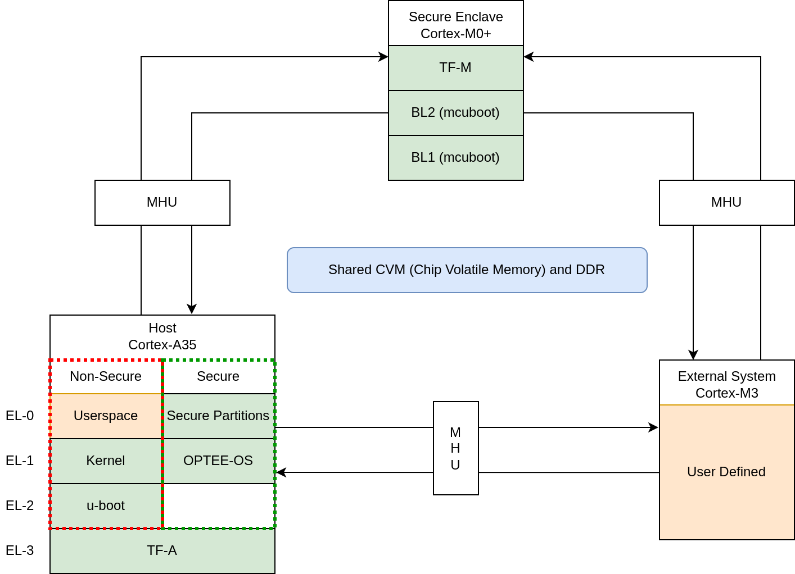
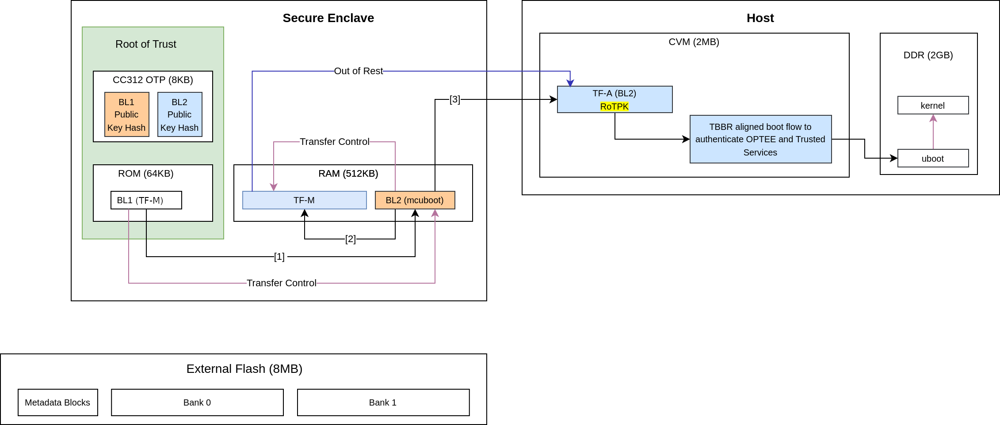
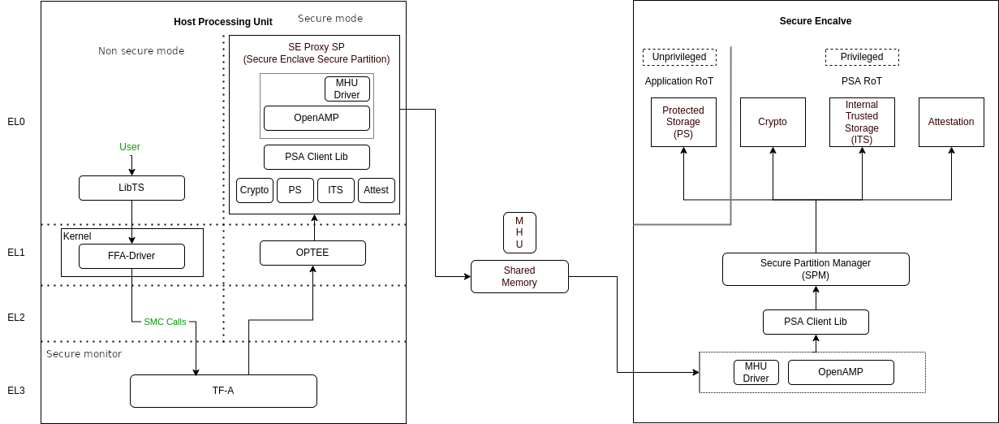
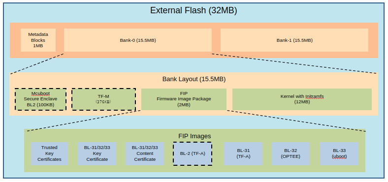
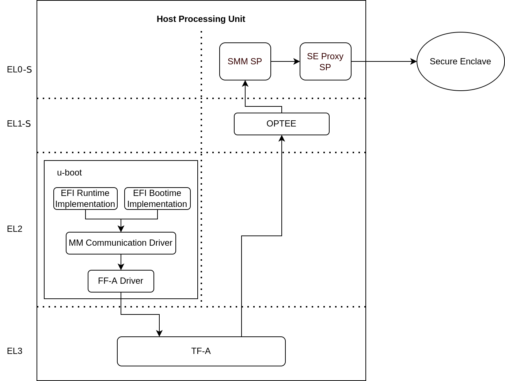

..
 # Copyright (c) 2022, Arm Limited.
 #
 # SPDX-License-Identifier: MIT

######################
Software architecture
######################

*****************
ARM corstone1000
*****************

ARM corstone1000 is a reference solution for IoT devices. It is part of
Total Solution for IoT which consists of hardware and software reference
implementation.

Corstone1000 software plus hardware reference solution is PSA Level-2 ready
certified (`PSA L2 Ready`_) as well as System Ready IR certified(`SRIR cert`_).
More information on the corstone1000 subsystem product and design can be
found at:
`Arm corstone1000 Software`_ and `Arm corstone1000 Technical Overview`_.

This readme explicitly focuses on the software part of the solution and
provides internal details on the software components. The reference
software package of the platform can be retrieved following instructions
present in the user-guide document.

***************
Design Overview
***************

The software architecture of corstone1000 platform is a reference
implementation of Platform Security Architecture (`PSA`_) which provides
framework to build secure IoT devices.

The base system architecture of the platform is created from three
different tyes of systems: Secure Enclave, Host and External System.
Each subsystem provides different functionality to overall SoC.

The Secure Enclave System, provides PSA Root of Trust (RoT) and
cryptographic functions. It is based on an Cortex-M0+ processor,
CC312 Cryptographic Accelerator and peripherals, such as watchdog and
secure flash. Software running on the Secure Enclave is isolated via
hardware for enhanced security. Communication with the Secure Encalve
is achieved using Message Hnadling Units (MHUs) and shared memory.
On system power on, the Secure Enclaves boots first. Its software
comprises of two boot loading stages, both based on mcuboot, and
TrustedFirmware-M(`TF-M`_) as runtime software. The software design on 
Secure Enclave follows Firmware Framework for M class
processor (`FF-M`_) specification.

The Host System is based on ARM Cotex-A35 processor with standardized
peripherals to allow for the booting of a Linux OS. The Cortex-A35 has
the TrustZone technology that allows secure and non-secure security
states in the processor. The software design in the Host System follows
Firmware Framework for A class procseeor (`FF-A`_) specification.
The boot process follows Trusted Boot Base Requirement (`TBBR`_).
The Host Subsystem is taken out of reset by the Secure Enclave system
during its final stages of the initialization. The Host subsystem runs
FF-A Secure Partitions(based on `Trusted Services`_) and OPTEE-OS
(`OPTEE-OS`_) in the secure world, and u-boot(`u-boot repo`_) and
linux (`linux repo`_) in the non-secure world. The communication between
non-secure and the secure world is performed via FF-A messages.

An external system is intended to implement use-case specific
functionality. The system is based on Cortex-M3 and run RTX RTOS.
Communictaion between external system and Host(cortex-A35) is performed
using MHU as transport mechanism and rpmsg messaging system.

Overall, the corstone1000 architecture is designed to cover a range
of Power, Performance, and Area (PPA) applications, and enable extension
for use-case specific applications, for example, sensors, cloud
connectivitiy, and edge computing.

*****************
Secure Boot Chain
*****************

For the security of a device, it is essential that only authorized
software should run on the device. The corstone1000 boot uses a
Secure Boot Chain process where an already authenticated image verifies
and loads the following software in the chain. For the boot chain
process to work, the start of the chain should be trusted, forming the
Root of Trust (RoT) of the device. The RoT of the device is immutable in
nature and encoded into the device by the device owner before it
is deployed into the field. In Corstone1000, the BL1 image of the secure
enclave and content of the CC312 OTP (One Time Programmable) memory
forms the RoT. The BL1 image exists in ROM (Read Only Memory).

It is a lengthy chain to boot the software on corstone1000. On power on,
the secure enclave starts executing BL1 code from the ROM which is the RoT
of the device. Authentication of an image involves the steps listed below:

- Load image from flash to dynamic RAM.
- The public key present in the image header is validated by comparing with the hash. Depending on the image, the hash of the public key is either stored in the OTP or part of the software which is being already verfied in the previous stages.
- The image is validated using the public key.

In the secure enclave, BL1 authenticates the BL2 and passes the execution
control. BL2 authenticates the initial boot loader of the host (Host BL2)
and TF-M. The execution control is now passed to TF-M. TF-M being the run
time executable of secure enclaves initializes itself and, in the end,
brings the host CPU out of rest. The host follows the boot standard defined
in the `TBBR`_ to authenticate the secure and non-secure software.

***************
Secure Services
***************

corstone1000 is unique in providing a secure environment to run a secure
workload. The platform has Trustzone technology in the Host subsystem but
it also has hardware isolated secure enclave environment to run such secure
workloads. In corstone1000, known Secure Services such as Crypto, Protected
Storage, Internal Trusted Storage and Attestation are available via PSA
Functional APIs in TF-M. There is no difference for a user communicating to
these services which are running on a secure enclave instead of the
secure world of the host subsystem. The below diagram presents the data
flow path for such calls.

The SE Proxy SP (Secure Enclave Proxy Secure Partition) is a proxy partition
managed by OPTEE which forwards such calls to the secure enclave. The
solution relies on OpenAMP which uses shared memory and MHU interrupts as
a doorbell for communication between two cores. corstone1000 implements
isolation level 2. Cortex-M0+ MPU (Memory Protection Unit) is used to implement
isolation level 2.

For a user to define its own secure service, both the options of the host
secure world or secure encalve are available. It's a trade-off between
lower latency vs higher security. Services running on a secure enclave are
secure by real hardware isolation but have a higher latency path. In the
second scenario, the services running on the secure world of the host
subsystem have lower latency but virtual hardware isolation created by
Trustzone technology.

**********************
Secure Firmware Update
**********************

Apart from always booting the authorized images, it is also essential that
the device only accepts the authorized images in the firmware update
process. corstone1000 supports OTA (Over the Air) firmware updates and
follows Platform Security Firmware Update sepcification (`FWU`_).

As standardized into `FWU`_, the external flash is divided into two
banks of which one bank has currently running images and the other bank is
used for staging new images.  There are four updatable units, i.e. Secure
Enclave's BL2 and TF-M, and Host's FIP (Firmware Image Package) and Kernel
Image. The new images are accepted in the form of a UEFI capsule.

The Metadata Block in the flash has the below firmware update state machine.
TF-M runs an OTA service that is responsible for accepting and updating the
images in the flash. The communication between the UEFI Capsule update
subsystem and the OTA service follows the same data path explained above.
The OTA service writes the new images to the passive bank after successful
capsule verification. It changes the state of the system to trial state and
triggers the reset. Boot loaders in Secure Enclave and Host read the Metadata
block to get the information on the boot bank. In the successful trial stage,
the acknowledgment from the host moves the state of the system from trial to
regular. Any failure in the trial stage or system hangs leads to a system
reset. This is made sure by the use of watchdog hardware. The Secure Enclave's
BL1 has the logic to identify multiple resets and eventually switch back to the
previous good bank. The ability to revert to the previous bank is crucial to
guarantee the availability of the device.

.. image:: images/SecureFirmwareUpdate.png
   :width: 430
   :alt: SecureFirmwareUpdate

******************************
UEFI Runtime Support in u-boot
******************************

Implementation of UEFI boottime and runtime APIs require variable storage.
In corstone1000, these UEFI variables are stored in the Protected Storage
service. The below diagram presents the data flow to store UEFI variables.
The u-boot implementation of the UEFI subsystem uses the FF-A driver to
communicate with the SMM Service in the secure world. The backend of the
SMM service uses the proxy PS from the SE Proxy SP. From there on, the PS
calls are forwarded to the secure enclave as explained above.

***************
References
***************
`ARM corstone1000 Search`_
`Arm security features`_

--------------

*Copyright (c) 2022, Arm Limited. All rights reserved.*

.. _Arm corstone1000 Technical Overview: https://developer.arm.com/documentation/102360/0000
.. _Arm corstone1000 Software: https://developer.arm.com/Tools%20and%20Software/Corstone-1000%20Software
.. _Arm corstone1000 Search: https://developer.arm.com/search#q=corstone-1000
.. _Arm security features: https://www.arm.com/architecture/security-features/platform-security
.. _linux repo: https://git.kernel.org/pub/scm/linux/kernel/git/stable/linux.git/
.. _FF-A: https://developer.arm.com/documentation/den0077/latest
.. _FF-M: https://developer.arm.com/-/media/Files/pdf/PlatformSecurityArchitecture/Architect/DEN0063-PSA_Firmware_Framework-1.0.0-2.pdf?revision=2d1429fa-4b5b-461a-a60e-4ef3d8f7f4b4&hash=3BFD6F3E687F324672F18E5BE9F08EDC48087C93
.. _FWU: https://developer.arm.com/documentation/den0118/a/
.. _OPTEE-OS: https://github.com/OP-TEE/optee_os
.. _PSA: https://www.psacertified.org/
.. _PSA L2 Ready: https://www.psacertified.org/products/corstone-1000/
.. _SRIR cert: https://armkeil.blob.core.windows.net/developer/Files/pdf/certificate-list/arm-systemready-ir-certification-arm-corstone-1000.pdf
.. _TBBR: https://developer.arm.com/documentation/den0006/latest
.. _TF-M: https://www.trustedfirmware.org/projects/tf-m/
.. _Trusted Services: https://www.trustedfirmware.org/projects/trusted-services/
.. _u-boot repo: https://github.com/u-boot/u-boot.git
