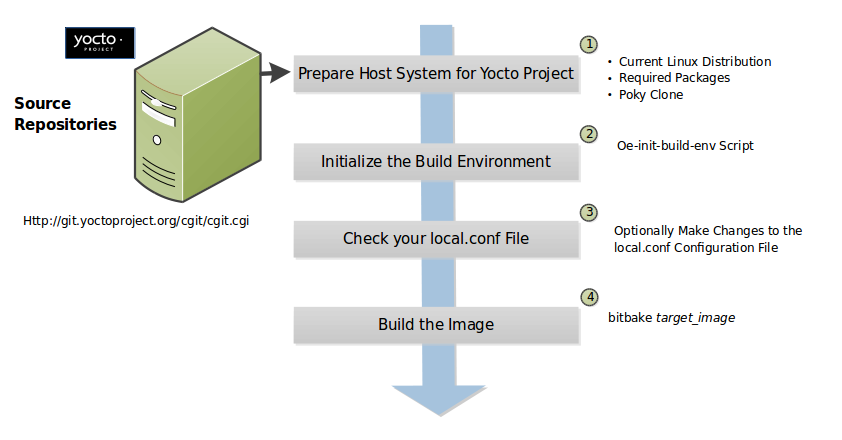

.. SPDX-License-Identifier: CC-BY-SA-2.0-UK

Building
********

This section describes various build procedures, such as the steps
needed for a simple build, building a target for multiple configurations,
generating an image for more than one machine, and so forth.

Building a Simple Image
=======================

In the development environment, you need to build an image whenever you
change hardware support, add or change system libraries, or add or
change services that have dependencies. There are several methods that allow
you to build an image within the Yocto Project. This section presents
the basic steps you need to build a simple image using BitBake from a
build host running Linux.

.. note::

   -  For information on how to build an image using
      :term:`Toaster`, see the
      :doc:`/toaster-manual/index`.

   -  For information on how to use ``devtool`` to build images, see the
      ":ref:`sdk-manual/extensible:using \`\`devtool\`\` in your sdk workflow`"
      section in the Yocto Project Application Development and the
      Extensible Software Development Kit (eSDK) manual.

   -  For a quick example on how to build an image using the
      OpenEmbedded build system, see the
      :doc:`/brief-yoctoprojectqs/index` document.

   -  You can also use the `Yocto Project BitBake
      <https://marketplace.visualstudio.com/items?itemName=yocto-project.yocto-bitbake>`__
      extension for Visual Studio Code to build images.

The build process creates an entire Linux distribution from source and
places it in your :term:`Build Directory` under ``tmp/deploy/images``. For
detailed information on the build process using BitBake, see the
":ref:`overview-manual/concepts:images`" section in the Yocto Project Overview
and Concepts Manual.

The following figure and list overviews the build process:

#. *Set up Your Host Development System to Support Development Using the
   Yocto Project*: See the ":doc:`start`" section for options on how to get a
   build host ready to use the Yocto Project.

#. *Initialize the Build Environment:* Initialize the build environment
   by sourcing the build environment script (i.e.
   :ref:`structure-core-script`)::

      $ source oe-init-build-env [build_dir]

   When you use the initialization script, the OpenEmbedded build system
   uses ``build`` as the default :term:`Build Directory` in your current work
   directory. You can use a `build_dir` argument with the script to
   specify a different :term:`Build Directory`.

   .. note::

      A common practice is to use a different :term:`Build Directory` for
      different targets; for example, ``~/build/x86`` for a ``qemux86``
      target, and ``~/build/arm`` for a ``qemuarm`` target. In any
      event, it's typically cleaner to locate the :term:`Build Directory`
      somewhere outside of your source directory.

#. *Make Sure Your* ``local.conf`` *File is Correct*: Ensure the
   ``conf/local.conf`` configuration file, which is found in the
   :term:`Build Directory`, is set up how you want it. This file defines many
   aspects of the build environment including the target machine architecture
   through the :term:`MACHINE` variable, the packaging format used during
   the build (:term:`PACKAGE_CLASSES`), and a centralized tarball download
   directory through the :term:`DL_DIR` variable.

#. *Build the Image:* Build the image using the ``bitbake`` command::

      $ bitbake target

   .. note::

      For information on BitBake, see the :doc:`bitbake:index`.

   The target is the name of the recipe you want to build. Common
   targets are the images in ``meta/recipes-core/images``,
   ``meta/recipes-sato/images``, and so forth all found in the
   :term:`Source Directory`. Alternatively, the target
   can be the name of a recipe for a specific piece of software such as
   BusyBox. For more details about the images the OpenEmbedded build
   system supports, see the
   ":ref:`ref-manual/images:Images`" chapter in the Yocto
   Project Reference Manual.

   As an example, the following command builds the
   ``core-image-minimal`` image::

      $ bitbake core-image-minimal

   Once an
   image has been built, it often needs to be installed. The images and
   kernels built by the OpenEmbedded build system are placed in the
   :term:`Build Directory` in ``tmp/deploy/images``. For information on how to
   run pre-built images such as ``qemux86`` and ``qemuarm``, see the
   :doc:`/sdk-manual/index` manual. For
   information about how to install these images, see the documentation
   for your particular board or machine.

Building Images for Multiple Targets Using Multiple Configurations
==================================================================

You can use a single ``bitbake`` command to build multiple images or
packages for different targets where each image or package requires a
different configuration (multiple configuration builds). The builds, in
this scenario, are sometimes referred to as "multiconfigs", and this
section uses that term throughout.

This section describes how to set up for multiple configuration builds
and how to account for cross-build dependencies between the
multiconfigs.

Setting Up and Running a Multiple Configuration Build
-----------------------------------------------------

To accomplish a multiple configuration build, you must define each
target's configuration separately using a parallel configuration file in
the :term:`Build Directory` or configuration directory within a layer, and you
must follow a required file hierarchy. Additionally, you must enable the
multiple configuration builds in your ``local.conf`` file.

Follow these steps to set up and execute multiple configuration builds:

-  *Create Separate Configuration Files*: You need to create a single
   configuration file for each build target (each multiconfig).
   The configuration definitions are implementation dependent but often
   each configuration file will define the machine and the
   temporary directory BitBake uses for the build. Whether the same
   temporary directory (:term:`TMPDIR`) can be shared will depend on what is
   similar and what is different between the configurations. Multiple MACHINE
   targets can share the same (:term:`TMPDIR`) as long as the rest of the
   configuration is the same, multiple :term:`DISTRO` settings would need separate
   (:term:`TMPDIR`) directories.

   For example, consider a scenario with two different multiconfigs for the same
   :term:`MACHINE`: "qemux86" built
   for two distributions such as "poky" and "poky-lsb". In this case,
   you would need to use the different :term:`TMPDIR`.

   Here is an example showing the minimal statements needed in a
   configuration file for a "qemux86" target whose temporary build
   directory is ``tmpmultix86``::

      MACHINE = "qemux86"
      TMPDIR = "${TOPDIR}/tmpmultix86"

   The location for these multiconfig configuration files is specific.
   They must reside in the current :term:`Build Directory` in a sub-directory of
   ``conf`` named ``multiconfig`` or within a layer's ``conf`` directory
   under a directory named ``multiconfig``. Here is an example that defines
   two configuration files for the "x86" and "arm" multiconfigs:

   .. image:: figures/multiconfig_files.png
      :align: center
      :width: 50%

   The usual :term:`BBPATH` search path is used to locate multiconfig files in
   a similar way to other conf files.

-  *Add the BitBake Multi-configuration Variable to the Local
   Configuration File*: Use the
   :term:`BBMULTICONFIG`
   variable in your ``conf/local.conf`` configuration file to specify
   each multiconfig. Continuing with the example from the previous
   figure, the :term:`BBMULTICONFIG` variable needs to enable two
   multiconfigs: "x86" and "arm" by specifying each configuration file::

      BBMULTICONFIG = "x86 arm"

   .. note::

      A "default" configuration already exists by definition. This
      configuration is named: "" (i.e. empty string) and is defined by
      the variables coming from your ``local.conf``
      file. Consequently, the previous example actually adds two
      additional configurations to your build: "arm" and "x86" along
      with "".

-  *Launch BitBake*: Use the following BitBake command form to launch
   the multiple configuration build::

      $ bitbake [mc:multiconfigname:]target [[[mc:multiconfigname:]target] ... ]

   For the example in this section, the following command applies::

      $ bitbake mc:x86:core-image-minimal mc:arm:core-image-sato mc::core-image-base

   The previous BitBake command builds a ``core-image-minimal`` image
   that is configured through the ``x86.conf`` configuration file, a
   ``core-image-sato`` image that is configured through the ``arm.conf``
   configuration file and a ``core-image-base`` that is configured
   through your ``local.conf`` configuration file.

.. note::

   Support for multiple configuration builds in the Yocto Project &DISTRO;
   (&DISTRO_NAME;) Release does not include Shared State (sstate)
   optimizations. Consequently, if a build uses the same object twice
   in, for example, two different :term:`TMPDIR`
   directories, the build either loads from an existing sstate cache for
   that build at the start or builds the object fresh.

Enabling Multiple Configuration Build Dependencies
--------------------------------------------------

Sometimes dependencies can exist between targets (multiconfigs) in a
multiple configuration build. For example, suppose that in order to
build a ``core-image-sato`` image for an "x86" multiconfig, the root
filesystem of an "arm" multiconfig must exist. This dependency is
essentially that the
:ref:`ref-tasks-image` task in the
``core-image-sato`` recipe depends on the completion of the
:ref:`ref-tasks-rootfs` task of the
``core-image-minimal`` recipe.

To enable dependencies in a multiple configuration build, you must
declare the dependencies in the recipe using the following statement
form::

   task_or_package[mcdepends] = "mc:from_multiconfig:to_multiconfig:recipe_name:task_on_which_to_depend"

To better show how to use this statement, consider the example scenario
from the first paragraph of this section. The following statement needs
to be added to the recipe that builds the ``core-image-sato`` image::

   do_image[mcdepends] = "mc:x86:arm:core-image-minimal:do_rootfs"

In this example, the `from_multiconfig` is "x86". The `to_multiconfig` is "arm". The
task on which the :ref:`ref-tasks-image` task in the recipe depends is the
:ref:`ref-tasks-rootfs` task from the ``core-image-minimal`` recipe associated
with the "arm" multiconfig.

Once you set up this dependency, you can build the "x86" multiconfig
using a BitBake command as follows::

   $ bitbake mc:x86:core-image-sato

This command executes all the tasks needed to create the
``core-image-sato`` image for the "x86" multiconfig. Because of the
dependency, BitBake also executes through the :ref:`ref-tasks-rootfs` task for the
"arm" multiconfig build.

Having a recipe depend on the root filesystem of another build might not
seem that useful. Consider this change to the statement in the
``core-image-sato`` recipe::

   do_image[mcdepends] = "mc:x86:arm:core-image-minimal:do_image"

In this case, BitBake must
create the ``core-image-minimal`` image for the "arm" build since the
"x86" build depends on it.

Because "x86" and "arm" are enabled for multiple configuration builds
and have separate configuration files, BitBake places the artifacts for
each build in the respective temporary build directories (i.e.
:term:`TMPDIR`).

Building an Initial RAM Filesystem (Initramfs) Image
====================================================

An initial RAM filesystem (:term:`Initramfs`) image provides a temporary root
filesystem used for early system initialization, typically providing tools and
loading modules needed to locate and mount the final root filesystem.

Follow these steps to create an :term:`Initramfs` image:

#. *Create the Initramfs Image Recipe:* You can reference the
   ``core-image-minimal-initramfs.bb`` recipe found in the
   ``meta/recipes-core`` directory of the :term:`Source Directory`
   as an example from which to work. The ``core-image-minimal-initramfs`` recipe
   is based on the :ref:`initramfs-framework <dev-manual/building:Customizing an
   Initramfs using \`\`initramfs-framework\`\`>` recipe described below.

#. *Decide if You Need to Bundle the Initramfs Image Into the Kernel
   Image:* If you want the :term:`Initramfs` image that is built to be bundled
   in with the kernel image, set the :term:`INITRAMFS_IMAGE_BUNDLE`
   variable to ``"1"`` in your ``local.conf`` configuration file and set the
   :term:`INITRAMFS_IMAGE` variable in the recipe that builds the kernel image.

   Setting the :term:`INITRAMFS_IMAGE_BUNDLE` flag causes the :term:`Initramfs`
   image to be unpacked into the ``${B}/usr/`` directory. The unpacked
   :term:`Initramfs` image is then passed to the kernel's ``Makefile`` using the
   :term:`CONFIG_INITRAMFS_SOURCE` variable, allowing the :term:`Initramfs`
   image to be built into the kernel normally.

#. *Optionally Add Items to the Initramfs Image Through the Initramfs
   Image Recipe:* If you add items to the :term:`Initramfs` image by way of its
   recipe, you should use :term:`PACKAGE_INSTALL` rather than
   :term:`IMAGE_INSTALL`. :term:`PACKAGE_INSTALL` gives more direct control of
   what is added to the image as compared to the defaults you might not
   necessarily want that are set by the :ref:`ref-classes-image`
   or :ref:`ref-classes-core-image` classes.

#. *Build the Kernel Image and the Initramfs Image:* Build your kernel
   image using BitBake. Because the :term:`Initramfs` image recipe is a
   dependency of the kernel image, the :term:`Initramfs` image is built as well
   and bundled with the kernel image if you used the
   :term:`INITRAMFS_IMAGE_BUNDLE` variable described earlier.

Customizing an Initramfs using ``initramfs-framework``
------------------------------------------------------

The ``core-image-minimal-initramfs.bb`` recipe found in
:oe_git:`meta/recipes-core/images
</openembedded-core/tree/meta/recipes-core/images>` uses the
:oe_git:`initramfs-framework_1.0.bb
</openembedded-core/tree/meta/recipes-core/initrdscripts/initramfs-framework_1.0.bb>`
recipe as its base component. The goal of the ``initramfs-framework`` recipe is
to provide the building blocks to build a customized :term:`Initramfs`.

The ``initramfs-framework`` recipe relies on shell initialization scripts
defined in :oe_git:`meta/recipes-core/initrdscripts/initramfs-framework
</openembedded-core/tree/meta/recipes-core/initrdscripts/initramfs-framework>`. Since some of
these scripts do not apply for all use cases, the ``initramfs-framework`` recipe
defines different packages:

-  ``initramfs-framework-base``: this package installs the basic components of
   an :term:`Initramfs`, such as the ``init`` script or the ``/dev/console``
   character special file. As this package is a runtime dependency of all
   modules listed below, it is automatically pulled in when one of the modules
   is installed in the image.
-  ``initramfs-module-exec``: support for execution of applications.
-  ``initramfs-module-mdev``: support for `mdev
   <https://wiki.gentoo.org/wiki/Mdev>`__.
-  ``initramfs-module-udev``: support for :wikipedia:`Udev <Udev>`.
-  ``initramfs-module-e2fs``: support for :wikipedia:`ext4/ext3/ext2
   <Extended_file_system>` filesystems.
-  ``initramfs-module-nfsrootfs``: support for locating and mounting the root
   partition via :wikipedia:`NFS <Network_File_System>`.
-  ``initramfs-module-rootfs``: support for locating and mounting the root
   partition.
-  ``initramfs-module-debug``: dynamic debug support.
-  ``initramfs-module-lvm``: :wikipedia:`LVM <Logical_volume_management>` rootfs support.
-  ``initramfs-module-overlayroot``: support for mounting a read-write overlay
   on top of a read-only root filesystem.

In addition to the packages defined by the ``initramfs-framework`` recipe
itself, the following packages are defined by the recipes present in
:oe_git:`meta/recipes-core/initrdscripts </openembedded-core/tree/meta/recipes-core/initrdscripts>`:

-  ``initramfs-module-install``: module to create and install a partition layout
   on a selected block device.
-  ``initramfs-module-install-efi``: module to create and install an EFI
   partition layout on a selected block device.
-  ``initramfs-module-setup-live``: module to start a shell in the
   :term:`Initramfs` if ``root=/dev/ram0`` in passed in the `Kernel command-line
   <https://www.kernel.org/doc/html/latest/admin-guide/kernel-parameters.html>`__
   or the ``root=`` parameter was not passed.

To customize the :term:`Initramfs`, you can add or remove packages listed
earlier from the :term:`PACKAGE_INSTALL` variable with a :ref:`bbappend
<dev-manual/layers:Appending Other Layers Metadata With Your Layer>` on the
``core-image-minimal-initramfs`` recipe, or create a custom recipe for the
:term:`Initramfs` taking ``core-image-minimal-initramfs`` as example.

Custom scripts can be added to the :term:`Initramfs` by writing your own
recipes. The recipes are conventionally named ``initramfs-module-<module name>``
where ``<module name>`` is the name of the module. The recipe should set its
:term:`RDEPENDS` package-specific variables to include
``initramfs-framework-base`` and the other packages on which the module depends
at runtime.

The recipe must install shell initialization scripts in :term:`${D} <D>`\
``/init.d`` and must follow the ``<number>-<script name>`` naming scheme where:

-  ``<number>`` is a *two-digit* number that affects the execution order of the
   script compared to others. For example, the script ``80-setup-live`` would be
   executed after ``01-udev`` because 80 is greater than 01.

   This number being two-digits is important here as the scripts are executed
   alphabetically. For example, the script ``10-script`` would be executed
   before the script ``8-script``, because ``1`` is inferior to ``8``.
   Therefore, the script should be named ``08-script``.

-  ``<script name>`` is the script name which you can choose freely.

   If two script use the same ``<number>``, they are sorted alphabetically based
   on ``<script name>``.

Bundling an Initramfs Image From a Separate Multiconfig
-------------------------------------------------------

There may be a case where we want to build an :term:`Initramfs` image which does not
inherit the same distro policy as our main image, for example, we may want
our main image to use ``TCLIBC="glibc"``, but to use ``TCLIBC="musl"`` in our :term:`Initramfs`
image to keep a smaller footprint. However, by performing the steps mentioned
above the :term:`Initramfs` image will inherit ``TCLIBC="glibc"`` without allowing us
to override it.

To achieve this, you need to perform some additional steps:

#. *Create a multiconfig for your Initramfs image:* You can perform the steps
   on ":ref:`dev-manual/building:building images for multiple targets using multiple configurations`" to create a separate multiconfig.
   For the sake of simplicity let's assume such multiconfig is called: ``initramfscfg.conf`` and
   contains the variables::

      TMPDIR="${TOPDIR}/tmp-initramfscfg"
      TCLIBC="musl"

#. *Set additional Initramfs variables on your main configuration:*
   Additionally, on your main configuration (``local.conf``) you need to set the
   variables::

     INITRAMFS_MULTICONFIG = "initramfscfg"
     INITRAMFS_DEPLOY_DIR_IMAGE = "${TOPDIR}/tmp-initramfscfg/deploy/images/${MACHINE}"

   The variables :term:`INITRAMFS_MULTICONFIG` and :term:`INITRAMFS_DEPLOY_DIR_IMAGE`
   are used to create a multiconfig dependency from the kernel to the :term:`INITRAMFS_IMAGE`
   to be built coming from the ``initramfscfg`` multiconfig, and to let the
   buildsystem know where the :term:`INITRAMFS_IMAGE` will be located.

   Building a system with such configuration will build the kernel using the
   main configuration but the :ref:`ref-tasks-bundle_initramfs` task will grab the
   selected :term:`INITRAMFS_IMAGE` from :term:`INITRAMFS_DEPLOY_DIR_IMAGE`
   instead, resulting in a musl based :term:`Initramfs` image bundled in the kernel
   but a glibc based main image.

   The same is applicable to avoid inheriting :term:`DISTRO_FEATURES` on :term:`INITRAMFS_IMAGE`
   or to build a different :term:`DISTRO` for it such as ``poky-tiny``.

Building a Tiny System
======================

Very small distributions have some significant advantages such as
requiring less on-die or in-package memory (cheaper), better performance
through efficient cache usage, lower power requirements due to less
memory, faster boot times, and reduced development overhead. Some
real-world examples where a very small distribution gives you distinct
advantages are digital cameras, medical devices, and small headless
systems.

This section presents information that shows you how you can trim your
distribution to even smaller sizes than the ``poky-tiny`` distribution,
which is around 5 Mbytes, that can be built out-of-the-box using the
Yocto Project.

Tiny System Overview
--------------------

The following list presents the overall steps you need to consider and
perform to create distributions with smaller root filesystems, achieve
faster boot times, maintain your critical functionality, and avoid
initial RAM disks:

-  :ref:`Determine your goals and guiding principles
   <dev-manual/building:goals and guiding principles>`

-  :ref:`dev-manual/building:understand what contributes to your image size`

-  :ref:`Reduce the size of the root filesystem
   <dev-manual/building:trim the root filesystem>`

-  :ref:`Reduce the size of the kernel <dev-manual/building:trim the kernel>`

-  :ref:`dev-manual/building:remove package management requirements`

-  :ref:`dev-manual/building:look for other ways to minimize size`

-  :ref:`dev-manual/building:iterate on the process`

Goals and Guiding Principles
----------------------------

Before you can reach your destination, you need to know where you are
going. Here is an example list that you can use as a guide when creating
very small distributions:

-  Determine how much space you need (e.g. a kernel that is 1 Mbyte or
   less and a root filesystem that is 3 Mbytes or less).

-  Find the areas that are currently taking 90% of the space and
   concentrate on reducing those areas.

-  Do not create any difficult "hacks" to achieve your goals.

-  Leverage the device-specific options.

-  Work in a separate layer so that you keep changes isolated. For
   information on how to create layers, see the
   ":ref:`dev-manual/layers:understanding and creating layers`" section.

Understand What Contributes to Your Image Size
----------------------------------------------

It is easiest to have something to start with when creating your own
distribution. You can use the Yocto Project out-of-the-box to create the
``poky-tiny`` distribution. Ultimately, you will want to make changes in
your own distribution that are likely modeled after ``poky-tiny``.

.. note::

   To use ``poky-tiny`` in your build, set the :term:`DISTRO` variable in your
   ``local.conf`` file to "poky-tiny" as described in the
   ":ref:`dev-manual/custom-distribution:creating your own distribution`"
   section.

Understanding some memory concepts will help you reduce the system size.
Memory consists of static, dynamic, and temporary memory. Static memory
is the TEXT (code), DATA (initialized data in the code), and BSS
(uninitialized data) sections. Dynamic memory represents memory that is
allocated at runtime: stacks, hash tables, and so forth. Temporary
memory is recovered after the boot process. This memory consists of
memory used for decompressing the kernel and for the ``__init__``
functions.

To help you see where you currently are with kernel and root filesystem
sizes, you can use two tools found in the :term:`Source Directory`
in the
``scripts/tiny/`` directory:

-  ``ksize.py``: Reports component sizes for the kernel build objects.

-  ``dirsize.py``: Reports component sizes for the root filesystem.

This next tool and command help you organize configuration fragments and
view file dependencies in a human-readable form:

-  ``merge_config.sh``: Helps you manage configuration files and
   fragments within the kernel. With this tool, you can merge individual
   configuration fragments together. The tool allows you to make
   overrides and warns you of any missing configuration options. The
   tool is ideal for allowing you to iterate on configurations, create
   minimal configurations, and create configuration files for different
   machines without having to duplicate your process.

   The ``merge_config.sh`` script is part of the Linux Yocto kernel Git
   repositories (i.e. ``linux-yocto-3.14``, ``linux-yocto-3.10``,
   ``linux-yocto-3.8``, and so forth) in the ``scripts/kconfig``
   directory.

   For more information on configuration fragments, see the
   ":ref:`kernel-dev/common:creating configuration fragments`"
   section in the Yocto Project Linux Kernel Development Manual.

-  ``bitbake -u taskexp -g bitbake_target``: Using the BitBake command
   with these options brings up a Dependency Explorer from which you can
   view file dependencies. Understanding these dependencies allows you
   to make informed decisions when cutting out various pieces of the
   kernel and root filesystem.

Trim the Root Filesystem
------------------------

The root filesystem is made up of packages for booting, libraries, and
applications. To change things, you can configure how the packaging
happens, which changes the way you build them. You can also modify the
filesystem itself or select a different filesystem.

First, find out what is hogging your root filesystem by running the
``dirsize.py`` script from your root directory::

   $ cd root-directory-of-image
   $ dirsize.py 100000 > dirsize-100k.log
   $ cat dirsize-100k.log

You can apply a filter to the script to ignore files
under a certain size. The previous example filters out any files below
100 Kbytes. The sizes reported by the tool are uncompressed, and thus
will be smaller by a relatively constant factor in a compressed root
filesystem. When you examine your log file, you can focus on areas of
the root filesystem that take up large amounts of memory.

You need to be sure that what you eliminate does not cripple the
functionality you need. One way to see how packages relate to each other
is by using the Dependency Explorer UI with the BitBake command::

   $ cd image-directory
   $ bitbake -u taskexp -g image

Use the interface to
select potential packages you wish to eliminate and see their dependency
relationships.

When deciding how to reduce the size, get rid of packages that result in
minimal impact on the feature set. For example, you might not need a VGA
display. Or, you might be able to get by with ``devtmpfs`` and ``mdev``
instead of ``udev``.

Use your ``local.conf`` file to make changes. For example, to eliminate
``udev`` and ``glib``, set the following in the local configuration
file::

   VIRTUAL-RUNTIME_dev_manager = ""

Finally, you should consider exactly the type of root filesystem you
need to meet your needs while also reducing its size. For example,
consider ``cramfs``, ``squashfs``, ``ubifs``, ``ext2``, or an
:term:`Initramfs` using ``initramfs``. Be aware that ``ext3`` requires a 1
Mbyte journal. If you are okay with running read-only, you do not need
this journal.

.. note::

   After each round of elimination, you need to rebuild your system and
   then use the tools to see the effects of your reductions.

Trim the Kernel
---------------

The kernel is built by including policies for hardware-independent
aspects. What subsystems do you enable? For what architecture are you
building? Which drivers do you build by default?

.. note::

   You can modify the kernel source if you want to help with boot time.

Run the ``ksize.py`` script from the top-level Linux build directory to
get an idea of what is making up the kernel::

   $ cd top-level-linux-build-directory
   $ ksize.py > ksize.log
   $ cat ksize.log

When you examine the log, you will see how much space is taken up with
the built-in ``.o`` files for drivers, networking, core kernel files,
filesystem, sound, and so forth. The sizes reported by the tool are
uncompressed, and thus will be smaller by a relatively constant factor
in a compressed kernel image. Look to reduce the areas that are large
and taking up around the "90% rule."

To examine, or drill down, into any particular area, use the ``-d``
option with the script::

   $ ksize.py -d > ksize.log

Using this option
breaks out the individual file information for each area of the kernel
(e.g. drivers, networking, and so forth).

Use your log file to see what you can eliminate from the kernel based on
features you can let go. For example, if you are not going to need
sound, you do not need any drivers that support sound.

After figuring out what to eliminate, you need to reconfigure the kernel
to reflect those changes during the next build. You could run
``menuconfig`` and make all your changes at once. However, that makes it
difficult to see the effects of your individual eliminations and also
makes it difficult to replicate the changes for perhaps another target
device. A better method is to start with no configurations using
``allnoconfig``, create configuration fragments for individual changes,
and then manage the fragments into a single configuration file using
``merge_config.sh``. The tool makes it easy for you to iterate using the
configuration change and build cycle.

Each time you make configuration changes, you need to rebuild the kernel
and check to see what impact your changes had on the overall size.

Remove Package Management Requirements
--------------------------------------

Packaging requirements add size to the image. One way to reduce the size
of the image is to remove all the packaging requirements from the image.
This reduction includes both removing the package manager and its unique
dependencies as well as removing the package management data itself.

To eliminate all the packaging requirements for an image, be sure that
"package-management" is not part of your
:term:`IMAGE_FEATURES`
statement for the image. When you remove this feature, you are removing
the package manager as well as its dependencies from the root
filesystem.

Look for Other Ways to Minimize Size
------------------------------------

Depending on your particular circumstances, other areas that you can
trim likely exist. The key to finding these areas is through tools and
methods described here combined with experimentation and iteration. Here
are a couple of areas to experiment with:

-  ``glibc``: In general, follow this process:

   #. Remove ``glibc`` features from
      :term:`DISTRO_FEATURES`
      that you think you do not need.

   #. Build your distribution.

   #. If the build fails due to missing symbols in a package, determine
      if you can reconfigure the package to not need those features. For
      example, change the configuration to not support wide character
      support as is done for ``ncurses``. Or, if support for those
      characters is needed, determine what ``glibc`` features provide
      the support and restore the configuration.

   4. Rebuild and repeat the process.

-  ``busybox``: For BusyBox, use a process similar as described for
   ``glibc``. A difference is you will need to boot the resulting system
   to see if you are able to do everything you expect from the running
   system. You need to be sure to integrate configuration fragments into
   Busybox because BusyBox handles its own core features and then allows
   you to add configuration fragments on top.

Iterate on the Process
----------------------

If you have not reached your goals on system size, you need to iterate
on the process. The process is the same. Use the tools and see just what
is taking up 90% of the root filesystem and the kernel. Decide what you
can eliminate without limiting your device beyond what you need.

Depending on your system, a good place to look might be Busybox, which
provides a stripped down version of Unix tools in a single, executable
file. You might be able to drop virtual terminal services or perhaps
ipv6.

Building Images for More than One Machine
=========================================

A common scenario developers face is creating images for several
different machines that use the same software environment. In this
situation, it is tempting to set the tunings and optimization flags for
each build specifically for the targeted hardware (i.e. "maxing out" the
tunings). Doing so can considerably add to build times and package feed
maintenance collectively for the machines. For example, selecting tunes
that are extremely specific to a CPU core used in a system might enable
some micro optimizations in GCC for that particular system but would
otherwise not gain you much of a performance difference across the other
systems as compared to using a more general tuning across all the builds
(e.g. setting :term:`DEFAULTTUNE`
specifically for each machine's build). Rather than "max out" each
build's tunings, you can take steps that cause the OpenEmbedded build
system to reuse software across the various machines where it makes
sense.

If build speed and package feed maintenance are considerations, you
should consider the points in this section that can help you optimize
your tunings to best consider build times and package feed maintenance.

-  *Share the :term:`Build Directory`:* If at all possible, share the
   :term:`TMPDIR` across builds. The Yocto Project supports switching between
   different :term:`MACHINE` values in the same :term:`TMPDIR`. This practice
   is well supported and regularly used by developers when building for
   multiple machines. When you use the same :term:`TMPDIR` for multiple
   machine builds, the OpenEmbedded build system can reuse the existing native
   and often cross-recipes for multiple machines. Thus, build time decreases.

   .. note::

      If :term:`DISTRO` settings change or fundamental configuration settings
      such as the filesystem layout, you need to work with a clean :term:`TMPDIR`.
      Sharing :term:`TMPDIR` under these circumstances might work but since it is
      not guaranteed, you should use a clean :term:`TMPDIR`.

-  *Enable the Appropriate Package Architecture:* By default, the
   OpenEmbedded build system enables three levels of package
   architectures: "all", "tune" or "package", and "machine". Any given
   recipe usually selects one of these package architectures (types) for
   its output. Depending for what a given recipe creates packages,
   making sure you enable the appropriate package architecture can
   directly impact the build time.

   A recipe that just generates scripts can enable "all" architecture
   because there are no binaries to build. To specifically enable "all"
   architecture, be sure your recipe inherits the
   :ref:`ref-classes-allarch` class.
   This class is useful for "all" architectures because it configures
   many variables so packages can be used across multiple architectures.

   If your recipe needs to generate packages that are machine-specific
   or when one of the build or runtime dependencies is already
   machine-architecture dependent, which makes your recipe also
   machine-architecture dependent, make sure your recipe enables the
   "machine" package architecture through the
   :term:`MACHINE_ARCH`
   variable::

      PACKAGE_ARCH = "${MACHINE_ARCH}"

   When you do not
   specifically enable a package architecture through the
   :term:`PACKAGE_ARCH`, The
   OpenEmbedded build system defaults to the
   :term:`TUNE_PKGARCH` setting::

      PACKAGE_ARCH = "${TUNE_PKGARCH}"

-  *Choose a Generic Tuning File if Possible:* Some tunes are more
   generic and can run on multiple targets (e.g. an ``armv5`` set of
   packages could run on ``armv6`` and ``armv7`` processors in most
   cases). Similarly, ``i486`` binaries could work on ``i586`` and
   higher processors. You should realize, however, that advances on
   newer processor versions would not be used.

   If you select the same tune for several different machines, the
   OpenEmbedded build system reuses software previously built, thus
   speeding up the overall build time. Realize that even though a new
   sysroot for each machine is generated, the software is not recompiled
   and only one package feed exists.

-  *Manage Granular Level Packaging:* Sometimes there are cases where
   injecting another level of package architecture beyond the three
   higher levels noted earlier can be useful. For example, consider how
   NXP (formerly Freescale) allows for the easy reuse of binary packages
   in their layer
   :yocto_git:`meta-freescale </meta-freescale/>`.
   In this example, the
   :yocto_git:`fsl-dynamic-packagearch </meta-freescale/tree/classes/fsl-dynamic-packagearch.bbclass>`
   class shares GPU packages for i.MX53 boards because all boards share
   the AMD GPU. The i.MX6-based boards can do the same because all
   boards share the Vivante GPU. This class inspects the BitBake
   datastore to identify if the package provides or depends on one of
   the sub-architecture values. If so, the class sets the
   :term:`PACKAGE_ARCH` value
   based on the ``MACHINE_SUBARCH`` value. If the package does not
   provide or depend on one of the sub-architecture values but it
   matches a value in the machine-specific filter, it sets
   :term:`MACHINE_ARCH`. This
   behavior reduces the number of packages built and saves build time by
   reusing binaries.

-  *Use Tools to Debug Issues:* Sometimes you can run into situations
   where software is being rebuilt when you think it should not be. For
   example, the OpenEmbedded build system might not be using shared
   state between machines when you think it should be. These types of
   situations are usually due to references to machine-specific
   variables such as :term:`MACHINE`,
   :term:`SERIAL_CONSOLES`,
   :term:`XSERVER`,
   :term:`MACHINE_FEATURES`,
   and so forth in code that is supposed to only be tune-specific or
   when the recipe depends
   (:term:`DEPENDS`,
   :term:`RDEPENDS`,
   :term:`RRECOMMENDS`,
   :term:`RSUGGESTS`, and so forth)
   on some other recipe that already has
   :term:`PACKAGE_ARCH` defined
   as "${MACHINE_ARCH}".

   .. note::

      Patches to fix any issues identified are most welcome as these
      issues occasionally do occur.

   For such cases, you can use some tools to help you sort out the
   situation:

   -  ``state-diff-machines.sh``*:* You can find this tool in the
      ``scripts`` directory of the Source Repositories. See the comments
      in the script for information on how to use the tool.

   -  *BitBake's "-S printdiff" Option:* Using this option causes
      BitBake to try to establish the most recent signature match
      (e.g. in the shared state cache) and then compare matched signatures
      to determine the stamps and delta where these two stamp trees diverge.

Building Software from an External Source
=========================================

By default, the OpenEmbedded build system uses the :term:`Build Directory`
when building source code. The build process involves fetching the source
files, unpacking them, and then patching them if necessary before the build
takes place.

There are situations where you might want to build software from source
files that are external to and thus outside of the OpenEmbedded build
system. For example, suppose you have a project that includes a new BSP
with a heavily customized kernel. And, you want to minimize exposing the
build system to the development team so that they can focus on their
project and maintain everyone's workflow as much as possible. In this
case, you want a kernel source directory on the development machine
where the development occurs. You want the recipe's
:term:`SRC_URI` variable to point to
the external directory and use it as is, not copy it.

To build from software that comes from an external source, all you need to do
is inherit the :ref:`ref-classes-externalsrc` class and then set
the :term:`EXTERNALSRC` variable to point to your external source code. Here
are the statements to put in your ``local.conf`` file::

   INHERIT += "externalsrc"
   EXTERNALSRC:pn-myrecipe = "path-to-your-source-tree"

This next example shows how to accomplish the same thing by setting
:term:`EXTERNALSRC` in the recipe itself or in the recipe's append file::

   EXTERNALSRC = "path"
   EXTERNALSRC_BUILD = "path"

.. note::

   In order for these settings to take effect, you must globally or
   locally inherit the :ref:`ref-classes-externalsrc` class.

By default, :ref:`ref-classes-externalsrc` builds the source code in a
directory separate from the external source directory as specified by
:term:`EXTERNALSRC`. If you need
to have the source built in the same directory in which it resides, or
some other nominated directory, you can set
:term:`EXTERNALSRC_BUILD`
to point to that directory::

   EXTERNALSRC_BUILD:pn-myrecipe = "path-to-your-source-tree"

.. note::

   The values of :term:`EXTERNALSRC` and :term:`EXTERNALSRC_BUILD`
   must be absolute paths.

Replicating a Build Offline
===========================

It can be useful to take a "snapshot" of upstream sources used in a
build and then use that "snapshot" later to replicate the build offline.
To do so, you need to first prepare and populate your downloads
directory your "snapshot" of files. Once your downloads directory is
ready, you can use it at any time and from any machine to replicate your
build.

Follow these steps to populate your Downloads directory:

#. *Create a Clean Downloads Directory:* Start with an empty downloads
   directory (:term:`DL_DIR`). You
   start with an empty downloads directory by either removing the files
   in the existing directory or by setting :term:`DL_DIR` to point to either
   an empty location or one that does not yet exist.

#. *Generate Tarballs of the Source Git Repositories:* Edit your
   ``local.conf`` configuration file as follows::

      DL_DIR = "/home/your-download-dir/"
      BB_GENERATE_MIRROR_TARBALLS = "1"

   During
   the fetch process in the next step, BitBake gathers the source files
   and creates tarballs in the directory pointed to by :term:`DL_DIR`. See
   the
   :term:`BB_GENERATE_MIRROR_TARBALLS`
   variable for more information.

#. *Populate Your Downloads Directory Without Building:* Use BitBake to
   fetch your sources but inhibit the build::

      $ bitbake target --runonly=fetch

   The downloads directory (i.e. ``${DL_DIR}``) now has
   a "snapshot" of the source files in the form of tarballs, which can
   be used for the build.

#. *Optionally Remove Any Git or other SCM Subdirectories From the
   Downloads Directory:* If you want, you can clean up your downloads
   directory by removing any Git or other Source Control Management
   (SCM) subdirectories such as ``${DL_DIR}/git2/*``. The tarballs
   already contain these subdirectories.

Once your downloads directory has everything it needs regarding source
files, you can create your "own-mirror" and build your target.
Understand that you can use the files to build the target offline from
any machine and at any time.

Follow these steps to build your target using the files in the downloads
directory:

#. *Using Local Files Only:* Inside your ``local.conf`` file, add the
   :term:`SOURCE_MIRROR_URL` variable, inherit the
   :ref:`ref-classes-own-mirrors` class, and use the
   :term:`BB_NO_NETWORK` variable to your ``local.conf``::

      SOURCE_MIRROR_URL ?= "file:///home/your-download-dir/"
      INHERIT += "own-mirrors"
      BB_NO_NETWORK = "1"

   The :term:`SOURCE_MIRROR_URL` and :ref:`ref-classes-own-mirrors`
   class set up the system to use the downloads directory as your "own
   mirror". Using the :term:`BB_NO_NETWORK` variable makes sure that
   BitBake's fetching process in step 3 stays local, which means files
   from your "own-mirror" are used.

#. *Start With a Clean Build:* You can start with a clean build by
   removing the ``${``\ :term:`TMPDIR`\ ``}`` directory or using a new
   :term:`Build Directory`.

#. *Build Your Target:* Use BitBake to build your target::

      $ bitbake target

   The build completes using the known local "snapshot" of source
   files from your mirror. The resulting tarballs for your "snapshot" of
   source files are in the downloads directory.

   .. note::

      The offline build does not work if recipes attempt to find the
      latest version of software by setting
      :term:`SRCREV` to
      ``${``\ :term:`AUTOREV`\ ``}``::

         SRCREV = "${AUTOREV}"

      When a recipe sets :term:`SRCREV` to
      ``${``\ :term:`AUTOREV`\ ``}``, the build system accesses the network in an
      attempt to determine the latest version of software from the SCM.
      Typically, recipes that use :term:`AUTOREV` are custom or modified
      recipes. Recipes that reside in public repositories usually do not
      use :term:`AUTOREV`.

      If you do have recipes that use :term:`AUTOREV`, you can take steps to
      still use the recipes in an offline build. Do the following:

      #. Use a configuration generated by enabling :ref:`build
         history <dev-manual/build-quality:maintaining build output quality>`.

      #. Use the ``buildhistory-collect-srcrevs`` command to collect the
         stored :term:`SRCREV` values from the build's history. For more
         information on collecting these values, see the
         ":ref:`dev-manual/build-quality:build history package information`"
         section.

      #. Once you have the correct source revisions, you can modify
         those recipes to set :term:`SRCREV` to specific versions of the
         software.

