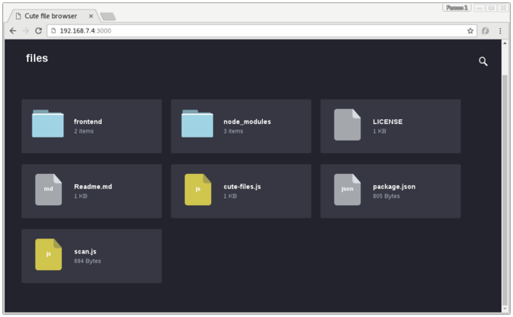

.. SPDX-License-Identifier: CC-BY-SA-2.0-UK

************
Common Tasks
************

This chapter describes fundamental procedures such as creating layers,
adding new software packages, extending or customizing images, porting
work to new hardware (adding a new machine), and so forth. You will find
that the procedures documented here occur often in the development cycle
using the Yocto Project.

Understanding and Creating Layers
=================================

The OpenEmbedded build system supports organizing
:term:`Metadata` into multiple layers.
Layers allow you to isolate different types of customizations from each
other. For introductory information on the Yocto Project Layer Model,
see the
":ref:`overview-manual/overview-manual-yp-intro:the yocto project layer model`"
section in the Yocto Project Overview and Concepts Manual.

Creating Your Own Layer
-----------------------

It is very easy to create your own layers to use with the OpenEmbedded
build system. The Yocto Project ships with tools that speed up creating
layers. This section describes the steps you perform by hand to create
layers so that you can better understand them. For information about the
layer-creation tools, see the
":ref:`bsp-guide/bsp:creating a new bsp layer using the \`\`bitbake-layers\`\` script`"
section in the Yocto Project Board Support Package (BSP) Developer's
Guide and the ":ref:`dev-manual/dev-manual-common-tasks:creating a general layer using the \`\`bitbake-layers\`\` script`"
section further down in this manual.

Follow these general steps to create your layer without using tools:

1. *Check Existing Layers:* Before creating a new layer, you should be
   sure someone has not already created a layer containing the Metadata
   you need. You can see the `OpenEmbedded Metadata
   Index <http://layers.openembedded.org/layerindex/layers/>`__ for a
   list of layers from the OpenEmbedded community that can be used in
   the Yocto Project. You could find a layer that is identical or close
   to what you need.

2. *Create a Directory:* Create the directory for your layer. When you
   create the layer, be sure to create the directory in an area not
   associated with the Yocto Project :term:`Source Directory`
   (e.g. the cloned ``poky`` repository).

   While not strictly required, prepend the name of the directory with
   the string "meta-". For example:
   ::

      meta-mylayer
      meta-GUI_xyz
      meta-mymachine

   With rare exceptions, a layer's name follows this form:
   ::

      meta-root_name

   Following this layer naming convention can save
   you trouble later when tools, components, or variables "assume" your
   layer name begins with "meta-". A notable example is in configuration
   files as shown in the following step where layer names without the
   "meta-" string are appended to several variables used in the
   configuration.

3. *Create a Layer Configuration File:* Inside your new layer folder,
   you need to create a ``conf/layer.conf`` file. It is easiest to take
   an existing layer configuration file and copy that to your layer's
   ``conf`` directory and then modify the file as needed.

   The ``meta-yocto-bsp/conf/layer.conf`` file in the Yocto Project
   :yocto_git:`Source Repositories </cgit/cgit.cgi/poky/tree/meta-yocto-bsp/conf>`
   demonstrates the required syntax. For your layer, you need to replace
   "yoctobsp" with a unique identifier for your layer (e.g. "machinexyz"
   for a layer named "meta-machinexyz"):
   ::

      # We have a conf and classes directory, add to BBPATH
      BBPATH .= ":${LAYERDIR}"

      # We have recipes-\* directories, add to BBFILES
      BBFILES += "${LAYERDIR}/recipes-*/*/*.bb \
                  ${LAYERDIR}/recipes-*/*/*.bbappend"

      BBFILE_COLLECTIONS += "yoctobsp"
      BBFILE_PATTERN_yoctobsp = "^${LAYERDIR}/"
      BBFILE_PRIORITY_yoctobsp = "5"
      LAYERVERSION_yoctobsp = "4"
      LAYERSERIES_COMPAT_yoctobsp = "dunfell"

   Following is an explanation of the layer configuration file:

   -  :term:`BBPATH`: Adds the layer's
      root directory to BitBake's search path. Through the use of the
      ``BBPATH`` variable, BitBake locates class files (``.bbclass``),
      configuration files, and files that are included with ``include``
      and ``require`` statements. For these cases, BitBake uses the
      first file that matches the name found in ``BBPATH``. This is
      similar to the way the ``PATH`` variable is used for binaries. It
      is recommended, therefore, that you use unique class and
      configuration filenames in your custom layer.

   -  :term:`BBFILES`: Defines the
      location for all recipes in the layer.

   -  :term:`BBFILE_COLLECTIONS`:
      Establishes the current layer through a unique identifier that is
      used throughout the OpenEmbedded build system to refer to the
      layer. In this example, the identifier "yoctobsp" is the
      representation for the container layer named "meta-yocto-bsp".

   -  :term:`BBFILE_PATTERN`:
      Expands immediately during parsing to provide the directory of the
      layer.

   -  :term:`BBFILE_PRIORITY`:
      Establishes a priority to use for recipes in the layer when the
      OpenEmbedded build finds recipes of the same name in different
      layers.

   -  :term:`LAYERVERSION`:
      Establishes a version number for the layer. You can use this
      version number to specify this exact version of the layer as a
      dependency when using the
      :term:`LAYERDEPENDS`
      variable.

   -  :term:`LAYERDEPENDS`:
      Lists all layers on which this layer depends (if any).

   -  :term:`LAYERSERIES_COMPAT`:
      Lists the :yocto_wiki:`Yocto Project </wiki/Releases>`
      releases for which the current version is compatible. This
      variable is a good way to indicate if your particular layer is
      current.

4. *Add Content:* Depending on the type of layer, add the content. If
   the layer adds support for a machine, add the machine configuration
   in a ``conf/machine/`` file within the layer. If the layer adds
   distro policy, add the distro configuration in a ``conf/distro/``
   file within the layer. If the layer introduces new recipes, put the
   recipes you need in ``recipes-*`` subdirectories within the layer.

   .. note::

      For an explanation of layer hierarchy that is compliant with the
      Yocto Project, see the "
      Example Filesystem Layout
      " section in the Yocto Project Board Support Package (BSP)
      Developer's Guide.

5. *Optionally Test for Compatibility:* If you want permission to use
   the Yocto Project Compatibility logo with your layer or application
   that uses your layer, perform the steps to apply for compatibility.
   See the "`Making Sure Your Layer is Compatible With Yocto
   Project <#making-sure-your-layer-is-compatible-with-yocto-project>`__"
   section for more information.

.. _best-practices-to-follow-when-creating-layers:

Following Best Practices When Creating Layers
---------------------------------------------

To create layers that are easier to maintain and that will not impact
builds for other machines, you should consider the information in the
following list:

-  *Avoid "Overlaying" Entire Recipes from Other Layers in Your
   Configuration:* In other words, do not copy an entire recipe into
   your layer and then modify it. Rather, use an append file
   (``.bbappend``) to override only those parts of the original recipe
   you need to modify.

-  *Avoid Duplicating Include Files:* Use append files (``.bbappend``)
   for each recipe that uses an include file. Or, if you are introducing
   a new recipe that requires the included file, use the path relative
   to the original layer directory to refer to the file. For example,
   use ``require recipes-core/``\ package\ ``/``\ file\ ``.inc`` instead
   of ``require``\ file\ ``.inc``. If you're finding you have to overlay
   the include file, it could indicate a deficiency in the include file
   in the layer to which it originally belongs. If this is the case, you
   should try to address that deficiency instead of overlaying the
   include file. For example, you could address this by getting the
   maintainer of the include file to add a variable or variables to make
   it easy to override the parts needing to be overridden.

-  *Structure Your Layers:* Proper use of overrides within append files
   and placement of machine-specific files within your layer can ensure
   that a build is not using the wrong Metadata and negatively impacting
   a build for a different machine. Following are some examples:

   -  *Modify Variables to Support a Different Machine:* Suppose you
      have a layer named ``meta-one`` that adds support for building
      machine "one". To do so, you use an append file named
      ``base-files.bbappend`` and create a dependency on "foo" by
      altering the :term:`DEPENDS`
      variable:
      ::

         DEPENDS = "foo"

      The dependency is created during any
      build that includes the layer ``meta-one``. However, you might not
      want this dependency for all machines. For example, suppose you
      are building for machine "two" but your ``bblayers.conf`` file has
      the ``meta-one`` layer included. During the build, the
      ``base-files`` for machine "two" will also have the dependency on
      ``foo``.

      To make sure your changes apply only when building machine "one",
      use a machine override with the ``DEPENDS`` statement: DEPENDS_one
      = "foo" You should follow the same strategy when using ``_append``
      and ``_prepend`` operations:
      ::

         DEPENDS_append_one = " foo"
         DEPENDS_prepend_one = "foo "

      As an actual example, here's a
      snippet from the generic kernel include file ``linux-yocto.inc``,
      wherein the kernel compile and link options are adjusted in the
      case of a subset of the supported architectures:
      ::

         DEPENDS_append_aarch64 = " libgcc"
         KERNEL_CC_append_aarch64 = " ${TOOLCHAIN_OPTIONS}"
         KERNEL_LD_append_aarch64 = " ${TOOLCHAIN_OPTIONS}"

         DEPENDS_append_nios2 = " libgcc"
         KERNEL_CC_append_nios2 = " ${TOOLCHAIN_OPTIONS}"
         KERNEL_LD_append_nios2 = " ${TOOLCHAIN_OPTIONS}"

         DEPENDS_append_arc = " libgcc"
         KERNEL_CC_append_arc = " ${TOOLCHAIN_OPTIONS}"
         KERNEL_LD_append_arc = " ${TOOLCHAIN_OPTIONS}"

         KERNEL_FEATURES_append_qemuall=" features/debug/printk.scc"

      .. note::

         Avoiding "+=" and "=+" and using machine-specific
         \_append
         and
         \_prepend
         operations is recommended as well.

   -  *Place Machine-Specific Files in Machine-Specific Locations:* When
      you have a base recipe, such as ``base-files.bb``, that contains a
      :term:`SRC_URI` statement to a
      file, you can use an append file to cause the build to use your
      own version of the file. For example, an append file in your layer
      at ``meta-one/recipes-core/base-files/base-files.bbappend`` could
      extend :term:`FILESPATH`
      using
      :term:`FILESEXTRAPATHS`
      as follows: FILESEXTRAPATHS_prepend := "${THISDIR}/${BPN}:" The
      build for machine "one" will pick up your machine-specific file as
      long as you have the file in
      ``meta-one/recipes-core/base-files/base-files/``. However, if you
      are building for a different machine and the ``bblayers.conf``
      file includes the ``meta-one`` layer and the location of your
      machine-specific file is the first location where that file is
      found according to ``FILESPATH``, builds for all machines will
      also use that machine-specific file.

      You can make sure that a machine-specific file is used for a
      particular machine by putting the file in a subdirectory specific
      to the machine. For example, rather than placing the file in
      ``meta-one/recipes-core/base-files/base-files/`` as shown above,
      put it in ``meta-one/recipes-core/base-files/base-files/one/``.
      Not only does this make sure the file is used only when building
      for machine "one", but the build process locates the file more
      quickly.

      In summary, you need to place all files referenced from
      ``SRC_URI`` in a machine-specific subdirectory within the layer in
      order to restrict those files to machine-specific builds.

-  *Perform Steps to Apply for Yocto Project Compatibility:* If you want
   permission to use the Yocto Project Compatibility logo with your
   layer or application that uses your layer, perform the steps to apply
   for compatibility. See the "`Making Sure Your Layer is Compatible
   With Yocto
   Project <#making-sure-your-layer-is-compatible-with-yocto-project>`__"
   section for more information.

-  *Follow the Layer Naming Convention:* Store custom layers in a Git
   repository that use the ``meta-layer_name`` format.

-  *Group Your Layers Locally:* Clone your repository alongside other
   cloned ``meta`` directories from the :term:`Source Directory`.

Making Sure Your Layer is Compatible With Yocto Project
-------------------------------------------------------

When you create a layer used with the Yocto Project, it is advantageous
to make sure that the layer interacts well with existing Yocto Project
layers (i.e. the layer is compatible with the Yocto Project). Ensuring
compatibility makes the layer easy to be consumed by others in the Yocto
Project community and could allow you permission to use the Yocto
Project Compatible Logo.

.. note::

   Only Yocto Project member organizations are permitted to use the
   Yocto Project Compatible Logo. The logo is not available for general
   use. For information on how to become a Yocto Project member
   organization, see the
   Yocto Project Website
   .

The Yocto Project Compatibility Program consists of a layer application
process that requests permission to use the Yocto Project Compatibility
Logo for your layer and application. The process consists of two parts:

1. Successfully passing a script (``yocto-check-layer``) that when run
   against your layer, tests it against constraints based on experiences
   of how layers have worked in the real world and where pitfalls have
   been found. Getting a "PASS" result from the script is required for
   successful compatibility registration.

2. Completion of an application acceptance form, which you can find at
   https://www.yoctoproject.org/webform/yocto-project-compatible-registration.

To be granted permission to use the logo, you need to satisfy the
following:

-  Be able to check the box indicating that you got a "PASS" when
   running the script against your layer.

-  Answer "Yes" to the questions on the form or have an acceptable
   explanation for any questions answered "No".

-  Be a Yocto Project Member Organization.

The remainder of this section presents information on the registration
form and on the ``yocto-check-layer`` script.

Yocto Project Compatible Program Application
~~~~~~~~~~~~~~~~~~~~~~~~~~~~~~~~~~~~~~~~~~~~

Use the form to apply for your layer's approval. Upon successful
application, you can use the Yocto Project Compatibility Logo with your
layer and the application that uses your layer.

To access the form, use this link:
https://www.yoctoproject.org/webform/yocto-project-compatible-registration.
Follow the instructions on the form to complete your application.

The application consists of the following sections:

-  *Contact Information:* Provide your contact information as the fields
   require. Along with your information, provide the released versions
   of the Yocto Project for which your layer is compatible.

-  *Acceptance Criteria:* Provide "Yes" or "No" answers for each of the
   items in the checklist. Space exists at the bottom of the form for
   any explanations for items for which you answered "No".

-  *Recommendations:* Provide answers for the questions regarding Linux
   kernel use and build success.

``yocto-check-layer`` Script
~~~~~~~~~~~~~~~~~~~~~~~~~~~~

The ``yocto-check-layer`` script provides you a way to assess how
compatible your layer is with the Yocto Project. You should run this
script prior to using the form to apply for compatibility as described
in the previous section. You need to achieve a "PASS" result in order to
have your application form successfully processed.

The script divides tests into three areas: COMMON, BSP, and DISTRO. For
example, given a distribution layer (DISTRO), the layer must pass both
the COMMON and DISTRO related tests. Furthermore, if your layer is a BSP
layer, the layer must pass the COMMON and BSP set of tests.

To execute the script, enter the following commands from your build
directory:
::

   $ source oe-init-build-env
   $ yocto-check-layer your_layer_directory

Be sure to provide the actual directory for your
layer as part of the command.

Entering the command causes the script to determine the type of layer
and then to execute a set of specific tests against the layer. The
following list overviews the test:

-  ``common.test_readme``: Tests if a ``README`` file exists in the
   layer and the file is not empty.

-  ``common.test_parse``: Tests to make sure that BitBake can parse the
   files without error (i.e. ``bitbake -p``).

-  ``common.test_show_environment``: Tests that the global or per-recipe
   environment is in order without errors (i.e. ``bitbake -e``).

-  ``common.test_world``: Verifies that ``bitbake world`` works.

-  ``common.test_signatures``: Tests to be sure that BSP and DISTRO
   layers do not come with recipes that change signatures.

-  ``common.test_layerseries_compat``: Verifies layer compatibility is
   set properly.

-  ``bsp.test_bsp_defines_machines``: Tests if a BSP layer has machine
   configurations.

-  ``bsp.test_bsp_no_set_machine``: Tests to ensure a BSP layer does not
   set the machine when the layer is added.

-  ``bsp.test_machine_world``: Verifies that ``bitbake world`` works
   regardless of which machine is selected.

-  ``bsp.test_machine_signatures``: Verifies that building for a
   particular machine affects only the signature of tasks specific to
   that machine.

-  ``distro.test_distro_defines_distros``: Tests if a DISTRO layer has
   distro configurations.

-  ``distro.test_distro_no_set_distros``: Tests to ensure a DISTRO layer
   does not set the distribution when the layer is added.

Enabling Your Layer
-------------------

Before the OpenEmbedded build system can use your new layer, you need to
enable it. To enable your layer, simply add your layer's path to the
``BBLAYERS`` variable in your ``conf/bblayers.conf`` file, which is
found in the :term:`Build Directory`.
The following example shows how to enable a layer named
``meta-mylayer``:
::

   # POKY_BBLAYERS_CONF_VERSION is increased each time build/conf/bblayers.conf
   # changes incompatibly
   POKY_BBLAYERS_CONF_VERSION = "2"
   BBPATH = "${TOPDIR}"
   BBFILES ?= ""
   BBLAYERS ?= " \
       /home/user/poky/meta \
       /home/user/poky/meta-poky \
       /home/user/poky/meta-yocto-bsp \
       /home/user/poky/meta-mylayer \
       "

BitBake parses each ``conf/layer.conf`` file from the top down as
specified in the ``BBLAYERS`` variable within the ``conf/bblayers.conf``
file. During the processing of each ``conf/layer.conf`` file, BitBake
adds the recipes, classes and configurations contained within the
particular layer to the source directory.

.. _using-bbappend-files:

Using .bbappend Files in Your Layer
-----------------------------------

A recipe that appends Metadata to another recipe is called a BitBake
append file. A BitBake append file uses the ``.bbappend`` file type
suffix, while the corresponding recipe to which Metadata is being
appended uses the ``.bb`` file type suffix.

You can use a ``.bbappend`` file in your layer to make additions or
changes to the content of another layer's recipe without having to copy
the other layer's recipe into your layer. Your ``.bbappend`` file
resides in your layer, while the main ``.bb`` recipe file to which you
are appending Metadata resides in a different layer.

Being able to append information to an existing recipe not only avoids
duplication, but also automatically applies recipe changes from a
different layer into your layer. If you were copying recipes, you would
have to manually merge changes as they occur.

When you create an append file, you must use the same root name as the
corresponding recipe file. For example, the append file
``someapp_DISTRO.bbappend`` must apply to ``someapp_DISTRO.bb``. This
means the original recipe and append file names are version
number-specific. If the corresponding recipe is renamed to update to a
newer version, you must also rename and possibly update the
corresponding ``.bbappend`` as well. During the build process, BitBake
displays an error on starting if it detects a ``.bbappend`` file that
does not have a corresponding recipe with a matching name. See the
:term:`BB_DANGLINGAPPENDS_WARNONLY`
variable for information on how to handle this error.

As an example, consider the main formfactor recipe and a corresponding
formfactor append file both from the :term:`Source Directory`.
Here is the main
formfactor recipe, which is named ``formfactor_0.0.bb`` and located in
the "meta" layer at ``meta/recipes-bsp/formfactor``:
::

   SUMMARY = "Device formfactor information"
   SECTION = "base"
   LICENSE = "MIT"
   LIC_FILES_CHKSUM = "file://${COREBASE}/meta/COPYING.MIT;md5=3da9cfbcb788c80a0384361b4de20420"
   PR = "r45"

   SRC_URI = "file://config file://machconfig"
   S = "${WORKDIR}"

   PACKAGE_ARCH = "${MACHINE_ARCH}"
   INHIBIT_DEFAULT_DEPS = "1"

   do_install() {
	   # Install file only if it has contents
           install -d ${D}${sysconfdir}/formfactor/
           install -m 0644 ${S}/config ${D}${sysconfdir}/formfactor/
	   if [ -s "${S}/machconfig" ]; then
	           install -m 0644 ${S}/machconfig ${D}${sysconfdir}/formfactor/
	   fi
   }

In the main recipe, note the :term:`SRC_URI`
variable, which tells the OpenEmbedded build system where to find files
during the build.

Following is the append file, which is named ``formfactor_0.0.bbappend``
and is from the Raspberry Pi BSP Layer named ``meta-raspberrypi``. The
file is in the layer at ``recipes-bsp/formfactor``:
::

   FILESEXTRAPATHS_prepend := "${THISDIR}/${PN}:"

By default, the build system uses the
:term:`FILESPATH` variable to
locate files. This append file extends the locations by setting the
:term:`FILESEXTRAPATHS`
variable. Setting this variable in the ``.bbappend`` file is the most
reliable and recommended method for adding directories to the search
path used by the build system to find files.

The statement in this example extends the directories to include
``${``\ :term:`THISDIR`\ ``}/${``\ :term:`PN`\ ``}``,
which resolves to a directory named ``formfactor`` in the same directory
in which the append file resides (i.e.
``meta-raspberrypi/recipes-bsp/formfactor``. This implies that you must
have the supporting directory structure set up that will contain any
files or patches you will be including from the layer.

Using the immediate expansion assignment operator ``:=`` is important
because of the reference to ``THISDIR``. The trailing colon character is
important as it ensures that items in the list remain colon-separated.

.. note::

   BitBake automatically defines the ``THISDIR`` variable. You should
   never set this variable yourself. Using "_prepend" as part of the
   ``FILESEXTRAPATHS`` ensures your path will be searched prior to other
   paths in the final list.

   Also, not all append files add extra files. Many append files simply
   exist to add build options (e.g. ``systemd``). For these cases, your
   append file would not even use the ``FILESEXTRAPATHS`` statement.

Prioritizing Your Layer
-----------------------

Each layer is assigned a priority value. Priority values control which
layer takes precedence if there are recipe files with the same name in
multiple layers. For these cases, the recipe file from the layer with a
higher priority number takes precedence. Priority values also affect the
order in which multiple ``.bbappend`` files for the same recipe are
applied. You can either specify the priority manually, or allow the
build system to calculate it based on the layer's dependencies.

To specify the layer's priority manually, use the
:term:`BBFILE_PRIORITY`
variable and append the layer's root name:
::

   BBFILE_PRIORITY_mylayer = "1"

.. note::

   It is possible for a recipe with a lower version number
   :term:`PV` in a layer that has a higher
   priority to take precedence.

   Also, the layer priority does not currently affect the precedence
   order of ``.conf`` or ``.bbclass`` files. Future versions of BitBake
   might address this.

Managing Layers
---------------

You can use the BitBake layer management tool ``bitbake-layers`` to
provide a view into the structure of recipes across a multi-layer
project. Being able to generate output that reports on configured layers
with their paths and priorities and on ``.bbappend`` files and their
applicable recipes can help to reveal potential problems.

For help on the BitBake layer management tool, use the following
command:
::

   $ bitbake-layers --help NOTE: Starting bitbake server... usage:
   NOTE: Starting bitbake server...
   usage: bitbake-layers [-d] [-q] [-F] [--color COLOR] [-h] <subcommand> ...

   BitBake layers utility

   optional arguments:
     -d, --debug           Enable debug output
     -q, --quiet           Print only errors
     -F, --force           Force add without recipe parse verification
     --color COLOR         Colorize output (where COLOR is auto, always, never)
     -h, --help            show this help message and exit

   subcommands:
     <subcommand>
       layerindex-fetch    Fetches a layer from a layer index along with its
                           dependent layers, and adds them to conf/bblayers.conf.
       layerindex-show-depends
                           Find layer dependencies from layer index.
       add-layer           Add one or more layers to bblayers.conf.
       remove-layer        Remove one or more layers from bblayers.conf.
       flatten             flatten layer configuration into a separate output
                           directory.
       show-layers         show current configured layers.
       show-overlayed      list overlayed recipes (where the same recipe exists
                           in another layer)
       show-recipes        list available recipes, showing the layer they are
                           provided by
       show-appends        list bbappend files and recipe files they apply to
       show-cross-depends  Show dependencies between recipes that cross layer
                           boundaries.
       create-layer        Create a basic layer

   Use bitbake-layers <subcommand> --help to get help on a specific command

The following list describes the available commands:

-  ``help:`` Displays general help or help on a specified command.

-  ``show-layers:`` Shows the current configured layers.

-  ``show-overlayed:`` Lists overlayed recipes. A recipe is overlayed
   when a recipe with the same name exists in another layer that has a
   higher layer priority.

-  ``show-recipes:`` Lists available recipes and the layers that
   provide them.

-  ``show-appends:`` Lists ``.bbappend`` files and the recipe files to
   which they apply.

-  ``show-cross-depends:`` Lists dependency relationships between
   recipes that cross layer boundaries.

-  ``add-layer:`` Adds a layer to ``bblayers.conf``.

-  ``remove-layer:`` Removes a layer from ``bblayers.conf``

-  ``flatten:`` Flattens the layer configuration into a separate
   output directory. Flattening your layer configuration builds a
   "flattened" directory that contains the contents of all layers, with
   any overlayed recipes removed and any ``.bbappend`` files appended to
   the corresponding recipes. You might have to perform some manual
   cleanup of the flattened layer as follows:

   -  Non-recipe files (such as patches) are overwritten. The flatten
      command shows a warning for these files.

   -  Anything beyond the normal layer setup has been added to the
      ``layer.conf`` file. Only the lowest priority layer's
      ``layer.conf`` is used.

   -  Overridden and appended items from ``.bbappend`` files need to be
      cleaned up. The contents of each ``.bbappend`` end up in the
      flattened recipe. However, if there are appended or changed
      variable values, you need to tidy these up yourself. Consider the
      following example. Here, the ``bitbake-layers`` command adds the
      line ``#### bbappended ...`` so that you know where the following
      lines originate:
      ::

         ...
         DESCRIPTION = "A useful utility"
         ...
         EXTRA_OECONF = "--enable-something"
         ...

         #### bbappended from meta-anotherlayer ####

         DESCRIPTION = "Customized utility"
         EXTRA_OECONF += "--enable-somethingelse"


      Ideally, you would tidy up these utilities as follows:
      ::

         ...
         DESCRIPTION = "Customized utility"
         ...
         EXTRA_OECONF = "--enable-something --enable-somethingelse"
         ...

-  ``layerindex-fetch``: Fetches a layer from a layer index, along
   with its dependent layers, and adds the layers to the
   ``conf/bblayers.conf`` file.

-  ``layerindex-show-depends``: Finds layer dependencies from the
   layer index.

-  ``create-layer``: Creates a basic layer.

Creating a General Layer Using the ``bitbake-layers`` Script
------------------------------------------------------------

The ``bitbake-layers`` script with the ``create-layer`` subcommand
simplifies creating a new general layer.

.. note::

   -  For information on BSP layers, see the ":ref:`bsp-guide/bsp:bsp layers`"
      section in the Yocto
      Project Board Specific (BSP) Developer's Guide.

   -  In order to use a layer with the OpenEmbedded build system, you
      need to add the layer to your ``bblayers.conf`` configuration
      file. See the ":ref:`dev-manual/dev-manual-common-tasks:adding a layer using the \`\`bitbake-layers\`\` script`"
      section for more information.

The default mode of the script's operation with this subcommand is to
create a layer with the following:

-  A layer priority of 6.

-  A ``conf`` subdirectory that contains a ``layer.conf`` file.

-  A ``recipes-example`` subdirectory that contains a further
   subdirectory named ``example``, which contains an ``example.bb``
   recipe file.

-  A ``COPYING.MIT``, which is the license statement for the layer. The
   script assumes you want to use the MIT license, which is typical for
   most layers, for the contents of the layer itself.

-  A ``README`` file, which is a file describing the contents of your
   new layer.

In its simplest form, you can use the following command form to create a
layer. The command creates a layer whose name corresponds to
your_layer_name in the current directory: $ bitbake-layers create-layer
your_layer_name As an example, the following command creates a layer
named ``meta-scottrif`` in your home directory:
::

   $ cd /usr/home
   $ bitbake-layers create-layer meta-scottrif
   NOTE: Starting bitbake server...
   Add your new layer with 'bitbake-layers add-layer meta-scottrif'

If you want to set the priority of the layer to other than the default
value of "6", you can either use the ``DASHDASHpriority`` option or you
can edit the
:term:`BBFILE_PRIORITY` value
in the ``conf/layer.conf`` after the script creates it. Furthermore, if
you want to give the example recipe file some name other than the
default, you can use the ``DASHDASHexample-recipe-name`` option.

The easiest way to see how the ``bitbake-layers create-layer`` command
works is to experiment with the script. You can also read the usage
information by entering the following:
::

   $ bitbake-layers create-layer --help
   NOTE: Starting bitbake server...
   usage: bitbake-layers create-layer [-h] [--priority PRIORITY]
                                      [--example-recipe-name EXAMPLERECIPE]
                                      layerdir

   Create a basic layer

   positional arguments:
     layerdir              Layer directory to create

   optional arguments:
     -h, --help            show this help message and exit
     --priority PRIORITY, -p PRIORITY
                           Layer directory to create
     --example-recipe-name EXAMPLERECIPE, -e EXAMPLERECIPE
                           Filename of the example recipe

Adding a Layer Using the ``bitbake-layers`` Script
--------------------------------------------------

Once you create your general layer, you must add it to your
``bblayers.conf`` file. Adding the layer to this configuration file
makes the OpenEmbedded build system aware of your layer so that it can
search it for metadata.

Add your layer by using the ``bitbake-layers add-layer`` command:
::

   $ bitbake-layers add-layer your_layer_name

Here is an example that adds a
layer named ``meta-scottrif`` to the configuration file. Following the
command that adds the layer is another ``bitbake-layers`` command that
shows the layers that are in your ``bblayers.conf`` file:
::

   $ bitbake-layers add-layer meta-scottrif
   NOTE: Starting bitbake server...
   Parsing recipes: 100% |##########################################################| Time: 0:00:49
   Parsing of 1441 .bb files complete (0 cached, 1441 parsed). 2055 targets, 56 skipped, 0 masked, 0 errors.
   $ bitbake-layers show-layers
   NOTE: Starting bitbake server...
   layer                 path                                      priority
   ==========================================================================
   meta                  /home/scottrif/poky/meta                  5
   meta-poky             /home/scottrif/poky/meta-poky             5
   meta-yocto-bsp        /home/scottrif/poky/meta-yocto-bsp        5
   workspace             /home/scottrif/poky/build/workspace       99
   meta-scottrif         /home/scottrif/poky/build/meta-scottrif   6


Adding the layer to this file
enables the build system to locate the layer during the build.

.. note::

   During a build, the OpenEmbedded build system looks in the layers
   from the top of the list down to the bottom in that order.

.. _usingpoky-extend-customimage:

Customizing Images
==================

You can customize images to satisfy particular requirements. This
section describes several methods and provides guidelines for each.

.. _usingpoky-extend-customimage-localconf:

Customizing Images Using ``local.conf``
---------------------------------------

Probably the easiest way to customize an image is to add a package by
way of the ``local.conf`` configuration file. Because it is limited to
local use, this method generally only allows you to add packages and is
not as flexible as creating your own customized image. When you add
packages using local variables this way, you need to realize that these
variable changes are in effect for every build and consequently affect
all images, which might not be what you require.

To add a package to your image using the local configuration file, use
the ``IMAGE_INSTALL`` variable with the ``_append`` operator:
::

   IMAGE_INSTALL_append = " strace"

Use of the syntax is important -
specifically, the space between the quote and the package name, which is
``strace`` in this example. This space is required since the ``_append``
operator does not add the space.

Furthermore, you must use ``_append`` instead of the ``+=`` operator if
you want to avoid ordering issues. The reason for this is because doing
so unconditionally appends to the variable and avoids ordering problems
due to the variable being set in image recipes and ``.bbclass`` files
with operators like ``?=``. Using ``_append`` ensures the operation
takes affect.

As shown in its simplest use, ``IMAGE_INSTALL_append`` affects all
images. It is possible to extend the syntax so that the variable applies
to a specific image only. Here is an example:
IMAGE_INSTALL_append_pn-core-image-minimal = " strace" This example adds
``strace`` to the ``core-image-minimal`` image only.

You can add packages using a similar approach through the
``CORE_IMAGE_EXTRA_INSTALL`` variable. If you use this variable, only
``core-image-*`` images are affected.

.. _usingpoky-extend-customimage-imagefeatures:

Customizing Images Using Custom ``IMAGE_FEATURES`` and ``EXTRA_IMAGE_FEATURES``
-------------------------------------------------------------------------------

Another method for customizing your image is to enable or disable
high-level image features by using the
:term:`IMAGE_FEATURES` and
:term:`EXTRA_IMAGE_FEATURES`
variables. Although the functions for both variables are nearly
equivalent, best practices dictate using ``IMAGE_FEATURES`` from within
a recipe and using ``EXTRA_IMAGE_FEATURES`` from within your
``local.conf`` file, which is found in the
:term:`Build Directory`.

To understand how these features work, the best reference is
``meta/classes/core-image.bbclass``. This class lists out the available
``IMAGE_FEATURES`` of which most map to package groups while some, such
as ``debug-tweaks`` and ``read-only-rootfs``, resolve as general
configuration settings.

In summary, the file looks at the contents of the ``IMAGE_FEATURES``
variable and then maps or configures the feature accordingly. Based on
this information, the build system automatically adds the appropriate
packages or configurations to the
:term:`IMAGE_INSTALL` variable.
Effectively, you are enabling extra features by extending the class or
creating a custom class for use with specialized image ``.bb`` files.

Use the ``EXTRA_IMAGE_FEATURES`` variable from within your local
configuration file. Using a separate area from which to enable features
with this variable helps you avoid overwriting the features in the image
recipe that are enabled with ``IMAGE_FEATURES``. The value of
``EXTRA_IMAGE_FEATURES`` is added to ``IMAGE_FEATURES`` within
``meta/conf/bitbake.conf``.

To illustrate how you can use these variables to modify your image,
consider an example that selects the SSH server. The Yocto Project ships
with two SSH servers you can use with your images: Dropbear and OpenSSH.
Dropbear is a minimal SSH server appropriate for resource-constrained
environments, while OpenSSH is a well-known standard SSH server
implementation. By default, the ``core-image-sato`` image is configured
to use Dropbear. The ``core-image-full-cmdline`` and ``core-image-lsb``
images both include OpenSSH. The ``core-image-minimal`` image does not
contain an SSH server.

You can customize your image and change these defaults. Edit the
``IMAGE_FEATURES`` variable in your recipe or use the
``EXTRA_IMAGE_FEATURES`` in your ``local.conf`` file so that it
configures the image you are working with to include
``ssh-server-dropbear`` or ``ssh-server-openssh``.

.. note::

   See the "
   Images
   " section in the Yocto Project Reference Manual for a complete list
   of image features that ship with the Yocto Project.

.. _usingpoky-extend-customimage-custombb:

Customizing Images Using Custom .bb Files
-----------------------------------------

You can also customize an image by creating a custom recipe that defines
additional software as part of the image. The following example shows
the form for the two lines you need:
::

   IMAGE_INSTALL = "packagegroup-core-x11-base package1 package2"
   inherit core-image

Defining the software using a custom recipe gives you total control over
the contents of the image. It is important to use the correct names of
packages in the ``IMAGE_INSTALL`` variable. You must use the
OpenEmbedded notation and not the Debian notation for the names (e.g.
``glibc-dev`` instead of ``libc6-dev``).

The other method for creating a custom image is to base it on an
existing image. For example, if you want to create an image based on
``core-image-sato`` but add the additional package ``strace`` to the
image, copy the ``meta/recipes-sato/images/core-image-sato.bb`` to a new
``.bb`` and add the following line to the end of the copy:
::

   IMAGE_INSTALL += "strace"

.. _usingpoky-extend-customimage-customtasks:

Customizing Images Using Custom Package Groups
----------------------------------------------

For complex custom images, the best approach for customizing an image is
to create a custom package group recipe that is used to build the image
or images. A good example of a package group recipe is
``meta/recipes-core/packagegroups/packagegroup-base.bb``.

If you examine that recipe, you see that the ``PACKAGES`` variable lists
the package group packages to produce. The ``inherit packagegroup``
statement sets appropriate default values and automatically adds
``-dev``, ``-dbg``, and ``-ptest`` complementary packages for each
package specified in the ``PACKAGES`` statement.

.. note::

   The
   inherit packagegroup
   line should be located near the top of the recipe, certainly before
   the
   PACKAGES
   statement.

For each package you specify in ``PACKAGES``, you can use ``RDEPENDS``
and ``RRECOMMENDS`` entries to provide a list of packages the parent
task package should contain. You can see examples of these further down
in the ``packagegroup-base.bb`` recipe.

Here is a short, fabricated example showing the same basic pieces for a
hypothetical packagegroup defined in ``packagegroup-custom.bb``, where
the variable ``PN`` is the standard way to abbreviate the reference to
the full packagegroup name ``packagegroup-custom``:
::

   DESCRIPTION = "My Custom Package Groups"

   inherit packagegroup

   PACKAGES = "\
       ${PN}-apps \
       ${PN}-tools \
       "

   RDEPENDS_${PN}-apps = "\
       dropbear \
       portmap \
       psplash"

   RDEPENDS_${PN}-tools = "\
       oprofile \
       oprofileui-server \
       lttng-tools"

   RRECOMMENDS_${PN}-tools = "\
       kernel-module-oprofile"

In the previous example, two package group packages are created with
their dependencies and their recommended package dependencies listed:
``packagegroup-custom-apps``, and ``packagegroup-custom-tools``. To
build an image using these package group packages, you need to add
``packagegroup-custom-apps`` and/or ``packagegroup-custom-tools`` to
``IMAGE_INSTALL``. For other forms of image dependencies see the other
areas of this section.

.. _usingpoky-extend-customimage-image-name:

Customizing an Image Hostname
-----------------------------

By default, the configured hostname (i.e. ``/etc/hostname``) in an image
is the same as the machine name. For example, if
:term:`MACHINE` equals "qemux86", the
configured hostname written to ``/etc/hostname`` is "qemux86".

You can customize this name by altering the value of the "hostname"
variable in the ``base-files`` recipe using either an append file or a
configuration file. Use the following in an append file:
::

   hostname = "myhostname"

Use the following in a configuration file:
::

   hostname_pn-base-files = "myhostname"

Changing the default value of the variable "hostname" can be useful in
certain situations. For example, suppose you need to do extensive
testing on an image and you would like to easily identify the image
under test from existing images with typical default hostnames. In this
situation, you could change the default hostname to "testme", which
results in all the images using the name "testme". Once testing is
complete and you do not need to rebuild the image for test any longer,
you can easily reset the default hostname.

Another point of interest is that if you unset the variable, the image
will have no default hostname in the filesystem. Here is an example that
unsets the variable in a configuration file:
::

  hostname_pn-base-files = ""

Having no default hostname in the filesystem is suitable for
environments that use dynamic hostnames such as virtual machines.

.. _new-recipe-writing-a-new-recipe:

Writing a New Recipe
====================

Recipes (``.bb`` files) are fundamental components in the Yocto Project
environment. Each software component built by the OpenEmbedded build
system requires a recipe to define the component. This section describes
how to create, write, and test a new recipe.

.. note::

   For information on variables that are useful for recipes and for
   information about recipe naming issues, see the "
   Required
   " section of the Yocto Project Reference Manual.

.. _new-recipe-overview:

Overview
--------

The following figure shows the basic process for creating a new recipe.
The remainder of the section provides details for the steps.

.. image:: figures/recipe-workflow.png
   :align: center

.. _new-recipe-locate-or-automatically-create-a-base-recipe:

Locate or Automatically Create a Base Recipe
--------------------------------------------

You can always write a recipe from scratch. However, three choices exist
that can help you quickly get a start on a new recipe:

-  ``devtool add``: A command that assists in creating a recipe and an
   environment conducive to development.

-  ``recipetool create``: A command provided by the Yocto Project that
   automates creation of a base recipe based on the source files.

-  *Existing Recipes:* Location and modification of an existing recipe
   that is similar in function to the recipe you need.

.. note::

   For information on recipe syntax, see the "
   Recipe Syntax
   " section.

.. _new-recipe-creating-the-base-recipe-using-devtool:

Creating the Base Recipe Using ``devtool add``
~~~~~~~~~~~~~~~~~~~~~~~~~~~~~~~~~~~~~~~~~~~~~~

The ``devtool add`` command uses the same logic for auto-creating the
recipe as ``recipetool create``, which is listed below. Additionally,
however, ``devtool add`` sets up an environment that makes it easy for
you to patch the source and to make changes to the recipe as is often
necessary when adding a recipe to build a new piece of software to be
included in a build.

You can find a complete description of the ``devtool add`` command in
the ":ref:`sdk-a-closer-look-at-devtool-add`" section
in the Yocto Project Application Development and the Extensible Software
Development Kit (eSDK) manual.

.. _new-recipe-creating-the-base-recipe-using-recipetool:

Creating the Base Recipe Using ``recipetool create``
~~~~~~~~~~~~~~~~~~~~~~~~~~~~~~~~~~~~~~~~~~~~~~~~~~~~

``recipetool create`` automates creation of a base recipe given a set of
source code files. As long as you can extract or point to the source
files, the tool will construct a recipe and automatically configure all
pre-build information into the recipe. For example, suppose you have an
application that builds using Autotools. Creating the base recipe using
``recipetool`` results in a recipe that has the pre-build dependencies,
license requirements, and checksums configured.

To run the tool, you just need to be in your
:term:`Build Directory` and have sourced the
build environment setup script (i.e.
`:ref:`structure-core-script`).
To get help on the tool, use the following command:
::

   $ recipetool -h
   NOTE: Starting bitbake server...
   usage: recipetool [-d] [-q] [--color COLOR] [-h] <subcommand> ...

   OpenEmbedded recipe tool

   options:
     -d, --debug     Enable debug output
     -q, --quiet     Print only errors
     --color COLOR   Colorize output (where COLOR is auto, always, never)
     -h, --help      show this help message and exit

   subcommands:
     create          Create a new recipe
     newappend       Create a bbappend for the specified target in the specified
                       layer
     setvar          Set a variable within a recipe
     appendfile      Create/update a bbappend to replace a target file
     appendsrcfiles  Create/update a bbappend to add or replace source files
     appendsrcfile   Create/update a bbappend to add or replace a source file
   Use recipetool <subcommand> --help to get help on a specific command

Running ``recipetool create -o`` OUTFILE creates the base recipe and
locates it properly in the layer that contains your source files.
Following are some syntax examples:

Use this syntax to generate a recipe based on source. Once generated,
the recipe resides in the existing source code layer:
::

   recipetool create -o OUTFILE source

Use this syntax to generate a recipe using code that
you extract from source. The extracted code is placed in its own layer
defined by EXTERNALSRC.
::

   recipetool create -o OUTFILE -x EXTERNALSRC source

Use this syntax to generate a recipe based on source. The options
direct ``recipetool`` to generate debugging information. Once generated,
the recipe resides in the existing source code layer:
::

   recipetool create -d -o OUTFILE source

.. _new-recipe-locating-and-using-a-similar-recipe:

Locating and Using a Similar Recipe
~~~~~~~~~~~~~~~~~~~~~~~~~~~~~~~~~~~

Before writing a recipe from scratch, it is often useful to discover
whether someone else has already written one that meets (or comes close
to meeting) your needs. The Yocto Project and OpenEmbedded communities
maintain many recipes that might be candidates for what you are doing.
You can find a good central index of these recipes in the `OpenEmbedded
Layer Index <http://layers.openembedded.org>`__.

Working from an existing recipe or a skeleton recipe is the best way to
get started. Here are some points on both methods:

-  *Locate and modify a recipe that is close to what you want to do:*
   This method works when you are familiar with the current recipe
   space. The method does not work so well for those new to the Yocto
   Project or writing recipes.

   Some risks associated with this method are using a recipe that has
   areas totally unrelated to what you are trying to accomplish with
   your recipe, not recognizing areas of the recipe that you might have
   to add from scratch, and so forth. All these risks stem from
   unfamiliarity with the existing recipe space.

-  *Use and modify the following skeleton recipe:* If for some reason
   you do not want to use ``recipetool`` and you cannot find an existing
   recipe that is close to meeting your needs, you can use the following
   structure to provide the fundamental areas of a new recipe.
   ::

      DESCRIPTION = ""
      HOMEPAGE = ""
      LICENSE = ""
      SECTION = ""
      DEPENDS = ""
      LIC_FILES_CHKSUM = ""

      SRC_URI = ""

.. _new-recipe-storing-and-naming-the-recipe:

Storing and Naming the Recipe
-----------------------------

Once you have your base recipe, you should put it in your own layer and
name it appropriately. Locating it correctly ensures that the
OpenEmbedded build system can find it when you use BitBake to process
the recipe.

-  *Storing Your Recipe:* The OpenEmbedded build system locates your
   recipe through the layer's ``conf/layer.conf`` file and the
   :term:`BBFILES` variable. This
   variable sets up a path from which the build system can locate
   recipes. Here is the typical use:
   ::

      BBFILES += "${LAYERDIR}/recipes-*/*/*.bb \
                  ${LAYERDIR}/recipes-*/*/*.bbappend"

   Consequently, you need to be sure you locate your new recipe inside
   your layer such that it can be found.

   You can find more information on how layers are structured in the
   "`Understanding and Creating
   Layers <#understanding-and-creating-layers>`__" section.

-  *Naming Your Recipe:* When you name your recipe, you need to follow
   this naming convention: basename_version.bb Use lower-cased
   characters and do not include the reserved suffixes ``-native``,
   ``-cross``, ``-initial``, or ``-dev`` casually (i.e. do not use them
   as part of your recipe name unless the string applies). Here are some
   examples:
   ::

      cups_1.7.0.bb
      gawk_4.0.2.bb
      irssi_0.8.16-rc1.bb

.. _new-recipe-running-a-build-on-the-recipe:

Running a Build on the Recipe
-----------------------------

Creating a new recipe is usually an iterative process that requires
using BitBake to process the recipe multiple times in order to
progressively discover and add information to the recipe file.

Assuming you have sourced the build environment setup script (i.e.
:ref:`structure-core-script`) and you are in
the :term:`Build Directory`, use
BitBake to process your recipe. All you need to provide is the
``basename`` of the recipe as described in the previous section:
::

   $ bitbake basename

During the build, the OpenEmbedded build system creates a temporary work
directory for each recipe
(``${``\ :term:`WORKDIR`\ ``}``)
where it keeps extracted source files, log files, intermediate
compilation and packaging files, and so forth.

The path to the per-recipe temporary work directory depends on the
context in which it is being built. The quickest way to find this path
is to have BitBake return it by running the following:
::

   $ bitbake -e basename \| grep ^WORKDIR=

As an example, assume a Source Directory
top-level folder named ``poky``, a default Build Directory at
``poky/build``, and a ``qemux86-poky-linux`` machine target system.
Furthermore, suppose your recipe is named ``foo_1.3.0.bb``. In this
case, the work directory the build system uses to build the package
would be as follows: poky/build/tmp/work/qemux86-poky-linux/foo/1.3.0-r0
Inside this directory you can find sub-directories such as ``image``,
``packages-split``, and ``temp``. After the build, you can examine these
to determine how well the build went.

.. note::

   You can find log files for each task in the recipe's
   temp
   directory (e.g.
   poky/build/tmp/work/qemux86-poky-linux/foo/1.3.0-r0/temp
   ). Log files are named
   log.
   taskname
   (e.g.
   log.do_configure
   ,
   log.do_fetch
   , and
   log.do_compile
   ).

You can find more information about the build process in
":doc:`../overview-manual/overview-manual-development-environment`"
chapter of the Yocto Project Overview and Concepts Manual.

.. _new-recipe-fetching-code:

Fetching Code
-------------

The first thing your recipe must do is specify how to fetch the source
files. Fetching is controlled mainly through the
:term:`SRC_URI` variable. Your recipe
must have a ``SRC_URI`` variable that points to where the source is
located. For a graphical representation of source locations, see the
":ref:`sources-dev-environment`" section in
the Yocto Project Overview and Concepts Manual.

The :ref:`ref-tasks-fetch` task uses
the prefix of each entry in the ``SRC_URI`` variable value to determine
which :ref:`fetcher <bitbake:bb-fetchers>` to use to get your
source files. It is the ``SRC_URI`` variable that triggers the fetcher.
The :ref:`ref-tasks-patch` task uses
the variable after source is fetched to apply patches. The OpenEmbedded
build system uses
:term:`FILESOVERRIDES` for
scanning directory locations for local files in ``SRC_URI``.

The ``SRC_URI`` variable in your recipe must define each unique location
for your source files. It is good practice to not hard-code version
numbers in a URL used in ``SRC_URI``. Rather than hard-code these
values, use ``${``\ :term:`PV`\ ``}``,
which causes the fetch process to use the version specified in the
recipe filename. Specifying the version in this manner means that
upgrading the recipe to a future version is as simple as renaming the
recipe to match the new version.

Here is a simple example from the
``meta/recipes-devtools/strace/strace_5.5.bb`` recipe where the source
comes from a single tarball. Notice the use of the
:term:`PV` variable:
::

   SRC_URI = "https://strace.io/files/${PV}/strace-${PV}.tar.xz \\

Files mentioned in ``SRC_URI`` whose names end in a typical archive
extension (e.g. ``.tar``, ``.tar.gz``, ``.tar.bz2``, ``.zip``, and so
forth), are automatically extracted during the
:ref:`ref-tasks-unpack` task. For
another example that specifies these types of files, see the
"`Autotooled Package <#new-recipe-autotooled-package>`__" section.

Another way of specifying source is from an SCM. For Git repositories,
you must specify :term:`SRCREV` and
you should specify :term:`PV` to include
the revision with :term:`SRCPV`. Here
is an example from the recipe
``meta/recipes-kernel/blktrace/blktrace_git.bb``:
::

   SRCREV = "d6918c8832793b4205ed3bfede78c2f915c23385"

   PR = "r6"
   PV = "1.0.5+git${SRCPV}"

   SRC_URI = "git://git.kernel.dk/blktrace.git \
              file://ldflags.patch"

If your ``SRC_URI`` statement includes URLs pointing to individual files
fetched from a remote server other than a version control system,
BitBake attempts to verify the files against checksums defined in your
recipe to ensure they have not been tampered with or otherwise modified
since the recipe was written. Two checksums are used:
``SRC_URI[md5sum]`` and ``SRC_URI[sha256sum]``.

If your ``SRC_URI`` variable points to more than a single URL (excluding
SCM URLs), you need to provide the ``md5`` and ``sha256`` checksums for
each URL. For these cases, you provide a name for each URL as part of
the ``SRC_URI`` and then reference that name in the subsequent checksum
statements. Here is an example combining lines from the files
``git.inc`` and ``git_2.24.1.bb``:
::

   SRC_URI = "${KERNELORG_MIRROR}/software/scm/git/git-${PV}.tar.gz;name=tarball \
              ${KERNELORG_MIRROR}/software/scm/git/git-manpages-${PV}.tar.gz;name=manpages"

   SRC_URI[tarball.md5sum] = "166bde96adbbc11c8843d4f8f4f9811b"
   SRC_URI[tarball.sha256sum] = "ad5334956301c86841eb1e5b1bb20884a6bad89a10a6762c958220c7cf64da02"
   SRC_URI[manpages.md5sum] = "31c2272a8979022497ba3d4202df145d"
   SRC_URI[manpages.sha256sum] = "9a7ae3a093bea39770eb96ca3e5b40bff7af0b9f6123f089d7821d0e5b8e1230"

Proper values for ``md5`` and ``sha256`` checksums might be available
with other signatures on the download page for the upstream source (e.g.
``md5``, ``sha1``, ``sha256``, ``GPG``, and so forth). Because the
OpenEmbedded build system only deals with ``sha256sum`` and ``md5sum``,
you should verify all the signatures you find by hand.

If no ``SRC_URI`` checksums are specified when you attempt to build the
recipe, or you provide an incorrect checksum, the build will produce an
error for each missing or incorrect checksum. As part of the error
message, the build system provides the checksum string corresponding to
the fetched file. Once you have the correct checksums, you can copy and
paste them into your recipe and then run the build again to continue.

.. note::

   As mentioned, if the upstream source provides signatures for
   verifying the downloaded source code, you should verify those
   manually before setting the checksum values in the recipe and
   continuing with the build.

This final example is a bit more complicated and is from the
``meta/recipes-sato/rxvt-unicode/rxvt-unicode_9.20.bb`` recipe. The
example's ``SRC_URI`` statement identifies multiple files as the source
files for the recipe: a tarball, a patch file, a desktop file, and an
icon.
::

   SRC_URI = "http://dist.schmorp.de/rxvt-unicode/Attic/rxvt-unicode-${PV}.tar.bz2 \
              file://xwc.patch \
              file://rxvt.desktop \
              file://rxvt.png"

When you specify local files using the ``file://`` URI protocol, the
build system fetches files from the local machine. The path is relative
to the :term:`FILESPATH` variable
and searches specific directories in a certain order:
``${``\ :term:`BP`\ ``}``,
``${``\ :term:`BPN`\ ``}``, and
``files``. The directories are assumed to be subdirectories of the
directory in which the recipe or append file resides. For another
example that specifies these types of files, see the "`Single .c File
Package (Hello
World!) <#new-recipe-single-c-file-package-hello-world>`__" section.

The previous example also specifies a patch file. Patch files are files
whose names usually end in ``.patch`` or ``.diff`` but can end with
compressed suffixes such as ``diff.gz`` and ``patch.bz2``, for example.
The build system automatically applies patches as described in the
"`Patching Code <#new-recipe-patching-code>`__" section.

.. _new-recipe-unpacking-code:

Unpacking Code
--------------

During the build, the
:ref:`ref-tasks-unpack` task unpacks
the source with ``${``\ :term:`S`\ ``}``
pointing to where it is unpacked.

If you are fetching your source files from an upstream source archived
tarball and the tarball's internal structure matches the common
convention of a top-level subdirectory named
``${``\ :term:`BPN`\ ``}-${``\ :term:`PV`\ ``}``,
then you do not need to set ``S``. However, if ``SRC_URI`` specifies to
fetch source from an archive that does not use this convention, or from
an SCM like Git or Subversion, your recipe needs to define ``S``.

If processing your recipe using BitBake successfully unpacks the source
files, you need to be sure that the directory pointed to by ``${S}``
matches the structure of the source.

.. _new-recipe-patching-code:

Patching Code
-------------

Sometimes it is necessary to patch code after it has been fetched. Any
files mentioned in ``SRC_URI`` whose names end in ``.patch`` or
``.diff`` or compressed versions of these suffixes (e.g. ``diff.gz`` are
treated as patches. The
:ref:`ref-tasks-patch` task
automatically applies these patches.

The build system should be able to apply patches with the "-p1" option
(i.e. one directory level in the path will be stripped off). If your
patch needs to have more directory levels stripped off, specify the
number of levels using the "striplevel" option in the ``SRC_URI`` entry
for the patch. Alternatively, if your patch needs to be applied in a
specific subdirectory that is not specified in the patch file, use the
"patchdir" option in the entry.

As with all local files referenced in
:term:`SRC_URI` using ``file://``,
you should place patch files in a directory next to the recipe either
named the same as the base name of the recipe
(:term:`BP` and
:term:`BPN`) or "files".

.. _new-recipe-licensing:

Licensing
---------

Your recipe needs to have both the
:term:`LICENSE` and
:term:`LIC_FILES_CHKSUM`
variables:

-  ``LICENSE``: This variable specifies the license for the software.
   If you do not know the license under which the software you are
   building is distributed, you should go to the source code and look
   for that information. Typical files containing this information
   include ``COPYING``, ``LICENSE``, and ``README`` files. You could
   also find the information near the top of a source file. For example,
   given a piece of software licensed under the GNU General Public
   License version 2, you would set ``LICENSE`` as follows:
   ::

      LICENSE = "GPLv2"

   The licenses you specify within ``LICENSE`` can have any name as long
   as you do not use spaces, since spaces are used as separators between
   license names. For standard licenses, use the names of the files in
   ``meta/files/common-licenses/`` or the ``SPDXLICENSEMAP`` flag names
   defined in ``meta/conf/licenses.conf``.

-  ``LIC_FILES_CHKSUM``: The OpenEmbedded build system uses this
   variable to make sure the license text has not changed. If it has,
   the build produces an error and it affords you the chance to figure
   it out and correct the problem.

   You need to specify all applicable licensing files for the software.
   At the end of the configuration step, the build process will compare
   the checksums of the files to be sure the text has not changed. Any
   differences result in an error with the message containing the
   current checksum. For more explanation and examples of how to set the
   ``LIC_FILES_CHKSUM`` variable, see the "`Tracking License
   Changes <#>`__" section.

   To determine the correct checksum string, you can list the
   appropriate files in the ``LIC_FILES_CHKSUM`` variable with incorrect
   md5 strings, attempt to build the software, and then note the
   resulting error messages that will report the correct md5 strings.
   See the "`Fetching Code <#new-recipe-fetching-code>`__" section for
   additional information.

   Here is an example that assumes the software has a ``COPYING`` file:
   ::

      LIC_FILES_CHKSUM = "file://COPYING;md5=xxx"

   When you try to build the
   software, the build system will produce an error and give you the
   correct string that you can substitute into the recipe file for a
   subsequent build.

.. _new-dependencies:

Dependencies
------------

Most software packages have a short list of other packages that they
require, which are called dependencies. These dependencies fall into two
main categories: build-time dependencies, which are required when the
software is built; and runtime dependencies, which are required to be
installed on the target in order for the software to run.

Within a recipe, you specify build-time dependencies using the
:term:`DEPENDS` variable. Although
nuances exist, items specified in ``DEPENDS`` should be names of other
recipes. It is important that you specify all build-time dependencies
explicitly. If you do not, due to the parallel nature of BitBake's
execution, you can end up with a race condition where the dependency is
present for one task of a recipe (e.g.
:ref:`ref-tasks-configure`) and
then gone when the next task runs (e.g.
:ref:`ref-tasks-compile`).

Another consideration is that configure scripts might automatically
check for optional dependencies and enable corresponding functionality
if those dependencies are found. This behavior means that to ensure
deterministic results and thus avoid more race conditions, you need to
either explicitly specify these dependencies as well, or tell the
configure script explicitly to disable the functionality. If you wish to
make a recipe that is more generally useful (e.g. publish the recipe in
a layer for others to use), instead of hard-disabling the functionality,
you can use the
:term:`PACKAGECONFIG` variable
to allow functionality and the corresponding dependencies to be enabled
and disabled easily by other users of the recipe.

Similar to build-time dependencies, you specify runtime dependencies
through a variable -
:term:`RDEPENDS`, which is
package-specific. All variables that are package-specific need to have
the name of the package added to the end as an override. Since the main
package for a recipe has the same name as the recipe, and the recipe's
name can be found through the
``${``\ :term:`PN`\ ``}`` variable, then
you specify the dependencies for the main package by setting
``RDEPENDS_${PN}``. If the package were named ``${PN}-tools``, then you
would set ``RDEPENDS_${PN}-tools``, and so forth.

Some runtime dependencies will be set automatically at packaging time.
These dependencies include any shared library dependencies (i.e. if a
package "example" contains "libexample" and another package "mypackage"
contains a binary that links to "libexample" then the OpenEmbedded build
system will automatically add a runtime dependency to "mypackage" on
"example"). See the
":ref:`overview-manual/overview-manual-concepts:automatically added runtime dependencies`"
section in the Yocto Project Overview and Concepts Manual for further
details.

.. _new-recipe-configuring-the-recipe:

Configuring the Recipe
----------------------

Most software provides some means of setting build-time configuration
options before compilation. Typically, setting these options is
accomplished by running a configure script with options, or by modifying
a build configuration file.

.. note::

   As of Yocto Project Release 1.7, some of the core recipes that
   package binary configuration scripts now disable the scripts due to
   the scripts previously requiring error-prone path substitution. The
   OpenEmbedded build system uses
   pkg-config
   now, which is much more robust. You can find a list of the
   \*-config
   scripts that are disabled list in the "
   Binary Configuration Scripts Disabled
   " section in the Yocto Project Reference Manual.

A major part of build-time configuration is about checking for
build-time dependencies and possibly enabling optional functionality as
a result. You need to specify any build-time dependencies for the
software you are building in your recipe's
:term:`DEPENDS` value, in terms of
other recipes that satisfy those dependencies. You can often find
build-time or runtime dependencies described in the software's
documentation.

The following list provides configuration items of note based on how
your software is built:

-  *Autotools:* If your source files have a ``configure.ac`` file, then
   your software is built using Autotools. If this is the case, you just
   need to worry about modifying the configuration.

   When using Autotools, your recipe needs to inherit the
   :ref:`autotools <ref-classes-autotools>` class
   and your recipe does not have to contain a
   :ref:`ref-tasks-configure` task.
   However, you might still want to make some adjustments. For example,
   you can set
   :term:`EXTRA_OECONF` or
   :term:`PACKAGECONFIG_CONFARGS`
   to pass any needed configure options that are specific to the recipe.

-  *CMake:* If your source files have a ``CMakeLists.txt`` file, then
   your software is built using CMake. If this is the case, you just
   need to worry about modifying the configuration.

   When you use CMake, your recipe needs to inherit the
   :ref:`cmake <ref-classes-cmake>` class and your
   recipe does not have to contain a
   :ref:`ref-tasks-configure` task.
   You can make some adjustments by setting
   :term:`EXTRA_OECMAKE` to
   pass any needed configure options that are specific to the recipe.

   .. note::

      If you need to install one or more custom CMake toolchain files
      that are supplied by the application you are building, install the
      files to
      ${D}${datadir}/cmake/
      Modules during
      do_install
      .

-  *Other:* If your source files do not have a ``configure.ac`` or
   ``CMakeLists.txt`` file, then your software is built using some
   method other than Autotools or CMake. If this is the case, you
   normally need to provide a
   :ref:`ref-tasks-configure` task
   in your recipe unless, of course, there is nothing to configure.

   Even if your software is not being built by Autotools or CMake, you
   still might not need to deal with any configuration issues. You need
   to determine if configuration is even a required step. You might need
   to modify a Makefile or some configuration file used for the build to
   specify necessary build options. Or, perhaps you might need to run a
   provided, custom configure script with the appropriate options.

   For the case involving a custom configure script, you would run
   ``./configure --help`` and look for the options you need to set.

Once configuration succeeds, it is always good practice to look at the
``log.do_configure`` file to ensure that the appropriate options have
been enabled and no additional build-time dependencies need to be added
to ``DEPENDS``. For example, if the configure script reports that it
found something not mentioned in ``DEPENDS``, or that it did not find
something that it needed for some desired optional functionality, then
you would need to add those to ``DEPENDS``. Looking at the log might
also reveal items being checked for, enabled, or both that you do not
want, or items not being found that are in ``DEPENDS``, in which case
you would need to look at passing extra options to the configure script
as needed. For reference information on configure options specific to
the software you are building, you can consult the output of the
``./configure --help`` command within ``${S}`` or consult the software's
upstream documentation.

.. _new-recipe-using-headers-to-interface-with-devices:

Using Headers to Interface with Devices
---------------------------------------

If your recipe builds an application that needs to communicate with some
device or needs an API into a custom kernel, you will need to provide
appropriate header files. Under no circumstances should you ever modify
the existing
``meta/recipes-kernel/linux-libc-headers/linux-libc-headers.inc`` file.
These headers are used to build ``libc`` and must not be compromised
with custom or machine-specific header information. If you customize
``libc`` through modified headers all other applications that use
``libc`` thus become affected.

.. note::

   Never copy and customize the
   libc
   header file (i.e.
   meta/recipes-kernel/linux-libc-headers/linux-libc-headers.inc
   ).

The correct way to interface to a device or custom kernel is to use a
separate package that provides the additional headers for the driver or
other unique interfaces. When doing so, your application also becomes
responsible for creating a dependency on that specific provider.

Consider the following:

-  Never modify ``linux-libc-headers.inc``. Consider that file to be
   part of the ``libc`` system, and not something you use to access the
   kernel directly. You should access ``libc`` through specific ``libc``
   calls.

-  Applications that must talk directly to devices should either provide
   necessary headers themselves, or establish a dependency on a special
   headers package that is specific to that driver.

For example, suppose you want to modify an existing header that adds I/O
control or network support. If the modifications are used by a small
number programs, providing a unique version of a header is easy and has
little impact. When doing so, bear in mind the guidelines in the
previous list.

.. note::

   If for some reason your changes need to modify the behavior of the
   libc
   , and subsequently all other applications on the system, use a
   .bbappend
   to modify the
   linux-kernel-headers.inc
   file. However, take care to not make the changes machine specific.

Consider a case where your kernel is older and you need an older
``libc`` ABI. The headers installed by your recipe should still be a
standard mainline kernel, not your own custom one.

When you use custom kernel headers you need to get them from
:term:`STAGING_KERNEL_DIR`,
which is the directory with kernel headers that are required to build
out-of-tree modules. Your recipe will also need the following:
::

   do_configure[depends] += "virtual/kernel:do_shared_workdir"

.. _new-recipe-compilation:

Compilation
-----------

During a build, the ``do_compile`` task happens after source is fetched,
unpacked, and configured. If the recipe passes through ``do_compile``
successfully, nothing needs to be done.

However, if the compile step fails, you need to diagnose the failure.
Here are some common issues that cause failures.

.. note::

   For cases where improper paths are detected for configuration files
   or for when libraries/headers cannot be found, be sure you are using
   the more robust
   pkg-config
   . See the note in section "
   Configuring the Recipe
   " for additional information.

-  *Parallel build failures:* These failures manifest themselves as
   intermittent errors, or errors reporting that a file or directory
   that should be created by some other part of the build process could
   not be found. This type of failure can occur even if, upon
   inspection, the file or directory does exist after the build has
   failed, because that part of the build process happened in the wrong
   order.

   To fix the problem, you need to either satisfy the missing dependency
   in the Makefile or whatever script produced the Makefile, or (as a
   workaround) set :term:`PARALLEL_MAKE` to an empty string:
   ::

      PARALLEL_MAKE = ""

   For information on parallel Makefile issues, see the "`Debugging
   Parallel Make Races <#debugging-parallel-make-races>`__" section.

-  *Improper host path usage:* This failure applies to recipes building
   for the target or ``nativesdk`` only. The failure occurs when the
   compilation process uses improper headers, libraries, or other files
   from the host system when cross-compiling for the target.

   To fix the problem, examine the ``log.do_compile`` file to identify
   the host paths being used (e.g. ``/usr/include``, ``/usr/lib``, and
   so forth) and then either add configure options, apply a patch, or do
   both.

-  *Failure to find required libraries/headers:* If a build-time
   dependency is missing because it has not been declared in
   :term:`DEPENDS`, or because the
   dependency exists but the path used by the build process to find the
   file is incorrect and the configure step did not detect it, the
   compilation process could fail. For either of these failures, the
   compilation process notes that files could not be found. In these
   cases, you need to go back and add additional options to the
   configure script as well as possibly add additional build-time
   dependencies to ``DEPENDS``.

   Occasionally, it is necessary to apply a patch to the source to
   ensure the correct paths are used. If you need to specify paths to
   find files staged into the sysroot from other recipes, use the
   variables that the OpenEmbedded build system provides (e.g.
   ``STAGING_BINDIR``, ``STAGING_INCDIR``, ``STAGING_DATADIR``, and so
   forth).

.. _new-recipe-installing:

Installing
----------

During ``do_install``, the task copies the built files along with their
hierarchy to locations that would mirror their locations on the target
device. The installation process copies files from the
``${``\ :term:`S`\ ``}``,
``${``\ :term:`B`\ ``}``, and
``${``\ :term:`WORKDIR`\ ``}``
directories to the ``${``\ :term:`D`\ ``}``
directory to create the structure as it should appear on the target
system.

How your software is built affects what you must do to be sure your
software is installed correctly. The following list describes what you
must do for installation depending on the type of build system used by
the software being built:

-  *Autotools and CMake:* If the software your recipe is building uses
   Autotools or CMake, the OpenEmbedded build system understands how to
   install the software. Consequently, you do not have to have a
   ``do_install`` task as part of your recipe. You just need to make
   sure the install portion of the build completes with no issues.
   However, if you wish to install additional files not already being
   installed by ``make install``, you should do this using a
   ``do_install_append`` function using the install command as described
   in the "Manual" bulleted item later in this list.

-  Other (using ``make install``): You need to define a ``do_install``
   function in your recipe. The function should call
   ``oe_runmake install`` and will likely need to pass in the
   destination directory as well. How you pass that path is dependent on
   how the ``Makefile`` being run is written (e.g. ``DESTDIR=${D}``,
   ``PREFIX=${D}``, ``INSTALLROOT=${D}``, and so forth).

   For an example recipe using ``make install``, see the
   "`Makefile-Based Package <#new-recipe-makefile-based-package>`__"
   section.

-  *Manual:* You need to define a ``do_install`` function in your
   recipe. The function must first use ``install -d`` to create the
   directories under
   ``${``\ :term:`D`\ ``}``. Once the
   directories exist, your function can use ``install`` to manually
   install the built software into the directories.

   You can find more information on ``install`` at
   http://www.gnu.org/software/coreutils/manual/html_node/install-invocation.html.

For the scenarios that do not use Autotools or CMake, you need to track
the installation and diagnose and fix any issues until everything
installs correctly. You need to look in the default location of
``${D}``, which is ``${WORKDIR}/image``, to be sure your files have been
installed correctly.

.. note::

   -  During the installation process, you might need to modify some of
      the installed files to suit the target layout. For example, you
      might need to replace hard-coded paths in an initscript with
      values of variables provided by the build system, such as
      replacing ``/usr/bin/`` with ``${bindir}``. If you do perform such
      modifications during ``do_install``, be sure to modify the
      destination file after copying rather than before copying.
      Modifying after copying ensures that the build system can
      re-execute ``do_install`` if needed.

   -  ``oe_runmake install``, which can be run directly or can be run
      indirectly by the
      :ref:`autotools <ref-classes-autotools>` and
      :ref:`cmake <ref-classes-cmake>` classes,
      runs ``make install`` in parallel. Sometimes, a Makefile can have
      missing dependencies between targets that can result in race
      conditions. If you experience intermittent failures during
      ``do_install``, you might be able to work around them by disabling
      parallel Makefile installs by adding the following to the recipe:
      PARALLEL_MAKEINST = "" See
      :term:`PARALLEL_MAKEINST`
      for additional information.

   -  If you need to install one or more custom CMake toolchain files
      that are supplied by the application you are building, install the
      files to ``${D}${datadir}/cmake/`` Modules during
      :ref:`ref-tasks-install`.

.. _new-recipe-enabling-system-services:

Enabling System Services
------------------------

If you want to install a service, which is a process that usually starts
on boot and runs in the background, then you must include some
additional definitions in your recipe.

If you are adding services and the service initialization script or the
service file itself is not installed, you must provide for that
installation in your recipe using a ``do_install_append`` function. If
your recipe already has a ``do_install`` function, update the function
near its end rather than adding an additional ``do_install_append``
function.

When you create the installation for your services, you need to
accomplish what is normally done by ``make install``. In other words,
make sure your installation arranges the output similar to how it is
arranged on the target system.

The OpenEmbedded build system provides support for starting services two
different ways:

-  *SysVinit:* SysVinit is a system and service manager that manages the
   init system used to control the very basic functions of your system.
   The init program is the first program started by the Linux kernel
   when the system boots. Init then controls the startup, running and
   shutdown of all other programs.

   To enable a service using SysVinit, your recipe needs to inherit the
   :ref:`update-rc.d <ref-classes-update-rc.d>`
   class. The class helps facilitate safely installing the package on
   the target.

   You will need to set the
   :term:`INITSCRIPT_PACKAGES`,
   :term:`INITSCRIPT_NAME`,
   and
   :term:`INITSCRIPT_PARAMS`
   variables within your recipe.

-  *systemd:* System Management Daemon (systemd) was designed to replace
   SysVinit and to provide enhanced management of services. For more
   information on systemd, see the systemd homepage at
   http://freedesktop.org/wiki/Software/systemd/.

   To enable a service using systemd, your recipe needs to inherit the
   :ref:`systemd <ref-classes-systemd>` class. See
   the ``systemd.bbclass`` file located in your :term:`Source Directory`
   section for
   more information.

.. _new-recipe-packaging:

Packaging
---------

Successful packaging is a combination of automated processes performed
by the OpenEmbedded build system and some specific steps you need to
take. The following list describes the process:

-  *Splitting Files*: The ``do_package`` task splits the files produced
   by the recipe into logical components. Even software that produces a
   single binary might still have debug symbols, documentation, and
   other logical components that should be split out. The ``do_package``
   task ensures that files are split up and packaged correctly.

-  *Running QA Checks*: The
   :ref:`insane <ref-classes-insane>` class adds a
   step to the package generation process so that output quality
   assurance checks are generated by the OpenEmbedded build system. This
   step performs a range of checks to be sure the build's output is free
   of common problems that show up during runtime. For information on
   these checks, see the
   :ref:`insane <ref-classes-insane>` class and
   the ":ref:`ref-manual/ref-qa-checks:qa error and warning messages`"
   chapter in the Yocto Project Reference Manual.

-  *Hand-Checking Your Packages*: After you build your software, you
   need to be sure your packages are correct. Examine the
   ``${``\ :term:`WORKDIR`\ ``}/packages-split``
   directory and make sure files are where you expect them to be. If you
   discover problems, you can set
   :term:`PACKAGES`,
   :term:`FILES`,
   ``do_install(_append)``, and so forth as needed.

-  *Splitting an Application into Multiple Packages*: If you need to
   split an application into several packages, see the "`Splitting an
   Application into Multiple
   Packages <#splitting-an-application-into-multiple-packages>`__"
   section for an example.

-  *Installing a Post-Installation Script*: For an example showing how
   to install a post-installation script, see the "`Post-Installation
   Scripts <#new-recipe-post-installation-scripts>`__" section.

-  *Marking Package Architecture*: Depending on what your recipe is
   building and how it is configured, it might be important to mark the
   packages produced as being specific to a particular machine, or to
   mark them as not being specific to a particular machine or
   architecture at all.

   By default, packages apply to any machine with the same architecture
   as the target machine. When a recipe produces packages that are
   machine-specific (e.g. the
   :term:`MACHINE` value is passed
   into the configure script or a patch is applied only for a particular
   machine), you should mark them as such by adding the following to the
   recipe:
   ::

      PACKAGE_ARCH = "${MACHINE_ARCH}"

   On the other hand, if the recipe produces packages that do not
   contain anything specific to the target machine or architecture at
   all (e.g. recipes that simply package script files or configuration
   files), you should use the
   :ref:`allarch <ref-classes-allarch>` class to
   do this for you by adding this to your recipe:
   ::

      inherit allarch

   Ensuring that the package architecture is correct is not critical
   while you are doing the first few builds of your recipe. However, it
   is important in order to ensure that your recipe rebuilds (or does
   not rebuild) appropriately in response to changes in configuration,
   and to ensure that you get the appropriate packages installed on the
   target machine, particularly if you run separate builds for more than
   one target machine.

.. _new-sharing-files-between-recipes:

Sharing Files Between Recipes
-----------------------------

Recipes often need to use files provided by other recipes on the build
host. For example, an application linking to a common library needs
access to the library itself and its associated headers. The way this
access is accomplished is by populating a sysroot with files. Each
recipe has two sysroots in its work directory, one for target files
(``recipe-sysroot``) and one for files that are native to the build host
(``recipe-sysroot-native``).

.. note::

   You could find the term "staging" used within the Yocto project
   regarding files populating sysroots (e.g. the
   STAGING_DIR
   variable).

Recipes should never populate the sysroot directly (i.e. write files
into sysroot). Instead, files should be installed into standard
locations during the
:ref:`ref-tasks-install` task within
the ``${``\ :term:`D`\ ``}`` directory. The
reason for this limitation is that almost all files that populate the
sysroot are cataloged in manifests in order to ensure the files can be
removed later when a recipe is either modified or removed. Thus, the
sysroot is able to remain free from stale files.

A subset of the files installed by the
:ref:`ref-tasks-install` task are
used by the
:ref:`ref-tasks-populate_sysroot`
task as defined by the the
:term:`SYSROOT_DIRS` variable to
automatically populate the sysroot. It is possible to modify the list of
directories that populate the sysroot. The following example shows how
you could add the ``/opt`` directory to the list of directories within a
recipe:
::

   SYSROOT_DIRS += "/opt"

For a more complete description of the
:ref:`ref-tasks-populate_sysroot`
task and its associated functions, see the
:ref:`staging <ref-classes-staging>` class.

.. _metadata-virtual-providers:

Using Virtual Providers
-----------------------

Prior to a build, if you know that several different recipes provide the
same functionality, you can use a virtual provider (i.e. ``virtual/*``)
as a placeholder for the actual provider. The actual provider is
determined at build-time.

A common scenario where a virtual provider is used would be for the
kernel recipe. Suppose you have three kernel recipes whose
:term:`PN` values map to ``kernel-big``,
``kernel-mid``, and ``kernel-small``. Furthermore, each of these recipes
in some way uses a :term:`PROVIDES`
statement that essentially identifies itself as being able to provide
``virtual/kernel``. Here is one way through the
:ref:`kernel <ref-classes-kernel>` class:
::

   PROVIDES += "${@ "virtual/kernel" if (d.getVar("KERNEL_PACKAGE_NAME") == "kernel") else "" }"

Any recipe that inherits the ``kernel`` class is
going to utilize a ``PROVIDES`` statement that identifies that recipe as
being able to provide the ``virtual/kernel`` item.

Now comes the time to actually build an image and you need a kernel
recipe, but which one? You can configure your build to call out the
kernel recipe you want by using the
:term:`PREFERRED_PROVIDER`
variable. As an example, consider the
`x86-base.inc <https://git.yoctoproject.org/cgit/cgit.cgi/poky/tree/meta/conf/machine/include/x86-base.inc>`_
include file, which is a machine (i.e.
:term:`MACHINE`) configuration file.
This include file is the reason all x86-based machines use the
``linux-yocto`` kernel. Here are the relevant lines from the include
file:
::

   PREFERRED_PROVIDER_virtual/kernel ??= "linux-yocto"
   PREFERRED_VERSION_linux-yocto ??= "4.15%"

When you use a virtual provider, you do not have to "hard code" a recipe
name as a build dependency. You can use the
:term:`DEPENDS` variable to state the
build is dependent on ``virtual/kernel`` for example: DEPENDS =
"virtual/kernel" During the build, the OpenEmbedded build system picks
the correct recipe needed for the ``virtual/kernel`` dependency based on
the ``PREFERRED_PROVIDER`` variable. If you want to use the small kernel
mentioned at the beginning of this section, configure your build as
follows: PREFERRED_PROVIDER_virtual/kernel ??= "kernel-small"

.. note::

   Any recipe that
   PROVIDES
   a
   virtual/\*
   item that is ultimately not selected through
   PREFERRED_PROVIDER
   does not get built. Preventing these recipes from building is usually
   the desired behavior since this mechanism's purpose is to select
   between mutually exclusive alternative providers.

The following lists specific examples of virtual providers:

-  ``virtual/kernel``: Provides the name of the kernel recipe to use
   when building a kernel image.

-  ``virtual/bootloader``: Provides the name of the bootloader to use
   when building an image.

-  ``virtual/libgbm``: Provides ``gbm.pc``.

-  ``virtual/egl``: Provides ``egl.pc`` and possibly ``wayland-egl.pc``.

-  ``virtual/libgl``: Provides ``gl.pc`` (i.e. libGL).

-  ``virtual/libgles1``: Provides ``glesv1_cm.pc`` (i.e. libGLESv1_CM).

-  ``virtual/libgles2``: Provides ``glesv2.pc`` (i.e. libGLESv2).

.. note::

   Virtual providers only apply to build time dependencies specified with
   :term:`PROVIDES` and :term:`DEPENDS`. They do not apply to runtime
   dependencies specified with :term:`RPROVIDES` and :term:`RDEPENDS`.

Properly Versioning Pre-Release Recipes
---------------------------------------

Sometimes the name of a recipe can lead to versioning problems when the
recipe is upgraded to a final release. For example, consider the
``irssi_0.8.16-rc1.bb`` recipe file in the list of example recipes in
the "`Storing and Naming the
Recipe <#new-recipe-storing-and-naming-the-recipe>`__" section. This
recipe is at a release candidate stage (i.e. "rc1"). When the recipe is
released, the recipe filename becomes ``irssi_0.8.16.bb``. The version
change from ``0.8.16-rc1`` to ``0.8.16`` is seen as a decrease by the
build system and package managers, so the resulting packages will not
correctly trigger an upgrade.

In order to ensure the versions compare properly, the recommended
convention is to set :term:`PV` within the
recipe to "previous_version+current_version". You can use an additional
variable so that you can use the current version elsewhere. Here is an
example:
::

   REALPV = "0.8.16-rc1"
   PV = "0.8.15+${REALPV}"

.. _new-recipe-post-installation-scripts:

Post-Installation Scripts
-------------------------

Post-installation scripts run immediately after installing a package on
the target or during image creation when a package is included in an
image. To add a post-installation script to a package, add a
``pkg_postinst_``\ PACKAGENAME\ ``()`` function to the recipe file
(``.bb``) and replace PACKAGENAME with the name of the package you want
to attach to the ``postinst`` script. To apply the post-installation
script to the main package for the recipe, which is usually what is
required, specify
``${``\ :term:`PN`\ ``}`` in place of
PACKAGENAME.

A post-installation function has the following structure:
pkg_postinst_PACKAGENAME() { # Commands to carry out }

The script defined in the post-installation function is called when the
root filesystem is created. If the script succeeds, the package is
marked as installed.

.. note::

   Any RPM post-installation script that runs on the target should
   return a 0 exit code. RPM does not allow non-zero exit codes for
   these scripts, and the RPM package manager will cause the package to
   fail installation on the target.

Sometimes it is necessary for the execution of a post-installation
script to be delayed until the first boot. For example, the script might
need to be executed on the device itself. To delay script execution
until boot time, you must explicitly mark post installs to defer to the
target. You can use ``pkg_postinst_ontarget()`` or call
``postinst_intercept delay_to_first_boot`` from ``pkg_postinst()``. Any
failure of a ``pkg_postinst()`` script (including exit 1) triggers an
error during the
:ref:`ref-tasks-rootfs` task.

If you have recipes that use ``pkg_postinst`` function and they require
the use of non-standard native tools that have dependencies during
rootfs construction, you need to use the
:term:`PACKAGE_WRITE_DEPS`
variable in your recipe to list these tools. If you do not use this
variable, the tools might be missing and execution of the
post-installation script is deferred until first boot. Deferring the
script to first boot is undesirable and for read-only rootfs impossible.

.. note::

   Equivalent support for pre-install, pre-uninstall, and post-uninstall
   scripts exist by way of
   pkg_preinst
   ,
   pkg_prerm
   , and
   pkg_postrm
   , respectively. These scrips work in exactly the same way as does
   pkg_postinst
   with the exception that they run at different times. Also, because of
   when they run, they are not applicable to being run at image creation
   time like
   pkg_postinst
   .

.. _new-recipe-testing:

Testing
-------

The final step for completing your recipe is to be sure that the
software you built runs correctly. To accomplish runtime testing, add
the build's output packages to your image and test them on the target.

For information on how to customize your image by adding specific
packages, see the "`Customizing
Images <#usingpoky-extend-customimage>`__" section.

.. _new-recipe-testing-examples:

Examples
--------

To help summarize how to write a recipe, this section provides some
examples given various scenarios:

-  Recipes that use local files

-  Using an Autotooled package

-  Using a Makefile-based package

-  Splitting an application into multiple packages

-  Adding binaries to an image

.. _new-recipe-single-c-file-package-hello-world:

Single .c File Package (Hello World!)
~~~~~~~~~~~~~~~~~~~~~~~~~~~~~~~~~~~~~

Building an application from a single file that is stored locally (e.g.
under ``files``) requires a recipe that has the file listed in the
``SRC_URI`` variable. Additionally, you need to manually write the
``do_compile`` and ``do_install`` tasks. The ``S`` variable defines the
directory containing the source code, which is set to
:term:`WORKDIR` in this case - the
directory BitBake uses for the build.
::

   SUMMARY = "Simple helloworld application"
   SECTION = "examples"
   LICENSE = "MIT"
   LIC_FILES_CHKSUM = "file://${COMMON_LICENSE_DIR}/MIT;md5=0835ade698e0bcf8506ecda2f7b4f302"

   SRC_URI = "file://helloworld.c"

   S = "${WORKDIR}"

   do_compile() {
       ${CC} helloworld.c -o helloworld
   }

   do_install() {
       install -d ${D}${bindir}
       install -m 0755 helloworld ${D}${bindir}
   }

By default, the ``helloworld``, ``helloworld-dbg``, and
``helloworld-dev`` packages are built. For information on how to
customize the packaging process, see the "`Splitting an Application into
Multiple Packages <#splitting-an-application-into-multiple-packages>`__"
section.

.. _new-recipe-autotooled-package:

Autotooled Package
~~~~~~~~~~~~~~~~~~

Applications that use Autotools such as ``autoconf`` and ``automake``
require a recipe that has a source archive listed in ``SRC_URI`` and
also inherit the
:ref:`autotools <ref-classes-autotools>` class,
which contains the definitions of all the steps needed to build an
Autotool-based application. The result of the build is automatically
packaged. And, if the application uses NLS for localization, packages
with local information are generated (one package per language).
Following is one example: (``hello_2.3.bb``)
::

   SUMMARY = "GNU Helloworld application"
   SECTION = "examples"
   LICENSE = "GPLv2+"
   LIC_FILES_CHKSUM = "file://COPYING;md5=751419260aa954499f7abaabaa882bbe"

   SRC_URI = "${GNU_MIRROR}/hello/hello-${PV}.tar.gz"

   inherit autotools gettext

The variable ``LIC_FILES_CHKSUM`` is used to track source license
changes as described in the "`Tracking License
Changes <#usingpoky-configuring-LIC_FILES_CHKSUM>`__" section in the
Yocto Project Overview and Concepts Manual. You can quickly create
Autotool-based recipes in a manner similar to the previous example.

.. _new-recipe-makefile-based-package:

Makefile-Based Package
~~~~~~~~~~~~~~~~~~~~~~

Applications that use GNU ``make`` also require a recipe that has the
source archive listed in ``SRC_URI``. You do not need to add a
``do_compile`` step since by default BitBake starts the ``make`` command
to compile the application. If you need additional ``make`` options, you
should store them in the
:term:`EXTRA_OEMAKE` or
:term:`PACKAGECONFIG_CONFARGS`
variables. BitBake passes these options into the GNU ``make``
invocation. Note that a ``do_install`` task is still required.
Otherwise, BitBake runs an empty ``do_install`` task by default.

Some applications might require extra parameters to be passed to the
compiler. For example, the application might need an additional header
path. You can accomplish this by adding to the ``CFLAGS`` variable. The
following example shows this:
::

   CFLAGS_prepend = "-I ${S}/include "

In the following example, ``mtd-utils`` is a makefile-based package:
::

   SUMMARY = "Tools for managing memory technology devices"
   SECTION = "base"
   DEPENDS = "zlib lzo e2fsprogs util-linux"
   HOMEPAGE = "http://www.linux-mtd.infradead.org/"
   LICENSE = "GPLv2+"
   LIC_FILES_CHKSUM = "file://COPYING;md5=0636e73ff0215e8d672dc4c32c317bb3 \
       file://include/common.h;beginline=1;endline=17;md5=ba05b07912a44ea2bf81ce409380049c"
   # Use the latest version at 26 Oct, 2013
   SRCREV = "9f107132a6a073cce37434ca9cda6917dd8d866b"
   SRC_URI = "git://git.infradead.org/mtd-utils.git \
       file://add-exclusion-to-mkfs-jffs2-git-2.patch \
       "
   PV = "1.5.1+git${SRCPV}"
   S = "${WORKDIR}/git"
   EXTRA_OEMAKE = "'CC=${CC}' 'RANLIB=${RANLIB}' 'AR=${AR}' 'CFLAGS=${CFLAGS} -I${S}/include -DWITHOUT_XATTR' 'BUILDDIR=${S}'"
   do_install () {
       oe_runmake install DESTDIR=${D} SBINDIR=${sbindir} MANDIR=${mandir} INCLUDEDIR=${includedir}
   }
   PACKAGES =+ "mtd-utils-jffs2 mtd-utils-ubifs mtd-utils-misc"
   FILES_mtd-utils-jffs2 = "${sbindir}/mkfs.jffs2 ${sbindir}/jffs2dump ${sbindir}/jffs2reader ${sbindir}/sumtool"
   FILES_mtd-utils-ubifs = "${sbindir}/mkfs.ubifs ${sbindir}/ubi*"
   FILES_mtd-utils-misc = "${sbindir}/nftl* ${sbindir}/ftl* ${sbindir}/rfd* ${sbindir}/doc* ${sbindir}/serve_image ${sbindir}/recv_image"
   PARALLEL_MAKE = ""
   BBCLASSEXTEND = "native"

Splitting an Application into Multiple Packages
~~~~~~~~~~~~~~~~~~~~~~~~~~~~~~~~~~~~~~~~~~~~~~~

You can use the variables ``PACKAGES`` and ``FILES`` to split an
application into multiple packages.

Following is an example that uses the ``libxpm`` recipe. By default,
this recipe generates a single package that contains the library along
with a few binaries. You can modify the recipe to split the binaries
into separate packages:
::

   require xorg-lib-common.inc
   SUMMARY = "Xpm: X Pixmap extension library"
   LICENSE = "BSD"
   LIC_FILES_CHKSUM = "file://COPYING;md5=51f4270b012ecd4ab1a164f5f4ed6cf7"
   DEPENDS += "libxext libsm libxt"
   PE = "1"
   XORG_PN = "libXpm"
   PACKAGES =+ "sxpm cxpm"
   FILES_cxpm = "${bindir}/cxpm"
   FILES_sxpm = "${bindir}/sxpm"

In the previous example, we want to ship the ``sxpm`` and ``cxpm``
binaries in separate packages. Since ``bindir`` would be packaged into
the main ``PN`` package by default, we prepend the ``PACKAGES`` variable
so additional package names are added to the start of list. This results
in the extra ``FILES_*`` variables then containing information that
define which files and directories go into which packages. Files
included by earlier packages are skipped by latter packages. Thus, the
main ``PN`` package does not include the above listed files.

Packaging Externally Produced Binaries
~~~~~~~~~~~~~~~~~~~~~~~~~~~~~~~~~~~~~~

Sometimes, you need to add pre-compiled binaries to an image. For
example, suppose that binaries for proprietary code exist, which are
created by a particular division of a company. Your part of the company
needs to use those binaries as part of an image that you are building
using the OpenEmbedded build system. Since you only have the binaries
and not the source code, you cannot use a typical recipe that expects to
fetch the source specified in
:term:`SRC_URI` and then compile it.

One method is to package the binaries and then install them as part of
the image. Generally, it is not a good idea to package binaries since,
among other things, it can hinder the ability to reproduce builds and
could lead to compatibility problems with ABI in the future. However,
sometimes you have no choice.

The easiest solution is to create a recipe that uses the
:ref:`bin_package <ref-classes-bin-package>` class
and to be sure that you are using default locations for build artifacts.
In most cases, the ``bin_package`` class handles "skipping" the
configure and compile steps as well as sets things up to grab packages
from the appropriate area. In particular, this class sets ``noexec`` on
both the :ref:`ref-tasks-configure`
and :ref:`ref-tasks-compile` tasks,
sets ``FILES_${PN}`` to "/" so that it picks up all files, and sets up a
:ref:`ref-tasks-install` task, which
effectively copies all files from ``${S}`` to ``${D}``. The
``bin_package`` class works well when the files extracted into ``${S}``
are already laid out in the way they should be laid out on the target.
For more information on these variables, see the
:term:`FILES`,
:term:`PN`,
:term:`S`, and
:term:`D` variables in the Yocto Project
Reference Manual's variable glossary.

.. note::

   -  Using :term:`DEPENDS` is a good
      idea even for components distributed in binary form, and is often
      necessary for shared libraries. For a shared library, listing the
      library dependencies in ``DEPENDS`` makes sure that the libraries
      are available in the staging sysroot when other recipes link
      against the library, which might be necessary for successful
      linking.

   -  Using ``DEPENDS`` also allows runtime dependencies between
      packages to be added automatically. See the
      ":ref:`overview-manual/overview-manual-concepts:automatically added runtime dependencies`"
      section in the Yocto Project Overview and Concepts Manual for more
      information.

If you cannot use the ``bin_package`` class, you need to be sure you are
doing the following:

-  Create a recipe where the
   :ref:`ref-tasks-configure` and
   :ref:`ref-tasks-compile` tasks do
   nothing: It is usually sufficient to just not define these tasks in
   the recipe, because the default implementations do nothing unless a
   Makefile is found in
   ``${``\ :term:`S`\ ``}``.

   If ``${S}`` might contain a Makefile, or if you inherit some class
   that replaces ``do_configure`` and ``do_compile`` with custom
   versions, then you can use the
   ``[``\ :ref:`noexec <bitbake-user-manual/bitbake-user-manual-metadata:variable flags>`\ ``]``
   flag to turn the tasks into no-ops, as follows:
   ::

      do_configure[noexec] = "1"
      do_compile[noexec] = "1"

   Unlike
   :ref:`bitbake:bitbake-user-manual/bitbake-user-manual-metadata:deleting a task`,
   using the flag preserves the dependency chain from the
   :ref:`ref-tasks-fetch`,
   :ref:`ref-tasks-unpack`, and
   :ref:`ref-tasks-patch` tasks to the
   :ref:`ref-tasks-install` task.

-  Make sure your ``do_install`` task installs the binaries
   appropriately.

-  Ensure that you set up :term:`FILES`
   (usually
   ``FILES_${``\ :term:`PN`\ ``}``) to
   point to the files you have installed, which of course depends on
   where you have installed them and whether those files are in
   different locations than the defaults.

Following Recipe Style Guidelines
---------------------------------

When writing recipes, it is good to conform to existing style
guidelines. The `OpenEmbedded
Styleguide <http://www.openembedded.org/wiki/Styleguide>`__ wiki page
provides rough guidelines for preferred recipe style.

It is common for existing recipes to deviate a bit from this style.
However, aiming for at least a consistent style is a good idea. Some
practices, such as omitting spaces around ``=`` operators in assignments
or ordering recipe components in an erratic way, are widely seen as poor
style.

Recipe Syntax
-------------

Understanding recipe file syntax is important for writing recipes. The
following list overviews the basic items that make up a BitBake recipe
file. For more complete BitBake syntax descriptions, see the
":doc:`bitbake-user-manual/bitbake-user-manual-metadata`"
chapter of the BitBake User Manual.

-  *Variable Assignments and Manipulations:* Variable assignments allow
   a value to be assigned to a variable. The assignment can be static
   text or might include the contents of other variables. In addition to
   the assignment, appending and prepending operations are also
   supported.

   The following example shows some of the ways you can use variables in
   recipes:
   ::

      S = "${WORKDIR}/postfix-${PV}"
      CFLAGS += "-DNO_ASM"
      SRC_URI_append = " file://fixup.patch"

-  *Functions:* Functions provide a series of actions to be performed.
   You usually use functions to override the default implementation of a
   task function or to complement a default function (i.e. append or
   prepend to an existing function). Standard functions use ``sh`` shell
   syntax, although access to OpenEmbedded variables and internal
   methods are also available.

   The following is an example function from the ``sed`` recipe:
   ::

      do_install () {
          autotools_do_install
          install -d ${D}${base_bindir}
          mv ${D}${bindir}/sed ${D}${base_bindir}/sed
          rmdir ${D}${bindir}/
      }

   It is
   also possible to implement new functions that are called between
   existing tasks as long as the new functions are not replacing or
   complementing the default functions. You can implement functions in
   Python instead of shell. Both of these options are not seen in the
   majority of recipes.

-  *Keywords:* BitBake recipes use only a few keywords. You use keywords
   to include common functions (``inherit``), load parts of a recipe
   from other files (``include`` and ``require``) and export variables
   to the environment (``export``).

   The following example shows the use of some of these keywords:
   ::

      export POSTCONF = "${STAGING_BINDIR}/postconf"
      inherit autoconf
      require otherfile.inc

-  *Comments (#):* Any lines that begin with the hash character (``#``)
   are treated as comment lines and are ignored:
   ::

      # This is a comment

This next list summarizes the most important and most commonly used
parts of the recipe syntax. For more information on these parts of the
syntax, you can reference the
:doc:`bitbake:bitbake-user-manual/bitbake-user-manual-metadata` chapter
in the BitBake User Manual.

-  *Line Continuation (\):* Use the backward slash (``\``) character to
   split a statement over multiple lines. Place the slash character at
   the end of the line that is to be continued on the next line:
   ::

       VAR = "A really long \
              line"

   .. note::

      You cannot have any characters including spaces or tabs after the
      slash character.

-  *Using Variables (${VARNAME}):* Use the ``${VARNAME}`` syntax to
   access the contents of a variable:
   ::

      SRC_URI = "${SOURCEFORGE_MIRROR}/libpng/zlib-${PV}.tar.gz"

   .. note::

      It is important to understand that the value of a variable
      expressed in this form does not get substituted automatically. The
      expansion of these expressions happens on-demand later (e.g.
      usually when a function that makes reference to the variable
      executes). This behavior ensures that the values are most
      appropriate for the context in which they are finally used. On the
      rare occasion that you do need the variable expression to be
      expanded immediately, you can use the
      :=
      operator instead of
      =
      when you make the assignment, but this is not generally needed.

-  *Quote All Assignments ("value"):* Use double quotes around values in
   all variable assignments (e.g. ``"value"``). Following is an example:
   ::

      VAR1 = "${OTHERVAR}"
      VAR2 = "The version is ${PV}"

-  *Conditional Assignment (?=):* Conditional assignment is used to
   assign a value to a variable, but only when the variable is currently
   unset. Use the question mark followed by the equal sign (``?=``) to
   make a "soft" assignment used for conditional assignment. Typically,
   "soft" assignments are used in the ``local.conf`` file for variables
   that are allowed to come through from the external environment.

   Here is an example where ``VAR1`` is set to "New value" if it is
   currently empty. However, if ``VAR1`` has already been set, it
   remains unchanged: VAR1 ?= "New value" In this next example, ``VAR1``
   is left with the value "Original value":
   ::

      VAR1 = "Original value"
      VAR1 ?= "New value"

-  *Appending (+=):* Use the plus character followed by the equals sign
   (``+=``) to append values to existing variables.

   .. note::

      This operator adds a space between the existing content of the
      variable and the new content.

   Here is an example:
   ::

      SRC_URI += "file://fix-makefile.patch"

-  *Prepending (=+):* Use the equals sign followed by the plus character
   (``=+``) to prepend values to existing variables.

   .. note::

      This operator adds a space between the new content and the
      existing content of the variable.

   Here is an example:
   ::

      VAR =+ "Starts"

-  *Appending (_append):* Use the ``_append`` operator to append values
   to existing variables. This operator does not add any additional
   space. Also, the operator is applied after all the ``+=``, and ``=+``
   operators have been applied and after all ``=`` assignments have
   occurred.

   The following example shows the space being explicitly added to the
   start to ensure the appended value is not merged with the existing
   value:
   ::

      SRC_URI_append = " file://fix-makefile.patch"

   You can also use
   the ``_append`` operator with overrides, which results in the actions
   only being performed for the specified target or machine:
   ::

      SRC_URI_append_sh4 = " file://fix-makefile.patch"

-  *Prepending (_prepend):* Use the ``_prepend`` operator to prepend
   values to existing variables. This operator does not add any
   additional space. Also, the operator is applied after all the ``+=``,
   and ``=+`` operators have been applied and after all ``=``
   assignments have occurred.

   The following example shows the space being explicitly added to the
   end to ensure the prepended value is not merged with the existing
   value:
   ::

      CFLAGS_prepend = "-I${S}/myincludes "

   You can also use the
   ``_prepend`` operator with overrides, which results in the actions
   only being performed for the specified target or machine:
   ::

      CFLAGS_prepend_sh4 = "-I${S}/myincludes "

-  *Overrides:* You can use overrides to set a value conditionally,
   typically based on how the recipe is being built. For example, to set
   the :term:`KBRANCH` variable's
   value to "standard/base" for any target
   :term:`MACHINE`, except for
   qemuarm where it should be set to "standard/arm-versatile-926ejs",
   you would do the following:
   ::

      KBRANCH = "standard/base"
      KBRANCH_qemuarm = "standard/arm-versatile-926ejs"

   Overrides are also used to separate
   alternate values of a variable in other situations. For example, when
   setting variables such as
   :term:`FILES` and
   :term:`RDEPENDS` that are
   specific to individual packages produced by a recipe, you should
   always use an override that specifies the name of the package.

-  *Indentation:* Use spaces for indentation rather than than tabs. For
   shell functions, both currently work. However, it is a policy
   decision of the Yocto Project to use tabs in shell functions. Realize
   that some layers have a policy to use spaces for all indentation.

-  *Using Python for Complex Operations:* For more advanced processing,
   it is possible to use Python code during variable assignments (e.g.
   search and replacement on a variable).

   You indicate Python code using the ``${@python_code}`` syntax for the
   variable assignment:
   ::

      SRC_URI = "ftp://ftp.info-zip.org/pub/infozip/src/zip${@d.getVar('PV',1).replace('.', '')}.tgz

-  *Shell Function Syntax:* Write shell functions as if you were writing
   a shell script when you describe a list of actions to take. You
   should ensure that your script works with a generic ``sh`` and that
   it does not require any ``bash`` or other shell-specific
   functionality. The same considerations apply to various system
   utilities (e.g. ``sed``, ``grep``, ``awk``, and so forth) that you
   might wish to use. If in doubt, you should check with multiple
   implementations - including those from BusyBox.

.. _platdev-newmachine:

Adding a New Machine
====================

Adding a new machine to the Yocto Project is a straightforward process.
This section describes how to add machines that are similar to those
that the Yocto Project already supports.

.. note::

   Although well within the capabilities of the Yocto Project, adding a
   totally new architecture might require changes to
   gcc/glibc
   and to the site information, which is beyond the scope of this
   manual.

For a complete example that shows how to add a new machine, see the
":ref:`bsp-guide/bsp:creating a new bsp layer using the \`\`bitbake-layers\`\` script`"
section in the Yocto Project Board Support Package (BSP) Developer's
Guide.

.. _platdev-newmachine-conffile:

Adding the Machine Configuration File
-------------------------------------

To add a new machine, you need to add a new machine configuration file
to the layer's ``conf/machine`` directory. This configuration file
provides details about the device you are adding.

The OpenEmbedded build system uses the root name of the machine
configuration file to reference the new machine. For example, given a
machine configuration file named ``crownbay.conf``, the build system
recognizes the machine as "crownbay".

The most important variables you must set in your machine configuration
file or include from a lower-level configuration file are as follows:

-  ``TARGET_ARCH`` (e.g. "arm")

-  ``PREFERRED_PROVIDER_virtual/kernel``

-  ``MACHINE_FEATURES`` (e.g. "apm screen wifi")

You might also need these variables:

-  ``SERIAL_CONSOLES`` (e.g. "115200;ttyS0 115200;ttyS1")

-  ``KERNEL_IMAGETYPE`` (e.g. "zImage")

-  ``IMAGE_FSTYPES`` (e.g. "tar.gz jffs2")

You can find full details on these variables in the reference section.
You can leverage existing machine ``.conf`` files from
``meta-yocto-bsp/conf/machine/``.

.. _platdev-newmachine-kernel:

Adding a Kernel for the Machine
-------------------------------

The OpenEmbedded build system needs to be able to build a kernel for the
machine. You need to either create a new kernel recipe for this machine,
or extend an existing kernel recipe. You can find several kernel recipe
examples in the Source Directory at ``meta/recipes-kernel/linux`` that
you can use as references.

If you are creating a new kernel recipe, normal recipe-writing rules
apply for setting up a ``SRC_URI``. Thus, you need to specify any
necessary patches and set ``S`` to point at the source code. You need to
create a ``do_configure`` task that configures the unpacked kernel with
a ``defconfig`` file. You can do this by using a ``make defconfig``
command or, more commonly, by copying in a suitable ``defconfig`` file
and then running ``make oldconfig``. By making use of ``inherit kernel``
and potentially some of the ``linux-*.inc`` files, most other
functionality is centralized and the defaults of the class normally work
well.

If you are extending an existing kernel recipe, it is usually a matter
of adding a suitable ``defconfig`` file. The file needs to be added into
a location similar to ``defconfig`` files used for other machines in a
given kernel recipe. A possible way to do this is by listing the file in
the ``SRC_URI`` and adding the machine to the expression in
``COMPATIBLE_MACHINE``:
::

   COMPATIBLE_MACHINE = '(qemux86|qemumips)'

For more information on ``defconfig`` files, see the
":ref:`kernel-dev/kernel-dev-common:changing the configuration`"
section in the Yocto Project Linux Kernel Development Manual.

.. _platdev-newmachine-formfactor:

Adding a Formfactor Configuration File
--------------------------------------

A formfactor configuration file provides information about the target
hardware for which the image is being built and information that the
build system cannot obtain from other sources such as the kernel. Some
examples of information contained in a formfactor configuration file
include framebuffer orientation, whether or not the system has a
keyboard, the positioning of the keyboard in relation to the screen, and
the screen resolution.

The build system uses reasonable defaults in most cases. However, if
customization is necessary, you need to create a ``machconfig`` file in
the ``meta/recipes-bsp/formfactor/files`` directory. This directory
contains directories for specific machines such as ``qemuarm`` and
``qemux86``. For information about the settings available and the
defaults, see the ``meta/recipes-bsp/formfactor/files/config`` file
found in the same area.

Following is an example for "qemuarm" machine:
::

   HAVE_TOUCHSCREEN=1
   HAVE_KEYBOARD=1
   DISPLAY_CAN_ROTATE=0
   DISPLAY_ORIENTATION=0
   #DISPLAY_WIDTH_PIXELS=640
   #DISPLAY_HEIGHT_PIXELS=480
   #DISPLAY_BPP=16
   DISPLAY_DPI=150
   DISPLAY_SUBPIXEL_ORDER=vrgb

.. _gs-upgrading-recipes:

Upgrading Recipes
=================

Over time, upstream developers publish new versions for software built
by layer recipes. It is recommended to keep recipes up-to-date with
upstream version releases.

While several methods exist that allow you upgrade a recipe, you might
consider checking on the upgrade status of a recipe first. You can do so
using the ``devtool check-upgrade-status`` command. See the
":ref:`devtool-checking-on-the-upgrade-status-of-a-recipe`"
section in the Yocto Project Reference Manual for more information.

The remainder of this section describes three ways you can upgrade a
recipe. You can use the Automated Upgrade Helper (AUH) to set up
automatic version upgrades. Alternatively, you can use
``devtool upgrade`` to set up semi-automatic version upgrades. Finally,
you can manually upgrade a recipe by editing the recipe itself.

.. _gs-using-the-auto-upgrade-helper:

Using the Auto Upgrade Helper (AUH)
-----------------------------------

The AUH utility works in conjunction with the OpenEmbedded build system
in order to automatically generate upgrades for recipes based on new
versions being published upstream. Use AUH when you want to create a
service that performs the upgrades automatically and optionally sends
you an email with the results.

AUH allows you to update several recipes with a single use. You can also
optionally perform build and integration tests using images with the
results saved to your hard drive and emails of results optionally sent
to recipe maintainers. Finally, AUH creates Git commits with appropriate
commit messages in the layer's tree for the changes made to recipes.

.. note::

   Conditions do exist when you should not use AUH to upgrade recipes
   and you should instead use either
   devtool upgrade
   or upgrade your recipes manually:

   -  When AUH cannot complete the upgrade sequence. This situation
      usually results because custom patches carried by the recipe
      cannot be automatically rebased to the new version. In this case,
      ``devtool upgrade`` allows you to manually resolve conflicts.

   -  When for any reason you want fuller control over the upgrade
      process. For example, when you want special arrangements for
      testing.

The following steps describe how to set up the AUH utility:

1. *Be Sure the Development Host is Set Up:* You need to be sure that
   your development host is set up to use the Yocto Project. For
   information on how to set up your host, see the "`Preparing the Build
   Host <#dev-preparing-the-build-host>`__" section.

2. *Make Sure Git is Configured:* The AUH utility requires Git to be
   configured because AUH uses Git to save upgrades. Thus, you must have
   Git user and email configured. The following command shows your
   configurations:

      $ git config --list

   If you do not have the user and
   email configured, you can use the following commands to do so:
   ::

      $ git config --global user.name some_name
      $ git config --global user.email username@domain.com

3. *Clone the AUH Repository:* To use AUH, you must clone the repository
   onto your development host. The following command uses Git to create
   a local copy of the repository on your system:
   ::

      $ git clone  git://git.yoctoproject.org/auto-upgrade-helper
      Cloning into 'auto-upgrade-helper'... remote: Counting objects: 768, done.
      remote: Compressing objects: 100% (300/300), done.
      remote: Total 768 (delta 499), reused 703 (delta 434)
      Receiving objects: 100% (768/768), 191.47 KiB | 98.00 KiB/s, done.
      Resolving deltas: 100% (499/499), done.
      Checking connectivity... done.

   AUH is not part of the :term:`OpenEmbedded-Core (OE-Core)` or
   :term:`Poky` repositories.

4. *Create a Dedicated Build Directory:* Run the
   :ref:`structure-core-script`
   script to create a fresh build directory that you use exclusively for
   running the AUH utility:
   ::

      $ cd ~/poky
      $ source oe-init-build-env

   your_AUH_build_directory Re-using an existing build directory and its
   configurations is not recommended as existing settings could cause
   AUH to fail or behave undesirably.

5. *Make Configurations in Your Local Configuration File:* Several
   settings need to exist in the ``local.conf`` file in the build
   directory you just created for AUH. Make these following
   configurations:

   -  If you want to enable :ref:`Build
      History <dev-manual/dev-manual-common-tasks:maintaining build output quality>`,
      which is optional, you need the following lines in the
      ``conf/local.conf`` file:
      ::

         INHERIT =+ "buildhistory"
         BUILDHISTORY_COMMIT = "1"

      With this configuration and a successful
      upgrade, a build history "diff" file appears in the
      ``upgrade-helper/work/recipe/buildhistory-diff.txt`` file found in
      your build directory.

   -  If you want to enable testing through the
      :ref:`testimage <ref-classes-testimage*>`
      class, which is optional, you need to have the following set in
      your ``conf/local.conf`` file: INHERIT += "testimage"

      .. note::

         If your distro does not enable by default ptest, which Poky
         does, you need the following in your
         local.conf
         file:
         ::

                 DISTRO_FEATURES_append = " ptest"


6. *Optionally Start a vncserver:* If you are running in a server
   without an X11 session, you need to start a vncserver:
   ::

      $ vncserver :1
      $ export DISPLAY=:1

7. *Create and Edit an AUH Configuration File:* You need to have the
   ``upgrade-helper/upgrade-helper.conf`` configuration file in your
   build directory. You can find a sample configuration file in the `AUH
   source
   repository <http://git.yoctoproject.org/cgit/cgit.cgi/auto-upgrade-helper/tree/>`__.

   Read through the sample file and make configurations as needed. For
   example, if you enabled build history in your ``local.conf`` as
   described earlier, you must enable it in ``upgrade-helper.conf``.

   Also, if you are using the default ``maintainers.inc`` file supplied
   with Poky and located in ``meta-yocto`` and you do not set a
   "maintainers_whitelist" or "global_maintainer_override" in the
   ``upgrade-helper.conf`` configuration, and you specify "-e all" on
   the AUH command-line, the utility automatically sends out emails to
   all the default maintainers. Please avoid this.

This next set of examples describes how to use the AUH:

-  *Upgrading a Specific Recipe:* To upgrade a specific recipe, use the
   following form: $ upgrade-helper.py recipe_name For example, this
   command upgrades the ``xmodmap`` recipe:
   ::

      $ upgrade-helper.py xmodmap

-  *Upgrading a Specific Recipe to a Particular Version:* To upgrade a
   specific recipe to a particular version, use the following form: $
   upgrade-helper.py recipe_name -t version For example, this command
   upgrades the ``xmodmap`` recipe to version 1.2.3:
   ::

      $ upgrade-helper.py xmodmap -t 1.2.3

-  *Upgrading all Recipes to the Latest Versions and Suppressing Email
   Notifications:* To upgrade all recipes to their most recent versions
   and suppress the email notifications, use the following command:
   ::

      $ upgrade-helper.py all

-  *Upgrading all Recipes to the Latest Versions and Send Email
   Notifications:* To upgrade all recipes to their most recent versions
   and send email messages to maintainers for each attempted recipe as
   well as a status email, use the following command:
   ::

      $ upgrade-helper.py -e all

Once you have run the AUH utility, you can find the results in the AUH
build directory:
::

   ${BUILDDIR}/upgrade-helper/timestamp

The AUH utility
also creates recipe update commits from successful upgrade attempts in
the layer tree.

You can easily set up to run the AUH utility on a regular basis by using
a cron job. See the
`weeklyjob.sh <http://git.yoctoproject.org/cgit/cgit.cgi/auto-upgrade-helper/tree/weeklyjob.sh>`_
file distributed with the utility for an example.

.. _gs-using-devtool-upgrade:

Using ``devtool upgrade``
-------------------------

As mentioned earlier, an alternative method for upgrading recipes to
newer versions is to use
:doc:`devtool upgrade <../ref-manual/ref-devtool-reference>`.
You can read about ``devtool upgrade`` in general in the
":ref:`sdk-devtool-use-devtool-upgrade-to-create-a-version-of-the-recipe-that-supports-a-newer-version-of-the-software`"
section in the Yocto Project Application Development and the Extensible
Software Development Kit (eSDK) Manual.

To see all the command-line options available with ``devtool upgrade``,
use the following help command:
::

   $ devtool upgrade -h

If you want to find out what version a recipe is currently at upstream
without any attempt to upgrade your local version of the recipe, you can
use the following command:
::

   $ devtool latest-version recipe_name

As mentioned in the previous section describing AUH, ``devtool upgrade``
works in a less-automated manner than AUH. Specifically,
``devtool upgrade`` only works on a single recipe that you name on the
command line, cannot perform build and integration testing using images,
and does not automatically generate commits for changes in the source
tree. Despite all these "limitations", ``devtool upgrade`` updates the
recipe file to the new upstream version and attempts to rebase custom
patches contained by the recipe as needed.

.. note::

   AUH uses much of
   devtool upgrade
   behind the scenes making AUH somewhat of a "wrapper" application for
   devtool upgrade
   .

A typical scenario involves having used Git to clone an upstream
repository that you use during build operations. Because you are (or
have) built the recipe in the past, the layer is likely added to your
configuration already. If for some reason, the layer is not added, you
could add it easily using the
":ref:`bitbake-layers <bsp-guide/bsp:creating a new bsp layer using the \`\`bitbake-layers\`\` script>`"
script. For example, suppose you use the ``nano.bb`` recipe from the
``meta-oe`` layer in the ``meta-openembedded`` repository. For this
example, assume that the layer has been cloned into following area:
::

   /home/scottrif/meta-openembedded

The following command from your
:term:`Build Directory` adds the layer to
your build configuration (i.e. ``${BUILDDIR}/conf/bblayers.conf``):
::

   $ bitbake-layers add-layer /home/scottrif/meta-openembedded/meta-oe
   NOTE: Starting bitbake server...
   Parsing recipes: 100% |##########################################| Time: 0:00:55
   Parsing of 1431 .bb files complete (0 cached, 1431 parsed). 2040 targets, 56 skipped, 0 masked, 0 errors.
   Removing 12 recipes from the x86_64 sysroot: 100% |##############| Time: 0:00:00
   Removing 1 recipes from the x86_64_i586 sysroot: 100% |##########| Time: 0:00:00
   Removing 5 recipes from the i586 sysroot: 100% |#################| Time: 0:00:00
   Removing 5 recipes from the qemux86 sysroot: 100% |##############| Time: 0:00:00

For this example, assume that the ``nano.bb`` recipe that
is upstream has a 2.9.3 version number. However, the version in the
local repository is 2.7.4. The following command from your build
directory automatically upgrades the recipe for you:

.. note::

   Using the
   -V
   option is not necessary. Omitting the version number causes
   devtool upgrade
   to upgrade the recipe to the most recent version.

::

   $ devtool upgrade nano -V 2.9.3
   NOTE: Starting bitbake server...
   NOTE: Creating workspace layer in /home/scottrif/poky/build/workspace
   Parsing recipes: 100% |##########################################| Time: 0:00:46
   Parsing of 1431 .bb files complete (0 cached, 1431 parsed). 2040 targets, 56 skipped, 0 masked, 0 errors.
   NOTE: Extracting current version source...
   NOTE: Resolving any missing task queue dependencies
          .
          .
          .
   NOTE: Executing SetScene Tasks
   NOTE: Executing RunQueue Tasks
   NOTE: Tasks Summary: Attempted 74 tasks of which 72 didn't need to be rerun and all succeeded.
   Adding changed files: 100% |#####################################| Time: 0:00:00
   NOTE: Upgraded source extracted to /home/scottrif/poky/build/workspace/sources/nano
   NOTE: New recipe is /home/scottrif/poky/build/workspace/recipes/nano/nano_2.9.3.bb

Continuing with this example, you can use ``devtool build`` to build the
newly upgraded recipe:
::

   $ devtool build nano
   NOTE: Starting bitbake server...
   Loading cache: 100% |################################################################################################| Time: 0:00:01
   Loaded 2040 entries from dependency cache.
   Parsing recipes: 100% |##############################################################################################| Time: 0:00:00
   Parsing of 1432 .bb files complete (1431 cached, 1 parsed). 2041 targets, 56 skipped, 0 masked, 0 errors.
   NOTE: Resolving any missing task queue dependencies
          .
          .
          .
   NOTE: Executing SetScene Tasks
   NOTE: Executing RunQueue Tasks
   NOTE: nano: compiling from external source tree /home/scottrif/poky/build/workspace/sources/nano
   NOTE: Tasks Summary: Attempted 520 tasks of which 304 didn't need to be rerun and all succeeded.

Within the ``devtool upgrade`` workflow, opportunity
exists to deploy and test your rebuilt software. For this example,
however, running ``devtool finish`` cleans up the workspace once the
source in your workspace is clean. This usually means using Git to stage
and submit commits for the changes generated by the upgrade process.

Once the tree is clean, you can clean things up in this example with the
following command from the ``${BUILDDIR}/workspace/sources/nano``
directory:
::

   $ devtool finish nano meta-oe
   NOTE: Starting bitbake server...
   Loading cache: 100% |################################################################################################| Time: 0:00:00
   Loaded 2040 entries from dependency cache.
   Parsing recipes: 100% |##############################################################################################| Time: 0:00:01
   Parsing of 1432 .bb files complete (1431 cached, 1 parsed). 2041 targets, 56 skipped, 0 masked, 0 errors.
   NOTE: Adding new patch 0001-nano.bb-Stuff-I-changed-when-upgrading-nano.bb.patch
   NOTE: Updating recipe nano_2.9.3.bb
   NOTE: Removing file /home/scottrif/meta-openembedded/meta-oe/recipes-support/nano/nano_2.7.4.bb
   NOTE: Moving recipe file to /home/scottrif/meta-openembedded/meta-oe/recipes-support/nano
   NOTE: Leaving source tree /home/scottrif/poky/build/workspace/sources/nano as-is; if you no longer need it then please delete it manually


Using the ``devtool finish`` command cleans up the workspace and creates a patch
file based on your commits. The tool puts all patch files back into the
source directory in a sub-directory named ``nano`` in this case.

.. _dev-manually-upgrading-a-recipe:

Manually Upgrading a Recipe
---------------------------

If for some reason you choose not to upgrade recipes using the `Auto
Upgrade Helper (AUH) <#gs-using-the-auto-upgrade-helper>`__ or by using
```devtool upgrade`` <#gs-using-devtool-upgrade>`__, you can manually
edit the recipe files to upgrade the versions.

.. note::

   Manually updating multiple recipes scales poorly and involves many
   steps. The recommendation to upgrade recipe versions is through AUH
   or
   devtool upgrade
   , both of which automate some steps and provide guidance for others
   needed for the manual process.

To manually upgrade recipe versions, follow these general steps:

1. *Change the Version:* Rename the recipe such that the version (i.e.
   the :term:`PV` part of the recipe name)
   changes appropriately. If the version is not part of the recipe name,
   change the value as it is set for ``PV`` within the recipe itself.

2. Update ``SRCREV`` if Needed: If the source code your recipe builds
   is fetched from Git or some other version control system, update
   :term:`SRCREV` to point to the
   commit hash that matches the new version.

3. *Build the Software:* Try to build the recipe using BitBake. Typical
   build failures include the following:

   -  License statements were updated for the new version. For this
      case, you need to review any changes to the license and update the
      values of :term:`LICENSE` and
      :term:`LIC_FILES_CHKSUM`
      as needed.

      .. note::

         License changes are often inconsequential. For example, the
         license text's copyright year might have changed.

   -  Custom patches carried by the older version of the recipe might
      fail to apply to the new version. For these cases, you need to
      review the failures. Patches might not be necessary for the new
      version of the software if the upgraded version has fixed those
      issues. If a patch is necessary and failing, you need to rebase it
      into the new version.

4. *Optionally Attempt to Build for Several Architectures:* Once you
   successfully build the new software for a given architecture, you
   could test the build for other architectures by changing the
   :term:`MACHINE` variable and
   rebuilding the software. This optional step is especially important
   if the recipe is to be released publicly.

5. *Check the Upstream Change Log or Release Notes:* Checking both these
   reveals if new features exist that could break
   backwards-compatibility. If so, you need to take steps to mitigate or
   eliminate that situation.

6. *Optionally Create a Bootable Image and Test:* If you want, you can
   test the new software by booting it onto actual hardware.

7. *Create a Commit with the Change in the Layer Repository:* After all
   builds work and any testing is successful, you can create commits for
   any changes in the layer holding your upgraded recipe.

.. _finding-the-temporary-source-code:

Finding Temporary Source Code
=============================

You might find it helpful during development to modify the temporary
source code used by recipes to build packages. For example, suppose you
are developing a patch and you need to experiment a bit to figure out
your solution. After you have initially built the package, you can
iteratively tweak the source code, which is located in the
:term:`Build Directory`, and then you can
force a re-compile and quickly test your altered code. Once you settle
on a solution, you can then preserve your changes in the form of
patches.

During a build, the unpacked temporary source code used by recipes to
build packages is available in the Build Directory as defined by the
:term:`S` variable. Below is the default
value for the ``S`` variable as defined in the
``meta/conf/bitbake.conf`` configuration file in the
:term:`Source Directory`:
::

   S = "${WORKDIR}/${BP}"

You should be aware that many recipes override the
``S`` variable. For example, recipes that fetch their source from Git
usually set ``S`` to ``${WORKDIR}/git``.

.. note::

   The
   BP
   represents the base recipe name, which consists of the name and
   version:
   ::

           BP = "${BPN}-${PV}"


The path to the work directory for the recipe
(:term:`WORKDIR`) is defined as
follows:
${TMPDIR}/work/${MULTIMACH_TARGET_SYS}/${PN}/${EXTENDPE}${PV}-${PR} The
actual directory depends on several things:

-  :term:`TMPDIR`: The top-level build
   output directory.

-  :term:`MULTIMACH_TARGET_SYS`:
   The target system identifier.

-  :term:`PN`: The recipe name.

-  :term:`EXTENDPE`: The epoch - (if
   :term:`PE` is not specified, which is
   usually the case for most recipes, then ``EXTENDPE`` is blank).

-  :term:`PV`: The recipe version.

-  :term:`PR`: The recipe revision.

As an example, assume a Source Directory top-level folder named
``poky``, a default Build Directory at ``poky/build``, and a
``qemux86-poky-linux`` machine target system. Furthermore, suppose your
recipe is named ``foo_1.3.0.bb``. In this case, the work directory the
build system uses to build the package would be as follows:
::

   poky/build/tmp/work/qemux86-poky-linux/foo/1.3.0-r0

.. _using-a-quilt-workflow:

Using Quilt in Your Workflow
============================

`Quilt <http://savannah.nongnu.org/projects/quilt>`__ is a powerful tool
that allows you to capture source code changes without having a clean
source tree. This section outlines the typical workflow you can use to
modify source code, test changes, and then preserve the changes in the
form of a patch all using Quilt.

.. note::

   With regard to preserving changes to source files, if you clean a
   recipe or have
   rm_work
   enabled, the
   devtool
   workflow
   as described in the Yocto Project Application Development and the
   Extensible Software Development Kit (eSDK) manual is a safer
   development flow than the flow that uses Quilt.

Follow these general steps:

1. *Find the Source Code:* Temporary source code used by the
   OpenEmbedded build system is kept in the
   :term:`Build Directory`. See the
   "`Finding Temporary Source
   Code <#finding-the-temporary-source-code>`__" section to learn how to
   locate the directory that has the temporary source code for a
   particular package.

2. *Change Your Working Directory:* You need to be in the directory that
   has the temporary source code. That directory is defined by the
   :term:`S` variable.

3. *Create a New Patch:* Before modifying source code, you need to
   create a new patch. To create a new patch file, use ``quilt new`` as
   below:
   :;

      $ quilt new my_changes.patch

4. *Notify Quilt and Add Files:* After creating the patch, you need to
   notify Quilt about the files you plan to edit. You notify Quilt by
   adding the files to the patch you just created:
   ::

      $ quilt add file1.c file2.c file3.c

5. *Edit the Files:* Make your changes in the source code to the files
   you added to the patch.

6. *Test Your Changes:* Once you have modified the source code, the
   easiest way to test your changes is by calling the ``do_compile``
   task as shown in the following example:
   ::

      $ bitbake -c compile -f package

   The ``-f`` or ``--force`` option forces the specified task to
   execute. If you find problems with your code, you can just keep
   editing and re-testing iteratively until things work as expected.

   .. note::

      All the modifications you make to the temporary source code
      disappear once you run the
      do_clean
      or
      do_cleanall
      tasks using BitBake (i.e.
      bitbake -c clean
      package
      and
      bitbake -c cleanall
      package
      ). Modifications will also disappear if you use the
      rm_work
      feature as described in the "
      Conserving Disk Space During Builds
      " section.

7. *Generate the Patch:* Once your changes work as expected, you need to
   use Quilt to generate the final patch that contains all your
   modifications.
   ::

      $ quilt refresh

   At this point, the
   ``my_changes.patch`` file has all your edits made to the ``file1.c``,
   ``file2.c``, and ``file3.c`` files.

   You can find the resulting patch file in the ``patches/``
   subdirectory of the source (``S``) directory.

8. *Copy the Patch File:* For simplicity, copy the patch file into a
   directory named ``files``, which you can create in the same directory
   that holds the recipe (``.bb``) file or the append (``.bbappend``)
   file. Placing the patch here guarantees that the OpenEmbedded build
   system will find the patch. Next, add the patch into the ``SRC_URI``
   of the recipe. Here is an example:
   ::

      SRC_URI += "file://my_changes.patch"

.. _platdev-appdev-devshell:

Using a Development Shell
=========================

When debugging certain commands or even when just editing packages,
``devshell`` can be a useful tool. When you invoke ``devshell``, all
tasks up to and including
:ref:`ref-tasks-patch` are run for the
specified target. Then, a new terminal is opened and you are placed in
``${``\ :term:`S`\ ``}``, the source
directory. In the new terminal, all the OpenEmbedded build-related
environment variables are still defined so you can use commands such as
``configure`` and ``make``. The commands execute just as if the
OpenEmbedded build system were executing them. Consequently, working
this way can be helpful when debugging a build or preparing software to
be used with the OpenEmbedded build system.

Following is an example that uses ``devshell`` on a target named
``matchbox-desktop``:
::

  $ bitbake matchbox-desktop -c devshell

This command spawns a terminal with a shell prompt within the
OpenEmbedded build environment. The
:term:`OE_TERMINAL` variable
controls what type of shell is opened.

For spawned terminals, the following occurs:

-  The ``PATH`` variable includes the cross-toolchain.

-  The ``pkgconfig`` variables find the correct ``.pc`` files.

-  The ``configure`` command finds the Yocto Project site files as well
   as any other necessary files.

Within this environment, you can run configure or compile commands as if
they were being run by the OpenEmbedded build system itself. As noted
earlier, the working directory also automatically changes to the Source
Directory (:term:`S`).

To manually run a specific task using ``devshell``, run the
corresponding ``run.*`` script in the
``${``\ :term:`WORKDIR`\ ``}/temp``
directory (e.g., ``run.do_configure.``\ pid). If a task's script does
not exist, which would be the case if the task was skipped by way of the
sstate cache, you can create the task by first running it outside of the
``devshell``:
::

   $ bitbake -c task

.. note::

   -  Execution of a task's ``run.*`` script and BitBake's execution of
      a task are identical. In other words, running the script re-runs
      the task just as it would be run using the ``bitbake -c`` command.

   -  Any ``run.*`` file that does not have a ``.pid`` extension is a
      symbolic link (symlink) to the most recent version of that file.

Remember, that the ``devshell`` is a mechanism that allows you to get
into the BitBake task execution environment. And as such, all commands
must be called just as BitBake would call them. That means you need to
provide the appropriate options for cross-compilation and so forth as
applicable.

When you are finished using ``devshell``, exit the shell or close the
terminal window.

.. note::

   -  It is worth remembering that when using ``devshell`` you need to
      use the full compiler name such as ``arm-poky-linux-gnueabi-gcc``
      instead of just using ``gcc``. The same applies to other
      applications such as ``binutils``, ``libtool`` and so forth.
      BitBake sets up environment variables such as ``CC`` to assist
      applications, such as ``make`` to find the correct tools.

   -  It is also worth noting that ``devshell`` still works over X11
      forwarding and similar situations.

.. _platdev-appdev-devpyshell:

Using a Development Python Shell
================================

Similar to working within a development shell as described in the
previous section, you can also spawn and work within an interactive
Python development shell. When debugging certain commands or even when
just editing packages, ``devpyshell`` can be a useful tool. When you
invoke ``devpyshell``, all tasks up to and including
:ref:`ref-tasks-patch` are run for the
specified target. Then a new terminal is opened. Additionally, key
Python objects and code are available in the same way they are to
BitBake tasks, in particular, the data store 'd'. So, commands such as
the following are useful when exploring the data store and running
functions:
::

   pydevshell> d.getVar("STAGING_DIR")
   '/media/build1/poky/build/tmp/sysroots'
   pydevshell> d.getVar("STAGING_DIR")
   '${TMPDIR}/sysroots'
   pydevshell> d.setVar("FOO", "bar")
   pydevshell> d.getVar("FOO")
   'bar'
   pydevshell> d.delVar("FOO")
   pydevshell> d.getVar("FOO")
   pydevshell> bb.build.exec_func("do_unpack", d)
   pydevshell>

The commands execute just as if the OpenEmbedded build
system were executing them. Consequently, working this way can be
helpful when debugging a build or preparing software to be used with the
OpenEmbedded build system.

Following is an example that uses ``devpyshell`` on a target named
``matchbox-desktop``:
::

   $ bitbake matchbox-desktop -c devpyshell

This command spawns a terminal and places you in an interactive Python
interpreter within the OpenEmbedded build environment. The
:term:`OE_TERMINAL` variable
controls what type of shell is opened.

When you are finished using ``devpyshell``, you can exit the shell
either by using Ctrl+d or closing the terminal window.

.. _dev-building:

Building
========

This section describes various build procedures. For example, the steps
needed for a simple build, a target that uses multiple configurations,
building an image for more than one machine, and so forth.

.. _dev-building-a-simple-image:

Building a Simple Image
-----------------------

In the development environment, you need to build an image whenever you
change hardware support, add or change system libraries, or add or
change services that have dependencies. Several methods exist that allow
you to build an image within the Yocto Project. This section presents
the basic steps you need to build a simple image using BitBake from a
build host running Linux.

.. note::

   -  For information on how to build an image using
      :term:`Toaster`, see the
      :doc:`../toaster-manual/toaster-manual`.

   -  For information on how to use ``devtool`` to build images, see the
      ":ref:`sdk-manual/sdk-extensible:using \`\`devtool\`\` in your sdk workflow`"
      section in the Yocto Project Application Development and the
      Extensible Software Development Kit (eSDK) manual.

   -  For a quick example on how to build an image using the
      OpenEmbedded build system, see the
      :doc:`../brief-yoctoprojectqs/brief-yoctoprojectqs` document.

The build process creates an entire Linux distribution from source and
places it in your :term:`Build Directory` under
``tmp/deploy/images``. For detailed information on the build process
using BitBake, see the ":ref:`images-dev-environment`" section in the
Yocto Project Overview and Concepts Manual.

The following figure and list overviews the build process:

.. image:: figures/bitbake-build-flow.png
   :align: center

1. *Set up Your Host Development System to Support Development Using the
   Yocto Project*: See the "`Setting Up to Use the Yocto
   Project <#dev-manual-start>`__" section for options on how to get a
   build host ready to use the Yocto Project.

2. *Initialize the Build Environment:* Initialize the build environment
   by sourcing the build environment script (i.e.
   :ref:`structure-core-script`):
   ::

      $ source oe-init-build-env [build_dir]

   When you use the initialization script, the OpenEmbedded build system
   uses ``build`` as the default Build Directory in your current work
   directory. You can use a build_dir argument with the script to
   specify a different build directory.

   .. note::

      A common practice is to use a different Build Directory for
      different targets. For example,
      ~/build/x86
      for a
      qemux86
      target, and
      ~/build/arm
      for a
      qemuarm
      target.

3. Make Sure Your ``local.conf`` File is Correct: Ensure the
   ``conf/local.conf`` configuration file, which is found in the Build
   Directory, is set up how you want it. This file defines many aspects
   of the build environment including the target machine architecture
   through the ``MACHINE`` variable, the packaging format used during
   the build
   (:term:`PACKAGE_CLASSES`),
   and a centralized tarball download directory through the
   :term:`DL_DIR` variable.

4. *Build the Image:* Build the image using the ``bitbake`` command:
   ::

      $ bitbake target

   .. note::

      For information on BitBake, see the
      BitBake User Manual
      .

   The target is the name of the recipe you want to build. Common
   targets are the images in ``meta/recipes-core/images``,
   ``meta/recipes-sato/images``, and so forth all found in the
   :term:`Source Directory`. Or, the target
   can be the name of a recipe for a specific piece of software such as
   BusyBox. For more details about the images the OpenEmbedded build
   system supports, see the
   ":ref:`ref-manual/ref-images:Images`" chapter in the Yocto
   Project Reference Manual.

   As an example, the following command builds the
   ``core-image-minimal`` image:
   ::

      $ bitbake core-image-minimal

   Once an
   image has been built, it often needs to be installed. The images and
   kernels built by the OpenEmbedded build system are placed in the
   Build Directory in ``tmp/deploy/images``. For information on how to
   run pre-built images such as ``qemux86`` and ``qemuarm``, see the
   :doc:`../sdk-manual/sdk-manual` manual. For
   information about how to install these images, see the documentation
   for your particular board or machine.

.. _dev-building-images-for-multiple-targets-using-multiple-configurations:

Building Images for Multiple Targets Using Multiple Configurations
------------------------------------------------------------------

You can use a single ``bitbake`` command to build multiple images or
packages for different targets where each image or package requires a
different configuration (multiple configuration builds). The builds, in
this scenario, are sometimes referred to as "multiconfigs", and this
section uses that term throughout.

This section describes how to set up for multiple configuration builds
and how to account for cross-build dependencies between the
multiconfigs.

.. _dev-setting-up-and-running-a-multiple-configuration-build:

Setting Up and Running a Multiple Configuration Build
~~~~~~~~~~~~~~~~~~~~~~~~~~~~~~~~~~~~~~~~~~~~~~~~~~~~~

To accomplish a multiple configuration build, you must define each
target's configuration separately using a parallel configuration file in
the :term:`Build Directory`, and you
must follow a required file hierarchy. Additionally, you must enable the
multiple configuration builds in your ``local.conf`` file.

Follow these steps to set up and execute multiple configuration builds:

-  *Create Separate Configuration Files*: You need to create a single
   configuration file for each build target (each multiconfig).
   Minimally, each configuration file must define the machine and the
   temporary directory BitBake uses for the build. Suggested practice
   dictates that you do not overlap the temporary directories used
   during the builds. However, it is possible that you can share the
   temporary directory
   (:term:`TMPDIR`). For example,
   consider a scenario with two different multiconfigs for the same
   :term:`MACHINE`: "qemux86" built
   for two distributions such as "poky" and "poky-lsb". In this case,
   you might want to use the same ``TMPDIR``.

   Here is an example showing the minimal statements needed in a
   configuration file for a "qemux86" target whose temporary build
   directory is ``tmpmultix86``:
   ::

      MACHINE = "qemux86"
      TMPDIR = "${TOPDIR}/tmpmultix86"

   The location for these multiconfig configuration files is specific.
   They must reside in the current build directory in a sub-directory of
   ``conf`` named ``multiconfig``. Following is an example that defines
   two configuration files for the "x86" and "arm" multiconfigs:

   .. image:: figures/multiconfig_files.png
      :align: center

   The reason for this required file hierarchy is because the ``BBPATH``
   variable is not constructed until the layers are parsed.
   Consequently, using the configuration file as a pre-configuration
   file is not possible unless it is located in the current working
   directory.

-  *Add the BitBake Multi-configuration Variable to the Local
   Configuration File*: Use the
   :term:`BBMULTICONFIG`
   variable in your ``conf/local.conf`` configuration file to specify
   each multiconfig. Continuing with the example from the previous
   figure, the ``BBMULTICONFIG`` variable needs to enable two
   multiconfigs: "x86" and "arm" by specifying each configuration file:
   ::

      BBMULTICONFIG = "x86 arm"

   .. note::

      A "default" configuration already exists by definition. This
      configuration is named: "" (i.e. empty string) and is defined by
      the variables coming from your
      local.conf
      file. Consequently, the previous example actually adds two
      additional configurations to your build: "arm" and "x86" along
      with "".

-  *Launch BitBake*: Use the following BitBake command form to launch
   the multiple configuration build:
   ::

      $ bitbake [mc:multiconfigname:]target [[[mc:multiconfigname:]target] ... ]

   For the example in this section, the following command applies:
   ::

      $ bitbake mc:x86:core-image-minimal mc:arm:core-image-sato mc::core-image-base

   The previous BitBake command builds a ``core-image-minimal`` image
   that is configured through the ``x86.conf`` configuration file, a
   ``core-image-sato`` image that is configured through the ``arm.conf``
   configuration file and a ``core-image-base`` that is configured
   through your ``local.conf`` configuration file.

.. note::

   Support for multiple configuration builds in the Yocto Project DISTRO
   (DISTRO_NAME) Release does not include Shared State (sstate)
   optimizations. Consequently, if a build uses the same object twice
   in, for example, two different
   TMPDIR
   directories, the build either loads from an existing sstate cache for
   that build at the start or builds the object fresh.

.. _dev-enabling-multiple-configuration-build-dependencies:

Enabling Multiple Configuration Build Dependencies
~~~~~~~~~~~~~~~~~~~~~~~~~~~~~~~~~~~~~~~~~~~~~~~~~~

Sometimes dependencies can exist between targets (multiconfigs) in a
multiple configuration build. For example, suppose that in order to
build a ``core-image-sato`` image for an "x86" multiconfig, the root
filesystem of an "arm" multiconfig must exist. This dependency is
essentially that the
:ref:`ref-tasks-image` task in the
``core-image-sato`` recipe depends on the completion of the
:ref:`ref-tasks-rootfs` task of the
``core-image-minimal`` recipe.

To enable dependencies in a multiple configuration build, you must
declare the dependencies in the recipe using the following statement
form:
::

   task_or_package[mcdepends] = "mc:from_multiconfig:to_multiconfig:recipe_name:task_on_which_to_depend"

To better show how to use this statement, consider the example scenario
from the first paragraph of this section. The following statement needs
to be added to the recipe that builds the ``core-image-sato`` image:
::

   do_image[mcdepends] = "mc:x86:arm:core-image-minimal:do_rootfs"

In this example, the from_multiconfig is "x86". The to_multiconfig is "arm". The
task on which the ``do_image`` task in the recipe depends is the
``do_rootfs`` task from the ``core-image-minimal`` recipe associated
with the "arm" multiconfig.

Once you set up this dependency, you can build the "x86" multiconfig
using a BitBake command as follows:
::

   $ bitbake mc:x86:core-image-sato

This command executes all the tasks needed to create the
``core-image-sato`` image for the "x86" multiconfig. Because of the
dependency, BitBake also executes through the ``do_rootfs`` task for the
"arm" multiconfig build.

Having a recipe depend on the root filesystem of another build might not
seem that useful. Consider this change to the statement in the
``core-image-sato`` recipe:
::

   do_image[mcdepends] = "mc:x86:arm:core-image-minimal:do_image"

In this case, BitBake must
create the ``core-image-minimal`` image for the "arm" build since the
"x86" build depends on it.

Because "x86" and "arm" are enabled for multiple configuration builds
and have separate configuration files, BitBake places the artifacts for
each build in the respective temporary build directories (i.e.
:term:`TMPDIR`).

.. _building-an-initramfs-image:

Building an Initial RAM Filesystem (initramfs) Image
----------------------------------------------------

An initial RAM filesystem (initramfs) image provides a temporary root
filesystem used for early system initialization (e.g. loading of modules
needed to locate and mount the "real" root filesystem).

.. note::

   The initramfs image is the successor of initial RAM disk (initrd). It
   is a "copy in and out" (cpio) archive of the initial filesystem that
   gets loaded into memory during the Linux startup process. Because
   Linux uses the contents of the archive during initialization, the
   initramfs image needs to contain all of the device drivers and tools
   needed to mount the final root filesystem.

Follow these steps to create an initramfs image:

1. *Create the initramfs Image Recipe:* You can reference the
   ``core-image-minimal-initramfs.bb`` recipe found in the
   ``meta/recipes-core`` directory of the :term:`Source Directory`
   as an example
   from which to work.

2. *Decide if You Need to Bundle the initramfs Image Into the Kernel
   Image:* If you want the initramfs image that is built to be bundled
   in with the kernel image, set the
   :term:`INITRAMFS_IMAGE_BUNDLE`
   variable to "1" in your ``local.conf`` configuration file and set the
   :term:`INITRAMFS_IMAGE`
   variable in the recipe that builds the kernel image.

   .. note::

      It is recommended that you do bundle the initramfs image with the
      kernel image to avoid circular dependencies between the kernel
      recipe and the initramfs recipe should the initramfs image include
      kernel modules.

   Setting the ``INITRAMFS_IMAGE_BUNDLE`` flag causes the initramfs
   image to be unpacked into the ``${B}/usr/`` directory. The unpacked
   initramfs image is then passed to the kernel's ``Makefile`` using the
   :term:`CONFIG_INITRAMFS_SOURCE`
   variable, allowing the initramfs image to be built into the kernel
   normally.

   .. note::

      If you choose to not bundle the initramfs image with the kernel
      image, you are essentially using an
      Initial RAM Disk (initrd)
      . Creating an initrd is handled primarily through the
      INITRD_IMAGE
      ,
      INITRD_LIVE
      , and
      INITRD_IMAGE_LIVE
      variables. For more information, see the
      image-live.bbclass
      file.

3. *Optionally Add Items to the initramfs Image Through the initramfs
   Image Recipe:* If you add items to the initramfs image by way of its
   recipe, you should use
   :term:`PACKAGE_INSTALL`
   rather than
   :term:`IMAGE_INSTALL`.
   ``PACKAGE_INSTALL`` gives more direct control of what is added to the
   image as compared to the defaults you might not necessarily want that
   are set by the :ref:`image <ref-classes-image>`
   or :ref:`core-image <ref-classes-core-image>`
   classes.

4. *Build the Kernel Image and the initramfs Image:* Build your kernel
   image using BitBake. Because the initramfs image recipe is a
   dependency of the kernel image, the initramfs image is built as well
   and bundled with the kernel image if you used the
   :term:`INITRAMFS_IMAGE_BUNDLE`
   variable described earlier.

Building a Tiny System
----------------------

Very small distributions have some significant advantages such as
requiring less on-die or in-package memory (cheaper), better performance
through efficient cache usage, lower power requirements due to less
memory, faster boot times, and reduced development overhead. Some
real-world examples where a very small distribution gives you distinct
advantages are digital cameras, medical devices, and small headless
systems.

This section presents information that shows you how you can trim your
distribution to even smaller sizes than the ``poky-tiny`` distribution,
which is around 5 Mbytes, that can be built out-of-the-box using the
Yocto Project.

.. _tiny-system-overview:

Tiny System Overview
~~~~~~~~~~~~~~~~~~~~

The following list presents the overall steps you need to consider and
perform to create distributions with smaller root filesystems, achieve
faster boot times, maintain your critical functionality, and avoid
initial RAM disks:

-  `Determine your goals and guiding
   principles. <#goals-and-guiding-principles>`__

-  `Understand what contributes to your image
   size. <#understand-what-gives-your-image-size>`__

-  `Reduce the size of the root
   filesystem. <#trim-the-root-filesystem>`__

-  `Reduce the size of the kernel. <#trim-the-kernel>`__

-  `Eliminate packaging
   requirements. <#remove-package-management-requirements>`__

-  `Look for other ways to minimize
   size. <#look-for-other-ways-to-minimize-size>`__

-  `Iterate on the process. <#iterate-on-the-process>`__

Goals and Guiding Principles
~~~~~~~~~~~~~~~~~~~~~~~~~~~~

Before you can reach your destination, you need to know where you are
going. Here is an example list that you can use as a guide when creating
very small distributions:

-  Determine how much space you need (e.g. a kernel that is 1 Mbyte or
   less and a root filesystem that is 3 Mbytes or less).

-  Find the areas that are currently taking 90% of the space and
   concentrate on reducing those areas.

-  Do not create any difficult "hacks" to achieve your goals.

-  Leverage the device-specific options.

-  Work in a separate layer so that you keep changes isolated. For
   information on how to create layers, see the "`Understanding and
   Creating Layers <#understanding-and-creating-layers>`__" section.

.. _understand-what-gives-your-image-size:

Understand What Contributes to Your Image Size
~~~~~~~~~~~~~~~~~~~~~~~~~~~~~~~~~~~~~~~~~~~~~~

It is easiest to have something to start with when creating your own
distribution. You can use the Yocto Project out-of-the-box to create the
``poky-tiny`` distribution. Ultimately, you will want to make changes in
your own distribution that are likely modeled after ``poky-tiny``.

.. note::

   To use
   poky-tiny
   in your build, set the
   DISTRO
   variable in your
   local.conf
   file to "poky-tiny" as described in the "
   Creating Your Own Distribution
   " section.

Understanding some memory concepts will help you reduce the system size.
Memory consists of static, dynamic, and temporary memory. Static memory
is the TEXT (code), DATA (initialized data in the code), and BSS
(uninitialized data) sections. Dynamic memory represents memory that is
allocated at runtime: stacks, hash tables, and so forth. Temporary
memory is recovered after the boot process. This memory consists of
memory used for decompressing the kernel and for the ``__init__``
functions.

To help you see where you currently are with kernel and root filesystem
sizes, you can use two tools found in the :term:`Source Directory`
in the
``scripts/tiny/`` directory:

-  ``ksize.py``: Reports component sizes for the kernel build objects.

-  ``dirsize.py``: Reports component sizes for the root filesystem.

This next tool and command help you organize configuration fragments and
view file dependencies in a human-readable form:

-  ``merge_config.sh``: Helps you manage configuration files and
   fragments within the kernel. With this tool, you can merge individual
   configuration fragments together. The tool allows you to make
   overrides and warns you of any missing configuration options. The
   tool is ideal for allowing you to iterate on configurations, create
   minimal configurations, and create configuration files for different
   machines without having to duplicate your process.

   The ``merge_config.sh`` script is part of the Linux Yocto kernel Git
   repositories (i.e. ``linux-yocto-3.14``, ``linux-yocto-3.10``,
   ``linux-yocto-3.8``, and so forth) in the ``scripts/kconfig``
   directory.

   For more information on configuration fragments, see the
   ":ref:`creating-config-fragments`"
   section in the Yocto Project Linux Kernel Development Manual.

-  ``bitbake -u taskexp -g bitbake_target``: Using the BitBake command
   with these options brings up a Dependency Explorer from which you can
   view file dependencies. Understanding these dependencies allows you
   to make informed decisions when cutting out various pieces of the
   kernel and root filesystem.

Trim the Root Filesystem
~~~~~~~~~~~~~~~~~~~~~~~~

The root filesystem is made up of packages for booting, libraries, and
applications. To change things, you can configure how the packaging
happens, which changes the way you build them. You can also modify the
filesystem itself or select a different filesystem.

First, find out what is hogging your root filesystem by running the
``dirsize.py`` script from your root directory:
::

   $ cd root-directory-of-image
   $ dirsize.py 100000 > dirsize-100k.log
   $ cat dirsize-100k.log

You can apply a filter to the script to ignore files
under a certain size. The previous example filters out any files below
100 Kbytes. The sizes reported by the tool are uncompressed, and thus
will be smaller by a relatively constant factor in a compressed root
filesystem. When you examine your log file, you can focus on areas of
the root filesystem that take up large amounts of memory.

You need to be sure that what you eliminate does not cripple the
functionality you need. One way to see how packages relate to each other
is by using the Dependency Explorer UI with the BitBake command:
::

   $ cd image-directory
   $ bitbake -u taskexp -g image

Use the interface to
select potential packages you wish to eliminate and see their dependency
relationships.

When deciding how to reduce the size, get rid of packages that result in
minimal impact on the feature set. For example, you might not need a VGA
display. Or, you might be able to get by with ``devtmpfs`` and ``mdev``
instead of ``udev``.

Use your ``local.conf`` file to make changes. For example, to eliminate
``udev`` and ``glib``, set the following in the local configuration
file:
::

   VIRTUAL-RUNTIME_dev_manager = ""

Finally, you should consider exactly the type of root filesystem you
need to meet your needs while also reducing its size. For example,
consider ``cramfs``, ``squashfs``, ``ubifs``, ``ext2``, or an
``initramfs`` using ``initramfs``. Be aware that ``ext3`` requires a 1
Mbyte journal. If you are okay with running read-only, you do not need
this journal.

.. note::

   After each round of elimination, you need to rebuild your system and
   then use the tools to see the effects of your reductions.

Trim the Kernel
~~~~~~~~~~~~~~~

The kernel is built by including policies for hardware-independent
aspects. What subsystems do you enable? For what architecture are you
building? Which drivers do you build by default?

.. note::

   You can modify the kernel source if you want to help with boot time.

Run the ``ksize.py`` script from the top-level Linux build directory to
get an idea of what is making up the kernel:
::

   $ cd top-level-linux-build-directory
   $ ksize.py > ksize.log
   $ cat ksize.log

When you examine the log, you will see how much space is taken up with
the built-in ``.o`` files for drivers, networking, core kernel files,
filesystem, sound, and so forth. The sizes reported by the tool are
uncompressed, and thus will be smaller by a relatively constant factor
in a compressed kernel image. Look to reduce the areas that are large
and taking up around the "90% rule."

To examine, or drill down, into any particular area, use the ``-d``
option with the script:
::

   $ ksize.py -d > ksize.log

Using this option
breaks out the individual file information for each area of the kernel
(e.g. drivers, networking, and so forth).

Use your log file to see what you can eliminate from the kernel based on
features you can let go. For example, if you are not going to need
sound, you do not need any drivers that support sound.

After figuring out what to eliminate, you need to reconfigure the kernel
to reflect those changes during the next build. You could run
``menuconfig`` and make all your changes at once. However, that makes it
difficult to see the effects of your individual eliminations and also
makes it difficult to replicate the changes for perhaps another target
device. A better method is to start with no configurations using
``allnoconfig``, create configuration fragments for individual changes,
and then manage the fragments into a single configuration file using
``merge_config.sh``. The tool makes it easy for you to iterate using the
configuration change and build cycle.

Each time you make configuration changes, you need to rebuild the kernel
and check to see what impact your changes had on the overall size.

Remove Package Management Requirements
~~~~~~~~~~~~~~~~~~~~~~~~~~~~~~~~~~~~~~

Packaging requirements add size to the image. One way to reduce the size
of the image is to remove all the packaging requirements from the image.
This reduction includes both removing the package manager and its unique
dependencies as well as removing the package management data itself.

To eliminate all the packaging requirements for an image, be sure that
"package-management" is not part of your
:term:`IMAGE_FEATURES`
statement for the image. When you remove this feature, you are removing
the package manager as well as its dependencies from the root
filesystem.

Look for Other Ways to Minimize Size
~~~~~~~~~~~~~~~~~~~~~~~~~~~~~~~~~~~~

Depending on your particular circumstances, other areas that you can
trim likely exist. The key to finding these areas is through tools and
methods described here combined with experimentation and iteration. Here
are a couple of areas to experiment with:

-  ``glibc``: In general, follow this process:

   1. Remove ``glibc`` features from
      :term:`DISTRO_FEATURES`
      that you think you do not need.

   2. Build your distribution.

   3. If the build fails due to missing symbols in a package, determine
      if you can reconfigure the package to not need those features. For
      example, change the configuration to not support wide character
      support as is done for ``ncurses``. Or, if support for those
      characters is needed, determine what ``glibc`` features provide
      the support and restore the configuration.

   4. Rebuild and repeat the process.

-  ``busybox``: For BusyBox, use a process similar as described for
   ``glibc``. A difference is you will need to boot the resulting system
   to see if you are able to do everything you expect from the running
   system. You need to be sure to integrate configuration fragments into
   Busybox because BusyBox handles its own core features and then allows
   you to add configuration fragments on top.

Iterate on the Process
~~~~~~~~~~~~~~~~~~~~~~

If you have not reached your goals on system size, you need to iterate
on the process. The process is the same. Use the tools and see just what
is taking up 90% of the root filesystem and the kernel. Decide what you
can eliminate without limiting your device beyond what you need.

Depending on your system, a good place to look might be Busybox, which
provides a stripped down version of Unix tools in a single, executable
file. You might be able to drop virtual terminal services or perhaps
ipv6.

Building Images for More than One Machine
-----------------------------------------

A common scenario developers face is creating images for several
different machines that use the same software environment. In this
situation, it is tempting to set the tunings and optimization flags for
each build specifically for the targeted hardware (i.e. "maxing out" the
tunings). Doing so can considerably add to build times and package feed
maintenance collectively for the machines. For example, selecting tunes
that are extremely specific to a CPU core used in a system might enable
some micro optimizations in GCC for that particular system but would
otherwise not gain you much of a performance difference across the other
systems as compared to using a more general tuning across all the builds
(e.g. setting :term:`DEFAULTTUNE`
specifically for each machine's build). Rather than "max out" each
build's tunings, you can take steps that cause the OpenEmbedded build
system to reuse software across the various machines where it makes
sense.

If build speed and package feed maintenance are considerations, you
should consider the points in this section that can help you optimize
your tunings to best consider build times and package feed maintenance.

-  *Share the Build Directory:* If at all possible, share the
   :term:`TMPDIR` across builds. The
   Yocto Project supports switching between different
   :term:`MACHINE` values in the same
   ``TMPDIR``. This practice is well supported and regularly used by
   developers when building for multiple machines. When you use the same
   ``TMPDIR`` for multiple machine builds, the OpenEmbedded build system
   can reuse the existing native and often cross-recipes for multiple
   machines. Thus, build time decreases.

   .. note::

      If
      DISTRO
      settings change or fundamental configuration settings such as the
      filesystem layout, you need to work with a clean
      TMPDIR
      . Sharing
      TMPDIR
      under these circumstances might work but since it is not
      guaranteed, you should use a clean
      TMPDIR
      .

-  *Enable the Appropriate Package Architecture:* By default, the
   OpenEmbedded build system enables three levels of package
   architectures: "all", "tune" or "package", and "machine". Any given
   recipe usually selects one of these package architectures (types) for
   its output. Depending for what a given recipe creates packages,
   making sure you enable the appropriate package architecture can
   directly impact the build time.

   A recipe that just generates scripts can enable "all" architecture
   because there are no binaries to build. To specifically enable "all"
   architecture, be sure your recipe inherits the
   :ref:`allarch <ref-classes-allarch>` class.
   This class is useful for "all" architectures because it configures
   many variables so packages can be used across multiple architectures.

   If your recipe needs to generate packages that are machine-specific
   or when one of the build or runtime dependencies is already
   machine-architecture dependent, which makes your recipe also
   machine-architecture dependent, make sure your recipe enables the
   "machine" package architecture through the
   :term:`MACHINE_ARCH`
   variable:
   ::

      PACKAGE_ARCH = "${MACHINE_ARCH}"

   When you do not
   specifically enable a package architecture through the
   :term:`PACKAGE_ARCH`, The
   OpenEmbedded build system defaults to the
   :term:`TUNE_PKGARCH` setting:
   ::

      PACKAGE_ARCH = "${TUNE_PKGARCH}"

-  *Choose a Generic Tuning File if Possible:* Some tunes are more
   generic and can run on multiple targets (e.g. an ``armv5`` set of
   packages could run on ``armv6`` and ``armv7`` processors in most
   cases). Similarly, ``i486`` binaries could work on ``i586`` and
   higher processors. You should realize, however, that advances on
   newer processor versions would not be used.

   If you select the same tune for several different machines, the
   OpenEmbedded build system reuses software previously built, thus
   speeding up the overall build time. Realize that even though a new
   sysroot for each machine is generated, the software is not recompiled
   and only one package feed exists.

-  *Manage Granular Level Packaging:* Sometimes cases exist where
   injecting another level of package architecture beyond the three
   higher levels noted earlier can be useful. For example, consider how
   NXP (formerly Freescale) allows for the easy reuse of binary packages
   in their layer
   :yocto_git:`meta-freescale </cgit/cgit.cgi/meta-freescale/>`.
   In this example, the
   :yocto_git:`fsl-dynamic-packagearch </cgit/cgit.cgi/meta-freescale/tree/classes/fsl-dynamic-packagearch.bbclass>`
   class shares GPU packages for i.MX53 boards because all boards share
   the AMD GPU. The i.MX6-based boards can do the same because all
   boards share the Vivante GPU. This class inspects the BitBake
   datastore to identify if the package provides or depends on one of
   the sub-architecture values. If so, the class sets the
   :term:`PACKAGE_ARCH` value
   based on the ``MACHINE_SUBARCH`` value. If the package does not
   provide or depend on one of the sub-architecture values but it
   matches a value in the machine-specific filter, it sets
   :term:`MACHINE_ARCH`. This
   behavior reduces the number of packages built and saves build time by
   reusing binaries.

-  *Use Tools to Debug Issues:* Sometimes you can run into situations
   where software is being rebuilt when you think it should not be. For
   example, the OpenEmbedded build system might not be using shared
   state between machines when you think it should be. These types of
   situations are usually due to references to machine-specific
   variables such as :term:`MACHINE`,
   :term:`SERIAL_CONSOLES`,
   :term:`XSERVER`,
   :term:`MACHINE_FEATURES`,
   and so forth in code that is supposed to only be tune-specific or
   when the recipe depends
   (:term:`DEPENDS`,
   :term:`RDEPENDS`,
   :term:`RRECOMMENDS`,
   :term:`RSUGGESTS`, and so forth)
   on some other recipe that already has
   :term:`PACKAGE_ARCH` defined
   as "${MACHINE_ARCH}".

   .. note::

      Patches to fix any issues identified are most welcome as these
      issues occasionally do occur.

   For such cases, you can use some tools to help you sort out the
   situation:

   -  *sstate-diff-machines.sh:* You can find this tool in the
      ``scripts`` directory of the Source Repositories. See the comments
      in the script for information on how to use the tool.

   -  *BitBake's "-S printdiff" Option:* Using this option causes
      BitBake to try to establish the closest signature match it can
      (e.g. in the shared state cache) and then run ``bitbake-diffsigs``
      over the matches to determine the stamps and delta where these two
      stamp trees diverge.

Building Software from an External Source
-----------------------------------------

By default, the OpenEmbedded build system uses the
:term:`Build Directory` when building source
code. The build process involves fetching the source files, unpacking
them, and then patching them if necessary before the build takes place.

Situations exist where you might want to build software from source
files that are external to and thus outside of the OpenEmbedded build
system. For example, suppose you have a project that includes a new BSP
with a heavily customized kernel. And, you want to minimize exposing the
build system to the development team so that they can focus on their
project and maintain everyone's workflow as much as possible. In this
case, you want a kernel source directory on the development machine
where the development occurs. You want the recipe's
:term:`SRC_URI` variable to point to
the external directory and use it as is, not copy it.

To build from software that comes from an external source, all you need
to do is inherit the
:ref:`externalsrc <ref-classes-externalsrc>` class
and then set the
:term:`EXTERNALSRC` variable to
point to your external source code. Here are the statements to put in
your ``local.conf`` file:
::

   INHERIT += "externalsrc"
   EXTERNALSRC_pn-myrecipe = "path-to-your-source-tree"

This next example shows how to accomplish the same thing by setting
``EXTERNALSRC`` in the recipe itself or in the recipe's append file:
::

   EXTERNALSRC = "path"
   EXTERNALSRC_BUILD = "path"

.. note::

   In order for these settings to take effect, you must globally or
   locally inherit the
   externalsrc
   class.

By default, ``externalsrc.bbclass`` builds the source code in a
directory separate from the external source directory as specified by
:term:`EXTERNALSRC`. If you need
to have the source built in the same directory in which it resides, or
some other nominated directory, you can set
:term:`EXTERNALSRC_BUILD`
to point to that directory:
::

   EXTERNALSRC_BUILD_pn-myrecipe = "path-to-your-source-tree"

Replicating a Build Offline
---------------------------

It can be useful to take a "snapshot" of upstream sources used in a
build and then use that "snapshot" later to replicate the build offline.
To do so, you need to first prepare and populate your downloads
directory your "snapshot" of files. Once your downloads directory is
ready, you can use it at any time and from any machine to replicate your
build.

Follow these steps to populate your Downloads directory:

1. *Create a Clean Downloads Directory:* Start with an empty downloads
   directory (:term:`DL_DIR`). You
   start with an empty downloads directory by either removing the files
   in the existing directory or by setting ``DL_DIR`` to point to either
   an empty location or one that does not yet exist.

2. *Generate Tarballs of the Source Git Repositories:* Edit your
   ``local.conf`` configuration file as follows:
   ::

      DL_DIR = "/home/your-download-dir/"
      BB_GENERATE_MIRROR_TARBALLS = "1"

   During
   the fetch process in the next step, BitBake gathers the source files
   and creates tarballs in the directory pointed to by ``DL_DIR``. See
   the
   :term:`BB_GENERATE_MIRROR_TARBALLS`
   variable for more information.

3. *Populate Your Downloads Directory Without Building:* Use BitBake to
   fetch your sources but inhibit the build:
   ::

      $ bitbake target --runonly=fetch

   The downloads directory (i.e. ``${DL_DIR}``) now has
   a "snapshot" of the source files in the form of tarballs, which can
   be used for the build.

4. *Optionally Remove Any Git or other SCM Subdirectories From the
   Downloads Directory:* If you want, you can clean up your downloads
   directory by removing any Git or other Source Control Management
   (SCM) subdirectories such as ``${DL_DIR}/git2/*``. The tarballs
   already contain these subdirectories.

Once your downloads directory has everything it needs regarding source
files, you can create your "own-mirror" and build your target.
Understand that you can use the files to build the target offline from
any machine and at any time.

Follow these steps to build your target using the files in the downloads
directory:

1. *Using Local Files Only:* Inside your ``local.conf`` file, add the
   :term:`SOURCE_MIRROR_URL`
   variable, inherit the
   :ref:`own-mirrors <ref-classes-own-mirrors>`
   class, and use the
   :term:`bitbake:BB_NO_NETWORK`
   variable to your ``local.conf``.
   ::

      SOURCE_MIRROR_URL ?= "file:///home/your-download-dir/"
      INHERIT += "own-mirrors"
      BB_NO_NETWORK = "1"

   The ``SOURCE_MIRROR_URL`` and ``own-mirror``
   class set up the system to use the downloads directory as your "own
   mirror". Using the ``BB_NO_NETWORK`` variable makes sure that
   BitBake's fetching process in step 3 stays local, which means files
   from your "own-mirror" are used.

2. *Start With a Clean Build:* You can start with a clean build by
   removing the
   ``${``\ :term:`TMPDIR`\ ``}``
   directory or using a new :term:`Build Directory`.

3. *Build Your Target:* Use BitBake to build your target:
   ::

      $ bitbake target

   The build completes using the known local "snapshot" of source
   files from your mirror. The resulting tarballs for your "snapshot" of
   source files are in the downloads directory.

   .. note::

      The offline build does not work if recipes attempt to find the
      latest version of software by setting
      :term:`SRCREV` to
      ``${``\ :term:`AUTOREV`\ ``}``:
      SRCREV = "${AUTOREV}" When a recipe sets ``SRCREV`` to
      ``${AUTOREV}``, the build system accesses the network in an
      attempt to determine the latest version of software from the SCM.
      Typically, recipes that use ``AUTOREV`` are custom or modified
      recipes. Recipes that reside in public repositories usually do not
      use ``AUTOREV``.

      If you do have recipes that use ``AUTOREV``, you can take steps to
      still use the recipes in an offline build. Do the following:

      1. Use a configuration generated by enabling `build
         history <#maintaining-build-output-quality>`__.

      2. Use the ``buildhistory-collect-srcrevs`` command to collect the
         stored ``SRCREV`` values from the build's history. For more
         information on collecting these values, see the "`Build History
         Package Information <#build-history-package-information>`__"
         section.

      3. Once you have the correct source revisions, you can modify
         those recipes to to set ``SRCREV`` to specific versions of the
         software.

Speeding Up a Build
===================

Build time can be an issue. By default, the build system uses simple
controls to try and maximize build efficiency. In general, the default
settings for all the following variables result in the most efficient
build times when dealing with single socket systems (i.e. a single CPU).
If you have multiple CPUs, you might try increasing the default values
to gain more speed. See the descriptions in the glossary for each
variable for more information:

-  :term:`BB_NUMBER_THREADS`:
   The maximum number of threads BitBake simultaneously executes.

-  :term:`bitbake:BB_NUMBER_PARSE_THREADS`:
   The number of threads BitBake uses during parsing.

-  :term:`PARALLEL_MAKE`: Extra
   options passed to the ``make`` command during the
   :ref:`ref-tasks-compile` task in
   order to specify parallel compilation on the local build host.

-  :term:`PARALLEL_MAKEINST`:
   Extra options passed to the ``make`` command during the
   :ref:`ref-tasks-install` task in
   order to specify parallel installation on the local build host.

As mentioned, these variables all scale to the number of processor cores
available on the build system. For single socket systems, this
auto-scaling ensures that the build system fundamentally takes advantage
of potential parallel operations during the build based on the build
machine's capabilities.

Following are additional factors that can affect build speed:

-  File system type: The file system type that the build is being
   performed on can also influence performance. Using ``ext4`` is
   recommended as compared to ``ext2`` and ``ext3`` due to ``ext4``
   improved features such as extents.

-  Disabling the updating of access time using ``noatime``: The
   ``noatime`` mount option prevents the build system from updating file
   and directory access times.

-  Setting a longer commit: Using the "commit=" mount option increases
   the interval in seconds between disk cache writes. Changing this
   interval from the five second default to something longer increases
   the risk of data loss but decreases the need to write to the disk,
   thus increasing the build performance.

-  Choosing the packaging backend: Of the available packaging backends,
   IPK is the fastest. Additionally, selecting a singular packaging
   backend also helps.

-  Using ``tmpfs`` for :term:`TMPDIR`
   as a temporary file system: While this can help speed up the build,
   the benefits are limited due to the compiler using ``-pipe``. The
   build system goes to some lengths to avoid ``sync()`` calls into the
   file system on the principle that if there was a significant failure,
   the :term:`Build Directory`
   contents could easily be rebuilt.

-  Inheriting the
   :ref:`rm_work <ref-classes-rm-work>` class:
   Inheriting this class has shown to speed up builds due to
   significantly lower amounts of data stored in the data cache as well
   as on disk. Inheriting this class also makes cleanup of
   :term:`TMPDIR` faster, at the
   expense of being easily able to dive into the source code. File
   system maintainers have recommended that the fastest way to clean up
   large numbers of files is to reformat partitions rather than delete
   files due to the linear nature of partitions. This, of course,
   assumes you structure the disk partitions and file systems in a way
   that this is practical.

Aside from the previous list, you should keep some trade offs in mind
that can help you speed up the build:

-  Remove items from
   :term:`DISTRO_FEATURES`
   that you might not need.

-  Exclude debug symbols and other debug information: If you do not need
   these symbols and other debug information, disabling the ``*-dbg``
   package generation can speed up the build. You can disable this
   generation by setting the
   :term:`INHIBIT_PACKAGE_DEBUG_SPLIT`
   variable to "1".

-  Disable static library generation for recipes derived from
   ``autoconf`` or ``libtool``: Following is an example showing how to
   disable static libraries and still provide an override to handle
   exceptions:
   ::

      STATICLIBCONF = "--disable-static"
      STATICLIBCONF_sqlite3-native = ""
      EXTRA_OECONF += "${STATICLIBCONF}"

   .. note::

      -  Some recipes need static libraries in order to work correctly
         (e.g. ``pseudo-native`` needs ``sqlite3-native``). Overrides,
         as in the previous example, account for these kinds of
         exceptions.

      -  Some packages have packaging code that assumes the presence of
         the static libraries. If so, you might need to exclude them as
         well.

.. _platdev-working-with-libraries:

Working With Libraries
======================

Libraries are an integral part of your system. This section describes
some common practices you might find helpful when working with libraries
to build your system:

-  `How to include static library
   files <#including-static-library-files>`__

-  `How to use the Multilib feature to combine multiple versions of
   library files into a single
   image <#combining-multiple-versions-library-files-into-one-image>`__

-  `How to install multiple versions of the same library in parallel on
   the same
   system <#installing-multiple-versions-of-the-same-library>`__

Including Static Library Files
------------------------------

If you are building a library and the library offers static linking, you
can control which static library files (``*.a`` files) get included in
the built library.

The :term:`PACKAGES` and
:term:`FILES_* <FILES>` variables in the
``meta/conf/bitbake.conf`` configuration file define how files installed
by the ``do_install`` task are packaged. By default, the ``PACKAGES``
variable includes ``${PN}-staticdev``, which represents all static
library files.

.. note::

   Some previously released versions of the Yocto Project defined the
   static library files through
   ${PN}-dev
   .

Following is part of the BitBake configuration file, where you can see
how the static library files are defined:
::

   PACKAGE_BEFORE_PN ?= ""
   PACKAGES = "${PN}-dbg ${PN}-staticdev ${PN}-dev ${PN}-doc ${PN}-locale ${PACKAGE_BEFORE_PN} ${PN}"
   PACKAGES_DYNAMIC = "^${PN}-locale-.*"
   FILES = ""

   FILES_${PN} = "${bindir}/* ${sbindir}/* ${libexecdir}/* ${libdir}/lib*${SOLIBS} \
               ${sysconfdir} ${sharedstatedir} ${localstatedir} \
               ${base_bindir}/* ${base_sbindir}/* \
               ${base_libdir}/*${SOLIBS} \
               ${base_prefix}/lib/udev/rules.d ${prefix}/lib/udev/rules.d \
               ${datadir}/${BPN} ${libdir}/${BPN}/* \
               ${datadir}/pixmaps ${datadir}/applications \
               ${datadir}/idl ${datadir}/omf ${datadir}/sounds \
               ${libdir}/bonobo/servers"

   FILES_${PN}-bin = "${bindir}/* ${sbindir}/*"

   FILES_${PN}-doc = "${docdir} ${mandir} ${infodir} ${datadir}/gtk-doc \
               ${datadir}/gnome/help"
   SECTION_${PN}-doc = "doc"

   FILES_SOLIBSDEV ?= "${base_libdir}/lib*${SOLIBSDEV} ${libdir}/lib*${SOLIBSDEV}"
   FILES_${PN}-dev = "${includedir} ${FILES_SOLIBSDEV} ${libdir}/*.la \
                   ${libdir}/*.o ${libdir}/pkgconfig ${datadir}/pkgconfig \
                   ${datadir}/aclocal ${base_libdir}/*.o \
                   ${libdir}/${BPN}/*.la ${base_libdir}/*.la"
   SECTION_${PN}-dev = "devel"
   ALLOW_EMPTY_${PN}-dev = "1"
   RDEPENDS_${PN}-dev = "${PN} (= ${EXTENDPKGV})"

   FILES_${PN}-staticdev = "${libdir}/*.a ${base_libdir}/*.a ${libdir}/${BPN}/*.a"
   SECTION_${PN}-staticdev = "devel"
   RDEPENDS_${PN}-staticdev = "${PN}-dev (= ${EXTENDPKGV})"

.. _combining-multiple-versions-library-files-into-one-image:

Combining Multiple Versions of Library Files into One Image
-----------------------------------------------------------

The build system offers the ability to build libraries with different
target optimizations or architecture formats and combine these together
into one system image. You can link different binaries in the image
against the different libraries as needed for specific use cases. This
feature is called "Multilib."

An example would be where you have most of a system compiled in 32-bit
mode using 32-bit libraries, but you have something large, like a
database engine, that needs to be a 64-bit application and uses 64-bit
libraries. Multilib allows you to get the best of both 32-bit and 64-bit
libraries.

While the Multilib feature is most commonly used for 32 and 64-bit
differences, the approach the build system uses facilitates different
target optimizations. You could compile some binaries to use one set of
libraries and other binaries to use a different set of libraries. The
libraries could differ in architecture, compiler options, or other
optimizations.

Several examples exist in the ``meta-skeleton`` layer found in the
:term:`Source Directory`:

-  ``conf/multilib-example.conf`` configuration file

-  ``conf/multilib-example2.conf`` configuration file

-  ``recipes-multilib/images/core-image-multilib-example.bb`` recipe

Preparing to Use Multilib
~~~~~~~~~~~~~~~~~~~~~~~~~

User-specific requirements drive the Multilib feature. Consequently,
there is no one "out-of-the-box" configuration that likely exists to
meet your needs.

In order to enable Multilib, you first need to ensure your recipe is
extended to support multiple libraries. Many standard recipes are
already extended and support multiple libraries. You can check in the
``meta/conf/multilib.conf`` configuration file in the
:term:`Source Directory` to see how this is
done using the
:term:`BBCLASSEXTEND` variable.
Eventually, all recipes will be covered and this list will not be
needed.

For the most part, the Multilib class extension works automatically to
extend the package name from ``${PN}`` to ``${MLPREFIX}${PN}``, where
``MLPREFIX`` is the particular multilib (e.g. "lib32-" or "lib64-").
Standard variables such as
:term:`DEPENDS`,
:term:`RDEPENDS`,
:term:`RPROVIDES`,
:term:`RRECOMMENDS`,
:term:`PACKAGES`, and
:term:`PACKAGES_DYNAMIC` are
automatically extended by the system. If you are extending any manual
code in the recipe, you can use the ``${MLPREFIX}`` variable to ensure
those names are extended correctly. This automatic extension code
resides in ``multilib.bbclass``.

Using Multilib
~~~~~~~~~~~~~~

After you have set up the recipes, you need to define the actual
combination of multiple libraries you want to build. You accomplish this
through your ``local.conf`` configuration file in the
:term:`Build Directory`. An example
configuration would be as follows:
::

   MACHINE = "qemux86-64"
   require conf/multilib.conf
   MULTILIBS = "multilib:lib32"
   DEFAULTTUNE_virtclass-multilib-lib32 = "x86"
   IMAGE_INSTALL_append = "lib32-glib-2.0"

This example enables an additional library named
``lib32`` alongside the normal target packages. When combining these
"lib32" alternatives, the example uses "x86" for tuning. For information
on this particular tuning, see
``meta/conf/machine/include/ia32/arch-ia32.inc``.

The example then includes ``lib32-glib-2.0`` in all the images, which
illustrates one method of including a multiple library dependency. You
can use a normal image build to include this dependency, for example:
::

   $ bitbake core-image-sato

You can also build Multilib packages
specifically with a command like this:
::

   $ bitbake lib32-glib-2.0

Additional Implementation Details
~~~~~~~~~~~~~~~~~~~~~~~~~~~~~~~~~

Generic implementation details as well as details that are specific to
package management systems exist. Following are implementation details
that exist regardless of the package management system:

-  The typical convention used for the class extension code as used by
   Multilib assumes that all package names specified in
   :term:`PACKAGES` that contain
   ``${PN}`` have ``${PN}`` at the start of the name. When that
   convention is not followed and ``${PN}`` appears at the middle or the
   end of a name, problems occur.

-  The :term:`TARGET_VENDOR`
   value under Multilib will be extended to "-vendormlmultilib" (e.g.
   "-pokymllib32" for a "lib32" Multilib with Poky). The reason for this
   slightly unwieldy contraction is that any "-" characters in the
   vendor string presently break Autoconf's ``config.sub``, and other
   separators are problematic for different reasons.

For the RPM Package Management System, the following implementation
details exist:

-  A unique architecture is defined for the Multilib packages, along
   with creating a unique deploy folder under ``tmp/deploy/rpm`` in the
   :term:`Build Directory`. For
   example, consider ``lib32`` in a ``qemux86-64`` image. The possible
   architectures in the system are "all", "qemux86_64",
   "lib32_qemux86_64", and "lib32_x86".

-  The ``${MLPREFIX}`` variable is stripped from ``${PN}`` during RPM
   packaging. The naming for a normal RPM package and a Multilib RPM
   package in a ``qemux86-64`` system resolves to something similar to
   ``bash-4.1-r2.x86_64.rpm`` and ``bash-4.1.r2.lib32_x86.rpm``,
   respectively.

-  When installing a Multilib image, the RPM backend first installs the
   base image and then installs the Multilib libraries.

-  The build system relies on RPM to resolve the identical files in the
   two (or more) Multilib packages.

For the IPK Package Management System, the following implementation
details exist:

-  The ``${MLPREFIX}`` is not stripped from ``${PN}`` during IPK
   packaging. The naming for a normal RPM package and a Multilib IPK
   package in a ``qemux86-64`` system resolves to something like
   ``bash_4.1-r2.x86_64.ipk`` and ``lib32-bash_4.1-rw_x86.ipk``,
   respectively.

-  The IPK deploy folder is not modified with ``${MLPREFIX}`` because
   packages with and without the Multilib feature can exist in the same
   folder due to the ``${PN}`` differences.

-  IPK defines a sanity check for Multilib installation using certain
   rules for file comparison, overridden, etc.

Installing Multiple Versions of the Same Library
------------------------------------------------

Situations can exist where you need to install and use multiple versions
of the same library on the same system at the same time. These
situations almost always exist when a library API changes and you have
multiple pieces of software that depend on the separate versions of the
library. To accommodate these situations, you can install multiple
versions of the same library in parallel on the same system.

The process is straightforward as long as the libraries use proper
versioning. With properly versioned libraries, all you need to do to
individually specify the libraries is create separate, appropriately
named recipes where the :term:`PN` part of
the name includes a portion that differentiates each library version
(e.g.the major part of the version number). Thus, instead of having a
single recipe that loads one version of a library (e.g. ``clutter``),
you provide multiple recipes that result in different versions of the
libraries you want. As an example, the following two recipes would allow
the two separate versions of the ``clutter`` library to co-exist on the
same system:
::

   clutter-1.6_1.6.20.bb
   clutter-1.8_1.8.4.bb

Additionally, if
you have other recipes that depend on a given library, you need to use
the :term:`DEPENDS` variable to
create the dependency. Continuing with the same example, if you want to
have a recipe depend on the 1.8 version of the ``clutter`` library, use
the following in your recipe:
::

   DEPENDS = "clutter-1.8"

Using x32 psABI
===============

x32 processor-specific Application Binary Interface (`x32
psABI <https://software.intel.com/en-us/node/628948>`__) is a native
32-bit processor-specific ABI for Intel 64 (x86-64) architectures. An
ABI defines the calling conventions between functions in a processing
environment. The interface determines what registers are used and what
the sizes are for various C data types.

Some processing environments prefer using 32-bit applications even when
running on Intel 64-bit platforms. Consider the i386 psABI, which is a
very old 32-bit ABI for Intel 64-bit platforms. The i386 psABI does not
provide efficient use and access of the Intel 64-bit processor
resources, leaving the system underutilized. Now consider the x86_64
psABI. This ABI is newer and uses 64-bits for data sizes and program
pointers. The extra bits increase the footprint size of the programs,
libraries, and also increases the memory and file system size
requirements. Executing under the x32 psABI enables user programs to
utilize CPU and system resources more efficiently while keeping the
memory footprint of the applications low. Extra bits are used for
registers but not for addressing mechanisms.

The Yocto Project supports the final specifications of x32 psABI as
follows:

-  You can create packages and images in x32 psABI format on x86_64
   architecture targets.

-  You can successfully build recipes with the x32 toolchain.

-  You can create and boot ``core-image-minimal`` and
   ``core-image-sato`` images.

-  RPM Package Manager (RPM) support exists for x32 binaries.

-  Support for large images exists.

To use the x32 psABI, you need to edit your ``conf/local.conf``
configuration file as follows:
::

   MACHINE = "qemux86-64"
   DEFAULTTUNE = "x86-64-x32"
   baselib = "${@d.getVar('BASE_LIB_tune-' + (d.getVar('DEFAULTTUNE') \
       or 'INVALID')) or 'lib'}"

Once you have set
up your configuration file, use BitBake to build an image that supports
the x32 psABI. Here is an example:
::

   $ bitbake core-image-sato

Enabling GObject Introspection Support
======================================

`GObject
introspection <https://wiki.gnome.org/Projects/GObjectIntrospection>`__
is the standard mechanism for accessing GObject-based software from
runtime environments. GObject is a feature of the GLib library that
provides an object framework for the GNOME desktop and related software.
GObject Introspection adds information to GObject that allows objects
created within it to be represented across different programming
languages. If you want to construct GStreamer pipelines using Python, or
control UPnP infrastructure using Javascript and GUPnP, GObject
introspection is the only way to do it.

This section describes the Yocto Project support for generating and
packaging GObject introspection data. GObject introspection data is a
description of the API provided by libraries built on top of GLib
framework, and, in particular, that framework's GObject mechanism.
GObject Introspection Repository (GIR) files go to ``-dev`` packages,
``typelib`` files go to main packages as they are packaged together with
libraries that are introspected.

The data is generated when building such a library, by linking the
library with a small executable binary that asks the library to describe
itself, and then executing the binary and processing its output.

Generating this data in a cross-compilation environment is difficult
because the library is produced for the target architecture, but its
code needs to be executed on the build host. This problem is solved with
the OpenEmbedded build system by running the code through QEMU, which
allows precisely that. Unfortunately, QEMU does not always work
perfectly as mentioned in the "`Known Issues <#known-issues>`__"
section.

Enabling the Generation of Introspection Data
---------------------------------------------

Enabling the generation of introspection data (GIR files) in your
library package involves the following:

1. Inherit the
   :ref:`gobject-introspection <ref-classes-gobject-introspection>`
   class.

2. Make sure introspection is not disabled anywhere in the recipe or
   from anything the recipe includes. Also, make sure that
   "gobject-introspection-data" is not in
   :term:`DISTRO_FEATURES_BACKFILL_CONSIDERED`
   and that "qemu-usermode" is not in
   :term:`MACHINE_FEATURES_BACKFILL_CONSIDERED`.
   If either of these conditions exist, nothing will happen.

3. Try to build the recipe. If you encounter build errors that look like
   something is unable to find ``.so`` libraries, check where these
   libraries are located in the source tree and add the following to the
   recipe:
   ::

      GIR_EXTRA_LIBS_PATH = "${B}/something/.libs"

   .. note::

      See recipes in the
      oe-core
      repository that use that
      GIR_EXTRA_LIBS_PATH
      variable as an example.

4. Look for any other errors, which probably mean that introspection
   support in a package is not entirely standard, and thus breaks down
   in a cross-compilation environment. For such cases, custom-made fixes
   are needed. A good place to ask and receive help in these cases is
   the :ref:`Yocto Project mailing
   lists <resources-mailinglist>`.

.. note::

   Using a library that no longer builds against the latest Yocto
   Project release and prints introspection related errors is a good
   candidate for the previous procedure.

Disabling the Generation of Introspection Data
----------------------------------------------

You might find that you do not want to generate introspection data. Or,
perhaps QEMU does not work on your build host and target architecture
combination. If so, you can use either of the following methods to
disable GIR file generations:

-  Add the following to your distro configuration:
   ::

      DISTRO_FEATURES_BACKFILL_CONSIDERED = "gobject-introspection-data"

   Adding this statement disables generating introspection data using
   QEMU but will still enable building introspection tools and libraries
   (i.e. building them does not require the use of QEMU).

-  Add the following to your machine configuration:
   ::

      MACHINE_FEATURES_BACKFILL_CONSIDERED = "qemu-usermode"

   Adding this statement disables the use of QEMU when building packages for your
   machine. Currently, this feature is used only by introspection
   recipes and has the same effect as the previously described option.

   .. note::

      Future releases of the Yocto Project might have other features
      affected by this option.

If you disable introspection data, you can still obtain it through other
means such as copying the data from a suitable sysroot, or by generating
it on the target hardware. The OpenEmbedded build system does not
currently provide specific support for these techniques.

Testing that Introspection Works in an Image
--------------------------------------------

Use the following procedure to test if generating introspection data is
working in an image:

1. Make sure that "gobject-introspection-data" is not in
   :term:`DISTRO_FEATURES_BACKFILL_CONSIDERED`
   and that "qemu-usermode" is not in
   :term:`MACHINE_FEATURES_BACKFILL_CONSIDERED`.

2. Build ``core-image-sato``.

3. Launch a Terminal and then start Python in the terminal.

4. Enter the following in the terminal:
   ::

      >>> from gi.repository import GLib
      >>> GLib.get_host_name()

5. For something a little more advanced, enter the following see:
   http://python-gtk-3-tutorial.readthedocs.org/en/latest/introduction.html

Known Issues
------------

The following know issues exist for GObject Introspection Support:

-  ``qemu-ppc64`` immediately crashes. Consequently, you cannot build
   introspection data on that architecture.

-  x32 is not supported by QEMU. Consequently, introspection data is
   disabled.

-  musl causes transient GLib binaries to crash on assertion failures.
   Consequently, generating introspection data is disabled.

-  Because QEMU is not able to run the binaries correctly, introspection
   is disabled for some specific packages under specific architectures
   (e.g. ``gcr``, ``libsecret``, and ``webkit``).

-  QEMU usermode might not work properly when running 64-bit binaries
   under 32-bit host machines. In particular, "qemumips64" is known to
   not work under i686.

.. _dev-optionally-using-an-external-toolchain:

Optionally Using an External Toolchain
======================================

You might want to use an external toolchain as part of your development.
If this is the case, the fundamental steps you need to accomplish are as
follows:

-  Understand where the installed toolchain resides. For cases where you
   need to build the external toolchain, you would need to take separate
   steps to build and install the toolchain.

-  Make sure you add the layer that contains the toolchain to your
   ``bblayers.conf`` file through the
   :term:`BBLAYERS` variable.

-  Set the ``EXTERNAL_TOOLCHAIN`` variable in your ``local.conf`` file
   to the location in which you installed the toolchain.

A good example of an external toolchain used with the Yocto Project is
Mentor Graphics Sourcery G++ Toolchain. You can see information on how
to use that particular layer in the ``README`` file at
http://github.com/MentorEmbedded/meta-sourcery/. You can find
further information by reading about the
:term:`TCMODE` variable in the Yocto
Project Reference Manual's variable glossary.

Creating Partitioned Images Using Wic
=====================================

Creating an image for a particular hardware target using the
OpenEmbedded build system does not necessarily mean you can boot that
image as is on your device. Physical devices accept and boot images in
various ways depending on the specifics of the device. Usually,
information about the hardware can tell you what image format the device
requires. Should your device require multiple partitions on an SD card,
flash, or an HDD, you can use the OpenEmbedded Image Creator, Wic, to
create the properly partitioned image.

The ``wic`` command generates partitioned images from existing
OpenEmbedded build artifacts. Image generation is driven by partitioning
commands contained in an Openembedded kickstart file (``.wks``)
specified either directly on the command line or as one of a selection
of canned kickstart files as shown with the ``wic list images`` command
in the "`Using an Existing Kickstart
File <#using-a-provided-kickstart-file>`__" section. When you apply the
command to a given set of build artifacts, the result is an image or set
of images that can be directly written onto media and used on a
particular system.

.. note::

   For a kickstart file reference, see the "
   OpenEmbedded Kickstart (
   .wks
   ) Reference
   " Chapter in the Yocto Project Reference Manual.

The ``wic`` command and the infrastructure it is based on is by
definition incomplete. The purpose of the command is to allow the
generation of customized images, and as such, was designed to be
completely extensible through a plugin interface. See the "`Using the
Wic PlugIn Interface <#wic-using-the-wic-plugin-interface>`__" section
for information on these plugins.

This section provides some background information on Wic, describes what
you need to have in place to run the tool, provides instruction on how
to use the Wic utility, provides information on using the Wic plugins
interface, and provides several examples that show how to use Wic.

.. _wic-background:

Background
----------

This section provides some background on the Wic utility. While none of
this information is required to use Wic, you might find it interesting.

-  The name "Wic" is derived from OpenEmbedded Image Creator (oeic). The
   "oe" diphthong in "oeic" was promoted to the letter "w", because
   "oeic" is both difficult to remember and to pronounce.

-  Wic is loosely based on the Meego Image Creator (``mic``) framework.
   The Wic implementation has been heavily modified to make direct use
   of OpenEmbedded build artifacts instead of package installation and
   configuration, which are already incorporated within the OpenEmbedded
   artifacts.

-  Wic is a completely independent standalone utility that initially
   provides easier-to-use and more flexible replacements for an existing
   functionality in OE-Core's
   :ref:`image-live <ref-classes-image-live>`
   class. The difference between Wic and those examples is that with Wic
   the functionality of those scripts is implemented by a
   general-purpose partitioning language, which is based on Redhat
   kickstart syntax.

.. _wic-requirements:

Requirements
------------

In order to use the Wic utility with the OpenEmbedded Build system, your
system needs to meet the following requirements:

-  The Linux distribution on your development host must support the
   Yocto Project. See the ":ref:`detailed-supported-distros`"
   section in the Yocto Project Reference Manual for the list of
   distributions that support the Yocto Project.

-  The standard system utilities, such as ``cp``, must be installed on
   your development host system.

-  You must have sourced the build environment setup script (i.e.
   :ref:`structure-core-script`) found in the
   :term:`Build Directory`.

-  You need to have the build artifacts already available, which
   typically means that you must have already created an image using the
   Openembedded build system (e.g. ``core-image-minimal``). While it
   might seem redundant to generate an image in order to create an image
   using Wic, the current version of Wic requires the artifacts in the
   form generated by the OpenEmbedded build system.

-  You must build several native tools, which are built to run on the
   build system: $ bitbake parted-native dosfstools-native mtools-native

-  Include "wic" as part of the
   :term:`IMAGE_FSTYPES`
   variable.

-  Include the name of the :ref:`wic kickstart file <openembedded-kickstart-wks-reference>`
   as part of the :term:`WKS_FILE` variable

.. _wic-getting-help:

Getting Help
------------

You can get general help for the ``wic`` command by entering the ``wic``
command by itself or by entering the command with a help argument as
follows:
::

   $ wic -h
   $ wic --help
   $ wic help

Currently, Wic supports seven commands: ``cp``, ``create``, ``help``,
``list``, ``ls``, ``rm``, and ``write``. You can get help for all these
commands except "help" by using the following form:
::

   $ wic help command

For example, the following command returns help for the ``write``
command:
::

   $ wic help write

Wic supports help for three topics: ``overview``, ``plugins``, and
``kickstart``. You can get help for any topic using the following form:
::

   $ wic help topic

For example, the following returns overview help for Wic:
::

   $ wic help overview

One additional level of help exists for Wic. You can get help on
individual images through the ``list`` command. You can use the ``list``
command to return the available Wic images as follows:
::

   $ wic list images
     genericx86                    		Create an EFI disk image for genericx86*
     beaglebone-yocto              		Create SD card image for Beaglebone
     edgerouter                    		Create SD card image for Edgerouter
     qemux86-directdisk            		Create a qemu machine 'pcbios' direct disk image
     directdisk-gpt                		Create a 'pcbios' direct disk image
     mkefidisk                     		Create an EFI disk image
     directdisk                    		Create a 'pcbios' direct disk image
     systemd-bootdisk              		Create an EFI disk image with systemd-boot
     mkhybridiso                   		Create a hybrid ISO image
     sdimage-bootpart              		Create SD card image with a boot partition
     directdisk-multi-rootfs       		Create multi rootfs image using rootfs plugin
     directdisk-bootloader-config  		Create a 'pcbios' direct disk image with custom bootloader config

Once you know the list of available
Wic images, you can use ``help`` with the command to get help on a
particular image. For example, the following command returns help on the
"beaglebone-yocto" image:
::

   $ wic list beaglebone-yocto help

   Creates a partitioned SD card image for Beaglebone.
   Boot files are located in the first vfat partition.

Operational Modes
-----------------

You can use Wic in two different modes, depending on how much control
you need for specifying the Openembedded build artifacts that are used
for creating the image: Raw and Cooked:

-  *Raw Mode:* You explicitly specify build artifacts through Wic
   command-line arguments.

-  *Cooked Mode:* The current
   :term:`MACHINE` setting and image
   name are used to automatically locate and provide the build
   artifacts. You just supply a kickstart file and the name of the image
   from which to use artifacts.

Regardless of the mode you use, you need to have the build artifacts
ready and available.

Raw Mode
~~~~~~~~

Running Wic in raw mode allows you to specify all the partitions through
the ``wic`` command line. The primary use for raw mode is if you have
built your kernel outside of the Yocto Project
:term:`Build Directory`. In other words, you
can point to arbitrary kernel, root filesystem locations, and so forth.
Contrast this behavior with cooked mode where Wic looks in the Build
Directory (e.g. ``tmp/deploy/images/``\ machine).

The general form of the ``wic`` command in raw mode is:
::

   $ wic create wks_file options ...

     Where:

        wks_file:
           An OpenEmbedded kickstart file.  You can provide
           your own custom file or use a file from a set of
           existing files as described by further options.

        optional arguments:
          -h, --help            show this help message and exit
          -o OUTDIR, --outdir OUTDIR
                                name of directory to create image in
          -e IMAGE_NAME, --image-name IMAGE_NAME
                                name of the image to use the artifacts from e.g. core-
                                image-sato
          -r ROOTFS_DIR, --rootfs-dir ROOTFS_DIR
                                path to the /rootfs dir to use as the .wks rootfs
                                source
          -b BOOTIMG_DIR, --bootimg-dir BOOTIMG_DIR
                                path to the dir containing the boot artifacts (e.g.
                                /EFI or /syslinux dirs) to use as the .wks bootimg
                                source
          -k KERNEL_DIR, --kernel-dir KERNEL_DIR
                                path to the dir containing the kernel to use in the
                                .wks bootimg
          -n NATIVE_SYSROOT, --native-sysroot NATIVE_SYSROOT
                                path to the native sysroot containing the tools to use
                                to build the image
          -s, --skip-build-check
                                skip the build check
          -f, --build-rootfs    build rootfs
          -c {gzip,bzip2,xz}, --compress-with {gzip,bzip2,xz}
                                compress image with specified compressor
          -m, --bmap            generate .bmap
          --no-fstab-update     Do not change fstab file.
          -v VARS_DIR, --vars VARS_DIR
                                directory with <image>.env files that store bitbake
                                variables
          -D, --debug           output debug information

.. note::

   You do not need root privileges to run Wic. In fact, you should not
   run as root when using the utility.

Cooked Mode
~~~~~~~~~~~

Running Wic in cooked mode leverages off artifacts in the Build
Directory. In other words, you do not have to specify kernel or root
filesystem locations as part of the command. All you need to provide is
a kickstart file and the name of the image from which to use artifacts
by using the "-e" option. Wic looks in the Build Directory (e.g.
``tmp/deploy/images/``\ machine) for artifacts.

The general form of the ``wic`` command using Cooked Mode is as follows:
::

   $ wic create wks_file -e IMAGE_NAME

     Where:

        wks_file:
           An OpenEmbedded kickstart file.  You can provide
           your own custom file or use a file from a set of
           existing files provided with the Yocto Project
           release.

        required argument:
           -e IMAGE_NAME, --image-name IMAGE_NAME
                                name of the image to use the artifacts from e.g. core-
                                image-sato

.. _using-a-provided-kickstart-file:

Using an Existing Kickstart File
--------------------------------

If you do not want to create your own kickstart file, you can use an
existing file provided by the Wic installation. As shipped, kickstart
files can be found in the :ref:`overview-manual/overview-manual-development-environment:yocto project source repositories` in the
following two locations:
::

   poky/meta-yocto-bsp/wic
   poky/scripts/lib/wic/canned-wks

Use the following command to list the available kickstart files:
::

   $ wic list images
     genericx86                    		Create an EFI disk image for genericx86*
     beaglebone-yocto              		Create SD card image for Beaglebone
     edgerouter                    		Create SD card image for Edgerouter
     qemux86-directdisk            		Create a qemu machine 'pcbios' direct disk image
     directdisk-gpt                		Create a 'pcbios' direct disk image
     mkefidisk                     		Create an EFI disk image
     directdisk                    		Create a 'pcbios' direct disk image
     systemd-bootdisk              		Create an EFI disk image with systemd-boot
     mkhybridiso                   		Create a hybrid ISO image
     sdimage-bootpart              		Create SD card image with a boot partition
     directdisk-multi-rootfs       		Create multi rootfs image using rootfs plugin
     directdisk-bootloader-config  		Create a 'pcbios' direct disk image with custom bootloader config

When you use an existing file, you
do not have to use the ``.wks`` extension. Here is an example in Raw
Mode that uses the ``directdisk`` file:
::

   $ wic create directdisk -r rootfs_dir -b bootimg_dir \
         -k kernel_dir -n native_sysroot

Here are the actual partition language commands used in the
``genericx86.wks`` file to generate an image:
::

   # short-description: Create an EFI disk image for genericx86*
   # long-description: Creates a partitioned EFI disk image for genericx86* machines
   part /boot --source bootimg-efi --sourceparams="loader=grub-efi" --ondisk sda --label msdos --active --align 1024
   part / --source rootfs --ondisk sda --fstype=ext4 --label platform --align 1024 --use-uuid
   part swap --ondisk sda --size 44 --label swap1 --fstype=swap

   bootloader --ptable gpt --timeout=5 --append="rootfstype=ext4 console=ttyS0,115200 console=tty0"

.. _wic-using-the-wic-plugin-interface:

Using the Wic Plugin Interface
------------------------------

You can extend and specialize Wic functionality by using Wic plugins.
This section explains the Wic plugin interface.

.. note::

   Wic plugins consist of "source" and "imager" plugins. Imager plugins
   are beyond the scope of this section.

Source plugins provide a mechanism to customize partition content during
the Wic image generation process. You can use source plugins to map
values that you specify using ``--source`` commands in kickstart files
(i.e. ``*.wks``) to a plugin implementation used to populate a given
partition.

.. note::

   If you use plugins that have build-time dependencies (e.g. native
   tools, bootloaders, and so forth) when building a Wic image, you need
   to specify those dependencies using the
   WKS_FILE_DEPENDS
   variable.

Source plugins are subclasses defined in plugin files. As shipped, the
Yocto Project provides several plugin files. You can see the source
plugin files that ship with the Yocto Project
:yocto_git:`here </cgit/cgit.cgi/poky/tree/scripts/lib/wic/plugins/source>`.
Each of these plugin files contains source plugins that are designed to
populate a specific Wic image partition.

Source plugins are subclasses of the ``SourcePlugin`` class, which is
defined in the ``poky/scripts/lib/wic/pluginbase.py`` file. For example,
the ``BootimgEFIPlugin`` source plugin found in the ``bootimg-efi.py``
file is a subclass of the ``SourcePlugin`` class, which is found in the
``pluginbase.py`` file.

You can also implement source plugins in a layer outside of the Source
Repositories (external layer). To do so, be sure that your plugin files
are located in a directory whose path is
``scripts/lib/wic/plugins/source/`` within your external layer. When the
plugin files are located there, the source plugins they contain are made
available to Wic.

When the Wic implementation needs to invoke a partition-specific
implementation, it looks for the plugin with the same name as the
``--source`` parameter used in the kickstart file given to that
partition. For example, if the partition is set up using the following
command in a kickstart file:
::

   part /boot --source bootimg-pcbios --ondisk sda --label boot --active --align 1024

The methods defined as class
members of the matching source plugin (i.e. ``bootimg-pcbios``) in the
``bootimg-pcbios.py`` plugin file are used.

To be more concrete, here is the corresponding plugin definition from
the ``bootimg-pcbios.py`` file for the previous command along with an
example method called by the Wic implementation when it needs to prepare
a partition using an implementation-specific function:
::

                .
                .
                .
   class BootimgPcbiosPlugin(SourcePlugin):
       """
       Create MBR boot partition and install syslinux on it.
       """

      name = 'bootimg-pcbios'
                .
                .
                .
       @classmethod
       def do_prepare_partition(cls, part, source_params, creator, cr_workdir,
                                oe_builddir, bootimg_dir, kernel_dir,
                                rootfs_dir, native_sysroot):
           """
           Called to do the actual content population for a partition i.e. it
           'prepares' the partition to be incorporated into the image.
           In this case, prepare content for legacy bios boot partition.
           """
                .
                .
                .

If a
subclass (plugin) itself does not implement a particular function, Wic
locates and uses the default version in the superclass. It is for this
reason that all source plugins are derived from the ``SourcePlugin``
class.

The ``SourcePlugin`` class defined in the ``pluginbase.py`` file defines
a set of methods that source plugins can implement or override. Any
plugins (subclass of ``SourcePlugin``) that do not implement a
particular method inherit the implementation of the method from the
``SourcePlugin`` class. For more information, see the ``SourcePlugin``
class in the ``pluginbase.py`` file for details:

The following list describes the methods implemented in the
``SourcePlugin`` class:

-  ``do_prepare_partition()``: Called to populate a partition with
   actual content. In other words, the method prepares the final
   partition image that is incorporated into the disk image.

-  ``do_configure_partition()``: Called before
   ``do_prepare_partition()`` to create custom configuration files for a
   partition (e.g. syslinux or grub configuration files).

-  ``do_install_disk()``: Called after all partitions have been
   prepared and assembled into a disk image. This method provides a hook
   to allow finalization of a disk image (e.g. writing an MBR).

-  ``do_stage_partition()``: Special content-staging hook called
   before ``do_prepare_partition()``. This method is normally empty.

   Typically, a partition just uses the passed-in parameters (e.g. the
   unmodified value of ``bootimg_dir``). However, in some cases, things
   might need to be more tailored. As an example, certain files might
   additionally need to be taken from ``bootimg_dir + /boot``. This hook
   allows those files to be staged in a customized fashion.

   .. note::

      get_bitbake_var()
      allows you to access non-standard variables that you might want to
      use for this behavior.

You can extend the source plugin mechanism. To add more hooks, create
more source plugin methods within ``SourcePlugin`` and the corresponding
derived subclasses. The code that calls the plugin methods uses the
``plugin.get_source_plugin_methods()`` function to find the method or
methods needed by the call. Retrieval of those methods is accomplished
by filling up a dict with keys that contain the method names of
interest. On success, these will be filled in with the actual methods.
See the Wic implementation for examples and details.

.. _wic-usage-examples:

Wic Examples
------------

This section provides several examples that show how to use the Wic
utility. All the examples assume the list of requirements in the
"`Requirements <#wic-requirements>`__" section have been met. The
examples assume the previously generated image is
``core-image-minimal``.

.. _generate-an-image-using-a-provided-kickstart-file:

Generate an Image using an Existing Kickstart File
~~~~~~~~~~~~~~~~~~~~~~~~~~~~~~~~~~~~~~~~~~~~~~~~~~

This example runs in Cooked Mode and uses the ``mkefidisk`` kickstart
file:
::

   $ wic create mkefidisk -e core-image-minimal
   INFO: Building wic-tools...
             .
             .
             .
   INFO: The new image(s) can be found here:
     ./mkefidisk-201804191017-sda.direct

   The following build artifacts were used to create the image(s):
     ROOTFS_DIR:                   /home/stephano/build/master/build/tmp-glibc/work/qemux86-oe-linux/core-image-minimal/1.0-r0/rootfs
     BOOTIMG_DIR:                  /home/stephano/build/master/build/tmp-glibc/work/qemux86-oe-linux/core-image-minimal/1.0-r0/recipe-sysroot/usr/share
     KERNEL_DIR:                   /home/stephano/build/master/build/tmp-glibc/deploy/images/qemux86
     NATIVE_SYSROOT:               /home/stephano/build/master/build/tmp-glibc/work/i586-oe-linux/wic-tools/1.0-r0/recipe-sysroot-native

   INFO: The image(s) were created using OE kickstart file:
     /home/stephano/build/master/openembedded-core/scripts/lib/wic/canned-wks/mkefidisk.wks

The previous example shows the easiest way to create an image by running
in cooked mode and supplying a kickstart file and the "-e" option to
point to the existing build artifacts. Your ``local.conf`` file needs to
have the :term:`MACHINE` variable set
to the machine you are using, which is "qemux86" in this example.

Once the image builds, the output provides image location, artifact use,
and kickstart file information.

.. note::

   You should always verify the details provided in the output to make
   sure that the image was indeed created exactly as expected.

Continuing with the example, you can now write the image from the Build
Directory onto a USB stick, or whatever media for which you built your
image, and boot from the media. You can write the image by using
``bmaptool`` or ``dd``:
::

   $ oe-run-native bmaptool copy mkefidisk-201804191017-sda.direct /dev/sdX

or ::

   $ sudo dd if=mkefidisk-201804191017-sda.direct of=/dev/sdX

.. note::

   For more information on how to use the
   bmaptool
   to flash a device with an image, see the "
   Flashing Images Using
   bmaptool
   " section.

Using a Modified Kickstart File
~~~~~~~~~~~~~~~~~~~~~~~~~~~~~~~

Because partitioned image creation is driven by the kickstart file, it
is easy to affect image creation by changing the parameters in the file.
This next example demonstrates that through modification of the
``directdisk-gpt`` kickstart file.

As mentioned earlier, you can use the command ``wic list images`` to
show the list of existing kickstart files. The directory in which the
``directdisk-gpt.wks`` file resides is
``scripts/lib/image/canned-wks/``, which is located in the
:term:`Source Directory` (e.g. ``poky``).
Because available files reside in this directory, you can create and add
your own custom files to the directory. Subsequent use of the
``wic list images`` command would then include your kickstart files.

In this example, the existing ``directdisk-gpt`` file already does most
of what is needed. However, for the hardware in this example, the image
will need to boot from ``sdb`` instead of ``sda``, which is what the
``directdisk-gpt`` kickstart file uses.

The example begins by making a copy of the ``directdisk-gpt.wks`` file
in the ``scripts/lib/image/canned-wks`` directory and then by changing
the lines that specify the target disk from which to boot.
::

   $ cp /home/stephano/poky/scripts/lib/wic/canned-wks/directdisk-gpt.wks \
        /home/stephano/poky/scripts/lib/wic/canned-wks/directdisksdb-gpt.wks

Next, the example modifies the ``directdisksdb-gpt.wks`` file and
changes all instances of "``--ondisk sda``" to "``--ondisk sdb``". The
example changes the following two lines and leaves the remaining lines
untouched:
::

   part /boot --source bootimg-pcbios --ondisk sdb --label boot --active --align 1024
   part / --source rootfs --ondisk sdb --fstype=ext4 --label platform --align 1024 --use-uuid

Once the lines are changed, the
example generates the ``directdisksdb-gpt`` image. The command points
the process at the ``core-image-minimal`` artifacts for the Next Unit of
Computing (nuc) :term:`MACHINE` the
``local.conf``.
::

   $ wic create directdisksdb-gpt -e core-image-minimal
   INFO: Building wic-tools...
              .
              .
              .
   Initialising tasks: 100% |#######################################| Time: 0:00:01
   NOTE: Executing SetScene Tasks
   NOTE: Executing RunQueue Tasks
   NOTE: Tasks Summary: Attempted 1161 tasks of which 1157 didn't need to be rerun and all succeeded.
   INFO: Creating image(s)...

   INFO: The new image(s) can be found here:
     ./directdisksdb-gpt-201710090938-sdb.direct

   The following build artifacts were used to create the image(s):
     ROOTFS_DIR:                   /home/stephano/build/master/build/tmp-glibc/work/qemux86-oe-linux/core-image-minimal/1.0-r0/rootfs
     BOOTIMG_DIR:                  /home/stephano/build/master/build/tmp-glibc/work/qemux86-oe-linux/core-image-minimal/1.0-r0/recipe-sysroot/usr/share
     KERNEL_DIR:                   /home/stephano/build/master/build/tmp-glibc/deploy/images/qemux86
     NATIVE_SYSROOT:               /home/stephano/build/master/build/tmp-glibc/work/i586-oe-linux/wic-tools/1.0-r0/recipe-sysroot-native

   INFO: The image(s) were created using OE kickstart file:
     /home/stephano/poky/scripts/lib/wic/canned-wks/directdisksdb-gpt.wks

Continuing with the example, you can now directly ``dd`` the image to a
USB stick, or whatever media for which you built your image, and boot
the resulting media:
::

   $ sudo dd if=directdisksdb-gpt-201710090938-sdb.direct of=/dev/sdb
   140966+0 records in
   140966+0 records out
   72174592 bytes (72 MB, 69 MiB) copied, 78.0282 s, 925 kB/s
   $ sudo eject /dev/sdb

Using a Modified Kickstart File and Running in Raw Mode
~~~~~~~~~~~~~~~~~~~~~~~~~~~~~~~~~~~~~~~~~~~~~~~~~~~~~~~

This next example manually specifies each build artifact (runs in Raw
Mode) and uses a modified kickstart file. The example also uses the
``-o`` option to cause Wic to create the output somewhere other than the
default output directory, which is the current directory:
::

   $ wic create /home/stephano/my_yocto/test.wks -o /home/stephano/testwic \
        --rootfs-dir /home/stephano/build/master/build/tmp/work/qemux86-poky-linux/core-image-minimal/1.0-r0/rootfs \
        --bootimg-dir /home/stephano/build/master/build/tmp/work/qemux86-poky-linux/core-image-minimal/1.0-r0/recipe-sysroot/usr/share \
        --kernel-dir /home/stephano/build/master/build/tmp/deploy/images/qemux86 \
        --native-sysroot /home/stephano/build/master/build/tmp/work/i586-poky-linux/wic-tools/1.0-r0/recipe-sysroot-native

   INFO: Creating image(s)...

   INFO: The new image(s) can be found here:
     /home/stephano/testwic/test-201710091445-sdb.direct

   The following build artifacts were used to create the image(s):
     ROOTFS_DIR:                   /home/stephano/build/master/build/tmp-glibc/work/qemux86-oe-linux/core-image-minimal/1.0-r0/rootfs
     BOOTIMG_DIR:                  /home/stephano/build/master/build/tmp-glibc/work/qemux86-oe-linux/core-image-minimal/1.0-r0/recipe-sysroot/usr/share
     KERNEL_DIR:                   /home/stephano/build/master/build/tmp-glibc/deploy/images/qemux86
     NATIVE_SYSROOT:               /home/stephano/build/master/build/tmp-glibc/work/i586-oe-linux/wic-tools/1.0-r0/recipe-sysroot-native

   INFO: The image(s) were created using OE kickstart file:
     /home/stephano/my_yocto/test.wks

For this example,
:term:`MACHINE` did not have to be
specified in the ``local.conf`` file since the artifact is manually
specified.

Using Wic to Manipulate an Image
~~~~~~~~~~~~~~~~~~~~~~~~~~~~~~~~

Wic image manipulation allows you to shorten turnaround time during
image development. For example, you can use Wic to delete the kernel
partition of a Wic image and then insert a newly built kernel. This
saves you time from having to rebuild the entire image each time you
modify the kernel.

.. note::

   In order to use Wic to manipulate a Wic image as in this example,
   your development machine must have the
   mtools
   package installed.

The following example examines the contents of the Wic image, deletes
the existing kernel, and then inserts a new kernel:

1. *List the Partitions:* Use the ``wic ls`` command to list all the
   partitions in the Wic image:
   ::

      $ wic ls tmp/deploy/images/qemux86/core-image-minimal-qemux86.wic
      Num     Start        End          Size      Fstype
       1       1048576     25041919     23993344  fat16
       2      25165824     72157183     46991360  ext4

   The previous output shows two partitions in the
   ``core-image-minimal-qemux86.wic`` image.

2. *Examine a Particular Partition:* Use the ``wic ls`` command again
   but in a different form to examine a particular partition.

   .. note::

      You can get command usage on any Wic command using the following
      form:
      ::

              $ wic help command


      For example, the following command shows you the various ways to
      use the
      wic ls
      command:
      ::

              $ wic help ls


   The following command shows what is in Partition one:
   ::

        $ wic ls tmp/deploy/images/qemux86/core-image-minimal-qemux86.wic:1
        Volume in drive : is boot
         Volume Serial Number is E894-1809
        Directory for ::/

        libcom32 c32    186500 2017-10-09  16:06
        libutil  c32     24148 2017-10-09  16:06
        syslinux cfg       220 2017-10-09  16:06
        vesamenu c32     27104 2017-10-09  16:06
        vmlinuz        6904608 2017-10-09  16:06
                5 files           7 142 580 bytes
                                 16 582 656 bytes free

   The previous output shows five files, with the
   ``vmlinuz`` being the kernel.

   .. note::

      If you see the following error, you need to update or create a
      ~/.mtoolsrc
      file and be sure to have the line "mtools_skip_check=1" in the
      file. Then, run the Wic command again:
      ::

              ERROR: _exec_cmd: /usr/bin/mdir -i /tmp/wic-parttfokuwra ::/ returned '1' instead of 0
               output: Total number of sectors (47824) not a multiple of sectors per track (32)!
               Add mtools_skip_check=1 to your .mtoolsrc file to skip this test


3. *Remove the Old Kernel:* Use the ``wic rm`` command to remove the
   ``vmlinuz`` file (kernel):
   ::

      $ wic rm tmp/deploy/images/qemux86/core-image-minimal-qemux86.wic:1/vmlinuz

4. *Add In the New Kernel:* Use the ``wic cp`` command to add the
   updated kernel to the Wic image. Depending on how you built your
   kernel, it could be in different places. If you used ``devtool`` and
   an SDK to build your kernel, it resides in the ``tmp/work`` directory
   of the extensible SDK. If you used ``make`` to build the kernel, the
   kernel will be in the ``workspace/sources`` area.

   The following example assumes ``devtool`` was used to build the
   kernel:
   ::

      cp ~/poky_sdk/tmp/work/qemux86-poky-linux/linux-yocto/4.12.12+git999-r0/linux-yocto-4.12.12+git999/arch/x86/boot/bzImage \
         ~/poky/build/tmp/deploy/images/qemux86/core-image-minimal-qemux86.wic:1/vmlinuz

   Once the new kernel is added back into the image, you can use the
   ``dd`` command or ```bmaptool`` <#flashing-images-using-bmaptool>`__
   to flash your wic image onto an SD card or USB stick and test your
   target.

   .. note::

      Using
      bmaptool
      is generally 10 to 20 times faster than using
      dd
      .

Flashing Images Using ``bmaptool``
==================================

A fast and easy way to flash an image to a bootable device is to use
Bmaptool, which is integrated into the OpenEmbedded build system.
Bmaptool is a generic tool that creates a file's block map (bmap) and
then uses that map to copy the file. As compared to traditional tools
such as dd or cp, Bmaptool can copy (or flash) large files like raw
system image files much faster.

.. note::

   -  If you are using Ubuntu or Debian distributions, you can install
      the ``bmap-tools`` package using the following command and then
      use the tool without specifying ``PATH`` even from the root
      account: $ sudo apt-get install bmap-tools

   -  If you are unable to install the ``bmap-tools`` package, you will
      need to build Bmaptool before using it. Use the following command:
      $ bitbake bmap-tools-native

Following, is an example that shows how to flash a Wic image. Realize
that while this example uses a Wic image, you can use Bmaptool to flash
any type of image. Use these steps to flash an image using Bmaptool:

1. *Update your local.conf File:* You need to have the following set
   in your ``local.conf`` file before building your image:
   ::

      IMAGE_FSTYPES += "wic wic.bmap"

2. *Get Your Image:* Either have your image ready (pre-built with the
   :term:`IMAGE_FSTYPES`
   setting previously mentioned) or take the step to build the image:
   ::

      $ bitbake image

3. *Flash the Device:* Flash the device with the image by using Bmaptool
   depending on your particular setup. The following commands assume the
   image resides in the Build Directory's ``deploy/images/`` area:

   -  If you have write access to the media, use this command form:
      ::

         $ oe-run-native bmap-tools-native bmaptool copy build-directory/tmp/deploy/images/machine/image.wic /dev/sdX

   -  If you do not have write access to the media, set your permissions
      first and then use the same command form:
      ::

         $ sudo chmod 666 /dev/sdX
         $ oe-run-native bmap-tools-native bmaptool copy build-directory/tmp/deploy/images/machine/image.wic /dev/sdX

For help on the ``bmaptool`` command, use the following command:
::

   $ bmaptool --help

Making Images More Secure
=========================

Security is of increasing concern for embedded devices. Consider the
issues and problems discussed in just this sampling of work found across
the Internet:

-  *"*\ `Security Risks of Embedded
   Systems <https://www.schneier.com/blog/archives/2014/01/security_risks_9.html>`__\ *"*
   by Bruce Schneier

-  *"*\ `Internet Census
   2012 <http://census2012.sourceforge.net/paper.html>`__\ *"* by Carna
   Botnet

-  *"*\ `Security Issues for Embedded
   Devices <http://elinux.org/images/6/6f/Security-issues.pdf>`__\ *"*
   by Jake Edge

When securing your image is of concern, there are steps, tools, and
variables that you can consider to help you reach the security goals you
need for your particular device. Not all situations are identical when
it comes to making an image secure. Consequently, this section provides
some guidance and suggestions for consideration when you want to make
your image more secure.

.. note::

   Because the security requirements and risks are different for every
   type of device, this section cannot provide a complete reference on
   securing your custom OS. It is strongly recommended that you also
   consult other sources of information on embedded Linux system
   hardening and on security.

General Considerations
----------------------

General considerations exist that help you create more secure images.
You should consider the following suggestions to help make your device
more secure:

-  Scan additional code you are adding to the system (e.g. application
   code) by using static analysis tools. Look for buffer overflows and
   other potential security problems.

-  Pay particular attention to the security for any web-based
   administration interface.

   Web interfaces typically need to perform administrative functions and
   tend to need to run with elevated privileges. Thus, the consequences
   resulting from the interface's security becoming compromised can be
   serious. Look for common web vulnerabilities such as
   cross-site-scripting (XSS), unvalidated inputs, and so forth.

   As with system passwords, the default credentials for accessing a
   web-based interface should not be the same across all devices. This
   is particularly true if the interface is enabled by default as it can
   be assumed that many end-users will not change the credentials.

-  Ensure you can update the software on the device to mitigate
   vulnerabilities discovered in the future. This consideration
   especially applies when your device is network-enabled.

-  Ensure you remove or disable debugging functionality before producing
   the final image. For information on how to do this, see the
   "`Considerations Specific to the OpenEmbedded Build
   System <#considerations-specific-to-the-openembedded-build-system>`__"
   section.

-  Ensure you have no network services listening that are not needed.

-  Remove any software from the image that is not needed.

-  Enable hardware support for secure boot functionality when your
   device supports this functionality.

Security Flags
--------------

The Yocto Project has security flags that you can enable that help make
your build output more secure. The security flags are in the
``meta/conf/distro/include/security_flags.inc`` file in your
:term:`Source Directory` (e.g. ``poky``).

.. note::

   Depending on the recipe, certain security flags are enabled and
   disabled by default.

Use the following line in your ``local.conf`` file or in your custom
distribution configuration file to enable the security compiler and
linker flags for your build:
::

   require conf/distro/include/security_flags.inc

Considerations Specific to the OpenEmbedded Build System
--------------------------------------------------------

You can take some steps that are specific to the OpenEmbedded build
system to make your images more secure:

-  Ensure "debug-tweaks" is not one of your selected
   :term:`IMAGE_FEATURES`.
   When creating a new project, the default is to provide you with an
   initial ``local.conf`` file that enables this feature using the
   :term:`EXTRA_IMAGE_FEATURES`
   variable with the line:
   ::

      EXTRA_IMAGE_FEATURES = "debug-tweaks"

   To disable that feature, simply comment out that line in your
   ``local.conf`` file, or make sure ``IMAGE_FEATURES`` does not contain
   "debug-tweaks" before producing your final image. Among other things,
   leaving this in place sets the root password as blank, which makes
   logging in for debugging or inspection easy during development but
   also means anyone can easily log in during production.

-  It is possible to set a root password for the image and also to set
   passwords for any extra users you might add (e.g. administrative or
   service type users). When you set up passwords for multiple images or
   users, you should not duplicate passwords.

   To set up passwords, use the
   :ref:`extrausers <ref-classes-extrausers>`
   class, which is the preferred method. For an example on how to set up
   both root and user passwords, see the
   ":ref:`extrausers.bbclass <ref-classes-extrausers>`"
   section.

   .. note::

      When adding extra user accounts or setting a root password, be
      cautious about setting the same password on every device. If you
      do this, and the password you have set is exposed, then every
      device is now potentially compromised. If you need this access but
      want to ensure security, consider setting a different, random
      password for each device. Typically, you do this as a separate
      step after you deploy the image onto the device.

-  Consider enabling a Mandatory Access Control (MAC) framework such as
   SMACK or SELinux and tuning it appropriately for your device's usage.
   You can find more information in the
   `meta-selinux <http://git.yoctoproject.org/cgit/cgit.cgi/meta-selinux/>`__
   layer.

Tools for Hardening Your Image
------------------------------

The Yocto Project provides tools for making your image more secure. You
can find these tools in the ``meta-security`` layer of the
:yocto_git:`Yocto Project Source Repositories <>`.

Creating Your Own Distribution
==============================

When you build an image using the Yocto Project and do not alter any
distribution :term:`Metadata`, you are
creating a Poky distribution. If you wish to gain more control over
package alternative selections, compile-time options, and other
low-level configurations, you can create your own distribution.

To create your own distribution, the basic steps consist of creating
your own distribution layer, creating your own distribution
configuration file, and then adding any needed code and Metadata to the
layer. The following steps provide some more detail:

-  *Create a layer for your new distro:* Create your distribution layer
   so that you can keep your Metadata and code for the distribution
   separate. It is strongly recommended that you create and use your own
   layer for configuration and code. Using your own layer as compared to
   just placing configurations in a ``local.conf`` configuration file
   makes it easier to reproduce the same build configuration when using
   multiple build machines. See the
   ":ref:`dev-manual/dev-manual-common-tasks:creating a general layer using the \`\`bitbake-layers\`\` script`"
   section for information on how to quickly set up a layer.

-  *Create the distribution configuration file:* The distribution
   configuration file needs to be created in the ``conf/distro``
   directory of your layer. You need to name it using your distribution
   name (e.g. ``mydistro.conf``).

   .. note::

      The
      DISTRO
      variable in your
      local.conf
      file determines the name of your distribution.

   You can split out parts of your configuration file into include files
   and then "require" them from within your distribution configuration
   file. Be sure to place the include files in the
   ``conf/distro/include`` directory of your layer. A common example
   usage of include files would be to separate out the selection of
   desired version and revisions for individual recipes.

   Your configuration file needs to set the following required
   variables:

   - :term:`DISTRO_NAME`

   - :term:`DISTRO_VERSION`

   These following variables are optional and you typically set them
   from the distribution configuration file:

   - :term:`DISTRO_FEATURES`

   - :term:`DISTRO_EXTRA_RDEPENDS`

   - :term:`DISTRO_EXTRA_RRECOMMENDS`

   - :term:`TCLIBC`

   .. tip::

      If you want to base your distribution configuration file on the
      very basic configuration from OE-Core, you can use
      conf/distro/defaultsetup.conf
      as a reference and just include variables that differ as compared
      to
      defaultsetup.conf
      . Alternatively, you can create a distribution configuration file
      from scratch using the
      defaultsetup.conf
      file or configuration files from other distributions such as Poky
      or Angstrom as references.

-  *Provide miscellaneous variables:* Be sure to define any other
   variables for which you want to create a default or enforce as part
   of the distribution configuration. You can include nearly any
   variable from the ``local.conf`` file. The variables you use are not
   limited to the list in the previous bulleted item.

-  *Point to Your distribution configuration file:* In your
   ``local.conf`` file in the :term:`Build Directory`,
   set your
   :term:`DISTRO` variable to point to
   your distribution's configuration file. For example, if your
   distribution's configuration file is named ``mydistro.conf``, then
   you point to it as follows:
   ::

      DISTRO = "mydistro"

-  *Add more to the layer if necessary:* Use your layer to hold other
   information needed for the distribution:

   -  Add recipes for installing distro-specific configuration files
      that are not already installed by another recipe. If you have
      distro-specific configuration files that are included by an
      existing recipe, you should add an append file (``.bbappend``) for
      those. For general information and recommendations on how to add
      recipes to your layer, see the "`Creating Your Own
      Layer <#creating-your-own-layer>`__" and "`Following Best
      Practices When Creating
      Layers <#best-practices-to-follow-when-creating-layers>`__"
      sections.

   -  Add any image recipes that are specific to your distribution.

   -  Add a ``psplash`` append file for a branded splash screen. For
      information on append files, see the "`Using .bbappend Files in
      Your Layer <#using-bbappend-files>`__" section.

   -  Add any other append files to make custom changes that are
      specific to individual recipes.

Creating a Custom Template Configuration Directory
==================================================

If you are producing your own customized version of the build system for
use by other users, you might want to customize the message shown by the
setup script or you might want to change the template configuration
files (i.e. ``local.conf`` and ``bblayers.conf``) that are created in a
new build directory.

The OpenEmbedded build system uses the environment variable
``TEMPLATECONF`` to locate the directory from which it gathers
configuration information that ultimately ends up in the
:term:`Build Directory` ``conf`` directory.
By default, ``TEMPLATECONF`` is set as follows in the ``poky``
repository:
::

   TEMPLATECONF=${TEMPLATECONF:-meta-poky/conf}

This is the
directory used by the build system to find templates from which to build
some key configuration files. If you look at this directory, you will
see the ``bblayers.conf.sample``, ``local.conf.sample``, and
``conf-notes.txt`` files. The build system uses these files to form the
respective ``bblayers.conf`` file, ``local.conf`` file, and display the
list of BitBake targets when running the setup script.

To override these default configuration files with configurations you
want used within every new Build Directory, simply set the
``TEMPLATECONF`` variable to your directory. The ``TEMPLATECONF``
variable is set in the ``.templateconf`` file, which is in the top-level
:term:`Source Directory` folder
(e.g. ``poky``). Edit the ``.templateconf`` so that it can locate your
directory.

Best practices dictate that you should keep your template configuration
directory in your custom distribution layer. For example, suppose you
have a layer named ``meta-mylayer`` located in your home directory and
you want your template configuration directory named ``myconf``.
Changing the ``.templateconf`` as follows causes the OpenEmbedded build
system to look in your directory and base its configuration files on the
``*.sample`` configuration files it finds. The final configuration files
(i.e. ``local.conf`` and ``bblayers.conf`` ultimately still end up in
your Build Directory, but they are based on your ``*.sample`` files.
::

   TEMPLATECONF=${TEMPLATECONF:-meta-mylayer/myconf}

Aside from the ``*.sample`` configuration files, the ``conf-notes.txt``
also resides in the default ``meta-poky/conf`` directory. The script
that sets up the build environment (i.e.
:ref:`structure-core-script`) uses this file to
display BitBake targets as part of the script output. Customizing this
``conf-notes.txt`` file is a good way to make sure your list of custom
targets appears as part of the script's output.

Here is the default list of targets displayed as a result of running
either of the setup scripts:
::

   You can now run 'bitbake <target>'

   Common targets are:
       core-image-minimal
       core-image-sato
       meta-toolchain
       meta-ide-support

Changing the listed common targets is as easy as editing your version of
``conf-notes.txt`` in your custom template configuration directory and
making sure you have ``TEMPLATECONF`` set to your directory.

.. _dev-saving-memory-during-a-build:

Conserving Disk Space During Builds
===================================

To help conserve disk space during builds, you can add the following
statement to your project's ``local.conf`` configuration file found in
the :term:`Build Directory`:
::

   INHERIT += "rm_work"

Adding this statement deletes the work directory used for
building a recipe once the recipe is built. For more information on
"rm_work", see the
:ref:`rm_work <ref-classes-rm-work>` class in the
Yocto Project Reference Manual.

Working with Packages
=====================

This section describes a few tasks that involve packages:

-  `Excluding packages from an
   image <#excluding-packages-from-an-image>`__

-  `Incrementing a binary package
   version <#incrementing-a-binary-package-version>`__

-  `Handling optional module
   packaging <#handling-optional-module-packaging>`__

-  `Using runtime package
   management <#using-runtime-package-management>`__

-  `Generating and using signed
   packages <#generating-and-using-signed-packages>`__

-  `Setting up and running package test
   (ptest) <#testing-packages-with-ptest>`__

-  `Creating node package manager (NPM)
   packages <#creating-node-package-manager-npm-packages>`__

-  `Adding custom metadata to
   packages <#adding-custom-metadata-to-packages>`__

Excluding Packages from an Image
--------------------------------

You might find it necessary to prevent specific packages from being
installed into an image. If so, you can use several variables to direct
the build system to essentially ignore installing recommended packages
or to not install a package at all.

The following list introduces variables you can use to prevent packages
from being installed into your image. Each of these variables only works
with IPK and RPM package types. Support for Debian packages does not
exist. Also, you can use these variables from your ``local.conf`` file
or attach them to a specific image recipe by using a recipe name
override. For more detail on the variables, see the descriptions in the
Yocto Project Reference Manual's glossary chapter.

-  :term:`BAD_RECOMMENDATIONS`:
   Use this variable to specify "recommended-only" packages that you do
   not want installed.

-  :term:`NO_RECOMMENDATIONS`:
   Use this variable to prevent all "recommended-only" packages from
   being installed.

-  :term:`PACKAGE_EXCLUDE`:
   Use this variable to prevent specific packages from being installed
   regardless of whether they are "recommended-only" or not. You need to
   realize that the build process could fail with an error when you
   prevent the installation of a package whose presence is required by
   an installed package.

.. _incrementing-a-binary-package-version:

Incrementing a Package Version
------------------------------

This section provides some background on how binary package versioning
is accomplished and presents some of the services, variables, and
terminology involved.

In order to understand binary package versioning, you need to consider
the following:

-  Binary Package: The binary package that is eventually built and
   installed into an image.

-  Binary Package Version: The binary package version is composed of two
   components - a version and a revision.

   .. note::

      Technically, a third component, the "epoch" (i.e.
      PE
      ) is involved but this discussion for the most part ignores
      PE
      .

   The version and revision are taken from the
   :term:`PV` and
   :term:`PR` variables, respectively.

-  ``PV``: The recipe version. ``PV`` represents the version of the
   software being packaged. Do not confuse ``PV`` with the binary
   package version.

-  ``PR``: The recipe revision.

-  :term:`SRCPV`: The OpenEmbedded
   build system uses this string to help define the value of ``PV`` when
   the source code revision needs to be included in it.

-  :yocto_wiki:`PR Service </wiki/PR_Service>`: A
   network-based service that helps automate keeping package feeds
   compatible with existing package manager applications such as RPM,
   APT, and OPKG.

Whenever the binary package content changes, the binary package version
must change. Changing the binary package version is accomplished by
changing or "bumping" the ``PR`` and/or ``PV`` values. Increasing these
values occurs one of two ways:

-  Automatically using a Package Revision Service (PR Service).

-  Manually incrementing the ``PR`` and/or ``PV`` variables.

Given a primary challenge of any build system and its users is how to
maintain a package feed that is compatible with existing package manager
applications such as RPM, APT, and OPKG, using an automated system is
much preferred over a manual system. In either system, the main
requirement is that binary package version numbering increases in a
linear fashion and that a number of version components exist that
support that linear progression. For information on how to ensure
package revisioning remains linear, see the "`Automatically Incrementing
a Binary Package Revision
Number <#automatically-incrementing-a-binary-package-revision-number>`__"
section.

The following three sections provide related information on the PR
Service, the manual method for "bumping" ``PR`` and/or ``PV``, and on
how to ensure binary package revisioning remains linear.

Working With a PR Service
~~~~~~~~~~~~~~~~~~~~~~~~~

As mentioned, attempting to maintain revision numbers in the
:term:`Metadata` is error prone, inaccurate,
and causes problems for people submitting recipes. Conversely, the PR
Service automatically generates increasing numbers, particularly the
revision field, which removes the human element.

.. note::

   For additional information on using a PR Service, you can see the
   PR Service
   wiki page.

The Yocto Project uses variables in order of decreasing priority to
facilitate revision numbering (i.e.
:term:`PE`,
:term:`PV`, and
:term:`PR` for epoch, version, and
revision, respectively). The values are highly dependent on the policies
and procedures of a given distribution and package feed.

Because the OpenEmbedded build system uses
":ref:`signatures <overview-checksums>`", which are
unique to a given build, the build system knows when to rebuild
packages. All the inputs into a given task are represented by a
signature, which can trigger a rebuild when different. Thus, the build
system itself does not rely on the ``PR``, ``PV``, and ``PE`` numbers to
trigger a rebuild. The signatures, however, can be used to generate
these values.

The PR Service works with both ``OEBasic`` and ``OEBasicHash``
generators. The value of ``PR`` bumps when the checksum changes and the
different generator mechanisms change signatures under different
circumstances.

As implemented, the build system includes values from the PR Service
into the ``PR`` field as an addition using the form "``.x``" so ``r0``
becomes ``r0.1``, ``r0.2`` and so forth. This scheme allows existing
``PR`` values to be used for whatever reasons, which include manual
``PR`` bumps, should it be necessary.

By default, the PR Service is not enabled or running. Thus, the packages
generated are just "self consistent". The build system adds and removes
packages and there are no guarantees about upgrade paths but images will
be consistent and correct with the latest changes.

The simplest form for a PR Service is for it to exist for a single host
development system that builds the package feed (building system). For
this scenario, you can enable a local PR Service by setting
:term:`PRSERV_HOST` in your
``local.conf`` file in the :term:`Build Directory`:
::

   PRSERV_HOST = "localhost:0"

Once the service is started, packages will automatically
get increasing ``PR`` values and BitBake takes care of starting and
stopping the server.

If you have a more complex setup where multiple host development systems
work against a common, shared package feed, you have a single PR Service
running and it is connected to each building system. For this scenario,
you need to start the PR Service using the ``bitbake-prserv`` command:
::

   bitbake-prserv --host ip --port port --start

In addition to
hand-starting the service, you need to update the ``local.conf`` file of
each building system as described earlier so each system points to the
server and port.

It is also recommended you use build history, which adds some sanity
checks to binary package versions, in conjunction with the server that
is running the PR Service. To enable build history, add the following to
each building system's ``local.conf`` file:
::

   # It is recommended to activate "buildhistory" for testing the PR service
   INHERIT += "buildhistory"
   BUILDHISTORY_COMMIT = "1"

For information on build
history, see the "`Maintaining Build Output
Quality <#maintaining-build-output-quality>`__" section.

.. note::

   The OpenEmbedded build system does not maintain ``PR`` information as
   part of the shared state (sstate) packages. If you maintain an sstate
   feed, its expected that either all your building systems that
   contribute to the sstate feed use a shared PR Service, or you do not
   run a PR Service on any of your building systems. Having some systems
   use a PR Service while others do not leads to obvious problems.

   For more information on shared state, see the
   ":ref:`overview-manual/overview-manual-concepts:shared state cache`"
   section in the Yocto Project Overview and Concepts Manual.

Manually Bumping PR
~~~~~~~~~~~~~~~~~~~

The alternative to setting up a PR Service is to manually "bump" the
:term:`PR` variable.

If a committed change results in changing the package output, then the
value of the PR variable needs to be increased (or "bumped") as part of
that commit. For new recipes you should add the ``PR`` variable and set
its initial value equal to "r0", which is the default. Even though the
default value is "r0", the practice of adding it to a new recipe makes
it harder to forget to bump the variable when you make changes to the
recipe in future.

If you are sharing a common ``.inc`` file with multiple recipes, you can
also use the ``INC_PR`` variable to ensure that the recipes sharing the
``.inc`` file are rebuilt when the ``.inc`` file itself is changed. The
``.inc`` file must set ``INC_PR`` (initially to "r0"), and all recipes
referring to it should set ``PR`` to "${INC_PR}.0" initially,
incrementing the last number when the recipe is changed. If the ``.inc``
file is changed then its ``INC_PR`` should be incremented.

When upgrading the version of a binary package, assuming the ``PV``
changes, the ``PR`` variable should be reset to "r0" (or "${INC_PR}.0"
if you are using ``INC_PR``).

Usually, version increases occur only to binary packages. However, if
for some reason ``PV`` changes but does not increase, you can increase
the ``PE`` variable (Package Epoch). The ``PE`` variable defaults to
"0".

Binary package version numbering strives to follow the `Debian Version
Field Policy
Guidelines <http://www.debian.org/doc/debian-policy/ch-controlfields.html>`__.
These guidelines define how versions are compared and what "increasing"
a version means.

.. _automatically-incrementing-a-binary-package-revision-number:

Automatically Incrementing a Package Version Number
~~~~~~~~~~~~~~~~~~~~~~~~~~~~~~~~~~~~~~~~~~~~~~~~~~~

When fetching a repository, BitBake uses the
:term:`SRCREV` variable to determine
the specific source code revision from which to build. You set the
``SRCREV`` variable to
:term:`AUTOREV` to cause the
OpenEmbedded build system to automatically use the latest revision of
the software:
::

   SRCREV = "${AUTOREV}"

Furthermore, you need to reference ``SRCPV`` in ``PV`` in order to
automatically update the version whenever the revision of the source
code changes. Here is an example:
::

   PV = "1.0+git${SRCPV}"

The OpenEmbedded build system substitutes ``SRCPV`` with the following:
::

   AUTOINC+source_code_revision

The build system replaces the ``AUTOINC``
with a number. The number used depends on the state of the PR Service:

-  If PR Service is enabled, the build system increments the number,
   which is similar to the behavior of
   :term:`PR`. This behavior results in
   linearly increasing package versions, which is desirable. Here is an
   example:
   ::

      hello-world-git_0.0+git0+b6558dd387-r0.0_armv7a-neon.ipk
      hello-world-git_0.0+git1+dd2f5c3565-r0.0_armv7a-neon.ipk

-  If PR Service is not enabled, the build system replaces the
   ``AUTOINC`` placeholder with zero (i.e. "0"). This results in
   changing the package version since the source revision is included.
   However, package versions are not increased linearly. Here is an
   example:
   ::

      hello-world-git_0.0+git0+b6558dd387-r0.0_armv7a-neon.ipk
      hello-world-git_0.0+git0+dd2f5c3565-r0.0_armv7a-neon.ipk

In summary, the OpenEmbedded build system does not track the history of
binary package versions for this purpose. ``AUTOINC``, in this case, is
comparable to ``PR``. If PR server is not enabled, ``AUTOINC`` in the
package version is simply replaced by "0". If PR server is enabled, the
build system keeps track of the package versions and bumps the number
when the package revision changes.

Handling Optional Module Packaging
----------------------------------

Many pieces of software split functionality into optional modules (or
plugins) and the plugins that are built might depend on configuration
options. To avoid having to duplicate the logic that determines what
modules are available in your recipe or to avoid having to package each
module by hand, the OpenEmbedded build system provides functionality to
handle module packaging dynamically.

To handle optional module packaging, you need to do two things:

-  Ensure the module packaging is actually done.

-  Ensure that any dependencies on optional modules from other recipes
   are satisfied by your recipe.

Making Sure the Packaging is Done
~~~~~~~~~~~~~~~~~~~~~~~~~~~~~~~~~

To ensure the module packaging actually gets done, you use the
``do_split_packages`` function within the ``populate_packages`` Python
function in your recipe. The ``do_split_packages`` function searches for
a pattern of files or directories under a specified path and creates a
package for each one it finds by appending to the
:term:`PACKAGES` variable and
setting the appropriate values for ``FILES_packagename``,
``RDEPENDS_packagename``, ``DESCRIPTION_packagename``, and so forth.
Here is an example from the ``lighttpd`` recipe:
::

   python populate_packages_prepend () {
       lighttpd_libdir = d.expand('${libdir}')
       do_split_packages(d, lighttpd_libdir, '^mod_(.*).so$',
                        'lighttpd-module-%s', 'Lighttpd module for %s',
                         extra_depends='')
   }

The previous example specifies a number of things in the call to
``do_split_packages``.

-  A directory within the files installed by your recipe through
   ``do_install`` in which to search.

-  A regular expression used to match module files in that directory. In
   the example, note the parentheses () that mark the part of the
   expression from which the module name should be derived.

-  A pattern to use for the package names.

-  A description for each package.

-  An empty string for ``extra_depends``, which disables the default
   dependency on the main ``lighttpd`` package. Thus, if a file in
   ``${libdir}`` called ``mod_alias.so`` is found, a package called
   ``lighttpd-module-alias`` is created for it and the
   :term:`DESCRIPTION` is set to
   "Lighttpd module for alias".

Often, packaging modules is as simple as the previous example. However,
more advanced options exist that you can use within
``do_split_packages`` to modify its behavior. And, if you need to, you
can add more logic by specifying a hook function that is called for each
package. It is also perfectly acceptable to call ``do_split_packages``
multiple times if you have more than one set of modules to package.

For more examples that show how to use ``do_split_packages``, see the
``connman.inc`` file in the ``meta/recipes-connectivity/connman/``
directory of the ``poky`` :ref:`source repository <yocto-project-repositories>`. You can
also find examples in ``meta/classes/kernel.bbclass``.

Following is a reference that shows ``do_split_packages`` mandatory and
optional arguments:
::

   Mandatory arguments

   root
      The path in which to search
   file_regex
      Regular expression to match searched files.
      Use parentheses () to mark the part of this
      expression that should be used to derive the
      module name (to be substituted where %s is
      used in other function arguments as noted below)
   output_pattern
      Pattern to use for the package names. Must
      include %s.
   description
      Description to set for each package. Must
      include %s.

   Optional arguments

   postinst
      Postinstall script to use for all packages
      (as a string)
   recursive
      True to perform a recursive search - default
      False
   hook
      A hook function to be called for every match.
      The function will be called with the following
      arguments (in the order listed):

      f
         Full path to the file/directory match
      pkg
         The package name
      file_regex
         As above
      output_pattern
         As above
      modulename
         The module name derived using file_regex
    extra_depends
      Extra runtime dependencies (RDEPENDS) to be
      set for all packages. The default value of None
      causes a dependency on the main package
      (${PN}) - if you do not want this, pass empty
      string '' for this parameter.
   aux_files_pattern
      Extra item(s) to be added to FILES for each
      package. Can be a single string item or a list
      of strings for multiple items. Must include %s.
   postrm
      postrm script to use for all packages (as a
      string)
   allow_dirs
      True to allow directories to be matched -
      default False
   prepend
      If True, prepend created packages to PACKAGES
      instead of the default False which appends them
   match_path
      match file_regex on the whole relative path to
      the root rather than just the file name
   aux_files_pattern_verbatim
      Extra item(s) to be added to FILES for each
      package, using the actual derived module name
      rather than converting it to something legal
      for a package name. Can be a single string item
      or a list of strings for multiple items. Must
      include %s.
   allow_links
      True to allow symlinks to be matched - default
      False
   summary
      Summary to set for each package. Must include %s;
      defaults to description if not set.


Satisfying Dependencies
~~~~~~~~~~~~~~~~~~~~~~~

The second part for handling optional module packaging is to ensure that
any dependencies on optional modules from other recipes are satisfied by
your recipe. You can be sure these dependencies are satisfied by using
the :term:`PACKAGES_DYNAMIC`
variable. Here is an example that continues with the ``lighttpd`` recipe
shown earlier:
::

   PACKAGES_DYNAMIC = "lighttpd-module-.*"

The name
specified in the regular expression can of course be anything. In this
example, it is ``lighttpd-module-`` and is specified as the prefix to
ensure that any :term:`RDEPENDS` and
:term:`RRECOMMENDS` on a package
name starting with the prefix are satisfied during build time. If you
are using ``do_split_packages`` as described in the previous section,
the value you put in ``PACKAGES_DYNAMIC`` should correspond to the name
pattern specified in the call to ``do_split_packages``.

Using Runtime Package Management
--------------------------------

During a build, BitBake always transforms a recipe into one or more
packages. For example, BitBake takes the ``bash`` recipe and produces a
number of packages (e.g. ``bash``, ``bash-bashbug``,
``bash-completion``, ``bash-completion-dbg``, ``bash-completion-dev``,
``bash-completion-extra``, ``bash-dbg``, and so forth). Not all
generated packages are included in an image.

In several situations, you might need to update, add, remove, or query
the packages on a target device at runtime (i.e. without having to
generate a new image). Examples of such situations include:

-  You want to provide in-the-field updates to deployed devices (e.g.
   security updates).

-  You want to have a fast turn-around development cycle for one or more
   applications that run on your device.

-  You want to temporarily install the "debug" packages of various
   applications on your device so that debugging can be greatly improved
   by allowing access to symbols and source debugging.

-  You want to deploy a more minimal package selection of your device
   but allow in-the-field updates to add a larger selection for
   customization.

In all these situations, you have something similar to a more
traditional Linux distribution in that in-field devices are able to
receive pre-compiled packages from a server for installation or update.
Being able to install these packages on a running, in-field device is
what is termed "runtime package management".

In order to use runtime package management, you need a host or server
machine that serves up the pre-compiled packages plus the required
metadata. You also need package manipulation tools on the target. The
build machine is a likely candidate to act as the server. However, that
machine does not necessarily have to be the package server. The build
machine could push its artifacts to another machine that acts as the
server (e.g. Internet-facing). In fact, doing so is advantageous for a
production environment as getting the packages away from the development
system's build directory prevents accidental overwrites.

A simple build that targets just one device produces more than one
package database. In other words, the packages produced by a build are
separated out into a couple of different package groupings based on
criteria such as the target's CPU architecture, the target board, or the
C library used on the target. For example, a build targeting the
``qemux86`` device produces the following three package databases:
``noarch``, ``i586``, and ``qemux86``. If you wanted your ``qemux86``
device to be aware of all the packages that were available to it, you
would need to point it to each of these databases individually. In a
similar way, a traditional Linux distribution usually is configured to
be aware of a number of software repositories from which it retrieves
packages.

Using runtime package management is completely optional and not required
for a successful build or deployment in any way. But if you want to make
use of runtime package management, you need to do a couple things above
and beyond the basics. The remainder of this section describes what you
need to do.

.. _runtime-package-management-build:

Build Considerations
~~~~~~~~~~~~~~~~~~~~

This section describes build considerations of which you need to be
aware in order to provide support for runtime package management.

When BitBake generates packages, it needs to know what format or formats
to use. In your configuration, you use the
:term:`PACKAGE_CLASSES`
variable to specify the format:

1. Open the ``local.conf`` file inside your
   :term:`Build Directory` (e.g.
   ``~/poky/build/conf/local.conf``).

2. Select the desired package format as follows:
   ::

      PACKAGE_CLASSES ?= "package_packageformat"

   where packageformat can be "ipk", "rpm",
   "deb", or "tar" which are the supported package formats.

   .. note::

      Because the Yocto Project supports four different package formats,
      you can set the variable with more than one argument. However, the
      OpenEmbedded build system only uses the first argument when
      creating an image or Software Development Kit (SDK).

If you would like your image to start off with a basic package database
containing the packages in your current build as well as to have the
relevant tools available on the target for runtime package management,
you can include "package-management" in the
:term:`IMAGE_FEATURES`
variable. Including "package-management" in this configuration variable
ensures that when the image is assembled for your target, the image
includes the currently-known package databases as well as the
target-specific tools required for runtime package management to be
performed on the target. However, this is not strictly necessary. You
could start your image off without any databases but only include the
required on-target package tool(s). As an example, you could include
"opkg" in your
:term:`IMAGE_INSTALL` variable
if you are using the IPK package format. You can then initialize your
target's package database(s) later once your image is up and running.

Whenever you perform any sort of build step that can potentially
generate a package or modify existing package, it is always a good idea
to re-generate the package index after the build by using the following
command:
::

   $ bitbake package-index

It might be tempting to build the
package and the package index at the same time with a command such as
the following:
::

   $ bitbake some-package package-index

Do not do this as
BitBake does not schedule the package index for after the completion of
the package you are building. Consequently, you cannot be sure of the
package index including information for the package you just built.
Thus, be sure to run the package update step separately after building
any packages.

You can use the
:term:`PACKAGE_FEED_ARCHS`,
:term:`PACKAGE_FEED_BASE_PATHS`,
and
:term:`PACKAGE_FEED_URIS`
variables to pre-configure target images to use a package feed. If you
do not define these variables, then manual steps as described in the
subsequent sections are necessary to configure the target. You should
set these variables before building the image in order to produce a
correctly configured image.

When your build is complete, your packages reside in the
``${TMPDIR}/deploy/packageformat`` directory. For example, if
``${``\ :term:`TMPDIR`\ ``}`` is
``tmp`` and your selected package type is RPM, then your RPM packages
are available in ``tmp/deploy/rpm``.

.. _runtime-package-management-server:

Host or Server Machine Setup
~~~~~~~~~~~~~~~~~~~~~~~~~~~~

Although other protocols are possible, a server using HTTP typically
serves packages. If you want to use HTTP, then set up and configure a
web server such as Apache 2, lighttpd, or SimpleHTTPServer on the
machine serving the packages.

To keep things simple, this section describes how to set up a
SimpleHTTPServer web server to share package feeds from the developer's
machine. Although this server might not be the best for a production
environment, the setup is simple and straight forward. Should you want
to use a different server more suited for production (e.g. Apache 2,
Lighttpd, or Nginx), take the appropriate steps to do so.

From within the build directory where you have built an image based on
your packaging choice (i.e. the
:term:`PACKAGE_CLASSES`
setting), simply start the server. The following example assumes a build
directory of ``~/poky/build/tmp/deploy/rpm`` and a ``PACKAGE_CLASSES``
setting of "package_rpm":
::

   $ cd ~/poky/build/tmp/deploy/rpm
   $ python -m SimpleHTTPServer

.. _runtime-package-management-target:

Target Setup
~~~~~~~~~~~~

Setting up the target differs depending on the package management
system. This section provides information for RPM, IPK, and DEB.

.. _runtime-package-management-target-rpm:

Using RPM
^^^^^^^^^

The `Dandified Packaging
Tool <https://en.wikipedia.org/wiki/DNF_(software)>`__ (DNF) performs
runtime package management of RPM packages. In order to use DNF for
runtime package management, you must perform an initial setup on the
target machine for cases where the ``PACKAGE_FEED_*`` variables were not
set as part of the image that is running on the target. This means if
you built your image and did not not use these variables as part of the
build and your image is now running on the target, you need to perform
the steps in this section if you want to use runtime package management.

.. note::

   For information on the PACKAGE_FEED_* variables, see
   PACKAGE_FEED_ARCHS
   ,
   PACKAGE_FEED_BASE_PATHS
   , and
   PACKAGE_FEED_URIS
   in the Yocto Project Reference Manual variables glossary.

On the target, you must inform DNF that package databases are available.
You do this by creating a file named
``/etc/yum.repos.d/oe-packages.repo`` and defining the ``oe-packages``.

As an example, assume the target is able to use the following package
databases: ``all``, ``i586``, and ``qemux86`` from a server named
``my.server``. The specifics for setting up the web server are up to
you. The critical requirement is that the URIs in the target repository
configuration point to the correct remote location for the feeds.

.. note::

   For development purposes, you can point the web server to the build
   system's
   deploy
   directory. However, for production use, it is better to copy the
   package directories to a location outside of the build area and use
   that location. Doing so avoids situations where the build system
   overwrites or changes the
   deploy
   directory.

When telling DNF where to look for the package databases, you must
declare individual locations per architecture or a single location used
for all architectures. You cannot do both:

-  *Create an Explicit List of Architectures:* Define individual base
   URLs to identify where each package database is located:
   ::

      [oe-packages]
      baseurl=http://my.server/rpm/i586  http://my.server/rpm/qemux86 http://my.server/rpm/all

   This example
   informs DNF about individual package databases for all three
   architectures.

-  *Create a Single (Full) Package Index:* Define a single base URL that
   identifies where a full package database is located:
   ::

      [oe-packages]
      baseurl=http://my.server/rpm

   This example informs DNF about a single
   package database that contains all the package index information for
   all supported architectures.

Once you have informed DNF where to find the package databases, you need
to fetch them:
::

   # dnf makecache

DNF is now able to find, install, and
upgrade packages from the specified repository or repositories.

.. note::

   See the
   DNF documentation
   for additional information.

.. _runtime-package-management-target-ipk:

Using IPK
^^^^^^^^^

The ``opkg`` application performs runtime package management of IPK
packages. You must perform an initial setup for ``opkg`` on the target
machine if the
:term:`PACKAGE_FEED_ARCHS`,
:term:`PACKAGE_FEED_BASE_PATHS`,
and
:term:`PACKAGE_FEED_URIS`
variables have not been set or the target image was built before the
variables were set.

The ``opkg`` application uses configuration files to find available
package databases. Thus, you need to create a configuration file inside
the ``/etc/opkg/`` direction, which informs ``opkg`` of any repository
you want to use.

As an example, suppose you are serving packages from a ``ipk/``
directory containing the ``i586``, ``all``, and ``qemux86`` databases
through an HTTP server named ``my.server``. On the target, create a
configuration file (e.g. ``my_repo.conf``) inside the ``/etc/opkg/``
directory containing the following:
::

   src/gz all http://my.server/ipk/all
   src/gz i586 http://my.server/ipk/i586
   src/gz qemux86 http://my.server/ipk/qemux86

Next, instruct ``opkg`` to fetch the
repository information: # opkg update The ``opkg`` application is now
able to find, install, and upgrade packages from the specified
repository.

.. _runtime-package-management-target-deb:

Using DEB
^^^^^^^^^

The ``apt`` application performs runtime package management of DEB
packages. This application uses a source list file to find available
package databases. You must perform an initial setup for ``apt`` on the
target machine if the
:term:`PACKAGE_FEED_ARCHS`,
:term:`PACKAGE_FEED_BASE_PATHS`,
and
:term:`PACKAGE_FEED_URIS`
variables have not been set or the target image was built before the
variables were set.

To inform ``apt`` of the repository you want to use, you might create a
list file (e.g. ``my_repo.list``) inside the
``/etc/apt/sources.list.d/`` directory. As an example, suppose you are
serving packages from a ``deb/`` directory containing the ``i586``,
``all``, and ``qemux86`` databases through an HTTP server named
``my.server``. The list file should contain:
::

   deb http://my.server/deb/all ./
   deb http://my.server/deb/i586 ./
   deb http://my.server/deb/qemux86 ./

Next, instruct the ``apt`` application
to fetch the repository information:
::

  # apt-get update

After this step,
``apt`` is able to find, install, and upgrade packages from the
specified repository.

Generating and Using Signed Packages
------------------------------------

In order to add security to RPM packages used during a build, you can
take steps to securely sign them. Once a signature is verified, the
OpenEmbedded build system can use the package in the build. If security
fails for a signed package, the build system aborts the build.

This section describes how to sign RPM packages during a build and how
to use signed package feeds (repositories) when doing a build.

Signing RPM Packages
~~~~~~~~~~~~~~~~~~~~

To enable signing RPM packages, you must set up the following
configurations in either your ``local.config`` or ``distro.config``
file:
::

   # Inherit sign_rpm.bbclass to enable signing functionality
   INHERIT += " sign_rpm"
   # Define the GPG key that will be used for signing.
   RPM_GPG_NAME = "key_name"
   # Provide passphrase for the key
   RPM_GPG_PASSPHRASE = "passphrase"

.. note::

   Be sure to supply appropriate values for both
   key_name
   and
   passphrase

Aside from the ``RPM_GPG_NAME`` and ``RPM_GPG_PASSPHRASE`` variables in
the previous example, two optional variables related to signing exist:

-  *GPG_BIN:* Specifies a ``gpg`` binary/wrapper that is executed
   when the package is signed.

-  *GPG_PATH:* Specifies the ``gpg`` home directory used when the
   package is signed.

Processing Package Feeds
~~~~~~~~~~~~~~~~~~~~~~~~

In addition to being able to sign RPM packages, you can also enable
signed package feeds for IPK and RPM packages.

The steps you need to take to enable signed package feed use are similar
to the steps used to sign RPM packages. You must define the following in
your ``local.config`` or ``distro.config`` file:
::

   INHERIT += "sign_package_feed"
   PACKAGE_FEED_GPG_NAME = "key_name"
   PACKAGE_FEED_GPG_PASSPHRASE_FILE = "path_to_file_containing_passphrase"

For signed package feeds, the passphrase must exist in a separate file,
which is pointed to by the ``PACKAGE_FEED_GPG_PASSPHRASE_FILE``
variable. Regarding security, keeping a plain text passphrase out of the
configuration is more secure.

Aside from the ``PACKAGE_FEED_GPG_NAME`` and
``PACKAGE_FEED_GPG_PASSPHRASE_FILE`` variables, three optional variables
related to signed package feeds exist:

-  *GPG_BIN* Specifies a ``gpg`` binary/wrapper that is executed
   when the package is signed.

-  *GPG_PATH:* Specifies the ``gpg`` home directory used when the
   package is signed.

-  *PACKAGE_FEED_GPG_SIGNATURE_TYPE:* Specifies the type of ``gpg``
   signature. This variable applies only to RPM and IPK package feeds.
   Allowable values for the ``PACKAGE_FEED_GPG_SIGNATURE_TYPE`` are
   "ASC", which is the default and specifies ascii armored, and "BIN",
   which specifies binary.

Testing Packages With ptest
---------------------------

A Package Test (ptest) runs tests against packages built by the
OpenEmbedded build system on the target machine. A ptest contains at
least two items: the actual test, and a shell script (``run-ptest``)
that starts the test. The shell script that starts the test must not
contain the actual test - the script only starts the test. On the other
hand, the test can be anything from a simple shell script that runs a
binary and checks the output to an elaborate system of test binaries and
data files.

The test generates output in the format used by Automake:
::

   result: testname

where the result can be ``PASS``, ``FAIL``, or ``SKIP``, and
the testname can be any identifying string.

For a list of Yocto Project recipes that are already enabled with ptest,
see the :yocto_wiki:`Ptest </wiki/Ptest>` wiki page.

.. note::

   A recipe is "ptest-enabled" if it inherits the
   ptest
   class.

Adding ptest to Your Build
~~~~~~~~~~~~~~~~~~~~~~~~~~

To add package testing to your build, add the
:term:`DISTRO_FEATURES` and
:term:`EXTRA_IMAGE_FEATURES`
variables to your ``local.conf`` file, which is found in the
:term:`Build Directory`:
::

   DISTRO_FEATURES_append = " ptest"
   EXTRA_IMAGE_FEATURES += "ptest-pkgs"

Once your build is complete, the ptest files are installed into the
``/usr/lib/package/ptest`` directory within the image, where ``package``
is the name of the package.

Running ptest
~~~~~~~~~~~~~

The ``ptest-runner`` package installs a shell script that loops through
all installed ptest test suites and runs them in sequence. Consequently,
you might want to add this package to your image.

Getting Your Package Ready
~~~~~~~~~~~~~~~~~~~~~~~~~~

In order to enable a recipe to run installed ptests on target hardware,
you need to prepare the recipes that build the packages you want to
test. Here is what you have to do for each recipe:

-  *Be sure the recipe inherits
   the*\ :ref:`ptest <ref-classes-ptest>`\ *class:*
   Include the following line in each recipe:
   ::

      inherit ptest

-  *Create run-ptest:* This script starts your test. Locate the
   script where you will refer to it using
   :term:`SRC_URI`. Here is an
   example that starts a test for ``dbus``:
   ::

      #!/bin/sh
      cd test
      make -k runtest-TESTS

-  *Ensure dependencies are met:* If the test adds build or runtime
   dependencies that normally do not exist for the package (such as
   requiring "make" to run the test suite), use the
   :term:`DEPENDS` and
   :term:`RDEPENDS` variables in
   your recipe in order for the package to meet the dependencies. Here
   is an example where the package has a runtime dependency on "make":
   ::

      RDEPENDS_${PN}-ptest += "make"

-  *Add a function to build the test suite:* Not many packages support
   cross-compilation of their test suites. Consequently, you usually
   need to add a cross-compilation function to the package.

   Many packages based on Automake compile and run the test suite by
   using a single command such as ``make check``. However, the host
   ``make check`` builds and runs on the same computer, while
   cross-compiling requires that the package is built on the host but
   executed for the target architecture (though often, as in the case
   for ptest, the execution occurs on the host). The built version of
   Automake that ships with the Yocto Project includes a patch that
   separates building and execution. Consequently, packages that use the
   unaltered, patched version of ``make check`` automatically
   cross-compiles.

   Regardless, you still must add a ``do_compile_ptest`` function to
   build the test suite. Add a function similar to the following to your
   recipe:
   ::

      do_compile_ptest() {
          oe_runmake buildtest-TESTS
      }

-  *Ensure special configurations are set:* If the package requires
   special configurations prior to compiling the test code, you must
   insert a ``do_configure_ptest`` function into the recipe.

-  *Install the test suite:* The ``ptest`` class automatically copies
   the file ``run-ptest`` to the target and then runs make
   ``install-ptest`` to run the tests. If this is not enough, you need
   to create a ``do_install_ptest`` function and make sure it gets
   called after the "make install-ptest" completes.

Creating Node Package Manager (NPM) Packages
--------------------------------------------

`NPM <https://en.wikipedia.org/wiki/Npm_(software)>`__ is a package
manager for the JavaScript programming language. The Yocto Project
supports the NPM :ref:`fetcher <bitbake:bb-fetchers>`. You can
use this fetcher in combination with
:doc:```devtool`` <../ref-manual/ref-devtool-reference>` to create
recipes that produce NPM packages.

Two workflows exist that allow you to create NPM packages using
``devtool``: the NPM registry modules method and the NPM project code
method.

.. note::

   While it is possible to create NPM recipes manually, using
   devtool
   is far simpler.

Additionally, some requirements and caveats exist.

.. _npm-package-creation-requirements:

Requirements and Caveats
~~~~~~~~~~~~~~~~~~~~~~~~

You need to be aware of the following before using ``devtool`` to create
NPM packages:

-  Of the two methods that you can use ``devtool`` to create NPM
   packages, the registry approach is slightly simpler. However, you
   might consider the project approach because you do not have to
   publish your module in the NPM registry
   (`npm-registry <https://docs.npmjs.com/misc/registry>`_), which
   is NPM's public registry.

-  Be familiar with
   :doc:```devtool`` <../ref-manual/ref-devtool-reference>`.

-  The NPM host tools need the native ``nodejs-npm`` package, which is
   part of the OpenEmbedded environment. You need to get the package by
   cloning the https://github.com/openembedded/meta-openembedded
   repository out of GitHub. Be sure to add the path to your local copy
   to your ``bblayers.conf`` file.

-  ``devtool`` cannot detect native libraries in module dependencies.
   Consequently, you must manually add packages to your recipe.

-  While deploying NPM packages, ``devtool`` cannot determine which
   dependent packages are missing on the target (e.g. the node runtime
   ``nodejs``). Consequently, you need to find out what files are
   missing and be sure they are on the target.

-  Although you might not need NPM to run your node package, it is
   useful to have NPM on your target. The NPM package name is
   ``nodejs-npm``.

.. _npm-using-the-registry-modules-method:

Using the Registry Modules Method
~~~~~~~~~~~~~~~~~~~~~~~~~~~~~~~~~

This section presents an example that uses the ``cute-files`` module,
which is a file browser web application.

.. note::

   You must know the
   cute-files
   module version.

The first thing you need to do is use ``devtool`` and the NPM fetcher to
create the recipe:
::

   $ devtool add "npm://registry.npmjs.org;package=cute-files;version=1.0.2"

The
``devtool add`` command runs ``recipetool create`` and uses the same
fetch URI to download each dependency and capture license details where
possible. The result is a generated recipe.

The recipe file is fairly simple and contains every license that
``recipetool`` finds and includes the licenses in the recipe's
:term:`LIC_FILES_CHKSUM`
variables. You need to examine the variables and look for those with
"unknown" in the :term:`LICENSE`
field. You need to track down the license information for "unknown"
modules and manually add the information to the recipe.

``recipetool`` creates a "shrinkwrap" file for your recipe. Shrinkwrap
files capture the version of all dependent modules. Many packages do not
provide shrinkwrap files. ``recipetool`` create a shrinkwrap file as it
runs.

.. note::

   A package is created for each sub-module. This policy is the only
   practical way to have the licenses for all of the dependencies
   represented in the license manifest of the image.

The ``devtool edit-recipe`` command lets you take a look at the recipe:
::

   $ devtool edit-recipe cute-files
   SUMMARY = "Turn any folder on your computer into a cute file browser, available on the local network."
   LICENSE = "MIT & ISC & Unknown"
   LIC_FILES_CHKSUM = "file://LICENSE;md5=71d98c0a1db42956787b1909c74a86ca \
       file://node_modules/toidentifier/LICENSE;md5=1a261071a044d02eb6f2bb47f51a3502 \
       file://node_modules/debug/LICENSE;md5=ddd815a475e7338b0be7a14d8ee35a99 \
       ...
   SRC_URI = " \
       npm://registry.npmjs.org/;package=cute-files;version=${PV} \
       npmsw://${THISDIR}/${BPN}/npm-shrinkwrap.json \
       "
   S = "${WORKDIR}/npm"
   inherit npm LICENSE_${PN} = "MIT"
   LICENSE_${PN}-accepts = "MIT"
   LICENSE_${PN}-array-flatten = "MIT"
   ...
   LICENSE_${PN}-vary = "MIT"

Three key points exist in the previous example:

-  :term:`SRC_URI` uses the NPM
   scheme so that the NPM fetcher is used.

-  ``recipetool`` collects all the license information. If a
   sub-module's license is unavailable, the sub-module's name appears in
   the comments.

-  The ``inherit npm`` statement causes the
   :ref:`npm <ref-classes-npm>` class to package
   up all the modules.

You can run the following command to build the ``cute-files`` package:
::

   $ devtool build cute-files

Remember that ``nodejs`` must be installed on
the target before your package.

Assuming 192.168.7.2 for the target's IP address, use the following
command to deploy your package:
::

   $ devtool deploy-target -s cute-files root@192.168.7.2

Once the package is installed on the target, you can
test the application:

.. note::

   Because of a know issue, you cannot simply run
   cute-files
   as you would if you had run
   npm install
   .

::

  $ cd /usr/lib/node_modules/cute-files
  $ node cute-files.js

On a browser,
go to ``http://192.168.7.2:3000`` and you see the following:



You can find the recipe in ``workspace/recipes/cute-files``. You can use
the recipe in any layer you choose.

.. _npm-using-the-npm-projects-method:

Using the NPM Projects Code Method
~~~~~~~~~~~~~~~~~~~~~~~~~~~~~~~~~~

Although it is useful to package modules already in the NPM registry,
adding ``node.js`` projects under development is a more common developer
use case.

This section covers the NPM projects code method, which is very similar
to the "registry" approach described in the previous section. In the NPM
projects method, you provide ``devtool`` with an URL that points to the
source files.

Replicating the same example, (i.e. ``cute-files``) use the following
command:
::

   $ devtool add https://github.com/martinaglv/cute-files.git

The
recipe this command generates is very similar to the recipe created in
the previous section. However, the ``SRC_URI`` looks like the following:
::

   SRC_URI = " \
       git://github.com/martinaglv/cute-files.git;protocol=https \
       npmsw://${THISDIR}/${BPN}/npm-shrinkwrap.json \
       "

In this example,
the main module is taken from the Git repository and dependents are
taken from the NPM registry. Other than those differences, the recipe is
basically the same between the two methods. You can build and deploy the
package exactly as described in the previous section that uses the
registry modules method.

Adding custom metadata to packages
----------------------------------

The variable
:term:`PACKAGE_ADD_METADATA`
can be used to add additional metadata to packages. This is reflected in
the package control/spec file. To take the ipk format for example, the
CONTROL file stored inside would contain the additional metadata as
additional lines.

The variable can be used in multiple ways, including using suffixes to
set it for a specific package type and/or package. Note that the order
of precedence is the same as this list:

-  ``PACKAGE_ADD_METADATA_<PKGTYPE>_<PN>``

-  ``PACKAGE_ADD_METADATA_<PKGTYPE>``

-  ``PACKAGE_ADD_METADATA_<PN>``

-  ``PACKAGE_ADD_METADATA``

<PKGTYPE> is a parameter and expected to be a distinct name of specific
package type:

-  IPK for .ipk packages

-  DEB for .deb packages

-  RPM for .rpm packages

<PN> is a parameter and expected to be a package name.

The variable can contain multiple [one-line] metadata fields separated
by the literal sequence '\n'. The separator can be redefined using the
variable flag ``separator``.

The following is an example that adds two custom fields for ipk
packages: PACKAGE_ADD_METADATA_IPK = "Vendor: CustomIpk\nGroup:
Applications/Spreadsheets"

Efficiently Fetching Source Files During a Build
================================================

The OpenEmbedded build system works with source files located through
the :term:`SRC_URI` variable. When
you build something using BitBake, a big part of the operation is
locating and downloading all the source tarballs. For images,
downloading all the source for various packages can take a significant
amount of time.

This section shows you how you can use mirrors to speed up fetching
source files and how you can pre-fetch files all of which leads to more
efficient use of resources and time.

Setting up Effective Mirrors
----------------------------

A good deal that goes into a Yocto Project build is simply downloading
all of the source tarballs. Maybe you have been working with another
build system (OpenEmbedded or Angstrom) for which you have built up a
sizable directory of source tarballs. Or, perhaps someone else has such
a directory for which you have read access. If so, you can save time by
adding statements to your configuration file so that the build process
checks local directories first for existing tarballs before checking the
Internet.

Here is an efficient way to set it up in your ``local.conf`` file:
::

   SOURCE_MIRROR_URL ?= "file:///home/you/your-download-dir/"
   INHERIT += "own-mirrors"
   BB_GENERATE_MIRROR_TARBALLS = "1"
   # BB_NO_NETWORK = "1"

In the previous example, the
:term:`BB_GENERATE_MIRROR_TARBALLS`
variable causes the OpenEmbedded build system to generate tarballs of
the Git repositories and store them in the
:term:`DL_DIR` directory. Due to
performance reasons, generating and storing these tarballs is not the
build system's default behavior.

You can also use the
:term:`PREMIRRORS` variable. For
an example, see the variable's glossary entry in the Yocto Project
Reference Manual.

Getting Source Files and Suppressing the Build
----------------------------------------------

Another technique you can use to ready yourself for a successive string
of build operations, is to pre-fetch all the source files without
actually starting a build. This technique lets you work through any
download issues and ultimately gathers all the source files into your
download directory :ref:`structure-build-downloads`,
which is located with :term:`DL_DIR`.

Use the following BitBake command form to fetch all the necessary
sources without starting the build:
::

   $ bitbake target --runall=fetch

This
variation of the BitBake command guarantees that you have all the
sources for that BitBake target should you disconnect from the Internet
and want to do the build later offline.

Selecting an Initialization Manager
===================================

By default, the Yocto Project uses SysVinit as the initialization
manager. However, support also exists for systemd, which is a full
replacement for init with parallel starting of services, reduced shell
overhead and other features that are used by many distributions.

Within the system, SysVinit treats system components as services. These
services are maintained as shell scripts stored in the ``/etc/init.d/``
directory. Services organize into different run levels. This
organization is maintained by putting links to the services in the
``/etc/rcN.d/`` directories, where N/ is one of the following options:
"S", "0", "1", "2", "3", "4", "5", or "6".

.. note::

   Each runlevel has a dependency on the previous runlevel. This
   dependency allows the services to work properly.

In comparison, systemd treats components as units. Using units is a
broader concept as compared to using a service. A unit includes several
different types of entities. Service is one of the types of entities.
The runlevel concept in SysVinit corresponds to the concept of a target
in systemd, where target is also a type of supported unit.

In a SysVinit-based system, services load sequentially (i.e. one by one)
during and parallelization is not supported. With systemd, services
start in parallel. Needless to say, the method can have an impact on
system startup performance.

If you want to use SysVinit, you do not have to do anything. But, if you
want to use systemd, you must take some steps as described in the
following sections.

Using systemd Exclusively
-------------------------

Set these variables in your distribution configuration file as follows:
::

   DISTRO_FEATURES_append = " systemd"
   VIRTUAL-RUNTIME_init_manager = "systemd"

You can also prevent the SysVinit distribution feature from
being automatically enabled as follows:
::

   DISTRO_FEATURES_BACKFILL_CONSIDERED = "sysvinit"

Doing so removes any
redundant SysVinit scripts.

To remove initscripts from your image altogether, set this variable
also:
::

   VIRTUAL-RUNTIME_initscripts = ""

For information on the backfill variable, see
:term:`DISTRO_FEATURES_BACKFILL_CONSIDERED`.

Using systemd for the Main Image and Using SysVinit for the Rescue Image
------------------------------------------------------------------------

Set these variables in your distribution configuration file as follows:
::

   DISTRO_FEATURES_append = " systemd"
   VIRTUAL-RUNTIME_init_manager = "systemd"

Doing so causes your main image to use the
``packagegroup-core-boot.bb`` recipe and systemd. The rescue/minimal
image cannot use this package group. However, it can install SysVinit
and the appropriate packages will have support for both systemd and
SysVinit.

.. _selecting-dev-manager:

Selecting a Device Manager
==========================

The Yocto Project provides multiple ways to manage the device manager
(``/dev``):

-  Persistent and Pre-Populated\ ``/dev``: For this case, the ``/dev``
   directory is persistent and the required device nodes are created
   during the build.

-  Use ``devtmpfs`` with a Device Manager: For this case, the ``/dev``
   directory is provided by the kernel as an in-memory file system and
   is automatically populated by the kernel at runtime. Additional
   configuration of device nodes is done in user space by a device
   manager like ``udev`` or ``busybox-mdev``.

.. _static-dev-management:

Using Persistent and Pre-Populated\ ``/dev``
--------------------------------------------

To use the static method for device population, you need to set the
:term:`USE_DEVFS` variable to "0"
as follows:
::

   USE_DEVFS = "0"

The content of the resulting ``/dev`` directory is defined in a Device
Table file. The
:term:`IMAGE_DEVICE_TABLES`
variable defines the Device Table to use and should be set in the
machine or distro configuration file. Alternatively, you can set this
variable in your ``local.conf`` configuration file.

If you do not define the ``IMAGE_DEVICE_TABLES`` variable, the default
``device_table-minimal.txt`` is used:
::

   IMAGE_DEVICE_TABLES = "device_table-mymachine.txt"

The population is handled by the ``makedevs`` utility during image
creation:

.. _devtmpfs-dev-management:

Using ``devtmpfs`` and a Device Manager
---------------------------------------

To use the dynamic method for device population, you need to use (or be
sure to set) the :term:`USE_DEVFS`
variable to "1", which is the default:
::

   USE_DEVFS = "1"

With this
setting, the resulting ``/dev`` directory is populated by the kernel
using ``devtmpfs``. Make sure the corresponding kernel configuration
variable ``CONFIG_DEVTMPFS`` is set when building you build a Linux
kernel.

All devices created by ``devtmpfs`` will be owned by ``root`` and have
permissions ``0600``.

To have more control over the device nodes, you can use a device manager
like ``udev`` or ``busybox-mdev``. You choose the device manager by
defining the ``VIRTUAL-RUNTIME_dev_manager`` variable in your machine or
distro configuration file. Alternatively, you can set this variable in
your ``local.conf`` configuration file:
::

   VIRTUAL-RUNTIME_dev_manager = "udev"

   # Some alternative values
   # VIRTUAL-RUNTIME_dev_manager = "busybox-mdev"
   # VIRTUAL-RUNTIME_dev_manager = "systemd"

.. _platdev-appdev-srcrev:

Using an External SCM
=====================

If you're working on a recipe that pulls from an external Source Code
Manager (SCM), it is possible to have the OpenEmbedded build system
notice new recipe changes added to the SCM and then build the resulting
packages that depend on the new recipes by using the latest versions.
This only works for SCMs from which it is possible to get a sensible
revision number for changes. Currently, you can do this with Apache
Subversion (SVN), Git, and Bazaar (BZR) repositories.

To enable this behavior, the :term:`PV` of
the recipe needs to reference
:term:`SRCPV`. Here is an example:
::

   PV = "1.2.3+git${SRCPV}"

Then, you can add the following to your
``local.conf``:
::

   SRCREV_pn-PN = "${AUTOREV}"

:term:`PN` is the name of the recipe for
which you want to enable automatic source revision updating.

If you do not want to update your local configuration file, you can add
the following directly to the recipe to finish enabling the feature:
::

   SRCREV = "${AUTOREV}"

The Yocto Project provides a distribution named ``poky-bleeding``, whose
configuration file contains the line:
::

   require conf/distro/include/poky-floating-revisions.inc

This line pulls in the
listed include file that contains numerous lines of exactly that form:
::

   #SRCREV_pn-opkg-native ?= "${AUTOREV}"
   #SRCREV_pn-opkg-sdk ?= "${AUTOREV}"
   #SRCREV_pn-opkg ?= "${AUTOREV}"
   #SRCREV_pn-opkg-utils-native ?= "${AUTOREV}"
   #SRCREV_pn-opkg-utils ?= "${AUTOREV}"
   SRCREV_pn-gconf-dbus ?= "${AUTOREV}"
   SRCREV_pn-matchbox-common ?= "${AUTOREV}"
   SRCREV_pn-matchbox-config-gtk ?= "${AUTOREV}"
   SRCREV_pn-matchbox-desktop ?= "${AUTOREV}"
   SRCREV_pn-matchbox-keyboard ?= "${AUTOREV}"
   SRCREV_pn-matchbox-panel-2 ?= "${AUTOREV}"
   SRCREV_pn-matchbox-themes-extra ?= "${AUTOREV}"
   SRCREV_pn-matchbox-terminal ?= "${AUTOREV}"
   SRCREV_pn-matchbox-wm ?= "${AUTOREV}"
   SRCREV_pn-settings-daemon ?= "${AUTOREV}"
   SRCREV_pn-screenshot ?= "${AUTOREV}"
   . . .

These lines allow you to
experiment with building a distribution that tracks the latest
development source for numerous packages.

.. note::

   The
   poky-bleeding
   distribution is not tested on a regular basis. Keep this in mind if
   you use it.

Creating a Read-Only Root Filesystem
====================================

Suppose, for security reasons, you need to disable your target device's
root filesystem's write permissions (i.e. you need a read-only root
filesystem). Or, perhaps you are running the device's operating system
from a read-only storage device. For either case, you can customize your
image for that behavior.

.. note::

   Supporting a read-only root filesystem requires that the system and
   applications do not try to write to the root filesystem. You must
   configure all parts of the target system to write elsewhere, or to
   gracefully fail in the event of attempting to write to the root
   filesystem.

Creating the Root Filesystem
----------------------------

To create the read-only root filesystem, simply add the
"read-only-rootfs" feature to your image, normally in one of two ways.
The first way is to add the "read-only-rootfs" image feature in the
image's recipe file via the ``IMAGE_FEATURES`` variable:
::

   IMAGE_FEATURES += "read-only-rootfs"

As an alternative, you can add the same feature
from within your build directory's ``local.conf`` file with the
associated ``EXTRA_IMAGE_FEATURES`` variable, as in:
::

   EXTRA_IMAGE_FEATURES = "read-only-rootfs"

For more information on how to use these variables, see the
":ref:`usingpoky-extend-customimage-imagefeatures`"
section. For information on the variables, see
:term:`IMAGE_FEATURES` and
:term:`EXTRA_IMAGE_FEATURES`.

Post-Installation Scripts and Read-Only Root Filesystem
-------------------------------------------------------

It is very important that you make sure all post-Installation
(``pkg_postinst``) scripts for packages that are installed into the
image can be run at the time when the root filesystem is created during
the build on the host system. These scripts cannot attempt to run during
first-boot on the target device. With the "read-only-rootfs" feature
enabled, the build system checks during root filesystem creation to make
sure all post-installation scripts succeed. If any of these scripts
still need to be run after the root filesystem is created, the build
immediately fails. These build-time checks ensure that the build fails
rather than the target device fails later during its initial boot
operation.

Most of the common post-installation scripts generated by the build
system for the out-of-the-box Yocto Project are engineered so that they
can run during root filesystem creation (e.g. post-installation scripts
for caching fonts). However, if you create and add custom scripts, you
need to be sure they can be run during this file system creation.

Here are some common problems that prevent post-installation scripts
from running during root filesystem creation:

-  *Not using $D in front of absolute paths:* The build system defines
   ``$``\ :term:`D` when the root
   filesystem is created. Furthermore, ``$D`` is blank when the script
   is run on the target device. This implies two purposes for ``$D``:
   ensuring paths are valid in both the host and target environments,
   and checking to determine which environment is being used as a method
   for taking appropriate actions.

-  *Attempting to run processes that are specific to or dependent on the
   target architecture:* You can work around these attempts by using
   native tools, which run on the host system, to accomplish the same
   tasks, or by alternatively running the processes under QEMU, which
   has the ``qemu_run_binary`` function. For more information, see the
   :ref:`qemu <ref-classes-qemu>` class.

Areas With Write Access
-----------------------

With the "read-only-rootfs" feature enabled, any attempt by the target
to write to the root filesystem at runtime fails. Consequently, you must
make sure that you configure processes and applications that attempt
these types of writes do so to directories with write access (e.g.
``/tmp`` or ``/var/run``).

Maintaining Build Output Quality
================================

Many factors can influence the quality of a build. For example, if you
upgrade a recipe to use a new version of an upstream software package or
you experiment with some new configuration options, subtle changes can
occur that you might not detect until later. Consider the case where
your recipe is using a newer version of an upstream package. In this
case, a new version of a piece of software might introduce an optional
dependency on another library, which is auto-detected. If that library
has already been built when the software is building, the software will
link to the built library and that library will be pulled into your
image along with the new software even if you did not want the library.

The :ref:`buildhistory <ref-classes-buildhistory>`
class exists to help you maintain the quality of your build output. You
can use the class to highlight unexpected and possibly unwanted changes
in the build output. When you enable build history, it records
information about the contents of each package and image and then
commits that information to a local Git repository where you can examine
the information.

The remainder of this section describes the following:

-  How you can enable and disable build history

-  How to understand what the build history contains

-  How to limit the information used for build history

-  How to examine the build history from both a command-line and web
   interface

Enabling and Disabling Build History
------------------------------------

Build history is disabled by default. To enable it, add the following
``INHERIT`` statement and set the
:term:`BUILDHISTORY_COMMIT`
variable to "1" at the end of your ``conf/local.conf`` file found in the
:term:`Build Directory`:
::

   INHERIT += "buildhistory"
   BUILDHISTORY_COMMIT = "1"

Enabling build history as
previously described causes the OpenEmbedded build system to collect
build output information and commit it as a single commit to a local
:ref:`overview-manual/overview-manual-development-environment:git` repository.

.. note::

   Enabling build history increases your build times slightly,
   particularly for images, and increases the amount of disk space used
   during the build.

You can disable build history by removing the previous statements from
your ``conf/local.conf`` file.

Understanding What the Build History Contains
---------------------------------------------

Build history information is kept in
``${``\ :term:`TOPDIR`\ ``}/buildhistory``
in the Build Directory as defined by the
:term:`BUILDHISTORY_DIR`
variable. The following is an example abbreviated listing:

.. image:: figures/buildhistory.png
   :align: center

At the top level, a ``metadata-revs`` file exists that lists the
revisions of the repositories for the enabled layers when the build was
produced. The rest of the data splits into separate ``packages``,
``images`` and ``sdk`` directories, the contents of which are described
as follows.

Build History Package Information
~~~~~~~~~~~~~~~~~~~~~~~~~~~~~~~~~

The history for each package contains a text file that has name-value
pairs with information about the package. For example,
``buildhistory/packages/i586-poky-linux/busybox/busybox/latest``
contains the following:
::

   PV = 1.22.1
   PR = r32
   RPROVIDES =
   RDEPENDS = glibc (>= 2.20) update-alternatives-opkg
   RRECOMMENDS = busybox-syslog busybox-udhcpc update-rc.d
   PKGSIZE = 540168
   FILES = /usr/bin/* /usr/sbin/* /usr/lib/busybox/* /usr/lib/lib*.so.* \
      /etc /com /var /bin/* /sbin/* /lib/*.so.* /lib/udev/rules.d \
      /usr/lib/udev/rules.d /usr/share/busybox /usr/lib/busybox/* \
      /usr/share/pixmaps /usr/share/applications /usr/share/idl \
      /usr/share/omf /usr/share/sounds /usr/lib/bonobo/servers
   FILELIST = /bin/busybox /bin/busybox.nosuid /bin/busybox.suid /bin/sh \
      /etc/busybox.links.nosuid /etc/busybox.links.suid

Most of these
name-value pairs correspond to variables used to produce the package.
The exceptions are ``FILELIST``, which is the actual list of files in
the package, and ``PKGSIZE``, which is the total size of files in the
package in bytes.

A file also exists that corresponds to the recipe from which the package
came (e.g. ``buildhistory/packages/i586-poky-linux/busybox/latest``):
::

   PV = 1.22.1
   PR = r32
   DEPENDS = initscripts kern-tools-native update-rc.d-native \
      virtual/i586-poky-linux-compilerlibs virtual/i586-poky-linux-gcc \
      virtual/libc virtual/update-alternatives
   PACKAGES = busybox-ptest busybox-httpd busybox-udhcpd busybox-udhcpc \
      busybox-syslog busybox-mdev busybox-hwclock busybox-dbg \
      busybox-staticdev busybox-dev busybox-doc busybox-locale busybox

Finally, for those recipes fetched from a version control system (e.g.,
Git), a file exists that lists source revisions that are specified in
the recipe and lists the actual revisions used during the build. Listed
and actual revisions might differ when
:term:`SRCREV` is set to
${:term:`AUTOREV`}. Here is an
example assuming
``buildhistory/packages/qemux86-poky-linux/linux-yocto/latest_srcrev``):
::

   # SRCREV_machine = "38cd560d5022ed2dbd1ab0dca9642e47c98a0aa1"
   SRCREV_machine = "38cd560d5022ed2dbd1ab0dca9642e47c98a0aa1"
   # SRCREV_meta = "a227f20eff056e511d504b2e490f3774ab260d6f"
   SRCREV_meta ="a227f20eff056e511d504b2e490f3774ab260d6f"

You can use the
``buildhistory-collect-srcrevs`` command with the ``-a`` option to
collect the stored ``SRCREV`` values from build history and report them
in a format suitable for use in global configuration (e.g.,
``local.conf`` or a distro include file) to override floating
``AUTOREV`` values to a fixed set of revisions. Here is some example
output from this command:
::

   $ buildhistory-collect-srcrevs -a
   # i586-poky-linux
   SRCREV_pn-glibc = "b8079dd0d360648e4e8de48656c5c38972621072"
   SRCREV_pn-glibc-initial = "b8079dd0d360648e4e8de48656c5c38972621072"
   SRCREV_pn-opkg-utils = "53274f087565fd45d8452c5367997ba6a682a37a"
   SRCREV_pn-kmod = "fd56638aed3fe147015bfa10ed4a5f7491303cb4"
   # x86_64-linux
   SRCREV_pn-gtk-doc-stub-native = "1dea266593edb766d6d898c79451ef193eb17cfa"
   SRCREV_pn-dtc-native = "65cc4d2748a2c2e6f27f1cf39e07a5dbabd80ebf"
   SRCREV_pn-update-rc.d-native = "eca680ddf28d024954895f59a241a622dd575c11"
   SRCREV_glibc_pn-cross-localedef-native = "b8079dd0d360648e4e8de48656c5c38972621072"
   SRCREV_localedef_pn-cross-localedef-native = "c833367348d39dad7ba018990bfdaffaec8e9ed3"
   SRCREV_pn-prelink-native = "faa069deec99bf61418d0bab831c83d7c1b797ca"
   SRCREV_pn-opkg-utils-native = "53274f087565fd45d8452c5367997ba6a682a37a"
   SRCREV_pn-kern-tools-native = "23345b8846fe4bd167efdf1bd8a1224b2ba9a5ff"
   SRCREV_pn-kmod-native = "fd56638aed3fe147015bfa10ed4a5f7491303cb4"
   # qemux86-poky-linux
   SRCREV_machine_pn-linux-yocto = "38cd560d5022ed2dbd1ab0dca9642e47c98a0aa1"
   SRCREV_meta_pn-linux-yocto = "a227f20eff056e511d504b2e490f3774ab260d6f"
   # all-poky-linux
   SRCREV_pn-update-rc.d = "eca680ddf28d024954895f59a241a622dd575c11"

.. note::

   Here are some notes on using the
   buildhistory-collect-srcrevs
   command:

   -  By default, only values where the ``SRCREV`` was not hardcoded
      (usually when ``AUTOREV`` is used) are reported. Use the ``-a``
      option to see all ``SRCREV`` values.

   -  The output statements might not have any effect if overrides are
      applied elsewhere in the build system configuration. Use the
      ``-f`` option to add the ``forcevariable`` override to each output
      line if you need to work around this restriction.

   -  The script does apply special handling when building for multiple
      machines. However, the script does place a comment before each set
      of values that specifies which triplet to which they belong as
      previously shown (e.g., ``i586-poky-linux``).

Build History Image Information
~~~~~~~~~~~~~~~~~~~~~~~~~~~~~~~

The files produced for each image are as follows:

-  ``image-files:`` A directory containing selected files from the root
   filesystem. The files are defined by
   :term:`BUILDHISTORY_IMAGE_FILES`.

-  ``build-id.txt:`` Human-readable information about the build
   configuration and metadata source revisions. This file contains the
   full build header as printed by BitBake.

-  ``*.dot:`` Dependency graphs for the image that are compatible with
   ``graphviz``.

-  ``files-in-image.txt:`` A list of files in the image with
   permissions, owner, group, size, and symlink information.

-  ``image-info.txt:`` A text file containing name-value pairs with
   information about the image. See the following listing example for
   more information.

-  ``installed-package-names.txt:`` A list of installed packages by name
   only.

-  ``installed-package-sizes.txt:`` A list of installed packages ordered
   by size.

-  ``installed-packages.txt:`` A list of installed packages with full
   package filenames.

.. note::

   Installed package information is able to be gathered and produced
   even if package management is disabled for the final image.

Here is an example of ``image-info.txt``:
::

   DISTRO = poky
   DISTRO_VERSION = 1.7
   USER_CLASSES = buildstats image-mklibs image-prelink
   IMAGE_CLASSES = image_types
   IMAGE_FEATURES = debug-tweaks
   IMAGE_LINGUAS =
   IMAGE_INSTALL = packagegroup-core-boot run-postinsts
   BAD_RECOMMENDATIONS =
   NO_RECOMMENDATIONS =
   PACKAGE_EXCLUDE =
   ROOTFS_POSTPROCESS_COMMAND = write_package_manifest; license_create_manifest; \
      write_image_manifest ; buildhistory_list_installed_image ; \
      buildhistory_get_image_installed ; ssh_allow_empty_password;  \
      postinst_enable_logging; rootfs_update_timestamp ; ssh_disable_dns_lookup ;
   IMAGE_POSTPROCESS_COMMAND =   buildhistory_get_imageinfo ;
   IMAGESIZE = 6900

Other than ``IMAGESIZE``,
which is the total size of the files in the image in Kbytes, the
name-value pairs are variables that may have influenced the content of
the image. This information is often useful when you are trying to
determine why a change in the package or file listings has occurred.

Using Build History to Gather Image Information Only
~~~~~~~~~~~~~~~~~~~~~~~~~~~~~~~~~~~~~~~~~~~~~~~~~~~~

As you can see, build history produces image information, including
dependency graphs, so you can see why something was pulled into the
image. If you are just interested in this information and not interested
in collecting specific package or SDK information, you can enable
writing only image information without any history by adding the
following to your ``conf/local.conf`` file found in the
:term:`Build Directory`:
::

   INHERIT += "buildhistory"
   BUILDHISTORY_COMMIT = "0"
   BUILDHISTORY_FEATURES = "image"

Here, you set the
:term:`BUILDHISTORY_FEATURES`
variable to use the image feature only.

Build History SDK Information
~~~~~~~~~~~~~~~~~~~~~~~~~~~~~

Build history collects similar information on the contents of SDKs (e.g.
``bitbake -c populate_sdk imagename``) as compared to information it
collects for images. Furthermore, this information differs depending on
whether an extensible or standard SDK is being produced.

The following list shows the files produced for SDKs:

-  ``files-in-sdk.txt:`` A list of files in the SDK with permissions,
   owner, group, size, and symlink information. This list includes both
   the host and target parts of the SDK.

-  ``sdk-info.txt:`` A text file containing name-value pairs with
   information about the SDK. See the following listing example for more
   information.

-  ``sstate-task-sizes.txt:`` A text file containing name-value pairs
   with information about task group sizes (e.g. ``do_populate_sysroot``
   tasks have a total size). The ``sstate-task-sizes.txt`` file exists
   only when an extensible SDK is created.

-  ``sstate-package-sizes.txt:`` A text file containing name-value pairs
   with information for the shared-state packages and sizes in the SDK.
   The ``sstate-package-sizes.txt`` file exists only when an extensible
   SDK is created.

-  ``sdk-files:`` A folder that contains copies of the files mentioned
   in ``BUILDHISTORY_SDK_FILES`` if the files are present in the output.
   Additionally, the default value of ``BUILDHISTORY_SDK_FILES`` is
   specific to the extensible SDK although you can set it differently if
   you would like to pull in specific files from the standard SDK.

   The default files are ``conf/local.conf``, ``conf/bblayers.conf``,
   ``conf/auto.conf``, ``conf/locked-sigs.inc``, and
   ``conf/devtool.conf``. Thus, for an extensible SDK, these files get
   copied into the ``sdk-files`` directory.

-  The following information appears under each of the ``host`` and
   ``target`` directories for the portions of the SDK that run on the
   host and on the target, respectively:

   .. note::

      The following files for the most part are empty when producing an
      extensible SDK because this type of SDK is not constructed from
      packages as is the standard SDK.

   -  ``depends.dot:`` Dependency graph for the SDK that is compatible
      with ``graphviz``.

   -  ``installed-package-names.txt:`` A list of installed packages by
      name only.

   -  ``installed-package-sizes.txt:`` A list of installed packages
      ordered by size.

   -  ``installed-packages.txt:`` A list of installed packages with full
      package filenames.

Here is an example of ``sdk-info.txt``:
::

   DISTRO = poky
   DISTRO_VERSION = 1.3+snapshot-20130327
   SDK_NAME = poky-glibc-i686-arm
   SDK_VERSION = 1.3+snapshot
   SDKMACHINE =
   SDKIMAGE_FEATURES = dev-pkgs dbg-pkgs
   BAD_RECOMMENDATIONS =
   SDKSIZE = 352712

Other than ``SDKSIZE``, which is
the total size of the files in the SDK in Kbytes, the name-value pairs
are variables that might have influenced the content of the SDK. This
information is often useful when you are trying to determine why a
change in the package or file listings has occurred.

Examining Build History Information
~~~~~~~~~~~~~~~~~~~~~~~~~~~~~~~~~~~

You can examine build history output from the command line or from a web
interface.

To see any changes that have occurred (assuming you have
:term:`BUILDHISTORY_COMMIT` = "1"),
you can simply use any Git command that allows you to view the history
of a repository. Here is one method:
::

   $ git log -p

You need to realize,
however, that this method does show changes that are not significant
(e.g. a package's size changing by a few bytes).

A command-line tool called ``buildhistory-diff`` does exist, though,
that queries the Git repository and prints just the differences that
might be significant in human-readable form. Here is an example:
::

   $ ~/poky/poky/scripts/buildhistory-diff . HEAD^
   Changes to images/qemux86_64/glibc/core-image-minimal (files-in-image.txt):
      /etc/anotherpkg.conf was added
      /sbin/anotherpkg was added
      * (installed-package-names.txt):
      *   anotherpkg was added
   Changes to images/qemux86_64/glibc/core-image-minimal (installed-package-names.txt):
      anotherpkg was added
   packages/qemux86_64-poky-linux/v86d: PACKAGES: added "v86d-extras"
      * PR changed from "r0" to "r1"
      * PV changed from "0.1.10" to "0.1.12"
   packages/qemux86_64-poky-linux/v86d/v86d: PKGSIZE changed from 110579 to 144381 (+30%)
      * PR changed from "r0" to "r1"
      * PV changed from "0.1.10" to "0.1.12"

.. note::

   The
   buildhistory-diff
   tool requires the
   GitPython
   package. Be sure to install it using Pip3 as follows:
   ::

         $ pip3 install GitPython --user


   Alternatively, you can install
   python3-git
   using the appropriate distribution package manager (e.g.
   apt-get
   ,
   dnf
   , or
   zipper
   ).

To see changes to the build history using a web interface, follow the
instruction in the ``README`` file here.
http://git.yoctoproject.org/cgit/cgit.cgi/buildhistory-web/.

Here is a sample screenshot of the interface:

.. image:: figures/buildhistory-web.png
   :align: center

Performing Automated Runtime Testing
====================================

The OpenEmbedded build system makes available a series of automated
tests for images to verify runtime functionality. You can run these
tests on either QEMU or actual target hardware. Tests are written in
Python making use of the ``unittest`` module, and the majority of them
run commands on the target system over SSH. This section describes how
you set up the environment to use these tests, run available tests, and
write and add your own tests.

For information on the test and QA infrastructure available within the
Yocto Project, see the ":ref:`ref-manual/ref-release-process:testing and quality assurance`"
section in the Yocto Project Reference Manual.

Enabling Tests
--------------

Depending on whether you are planning to run tests using QEMU or on the
hardware, you have to take different steps to enable the tests. See the
following subsections for information on how to enable both types of
tests.

.. _qemu-image-enabling-tests:

Enabling Runtime Tests on QEMU
~~~~~~~~~~~~~~~~~~~~~~~~~~~~~~

In order to run tests, you need to do the following:

-  *Set up to avoid interaction with sudo for networking:* To
   accomplish this, you must do one of the following:

   -  Add ``NOPASSWD`` for your user in ``/etc/sudoers`` either for all
      commands or just for ``runqemu-ifup``. You must provide the full
      path as that can change if you are using multiple clones of the
      source repository.

      .. note::

         On some distributions, you also need to comment out "Defaults
         requiretty" in
         /etc/sudoers
         .

   -  Manually configure a tap interface for your system.

   -  Run as root the script in ``scripts/runqemu-gen-tapdevs``, which
      should generate a list of tap devices. This is the option
      typically chosen for Autobuilder-type environments.

      .. note::

         -  Be sure to use an absolute path when calling this script
            with sudo.

         -  The package recipe ``qemu-helper-native`` is required to run
            this script. Build the package using the following command:
            $ bitbake qemu-helper-native

-  *Set the DISPLAY variable:* You need to set this variable so that
   you have an X server available (e.g. start ``vncserver`` for a
   headless machine).

-  *Be sure your host's firewall accepts incoming connections from
   192.168.7.0/24:* Some of the tests (in particular DNF tests) start an
   HTTP server on a random high number port, which is used to serve
   files to the target. The DNF module serves
   ``${WORKDIR}/oe-rootfs-repo`` so it can run DNF channel commands.
   That means your host's firewall must accept incoming connections from
   192.168.7.0/24, which is the default IP range used for tap devices by
   ``runqemu``.

-  *Be sure your host has the correct packages installed:* Depending
   your host's distribution, you need to have the following packages
   installed:

   -  Ubuntu and Debian: ``sysstat`` and ``iproute2``

   -  OpenSUSE: ``sysstat`` and ``iproute2``

   -  Fedora: ``sysstat`` and ``iproute``

   -  CentOS: ``sysstat`` and ``iproute``

Once you start running the tests, the following happens:

1. A copy of the root filesystem is written to ``${WORKDIR}/testimage``.

2. The image is booted under QEMU using the standard ``runqemu`` script.

3. A default timeout of 500 seconds occurs to allow for the boot process
   to reach the login prompt. You can change the timeout period by
   setting
   :term:`TEST_QEMUBOOT_TIMEOUT`
   in the ``local.conf`` file.

4. Once the boot process is reached and the login prompt appears, the
   tests run. The full boot log is written to
   ``${WORKDIR}/testimage/qemu_boot_log``.

5. Each test module loads in the order found in ``TEST_SUITES``. You can
   find the full output of the commands run over SSH in
   ``${WORKDIR}/testimgage/ssh_target_log``.

6. If no failures occur, the task running the tests ends successfully.
   You can find the output from the ``unittest`` in the task log at
   ``${WORKDIR}/temp/log.do_testimage``.

.. _hardware-image-enabling-tests:

Enabling Runtime Tests on Hardware
~~~~~~~~~~~~~~~~~~~~~~~~~~~~~~~~~~

The OpenEmbedded build system can run tests on real hardware, and for
certain devices it can also deploy the image to be tested onto the
device beforehand.

For automated deployment, a "master image" is installed onto the
hardware once as part of setup. Then, each time tests are to be run, the
following occurs:

1. The master image is booted into and used to write the image to be
   tested to a second partition.

2. The device is then rebooted using an external script that you need to
   provide.

3. The device boots into the image to be tested.

When running tests (independent of whether the image has been deployed
automatically or not), the device is expected to be connected to a
network on a pre-determined IP address. You can either use static IP
addresses written into the image, or set the image to use DHCP and have
your DHCP server on the test network assign a known IP address based on
the MAC address of the device.

In order to run tests on hardware, you need to set ``TEST_TARGET`` to an
appropriate value. For QEMU, you do not have to change anything, the
default value is "qemu". For running tests on hardware, the following
options exist:

-  *"simpleremote":* Choose "simpleremote" if you are going to run tests
   on a target system that is already running the image to be tested and
   is available on the network. You can use "simpleremote" in
   conjunction with either real hardware or an image running within a
   separately started QEMU or any other virtual machine manager.

-  *"SystemdbootTarget":* Choose "SystemdbootTarget" if your hardware is
   an EFI-based machine with ``systemd-boot`` as bootloader and
   ``core-image-testmaster`` (or something similar) is installed. Also,
   your hardware under test must be in a DHCP-enabled network that gives
   it the same IP address for each reboot.

   If you choose "SystemdbootTarget", there are additional requirements
   and considerations. See the "`Selecting
   SystemdbootTarget <#selecting-systemdboottarget>`__" section, which
   follows, for more information.

-  *"BeagleBoneTarget":* Choose "BeagleBoneTarget" if you are deploying
   images and running tests on the BeagleBone "Black" or original
   "White" hardware. For information on how to use these tests, see the
   comments at the top of the BeagleBoneTarget
   ``meta-yocto-bsp/lib/oeqa/controllers/beaglebonetarget.py`` file.

-  *"EdgeRouterTarget":* Choose "EdgeRouterTarget" is you are deploying
   images and running tests on the Ubiquiti Networks EdgeRouter Lite.
   For information on how to use these tests, see the comments at the
   top of the EdgeRouterTarget
   ``meta-yocto-bsp/lib/oeqa/controllers/edgeroutertarget.py`` file.

-  *"GrubTarget":* Choose the "supports deploying images and running
   tests on any generic PC that boots using GRUB. For information on how
   to use these tests, see the comments at the top of the GrubTarget
   ``meta-yocto-bsp/lib/oeqa/controllers/grubtarget.py`` file.

-  *"your-target":* Create your own custom target if you want to run
   tests when you are deploying images and running tests on a custom
   machine within your BSP layer. To do this, you need to add a Python
   unit that defines the target class under ``lib/oeqa/controllers/``
   within your layer. You must also provide an empty ``__init__.py``.
   For examples, see files in ``meta-yocto-bsp/lib/oeqa/controllers/``.

Selecting SystemdbootTarget
~~~~~~~~~~~~~~~~~~~~~~~~~~~

If you did not set ``TEST_TARGET`` to "SystemdbootTarget", then you do
not need any information in this section. You can skip down to the
"`Running Tests <#qemu-image-running-tests>`__" section.

If you did set ``TEST_TARGET`` to "SystemdbootTarget", you also need to
perform a one-time setup of your master image by doing the following:

1. *Set EFI_PROVIDER:* Be sure that ``EFI_PROVIDER`` is as follows:
   ::

      EFI_PROVIDER = "systemd-boot"

2. *Build the master image:* Build the ``core-image-testmaster`` image.
   The ``core-image-testmaster`` recipe is provided as an example for a
   "master" image and you can customize the image recipe as you would
   any other recipe.

   Here are the image recipe requirements:

   -  Inherits ``core-image`` so that kernel modules are installed.

   -  Installs normal linux utilities not busybox ones (e.g. ``bash``,
      ``coreutils``, ``tar``, ``gzip``, and ``kmod``).

   -  Uses a custom Initial RAM Disk (initramfs) image with a custom
      installer. A normal image that you can install usually creates a
      single rootfs partition. This image uses another installer that
      creates a specific partition layout. Not all Board Support
      Packages (BSPs) can use an installer. For such cases, you need to
      manually create the following partition layout on the target:

      -  First partition mounted under ``/boot``, labeled "boot".

      -  The main rootfs partition where this image gets installed,
         which is mounted under ``/``.

      -  Another partition labeled "testrootfs" where test images get
         deployed.

3. *Install image:* Install the image that you just built on the target
   system.

The final thing you need to do when setting ``TEST_TARGET`` to
"SystemdbootTarget" is to set up the test image:

1. *Set up your local.conf file:* Make sure you have the following
   statements in your ``local.conf`` file:
   ::

      IMAGE_FSTYPES += "tar.gz"
      INHERIT += "testimage"
      TEST_TARGET = "SystemdbootTarget"
      TEST_TARGET_IP = "192.168.2.3"

2. *Build your test image:* Use BitBake to build the image:
   ::

      $ bitbake core-image-sato

Power Control
~~~~~~~~~~~~~

For most hardware targets other than "simpleremote", you can control
power:

-  You can use ``TEST_POWERCONTROL_CMD`` together with
   ``TEST_POWERCONTROL_EXTRA_ARGS`` as a command that runs on the host
   and does power cycling. The test code passes one argument to that
   command: off, on or cycle (off then on). Here is an example that
   could appear in your ``local.conf`` file:
   ::

      TEST_POWERCONTROL_CMD = "powercontrol.exp test 10.11.12.1 nuc1"

   In this example, the expect
   script does the following:
   ::

      ssh test@10.11.12.1 "pyctl nuc1 arg"

   It then runs a Python script that controls power for a label called
   ``nuc1``.

   .. note::

      You need to customize
      TEST_POWERCONTROL_CMD
      and
      TEST_POWERCONTROL_EXTRA_ARGS
      for your own setup. The one requirement is that it accepts "on",
      "off", and "cycle" as the last argument.

-  When no command is defined, it connects to the device over SSH and
   uses the classic reboot command to reboot the device. Classic reboot
   is fine as long as the machine actually reboots (i.e. the SSH test
   has not failed). It is useful for scenarios where you have a simple
   setup, typically with a single board, and where some manual
   interaction is okay from time to time.

If you have no hardware to automatically perform power control but still
wish to experiment with automated hardware testing, you can use the
dialog-power-control script that shows a dialog prompting you to perform
the required power action. This script requires either KDialog or Zenity
to be installed. To use this script, set the
:term:`TEST_POWERCONTROL_CMD`
variable as follows:
::

   TEST_POWERCONTROL_CMD = "${COREBASE}/scripts/contrib/dialog-power-control"

Serial Console Connection
~~~~~~~~~~~~~~~~~~~~~~~~~

For test target classes requiring a serial console to interact with the
bootloader (e.g. BeagleBoneTarget, EdgeRouterTarget, and GrubTarget),
you need to specify a command to use to connect to the serial console of
the target machine by using the
:term:`TEST_SERIALCONTROL_CMD`
variable and optionally the
:term:`TEST_SERIALCONTROL_EXTRA_ARGS`
variable.

These cases could be a serial terminal program if the machine is
connected to a local serial port, or a ``telnet`` or ``ssh`` command
connecting to a remote console server. Regardless of the case, the
command simply needs to connect to the serial console and forward that
connection to standard input and output as any normal terminal program
does. For example, to use the picocom terminal program on serial device
``/dev/ttyUSB0`` at 115200bps, you would set the variable as follows:
::

   TEST_SERIALCONTROL_CMD = "picocom /dev/ttyUSB0 -b 115200"

For local
devices where the serial port device disappears when the device reboots,
an additional "serdevtry" wrapper script is provided. To use this
wrapper, simply prefix the terminal command with
``${COREBASE}/scripts/contrib/serdevtry``:
::

   TEST_SERIALCONTROL_CMD = "${COREBASE}/scripts/contrib/serdevtry picocom -b 115200 /dev/ttyUSB0"

.. _qemu-image-running-tests:

Running Tests
-------------

You can start the tests automatically or manually:

-  *Automatically running tests:* To run the tests automatically after
   the OpenEmbedded build system successfully creates an image, first
   set the
   :term:`TESTIMAGE_AUTO`
   variable to "1" in your ``local.conf`` file in the
   :term:`Build Directory`:
   ::

      TESTIMAGE_AUTO = "1"

   Next, build your image. If the image successfully builds, the
   tests run:
   ::

      bitbake core-image-sato

-  *Manually running tests:* To manually run the tests, first globally
   inherit the
   :ref:`testimage <ref-classes-testimage*>` class
   by editing your ``local.conf`` file:
   ::

      INHERIT += "testimage"

   Next, use BitBake to run the tests:
   ::

      bitbake -c testimage image

All test files reside in ``meta/lib/oeqa/runtime`` in the
:term:`Source Directory`. A test name maps
directly to a Python module. Each test module may contain a number of
individual tests. Tests are usually grouped together by the area tested
(e.g tests for systemd reside in ``meta/lib/oeqa/runtime/systemd.py``).

You can add tests to any layer provided you place them in the proper
area and you extend :term:`BBPATH` in
the ``local.conf`` file as normal. Be sure that tests reside in
``layer/lib/oeqa/runtime``.

.. note::

   Be sure that module names do not collide with module names used in
   the default set of test modules in
   meta/lib/oeqa/runtime
   .

You can change the set of tests run by appending or overriding
:term:`TEST_SUITES` variable in
``local.conf``. Each name in ``TEST_SUITES`` represents a required test
for the image. Test modules named within ``TEST_SUITES`` cannot be
skipped even if a test is not suitable for an image (e.g. running the
RPM tests on an image without ``rpm``). Appending "auto" to
``TEST_SUITES`` causes the build system to try to run all tests that are
suitable for the image (i.e. each test module may elect to skip itself).

The order you list tests in ``TEST_SUITES`` is important and influences
test dependencies. Consequently, tests that depend on other tests should
be added after the test on which they depend. For example, since the
``ssh`` test depends on the ``ping`` test, "ssh" needs to come after
"ping" in the list. The test class provides no re-ordering or dependency
handling.

.. note::

   Each module can have multiple classes with multiple test methods.
   And, Python
   unittest
   rules apply.

Here are some things to keep in mind when running tests:

-  The default tests for the image are defined as:
   ::

      DEFAULT_TEST_SUITES_pn-image = "ping ssh df connman syslog xorg scp vnc date rpm dnf dmesg"

-  Add your own test to the list of the by using the following:
   ::

      TEST_SUITES_append = " mytest"

-  Run a specific list of tests as follows: TEST_SUITES = "test1 test2
   test3" Remember, order is important. Be sure to place a test that is
   dependent on another test later in the order.

Exporting Tests
---------------

You can export tests so that they can run independently of the build
system. Exporting tests is required if you want to be able to hand the
test execution off to a scheduler. You can only export tests that are
defined in :term:`TEST_SUITES`.

If your image is already built, make sure the following are set in your
``local.conf`` file:
::

   INHERIT +="testexport"
   TEST_TARGET_IP = "IP-address-for-the-test-target"
   TEST_SERVER_IP = "IP-address-for-the-test-server"

You can then export the tests with the
following BitBake command form:
::

   $ bitbake image -c testexport

Exporting the tests places them in the
:term:`Build Directory` in
``tmp/testexport/``\ image, which is controlled by the
``TEST_EXPORT_DIR`` variable.

You can now run the tests outside of the build environment:
::

   $ cd tmp/testexport/image
   $ ./runexported.py testdata.json

Here is a complete example that shows IP addresses and uses the
``core-image-sato`` image:
::

   INHERIT +="testexport"
   TEST_TARGET_IP = "192.168.7.2"
   TEST_SERVER_IP = "192.168.7.1"

Use BitBake to export the tests:
::

   $ bitbake core-image-sato -c testexport

Run the tests outside of
the build environment using the following:
::

   $ cd tmp/testexport/core-image-sato
   $ ./runexported.py testdata.json

.. _qemu-image-writing-new-tests:

Writing New Tests
-----------------

As mentioned previously, all new test files need to be in the proper
place for the build system to find them. New tests for additional
functionality outside of the core should be added to the layer that adds
the functionality, in ``layer/lib/oeqa/runtime`` (as long as
:term:`BBPATH` is extended in the
layer's ``layer.conf`` file as normal). Just remember the following:

-  Filenames need to map directly to test (module) names.

-  Do not use module names that collide with existing core tests.

-  Minimally, an empty ``__init__.py`` file must exist in the runtime
   directory.

To create a new test, start by copying an existing module (e.g.
``syslog.py`` or ``gcc.py`` are good ones to use). Test modules can use
code from ``meta/lib/oeqa/utils``, which are helper classes.

.. note::

   Structure shell commands such that you rely on them and they return a
   single code for success. Be aware that sometimes you will need to
   parse the output. See the
   df.py
   and
   date.py
   modules for examples.

You will notice that all test classes inherit ``oeRuntimeTest``, which
is found in ``meta/lib/oetest.py``. This base class offers some helper
attributes, which are described in the following sections:

.. _qemu-image-writing-tests-class-methods:

Class Methods
~~~~~~~~~~~~~

Class methods are as follows:

-  *hasPackage(pkg):* Returns "True" if ``pkg`` is in the installed
   package list of the image, which is based on the manifest file that
   is generated during the ``do_rootfs`` task.

-  *hasFeature(feature):* Returns "True" if the feature is in
   :term:`IMAGE_FEATURES` or
   :term:`DISTRO_FEATURES`.

.. _qemu-image-writing-tests-class-attributes:

Class Attributes
~~~~~~~~~~~~~~~~

Class attributes are as follows:

-  *pscmd:* Equals "ps -ef" if ``procps`` is installed in the image.
   Otherwise, ``pscmd`` equals "ps" (busybox).

-  *tc:* The called test context, which gives access to the
   following attributes:

   -  *d:* The BitBake datastore, which allows you to use stuff such
      as ``oeRuntimeTest.tc.d.getVar("VIRTUAL-RUNTIME_init_manager")``.

   -  *testslist and testsrequired:* Used internally. The tests
      do not need these.

   -  *filesdir:* The absolute path to
      ``meta/lib/oeqa/runtime/files``, which contains helper files for
      tests meant for copying on the target such as small files written
      in C for compilation.

   -  *target:* The target controller object used to deploy and
      start an image on a particular target (e.g. Qemu, SimpleRemote,
      and SystemdbootTarget). Tests usually use the following:

      -  *ip:* The target's IP address.

      -  *server_ip:* The host's IP address, which is usually used
         by the DNF test suite.

      -  *run(cmd, timeout=None):* The single, most used method.
         This command is a wrapper for: ``ssh root@host "cmd"``. The
         command returns a tuple: (status, output), which are what their
         names imply - the return code of "cmd" and whatever output it
         produces. The optional timeout argument represents the number
         of seconds the test should wait for "cmd" to return. If the
         argument is "None", the test uses the default instance's
         timeout period, which is 300 seconds. If the argument is "0",
         the test runs until the command returns.

      -  *copy_to(localpath, remotepath):*
         ``scp localpath root@ip:remotepath``.

      -  *copy_from(remotepath, localpath):*
         ``scp root@host:remotepath localpath``.

.. _qemu-image-writing-tests-instance-attributes:

Instance Attributes
~~~~~~~~~~~~~~~~~~~

A single instance attribute exists, which is ``target``. The ``target``
instance attribute is identical to the class attribute of the same name,
which is described in the previous section. This attribute exists as
both an instance and class attribute so tests can use
``self.target.run(cmd)`` in instance methods instead of
``oeRuntimeTest.tc.target.run(cmd)``.

Installing Packages in the DUT Without the Package Manager
----------------------------------------------------------

When a test requires a package built by BitBake, it is possible to
install that package. Installing the package does not require a package
manager be installed in the device under test (DUT). It does, however,
require an SSH connection and the target must be using the
``sshcontrol`` class.

.. note::

   This method uses
   scp
   to copy files from the host to the target, which causes permissions
   and special attributes to be lost.

A JSON file is used to define the packages needed by a test. This file
must be in the same path as the file used to define the tests.
Furthermore, the filename must map directly to the test module name with
a ``.json`` extension.

The JSON file must include an object with the test name as keys of an
object or an array. This object (or array of objects) uses the following
data:

-  "pkg" - A mandatory string that is the name of the package to be
   installed.

-  "rm" - An optional boolean, which defaults to "false", that specifies
   to remove the package after the test.

-  "extract" - An optional boolean, which defaults to "false", that
   specifies if the package must be extracted from the package format.
   When set to "true", the package is not automatically installed into
   the DUT.

Following is an example JSON file that handles test "foo" installing
package "bar" and test "foobar" installing packages "foo" and "bar".
Once the test is complete, the packages are removed from the DUT.
::

     {
         "foo": {
             "pkg": "bar"
         },
         "foobar": [
             {
                 "pkg": "foo",
                 "rm": true
             },
             {
                 "pkg": "bar",
                 "rm": true
             }
         ]
     }

.. _usingpoky-debugging-tools-and-techniques:

Debugging Tools and Techniques
==============================

The exact method for debugging build failures depends on the nature of
the problem and on the system's area from which the bug originates.
Standard debugging practices such as comparison against the last known
working version with examination of the changes and the re-application
of steps to identify the one causing the problem are valid for the Yocto
Project just as they are for any other system. Even though it is
impossible to detail every possible potential failure, this section
provides some general tips to aid in debugging given a variety of
situations.

.. note::

   A useful feature for debugging is the error reporting tool.
   Configuring the Yocto Project to use this tool causes the
   OpenEmbedded build system to produce error reporting commands as part
   of the console output. You can enter the commands after the build
   completes to log error information into a common database, that can
   help you figure out what might be going wrong. For information on how
   to enable and use this feature, see the "
   Using the Error Reporting Tool
   " section.

The following list shows the debugging topics in the remainder of this
section:

-  "`Viewing Logs from Failed
   Tasks <#dev-debugging-viewing-logs-from-failed-tasks>`__" describes
   how to find and view logs from tasks that failed during the build
   process.

-  "`Viewing Variable
   Values <#dev-debugging-viewing-variable-values>`__" describes how to
   use the BitBake ``-e`` option to examine variable values after a
   recipe has been parsed.

-  ":ref:`dev-manual/dev-manual-common-tasks:viewing package information with \`\`oe-pkgdata-util\`\``"
   describes how to use the ``oe-pkgdata-util`` utility to query
   :term:`PKGDATA_DIR` and
   display package-related information for built packages.

-  "`Viewing Dependencies Between Recipes and
   Tasks <#dev-viewing-dependencies-between-recipes-and-tasks>`__"
   describes how to use the BitBake ``-g`` option to display recipe
   dependency information used during the build.

-  "`Viewing Task Variable
   Dependencies <#dev-viewing-task-variable-dependencies>`__" describes
   how to use the ``bitbake-dumpsig`` command in conjunction with key
   subdirectories in the
   :term:`Build Directory` to determine
   variable dependencies.

-  "`Running Specific Tasks <#dev-debugging-taskrunning>`__" describes
   how to use several BitBake options (e.g. ``-c``, ``-C``, and ``-f``)
   to run specific tasks in the build chain. It can be useful to run
   tasks "out-of-order" when trying isolate build issues.

-  "`General BitBake Problems <#dev-debugging-bitbake>`__" describes how
   to use BitBake's ``-D`` debug output option to reveal more about what
   BitBake is doing during the build.

-  "`Building with No Dependencies <#dev-debugging-buildfile>`__"
   describes how to use the BitBake ``-b`` option to build a recipe
   while ignoring dependencies.

-  "`Recipe Logging Mechanisms <#recipe-logging-mechanisms>`__"
   describes how to use the many recipe logging functions to produce
   debugging output and report errors and warnings.

-  "`Debugging Parallel Make Races <#debugging-parallel-make-races>`__"
   describes how to debug situations where the build consists of several
   parts that are run simultaneously and when the output or result of
   one part is not ready for use with a different part of the build that
   depends on that output.

-  "`Debugging With the GNU Project Debugger (GDB)
   Remotely <#platdev-gdb-remotedebug>`__" describes how to use GDB to
   allow you to examine running programs, which can help you fix
   problems.

-  "`Debugging with the GNU Project Debugger (GDB) on the
   Target <#debugging-with-the-gnu-project-debugger-gdb-on-the-target>`__"
   describes how to use GDB directly on target hardware for debugging.

-  "`Other Debugging Tips <#dev-other-debugging-others>`__" describes
   miscellaneous debugging tips that can be useful.

.. _dev-debugging-viewing-logs-from-failed-tasks:

Viewing Logs from Failed Tasks
------------------------------

You can find the log for a task in the file
``${``\ :term:`WORKDIR`\ ``}/temp/log.do_``\ taskname.
For example, the log for the
:ref:`ref-tasks-compile` task of the
QEMU minimal image for the x86 machine (``qemux86``) might be in
``tmp/work/qemux86-poky-linux/core-image-minimal/1.0-r0/temp/log.do_compile``.
To see the commands :term:`BitBake` ran
to generate a log, look at the corresponding ``run.do_``\ taskname file
in the same directory.

``log.do_``\ taskname and ``run.do_``\ taskname are actually symbolic
links to ``log.do_``\ taskname\ ``.``\ pid and
``log.run_``\ taskname\ ``.``\ pid, where pid is the PID the task had
when it ran. The symlinks always point to the files corresponding to the
most recent run.

.. _dev-debugging-viewing-variable-values:

Viewing Variable Values
-----------------------

Sometimes you need to know the value of a variable as a result of
BitBake's parsing step. This could be because some unexpected behavior
occurred in your project. Perhaps an attempt to :ref:`modify a variable
<bitbake:bitbake-user-manual/bitbake-user-manual-metadata:modifying existing
variables>` did not work out as expected.

BitBake's ``-e`` option is used to display variable values after
parsing. The following command displays the variable values after the
configuration files (i.e. ``local.conf``, ``bblayers.conf``,
``bitbake.conf`` and so forth) have been parsed:
::

   $ bitbake -e

The following command displays variable values after a specific recipe has
been parsed. The variables include those from the configuration as well:
::

   $ bitbake -e recipename

.. note::

   Each recipe has its own private set of variables (datastore).
   Internally, after parsing the configuration, a copy of the resulting
   datastore is made prior to parsing each recipe. This copying implies
   that variables set in one recipe will not be visible to other
   recipes.

   Likewise, each task within a recipe gets a private datastore based on
   the recipe datastore, which means that variables set within one task
   will not be visible to other tasks.

In the output of ``bitbake -e``, each variable is preceded by a
description of how the variable got its value, including temporary
values that were later overriden. This description also includes
variable flags (varflags) set on the variable. The output can be very
helpful during debugging.

Variables that are exported to the environment are preceded by
``export`` in the output of ``bitbake -e``. See the following example:
::

   export CC="i586-poky-linux-gcc -m32 -march=i586 --sysroot=/home/ulf/poky/build/tmp/sysroots/qemux86"

In addition to variable values, the output of the ``bitbake -e`` and
``bitbake -e`` recipe commands includes the following information:

-  The output starts with a tree listing all configuration files and
   classes included globally, recursively listing the files they include
   or inherit in turn. Much of the behavior of the OpenEmbedded build
   system (including the behavior of the :ref:`ref-manual/ref-tasks:normal recipe build tasks`) is
   implemented in the
   :ref:`base <ref-classes-base>` class and the
   classes it inherits, rather than being built into BitBake itself.

-  After the variable values, all functions appear in the output. For
   shell functions, variables referenced within the function body are
   expanded. If a function has been modified using overrides or using
   override-style operators like ``_append`` and ``_prepend``, then the
   final assembled function body appears in the output.

Viewing Package Information with ``oe-pkgdata-util``
----------------------------------------------------

You can use the ``oe-pkgdata-util`` command-line utility to query
:term:`PKGDATA_DIR` and display
various package-related information. When you use the utility, you must
use it to view information on packages that have already been built.

Following are a few of the available ``oe-pkgdata-util`` subcommands.

.. note::

   You can use the standard \* and ? globbing wildcards as part of
   package names and paths.

-  ``oe-pkgdata-util list-pkgs [pattern]``: Lists all packages
   that have been built, optionally limiting the match to packages that
   match pattern.

-  ``oe-pkgdata-util list-pkg-files package ...``: Lists the
   files and directories contained in the given packages.

   .. note::

      A different way to view the contents of a package is to look at
      the
      ``${``\ :term:`WORKDIR`\ ``}/packages-split``
      directory of the recipe that generates the package. This directory
      is created by the
      :ref:`ref-tasks-package` task
      and has one subdirectory for each package the recipe generates,
      which contains the files stored in that package.

      If you want to inspect the ``${WORKDIR}/packages-split``
      directory, make sure that
      :ref:`rm_work <ref-classes-rm-work>` is not
      enabled when you build the recipe.

-  ``oe-pkgdata-util find-path path ...``: Lists the names of
   the packages that contain the given paths. For example, the following
   tells us that ``/usr/share/man/man1/make.1`` is contained in the
   ``make-doc`` package:
   ::

      $ oe-pkgdata-util find-path /usr/share/man/man1/make.1 make-doc: /usr/share/man/man1/make.1

-  ``oe-pkgdata-util lookup-recipe package ...``: Lists the name
   of the recipes that produce the given packages.

For more information on the ``oe-pkgdata-util`` command, use the help
facility:
::

   $ oe-pkgdata-util DASHDASHhelp
   $ oe-pkgdata-util subcommand --help

.. _dev-viewing-dependencies-between-recipes-and-tasks:

Viewing Dependencies Between Recipes and Tasks
----------------------------------------------

Sometimes it can be hard to see why BitBake wants to build other recipes
before the one you have specified. Dependency information can help you
understand why a recipe is built.

To generate dependency information for a recipe, run the following
command:
::

   $ bitbake -g recipename

This command writes the following files in the current directory:

-  ``pn-buildlist``: A list of recipes/targets involved in building
   recipename. "Involved" here means that at least one task from the
   recipe needs to run when building recipename from scratch. Targets
   that are in
   :term:`ASSUME_PROVIDED`
   are not listed.

-  ``task-depends.dot``: A graph showing dependencies between tasks.

The graphs are in
`DOT <https://en.wikipedia.org/wiki/DOT_%28graph_description_language%29>`__
format and can be converted to images (e.g. using the ``dot`` tool from
`Graphviz <http://www.graphviz.org/>`__).

.. note::

   -  DOT files use a plain text format. The graphs generated using the
      ``bitbake -g`` command are often so large as to be difficult to
      read without special pruning (e.g. with Bitbake's ``-I`` option)
      and processing. Despite the form and size of the graphs, the
      corresponding ``.dot`` files can still be possible to read and
      provide useful information.

      As an example, the ``task-depends.dot`` file contains lines such
      as the following:
      ::

         "libxslt.do_configure" -> "libxml2.do_populate_sysroot"

      The above example line reveals that the
      :ref:`ref-tasks-configure`
      task in ``libxslt`` depends on the
      :ref:`ref-tasks-populate_sysroot`
      task in ``libxml2``, which is a normal
      :term:`DEPENDS` dependency
      between the two recipes.

   -  For an example of how ``.dot`` files can be processed, see the
      ``scripts/contrib/graph-tool`` Python script, which finds and
      displays paths between graph nodes.

You can use a different method to view dependency information by using
the following command:
::

   $ bitbake -g -u taskexp recipename

This command
displays a GUI window from which you can view build-time and runtime
dependencies for the recipes involved in building recipename.

.. _dev-viewing-task-variable-dependencies:

Viewing Task Variable Dependencies
----------------------------------

As mentioned in the
":ref:`bitbake:bitbake-user-manual/bitbake-user-manual-execution:checksums (signatures)`" section of the BitBake
User Manual, BitBake tries to automatically determine what variables a
task depends on so that it can rerun the task if any values of the
variables change. This determination is usually reliable. However, if
you do things like construct variable names at runtime, then you might
have to manually declare dependencies on those variables using
``vardeps`` as described in the
":ref:`bitbake:bitbake-user-manual/bitbake-user-manual-metadata:variable flags`" section of the BitBake
User Manual.

If you are unsure whether a variable dependency is being picked up
automatically for a given task, you can list the variable dependencies
BitBake has determined by doing the following:

1. Build the recipe containing the task:
::

   $ bitbake recipename

2. Inside the :term:`STAMPS_DIR`
   directory, find the signature data (``sigdata``) file that
   corresponds to the task. The ``sigdata`` files contain a pickled
   Python database of all the metadata that went into creating the input
   checksum for the task. As an example, for the
   :ref:`ref-tasks-fetch` task of the
   ``db`` recipe, the ``sigdata`` file might be found in the following
   location:
   ::

      ${BUILDDIR}/tmp/stamps/i586-poky-linux/db/6.0.30-r1.do_fetch.sigdata.7c048c18222b16ff0bcee2000ef648b1

   For tasks that are accelerated through the shared state
   (:ref:`sstate <overview-manual/overview-manual-concepts:shared state cache>`) cache, an
   additional ``siginfo`` file is written into
   :term:`SSTATE_DIR` along with
   the cached task output. The ``siginfo`` files contain exactly the
   same information as ``sigdata`` files.

3. Run ``bitbake-dumpsig`` on the ``sigdata`` or ``siginfo`` file. Here
   is an example:
   ::

      $ bitbake-dumpsig ${BUILDDIR}/tmp/stamps/i586-poky-linux/db/6.0.30-r1.do_fetch.sigdata.7c048c18222b16ff0bcee2000ef648b1

   In the output of the above command, you will find a line like the
   following, which lists all the (inferred) variable dependencies for
   the task. This list also includes indirect dependencies from
   variables depending on other variables, recursively.
   ::

      Task dependencies: ['PV', 'SRCREV', 'SRC_URI', 'SRC_URI[md5sum]', 'SRC_URI[sha256sum]', 'base_do_fetch']

   .. note::

      Functions (e.g.
      base_do_fetch
      ) also count as variable dependencies. These functions in turn
      depend on the variables they reference.

   The output of ``bitbake-dumpsig`` also includes the value each
   variable had, a list of dependencies for each variable, and
   :term:`bitbake:BB_HASHBASE_WHITELIST`
   information.

There is also a ``bitbake-diffsigs`` command for comparing two
``siginfo`` or ``sigdata`` files. This command can be helpful when
trying to figure out what changed between two versions of a task. If you
call ``bitbake-diffsigs`` with just one file, the command behaves like
``bitbake-dumpsig``.

You can also use BitBake to dump out the signature construction
information without executing tasks by using either of the following
BitBake command-line options:
::

   ‐‐dump-signatures=SIGNATURE_HANDLER
   -S SIGNATURE_HANDLER


.. note::

   Two common values for
   SIGNATURE_HANDLER
   are "none" and "printdiff", which dump only the signature or compare
   the dumped signature with the cached one, respectively.

Using BitBake with either of these options causes BitBake to dump out
``sigdata`` files in the ``stamps`` directory for every task it would
have executed instead of building the specified target package.

.. _dev-viewing-metadata-used-to-create-the-input-signature-of-a-shared-state-task:

Viewing Metadata Used to Create the Input Signature of a Shared State Task
--------------------------------------------------------------------------

Seeing what metadata went into creating the input signature of a shared
state (sstate) task can be a useful debugging aid. This information is
available in signature information (``siginfo``) files in
:term:`SSTATE_DIR`. For
information on how to view and interpret information in ``siginfo``
files, see the "`Viewing Task Variable
Dependencies <#dev-viewing-task-variable-dependencies>`__" section.

For conceptual information on shared state, see the
":ref:`overview-manual/overview-manual-concepts:shared state`"
section in the Yocto Project Overview and Concepts Manual.

.. _dev-invalidating-shared-state-to-force-a-task-to-run:

Invalidating Shared State to Force a Task to Run
------------------------------------------------

The OpenEmbedded build system uses
:ref:`checksums <overview-checksums>` and
:ref:`overview-manual/overview-manual-concepts:shared state` cache to avoid unnecessarily
rebuilding tasks. Collectively, this scheme is known as "shared state
code."

As with all schemes, this one has some drawbacks. It is possible that
you could make implicit changes to your code that the checksum
calculations do not take into account. These implicit changes affect a
task's output but do not trigger the shared state code into rebuilding a
recipe. Consider an example during which a tool changes its output.
Assume that the output of ``rpmdeps`` changes. The result of the change
should be that all the ``package`` and ``package_write_rpm`` shared
state cache items become invalid. However, because the change to the
output is external to the code and therefore implicit, the associated
shared state cache items do not become invalidated. In this case, the
build process uses the cached items rather than running the task again.
Obviously, these types of implicit changes can cause problems.

To avoid these problems during the build, you need to understand the
effects of any changes you make. Realize that changes you make directly
to a function are automatically factored into the checksum calculation.
Thus, these explicit changes invalidate the associated area of shared
state cache. However, you need to be aware of any implicit changes that
are not obvious changes to the code and could affect the output of a
given task.

When you identify an implicit change, you can easily take steps to
invalidate the cache and force the tasks to run. The steps you can take
are as simple as changing a function's comments in the source code. For
example, to invalidate package shared state files, change the comment
statements of
:ref:`ref-tasks-package` or the
comments of one of the functions it calls. Even though the change is
purely cosmetic, it causes the checksum to be recalculated and forces
the build system to run the task again.

.. note::

   For an example of a commit that makes a cosmetic change to invalidate
   shared state, see this
   commit
   .

.. _dev-debugging-taskrunning:

Running Specific Tasks
----------------------

Any given recipe consists of a set of tasks. The standard BitBake
behavior in most cases is: ``do_fetch``, ``do_unpack``, ``do_patch``,
``do_configure``, ``do_compile``, ``do_install``, ``do_package``,
``do_package_write_*``, and ``do_build``. The default task is
``do_build`` and any tasks on which it depends build first. Some tasks,
such as ``do_devshell``, are not part of the default build chain. If you
wish to run a task that is not part of the default build chain, you can
use the ``-c`` option in BitBake. Here is an example:
::

   $ bitbake matchbox-desktop -c devshell

The ``-c`` option respects task dependencies, which means that all other
tasks (including tasks from other recipes) that the specified task
depends on will be run before the task. Even when you manually specify a
task to run with ``-c``, BitBake will only run the task if it considers
it "out of date". See the
":ref:`overview-manual/overview-manual-concepts:stamp files and the rerunning of tasks`"
section in the Yocto Project Overview and Concepts Manual for how
BitBake determines whether a task is "out of date".

If you want to force an up-to-date task to be rerun (e.g. because you
made manual modifications to the recipe's
:term:`WORKDIR` that you want to try
out), then you can use the ``-f`` option.

.. note::

   The reason
   -f
   is never required when running the
   do_devshell
   task is because the
   [
   nostamp
   ]
   variable flag is already set for the task.

The following example shows one way you can use the ``-f`` option:
::

   $ bitbake matchbox-desktop
             .
             .
   make some changes to the source code in the work directory
             .
             .
   $ bitbake matchbox-desktop -c compile -f
   $ bitbake matchbox-desktop

This sequence first builds and then recompiles ``matchbox-desktop``. The
last command reruns all tasks (basically the packaging tasks) after the
compile. BitBake recognizes that the ``do_compile`` task was rerun and
therefore understands that the other tasks also need to be run again.

Another, shorter way to rerun a task and all
:ref:`ref-manual/ref-tasks:normal recipe build tasks`
that depend on it is to use the ``-C`` option.

.. note::

   This option is upper-cased and is separate from the
   -c
   option, which is lower-cased.

Using this option invalidates the given task and then runs the
:ref:`ref-tasks-build` task, which is
the default task if no task is given, and the tasks on which it depends.
You could replace the final two commands in the previous example with
the following single command:
::

   $ bitbake matchbox-desktop -C compile

Internally, the ``-f`` and ``-C`` options work by tainting (modifying)
the input checksum of the specified task. This tainting indirectly
causes the task and its dependent tasks to be rerun through the normal
task dependency mechanisms.

.. note::

   BitBake explicitly keeps track of which tasks have been tainted in
   this fashion, and will print warnings such as the following for
   builds involving such tasks:
   ::

      WARNING: /home/ulf/poky/meta/recipes-sato/matchbox-desktop/matchbox-desktop_2.1.bb.do_compile is tainted from a forced run


   The purpose of the warning is to let you know that the work directory
   and build output might not be in the clean state they would be in for
   a "normal" build, depending on what actions you took. To get rid of
   such warnings, you can remove the work directory and rebuild the
   recipe, as follows:
   ::

      $ bitbake matchbox-desktop -c clean
      $ bitbake matchbox-desktop


You can view a list of tasks in a given package by running the
``do_listtasks`` task as follows:
::

   $ bitbake matchbox-desktop -c listtasks

The results appear as output to the console and are also in
the file ``${WORKDIR}/temp/log.do_listtasks``.

.. _dev-debugging-bitbake:

General BitBake Problems
------------------------

You can see debug output from BitBake by using the ``-D`` option. The
debug output gives more information about what BitBake is doing and the
reason behind it. Each ``-D`` option you use increases the logging
level. The most common usage is ``-DDD``.

The output from ``bitbake -DDD -v`` targetname can reveal why BitBake
chose a certain version of a package or why BitBake picked a certain
provider. This command could also help you in a situation where you
think BitBake did something unexpected.

.. _dev-debugging-buildfile:

Building with No Dependencies
-----------------------------

To build a specific recipe (``.bb`` file), you can use the following
command form:
::

   $ bitbake -b somepath/somerecipe.bb

This command form does
not check for dependencies. Consequently, you should use it only when
you know existing dependencies have been met.

.. note::

   You can also specify fragments of the filename. In this case, BitBake
   checks for a unique match.

Recipe Logging Mechanisms
-------------------------

The Yocto Project provides several logging functions for producing
debugging output and reporting errors and warnings. For Python
functions, the following logging functions exist. All of these functions
log to ``${T}/log.do_``\ task, and can also log to standard output
(stdout) with the right settings:

-  ``bb.plain(msg)``: Writes msg as is to the log while also
   logging to stdout.

-  ``bb.note(msg)``: Writes "NOTE: msg" to the log. Also logs to
   stdout if BitBake is called with "-v".

-  ``bb.debug(level, msg)``: Writes "DEBUG: msg" to the
   log. Also logs to stdout if the log level is greater than or equal to
   level. See the ":ref:`-D <bitbake:bitbake-user-manual/bitbake-user-manual-intro:usage and syntax>`" option
   in the BitBake User Manual for more information.

-  ``bb.warn(msg)``: Writes "WARNING: msg" to the log while also
   logging to stdout.

-  ``bb.error(msg)``: Writes "ERROR: msg" to the log while also
   logging to standard out (stdout).

   .. note::

      Calling this function does not cause the task to fail.

-  ``bb.fatal(``\ msg\ ``)``: This logging function is similar to
   ``bb.error(``\ msg\ ``)`` but also causes the calling task to fail.

   .. note::

      bb.fatal()
      raises an exception, which means you do not need to put a "return"
      statement after the function.

The same logging functions are also available in shell functions, under
the names ``bbplain``, ``bbnote``, ``bbdebug``, ``bbwarn``, ``bberror``,
and ``bbfatal``. The
:ref:`logging <ref-classes-logging>` class
implements these functions. See that class in the ``meta/classes``
folder of the :term:`Source Directory` for information.

Logging With Python
~~~~~~~~~~~~~~~~~~~

When creating recipes using Python and inserting code that handles build
logs, keep in mind the goal is to have informative logs while keeping
the console as "silent" as possible. Also, if you want status messages
in the log, use the "debug" loglevel.

Following is an example written in Python. The code handles logging for
a function that determines the number of tasks needed to be run. See the
":ref:`ref-tasks-listtasks`"
section for additional information:
::

   python do_listtasks() {
       bb.debug(2, "Starting to figure out the task list")
       if noteworthy_condition:
           bb.note("There are 47 tasks to run")
       bb.debug(2, "Got to point xyz")
       if warning_trigger:
           bb.warn("Detected warning_trigger, this might be a problem later.")
       if recoverable_error:
           bb.error("Hit recoverable_error, you really need to fix this!")
       if fatal_error:
           bb.fatal("fatal_error detected, unable to print the task list")
       bb.plain("The tasks present are abc")
       bb.debug(2, "Finished figuring out the tasklist")
   }

Logging With Bash
~~~~~~~~~~~~~~~~~

When creating recipes using Bash and inserting code that handles build
logs, you have the same goals - informative with minimal console output.
The syntax you use for recipes written in Bash is similar to that of
recipes written in Python described in the previous section.

Following is an example written in Bash. The code logs the progress of
the ``do_my_function`` function.
::

   do_my_function() {
       bbdebug 2 "Running do_my_function"
       if [ exceptional_condition ]; then
           bbnote "Hit exceptional_condition"
       fi
       bbdebug 2  "Got to point xyz"
       if [ warning_trigger ]; then
           bbwarn "Detected warning_trigger, this might cause a problem later."
       fi
       if [ recoverable_error ]; then
           bberror "Hit recoverable_error, correcting"
       fi
       if [ fatal_error ]; then
           bbfatal "fatal_error detected"
       fi
       bbdebug 2 "Completed do_my_function"
   }


Debugging Parallel Make Races
-----------------------------

A parallel ``make`` race occurs when the build consists of several parts
that are run simultaneously and a situation occurs when the output or
result of one part is not ready for use with a different part of the
build that depends on that output. Parallel make races are annoying and
can sometimes be difficult to reproduce and fix. However, some simple
tips and tricks exist that can help you debug and fix them. This section
presents a real-world example of an error encountered on the Yocto
Project autobuilder and the process used to fix it.

.. note::

   If you cannot properly fix a
   make
   race condition, you can work around it by clearing either the
   PARALLEL_MAKE
   or
   PARALLEL_MAKEINST
   variables.

The Failure
~~~~~~~~~~~

For this example, assume that you are building an image that depends on
the "neard" package. And, during the build, BitBake runs into problems
and creates the following output.

.. note::

   This example log file has longer lines artificially broken to make
   the listing easier to read.

If you examine the output or the log file, you see the failure during
``make``:
::

   | DEBUG: SITE files ['endian-little', 'bit-32', 'ix86-common', 'common-linux', 'common-glibc', 'i586-linux', 'common']
   | DEBUG: Executing shell function do_compile
   | NOTE: make -j 16
   | make --no-print-directory all-am
   | /bin/mkdir -p include/near
   | /bin/mkdir -p include/near
   | /bin/mkdir -p include/near
   | ln -s /home/pokybuild/yocto-autobuilder/yocto-slave/nightly-x86/build/build/tmp/work/i586-poky-linux/neard/
     0.14-r0/neard-0.14/include/types.h include/near/types.h
   | ln -s /home/pokybuild/yocto-autobuilder/yocto-slave/nightly-x86/build/build/tmp/work/i586-poky-linux/neard/
     0.14-r0/neard-0.14/include/log.h include/near/log.h
   | ln -s /home/pokybuild/yocto-autobuilder/yocto-slave/nightly-x86/build/build/tmp/work/i586-poky-linux/neard/
     0.14-r0/neard-0.14/include/plugin.h include/near/plugin.h
   | /bin/mkdir -p include/near
   | /bin/mkdir -p include/near
   | /bin/mkdir -p include/near
   | ln -s /home/pokybuild/yocto-autobuilder/yocto-slave/nightly-x86/build/build/tmp/work/i586-poky-linux/neard/
     0.14-r0/neard-0.14/include/tag.h include/near/tag.h
   | /bin/mkdir -p include/near
   | ln -s /home/pokybuild/yocto-autobuilder/yocto-slave/nightly-x86/build/build/tmp/work/i586-poky-linux/neard/
     0.14-r0/neard-0.14/include/adapter.h include/near/adapter.h
   | /bin/mkdir -p include/near
   | ln -s /home/pokybuild/yocto-autobuilder/yocto-slave/nightly-x86/build/build/tmp/work/i586-poky-linux/neard/
     0.14-r0/neard-0.14/include/ndef.h include/near/ndef.h
   | ln -s /home/pokybuild/yocto-autobuilder/yocto-slave/nightly-x86/build/build/tmp/work/i586-poky-linux/neard/
     0.14-r0/neard-0.14/include/tlv.h include/near/tlv.h
   | /bin/mkdir -p include/near
   | /bin/mkdir -p include/near
   | ln -s /home/pokybuild/yocto-autobuilder/yocto-slave/nightly-x86/build/build/tmp/work/i586-poky-linux/neard/
     0.14-r0/neard-0.14/include/setting.h include/near/setting.h
   | /bin/mkdir -p include/near
   | /bin/mkdir -p include/near
   | /bin/mkdir -p include/near
   | ln -s /home/pokybuild/yocto-autobuilder/yocto-slave/nightly-x86/build/build/tmp/work/i586-poky-linux/neard/
     0.14-r0/neard-0.14/include/device.h include/near/device.h
   | ln -s /home/pokybuild/yocto-autobuilder/yocto-slave/nightly-x86/build/build/tmp/work/i586-poky-linux/neard/
     0.14-r0/neard-0.14/include/nfc_copy.h include/near/nfc_copy.h
   | ln -s /home/pokybuild/yocto-autobuilder/yocto-slave/nightly-x86/build/build/tmp/work/i586-poky-linux/neard/
     0.14-r0/neard-0.14/include/snep.h include/near/snep.h
   | ln -s /home/pokybuild/yocto-autobuilder/yocto-slave/nightly-x86/build/build/tmp/work/i586-poky-linux/neard/
     0.14-r0/neard-0.14/include/version.h include/near/version.h
   | ln -s /home/pokybuild/yocto-autobuilder/yocto-slave/nightly-x86/build/build/tmp/work/i586-poky-linux/neard/
     0.14-r0/neard-0.14/include/dbus.h include/near/dbus.h
   | ./src/genbuiltin nfctype1 nfctype2 nfctype3 nfctype4 p2p > src/builtin.h
   | i586-poky-linux-gcc  -m32 -march=i586 --sysroot=/home/pokybuild/yocto-autobuilder/yocto-slave/nightly-x86/
     build/build/tmp/sysroots/qemux86 -DHAVE_CONFIG_H -I. -I./include -I./src -I./gdbus  -I/home/pokybuild/
     yocto-autobuilder/yocto-slave/nightly-x86/build/build/tmp/sysroots/qemux86/usr/include/glib-2.0
     -I/home/pokybuild/yocto-autobuilder/yocto-slave/nightly-x86/build/build/tmp/sysroots/qemux86/usr/
     lib/glib-2.0/include  -I/home/pokybuild/yocto-autobuilder/yocto-slave/nightly-x86/build/build/
     tmp/sysroots/qemux86/usr/include/dbus-1.0 -I/home/pokybuild/yocto-autobuilder/yocto-slave/
     nightly-x86/build/build/tmp/sysroots/qemux86/usr/lib/dbus-1.0/include  -I/home/pokybuild/yocto-autobuilder/
     yocto-slave/nightly-x86/build/build/tmp/sysroots/qemux86/usr/include/libnl3
     -DNEAR_PLUGIN_BUILTIN -DPLUGINDIR=\""/usr/lib/near/plugins"\"
     -DCONFIGDIR=\""/etc/neard\"" -O2 -pipe -g -feliminate-unused-debug-types -c
     -o tools/snep-send.o tools/snep-send.c
   | In file included from tools/snep-send.c:16:0:
   | tools/../src/near.h:41:23: fatal error: near/dbus.h: No such file or directory
   |  #include <near/dbus.h>
   |                        ^
   | compilation terminated.
   | make[1]: *** [tools/snep-send.o] Error 1
   | make[1]: *** Waiting for unfinished jobs....
   | make: *** [all] Error 2
   | ERROR: oe_runmake failed

Reproducing the Error
~~~~~~~~~~~~~~~~~~~~~

Because race conditions are intermittent, they do not manifest
themselves every time you do the build. In fact, most times the build
will complete without problems even though the potential race condition
exists. Thus, once the error surfaces, you need a way to reproduce it.

In this example, compiling the "neard" package is causing the problem.
So the first thing to do is build "neard" locally. Before you start the
build, set the
:term:`PARALLEL_MAKE` variable
in your ``local.conf`` file to a high number (e.g. "-j 20"). Using a
high value for ``PARALLEL_MAKE`` increases the chances of the race
condition showing up:
::

   $ bitbake neard

Once the local build for "neard" completes, start a ``devshell`` build:
::

   $ bitbake neard -c devshell

For information on how to use a
``devshell``, see the "`Using a Development
Shell <#platdev-appdev-devshell>`__" section.

In the ``devshell``, do the following:
::

   $ make clean
   $ make tools/snep-send.o

The ``devshell`` commands cause the failure to clearly
be visible. In this case, a missing dependency exists for the "neard"
Makefile target. Here is some abbreviated, sample output with the
missing dependency clearly visible at the end:
::

   i586-poky-linux-gcc  -m32 -march=i586 --sysroot=/home/scott-lenovo/......
      .
      .
      .
   tools/snep-send.c
   In file included from tools/snep-send.c:16:0:
   tools/../src/near.h:41:23: fatal error: near/dbus.h: No such file or directory
    #include <near/dbus.h>
                     ^
   compilation terminated.
   make: *** [tools/snep-send.o] Error 1
   $


Creating a Patch for the Fix
~~~~~~~~~~~~~~~~~~~~~~~~~~~~

Because there is a missing dependency for the Makefile target, you need
to patch the ``Makefile.am`` file, which is generated from
``Makefile.in``. You can use Quilt to create the patch:
::

   $ quilt new parallelmake.patch
   Patch patches/parallelmake.patch is now on top
   $ quilt add Makefile.am
   File Makefile.am added to patch patches/parallelmake.patch

For more information on using Quilt, see the
"`Using Quilt in Your Workflow <#using-a-quilt-workflow>`__" section.

At this point you need to make the edits to ``Makefile.am`` to add the
missing dependency. For our example, you have to add the following line
to the file:
::

   tools/snep-send.$(OBJEXT): include/near/dbus.h

Once you have edited the file, use the ``refresh`` command to create the
patch:
::

   $ quilt refresh
   Refreshed patch patches/parallelmake.patch

Once
the patch file exists, you need to add it back to the originating recipe
folder. Here is an example assuming a top-level
:term:`Source Directory` named ``poky``:
::

   $ cp patches/parallelmake.patch poky/meta/recipes-connectivity/neard/neard

The final thing you need to do to implement the fix in the build is to
update the "neard" recipe (i.e. ``neard-0.14.bb``) so that the
:term:`SRC_URI` statement includes
the patch file. The recipe file is in the folder above the patch. Here
is what the edited ``SRC_URI`` statement would look like:
::

   SRC_URI = "${KERNELORG_MIRROR}/linux/network/nfc/${BPN}-${PV}.tar.xz \
              file://neard.in \
              file://neard.service.in \
              file://parallelmake.patch \
             "

With the patch complete and moved to the correct folder and the
``SRC_URI`` statement updated, you can exit the ``devshell``:
::

   $ exit

Testing the Build
~~~~~~~~~~~~~~~~~

With everything in place, you can get back to trying the build again
locally:
::

   $ bitbake neard This build should succeed.

Now you can open up a ``devshell`` again and repeat the clean and make
operations as follows:
::

   $ bitbake neard -c devshell
   $ make clean
   $ make tools/snep-send.o

The build should work without issue.

As with all solved problems, if they originated upstream, you need to
submit the fix for the recipe in OE-Core and upstream so that the
problem is taken care of at its source. See the "`Submitting a Change to
the Yocto Project <#how-to-submit-a-change>`__" section for more
information.

.. _platdev-gdb-remotedebug:

Debugging With the GNU Project Debugger (GDB) Remotely
------------------------------------------------------

GDB allows you to examine running programs, which in turn helps you to
understand and fix problems. It also allows you to perform post-mortem
style analysis of program crashes. GDB is available as a package within
the Yocto Project and is installed in SDK images by default. See the
":ref:`ref-manual/ref-images:Images`" chapter in the Yocto
Project Reference Manual for a description of these images. You can find
information on GDB at http://sourceware.org/gdb/.

.. note::

   For best results, install debug (
   -dbg
   ) packages for the applications you are going to debug. Doing so
   makes extra debug symbols available that give you more meaningful
   output.

Sometimes, due to memory or disk space constraints, it is not possible
to use GDB directly on the remote target to debug applications. These
constraints arise because GDB needs to load the debugging information
and the binaries of the process being debugged. Additionally, GDB needs
to perform many computations to locate information such as function
names, variable names and values, stack traces and so forth - even
before starting the debugging process. These extra computations place
more load on the target system and can alter the characteristics of the
program being debugged.

To help get past the previously mentioned constraints, you can use
gdbserver, which runs on the remote target and does not load any
debugging information from the debugged process. Instead, a GDB instance
processes the debugging information that is run on a remote computer -
the host GDB. The host GDB then sends control commands to gdbserver to
make it stop or start the debugged program, as well as read or write
memory regions of that debugged program. All the debugging information
loaded and processed as well as all the heavy debugging is done by the
host GDB. Offloading these processes gives the gdbserver running on the
target a chance to remain small and fast.

Because the host GDB is responsible for loading the debugging
information and for doing the necessary processing to make actual
debugging happen, you have to make sure the host can access the
unstripped binaries complete with their debugging information and also
be sure the target is compiled with no optimizations. The host GDB must
also have local access to all the libraries used by the debugged
program. Because gdbserver does not need any local debugging
information, the binaries on the remote target can remain stripped.
However, the binaries must also be compiled without optimization so they
match the host's binaries.

To remain consistent with GDB documentation and terminology, the binary
being debugged on the remote target machine is referred to as the
"inferior" binary. For documentation on GDB see the `GDB
site <http://sourceware.org/gdb/documentation/>`__.

The following steps show you how to debug using the GNU project
debugger.

1. *Configure your build system to construct the companion debug
   filesystem:*

   In your ``local.conf`` file, set the following:
   ::

      IMAGE_GEN_DEBUGFS = "1"
      IMAGE_FSTYPES_DEBUGFS = "tar.bz2"

   These options cause the
   OpenEmbedded build system to generate a special companion filesystem
   fragment, which contains the matching source and debug symbols to
   your deployable filesystem. The build system does this by looking at
   what is in the deployed filesystem, and pulling the corresponding
   ``-dbg`` packages.

   The companion debug filesystem is not a complete filesystem, but only
   contains the debug fragments. This filesystem must be combined with
   the full filesystem for debugging. Subsequent steps in this procedure
   show how to combine the partial filesystem with the full filesystem.

2. *Configure the system to include gdbserver in the target filesystem:*

   Make the following addition in either your ``local.conf`` file or in
   an image recipe:
   ::

      IMAGE_INSTALL_append = " gdbserver"

   The change makes
   sure the ``gdbserver`` package is included.

3. *Build the environment:*

   Use the following command to construct the image and the companion
   Debug Filesystem:
   ::

      $ bitbake image

   Build the cross GDB component and
   make it available for debugging. Build the SDK that matches the
   image. Building the SDK is best for a production build that can be
   used later for debugging, especially during long term maintenance:
   ::

      $ bitbake -c populate_sdk image

   Alternatively, you can build the minimal toolchain components that
   match the target. Doing so creates a smaller than typical SDK and
   only contains a minimal set of components with which to build simple
   test applications, as well as run the debugger:
   ::

      $ bitbake meta-toolchain

   A final method is to build Gdb itself within the build system:
   ::

      $ bitbake gdb-cross-<architecture>

   Doing so produces a temporary copy of
   ``cross-gdb`` you can use for debugging during development. While
   this is the quickest approach, the two previous methods in this step
   are better when considering long-term maintenance strategies.

   .. note::

      If you run
      bitbake gdb-cross
      , the OpenEmbedded build system suggests the actual image (e.g.
      gdb-cross-i586
      ). The suggestion is usually the actual name you want to use.

4. *Set up the* ``debugfs``

   Run the following commands to set up the ``debugfs``:
   ::

      $ mkdir debugfs
      $ cd debugfs
      $ tar xvfj build-dir/tmp-glibc/deploy/images/machine/image.rootfs.tar.bz2
      $ tar xvfj build-dir/tmp-glibc/deploy/images/machine/image-dbg.rootfs.tar.bz2

5. *Set up GDB*

   Install the SDK (if you built one) and then source the correct
   environment file. Sourcing the environment file puts the SDK in your
   ``PATH`` environment variable.

   If you are using the build system, Gdb is located in
   build-dir/tmp/sysroots/host/usr/bin/architecture/architecture-gdb

6. *Boot the target:*

   For information on how to run QEMU, see the `QEMU
   Documentation <http://wiki.qemu.org/Documentation/GettingStartedDevelopers>`__.

   .. note::

      Be sure to verify that your host can access the target via TCP.

7. *Debug a program:*

   Debugging a program involves running gdbserver on the target and then
   running Gdb on the host. The example in this step debugs ``gzip``:
   ::

      root@qemux86:~# gdbserver localhost:1234 /bin/gzip —help

   For
   additional gdbserver options, see the `GDB Server
   Documentation <https://www.gnu.org/software/gdb/documentation/>`__.

   After running gdbserver on the target, you need to run Gdb on the
   host and configure it and connect to the target. Use these commands:
   ::

      $ cd directory-holding-the-debugfs-directory
      $ arch-gdb
      (gdb) set sysroot debugfs
      (gdb) set substitute-path /usr/src/debug debugfs/usr/src/debug
      (gdb) target remote IP-of-target:1234

   At this
   point, everything should automatically load (i.e. matching binaries,
   symbols and headers).

   .. note::

      The Gdb
      set
      commands in the previous example can be placed into the users
      ~/.gdbinit
      file. Upon starting, Gdb automatically runs whatever commands are
      in that file.

8. *Deploying without a full image rebuild:*

   In many cases, during development you want a quick method to deploy a
   new binary to the target and debug it, without waiting for a full
   image build.

   One approach to solving this situation is to just build the component
   you want to debug. Once you have built the component, copy the
   executable directly to both the target and the host ``debugfs``.

   If the binary is processed through the debug splitting in
   OpenEmbedded, you should also copy the debug items (i.e. ``.debug``
   contents and corresponding ``/usr/src/debug`` files) from the work
   directory. Here is an example:
   ::

      $ bitbake bash
      $ bitbake -c devshell bash
      $ cd ..
      $ scp packages-split/bash/bin/bash target:/bin/bash
      $ cp -a packages-split/bash-dbg/\* path/debugfs

Debugging with the GNU Project Debugger (GDB) on the Target
-----------------------------------------------------------

The previous section addressed using GDB remotely for debugging
purposes, which is the most usual case due to the inherent hardware
limitations on many embedded devices. However, debugging in the target
hardware itself is also possible with more powerful devices. This
section describes what you need to do in order to support using GDB to
debug on the target hardware.

To support this kind of debugging, you need do the following:

-  Ensure that GDB is on the target. You can do this by adding "gdb" to
   :term:`IMAGE_INSTALL`:
   IMAGE_INSTALL_append = " gdb" Alternatively, you can add
   "tools-debug" to
   :term:`IMAGE_FEATURES`:
   ::

      IMAGE_FEATURES_append = " tools-debug"

-  Ensure that debug symbols are present. You can make sure these
   symbols are present by installing ``-dbg``:
   ::

      IMAGE_INSTALL_append = "packagename-dbg"

   Alternatively, you can do the following to include
   all the debug symbols:
   ::

      IMAGE_FEATURES_append = " dbg-pkgs"

.. note::

   To improve the debug information accuracy, you can reduce the level
   of optimization used by the compiler. For example, when adding the
   following line to your
   local.conf
   file, you will reduce optimization from
   FULL_OPTIMIZATION
   of "-O2" to
   DEBUG_OPTIMIZATION
   of "-O -fno-omit-frame-pointer":
   ::

           DEBUG_BUILD = "1"


   Consider that this will reduce the application's performance and is
   recommended only for debugging purposes.

.. _dev-other-debugging-others:

Other Debugging Tips
--------------------

Here are some other tips that you might find useful:

-  When adding new packages, it is worth watching for undesirable items
   making their way into compiler command lines. For example, you do not
   want references to local system files like ``/usr/lib/`` or
   ``/usr/include/``.

-  If you want to remove the ``psplash`` boot splashscreen, add
   ``psplash=false`` to the kernel command line. Doing so prevents
   ``psplash`` from loading and thus allows you to see the console. It
   is also possible to switch out of the splashscreen by switching the
   virtual console (e.g. Fn+Left or Fn+Right on a Zaurus).

-  Removing :term:`TMPDIR` (usually
   ``tmp/``, within the
   :term:`Build Directory`) can often fix
   temporary build issues. Removing ``TMPDIR`` is usually a relatively
   cheap operation, because task output will be cached in
   :term:`SSTATE_DIR` (usually
   ``sstate-cache/``, which is also in the Build Directory).

   .. note::

      Removing
      TMPDIR
      might be a workaround rather than a fix. Consequently, trying to
      determine the underlying cause of an issue before removing the
      directory is a good idea.

-  Understanding how a feature is used in practice within existing
   recipes can be very helpful. It is recommended that you configure
   some method that allows you to quickly search through files.

   Using GNU Grep, you can use the following shell function to
   recursively search through common recipe-related files, skipping
   binary files, ``.git`` directories, and the Build Directory (assuming
   its name starts with "build"):
   ::

      g() {
          grep -Ir \
               --exclude-dir=.git \
               --exclude-dir='build*' \
               --include='*.bb*' \
               --include='*.inc*' \
               --include='*.conf*' \
               --include='*.py*' \
               "$@"
      }

   Following are some usage examples:
   ::

      $ g FOO # Search recursively for "FOO"
      $ g -i foo # Search recursively for "foo", ignoring case
      $ g -w FOO # Search recursively for "FOO" as a word, ignoring e.g. "FOOBAR"

   If figuring
   out how some feature works requires a lot of searching, it might
   indicate that the documentation should be extended or improved. In
   such cases, consider filing a documentation bug using the Yocto
   Project implementation of
   :yocto_bugs:`Bugzilla <>`. For information on
   how to submit a bug against the Yocto Project, see the Yocto Project
   Bugzilla :yocto_wiki:`wiki page </wiki/Bugzilla_Configuration_and_Bug_Tracking>`
   and the "`Submitting a Defect Against the Yocto
   Project <#submitting-a-defect-against-the-yocto-project>`__" section.

   .. note::

      The manuals might not be the right place to document variables
      that are purely internal and have a limited scope (e.g. internal
      variables used to implement a single
      .bbclass
      file).

Making Changes to the Yocto Project
===================================

Because the Yocto Project is an open-source, community-based project,
you can effect changes to the project. This section presents procedures
that show you how to submit a defect against the project and how to
submit a change.

Submitting a Defect Against the Yocto Project
---------------------------------------------

Use the Yocto Project implementation of
`Bugzilla <http://www.bugzilla.org/about/>`__ to submit a defect (bug)
against the Yocto Project. For additional information on this
implementation of Bugzilla see the :ref:"`Yocto Project
Bugzilla <resources-bugtracker>`" section in the
Yocto Project Reference Manual. For more detail on any of the following
steps, see the Yocto Project
:yocto_wiki:`Bugzilla wiki page </wiki/Bugzilla_Configuration_and_Bug_Tracking>`.

Use the following general steps to submit a bug"

1.  Open the Yocto Project implementation of :yocto_bugs:`Bugzilla <>`.

2.  Click "File a Bug" to enter a new bug.

3.  Choose the appropriate "Classification", "Product", and "Component"
    for which the bug was found. Bugs for the Yocto Project fall into
    one of several classifications, which in turn break down into
    several products and components. For example, for a bug against the
    ``meta-intel`` layer, you would choose "Build System, Metadata &
    Runtime", "BSPs", and "bsps-meta-intel", respectively.

4.  Choose the "Version" of the Yocto Project for which you found the
    bug (e.g. DISTRO).

5.  Determine and select the "Severity" of the bug. The severity
    indicates how the bug impacted your work.

6.  Choose the "Hardware" that the bug impacts.

7.  Choose the "Architecture" that the bug impacts.

8.  Choose a "Documentation change" item for the bug. Fixing a bug might
    or might not affect the Yocto Project documentation. If you are
    unsure of the impact to the documentation, select "Don't Know".

9.  Provide a brief "Summary" of the bug. Try to limit your summary to
    just a line or two and be sure to capture the essence of the bug.

10. Provide a detailed "Description" of the bug. You should provide as
    much detail as you can about the context, behavior, output, and so
    forth that surrounds the bug. You can even attach supporting files
    for output from logs by using the "Add an attachment" button.

11. Click the "Submit Bug" button submit the bug. A new Bugzilla number
    is assigned to the bug and the defect is logged in the bug tracking
    system.

Once you file a bug, the bug is processed by the Yocto Project Bug
Triage Team and further details concerning the bug are assigned (e.g.
priority and owner). You are the "Submitter" of the bug and any further
categorization, progress, or comments on the bug result in Bugzilla
sending you an automated email concerning the particular change or
progress to the bug.

.. _how-to-submit-a-change:

Submitting a Change to the Yocto Project
----------------------------------------

Contributions to the Yocto Project and OpenEmbedded are very welcome.
Because the system is extremely configurable and flexible, we recognize
that developers will want to extend, configure or optimize it for their
specific uses.

The Yocto Project uses a mailing list and a patch-based workflow that is
similar to the Linux kernel but contains important differences. In
general, a mailing list exists through which you can submit patches. You
should send patches to the appropriate mailing list so that they can be
reviewed and merged by the appropriate maintainer. The specific mailing
list you need to use depends on the location of the code you are
changing. Each component (e.g. layer) should have a ``README`` file that
indicates where to send the changes and which process to follow.

You can send the patch to the mailing list using whichever approach you
feel comfortable with to generate the patch. Once sent, the patch is
usually reviewed by the community at large. If somebody has concerns
with the patch, they will usually voice their concern over the mailing
list. If a patch does not receive any negative reviews, the maintainer
of the affected layer typically takes the patch, tests it, and then
based on successful testing, merges the patch.

The "poky" repository, which is the Yocto Project's reference build
environment, is a hybrid repository that contains several individual
pieces (e.g. BitBake, Metadata, documentation, and so forth) built using
the combo-layer tool. The upstream location used for submitting changes
varies by component:

-  *Core Metadata:* Send your patch to the
   `openembedded-core <http://lists.openembedded.org/mailman/listinfo/openembedded-core>`__
   mailing list. For example, a change to anything under the ``meta`` or
   ``scripts`` directories should be sent to this mailing list.

-  *BitBake:* For changes to BitBake (i.e. anything under the
   ``bitbake`` directory), send your patch to the
   `bitbake-devel <http://lists.openembedded.org/mailman/listinfo/bitbake-devel>`__
   mailing list.

-  *"meta-\*" trees:* These trees contain Metadata. Use the
   `poky <https://lists.yoctoproject.org/g/poky>`__ mailing list.

-  *Documentation*: For changes to the Yocto Project documentation, use the `docs
   <https://lists.yoctoproject.org/g/docs>`__ mailing list.

For changes to other layers hosted in the Yocto Project source
repositories (i.e. ``yoctoproject.org``) and tools use the `Yocto Project
<https://lists.yoctoproject.org/g/yocto/>`__ general mailing list.

.. note::

   Sometimes a layer's documentation specifies to use a particular
   mailing list. If so, use that list.

For additional recipes that do not fit into the core Metadata, you
should determine which layer the recipe should go into and submit the
change in the manner recommended by the documentation (e.g. the
``README`` file) supplied with the layer. If in doubt, please ask on the
Yocto general mailing list or on the openembedded-devel mailing list.

You can also push a change upstream and request a maintainer to pull the
change into the component's upstream repository. You do this by pushing
to a contribution repository that is upstream. See the ":ref:`gs-git-workflows-and-the-yocto-project`"
section in the Yocto Project Overview and Concepts Manual for additional
concepts on working in the Yocto Project development environment.

Two commonly used testing repositories exist for OpenEmbedded-Core:

-  *"ross/mut" branch:* The "mut" (master-under-test) tree exists in the
   ``poky-contrib`` repository in the
   :yocto_git:`Yocto Project source repositories <>`.

-  *"master-next" branch:* This branch is part of the main "poky"
   repository in the Yocto Project source repositories.

Maintainers use these branches to test submissions prior to merging
patches. Thus, you can get an idea of the status of a patch based on
whether the patch has been merged into one of these branches.

.. note::

   This system is imperfect and changes can sometimes get lost in the
   flow. Asking about the status of a patch or change is reasonable if
   the change has been idle for a while with no feedback. The Yocto
   Project does have plans to use
   Patchwork
   to track the status of patches and also to automatically preview
   patches.

The following sections provide procedures for submitting a change.

.. _pushing-a-change-upstream:

Using Scripts to Push a Change Upstream and Request a Pull
~~~~~~~~~~~~~~~~~~~~~~~~~~~~~~~~~~~~~~~~~~~~~~~~~~~~~~~~~~

Follow this procedure to push a change to an upstream "contrib" Git
repository:

.. note::

   You can find general Git information on how to push a change upstream
   in the
   Git Community Book
   .

1. *Make Your Changes Locally:* Make your changes in your local Git
   repository. You should make small, controlled, isolated changes.
   Keeping changes small and isolated aids review, makes
   merging/rebasing easier and keeps the change history clean should
   anyone need to refer to it in future.

2. *Stage Your Changes:* Stage your changes by using the ``git add``
   command on each file you changed.

3. *Commit Your Changes:* Commit the change by using the ``git commit``
   command. Make sure your commit information follows standards by
   following these accepted conventions:

   -  Be sure to include a "Signed-off-by:" line in the same style as
      required by the Linux kernel. Adding this line signifies that you,
      the submitter, have agreed to the Developer's Certificate of
      Origin 1.1 as follows:
      ::

         Developer's Certificate of Origin 1.1

         By making a contribution to this project, I certify that:

         (a) The contribution was created in whole or in part by me and I
             have the right to submit it under the open source license
             indicated in the file; or

         (b) The contribution is based upon previous work that, to the best
             of my knowledge, is covered under an appropriate open source
             license and I have the right under that license to submit that
             work with modifications, whether created in whole or in part
             by me, under the same open source license (unless I am
             permitted to submit under a different license), as indicated
             in the file; or

         (c) The contribution was provided directly to me by some other
             person who certified (a), (b) or (c) and I have not modified
             it.

         (d) I understand and agree that this project and the contribution
             are public and that a record of the contribution (including all
             personal information I submit with it, including my sign-off) is
             maintained indefinitely and may be redistributed consistent with
             this project or the open source license(s) involved.

   -  Provide a single-line summary of the change. and, if more
      explanation is needed, provide more detail in the body of the
      commit. This summary is typically viewable in the "shortlist" of
      changes. Thus, providing something short and descriptive that
      gives the reader a summary of the change is useful when viewing a
      list of many commits. You should prefix this short description
      with the recipe name (if changing a recipe), or else with the
      short form path to the file being changed.

   -  For the body of the commit message, provide detailed information
      that describes what you changed, why you made the change, and the
      approach you used. It might also be helpful if you mention how you
      tested the change. Provide as much detail as you can in the body
      of the commit message.

      .. note::

         You do not need to provide a more detailed explanation of a
         change if the change is minor to the point of the single line
         summary providing all the information.

   -  If the change addresses a specific bug or issue that is associated
      with a bug-tracking ID, include a reference to that ID in your
      detailed description. For example, the Yocto Project uses a
      specific convention for bug references - any commit that addresses
      a specific bug should use the following form for the detailed
      description. Be sure to use the actual bug-tracking ID from
      Bugzilla for bug-id:
      ::

         Fixes [YOCTO #bug-id]

         detailed description of change

4. *Push Your Commits to a "Contrib" Upstream:* If you have arranged for
   permissions to push to an upstream contrib repository, push the
   change to that repository:
   ::

      $ git push upstream_remote_repo local_branch_name

   For example, suppose you have permissions to push
   into the upstream ``meta-intel-contrib`` repository and you are
   working in a local branch named your_name\ ``/README``. The following
   command pushes your local commits to the ``meta-intel-contrib``
   upstream repository and puts the commit in a branch named
   your_name\ ``/README``:
   ::

      $ git push meta-intel-contrib your_name/README

5. *Determine Who to Notify:* Determine the maintainer or the mailing
   list that you need to notify for the change.

   Before submitting any change, you need to be sure who the maintainer
   is or what mailing list that you need to notify. Use either these
   methods to find out:

   -  *Maintenance File:* Examine the ``maintainers.inc`` file, which is
      located in the :term:`Source Directory` at
      ``meta/conf/distro/include``, to see who is responsible for code.

   -  *Search by File:* Using :ref:`overview-manual/overview-manual-development-environment:git`, you can
      enter the following command to bring up a short list of all
      commits against a specific file:
      ::

         git shortlog -- filename

      Just provide the name of the file for which you are interested. The
      information returned is not ordered by history but does include a
      list of everyone who has committed grouped by name. From the list,
      you can see who is responsible for the bulk of the changes against
      the file.

   -  *Examine the List of Mailing Lists:* For a list of the Yocto
      Project and related mailing lists, see the ":ref:`Mailing
      lists <resources-mailinglist>`" section in
      the Yocto Project Reference Manual.

6. *Make a Pull Request:* Notify the maintainer or the mailing list that
   you have pushed a change by making a pull request.

   The Yocto Project provides two scripts that conveniently let you
   generate and send pull requests to the Yocto Project. These scripts
   are ``create-pull-request`` and ``send-pull-request``. You can find
   these scripts in the ``scripts`` directory within the
   :term:`Source Directory` (e.g.
   ``~/poky/scripts``).

   Using these scripts correctly formats the requests without
   introducing any whitespace or HTML formatting. The maintainer that
   receives your patches either directly or through the mailing list
   needs to be able to save and apply them directly from your emails.
   Using these scripts is the preferred method for sending patches.

   First, create the pull request. For example, the following command
   runs the script, specifies the upstream repository in the contrib
   directory into which you pushed the change, and provides a subject
   line in the created patch files:
   ::

      $ ~/poky/scripts/create-pull-request -u meta-intel-contrib -s "Updated Manual Section Reference in README"

   Running this script forms ``*.patch`` files in a folder named
   ``pull-``\ PID in the current directory. One of the patch files is a
   cover letter.

   Before running the ``send-pull-request`` script, you must edit the
   cover letter patch to insert information about your change. After
   editing the cover letter, send the pull request. For example, the
   following command runs the script and specifies the patch directory
   and email address. In this example, the email address is a mailing
   list:
   ::

      $ ~/poky/scripts/send-pull-request -p ~/meta-intel/pull-10565 -t meta-intel@yoctoproject.org

   You need to follow the prompts as the script is interactive.

   .. note::

      For help on using these scripts, simply provide the
      -h
      argument as follows:
      ::

              $ poky/scripts/create-pull-request -h
              $ poky/scripts/send-pull-request -h


.. _submitting-a-patch:

Using Email to Submit a Patch
~~~~~~~~~~~~~~~~~~~~~~~~~~~~~

You can submit patches without using the ``create-pull-request`` and
``send-pull-request`` scripts described in the previous section.
However, keep in mind, the preferred method is to use the scripts.

Depending on the components changed, you need to submit the email to a
specific mailing list. For some guidance on which mailing list to use,
see the `list <#figuring-out-the-mailing-list-to-use>`__ at the
beginning of this section. For a description of all the available
mailing lists, see the ":ref:`Mailing Lists <resources-mailinglist>`" section in the
Yocto Project Reference Manual.

Here is the general procedure on how to submit a patch through email
without using the scripts:

1. *Make Your Changes Locally:* Make your changes in your local Git
   repository. You should make small, controlled, isolated changes.
   Keeping changes small and isolated aids review, makes
   merging/rebasing easier and keeps the change history clean should
   anyone need to refer to it in future.

2. *Stage Your Changes:* Stage your changes by using the ``git add``
   command on each file you changed.

3. *Commit Your Changes:* Commit the change by using the
   ``git commit --signoff`` command. Using the ``--signoff`` option
   identifies you as the person making the change and also satisfies the
   Developer's Certificate of Origin (DCO) shown earlier.

   When you form a commit, you must follow certain standards established
   by the Yocto Project development team. See `Step
   3 <#making-sure-you-have-correct-commit-information>`__ in the
   previous section for information on how to provide commit information
   that meets Yocto Project commit message standards.

4. *Format the Commit:* Format the commit into an email message. To
   format commits, use the ``git format-patch`` command. When you
   provide the command, you must include a revision list or a number of
   patches as part of the command. For example, either of these two
   commands takes your most recent single commit and formats it as an
   email message in the current directory:
   ::

      $ git format-patch -1

   or ::

      $ git format-patch HEAD~

   After the command is run, the current directory contains a numbered
   ``.patch`` file for the commit.

   If you provide several commits as part of the command, the
   ``git format-patch`` command produces a series of numbered files in
   the current directory – one for each commit. If you have more than
   one patch, you should also use the ``--cover`` option with the
   command, which generates a cover letter as the first "patch" in the
   series. You can then edit the cover letter to provide a description
   for the series of patches. For information on the
   ``git format-patch`` command, see ``GIT_FORMAT_PATCH(1)`` displayed
   using the ``man git-format-patch`` command.

   .. note::

      If you are or will be a frequent contributor to the Yocto Project
      or to OpenEmbedded, you might consider requesting a contrib area
      and the necessary associated rights.

5. *Import the Files Into Your Mail Client:* Import the files into your
   mail client by using the ``git send-email`` command.

   .. note::

      In order to use
      git send-email
      , you must have the proper Git packages installed on your host.
      For Ubuntu, Debian, and Fedora the package is
      git-email
      .

   The ``git send-email`` command sends email by using a local or remote
   Mail Transport Agent (MTA) such as ``msmtp``, ``sendmail``, or
   through a direct ``smtp`` configuration in your Git ``~/.gitconfig``
   file. If you are submitting patches through email only, it is very
   important that you submit them without any whitespace or HTML
   formatting that either you or your mailer introduces. The maintainer
   that receives your patches needs to be able to save and apply them
   directly from your emails. A good way to verify that what you are
   sending will be applicable by the maintainer is to do a dry run and
   send them to yourself and then save and apply them as the maintainer
   would.

   The ``git send-email`` command is the preferred method for sending
   your patches using email since there is no risk of compromising
   whitespace in the body of the message, which can occur when you use
   your own mail client. The command also has several options that let
   you specify recipients and perform further editing of the email
   message. For information on how to use the ``git send-email``
   command, see ``GIT-SEND-EMAIL(1)`` displayed using the
   ``man git-send-email`` command.

Working With Licenses
=====================

As mentioned in the ":ref:`overview-manual/overview-manual-development-environment:licensing`"
section in the Yocto Project Overview and Concepts Manual, open source
projects are open to the public and they consequently have different
licensing structures in place. This section describes the mechanism by
which the :term:`OpenEmbedded Build System`
tracks changes to
licensing text and covers how to maintain open source license compliance
during your project's lifecycle. The section also describes how to
enable commercially licensed recipes, which by default are disabled.

.. _usingpoky-configuring-LIC_FILES_CHKSUM:

Tracking License Changes
------------------------

The license of an upstream project might change in the future. In order
to prevent these changes going unnoticed, the
:term:`LIC_FILES_CHKSUM`
variable tracks changes to the license text. The checksums are validated
at the end of the configure step, and if the checksums do not match, the
build will fail.

.. _usingpoky-specifying-LIC_FILES_CHKSUM:

Specifying the ``LIC_FILES_CHKSUM`` Variable
~~~~~~~~~~~~~~~~~~~~~~~~~~~~~~~~~~~~~~~~~~~~

The ``LIC_FILES_CHKSUM`` variable contains checksums of the license text
in the source code for the recipe. Following is an example of how to
specify ``LIC_FILES_CHKSUM``:
::

   LIC_FILES_CHKSUM = "file://COPYING;md5=xxxx \
                       file://licfile1.txt;beginline=5;endline=29;md5=yyyy \
                       file://licfile2.txt;endline=50;md5=zzzz \
                       ..."

.. note::

   -  When using "beginline" and "endline", realize that line numbering
      begins with one and not zero. Also, the included lines are
      inclusive (i.e. lines five through and including 29 in the
      previous example for ``licfile1.txt``).

   -  When a license check fails, the selected license text is included
      as part of the QA message. Using this output, you can determine
      the exact start and finish for the needed license text.

The build system uses the :term:`S`
variable as the default directory when searching files listed in
``LIC_FILES_CHKSUM``. The previous example employs the default
directory.

Consider this next example:
::

   LIC_FILES_CHKSUM = "file://src/ls.c;beginline=5;endline=16;\
                                       md5=bb14ed3c4cda583abc85401304b5cd4e"
   LIC_FILES_CHKSUM = "file://${WORKDIR}/license.html;md5=5c94767cedb5d6987c902ac850ded2c6"

The first line locates a file in ``${S}/src/ls.c`` and isolates lines
five through 16 as license text. The second line refers to a file in
:term:`WORKDIR`.

Note that ``LIC_FILES_CHKSUM`` variable is mandatory for all recipes,
unless the ``LICENSE`` variable is set to "CLOSED".

.. _usingpoky-LIC_FILES_CHKSUM-explanation-of-syntax:

Explanation of Syntax
~~~~~~~~~~~~~~~~~~~~~

As mentioned in the previous section, the ``LIC_FILES_CHKSUM`` variable
lists all the important files that contain the license text for the
source code. It is possible to specify a checksum for an entire file, or
a specific section of a file (specified by beginning and ending line
numbers with the "beginline" and "endline" parameters, respectively).
The latter is useful for source files with a license notice header,
README documents, and so forth. If you do not use the "beginline"
parameter, then it is assumed that the text begins on the first line of
the file. Similarly, if you do not use the "endline" parameter, it is
assumed that the license text ends with the last line of the file.

The "md5" parameter stores the md5 checksum of the license text. If the
license text changes in any way as compared to this parameter then a
mismatch occurs. This mismatch triggers a build failure and notifies the
developer. Notification allows the developer to review and address the
license text changes. Also note that if a mismatch occurs during the
build, the correct md5 checksum is placed in the build log and can be
easily copied to the recipe.

There is no limit to how many files you can specify using the
``LIC_FILES_CHKSUM`` variable. Generally, however, every project
requires a few specifications for license tracking. Many projects have a
"COPYING" file that stores the license information for all the source
code files. This practice allows you to just track the "COPYING" file as
long as it is kept up to date.

.. note::

   -  If you specify an empty or invalid "md5" parameter,
      :term:`BitBake` returns an md5
      mis-match error and displays the correct "md5" parameter value
      during the build. The correct parameter is also captured in the
      build log.

   -  If the whole file contains only license text, you do not need to
      use the "beginline" and "endline" parameters.

Enabling Commercially Licensed Recipes
--------------------------------------

By default, the OpenEmbedded build system disables components that have
commercial or other special licensing requirements. Such requirements
are defined on a recipe-by-recipe basis through the
:term:`LICENSE_FLAGS` variable
definition in the affected recipe. For instance, the
``poky/meta/recipes-multimedia/gstreamer/gst-plugins-ugly`` recipe
contains the following statement:
::

   LICENSE_FLAGS = "commercial"

Here is a
slightly more complicated example that contains both an explicit recipe
name and version (after variable expansion):
::

   LICENSE_FLAGS = "license_${PN}_${PV}"

In order for a component restricted by a
``LICENSE_FLAGS`` definition to be enabled and included in an image, it
needs to have a matching entry in the global
:term:`LICENSE_FLAGS_WHITELIST`
variable, which is a variable typically defined in your ``local.conf``
file. For example, to enable the
``poky/meta/recipes-multimedia/gstreamer/gst-plugins-ugly`` package, you
could add either the string "commercial_gst-plugins-ugly" or the more
general string "commercial" to ``LICENSE_FLAGS_WHITELIST``. See the
"`License Flag Matching <#license-flag-matching>`__" section for a full
explanation of how ``LICENSE_FLAGS`` matching works. Here is the
example:
::

   LICENSE_FLAGS_WHITELIST = "commercial_gst-plugins-ugly"

Likewise, to additionally enable the package built from the recipe
containing ``LICENSE_FLAGS = "license_${PN}_${PV}"``, and assuming that
the actual recipe name was ``emgd_1.10.bb``, the following string would
enable that package as well as the original ``gst-plugins-ugly``
package:
::

   LICENSE_FLAGS_WHITELIST = "commercial_gst-plugins-ugly license_emgd_1.10"

As a convenience, you do not need to specify the
complete license string in the whitelist for every package. You can use
an abbreviated form, which consists of just the first portion or
portions of the license string before the initial underscore character
or characters. A partial string will match any license that contains the
given string as the first portion of its license. For example, the
following whitelist string will also match both of the packages
previously mentioned as well as any other packages that have licenses
starting with "commercial" or "license".
::

   LICENSE_FLAGS_WHITELIST = "commercial license"

License Flag Matching
~~~~~~~~~~~~~~~~~~~~~

License flag matching allows you to control what recipes the
OpenEmbedded build system includes in the build. Fundamentally, the
build system attempts to match ``LICENSE_FLAGS`` strings found in
recipes against ``LICENSE_FLAGS_WHITELIST`` strings found in the
whitelist. A match causes the build system to include a recipe in the
build, while failure to find a match causes the build system to exclude
a recipe.

In general, license flag matching is simple. However, understanding some
concepts will help you correctly and effectively use matching.

Before a flag defined by a particular recipe is tested against the
contents of the whitelist, the expanded string ``_${PN}`` is appended to
the flag. This expansion makes each ``LICENSE_FLAGS`` value
recipe-specific. After expansion, the string is then matched against the
whitelist. Thus, specifying ``LICENSE_FLAGS = "commercial"`` in recipe
"foo", for example, results in the string ``"commercial_foo"``. And, to
create a match, that string must appear in the whitelist.

Judicious use of the ``LICENSE_FLAGS`` strings and the contents of the
``LICENSE_FLAGS_WHITELIST`` variable allows you a lot of flexibility for
including or excluding recipes based on licensing. For example, you can
broaden the matching capabilities by using license flags string subsets
in the whitelist.

.. note::

   When using a string subset, be sure to use the part of the expanded
   string that precedes the appended underscore character (e.g.
   usethispart_1.3
   ,
   usethispart_1.4
   , and so forth).

For example, simply specifying the string "commercial" in the whitelist
matches any expanded ``LICENSE_FLAGS`` definition that starts with the
string "commercial" such as "commercial_foo" and "commercial_bar", which
are the strings the build system automatically generates for
hypothetical recipes named "foo" and "bar" assuming those recipes simply
specify the following:
::

   LICENSE_FLAGS = "commercial"

Thus, you can choose
to exhaustively enumerate each license flag in the whitelist and allow
only specific recipes into the image, or you can use a string subset
that causes a broader range of matches to allow a range of recipes into
the image.

This scheme works even if the ``LICENSE_FLAGS`` string already has
``_${PN}`` appended. For example, the build system turns the license
flag "commercial_1.2_foo" into "commercial_1.2_foo_foo" and would match
both the general "commercial" and the specific "commercial_1.2_foo"
strings found in the whitelist, as expected.

Here are some other scenarios:

-  You can specify a versioned string in the recipe such as
   "commercial_foo_1.2" in a "foo" recipe. The build system expands this
   string to "commercial_foo_1.2_foo". Combine this license flag with a
   whitelist that has the string "commercial" and you match the flag
   along with any other flag that starts with the string "commercial".

-  Under the same circumstances, you can use "commercial_foo" in the
   whitelist and the build system not only matches "commercial_foo_1.2"
   but also matches any license flag with the string "commercial_foo",
   regardless of the version.

-  You can be very specific and use both the package and version parts
   in the whitelist (e.g. "commercial_foo_1.2") to specifically match a
   versioned recipe.

Other Variables Related to Commercial Licenses
~~~~~~~~~~~~~~~~~~~~~~~~~~~~~~~~~~~~~~~~~~~~~~

Other helpful variables related to commercial license handling exist and
are defined in the
``poky/meta/conf/distro/include/default-distrovars.inc`` file:
::

   COMMERCIAL_AUDIO_PLUGINS ?= ""
   COMMERCIAL_VIDEO_PLUGINS ?= ""

If you
want to enable these components, you can do so by making sure you have
statements similar to the following in your ``local.conf`` configuration
file:
::

   COMMERCIAL_AUDIO_PLUGINS = "gst-plugins-ugly-mad \
       gst-plugins-ugly-mpegaudioparse"
   COMMERCIAL_VIDEO_PLUGINS = "gst-plugins-ugly-mpeg2dec \
       gst-plugins-ugly-mpegstream gst-plugins-bad-mpegvideoparse"
   LICENSE_FLAGS_WHITELIST = "commercial_gst-plugins-ugly commercial_gst-plugins-bad commercial_qmmp"


Of course, you could also create a matching whitelist for those
components using the more general "commercial" in the whitelist, but
that would also enable all the other packages with ``LICENSE_FLAGS``
containing "commercial", which you may or may not want:
::

   LICENSE_FLAGS_WHITELIST = "commercial"

Specifying audio and video plugins as part of the
``COMMERCIAL_AUDIO_PLUGINS`` and ``COMMERCIAL_VIDEO_PLUGINS`` statements
(along with the enabling ``LICENSE_FLAGS_WHITELIST``) includes the
plugins or components into built images, thus adding support for media
formats or components.

Maintaining Open Source License Compliance During Your Product's Lifecycle
--------------------------------------------------------------------------

One of the concerns for a development organization using open source
software is how to maintain compliance with various open source
licensing during the lifecycle of the product. While this section does
not provide legal advice or comprehensively cover all scenarios, it does
present methods that you can use to assist you in meeting the compliance
requirements during a software release.

With hundreds of different open source licenses that the Yocto Project
tracks, it is difficult to know the requirements of each and every
license. However, the requirements of the major FLOSS licenses can begin
to be covered by assuming that three main areas of concern exist:

-  Source code must be provided.

-  License text for the software must be provided.

-  Compilation scripts and modifications to the source code must be
   provided.

There are other requirements beyond the scope of these three and the
methods described in this section (e.g. the mechanism through which
source code is distributed).

As different organizations have different methods of complying with open
source licensing, this section is not meant to imply that there is only
one single way to meet your compliance obligations, but rather to
describe one method of achieving compliance. The remainder of this
section describes methods supported to meet the previously mentioned
three requirements. Once you take steps to meet these requirements, and
prior to releasing images, sources, and the build system, you should
audit all artifacts to ensure completeness.

.. note::

   The Yocto Project generates a license manifest during image creation
   that is located in
   ${DEPLOY_DIR}/licenses/
   image_name-datestamp
   to assist with any audits.

Providing the Source Code
~~~~~~~~~~~~~~~~~~~~~~~~~

Compliance activities should begin before you generate the final image.
The first thing you should look at is the requirement that tops the list
for most compliance groups - providing the source. The Yocto Project has
a few ways of meeting this requirement.

One of the easiest ways to meet this requirement is to provide the
entire :term:`DL_DIR` used by the
build. This method, however, has a few issues. The most obvious is the
size of the directory since it includes all sources used in the build
and not just the source used in the released image. It will include
toolchain source, and other artifacts, which you would not generally
release. However, the more serious issue for most companies is
accidental release of proprietary software. The Yocto Project provides
an :ref:`archiver <ref-classes-archiver>` class to
help avoid some of these concerns.

Before you employ ``DL_DIR`` or the ``archiver`` class, you need to
decide how you choose to provide source. The source ``archiver`` class
can generate tarballs and SRPMs and can create them with various levels
of compliance in mind.

One way of doing this (but certainly not the only way) is to release
just the source as a tarball. You can do this by adding the following to
the ``local.conf`` file found in the
:term:`Build Directory`:
::

   INHERIT += "archiver"
   ARCHIVER_MODE[src] = "original"

During the creation of your
image, the source from all recipes that deploy packages to the image is
placed within subdirectories of ``DEPLOY_DIR/sources`` based on the
:term:`LICENSE` for each recipe.
Releasing the entire directory enables you to comply with requirements
concerning providing the unmodified source. It is important to note that
the size of the directory can get large.

A way to help mitigate the size issue is to only release tarballs for
licenses that require the release of source. Let us assume you are only
concerned with GPL code as identified by running the following script:
::

   # Script to archive a subset of packages matching specific license(s)
   # Source and license files are copied into sub folders of package folder
   # Must be run from build folder
   #!/bin/bash
   src_release_dir="source-release"
   mkdir -p $src_release_dir
   for a in tmp/deploy/sources/*; do
      for d in $a/*; do
         # Get package name from path
         p=`basename $d`
         p=${p%-*}
         p=${p%-*}
         # Only archive GPL packages (update *GPL* regex for your license check)
         numfiles=`ls tmp/deploy/licenses/$p/*GPL* 2> /dev/null | wc -l`
         if [ $numfiles -gt 1 ]; then
            echo Archiving $p
            mkdir -p $src_release_dir/$p/source
            cp $d/* $src_release_dir/$p/source 2> /dev/null
            mkdir -p $src_release_dir/$p/license
            cp tmp/deploy/licenses/$p/* $src_release_dir/$p/license 2> /dev/null
         fi
      done
   done

At this point, you
could create a tarball from the ``gpl_source_release`` directory and
provide that to the end user. This method would be a step toward
achieving compliance with section 3a of GPLv2 and with section 6 of
GPLv3.

Providing License Text
~~~~~~~~~~~~~~~~~~~~~~

One requirement that is often overlooked is inclusion of license text.
This requirement also needs to be dealt with prior to generating the
final image. Some licenses require the license text to accompany the
binary. You can achieve this by adding the following to your
``local.conf`` file:
::

   COPY_LIC_MANIFEST = "1"
   COPY_LIC_DIRS = "1"
   LICENSE_CREATE_PACKAGE = "1"

Adding these statements to the
configuration file ensures that the licenses collected during package
generation are included on your image.

.. note::

   Setting all three variables to "1" results in the image having two
   copies of the same license file. One copy resides in
   ``/usr/share/common-licenses`` and the other resides in
   ``/usr/share/license``.

   The reason for this behavior is because
   :term:`COPY_LIC_DIRS` and
   :term:`COPY_LIC_MANIFEST`
   add a copy of the license when the image is built but do not offer a
   path for adding licenses for newly installed packages to an image.
   :term:`LICENSE_CREATE_PACKAGE`
   adds a separate package and an upgrade path for adding licenses to an
   image.

As the source ``archiver`` class has already archived the original
unmodified source that contains the license files, you would have
already met the requirements for inclusion of the license information
with source as defined by the GPL and other open source licenses.

Providing Compilation Scripts and Source Code Modifications
~~~~~~~~~~~~~~~~~~~~~~~~~~~~~~~~~~~~~~~~~~~~~~~~~~~~~~~~~~~

At this point, we have addressed all we need to prior to generating the
image. The next two requirements are addressed during the final
packaging of the release.

By releasing the version of the OpenEmbedded build system and the layers
used during the build, you will be providing both compilation scripts
and the source code modifications in one step.

If the deployment team has a :ref:`overview-manual/overview-manual-concepts:bsp layer`
and a distro layer, and those
those layers are used to patch, compile, package, or modify (in any way)
any open source software included in your released images, you might be
required to release those layers under section 3 of GPLv2 or section 1
of GPLv3. One way of doing that is with a clean checkout of the version
of the Yocto Project and layers used during your build. Here is an
example:
::

   # We built using the dunfell branch of the poky repo
   $ git clone -b dunfell git://git.yoctoproject.org/poky
   $ cd poky
   # We built using the release_branch for our layers
   $ git clone -b release_branch git://git.mycompany.com/meta-my-bsp-layer
   $ git clone -b release_branch git://git.mycompany.com/meta-my-software-layer
   # clean up the .git repos
   $ find . -name ".git" -type d -exec rm -rf {} \;

One
thing a development organization might want to consider for end-user
convenience is to modify ``meta-poky/conf/bblayers.conf.sample`` to
ensure that when the end user utilizes the released build system to
build an image, the development organization's layers are included in
the ``bblayers.conf`` file automatically:
::

   # POKY_BBLAYERS_CONF_VERSION is increased each time build/conf/bblayers.conf
   # changes incompatibly
   POKY_BBLAYERS_CONF_VERSION = "2"

   BBPATH = "${TOPDIR}"
   BBFILES ?= ""

   BBLAYERS ?= " \
     ##OEROOT##/meta \
     ##OEROOT##/meta-poky \
     ##OEROOT##/meta-yocto-bsp \
     ##OEROOT##/meta-mylayer \
     "

Creating and
providing an archive of the :term:`Metadata`
layers (recipes, configuration files, and so forth) enables you to meet
your requirements to include the scripts to control compilation as well
as any modifications to the original source.

Copying Licenses that Do Not Exist
----------------------------------

Some packages, such as the linux-firmware package, have many licenses
that are not in any way common. You can avoid adding a lot of these
types of common license files, which are only applicable to a specific
package, by using the
:term:`NO_GENERIC_LICENSE`
variable. Using this variable also avoids QA errors when you use a
non-common, non-CLOSED license in a recipe.

The following is an example that uses the ``LICENSE.Abilis.txt`` file as
the license from the fetched source:
::

   NO_GENERIC_LICENSE[Firmware-Abilis] = "LICENSE.Abilis.txt"

Using the Error Reporting Tool
==============================

The error reporting tool allows you to submit errors encountered during
builds to a central database. Outside of the build environment, you can
use a web interface to browse errors, view statistics, and query for
errors. The tool works using a client-server system where the client
portion is integrated with the installed Yocto Project
:term:`Source Directory` (e.g. ``poky``).
The server receives the information collected and saves it in a
database.

A live instance of the error reporting server exists at
http://errors.yoctoproject.org. This server exists so that when
you want to get help with build failures, you can submit all of the
information on the failure easily and then point to the URL in your bug
report or send an email to the mailing list.

.. note::

   If you send error reports to this server, the reports become publicly
   visible.

Enabling and Using the Tool
---------------------------

By default, the error reporting tool is disabled. You can enable it by
inheriting the
:ref:`report-error <ref-classes-report-error>`
class by adding the following statement to the end of your
``local.conf`` file in your
:term:`Build Directory`.
::

   INHERIT += "report-error"

By default, the error reporting feature stores information in
``${``\ :term:`LOG_DIR`\ ``}/error-report``.
However, you can specify a directory to use by adding the following to
your ``local.conf`` file:
::

   ERR_REPORT_DIR = "path"

Enabling error
reporting causes the build process to collect the errors and store them
in a file as previously described. When the build system encounters an
error, it includes a command as part of the console output. You can run
the command to send the error file to the server. For example, the
following command sends the errors to an upstream server:
::

   $ send-error-report /home/brandusa/project/poky/build/tmp/log/error-report/error_report_201403141617.txt

In the previous example, the errors are sent to a public database
available at http://errors.yoctoproject.org, which is used by the
entire community. If you specify a particular server, you can send the
errors to a different database. Use the following command for more
information on available options:
::

   $ send-error-report --help

When sending the error file, you are prompted to review the data being
sent as well as to provide a name and optional email address. Once you
satisfy these prompts, the command returns a link from the server that
corresponds to your entry in the database. For example, here is a
typical link: http://errors.yoctoproject.org/Errors/Details/9522/

Following the link takes you to a web interface where you can browse,
query the errors, and view statistics.

Disabling the Tool
------------------

To disable the error reporting feature, simply remove or comment out the
following statement from the end of your ``local.conf`` file in your
:term:`Build Directory`.
::

   INHERIT += "report-error"

Setting Up Your Own Error Reporting Server
------------------------------------------

If you want to set up your own error reporting server, you can obtain
the code from the Git repository at
http://git.yoctoproject.org/cgit/cgit.cgi/error-report-web/.
Instructions on how to set it up are in the README document.

.. _dev-using-wayland-and-weston:

Using Wayland and Weston
========================

`Wayland <http://en.wikipedia.org/wiki/Wayland_(display_server_protocol)>`__
is a computer display server protocol that provides a method for
compositing window managers to communicate directly with applications
and video hardware and expects them to communicate with input hardware
using other libraries. Using Wayland with supporting targets can result
in better control over graphics frame rendering than an application
might otherwise achieve.

The Yocto Project provides the Wayland protocol libraries and the
reference
`Weston <http://en.wikipedia.org/wiki/Wayland_(display_server_protocol)#Weston>`__
compositor as part of its release. You can find the integrated packages
in the ``meta`` layer of the :term:`Source Directory`.
Specifically, you
can find the recipes that build both Wayland and Weston at
``meta/recipes-graphics/wayland``.

You can build both the Wayland and Weston packages for use only with
targets that accept the `Mesa 3D and Direct Rendering
Infrastructure <https://en.wikipedia.org/wiki/Mesa_(computer_graphics)>`__,
which is also known as Mesa DRI. This implies that you cannot build and
use the packages if your target uses, for example, the Intel Embedded
Media and Graphics Driver (Intel EMGD) that overrides Mesa DRI.

.. note::

   Due to lack of EGL support, Weston 1.0.3 will not run directly on the
   emulated QEMU hardware. However, this version of Weston will run
   under X emulation without issues.

This section describes what you need to do to implement Wayland and use
the Weston compositor when building an image for a supporting target.

Enabling Wayland in an Image
----------------------------

To enable Wayland, you need to enable it to be built and enable it to be
included (installed) in the image.

.. _enable-building:

Building Wayland
~~~~~~~~~~~~~~~~

To cause Mesa to build the ``wayland-egl`` platform and Weston to build
Wayland with Kernel Mode Setting
(`KMS <https://wiki.archlinux.org/index.php/Kernel_Mode_Setting>`__)
support, include the "wayland" flag in the
:term:`DISTRO_FEATURES`
statement in your ``local.conf`` file:
::

   DISTRO_FEATURES_append = " wayland"

.. note::

   If X11 has been enabled elsewhere, Weston will build Wayland with X11
   support

.. _enable-installation-in-an-image:

Installing Wayland and Weston
~~~~~~~~~~~~~~~~~~~~~~~~~~~~~

To install the Wayland feature into an image, you must include the
following
:term:`CORE_IMAGE_EXTRA_INSTALL`
statement in your ``local.conf`` file:
::

   CORE_IMAGE_EXTRA_INSTALL += "wayland weston"

Running Weston
--------------

To run Weston inside X11, enabling it as described earlier and building
a Sato image is sufficient. If you are running your image under Sato, a
Weston Launcher appears in the "Utility" category.

Alternatively, you can run Weston through the command-line interpretor
(CLI), which is better suited for development work. To run Weston under
the CLI, you need to do the following after your image is built:

1. Run these commands to export ``XDG_RUNTIME_DIR``:
   ::

      mkdir -p /tmp/$USER-weston
      chmod 0700 /tmp/$USER-weston
      export XDG_RUNTIME_DIR=/tmp/$USER-weston

2. Launch Weston in the shell:
   ::

      weston
