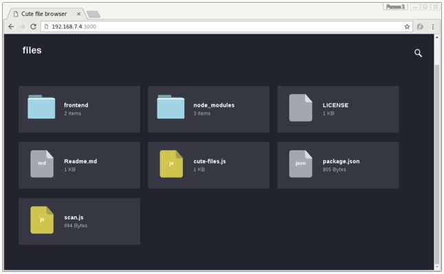

.. SPDX-License-Identifier: CC-BY-SA-2.0-UK

Working with Packages
*********************

This section describes a few tasks that involve packages:

-  :ref:`dev-manual/packages:excluding packages from an image`

-  :ref:`dev-manual/packages:incrementing a package version`

-  :ref:`dev-manual/packages:handling optional module packaging`

-  :ref:`dev-manual/packages:using runtime package management`

-  :ref:`dev-manual/packages:generating and using signed packages`

-  :ref:`Setting up and running package test
   (ptest) <test-manual/ptest:testing packages with ptest>`

-  :ref:`dev-manual/packages:creating node package manager (npm) packages`

-  :ref:`dev-manual/packages:adding custom metadata to packages`

Excluding Packages from an Image
================================

You might find it necessary to prevent specific packages from being
installed into an image. If so, you can use several variables to direct
the build system to essentially ignore installing recommended packages
or to not install a package at all.

The following list introduces variables you can use to prevent packages
from being installed into your image. Each of these variables only works
with IPK and RPM package types, not for Debian packages.
Also, you can use these variables from your ``local.conf`` file
or attach them to a specific image recipe by using a recipe name
override. For more detail on the variables, see the descriptions in the
Yocto Project Reference Manual's glossary chapter.

-  :term:`BAD_RECOMMENDATIONS`:
   Use this variable to specify "recommended-only" packages that you do
   not want installed.

-  :term:`NO_RECOMMENDATIONS`:
   Use this variable to prevent all "recommended-only" packages from
   being installed.

-  :term:`PACKAGE_EXCLUDE`:
   Use this variable to prevent specific packages from being installed
   regardless of whether they are "recommended-only" or not. You need to
   realize that the build process could fail with an error when you
   prevent the installation of a package whose presence is required by
   an installed package.

Incrementing a Package Version
==============================

This section provides some background on how binary package versioning
is accomplished and presents some of the services, variables, and
terminology involved.

In order to understand binary package versioning, you need to consider
the following:

-  Binary Package: The binary package that is eventually built and
   installed into an image.

-  Binary Package Version: The binary package version is composed of two
   components --- a version and a revision.

   .. note::

      Technically, a third component, the "epoch" (i.e. :term:`PE`) is involved
      but this discussion for the most part ignores :term:`PE`.

   The version and revision are taken from the
   :term:`PV` and
   :term:`PR` variables, respectively.

-  :term:`PV`: The recipe version. :term:`PV` represents the version of the
   software being packaged. Do not confuse :term:`PV` with the binary
   package version.

-  :term:`PR`: The recipe revision.

-  :yocto_wiki:`PR Service </PR_Service>`: A
   network-based service that helps automate keeping package feeds
   compatible with existing package manager applications such as RPM,
   APT, and OPKG.

Whenever the binary package content changes, the binary package version
must change. Changing the binary package version is accomplished by
changing or "bumping" the :term:`PR` and/or :term:`PV` values. Increasing these
values occurs one of two ways:

-  Automatically using a Package Revision Service (PR Service).

-  Manually incrementing the :term:`PR` and/or :term:`PV` variables.

Given a primary challenge of any build system and its users is how to
maintain a package feed that is compatible with existing package manager
applications such as RPM, APT, and OPKG, using an automated system is
much preferred over a manual system. In either system, the main
requirement is that binary package version numbering increases in a
linear fashion and that there is a number of version components that
support that linear progression. For information on how to ensure
package revisioning remains linear, see the
":ref:`dev-manual/packages:automatically incrementing a package version number`"
section.

The following three sections provide related information on the PR
Service, the manual method for "bumping" :term:`PR` and/or :term:`PV`, and on
how to ensure binary package revisioning remains linear.

Working With a PR Service
-------------------------

As mentioned, attempting to maintain revision numbers in the
:term:`Metadata` is error prone, inaccurate,
and causes problems for people submitting recipes. Conversely, the PR
Service automatically generates increasing numbers, particularly the
revision field, which removes the human element.

.. note::

   For additional information on using a PR Service, you can see the
   :yocto_wiki:`PR Service </PR_Service>` wiki page.

The Yocto Project uses variables in order of decreasing priority to
facilitate revision numbering (i.e.
:term:`PE`,
:term:`PV`, and
:term:`PR` for epoch, version, and
revision, respectively). The values are highly dependent on the policies
and procedures of a given distribution and package feed.

Because the OpenEmbedded build system uses
":ref:`signatures <overview-manual/concepts:checksums (signatures)>`", which are
unique to a given build, the build system knows when to rebuild
packages. All the inputs into a given task are represented by a
signature, which can trigger a rebuild when different. Thus, the build
system itself does not rely on the :term:`PR`, :term:`PV`, and :term:`PE` numbers to
trigger a rebuild. The signatures, however, can be used to generate
these values.

The PR Service works with both ``OEBasic`` and ``OEBasicHash``
generators. The value of :term:`PR` bumps when the checksum changes and the
different generator mechanisms change signatures under different
circumstances.

As implemented, the build system includes values from the PR Service
into the :term:`PR` field as an addition using the form "``.x``" so ``r0``
becomes ``r0.1``, ``r0.2`` and so forth. This scheme allows existing
:term:`PR` values to be used for whatever reasons, which include manual
:term:`PR` bumps, should it be necessary.

By default, the PR Service is not enabled or running. Thus, the packages
generated are just "self consistent". The build system adds and removes
packages and there are no guarantees about upgrade paths but images will
be consistent and correct with the latest changes.

The simplest form for a PR Service is for a single host development system
that builds the package feed (building system). For this scenario, you can
enable a local PR Service by setting :term:`PRSERV_HOST` in your
``local.conf`` file in the :term:`Build Directory`::

   PRSERV_HOST = "localhost:0"

Once the service is started, packages will automatically
get increasing :term:`PR` values and BitBake takes care of starting and
stopping the server.

If you have a more complex setup where multiple host development systems
work against a common, shared package feed, you have a single PR Service
running and it is connected to each building system. For this scenario,
you need to start the PR Service using the ``bitbake-prserv`` command::

   bitbake-prserv --host ip --port port --start

In addition to
hand-starting the service, you need to update the ``local.conf`` file of
each building system as described earlier so each system points to the
server and port.

It is also recommended you use build history, which adds some sanity
checks to binary package versions, in conjunction with the server that
is running the PR Service. To enable build history, add the following to
each building system's ``local.conf`` file::

   # It is recommended to activate "buildhistory" for testing the PR service
   INHERIT += "buildhistory"
   BUILDHISTORY_COMMIT = "1"

For information on build
history, see the
":ref:`dev-manual/build-quality:maintaining build output quality`" section.

.. note::

   The OpenEmbedded build system does not maintain :term:`PR` information as
   part of the shared state (sstate) packages. If you maintain an sstate
   feed, it's expected that either all your building systems that
   contribute to the sstate feed use a shared PR service, or you do not
   run a PR service on any of your building systems.

   That's because if you had multiple machines sharing a PR service but
   not their sstate feed, you could end up with "diverging" hashes for
   the same output artefacts. When presented to the share PR service,
   each would be considered as new and would increase the revision
   number, causing many unnecessary package upgrades.

   For more information on shared state, see the
   ":ref:`overview-manual/concepts:shared state cache`"
   section in the Yocto Project Overview and Concepts Manual.

Manually Bumping PR
-------------------

The alternative to setting up a PR Service is to manually "bump" the
:term:`PR` variable.

If a committed change results in changing the package output, then the
value of the :term:`PR` variable needs to be increased (or "bumped") as part of
that commit. For new recipes you should add the :term:`PR` variable and set
its initial value equal to "r0", which is the default. Even though the
default value is "r0", the practice of adding it to a new recipe makes
it harder to forget to bump the variable when you make changes to the
recipe in future.

Usually, version increases occur only to binary packages. However, if
for some reason :term:`PV` changes but does not increase, you can increase
the :term:`PE` variable (Package Epoch). The :term:`PE` variable defaults to
"0".

Binary package version numbering strives to follow the `Debian Version
Field Policy
Guidelines <https://www.debian.org/doc/debian-policy/ch-controlfields.html>`__.
These guidelines define how versions are compared and what "increasing"
a version means.

Automatically Incrementing a Package Version Number
---------------------------------------------------

When fetching a repository, BitBake uses the
:term:`SRCREV` variable to determine
the specific source code revision from which to build. You set the
:term:`SRCREV` variable to
:term:`AUTOREV` to cause the
OpenEmbedded build system to automatically use the latest revision of
the software::

   SRCREV = "${AUTOREV}"

Furthermore, you need to include a ``+`` sign in :term:`PV` in order to
automatically update the version whenever the revision of the source
code changes. Here is an example::

   PV = "1.0+git"

The OpenEmbedded build system will automatically add the source control
information to the end of the variable :term:`PKGV`, in this format::

   AUTOINC+source_code_revision

The build system replaces the ``AUTOINC``
with a number. The number used depends on the state of the PR Service:

-  If PR Service is enabled, the build system increments the number,
   which is similar to the behavior of
   :term:`PR`. This behavior results in
   linearly increasing package versions, which is desirable. Here is an
   example:

   .. code-block:: none

      hello-world-git_0.0+git0+b6558dd387-r0.0_armv7a-neon.ipk
      hello-world-git_0.0+git1+dd2f5c3565-r0.0_armv7a-neon.ipk

-  If PR Service is not enabled, the build system replaces the
   ``AUTOINC`` placeholder with zero (i.e. "0"). This results in
   changing the package version since the source revision is included.
   However, package versions are not increased linearly. Here is an
   example:

   .. code-block:: none

      hello-world-git_0.0+git0+b6558dd387-r0.0_armv7a-neon.ipk
      hello-world-git_0.0+git0+dd2f5c3565-r0.0_armv7a-neon.ipk

In summary, the OpenEmbedded build system does not track the history of
binary package versions for this purpose. ``AUTOINC``, in this case, is
comparable to :term:`PR`. If PR server is not enabled, ``AUTOINC`` in the
package version is simply replaced by "0". If PR server is enabled, the
build system keeps track of the package versions and bumps the number
when the package revision changes.

Handling Optional Module Packaging
==================================

Many pieces of software split functionality into optional modules (or
plugins) and the plugins that are built might depend on configuration
options. To avoid having to duplicate the logic that determines what
modules are available in your recipe or to avoid having to package each
module by hand, the OpenEmbedded build system provides functionality to
handle module packaging dynamically.

To handle optional module packaging, you need to do two things:

-  Ensure the module packaging is actually done.

-  Ensure that any dependencies on optional modules from other recipes
   are satisfied by your recipe.

Making Sure the Packaging is Done
---------------------------------

To ensure the module packaging actually gets done, you use the
``do_split_packages`` function within the ``populate_packages`` Python
function in your recipe. The ``do_split_packages`` function searches for
a pattern of files or directories under a specified path and creates a
package for each one it finds by appending to the
:term:`PACKAGES` variable and
setting the appropriate values for ``FILES:packagename``,
``RDEPENDS:packagename``, ``DESCRIPTION:packagename``, and so forth.
Here is an example from the ``lighttpd`` recipe::

   python populate_packages:prepend () {
       lighttpd_libdir = d.expand('${libdir}')
       do_split_packages(d, lighttpd_libdir, '^mod_(.*).so$',
                        'lighttpd-module-%s', 'Lighttpd module for %s',
                         extra_depends='')
   }

The previous example specifies a number of things in the call to
``do_split_packages``.

-  A directory within the files installed by your recipe through
   :ref:`ref-tasks-install` in which to search.

-  A regular expression used to match module files in that directory. In
   the example, note the parentheses () that mark the part of the
   expression from which the module name should be derived.

-  A pattern to use for the package names.

-  A description for each package.

-  An empty string for ``extra_depends``, which disables the default
   dependency on the main ``lighttpd`` package. Thus, if a file in
   ``${libdir}`` called ``mod_alias.so`` is found, a package called
   ``lighttpd-module-alias`` is created for it and the
   :term:`DESCRIPTION` is set to
   "Lighttpd module for alias".

Often, packaging modules is as simple as the previous example. However,
there are more advanced options that you can use within
``do_split_packages`` to modify its behavior. And, if you need to, you
can add more logic by specifying a hook function that is called for each
package. It is also perfectly acceptable to call ``do_split_packages``
multiple times if you have more than one set of modules to package.

For more examples that show how to use ``do_split_packages``, see the
``connman.inc`` file in the ``meta/recipes-connectivity/connman/``
directory of the ``poky`` :ref:`source repository <overview-manual/development-environment:yocto project source repositories>`. You can
also find examples in ``meta/classes-recipe/kernel.bbclass``.

Here is a reference that shows ``do_split_packages`` mandatory and
optional arguments::

   Mandatory arguments

   root
      The path in which to search
   file_regex
      Regular expression to match searched files.
      Use parentheses () to mark the part of this
      expression that should be used to derive the
      module name (to be substituted where %s is
      used in other function arguments as noted below)
   output_pattern
      Pattern to use for the package names. Must
      include %s.
   description
      Description to set for each package. Must
      include %s.

   Optional arguments

   postinst
      Postinstall script to use for all packages
      (as a string)
   recursive
      True to perform a recursive search --- default
      False
   hook
      A hook function to be called for every match.
      The function will be called with the following
      arguments (in the order listed):

      f
         Full path to the file/directory match
      pkg
         The package name
      file_regex
         As above
      output_pattern
         As above
      modulename
         The module name derived using file_regex
   extra_depends
      Extra runtime dependencies (RDEPENDS) to be
      set for all packages. The default value of None
      causes a dependency on the main package
      (${PN}) --- if you do not want this, pass empty
      string '' for this parameter.
   aux_files_pattern
      Extra item(s) to be added to FILES for each
      package. Can be a single string item or a list
      of strings for multiple items. Must include %s.
   postrm
      postrm script to use for all packages (as a
      string)
   allow_dirs
      True to allow directories to be matched -
      default False
   prepend
      If True, prepend created packages to PACKAGES
      instead of the default False which appends them
   match_path
      match file_regex on the whole relative path to
      the root rather than just the filename
   aux_files_pattern_verbatim
      Extra item(s) to be added to FILES for each
      package, using the actual derived module name
      rather than converting it to something legal
      for a package name. Can be a single string item
      or a list of strings for multiple items. Must
      include %s.
   allow_links
      True to allow symlinks to be matched --- default
      False
   summary
      Summary to set for each package. Must include %s;
      defaults to description if not set.

Satisfying Dependencies
-----------------------

The second part for handling optional module packaging is to ensure that
any dependencies on optional modules from other recipes are satisfied by
your recipe. You can be sure these dependencies are satisfied by using
the :term:`PACKAGES_DYNAMIC`
variable. Here is an example that continues with the ``lighttpd`` recipe
shown earlier::

   PACKAGES_DYNAMIC = "lighttpd-module-.*"

The name
specified in the regular expression can of course be anything. In this
example, it is ``lighttpd-module-`` and is specified as the prefix to
ensure that any :term:`RDEPENDS` and
:term:`RRECOMMENDS` on a package
name starting with the prefix are satisfied during build time. If you
are using ``do_split_packages`` as described in the previous section,
the value you put in :term:`PACKAGES_DYNAMIC` should correspond to the name
pattern specified in the call to ``do_split_packages``.

Using Runtime Package Management
================================

During a build, BitBake always transforms a recipe into one or more
packages. For example, BitBake takes the ``bash`` recipe and produces a
number of packages (e.g. ``bash``, ``bash-bashbug``,
``bash-completion``, ``bash-completion-dbg``, ``bash-completion-dev``,
``bash-completion-extra``, ``bash-dbg``, and so forth). Not all
generated packages are included in an image.

In several situations, you might need to update, add, remove, or query
the packages on a target device at runtime (i.e. without having to
generate a new image). Examples of such situations include:

-  You want to provide in-the-field updates to deployed devices (e.g.
   security updates).

-  You want to have a fast turn-around development cycle for one or more
   applications that run on your device.

-  You want to temporarily install the "debug" packages of various
   applications on your device so that debugging can be greatly improved
   by allowing access to symbols and source debugging.

-  You want to deploy a more minimal package selection of your device
   but allow in-the-field updates to add a larger selection for
   customization.

In all these situations, you have something similar to a more
traditional Linux distribution in that in-field devices are able to
receive pre-compiled packages from a server for installation or update.
Being able to install these packages on a running, in-field device is
what is termed "runtime package management".

In order to use runtime package management, you need a host or server
machine that serves up the pre-compiled packages plus the required
metadata. You also need package manipulation tools on the target. The
build machine is a likely candidate to act as the server. However, that
machine does not necessarily have to be the package server. The build
machine could push its artifacts to another machine that acts as the
server (e.g. Internet-facing). In fact, doing so is advantageous for a
production environment as getting the packages away from the development
system's :term:`Build Directory` prevents accidental overwrites.

A simple build that targets just one device produces more than one
package database. In other words, the packages produced by a build are
separated out into a couple of different package groupings based on
criteria such as the target's CPU architecture, the target board, or the
C library used on the target. For example, a build targeting the
``qemux86`` device produces the following three package databases:
``noarch``, ``i586``, and ``qemux86``. If you wanted your ``qemux86``
device to be aware of all the packages that were available to it, you
would need to point it to each of these databases individually. In a
similar way, a traditional Linux distribution usually is configured to
be aware of a number of software repositories from which it retrieves
packages.

Using runtime package management is completely optional and not required
for a successful build or deployment in any way. But if you want to make
use of runtime package management, you need to do a couple things above
and beyond the basics. The remainder of this section describes what you
need to do.

Build Considerations
--------------------

This section describes build considerations of which you need to be
aware in order to provide support for runtime package management.

When BitBake generates packages, it needs to know what format or formats
to use. In your configuration, you use the
:term:`PACKAGE_CLASSES`
variable to specify the format:

#. Open the ``local.conf`` file inside your :term:`Build Directory` (e.g.
   ``poky/build/conf/local.conf``).

#. Select the desired package format as follows::

      PACKAGE_CLASSES ?= "package_packageformat"

   where packageformat can be "ipk", "rpm",
   "deb", or "tar" which are the supported package formats.

   .. note::

      Because the Yocto Project supports four different package formats,
      you can set the variable with more than one argument. However, the
      OpenEmbedded build system only uses the first argument when
      creating an image or Software Development Kit (SDK).

If you would like your image to start off with a basic package database
containing the packages in your current build as well as to have the
relevant tools available on the target for runtime package management,
you can include "package-management" in the
:term:`IMAGE_FEATURES`
variable. Including "package-management" in this configuration variable
ensures that when the image is assembled for your target, the image
includes the currently-known package databases as well as the
target-specific tools required for runtime package management to be
performed on the target. However, this is not strictly necessary. You
could start your image off without any databases but only include the
required on-target package tool(s). As an example, you could include
"opkg" in your
:term:`IMAGE_INSTALL` variable
if you are using the IPK package format. You can then initialize your
target's package database(s) later once your image is up and running.

Whenever you perform any sort of build step that can potentially
generate a package or modify existing package, it is always a good idea
to re-generate the package index after the build by using the following
command::

   $ bitbake package-index

It might be tempting to build the
package and the package index at the same time with a command such as
the following::

   $ bitbake some-package package-index

Do not do this as
BitBake does not schedule the package index for after the completion of
the package you are building. Consequently, you cannot be sure of the
package index including information for the package you just built.
Thus, be sure to run the package update step separately after building
any packages.

You can use the
:term:`PACKAGE_FEED_ARCHS`,
:term:`PACKAGE_FEED_BASE_PATHS`,
and
:term:`PACKAGE_FEED_URIS`
variables to pre-configure target images to use a package feed. If you
do not define these variables, then manual steps as described in the
subsequent sections are necessary to configure the target. You should
set these variables before building the image in order to produce a
correctly configured image.

.. note::

   Your image will need enough free storage space to run package upgrades,
   especially if many of them need to be downloaded at the same time.
   You should make sure images are created with enough free space
   by setting the :term:`IMAGE_ROOTFS_EXTRA_SPACE` variable.

When your build is complete, your packages reside in the
``${TMPDIR}/deploy/packageformat`` directory. For example, if
``${``\ :term:`TMPDIR`\ ``}`` is
``tmp`` and your selected package type is RPM, then your RPM packages
are available in ``tmp/deploy/rpm``.

Host or Server Machine Setup
----------------------------

Although other protocols are possible, a server using HTTP typically
serves packages. If you want to use HTTP, then set up and configure a
web server such as Apache 2, lighttpd, or Python web server on the
machine serving the packages.

To keep things simple, this section describes how to set up a
Python web server to share package feeds from the developer's
machine. Although this server might not be the best for a production
environment, the setup is simple and straight forward. Should you want
to use a different server more suited for production (e.g. Apache 2,
Lighttpd, or Nginx), take the appropriate steps to do so.

From within the :term:`Build Directory` where you have built an image based on
your packaging choice (i.e. the :term:`PACKAGE_CLASSES` setting), simply start
the server. The following example assumes a :term:`Build Directory` of ``poky/build``
and a :term:`PACKAGE_CLASSES` setting of ":ref:`ref-classes-package_rpm`"::

   $ cd poky/build/tmp/deploy/rpm
   $ python3 -m http.server

Target Setup
------------

Setting up the target differs depending on the package management
system. This section provides information for RPM, IPK, and DEB.

Using RPM
~~~~~~~~~

The :wikipedia:`Dandified Packaging <DNF_(software)>` (DNF) performs
runtime package management of RPM packages. In order to use DNF for
runtime package management, you must perform an initial setup on the
target machine for cases where the ``PACKAGE_FEED_*`` variables were not
set as part of the image that is running on the target. This means if
you built your image and did not use these variables as part of the
build and your image is now running on the target, you need to perform
the steps in this section if you want to use runtime package management.

.. note::

   For information on the ``PACKAGE_FEED_*`` variables, see
   :term:`PACKAGE_FEED_ARCHS`, :term:`PACKAGE_FEED_BASE_PATHS`, and
   :term:`PACKAGE_FEED_URIS` in the Yocto Project Reference Manual variables
   glossary.

On the target, you must inform DNF that package databases are available.
You do this by creating a file named
``/etc/yum.repos.d/oe-packages.repo`` and defining the ``oe-packages``.

As an example, assume the target is able to use the following package
databases: ``all``, ``i586``, and ``qemux86`` from a server named
``my.server``. The specifics for setting up the web server are up to
you. The critical requirement is that the URIs in the target repository
configuration point to the correct remote location for the feeds.

.. note::

   For development purposes, you can point the web server to the build
   system's ``deploy`` directory. However, for production use, it is better to
   copy the package directories to a location outside of the build area and use
   that location. Doing so avoids situations where the build system
   overwrites or changes the ``deploy`` directory.

When telling DNF where to look for the package databases, you must
declare individual locations per architecture or a single location used
for all architectures. You cannot do both:

-  *Create an Explicit List of Architectures:* Define individual base
   URLs to identify where each package database is located:

   .. code-block:: none

      [oe-packages]
      baseurl=http://my.server/rpm/i586  http://my.server/rpm/qemux86 http://my.server/rpm/all

   This example
   informs DNF about individual package databases for all three
   architectures.

-  *Create a Single (Full) Package Index:* Define a single base URL that
   identifies where a full package database is located::

      [oe-packages]
      baseurl=http://my.server/rpm

   This example informs DNF about a single
   package database that contains all the package index information for
   all supported architectures.

Once you have informed DNF where to find the package databases, you need
to fetch them:

.. code-block:: none

   # dnf makecache

DNF is now able to find, install, and
upgrade packages from the specified repository or repositories.

.. note::

   See the `DNF documentation <https://dnf.readthedocs.io/en/latest/>`__ for
   additional information.

Using IPK
~~~~~~~~~

The ``opkg`` application performs runtime package management of IPK
packages. You must perform an initial setup for ``opkg`` on the target
machine if the
:term:`PACKAGE_FEED_ARCHS`,
:term:`PACKAGE_FEED_BASE_PATHS`,
and
:term:`PACKAGE_FEED_URIS`
variables have not been set or the target image was built before the
variables were set.

The ``opkg`` application uses configuration files to find available
package databases. Thus, you need to create a configuration file inside
the ``/etc/opkg/`` directory, which informs ``opkg`` of any repository
you want to use.

As an example, suppose you are serving packages from a ``ipk/``
directory containing the ``i586``, ``all``, and ``qemux86`` databases
through an HTTP server named ``my.server``. On the target, create a
configuration file (e.g. ``my_repo.conf``) inside the ``/etc/opkg/``
directory containing the following:

.. code-block:: none

   src/gz all http://my.server/ipk/all
   src/gz i586 http://my.server/ipk/i586
   src/gz qemux86 http://my.server/ipk/qemux86

Next, instruct ``opkg`` to fetch the
repository information:

.. code-block:: none

   # opkg update

The ``opkg`` application is now able to find, install, and upgrade packages
from the specified repository.

Using DEB
~~~~~~~~~

The ``apt`` application performs runtime package management of DEB
packages. This application uses a source list file to find available
package databases. You must perform an initial setup for ``apt`` on the
target machine if the
:term:`PACKAGE_FEED_ARCHS`,
:term:`PACKAGE_FEED_BASE_PATHS`,
and
:term:`PACKAGE_FEED_URIS`
variables have not been set or the target image was built before the
variables were set.

To inform ``apt`` of the repository you want to use, you might create a
list file (e.g. ``my_repo.list``) inside the
``/etc/apt/sources.list.d/`` directory. As an example, suppose you are
serving packages from a ``deb/`` directory containing the ``i586``,
``all``, and ``qemux86`` databases through an HTTP server named
``my.server``. The list file should contain:

.. code-block:: none

   deb http://my.server/deb/all ./
   deb http://my.server/deb/i586 ./
   deb http://my.server/deb/qemux86 ./

Next, instruct the ``apt`` application
to fetch the repository information:

.. code-block:: none

  $ sudo apt update

After this step,
``apt`` is able to find, install, and upgrade packages from the
specified repository.

Generating and Using Signed Packages
====================================

In order to add security to RPM packages used during a build, you can
take steps to securely sign them. Once a signature is verified, the
OpenEmbedded build system can use the package in the build. If security
fails for a signed package, the build system stops the build.

This section describes how to sign RPM packages during a build and how
to use signed package feeds (repositories) when doing a build.

Signing RPM Packages
--------------------

To enable signing RPM packages, you must modify the ``rpm``
recipe configuration to include support for OpenPGP signing.
That may be done either in a ``.bbappend`` for the ``rpm`` recipe::

   PACKAGECONFIG:append = " sequoia"

or in a :term:`Configuration File`::

   PACKAGECONFIG:append:pn-rpm-native = " sequoia"
   PACKAGECONFIG:append:pn-rpm = " sequoia"

You must also set up the following settings in a
:term:`Configuration File`::

   # Inherit sign_rpm.bbclass to enable signing functionality
   INHERIT += " sign_rpm"
   # Define the GPG key that will be used for signing.
   RPM_GPG_NAME = "key_name"
   # Provide passphrase for the key
   RPM_GPG_PASSPHRASE = "passphrase"

.. note::

   Be sure to supply appropriate values for both `key_name` and
   `passphrase`.

Aside from the ``RPM_GPG_NAME`` and ``RPM_GPG_PASSPHRASE`` variables in
the previous example, two optional variables related to signing are available:

-  *GPG_BIN:* Specifies a ``gpg`` binary/wrapper that is executed
   when the package is signed.

-  *GPG_PATH:* Specifies the ``gpg`` home directory used when the
   package is signed.

Processing Package Feeds
------------------------

In addition to being able to sign RPM packages, you can also enable
signed package feeds for IPK and RPM packages.

The steps you need to take to enable signed package feed use are similar
to the steps used to sign RPM packages. You must define the following in
your ``local.config`` or ``distro.config`` file::

   INHERIT += "sign_package_feed"
   PACKAGE_FEED_GPG_NAME = "key_name"
   PACKAGE_FEED_GPG_PASSPHRASE_FILE = "path_to_file_containing_passphrase"

For signed package feeds, the passphrase must be specified in a separate file,
which is pointed to by the ``PACKAGE_FEED_GPG_PASSPHRASE_FILE``
variable. Regarding security, keeping a plain text passphrase out of the
configuration is more secure.

Aside from the ``PACKAGE_FEED_GPG_NAME`` and
``PACKAGE_FEED_GPG_PASSPHRASE_FILE`` variables, three optional variables
related to signed package feeds are available:

-  *GPG_BIN* Specifies a ``gpg`` binary/wrapper that is executed
   when the package is signed.

-  *GPG_PATH:* Specifies the ``gpg`` home directory used when the
   package is signed.

-  *PACKAGE_FEED_GPG_SIGNATURE_TYPE:* Specifies the type of ``gpg``
   signature. This variable applies only to RPM and IPK package feeds.
   Allowable values for the ``PACKAGE_FEED_GPG_SIGNATURE_TYPE`` are
   "ASC", which is the default and specifies ascii armored, and "BIN",
   which specifies binary.

Testing Packages With ptest
===========================

See the :ref:`test-manual/ptest:Testing Packages With ptest` section of the
Yocto Project Test Environment Manual.

Creating Node Package Manager (NPM) Packages
============================================

:wikipedia:`NPM <Npm_(software)>` is a package manager for the JavaScript
programming language. The Yocto Project supports the NPM
:ref:`fetcher <bitbake-user-manual/bitbake-user-manual-fetching:fetchers>`.
You can use this fetcher in combination with
:doc:`devtool </ref-manual/devtool-reference>` to create recipes that produce
NPM packages.

There are two workflows that allow you to create NPM packages using
``devtool``: the NPM registry modules method and the NPM project code
method.

.. note::

   While it is possible to create NPM recipes manually, using
   ``devtool`` is far simpler.

Additionally, some requirements and caveats exist.

Requirements and Caveats
------------------------

You need to be aware of the following before using ``devtool`` to create
NPM packages:

-  Of the two methods that you can use ``devtool`` to create NPM
   packages, the registry approach is slightly simpler. However, you
   might consider the project approach because you do not have to
   publish your module in the `NPM registry <https://docs.npmjs.com/misc/registry>`__,
   which is NPM's public registry.

-  Be familiar with
   :doc:`devtool </ref-manual/devtool-reference>`.

-  The NPM host tools need the native ``nodejs-npm`` package, which is
   part of the OpenEmbedded environment. You need to get the package by
   cloning the :oe_git:`meta-openembedded </meta-openembedded>`
   repository. Be sure to add the path to your local copy
   to your ``bblayers.conf`` file.

-  ``devtool`` cannot detect native libraries in module dependencies.
   Consequently, you must manually add packages to your recipe.

-  While deploying NPM packages, ``devtool`` cannot determine which
   dependent packages are missing on the target (e.g. the node runtime
   ``nodejs``). Consequently, you need to find out what files are
   missing and be sure they are on the target.

-  Although you might not need NPM to run your node package, it is
   useful to have NPM on your target. The NPM package name is
   ``nodejs-npm``.

Using the Registry Modules Method
---------------------------------

This section presents an example that uses the ``cute-files`` module,
which is a file browser web application.

.. note::

   You must know the ``cute-files`` module version.

The first thing you need to do is use ``devtool`` and the NPM fetcher to
create the recipe::

   $ devtool add "npm://registry.npmjs.org;package=cute-files;version=1.0.2"

The
``devtool add`` command runs ``recipetool create`` and uses the same
fetch URI to download each dependency and capture license details where
possible. The result is a generated recipe.

After running for quite a long time, in particular building the
``nodejs-native`` package, the command should end as follows::

   INFO: Recipe /home/.../build/workspace/recipes/cute-files/cute-files_1.0.2.bb has been automatically created; further editing may be required to make it fully functional

The recipe file is fairly simple and contains every license that
``recipetool`` finds and includes the licenses in the recipe's
:term:`LIC_FILES_CHKSUM`
variables. You need to examine the variables and look for those with
"unknown" in the :term:`LICENSE`
field. You need to track down the license information for "unknown"
modules and manually add the information to the recipe.

``recipetool`` creates a "shrinkwrap" file for your recipe. Shrinkwrap
files capture the version of all dependent modules. Many packages do not
provide shrinkwrap files but ``recipetool`` will create a shrinkwrap file as it
runs.

.. note::

   A package is created for each sub-module. This policy is the only
   practical way to have the licenses for all of the dependencies
   represented in the license manifest of the image.

The ``devtool edit-recipe`` command lets you take a look at the recipe::

   $ devtool edit-recipe cute-files
   # Recipe created by recipetool
   # This is the basis of a recipe and may need further editing in order to be fully functional.
   # (Feel free to remove these comments when editing.)

   SUMMARY = "Turn any folder on your computer into a cute file browser, available on the local network."
   # WARNING: the following LICENSE and LIC_FILES_CHKSUM values are best guesses - it is
   # your responsibility to verify that the values are complete and correct.
   #
   # NOTE: multiple licenses have been detected; they have been separated with &
   # in the LICENSE value for now since it is a reasonable assumption that all
   # of the licenses apply. If instead there is a choice between the multiple
   # licenses then you should change the value to separate the licenses with |
   # instead of &. If there is any doubt, check the accompanying documentation
   # to determine which situation is applicable.

   SUMMARY = "Turn any folder on your computer into a cute file browser, available on the local network."
   LICENSE = "BSD-3-Clause & ISC & MIT"
   LIC_FILES_CHKSUM = "file://LICENSE;md5=71d98c0a1db42956787b1909c74a86ca \
                       file://node_modules/accepts/LICENSE;md5=bf1f9ad1e2e1d507aef4883fff7103de \
                       file://node_modules/array-flatten/LICENSE;md5=44088ba57cb871a58add36ce51b8de08 \
   ...
                       file://node_modules/cookie-signature/Readme.md;md5=57ae8b42de3dd0c1f22d5f4cf191e15a"

   SRC_URI = " \
       npm://registry.npmjs.org/;package=cute-files;version=${PV} \
       npmsw://${THISDIR}/${BPN}/npm-shrinkwrap.json \
       "

   S = "${WORKDIR}/npm"

   inherit npm

   LICENSE:${PN} = "MIT"
   LICENSE:${PN}-accepts = "MIT"
   LICENSE:${PN}-array-flatten = "MIT"
   ...
   LICENSE:${PN}-vary = "MIT"

Three key points in the previous example are:

-  :term:`SRC_URI` uses the NPM
   scheme so that the NPM fetcher is used.

-  ``recipetool`` collects all the license information. If a
   sub-module's license is unavailable, the sub-module's name appears in
   the comments.

-  The ``inherit npm`` statement causes the :ref:`ref-classes-npm` class to
   package up all the modules.

You can run the following command to build the ``cute-files`` package::

   $ devtool build cute-files

Remember that ``nodejs`` must be installed on
the target before your package.

Assuming 192.168.7.2 for the target's IP address, use the following
command to deploy your package::

   $ devtool deploy-target -s cute-files root@192.168.7.2

Once the package is installed on the target, you can
test the application to show the contents of any directory::

  $ cd /usr/lib/node_modules/cute-files
  $ cute-files

On a browser,
go to ``http://192.168.7.2:3000`` and you see the following:

You can find the recipe in ``workspace/recipes/cute-files``. You can use
the recipe in any layer you choose.

Using the NPM Projects Code Method
----------------------------------

Although it is useful to package modules already in the NPM registry,
adding ``node.js`` projects under development is a more common developer
use case.

This section covers the NPM projects code method, which is very similar
to the "registry" approach described in the previous section. In the NPM
projects method, you provide ``devtool`` with an URL that points to the
source files.

Replicating the same example, (i.e. ``cute-files``) use the following
command::

   $ devtool add https://github.com/martinaglv/cute-files.git

The recipe this command generates is very similar to the recipe created in
the previous section. However, the :term:`SRC_URI` looks like the following::

   SRC_URI = " \
       git://github.com/martinaglv/cute-files.git;protocol=https;branch=master \
       npmsw://${THISDIR}/${BPN}/npm-shrinkwrap.json \
       "

In this example,
the main module is taken from the Git repository and dependencies are
taken from the NPM registry. Other than those differences, the recipe is
basically the same between the two methods. You can build and deploy the
package exactly as described in the previous section that uses the
registry modules method.

Adding custom metadata to packages
==================================

The variable
:term:`PACKAGE_ADD_METADATA`
can be used to add additional metadata to packages. This is reflected in
the package control/spec file. To take the ipk format for example, the
CONTROL file stored inside would contain the additional metadata as
additional lines.

The variable can be used in multiple ways, including using suffixes to
set it for a specific package type and/or package. Note that the order
of precedence is the same as this list:

-  ``PACKAGE_ADD_METADATA_<PKGTYPE>:<PN>``

-  ``PACKAGE_ADD_METADATA_<PKGTYPE>``

-  ``PACKAGE_ADD_METADATA:<PN>``

-  :term:`PACKAGE_ADD_METADATA`

`<PKGTYPE>` is a parameter and expected to be a distinct name of specific
package type:

-  IPK for .ipk packages

-  DEB for .deb packages

-  RPM for .rpm packages

`<PN>` is a parameter and expected to be a package name.

The variable can contain multiple [one-line] metadata fields separated
by the literal sequence '\\n'. The separator can be redefined using the
variable flag ``separator``.

Here is an example that adds two custom fields for ipk
packages::

   PACKAGE_ADD_METADATA_IPK = "Vendor: CustomIpk\nGroup:Applications/Spreadsheets"

