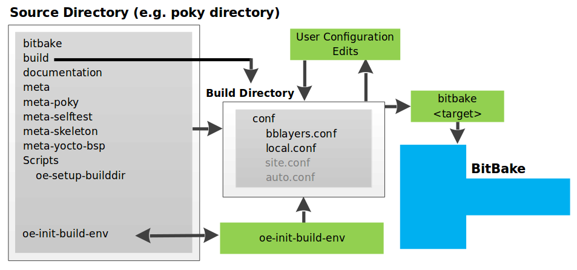
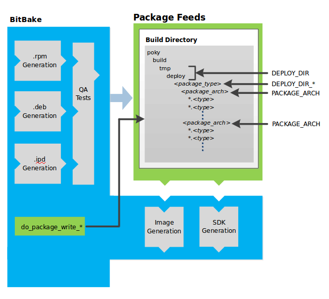
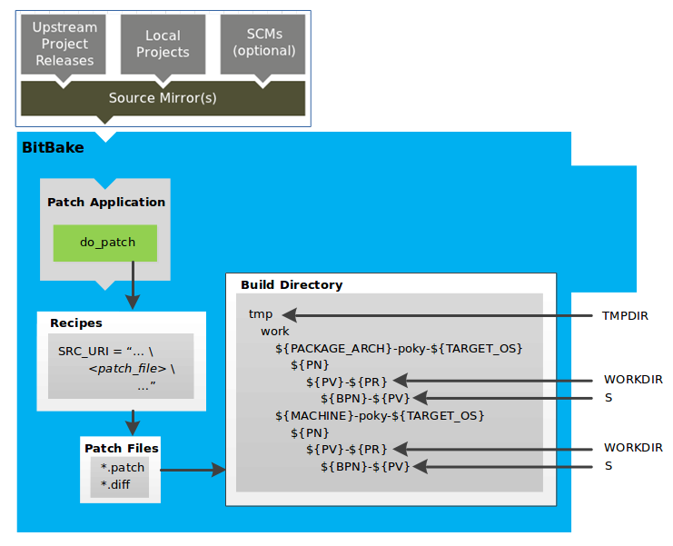

.. SPDX-License-Identifier: CC-BY-SA-2.0-UK

**********************
Yocto Project Concepts
**********************

This chapter provides explanations for Yocto Project concepts that go
beyond the surface of "how-to" information and reference (or look-up)
material. Concepts such as components, the :term:`OpenEmbedded Build System`
workflow,
cross-development toolchains, shared state cache, and so forth are
explained.

Yocto Project Components
========================

The :term:`BitBake` task executor
together with various types of configuration files form the
:term:`OpenEmbedded-Core (OE-Core)`. This section
overviews these components by describing their use and how they
interact.

BitBake handles the parsing and execution of the data files. The data
itself is of various types:

-  *Recipes:* Provides details about particular pieces of software.

-  *Class Data:* Abstracts common build information (e.g. how to build a
   Linux kernel).

-  *Configuration Data:* Defines machine-specific settings, policy
   decisions, and so forth. Configuration data acts as the glue to bind
   everything together.

BitBake knows how to combine multiple data sources together and refers
to each data source as a layer. For information on layers, see the
":ref:`dev-manual/common-tasks:understanding and creating layers`"
section of the Yocto Project Development Tasks Manual.

Following are some brief details on these core components. For
additional information on how these components interact during a build,
see the
":ref:`overview-manual/concepts:openembedded build system concepts`"
section.

BitBake
-------

BitBake is the tool at the heart of the :term:`OpenEmbedded Build System`
and is responsible
for parsing the :term:`Metadata`, generating
a list of tasks from it, and then executing those tasks.

This section briefly introduces BitBake. If you want more information on
BitBake, see the :doc:`BitBake User Manual <bitbake:index>`.

To see a list of the options BitBake supports, use either of the
following commands:
::

   $ bitbake -h
   $ bitbake --help

The most common usage for BitBake is ``bitbake recipename``, where
``recipename`` is the name of the recipe you want to build (referred
to as the "target"). The target often equates to the first part of a
recipe's filename (e.g. "foo" for a recipe named ``foo_1.3.0-r0.bb``).
So, to process the ``matchbox-desktop_1.2.3.bb`` recipe file, you might
type the following:
::

   $ bitbake matchbox-desktop

Several different
versions of ``matchbox-desktop`` might exist. BitBake chooses the one
selected by the distribution configuration. You can get more details
about how BitBake chooses between different target versions and
providers in the
":ref:`Preferences <bitbake:bitbake-user-manual/bitbake-user-manual-execution:preferences>`" section
of the BitBake User Manual.

BitBake also tries to execute any dependent tasks first. So for example,
before building ``matchbox-desktop``, BitBake would build a cross
compiler and ``glibc`` if they had not already been built.

A useful BitBake option to consider is the ``-k`` or ``--continue``
option. This option instructs BitBake to try and continue processing the
job as long as possible even after encountering an error. When an error
occurs, the target that failed and those that depend on it cannot be
remade. However, when you use this option other dependencies can still
be processed.

Recipes
-------

Files that have the ``.bb`` suffix are "recipes" files. In general, a
recipe contains information about a single piece of software. This
information includes the location from which to download the unaltered
source, any source patches to be applied to that source (if needed),
which special configuration options to apply, how to compile the source
files, and how to package the compiled output.

The term "package" is sometimes used to refer to recipes. However, since
the word "package" is used for the packaged output from the OpenEmbedded
build system (i.e. ``.ipk`` or ``.deb`` files), this document avoids
using the term "package" when referring to recipes.

Classes
-------

Class files (``.bbclass``) contain information that is useful to share
between recipes files. An example is the
:ref:`autotools <ref-classes-autotools>` class,
which contains common settings for any application that Autotools uses.
The ":ref:`ref-manual/classes:Classes`" chapter in the
Yocto Project Reference Manual provides details about classes and how to
use them.

Configurations
--------------

The configuration files (``.conf``) define various configuration
variables that govern the OpenEmbedded build process. These files fall
into several areas that define machine configuration options,
distribution configuration options, compiler tuning options, general
common configuration options, and user configuration options in
``conf/local.conf``, which is found in the :term:`Build Directory`.

Layers
======

Layers are repositories that contain related metadata (i.e. sets of
instructions) that tell the OpenEmbedded build system how to build a
target. Yocto Project's `layer model <#the-yocto-project-layer-model>`__
facilitates collaboration, sharing, customization, and reuse within the
Yocto Project development environment. Layers logically separate
information for your project. For example, you can use a layer to hold
all the configurations for a particular piece of hardware. Isolating
hardware-specific configurations allows you to share other metadata by
using a different layer where that metadata might be common across
several pieces of hardware.

Many layers exist that work in the Yocto Project development environment. The
:yocto_home:`Yocto Project Curated Layer Index </software-overview/layers/>`
and :oe_layerindex:`OpenEmbedded Layer Index <>` both contain layers from
which you can use or leverage.

By convention, layers in the Yocto Project follow a specific form.
Conforming to a known structure allows BitBake to make assumptions
during builds on where to find types of metadata. You can find
procedures and learn about tools (i.e. ``bitbake-layers``) for creating
layers suitable for the Yocto Project in the
":ref:`dev-manual/common-tasks:understanding and creating layers`"
section of the Yocto Project Development Tasks Manual.

OpenEmbedded Build System Concepts
==================================

This section takes a more detailed look inside the build process used by
the :term:`OpenEmbedded Build System`,
which is the build
system specific to the Yocto Project. At the heart of the build system
is BitBake, the task executor.

The following diagram represents the high-level workflow of a build. The
remainder of this section expands on the fundamental input, output,
process, and metadata logical blocks that make up the workflow.

.. image:: figures/YP-flow-diagram.png
   :align: center

In general, the build's workflow consists of several functional areas:

-  *User Configuration:* metadata you can use to control the build
   process.

-  *Metadata Layers:* Various layers that provide software, machine, and
   distro metadata.

-  *Source Files:* Upstream releases, local projects, and SCMs.

-  *Build System:* Processes under the control of
   :term:`BitBake`. This block expands
   on how BitBake fetches source, applies patches, completes
   compilation, analyzes output for package generation, creates and
   tests packages, generates images, and generates cross-development
   tools.

-  *Package Feeds:* Directories containing output packages (RPM, DEB or
   IPK), which are subsequently used in the construction of an image or
   Software Development Kit (SDK), produced by the build system. These
   feeds can also be copied and shared using a web server or other means
   to facilitate extending or updating existing images on devices at
   runtime if runtime package management is enabled.

-  *Images:* Images produced by the workflow.

-  *Application Development SDK:* Cross-development tools that are
   produced along with an image or separately with BitBake.

User Configuration
------------------

User configuration helps define the build. Through user configuration,
you can tell BitBake the target architecture for which you are building
the image, where to store downloaded source, and other build properties.

The following figure shows an expanded representation of the "User
Configuration" box of the `general workflow
figure <#general-workflow-figure>`__:

BitBake needs some basic configuration files in order to complete a
build. These files are ``*.conf`` files. The minimally necessary ones
reside as example files in the ``build/conf`` directory of the
:term:`Source Directory`. For simplicity,
this section refers to the Source Directory as the "Poky Directory."

When you clone the :term:`Poky` Git repository
or you download and unpack a Yocto Project release, you can set up the
Source Directory to be named anything you want. For this discussion, the
cloned repository uses the default name ``poky``.

.. note::

   The Poky repository is primarily an aggregation of existing
   repositories. It is not a canonical upstream source.

The ``meta-poky`` layer inside Poky contains a ``conf`` directory that
has example configuration files. These example files are used as a basis
for creating actual configuration files when you source
:ref:`structure-core-script`, which is the
build environment script.

Sourcing the build environment script creates a
:term:`Build Directory` if one does not
already exist. BitBake uses the Build Directory for all its work during
builds. The Build Directory has a ``conf`` directory that contains
default versions of your ``local.conf`` and ``bblayers.conf``
configuration files. These default configuration files are created only
if versions do not already exist in the Build Directory at the time you
source the build environment setup script.

Because the Poky repository is fundamentally an aggregation of existing
repositories, some users might be familiar with running the
:ref:`structure-core-script` script in the context of separate
:term:`OpenEmbedded-Core (OE-Core)` and BitBake
repositories rather than a single Poky repository. This discussion
assumes the script is executed from within a cloned or unpacked version
of Poky.

Depending on where the script is sourced, different sub-scripts are
called to set up the Build Directory (Yocto or OpenEmbedded).
Specifically, the script ``scripts/oe-setup-builddir`` inside the poky
directory sets up the Build Directory and seeds the directory (if
necessary) with configuration files appropriate for the Yocto Project
development environment.

.. note::

   The
   scripts/oe-setup-builddir
   script uses the
   ``$TEMPLATECONF``
   variable to determine which sample configuration files to locate.

The ``local.conf`` file provides many basic variables that define a
build environment. Here is a list of a few. To see the default
configurations in a ``local.conf`` file created by the build environment
script, see the
:yocto_git:`local.conf.sample </poky/tree/meta-poky/conf/local.conf.sample>`
in the ``meta-poky`` layer:

-  *Target Machine Selection:* Controlled by the
   :term:`MACHINE` variable.

-  *Download Directory:* Controlled by the
   :term:`DL_DIR` variable.

-  *Shared State Directory:* Controlled by the
   :term:`SSTATE_DIR` variable.

-  *Build Output:* Controlled by the
   :term:`TMPDIR` variable.

-  *Distribution Policy:* Controlled by the
   :term:`DISTRO` variable.

-  *Packaging Format:* Controlled by the
   :term:`PACKAGE_CLASSES`
   variable.

-  *SDK Target Architecture:* Controlled by the
   :term:`SDKMACHINE` variable.

-  *Extra Image Packages:* Controlled by the
   :term:`EXTRA_IMAGE_FEATURES`
   variable.

.. note::

   Configurations set in the
   conf/local.conf
   file can also be set in the
   conf/site.conf
   and
   conf/auto.conf
   configuration files.

The ``bblayers.conf`` file tells BitBake what layers you want considered
during the build. By default, the layers listed in this file include
layers minimally needed by the build system. However, you must manually
add any custom layers you have created. You can find more information on
working with the ``bblayers.conf`` file in the
":ref:`dev-manual/common-tasks:enabling your layer`"
section in the Yocto Project Development Tasks Manual.

The files ``site.conf`` and ``auto.conf`` are not created by the
environment initialization script. If you want the ``site.conf`` file,
you need to create that yourself. The ``auto.conf`` file is typically
created by an autobuilder:

-  *site.conf:* You can use the ``conf/site.conf`` configuration
   file to configure multiple build directories. For example, suppose
   you had several build environments and they shared some common
   features. You can set these default build properties here. A good
   example is perhaps the packaging format to use through the
   :term:`PACKAGE_CLASSES`
   variable.

   One useful scenario for using the ``conf/site.conf`` file is to
   extend your :term:`BBPATH` variable
   to include the path to a ``conf/site.conf``. Then, when BitBake looks
   for Metadata using ``BBPATH``, it finds the ``conf/site.conf`` file
   and applies your common configurations found in the file. To override
   configurations in a particular build directory, alter the similar
   configurations within that build directory's ``conf/local.conf``
   file.

-  *auto.conf:* The file is usually created and written to by an
   autobuilder. The settings put into the file are typically the same as
   you would find in the ``conf/local.conf`` or the ``conf/site.conf``
   files.

You can edit all configuration files to further define any particular
build environment. This process is represented by the "User
Configuration Edits" box in the figure.

When you launch your build with the ``bitbake target`` command, BitBake
sorts out the configurations to ultimately define your build
environment. It is important to understand that the
:term:`OpenEmbedded Build System` reads the
configuration files in a specific order: ``site.conf``, ``auto.conf``,
and ``local.conf``. And, the build system applies the normal assignment
statement rules as described in the
":doc:`bitbake:bitbake-user-manual/bitbake-user-manual-metadata`" chapter
of the BitBake User Manual. Because the files are parsed in a specific
order, variable assignments for the same variable could be affected. For
example, if the ``auto.conf`` file and the ``local.conf`` set variable1
to different values, because the build system parses ``local.conf``
after ``auto.conf``, variable1 is assigned the value from the
``local.conf`` file.

Metadata, Machine Configuration, and Policy Configuration
---------------------------------------------------------

The previous section described the user configurations that define
BitBake's global behavior. This section takes a closer look at the
layers the build system uses to further control the build. These layers
provide Metadata for the software, machine, and policies.

In general, three types of layer input exists. You can see them below
the "User Configuration" box in the `general workflow
figure <#general-workflow-figure>`__:

-  *Metadata (.bb + Patches):* Software layers containing
   user-supplied recipe files, patches, and append files. A good example
   of a software layer might be the :oe_layer:`meta-qt5 layer </meta-qt5>`
   from the :oe_layerindex:`OpenEmbedded Layer Index <>`. This layer is for
   version 5.0 of the popular `Qt <https://wiki.qt.io/About_Qt>`__
   cross-platform application development framework for desktop, embedded and
   mobile.

-  *Machine BSP Configuration:* Board Support Package (BSP) layers (i.e.
   "BSP Layer" in the following figure) providing machine-specific
   configurations. This type of information is specific to a particular
   target architecture. A good example of a BSP layer from the `Poky
   Reference Distribution <#gs-reference-distribution-poky>`__ is the
   :yocto_git:`meta-yocto-bsp </poky/tree/meta-yocto-bsp>`
   layer.

-  *Policy Configuration:* Distribution Layers (i.e. "Distro Layer" in
   the following figure) providing top-level or general policies for the
   images or SDKs being built for a particular distribution. For
   example, in the Poky Reference Distribution the distro layer is the
   :yocto_git:`meta-poky </poky/tree/meta-poky>`
   layer. Within the distro layer is a ``conf/distro`` directory that
   contains distro configuration files (e.g.
   :yocto_git:`poky.conf </poky/tree/meta-poky/conf/distro/poky.conf>`
   that contain many policy configurations for the Poky distribution.

The following figure shows an expanded representation of these three
layers from the `general workflow figure <#general-workflow-figure>`__:

.. image:: figures/layer-input.png
   :align: center

In general, all layers have a similar structure. They all contain a
licensing file (e.g. ``COPYING.MIT``) if the layer is to be distributed,
a ``README`` file as good practice and especially if the layer is to be
distributed, a configuration directory, and recipe directories. You can
learn about the general structure for layers used with the Yocto Project
in the
":ref:`dev-manual/common-tasks:creating your own layer`"
section in the
Yocto Project Development Tasks Manual. For a general discussion on
layers and the many layers from which you can draw, see the
"`Layers <#overview-layers>`__" and "`The Yocto Project Layer
Model <#the-yocto-project-layer-model>`__" sections both earlier in this
manual.

If you explored the previous links, you discovered some areas where many
layers that work with the Yocto Project exist. The :yocto_git:`Source
Repositories <>` also shows layers categorized under "Yocto Metadata Layers."

.. note::

   Layers exist in the Yocto Project Source Repositories that cannot be
   found in the OpenEmbedded Layer Index. These layers are either
   deprecated or experimental in nature.

BitBake uses the ``conf/bblayers.conf`` file, which is part of the user
configuration, to find what layers it should be using as part of the
build.

Distro Layer
~~~~~~~~~~~~

The distribution layer provides policy configurations for your
distribution. Best practices dictate that you isolate these types of
configurations into their own layer. Settings you provide in
``conf/distro/distro.conf`` override similar settings that BitBake finds
in your ``conf/local.conf`` file in the Build Directory.

The following list provides some explanation and references for what you
typically find in the distribution layer:

-  *classes:* Class files (``.bbclass``) hold common functionality that
   can be shared among recipes in the distribution. When your recipes
   inherit a class, they take on the settings and functions for that
   class. You can read more about class files in the
   ":ref:`ref-manual/classes:Classes`" chapter of the Yocto
   Reference Manual.

-  *conf:* This area holds configuration files for the layer
   (``conf/layer.conf``), the distribution
   (``conf/distro/distro.conf``), and any distribution-wide include
   files.

-  *recipes-*:* Recipes and append files that affect common
   functionality across the distribution. This area could include
   recipes and append files to add distribution-specific configuration,
   initialization scripts, custom image recipes, and so forth. Examples
   of ``recipes-*`` directories are ``recipes-core`` and
   ``recipes-extra``. Hierarchy and contents within a ``recipes-*``
   directory can vary. Generally, these directories contain recipe files
   (``*.bb``), recipe append files (``*.bbappend``), directories that
   are distro-specific for configuration files, and so forth.

BSP Layer
~~~~~~~~~

The BSP Layer provides machine configurations that target specific
hardware. Everything in this layer is specific to the machine for which
you are building the image or the SDK. A common structure or form is
defined for BSP layers. You can learn more about this structure in the
:doc:`/bsp-guide/index`.

.. note::

   In order for a BSP layer to be considered compliant with the Yocto
   Project, it must meet some structural requirements.

The BSP Layer's configuration directory contains configuration files for
the machine (``conf/machine/machine.conf``) and, of course, the layer
(``conf/layer.conf``).

The remainder of the layer is dedicated to specific recipes by function:
``recipes-bsp``, ``recipes-core``, ``recipes-graphics``,
``recipes-kernel``, and so forth. Metadata can exist for multiple
formfactors, graphics support systems, and so forth.

.. note::

   While the figure shows several
   recipes-\*
   directories, not all these directories appear in all BSP layers.

Software Layer
~~~~~~~~~~~~~~

The software layer provides the Metadata for additional software
packages used during the build. This layer does not include Metadata
that is specific to the distribution or the machine, which are found in
their respective layers.

This layer contains any recipes, append files, and patches, that your
project needs.

Sources
-------

In order for the OpenEmbedded build system to create an image or any
target, it must be able to access source files. The `general workflow
figure <#general-workflow-figure>`__ represents source files using the
"Upstream Project Releases", "Local Projects", and "SCMs (optional)"
boxes. The figure represents mirrors, which also play a role in locating
source files, with the "Source Materials" box.

The method by which source files are ultimately organized is a function
of the project. For example, for released software, projects tend to use
tarballs or other archived files that can capture the state of a release
guaranteeing that it is statically represented. On the other hand, for a
project that is more dynamic or experimental in nature, a project might
keep source files in a repository controlled by a Source Control Manager
(SCM) such as Git. Pulling source from a repository allows you to
control the point in the repository (the revision) from which you want
to build software. Finally, a combination of the two might exist, which
would give the consumer a choice when deciding where to get source
files.

BitBake uses the :term:`SRC_URI`
variable to point to source files regardless of their location. Each
recipe must have a ``SRC_URI`` variable that points to the source.

Another area that plays a significant role in where source files come
from is pointed to by the
:term:`DL_DIR` variable. This area is
a cache that can hold previously downloaded source. You can also
instruct the OpenEmbedded build system to create tarballs from Git
repositories, which is not the default behavior, and store them in the
``DL_DIR`` by using the
:term:`BB_GENERATE_MIRROR_TARBALLS`
variable.

Judicious use of a ``DL_DIR`` directory can save the build system a trip
across the Internet when looking for files. A good method for using a
download directory is to have ``DL_DIR`` point to an area outside of
your Build Directory. Doing so allows you to safely delete the Build
Directory if needed without fear of removing any downloaded source file.

The remainder of this section provides a deeper look into the source
files and the mirrors. Here is a more detailed look at the source file
area of the `general workflow figure <#general-workflow-figure>`__:

.. image:: figures/source-input.png
   :align: center

Upstream Project Releases
~~~~~~~~~~~~~~~~~~~~~~~~~

Upstream project releases exist anywhere in the form of an archived file
(e.g. tarball or zip file). These files correspond to individual
recipes. For example, the figure uses specific releases each for
BusyBox, Qt, and Dbus. An archive file can be for any released product
that can be built using a recipe.

Local Projects
~~~~~~~~~~~~~~

Local projects are custom bits of software the user provides. These bits
reside somewhere local to a project - perhaps a directory into which the
user checks in items (e.g. a local directory containing a development
source tree used by the group).

The canonical method through which to include a local project is to use
the :ref:`externalsrc <ref-classes-externalsrc>`
class to include that local project. You use either the ``local.conf``
or a recipe's append file to override or set the recipe to point to the
local directory on your disk to pull in the whole source tree.

Source Control Managers (Optional)
~~~~~~~~~~~~~~~~~~~~~~~~~~~~~~~~~~

Another place from which the build system can get source files is with
:ref:`fetchers <bitbake:bitbake-user-manual/bitbake-user-manual-fetching:fetchers>` employing various Source
Control Managers (SCMs) such as Git or Subversion. In such cases, a
repository is cloned or checked out. The
:ref:`ref-tasks-fetch` task inside
BitBake uses the :term:`SRC_URI`
variable and the argument's prefix to determine the correct fetcher
module.

.. note::

   For information on how to have the OpenEmbedded build system generate
   tarballs for Git repositories and place them in the
   DL_DIR
   directory, see the :term:`BB_GENERATE_MIRROR_TARBALLS`
   variable in the Yocto Project Reference Manual.

When fetching a repository, BitBake uses the
:term:`SRCREV` variable to determine
the specific revision from which to build.

Source Mirror(s)
~~~~~~~~~~~~~~~~

Two kinds of mirrors exist: pre-mirrors and regular mirrors. The
:term:`PREMIRRORS` and
:term:`MIRRORS` variables point to
these, respectively. BitBake checks pre-mirrors before looking upstream
for any source files. Pre-mirrors are appropriate when you have a shared
directory that is not a directory defined by the
:term:`DL_DIR` variable. A Pre-mirror
typically points to a shared directory that is local to your
organization.

Regular mirrors can be any site across the Internet that is used as an
alternative location for source code should the primary site not be
functioning for some reason or another.

Package Feeds
-------------

When the OpenEmbedded build system generates an image or an SDK, it gets
the packages from a package feed area located in the
:term:`Build Directory`. The `general
workflow figure <#general-workflow-figure>`__ shows this package feeds
area in the upper-right corner.

This section looks a little closer into the package feeds area used by
the build system. Here is a more detailed look at the area:

Package feeds are an intermediary step in the build process. The
OpenEmbedded build system provides classes to generate different package
types, and you specify which classes to enable through the
:term:`PACKAGE_CLASSES`
variable. Before placing the packages into package feeds, the build
process validates them with generated output quality assurance checks
through the :ref:`insane <ref-classes-insane>`
class.

The package feed area resides in the Build Directory. The directory the
build system uses to temporarily store packages is determined by a
combination of variables and the particular package manager in use. See
the "Package Feeds" box in the illustration and note the information to
the right of that area. In particular, the following defines where
package files are kept:

-  :term:`DEPLOY_DIR`: Defined as
   ``tmp/deploy`` in the Build Directory.

-  ``DEPLOY_DIR_*``: Depending on the package manager used, the package
   type sub-folder. Given RPM, IPK, or DEB packaging and tarball
   creation, the
   :term:`DEPLOY_DIR_RPM`,
   :term:`DEPLOY_DIR_IPK`,
   :term:`DEPLOY_DIR_DEB`, or
   :term:`DEPLOY_DIR_TAR`,
   variables are used, respectively.

-  :term:`PACKAGE_ARCH`: Defines
   architecture-specific sub-folders. For example, packages could exist
   for the i586 or qemux86 architectures.

BitBake uses the
:ref:`do_package_write_* <ref-tasks-package_write_deb>`
tasks to generate packages and place them into the package holding area
(e.g. ``do_package_write_ipk`` for IPK packages). See the
":ref:`ref-tasks-package_write_deb`",
":ref:`ref-tasks-package_write_ipk`",
":ref:`ref-tasks-package_write_rpm`",
and
":ref:`ref-tasks-package_write_tar`"
sections in the Yocto Project Reference Manual for additional
information. As an example, consider a scenario where an IPK packaging
manager is being used and package architecture support for both i586 and
qemux86 exist. Packages for the i586 architecture are placed in
``build/tmp/deploy/ipk/i586``, while packages for the qemux86
architecture are placed in ``build/tmp/deploy/ipk/qemux86``.

BitBake Tool
------------

The OpenEmbedded build system uses
:term:`BitBake` to produce images and
Software Development Kits (SDKs). You can see from the `general workflow
figure <#general-workflow-figure>`__, the BitBake area consists of
several functional areas. This section takes a closer look at each of
those areas.

.. note::

   Separate documentation exists for the BitBake tool. See the
   BitBake User Manual
   for reference material on BitBake.

Source Fetching
~~~~~~~~~~~~~~~

The first stages of building a recipe are to fetch and unpack the source
code:

.. image:: figures/source-fetching.png
   :align: center

The :ref:`ref-tasks-fetch` and
:ref:`ref-tasks-unpack` tasks fetch
the source files and unpack them into the
:term:`Build Directory`.

.. note::

   For every local file (e.g.
   file://
   ) that is part of a recipe's
   SRC_URI
   statement, the OpenEmbedded build system takes a checksum of the file
   for the recipe and inserts the checksum into the signature for the
   do_fetch
   task. If any local file has been modified, the
   do_fetch
   task and all tasks that depend on it are re-executed.

By default, everything is accomplished in the Build Directory, which has
a defined structure. For additional general information on the Build
Directory, see the ":ref:`structure-core-build`" section in
the Yocto Project Reference Manual.

Each recipe has an area in the Build Directory where the unpacked source
code resides. The :term:`S` variable points
to this area for a recipe's unpacked source code. The name of that
directory for any given recipe is defined from several different
variables. The preceding figure and the following list describe the
Build Directory's hierarchy:

-  :term:`TMPDIR`: The base directory
   where the OpenEmbedded build system performs all its work during the
   build. The default base directory is the ``tmp`` directory.

-  :term:`PACKAGE_ARCH`: The
   architecture of the built package or packages. Depending on the
   eventual destination of the package or packages (i.e. machine
   architecture, :term:`Build Host`, SDK, or
   specific machine), ``PACKAGE_ARCH`` varies. See the variable's
   description for details.

-  :term:`TARGET_OS`: The operating
   system of the target device. A typical value would be "linux" (e.g.
   "qemux86-poky-linux").

-  :term:`PN`: The name of the recipe used
   to build the package. This variable can have multiple meanings.
   However, when used in the context of input files, ``PN`` represents
   the name of the recipe.

-  :term:`WORKDIR`: The location
   where the OpenEmbedded build system builds a recipe (i.e. does the
   work to create the package).

   -  :term:`PV`: The version of the
      recipe used to build the package.

   -  :term:`PR`: The revision of the
      recipe used to build the package.

-  :term:`S`: Contains the unpacked source
   files for a given recipe.

   -  :term:`BPN`: The name of the recipe
      used to build the package. The ``BPN`` variable is a version of
      the ``PN`` variable but with common prefixes and suffixes removed.

   -  :term:`PV`: The version of the
      recipe used to build the package.

.. note::

   In the previous figure, notice that two sample hierarchies exist: one
   based on package architecture (i.e.
   PACKAGE_ARCH
   ) and one based on a machine (i.e.
   MACHINE
   ). The underlying structures are identical. The differentiator being
   what the OpenEmbedded build system is using as a build target (e.g.
   general architecture, a build host, an SDK, or a specific machine).

Patching
~~~~~~~~

Once source code is fetched and unpacked, BitBake locates patch files
and applies them to the source files:

The :ref:`ref-tasks-patch` task uses a
recipe's :term:`SRC_URI` statements
and the :term:`FILESPATH` variable
to locate applicable patch files.

Default processing for patch files assumes the files have either
``*.patch`` or ``*.diff`` file types. You can use ``SRC_URI`` parameters
to change the way the build system recognizes patch files. See the
:ref:`ref-tasks-patch` task for more
information.

BitBake finds and applies multiple patches for a single recipe in the
order in which it locates the patches. The ``FILESPATH`` variable
defines the default set of directories that the build system uses to
search for patch files. Once found, patches are applied to the recipe's
source files, which are located in the
:term:`S` directory.

For more information on how the source directories are created, see the
"`Source Fetching <#source-fetching-dev-environment>`__" section. For
more information on how to create patches and how the build system
processes patches, see the
":ref:`dev-manual/common-tasks:patching code`"
section in the
Yocto Project Development Tasks Manual. You can also see the
":ref:`sdk-manual/extensible:use \`\`devtool modify\`\` to modify the source of an existing component`"
section in the Yocto Project Application Development and the Extensible
Software Development Kit (SDK) manual and the
":ref:`kernel-dev/common:using traditional kernel development to patch the kernel`"
section in the Yocto Project Linux Kernel Development Manual.

Configuration, Compilation, and Staging
~~~~~~~~~~~~~~~~~~~~~~~~~~~~~~~~~~~~~~~

After source code is patched, BitBake executes tasks that configure and
compile the source code. Once compilation occurs, the files are copied
to a holding area (staged) in preparation for packaging:

.. image:: figures/configuration-compile-autoreconf.png
   :align: center

This step in the build process consists of the following tasks:

-  :ref:`ref-tasks-prepare_recipe_sysroot`:
   This task sets up the two sysroots in
   ``${``\ :term:`WORKDIR`\ ``}``
   (i.e. ``recipe-sysroot`` and ``recipe-sysroot-native``) so that
   during the packaging phase the sysroots can contain the contents of
   the
   :ref:`ref-tasks-populate_sysroot`
   tasks of the recipes on which the recipe containing the tasks
   depends. A sysroot exists for both the target and for the native
   binaries, which run on the host system.

-  *do_configure*: This task configures the source by enabling and
   disabling any build-time and configuration options for the software
   being built. Configurations can come from the recipe itself as well
   as from an inherited class. Additionally, the software itself might
   configure itself depending on the target for which it is being built.

   The configurations handled by the
   :ref:`ref-tasks-configure` task
   are specific to configurations for the source code being built by the
   recipe.

   If you are using the
   :ref:`autotools <ref-classes-autotools>` class,
   you can add additional configuration options by using the
   :term:`EXTRA_OECONF` or
   :term:`PACKAGECONFIG_CONFARGS`
   variables. For information on how this variable works within that
   class, see the
   :ref:`autotools <ref-classes-autotools>` class
   :yocto_git:`here </poky/tree/meta/classes/autotools.bbclass>`.

-  *do_compile*: Once a configuration task has been satisfied,
   BitBake compiles the source using the
   :ref:`ref-tasks-compile` task.
   Compilation occurs in the directory pointed to by the
   :term:`B` variable. Realize that the
   ``B`` directory is, by default, the same as the
   :term:`S` directory.

-  *do_install*: After compilation completes, BitBake executes the
   :ref:`ref-tasks-install` task.
   This task copies files from the ``B`` directory and places them in a
   holding area pointed to by the :term:`D`
   variable. Packaging occurs later using files from this holding
   directory.

Package Splitting
~~~~~~~~~~~~~~~~~

After source code is configured, compiled, and staged, the build system
analyzes the results and splits the output into packages:

.. image:: figures/analysis-for-package-splitting.png
   :align: center

The :ref:`ref-tasks-package` and
:ref:`ref-tasks-packagedata`
tasks combine to analyze the files found in the
:term:`D` directory and split them into
subsets based on available packages and files. Analysis involves the
following as well as other items: splitting out debugging symbols,
looking at shared library dependencies between packages, and looking at
package relationships.

The ``do_packagedata`` task creates package metadata based on the
analysis such that the build system can generate the final packages. The
:ref:`ref-tasks-populate_sysroot`
task stages (copies) a subset of the files installed by the
:ref:`ref-tasks-install` task into
the appropriate sysroot. Working, staged, and intermediate results of
the analysis and package splitting process use several areas:

-  :term:`PKGD`: The destination
   directory (i.e. ``package``) for packages before they are split into
   individual packages.

-  :term:`PKGDESTWORK`: A
   temporary work area (i.e. ``pkgdata``) used by the ``do_package``
   task to save package metadata.

-  :term:`PKGDEST`: The parent
   directory (i.e. ``packages-split``) for packages after they have been
   split.

-  :term:`PKGDATA_DIR`: A shared,
   global-state directory that holds packaging metadata generated during
   the packaging process. The packaging process copies metadata from
   ``PKGDESTWORK`` to the ``PKGDATA_DIR`` area where it becomes globally
   available.

-  :term:`STAGING_DIR_HOST`:
   The path for the sysroot for the system on which a component is built
   to run (i.e. ``recipe-sysroot``).

-  :term:`STAGING_DIR_NATIVE`:
   The path for the sysroot used when building components for the build
   host (i.e. ``recipe-sysroot-native``).

-  :term:`STAGING_DIR_TARGET`:
   The path for the sysroot used when a component that is built to
   execute on a system and it generates code for yet another machine
   (e.g. cross-canadian recipes).

The :term:`FILES` variable defines the
files that go into each package in
:term:`PACKAGES`. If you want
details on how this is accomplished, you can look at
:yocto_git:`package.bbclass </poky/tree/meta/classes/package.bbclass>`.

Depending on the type of packages being created (RPM, DEB, or IPK), the
:ref:`do_package_write_* <ref-tasks-package_write_deb>`
task creates the actual packages and places them in the Package Feed
area, which is ``${TMPDIR}/deploy``. You can see the "`Package
Feeds <#package-feeds-dev-environment>`__" section for more detail on
that part of the build process.

.. note::

   Support for creating feeds directly from the
   deploy/\*
   directories does not exist. Creating such feeds usually requires some
   kind of feed maintenance mechanism that would upload the new packages
   into an official package feed (e.g. the Ångström distribution). This
   functionality is highly distribution-specific and thus is not
   provided out of the box.

Image Generation
~~~~~~~~~~~~~~~~

Once packages are split and stored in the Package Feeds area, the build
system uses BitBake to generate the root filesystem image:

.. image:: figures/image-generation.png
   :align: center

The image generation process consists of several stages and depends on
several tasks and variables. The
:ref:`ref-tasks-rootfs` task creates
the root filesystem (file and directory structure) for an image. This
task uses several key variables to help create the list of packages to
actually install:

-  :term:`IMAGE_INSTALL`: Lists
   out the base set of packages from which to install from the Package
   Feeds area.

-  :term:`PACKAGE_EXCLUDE`:
   Specifies packages that should not be installed into the image.

-  :term:`IMAGE_FEATURES`:
   Specifies features to include in the image. Most of these features
   map to additional packages for installation.

-  :term:`PACKAGE_CLASSES`:
   Specifies the package backend (e.g. RPM, DEB, or IPK) to use and
   consequently helps determine where to locate packages within the
   Package Feeds area.

-  :term:`IMAGE_LINGUAS`:
   Determines the language(s) for which additional language support
   packages are installed.

-  :term:`PACKAGE_INSTALL`:
   The final list of packages passed to the package manager for
   installation into the image.

With :term:`IMAGE_ROOTFS`
pointing to the location of the filesystem under construction and the
``PACKAGE_INSTALL`` variable providing the final list of packages to
install, the root file system is created.

Package installation is under control of the package manager (e.g.
dnf/rpm, opkg, or apt/dpkg) regardless of whether or not package
management is enabled for the target. At the end of the process, if
package management is not enabled for the target, the package manager's
data files are deleted from the root filesystem. As part of the final
stage of package installation, post installation scripts that are part
of the packages are run. Any scripts that fail to run on the build host
are run on the target when the target system is first booted. If you are
using a 
:ref:`read-only root filesystem <dev-manual/common-tasks:creating a read-only root filesystem>`,
all the post installation scripts must succeed on the build host during
the package installation phase since the root filesystem on the target
is read-only.

The final stages of the ``do_rootfs`` task handle post processing. Post
processing includes creation of a manifest file and optimizations.

The manifest file (``.manifest``) resides in the same directory as the
root filesystem image. This file lists out, line-by-line, the installed
packages. The manifest file is useful for the
:ref:`testimage <ref-classes-testimage*>` class,
for example, to determine whether or not to run specific tests. See the
:term:`IMAGE_MANIFEST`
variable for additional information.

Optimizing processes that are run across the image include ``mklibs``,
``prelink``, and any other post-processing commands as defined by the
:term:`ROOTFS_POSTPROCESS_COMMAND`
variable. The ``mklibs`` process optimizes the size of the libraries,
while the ``prelink`` process optimizes the dynamic linking of shared
libraries to reduce start up time of executables.

After the root filesystem is built, processing begins on the image
through the :ref:`ref-tasks-image`
task. The build system runs any pre-processing commands as defined by
the
:term:`IMAGE_PREPROCESS_COMMAND`
variable. This variable specifies a list of functions to call before the
build system creates the final image output files.

The build system dynamically creates ``do_image_*`` tasks as needed,
based on the image types specified in the
:term:`IMAGE_FSTYPES` variable.
The process turns everything into an image file or a set of image files
and can compress the root filesystem image to reduce the overall size of
the image. The formats used for the root filesystem depend on the
``IMAGE_FSTYPES`` variable. Compression depends on whether the formats
support compression.

As an example, a dynamically created task when creating a particular
image type would take the following form:
::

   do_image_type

So, if the type
as specified by the ``IMAGE_FSTYPES`` were ``ext4``, the dynamically
generated task would be as follows:
::

   do_image_ext4

The final task involved in image creation is the
:ref:`do_image_complete <ref-tasks-image-complete>`
task. This task completes the image by applying any image post
processing as defined through the
:term:`IMAGE_POSTPROCESS_COMMAND`
variable. The variable specifies a list of functions to call once the
build system has created the final image output files.

.. note::

   The entire image generation process is run under
   Pseudo. Running under Pseudo ensures that the files in the root filesystem
   have correct ownership.

SDK Generation
~~~~~~~~~~~~~~

The OpenEmbedded build system uses BitBake to generate the Software
Development Kit (SDK) installer scripts for both the standard SDK and
the extensible SDK (eSDK):

.. image:: figures/sdk-generation.png
   :align: center

.. note::

   For more information on the cross-development toolchain generation,
   see the ":ref:`overview-manual/concepts:cross-development toolchain generation`"
   section. For information on advantages gained when building a
   cross-development toolchain using the do_populate_sdk task, see the
   ":ref:`sdk-manual/appendix-obtain:building an sdk installer`" section in
   the Yocto Project Application Development and the Extensible Software
   Development Kit (eSDK) manual.

Like image generation, the SDK script process consists of several stages
and depends on many variables. The
:ref:`ref-tasks-populate_sdk`
and
:ref:`ref-tasks-populate_sdk_ext`
tasks use these key variables to help create the list of packages to
actually install. For information on the variables listed in the figure,
see the "`Application Development SDK <#sdk-dev-environment>`__"
section.

The ``do_populate_sdk`` task helps create the standard SDK and handles
two parts: a target part and a host part. The target part is the part
built for the target hardware and includes libraries and headers. The
host part is the part of the SDK that runs on the
:term:`SDKMACHINE`.

The ``do_populate_sdk_ext`` task helps create the extensible SDK and
handles host and target parts differently than its counter part does for
the standard SDK. For the extensible SDK, the task encapsulates the
build system, which includes everything needed (host and target) for the
SDK.

Regardless of the type of SDK being constructed, the tasks perform some
cleanup after which a cross-development environment setup script and any
needed configuration files are created. The final output is the
Cross-development toolchain installation script (``.sh`` file), which
includes the environment setup script.

Stamp Files and the Rerunning of Tasks
~~~~~~~~~~~~~~~~~~~~~~~~~~~~~~~~~~~~~~

For each task that completes successfully, BitBake writes a stamp file
into the :term:`STAMPS_DIR`
directory. The beginning of the stamp file's filename is determined by
the :term:`STAMP` variable, and the end
of the name consists of the task's name and current `input
checksum <#overview-checksums>`__.

.. note::

   This naming scheme assumes that
   BB_SIGNATURE_HANDLER
   is "OEBasicHash", which is almost always the case in current
   OpenEmbedded.

To determine if a task needs to be rerun, BitBake checks if a stamp file
with a matching input checksum exists for the task. If such a stamp file
exists, the task's output is assumed to exist and still be valid. If the
file does not exist, the task is rerun.

.. note::

   The stamp mechanism is more general than the shared state (sstate)
   cache mechanism described in the "`Setscene Tasks and Shared
   State <#setscene-tasks-and-shared-state>`__" section. BitBake avoids
   rerunning any task that has a valid stamp file, not just tasks that
   can be accelerated through the sstate cache.

   However, you should realize that stamp files only serve as a marker
   that some work has been done and that these files do not record task
   output. The actual task output would usually be somewhere in
   :term:`TMPDIR` (e.g. in some
   recipe's :term:`WORKDIR`.) What
   the sstate cache mechanism adds is a way to cache task output that
   can then be shared between build machines.

Since ``STAMPS_DIR`` is usually a subdirectory of ``TMPDIR``, removing
``TMPDIR`` will also remove ``STAMPS_DIR``, which means tasks will
properly be rerun to repopulate ``TMPDIR``.

If you want some task to always be considered "out of date", you can
mark it with the :ref:`nostamp <bitbake:bitbake-user-manual/bitbake-user-manual-metadata:variable flags>`
varflag. If some other task depends on such a task, then that task will
also always be considered out of date, which might not be what you want.

For details on how to view information about a task's signature, see the
":ref:`dev-manual/common-tasks:viewing task variable dependencies`"
section in the Yocto Project Development Tasks Manual.

Setscene Tasks and Shared State
~~~~~~~~~~~~~~~~~~~~~~~~~~~~~~~

The description of tasks so far assumes that BitBake needs to build
everything and no available prebuilt objects exist. BitBake does support
skipping tasks if prebuilt objects are available. These objects are
usually made available in the form of a shared state (sstate) cache.

.. note::

   For information on variables affecting sstate, see the
   :term:`SSTATE_DIR`
   and
   :term:`SSTATE_MIRRORS`
   variables.

The idea of a setscene task (i.e ``do_``\ taskname\ ``_setscene``) is a
version of the task where instead of building something, BitBake can
skip to the end result and simply place a set of files into specific
locations as needed. In some cases, it makes sense to have a setscene
task variant (e.g. generating package files in the
:ref:`do_package_write_* <ref-tasks-package_write_deb>`
task). In other cases, it does not make sense (e.g. a
:ref:`ref-tasks-patch` task or a
:ref:`ref-tasks-unpack` task) since
the work involved would be equal to or greater than the underlying task.

In the build system, the common tasks that have setscene variants are
:ref:`ref-tasks-package`,
``do_package_write_*``,
:ref:`ref-tasks-deploy`,
:ref:`ref-tasks-packagedata`, and
:ref:`ref-tasks-populate_sysroot`.
Notice that these tasks represent most of the tasks whose output is an
end result.

The build system has knowledge of the relationship between these tasks
and other preceding tasks. For example, if BitBake runs
``do_populate_sysroot_setscene`` for something, it does not make sense
to run any of the ``do_fetch``, ``do_unpack``, ``do_patch``,
``do_configure``, ``do_compile``, and ``do_install`` tasks. However, if
``do_package`` needs to be run, BitBake needs to run those other tasks.

It becomes more complicated if everything can come from an sstate cache
because some objects are simply not required at all. For example, you do
not need a compiler or native tools, such as quilt, if nothing exists to
compile or patch. If the ``do_package_write_*`` packages are available
from sstate, BitBake does not need the ``do_package`` task data.

To handle all these complexities, BitBake runs in two phases. The first
is the "setscene" stage. During this stage, BitBake first checks the
sstate cache for any targets it is planning to build. BitBake does a
fast check to see if the object exists rather than a complete download.
If nothing exists, the second phase, which is the setscene stage,
completes and the main build proceeds.

If objects are found in the sstate cache, the build system works
backwards from the end targets specified by the user. For example, if an
image is being built, the build system first looks for the packages
needed for that image and the tools needed to construct an image. If
those are available, the compiler is not needed. Thus, the compiler is
not even downloaded. If something was found to be unavailable, or the
download or setscene task fails, the build system then tries to install
dependencies, such as the compiler, from the cache.

The availability of objects in the sstate cache is handled by the
function specified by the
:term:`bitbake:BB_HASHCHECK_FUNCTION`
variable and returns a list of available objects. The function specified
by the
:term:`bitbake:BB_SETSCENE_DEPVALID`
variable is the function that determines whether a given dependency
needs to be followed, and whether for any given relationship the
function needs to be passed. The function returns a True or False value.

Images
------

The images produced by the build system are compressed forms of the root
filesystem and are ready to boot on a target device. You can see from
the `general workflow figure <#general-workflow-figure>`__ that BitBake
output, in part, consists of images. This section takes a closer look at
this output:

.. image:: figures/images.png
   :align: center

.. note::

   For a list of example images that the Yocto Project provides, see the
   ":doc:`/ref-manual/images`" chapter in the Yocto Project Reference
   Manual.

The build process writes images out to the :term:`Build Directory`
inside the
``tmp/deploy/images/machine/`` folder as shown in the figure. This
folder contains any files expected to be loaded on the target device.
The :term:`DEPLOY_DIR` variable
points to the ``deploy`` directory, while the
:term:`DEPLOY_DIR_IMAGE`
variable points to the appropriate directory containing images for the
current configuration.

-  kernel-image: A kernel binary file. The
   :term:`KERNEL_IMAGETYPE`
   variable determines the naming scheme for the kernel image file.
   Depending on this variable, the file could begin with a variety of
   naming strings. The ``deploy/images/``\ machine directory can contain
   multiple image files for the machine.

-  root-filesystem-image: Root filesystems for the target device (e.g.
   ``*.ext3`` or ``*.bz2`` files). The
   :term:`IMAGE_FSTYPES`
   variable determines the root filesystem image type. The
   ``deploy/images/``\ machine directory can contain multiple root
   filesystems for the machine.

-  kernel-modules: Tarballs that contain all the modules built for the
   kernel. Kernel module tarballs exist for legacy purposes and can be
   suppressed by setting the
   :term:`MODULE_TARBALL_DEPLOY`
   variable to "0". The ``deploy/images/``\ machine directory can
   contain multiple kernel module tarballs for the machine.

-  bootloaders: If applicable to the target machine, bootloaders
   supporting the image. The ``deploy/images/``\ machine directory can
   contain multiple bootloaders for the machine.

-  symlinks: The ``deploy/images/``\ machine folder contains a symbolic
   link that points to the most recently built file for each machine.
   These links might be useful for external scripts that need to obtain
   the latest version of each file.

Application Development SDK
---------------------------

In the `general workflow figure <#general-workflow-figure>`__, the
output labeled "Application Development SDK" represents an SDK. The SDK
generation process differs depending on whether you build an extensible
SDK (e.g. ``bitbake -c populate_sdk_ext`` imagename) or a standard SDK
(e.g. ``bitbake -c populate_sdk`` imagename). This section takes a
closer look at this output:

.. image:: figures/sdk.png
   :align: center

The specific form of this output is a set of files that includes a
self-extracting SDK installer (``*.sh``), host and target manifest
files, and files used for SDK testing. When the SDK installer file is
run, it installs the SDK. The SDK consists of a cross-development
toolchain, a set of libraries and headers, and an SDK environment setup
script. Running this installer essentially sets up your
cross-development environment. You can think of the cross-toolchain as
the "host" part because it runs on the SDK machine. You can think of the
libraries and headers as the "target" part because they are built for
the target hardware. The environment setup script is added so that you
can initialize the environment before using the tools.

.. note::

   -  The Yocto Project supports several methods by which you can set up
      this cross-development environment. These methods include
      downloading pre-built SDK installers or building and installing
      your own SDK installer.

   -  For background information on cross-development toolchains in the
      Yocto Project development environment, see the "`Cross-Development
      Toolchain Generation <#cross-development-toolchain-generation>`__"
      section.

   -  For information on setting up a cross-development environment, see
      the :doc:`/sdk-manual/index` manual.

All the output files for an SDK are written to the ``deploy/sdk`` folder
inside the :term:`Build Directory` as
shown in the previous figure. Depending on the type of SDK, several
variables exist that help configure these files. The following list
shows the variables associated with an extensible SDK:

-  :term:`DEPLOY_DIR`: Points to
   the ``deploy`` directory.

-  :term:`SDK_EXT_TYPE`:
   Controls whether or not shared state artifacts are copied into the
   extensible SDK. By default, all required shared state artifacts are
   copied into the SDK.

-  :term:`SDK_INCLUDE_PKGDATA`:
   Specifies whether or not packagedata is included in the extensible
   SDK for all recipes in the "world" target.

-  :term:`SDK_INCLUDE_TOOLCHAIN`:
   Specifies whether or not the toolchain is included when building the
   extensible SDK.

-  :term:`SDK_LOCAL_CONF_WHITELIST`:
   A list of variables allowed through from the build system
   configuration into the extensible SDK configuration.

-  :term:`SDK_LOCAL_CONF_BLACKLIST`:
   A list of variables not allowed through from the build system
   configuration into the extensible SDK configuration.

-  :term:`SDK_INHERIT_BLACKLIST`:
   A list of classes to remove from the
   :term:`INHERIT` value globally
   within the extensible SDK configuration.

This next list, shows the variables associated with a standard SDK:

-  :term:`DEPLOY_DIR`: Points to
   the ``deploy`` directory.

-  :term:`SDKMACHINE`: Specifies
   the architecture of the machine on which the cross-development tools
   are run to create packages for the target hardware.

-  :term:`SDKIMAGE_FEATURES`:
   Lists the features to include in the "target" part of the SDK.

-  :term:`TOOLCHAIN_HOST_TASK`:
   Lists packages that make up the host part of the SDK (i.e. the part
   that runs on the ``SDKMACHINE``). When you use
   ``bitbake -c populate_sdk imagename`` to create the SDK, a set of
   default packages apply. This variable allows you to add more
   packages.

-  :term:`TOOLCHAIN_TARGET_TASK`:
   Lists packages that make up the target part of the SDK (i.e. the part
   built for the target hardware).

-  :term:`SDKPATH`: Defines the
   default SDK installation path offered by the installation script.

-  :term:`SDK_HOST_MANIFEST`:
   Lists all the installed packages that make up the host part of the
   SDK. This variable also plays a minor role for extensible SDK
   development as well. However, it is mainly used for the standard SDK.

-  :term:`SDK_TARGET_MANIFEST`:
   Lists all the installed packages that make up the target part of the
   SDK. This variable also plays a minor role for extensible SDK
   development as well. However, it is mainly used for the standard SDK.

Cross-Development Toolchain Generation
======================================

The Yocto Project does most of the work for you when it comes to
creating :ref:`sdk-manual/intro:the cross-development toolchain`. This
section provides some technical background on how cross-development
toolchains are created and used. For more information on toolchains, you
can also see the :doc:`/sdk-manual/index` manual.

In the Yocto Project development environment, cross-development
toolchains are used to build images and applications that run on the
target hardware. With just a few commands, the OpenEmbedded build system
creates these necessary toolchains for you.

The following figure shows a high-level build environment regarding
toolchain construction and use.

.. image:: figures/cross-development-toolchains.png
   :align: center

Most of the work occurs on the Build Host. This is the machine used to
build images and generally work within the the Yocto Project
environment. When you run
:term:`BitBake` to create an image, the
OpenEmbedded build system uses the host ``gcc`` compiler to bootstrap a
cross-compiler named ``gcc-cross``. The ``gcc-cross`` compiler is what
BitBake uses to compile source files when creating the target image. You
can think of ``gcc-cross`` simply as an automatically generated
cross-compiler that is used internally within BitBake only.

.. note::

   The extensible SDK does not use
   gcc-cross-canadian
   since this SDK ships a copy of the OpenEmbedded build system and the
   sysroot within it contains
   gcc-cross
   .

The chain of events that occurs when the standard toolchain is bootstrapped:
::

   binutils-cross -> linux-libc-headers -> gcc-cross -> libgcc-initial -> glibc -> libgcc -> gcc-runtime

-  ``gcc``: The compiler, GNU Compiler Collection (GCC).

-  ``binutils-cross``: The binary utilities needed in order
   to run the ``gcc-cross`` phase of the bootstrap operation and build the
   headers for the C library.

-  ``linux-libc-headers``: Headers needed for the cross-compiler and C library build.

-  ``libgcc-initial``: An initial version of the gcc support library needed
   to bootstrap ``glibc``.

-  ``libgcc``: The final version of the gcc support library which
   can only be built once there is a C library to link against.

-  ``glibc``: The GNU C Library.

-  ``gcc-cross``: The final stage of the bootstrap process for the
   cross-compiler. This stage results in the actual cross-compiler that
   BitBake uses when it builds an image for a targeted device.

   This tool is a "native" tool (i.e. it is designed to run on
   the build host).

-  ``gcc-runtime``: Runtime libraries resulting from the toolchain
   bootstrapping process. This tool produces a binary that consists of
   the runtime libraries need for the targeted device.

You can use the OpenEmbedded build system to build an installer for the
relocatable SDK used to develop applications. When you run the
installer, it installs the toolchain, which contains the development
tools (e.g., ``gcc-cross-canadian``, ``binutils-cross-canadian``, and
other ``nativesdk-*`` tools), which are tools native to the SDK (i.e.
native to :term:`SDK_ARCH`), you
need to cross-compile and test your software. The figure shows the
commands you use to easily build out this toolchain. This
cross-development toolchain is built to execute on the
:term:`SDKMACHINE`, which might or
might not be the same machine as the Build Host.

.. note::

   If your target architecture is supported by the Yocto Project, you
   can take advantage of pre-built images that ship with the Yocto
   Project and already contain cross-development toolchain installers.

Here is the bootstrap process for the relocatable toolchain:
::

   gcc -> binutils-crosssdk -> gcc-crosssdk-initial -> linux-libc-headers -> glibc-initial -> nativesdk-glibc -> gcc-crosssdk -> gcc-cross-canadian

-  ``gcc``: The build host's GNU Compiler Collection (GCC).

-  ``binutils-crosssdk``: The bare minimum binary utilities needed in
   order to run the ``gcc-crosssdk-initial`` phase of the bootstrap
   operation.

-  ``gcc-crosssdk-initial``: An early stage of the bootstrap process for
   creating the cross-compiler. This stage builds enough of the
   ``gcc-crosssdk`` and supporting pieces so that the final stage of the
   bootstrap process can produce the finished cross-compiler. This tool
   is a "native" binary that runs on the build host.

-  ``linux-libc-headers``: Headers needed for the cross-compiler.

-  ``glibc-initial``: An initial version of the Embedded GLIBC needed to
   bootstrap ``nativesdk-glibc``.

-  ``nativesdk-glibc``: The Embedded GLIBC needed to bootstrap the
   ``gcc-crosssdk``.

-  ``gcc-crosssdk``: The final stage of the bootstrap process for the
   relocatable cross-compiler. The ``gcc-crosssdk`` is a transitory
   compiler and never leaves the build host. Its purpose is to help in
   the bootstrap process to create the eventual ``gcc-cross-canadian``
   compiler, which is relocatable. This tool is also a "native" package
   (i.e. it is designed to run on the build host).

-  ``gcc-cross-canadian``: The final relocatable cross-compiler. When
   run on the :term:`SDKMACHINE`,
   this tool produces executable code that runs on the target device.
   Only one cross-canadian compiler is produced per architecture since
   they can be targeted at different processor optimizations using
   configurations passed to the compiler through the compile commands.
   This circumvents the need for multiple compilers and thus reduces the
   size of the toolchains.

.. note::

   For information on advantages gained when building a
   cross-development toolchain installer, see the
   ":ref:`sdk-manual/appendix-obtain:building an sdk installer`" appendix
   in the Yocto Project Application Development and the
   Extensible Software Development Kit (eSDK) manual.

Shared State Cache
==================

By design, the OpenEmbedded build system builds everything from scratch
unless :term:`BitBake` can determine
that parts do not need to be rebuilt. Fundamentally, building from
scratch is attractive as it means all parts are built fresh and no
possibility of stale data exists that can cause problems. When
developers hit problems, they typically default back to building from
scratch so they have a know state from the start.

Building an image from scratch is both an advantage and a disadvantage
to the process. As mentioned in the previous paragraph, building from
scratch ensures that everything is current and starts from a known
state. However, building from scratch also takes much longer as it
generally means rebuilding things that do not necessarily need to be
rebuilt.

The Yocto Project implements shared state code that supports incremental
builds. The implementation of the shared state code answers the
following questions that were fundamental roadblocks within the
OpenEmbedded incremental build support system:

-  What pieces of the system have changed and what pieces have not
   changed?

-  How are changed pieces of software removed and replaced?

-  How are pre-built components that do not need to be rebuilt from
   scratch used when they are available?

For the first question, the build system detects changes in the "inputs"
to a given task by creating a checksum (or signature) of the task's
inputs. If the checksum changes, the system assumes the inputs have
changed and the task needs to be rerun. For the second question, the
shared state (sstate) code tracks which tasks add which output to the
build process. This means the output from a given task can be removed,
upgraded or otherwise manipulated. The third question is partly
addressed by the solution for the second question assuming the build
system can fetch the sstate objects from remote locations and install
them if they are deemed to be valid.

.. note::

   -  The build system does not maintain
      :term:`PR` information as part of
      the shared state packages. Consequently, considerations exist that
      affect maintaining shared state feeds. For information on how the
      build system works with packages and can track incrementing ``PR``
      information, see the ":ref:`dev-manual/common-tasks:automatically incrementing a package version number`"
      section in the Yocto Project Development Tasks Manual.

   -  The code in the build system that supports incremental builds is
      not simple code. For techniques that help you work around issues
      related to shared state code, see the
      ":ref:`dev-manual/common-tasks:viewing metadata used to create the input signature of a shared state task`"
      and
      ":ref:`dev-manual/common-tasks:invalidating shared state to force a task to run`"
      sections both in the Yocto Project Development Tasks Manual.

The rest of this section goes into detail about the overall incremental
build architecture, the checksums (signatures), and shared state.

Overall Architecture
--------------------

When determining what parts of the system need to be built, BitBake
works on a per-task basis rather than a per-recipe basis. You might
wonder why using a per-task basis is preferred over a per-recipe basis.
To help explain, consider having the IPK packaging backend enabled and
then switching to DEB. In this case, the
:ref:`ref-tasks-install` and
:ref:`ref-tasks-package` task outputs
are still valid. However, with a per-recipe approach, the build would
not include the ``.deb`` files. Consequently, you would have to
invalidate the whole build and rerun it. Rerunning everything is not the
best solution. Also, in this case, the core must be "taught" much about
specific tasks. This methodology does not scale well and does not allow
users to easily add new tasks in layers or as external recipes without
touching the packaged-staging core.

Checksums (Signatures)
----------------------

The shared state code uses a checksum, which is a unique signature of a
task's inputs, to determine if a task needs to be run again. Because it
is a change in a task's inputs that triggers a rerun, the process needs
to detect all the inputs to a given task. For shell tasks, this turns
out to be fairly easy because the build process generates a "run" shell
script for each task and it is possible to create a checksum that gives
you a good idea of when the task's data changes.

To complicate the problem, there are things that should not be included
in the checksum. First, there is the actual specific build path of a
given task - the :term:`WORKDIR`. It
does not matter if the work directory changes because it should not
affect the output for target packages. Also, the build process has the
objective of making native or cross packages relocatable.

.. note::

   Both native and cross packages run on the
   build host. However, cross packages generate output for the target
   architecture.

The checksum therefore needs to exclude ``WORKDIR``. The simplistic
approach for excluding the work directory is to set ``WORKDIR`` to some
fixed value and create the checksum for the "run" script.

Another problem results from the "run" scripts containing functions that
might or might not get called. The incremental build solution contains
code that figures out dependencies between shell functions. This code is
used to prune the "run" scripts down to the minimum set, thereby
alleviating this problem and making the "run" scripts much more readable
as a bonus.

So far, solutions for shell scripts exist. What about Python tasks? The
same approach applies even though these tasks are more difficult. The
process needs to figure out what variables a Python function accesses
and what functions it calls. Again, the incremental build solution
contains code that first figures out the variable and function
dependencies, and then creates a checksum for the data used as the input
to the task.

Like the ``WORKDIR`` case, situations exist where dependencies should be
ignored. For these situations, you can instruct the build process to
ignore a dependency by using a line like the following:
::

   PACKAGE_ARCHS[vardepsexclude] = "MACHINE"

This example ensures that the :term:`PACKAGE_ARCHS` variable
does not depend on the value of :term:`MACHINE`, even if it does
reference it.

Equally, there are cases where you need to add dependencies BitBake is
not able to find. You can accomplish this by using a line like the
following:
::

   PACKAGE_ARCHS[vardeps] = "MACHINE"

This example explicitly
adds the ``MACHINE`` variable as a dependency for ``PACKAGE_ARCHS``.

As an example, consider a case with in-line Python where BitBake is not
able to figure out dependencies. When running in debug mode (i.e. using
``-DDD``), BitBake produces output when it discovers something for which
it cannot figure out dependencies. The Yocto Project team has currently
not managed to cover those dependencies in detail and is aware of the
need to fix this situation.

Thus far, this section has limited discussion to the direct inputs into
a task. Information based on direct inputs is referred to as the
"basehash" in the code. However, the question of a task's indirect
inputs still exits - items already built and present in the
:term:`Build Directory`. The checksum (or
signature) for a particular task needs to add the hashes of all the
tasks on which the particular task depends. Choosing which dependencies
to add is a policy decision. However, the effect is to generate a master
checksum that combines the basehash and the hashes of the task's
dependencies.

At the code level, a variety of ways exist by which both the basehash
and the dependent task hashes can be influenced. Within the BitBake
configuration file, you can give BitBake some extra information to help
it construct the basehash. The following statement effectively results
in a list of global variable dependency excludes (i.e. variables never
included in any checksum):
::

   BB_HASHBASE_WHITELIST ?= "TMPDIR FILE PATH PWD BB_TASKHASH BBPATH DL_DIR \\
       SSTATE_DIR THISDIR FILESEXTRAPATHS FILE_DIRNAME HOME LOGNAME SHELL TERM \\
       USER FILESPATH STAGING_DIR_HOST STAGING_DIR_TARGET COREBASE PRSERV_HOST \\
       PRSERV_DUMPDIR PRSERV_DUMPFILE PRSERV_LOCKDOWN PARALLEL_MAKE \\
       CCACHE_DIR EXTERNAL_TOOLCHAIN CCACHE CCACHE_DISABLE LICENSE_PATH SDKPKGSUFFIX"

The
previous example excludes
:term:`WORKDIR` since that variable
is actually constructed as a path within
:term:`TMPDIR`, which is on the
whitelist.

The rules for deciding which hashes of dependent tasks to include
through dependency chains are more complex and are generally
accomplished with a Python function. The code in
``meta/lib/oe/sstatesig.py`` shows two examples of this and also
illustrates how you can insert your own policy into the system if so
desired. This file defines the two basic signature generators
:term:`OpenEmbedded-Core (OE-Core)` uses: "OEBasic" and
"OEBasicHash". By default, a dummy "noop" signature handler is enabled
in BitBake. This means that behavior is unchanged from previous
versions. OE-Core uses the "OEBasicHash" signature handler by default
through this setting in the ``bitbake.conf`` file:
::

   BB_SIGNATURE_HANDLER ?= "OEBasicHash"

The "OEBasicHash" ``BB_SIGNATURE_HANDLER`` is the same
as the "OEBasic" version but adds the task hash to the `stamp
files <#stamp-files-and-the-rerunning-of-tasks>`__. This results in any
metadata change that changes the task hash, automatically causing the
task to be run again. This removes the need to bump
:term:`PR` values, and changes to metadata
automatically ripple across the build.

It is also worth noting that the end result of these signature
generators is to make some dependency and hash information available to
the build. This information includes:

-  ``BB_BASEHASH_task-``\ taskname: The base hashes for each task in the
   recipe.

-  ``BB_BASEHASH_``\ filename\ ``:``\ taskname: The base hashes for each
   dependent task.

-  ``BBHASHDEPS_``\ filename\ ``:``\ taskname: The task dependencies for
   each task.

-  ``BB_TASKHASH``: The hash of the currently running task.

Shared State
------------

Checksums and dependencies, as discussed in the previous section, solve
half the problem of supporting a shared state. The other half of the
problem is being able to use checksum information during the build and
being able to reuse or rebuild specific components.

The :ref:`sstate <ref-classes-sstate>` class is a
relatively generic implementation of how to "capture" a snapshot of a
given task. The idea is that the build process does not care about the
source of a task's output. Output could be freshly built or it could be
downloaded and unpacked from somewhere. In other words, the build
process does not need to worry about its origin.

Two types of output exist. One type is just about creating a directory
in :term:`WORKDIR`. A good example is
the output of either
:ref:`ref-tasks-install` or
:ref:`ref-tasks-package`. The other
type of output occurs when a set of data is merged into a shared
directory tree such as the sysroot.

The Yocto Project team has tried to keep the details of the
implementation hidden in ``sstate`` class. From a user's perspective,
adding shared state wrapping to a task is as simple as this
:ref:`ref-tasks-deploy` example taken
from the :ref:`deploy <ref-classes-deploy>` class:
::

   DEPLOYDIR = "${WORKDIR}/deploy-${PN}"
   SSTATETASKS += "do_deploy"
   do_deploy[sstate-inputdirs] = "${DEPLOYDIR}"
   do_deploy[sstate-outputdirs] = "${DEPLOY_DIR_IMAGE}"

   python do_deploy_setscene () {
       sstate_setscene(d)
   }
   addtask do_deploy_setscene
   do_deploy[dirs] = "${DEPLOYDIR} ${B}"
   do_deploy[stamp-extra-info] = "${MACHINE_ARCH}"

The following list explains the previous example:

-  Adding "do_deploy" to ``SSTATETASKS`` adds some required
   sstate-related processing, which is implemented in the
   :ref:`sstate <ref-classes-sstate>` class, to
   before and after the
   :ref:`ref-tasks-deploy` task.

-  The ``do_deploy[sstate-inputdirs] = "${DEPLOYDIR}"`` declares that
   ``do_deploy`` places its output in ``${DEPLOYDIR}`` when run normally
   (i.e. when not using the sstate cache). This output becomes the input
   to the shared state cache.

-  The ``do_deploy[sstate-outputdirs] = "${DEPLOY_DIR_IMAGE}"`` line
   causes the contents of the shared state cache to be copied to
   ``${DEPLOY_DIR_IMAGE}``.

   .. note::

      If ``do_deploy`` is not already in the shared state cache or if its input
      checksum (signature) has changed from when the output was cached, the task
      runs to populate the shared state cache, after which the contents of the
      shared state cache is copied to ${:term:`DEPLOY_DIR_IMAGE`}. If
      ``do_deploy`` is in the shared state cache and its signature indicates
      that the cached output is still valid (i.e. if no relevant task inputs
      have changed), then the contents of the shared state cache copies
      directly to ${``DEPLOY_DIR_IMAGE``} by the ``do_deploy_setscene`` task
      instead, skipping the ``do_deploy`` task.

-  The following task definition is glue logic needed to make the
   previous settings effective:
   ::

      python do_deploy_setscene () {
          sstate_setscene(d)
      }
      addtask do_deploy_setscene

  ``sstate_setscene()`` takes the flags above as input and accelerates the ``do_deploy`` task
  through the shared state cache if possible. If the task was
  accelerated, ``sstate_setscene()`` returns True. Otherwise, it
  returns False, and the normal ``do_deploy`` task runs. For more
  information, see the ":ref:`setscene <bitbake:bitbake-user-manual/bitbake-user-manual-execution:setscene>`"
  section in the BitBake User Manual.

-  The ``do_deploy[dirs] = "${DEPLOYDIR} ${B}"`` line creates
   ``${DEPLOYDIR}`` and ``${B}`` before the ``do_deploy`` task runs, and
   also sets the current working directory of ``do_deploy`` to ``${B}``.
   For more information, see the ":ref:`bitbake:bitbake-user-manual/bitbake-user-manual-metadata:variable flags`"
   section in the BitBake
   User Manual.

   .. note::

      In cases where ``sstate-inputdirs`` and ``sstate-outputdirs`` would be
      the same, you can use ``sstate-plaindirs``. For example, to preserve the
      ${:term:`PKGD`} and ${:term:`PKGDEST`} output from the ``do_package``
      task, use the following:
      ::

              do_package[sstate-plaindirs] = "${PKGD} ${PKGDEST}"

-  The ``do_deploy[stamp-extra-info] = "${MACHINE_ARCH}"`` line appends
   extra metadata to the `stamp
   file <#stamp-files-and-the-rerunning-of-tasks>`__. In this case, the
   metadata makes the task specific to a machine's architecture. See
   ":ref:`bitbake:bitbake-user-manual/bitbake-user-manual-execution:the task list`"
   section in the BitBake User Manual for more information on the
   ``stamp-extra-info`` flag.

-  ``sstate-inputdirs`` and ``sstate-outputdirs`` can also be used with
   multiple directories. For example, the following declares
   ``PKGDESTWORK`` and ``SHLIBWORK`` as shared state input directories,
   which populates the shared state cache, and ``PKGDATA_DIR`` and
   ``SHLIBSDIR`` as the corresponding shared state output directories:
   ::

      do_package[sstate-inputdirs] = "${PKGDESTWORK} ${SHLIBSWORKDIR}"
      do_package[sstate-outputdirs] = "${PKGDATA_DIR} ${SHLIBSDIR}"

-  These methods also include the ability to take a lockfile when
   manipulating shared state directory structures, for cases where file
   additions or removals are sensitive:
   ::

      do_package[sstate-lockfile] = "${PACKAGELOCK}"

Behind the scenes, the shared state code works by looking in
:term:`SSTATE_DIR` and
:term:`SSTATE_MIRRORS` for
shared state files. Here is an example:
::

   SSTATE_MIRRORS ?= "\
       file://.\* http://someserver.tld/share/sstate/PATH;downloadfilename=PATH \n \
       file://.\* file:///some/local/dir/sstate/PATH"

.. note::

   The shared state directory (``SSTATE_DIR``) is organized into two-character
   subdirectories, where the subdirectory names are based on the first two
   characters of the hash.
   If the shared state directory structure for a mirror has the same structure
   as ``SSTATE_DIR``, you must specify "PATH" as part of the URI to enable the build
   system to map to the appropriate subdirectory.

The shared state package validity can be detected just by looking at the
filename since the filename contains the task checksum (or signature) as
described earlier in this section. If a valid shared state package is
found, the build process downloads it and uses it to accelerate the
task.

The build processes use the ``*_setscene`` tasks for the task
acceleration phase. BitBake goes through this phase before the main
execution code and tries to accelerate any tasks for which it can find
shared state packages. If a shared state package for a task is
available, the shared state package is used. This means the task and any
tasks on which it is dependent are not executed.

As a real world example, the aim is when building an IPK-based image,
only the
:ref:`ref-tasks-package_write_ipk`
tasks would have their shared state packages fetched and extracted.
Since the sysroot is not used, it would never get extracted. This is
another reason why a task-based approach is preferred over a
recipe-based approach, which would have to install the output from every
task.

Automatically Added Runtime Dependencies
========================================

The OpenEmbedded build system automatically adds common types of runtime
dependencies between packages, which means that you do not need to
explicitly declare the packages using
:term:`RDEPENDS`. Three automatic
mechanisms exist (``shlibdeps``, ``pcdeps``, and ``depchains``) that
handle shared libraries, package configuration (pkg-config) modules, and
``-dev`` and ``-dbg`` packages, respectively. For other types of runtime
dependencies, you must manually declare the dependencies.

-  ``shlibdeps``: During the
   :ref:`ref-tasks-package` task of
   each recipe, all shared libraries installed by the recipe are
   located. For each shared library, the package that contains the
   shared library is registered as providing the shared library. More
   specifically, the package is registered as providing the
   `soname <https://en.wikipedia.org/wiki/Soname>`__ of the library. The
   resulting shared-library-to-package mapping is saved globally in
   :term:`PKGDATA_DIR` by the
   :ref:`ref-tasks-packagedata`
   task.

   Simultaneously, all executables and shared libraries installed by the
   recipe are inspected to see what shared libraries they link against.
   For each shared library dependency that is found, ``PKGDATA_DIR`` is
   queried to see if some package (likely from a different recipe)
   contains the shared library. If such a package is found, a runtime
   dependency is added from the package that depends on the shared
   library to the package that contains the library.

   The automatically added runtime dependency also includes a version
   restriction. This version restriction specifies that at least the
   current version of the package that provides the shared library must
   be used, as if "package (>= version)" had been added to ``RDEPENDS``.
   This forces an upgrade of the package containing the shared library
   when installing the package that depends on the library, if needed.

   If you want to avoid a package being registered as providing a
   particular shared library (e.g. because the library is for internal
   use only), then add the library to
   :term:`PRIVATE_LIBS` inside
   the package's recipe.

-  ``pcdeps``: During the ``do_package`` task of each recipe, all
   pkg-config modules (``*.pc`` files) installed by the recipe are
   located. For each module, the package that contains the module is
   registered as providing the module. The resulting module-to-package
   mapping is saved globally in ``PKGDATA_DIR`` by the
   ``do_packagedata`` task.

   Simultaneously, all pkg-config modules installed by the recipe are
   inspected to see what other pkg-config modules they depend on. A
   module is seen as depending on another module if it contains a
   "Requires:" line that specifies the other module. For each module
   dependency, ``PKGDATA_DIR`` is queried to see if some package
   contains the module. If such a package is found, a runtime dependency
   is added from the package that depends on the module to the package
   that contains the module.

   .. note::

      The
      pcdeps
      mechanism most often infers dependencies between
      -dev
      packages.

-  ``depchains``: If a package ``foo`` depends on a package ``bar``,
   then ``foo-dev`` and ``foo-dbg`` are also made to depend on
   ``bar-dev`` and ``bar-dbg``, respectively. Taking the ``-dev``
   packages as an example, the ``bar-dev`` package might provide headers
   and shared library symlinks needed by ``foo-dev``, which shows the
   need for a dependency between the packages.

   The dependencies added by ``depchains`` are in the form of
   :term:`RRECOMMENDS`.

   .. note::

      By default, ``foo-dev`` also has an ``RDEPENDS``-style dependency on
      ``foo``, because the default value of ``RDEPENDS_${PN}-dev`` (set in
      bitbake.conf) includes "${PN}".

   To ensure that the dependency chain is never broken, ``-dev`` and
   ``-dbg`` packages are always generated by default, even if the
   packages turn out to be empty. See the
   :term:`ALLOW_EMPTY` variable
   for more information.

The ``do_package`` task depends on the ``do_packagedata`` task of each
recipe in :term:`DEPENDS` through use
of a ``[``\ :ref:`deptask <bitbake:bitbake-user-manual/bitbake-user-manual-metadata:variable flags>`\ ``]``
declaration, which guarantees that the required
shared-library/module-to-package mapping information will be available
when needed as long as ``DEPENDS`` has been correctly set.

Fakeroot and Pseudo
===================

Some tasks are easier to implement when allowed to perform certain
operations that are normally reserved for the root user (e.g.
:ref:`ref-tasks-install`,
:ref:`do_package_write* <ref-tasks-package_write_deb>`,
:ref:`ref-tasks-rootfs`, and
:ref:`do_image* <ref-tasks-image>`). For example,
the ``do_install`` task benefits from being able to set the UID and GID
of installed files to arbitrary values.

One approach to allowing tasks to perform root-only operations would be
to require :term:`BitBake` to run as
root. However, this method is cumbersome and has security issues. The
approach that is actually used is to run tasks that benefit from root
privileges in a "fake" root environment. Within this environment, the
task and its child processes believe that they are running as the root
user, and see an internally consistent view of the filesystem. As long
as generating the final output (e.g. a package or an image) does not
require root privileges, the fact that some earlier steps ran in a fake
root environment does not cause problems.

The capability to run tasks in a fake root environment is known as
"`fakeroot <http://man.he.net/man1/fakeroot>`__", which is derived from
the BitBake keyword/variable flag that requests a fake root environment
for a task.

In the :term:`OpenEmbedded Build System`, the program that implements
fakeroot is known as :yocto_home:`Pseudo </software-item/pseudo/>`. Pseudo
overrides system calls by using the environment variable ``LD_PRELOAD``,
which results in the illusion of running as root. To keep track of
"fake" file ownership and permissions resulting from operations that
require root permissions, Pseudo uses an SQLite 3 database. This
database is stored in
``${``\ :term:`WORKDIR`\ ``}/pseudo/files.db``
for individual recipes. Storing the database in a file as opposed to in
memory gives persistence between tasks and builds, which is not
accomplished using fakeroot.

.. note::

   If you add your own task that manipulates the same files or
   directories as a fakeroot task, then that task also needs to run
   under fakeroot. Otherwise, the task cannot run root-only operations,
   and cannot see the fake file ownership and permissions set by the
   other task. You need to also add a dependency on
   virtual/fakeroot-native:do_populate_sysroot
   , giving the following:
   ::

      fakeroot do_mytask () {
          ...
      }
      do_mytask[depends] += "virtual/fakeroot-native:do_populate_sysroot"

For more information, see the
:term:`FAKEROOT* <bitbake:FAKEROOT>` variables in the
BitBake User Manual. You can also reference the "`Why Not
Fakeroot? <https://github.com/wrpseudo/pseudo/wiki/WhyNotFakeroot>`__"
article for background information on Fakeroot and Pseudo.
