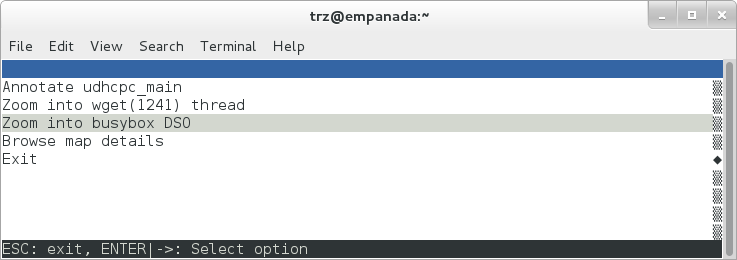
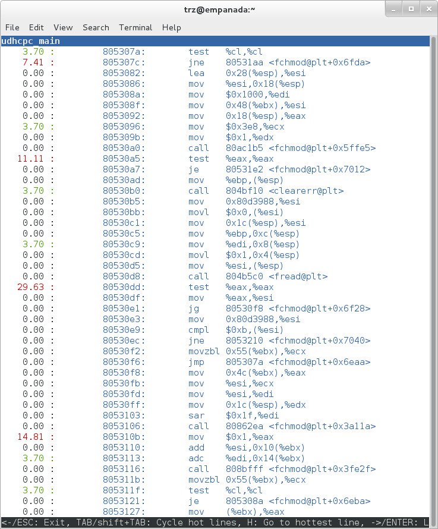

.. SPDX-License-Identifier: CC-BY-SA-2.0-UK
.. highlight:: shell

***************************************************************
Basic Usage (with examples) for each of the Yocto Tracing Tools
***************************************************************

|

This chapter presents basic usage examples for each of the tracing
tools.

perf
====

The perf tool is the profiling and tracing tool that comes bundled
with the Linux kernel.

Don't let the fact that it's part of the kernel fool you into thinking
that it's only for tracing and profiling the kernel --- you can indeed use
it to trace and profile just the kernel, but you can also use it to
profile specific applications separately (with or without kernel
context), and you can also use it to trace and profile the kernel and
all applications on the system simultaneously to gain a system-wide view
of what's going on.

In many ways, perf aims to be a superset of all the tracing and
profiling tools available in Linux today, including all the other tools
covered in this How-to. The past couple of years have seen perf subsume a
lot of the functionality of those other tools and, at the same time,
those other tools have removed large portions of their previous
functionality and replaced it with calls to the equivalent functionality
now implemented by the perf subsystem. Extrapolation suggests that at
some point those other tools will become completely redundant and
go away; until then, we'll cover those other tools in these pages and in
many cases show how the same things can be accomplished in perf and the
other tools when it seems useful to do so.

The coverage below details some of the most common ways you'll likely
want to apply the tool; full documentation can be found either within
the tool itself or in the manual pages at
`perf(1) <https://linux.die.net/man/1/perf>`__.

perf Setup
----------

For this section, we'll assume you've already performed the basic setup
outlined in the ":ref:`profile-manual/intro:General Setup`" section.

In particular, you'll get the most mileage out of perf if you profile an
image built with the following in your ``local.conf`` file::

   INHIBIT_PACKAGE_STRIP = "1"

perf runs on the target system for the most part. You can archive
profile data and copy it to the host for analysis, but for the rest of
this document we assume you're connected to the host through SSH and will be
running the perf commands on the target.

Basic perf Usage
----------------

The perf tool is pretty much self-documenting. To remind yourself of the
available commands, just type ``perf``, which will show you basic usage
along with the available perf subcommands::

   root@crownbay:~# perf

   usage: perf [--version] [--help] COMMAND [ARGS]

   The most commonly used perf commands are:
     annotate        Read perf.data (created by perf record) and display annotated code
     archive         Create archive with object files with build-ids found in perf.data file
     bench           General framework for benchmark suites
     buildid-cache   Manage build-id cache.
     buildid-list    List the buildids in a perf.data file
     diff            Read two perf.data files and display the differential profile
     evlist          List the event names in a perf.data file
     inject          Filter to augment the events stream with additional information
     kmem            Tool to trace/measure kernel memory(slab) properties
     kvm             Tool to trace/measure kvm guest os
     list            List all symbolic event types
     lock            Analyze lock events
     probe           Define new dynamic tracepoints
     record          Run a command and record its profile into perf.data
     report          Read perf.data (created by perf record) and display the profile
     sched           Tool to trace/measure scheduler properties (latencies)
     script          Read perf.data (created by perf record) and display trace output
     stat            Run a command and gather performance counter statistics
     test            Runs sanity tests.
     timechart       Tool to visualize total system behavior during a workload
     top             System profiling tool.

   See 'perf help COMMAND' for more information on a specific command.

Using perf to do Basic Profiling
~~~~~~~~~~~~~~~~~~~~~~~~~~~~~~~~

As a simple test case, we'll profile the ``wget`` of a fairly large file,
which is a minimally interesting case because it has both file and
network I/O aspects, and at least in the case of standard Yocto images,
it's implemented as part of BusyBox, so the methods we use to analyze it
can be used in a similar way to the whole host of supported BusyBox
applets in Yocto::

   root@crownbay:~# rm linux-2.6.19.2.tar.bz2; \
                    wget &YOCTO_DL_URL;/mirror/sources/linux-2.6.19.2.tar.bz2

The quickest and easiest way to get some basic overall data about what's
going on for a particular workload is to profile it using ``perf stat``.
This command basically profiles using a few default counters and displays
the summed counts at the end of the run::

   root@crownbay:~# perf stat wget &YOCTO_DL_URL;/mirror/sources/linux-2.6.19.2.tar.bz2
   Connecting to downloads.yoctoproject.org (140.211.169.59:80)
   linux-2.6.19.2.tar.b 100% |***************************************************| 41727k  0:00:00 ETA

   Performance counter stats for 'wget &YOCTO_DL_URL;/mirror/sources/linux-2.6.19.2.tar.bz2':

         4597.223902 task-clock                #    0.077 CPUs utilized
               23568 context-switches          #    0.005 M/sec
                  68 CPU-migrations            #    0.015 K/sec
                 241 page-faults               #    0.052 K/sec
          3045817293 cycles                    #    0.663 GHz
     <not supported> stalled-cycles-frontend
     <not supported> stalled-cycles-backend
           858909167 instructions              #    0.28  insns per cycle
           165441165 branches                  #   35.987 M/sec
            19550329 branch-misses             #   11.82% of all branches

        59.836627620 seconds time elapsed

Such a simple-minded test doesn't always yield much of interest, but sometimes
it does (see the :yocto_bugs:`Slow write speed on live images with denzil
</show_bug.cgi?id=3049>` bug report).

Also, note that ``perf stat`` isn't restricted to a fixed set of counters
--- basically any event listed in the output of ``perf list`` can be tallied
by ``perf stat``. For example, suppose we wanted to see a summary of all
the events related to kernel memory allocation/freeing along with cache
hits and misses::

   root@crownbay:~# perf stat -e kmem:* -e cache-references -e cache-misses wget &YOCTO_DL_URL;/mirror/sources/linux-2.6.19.2.tar.bz2
   Connecting to downloads.yoctoproject.org (140.211.169.59:80)
   linux-2.6.19.2.tar.b 100% |***************************************************| 41727k  0:00:00 ETA

   Performance counter stats for 'wget &YOCTO_DL_URL;/mirror/sources/linux-2.6.19.2.tar.bz2':

                5566 kmem:kmalloc
              125517 kmem:kmem_cache_alloc
                   0 kmem:kmalloc_node
                   0 kmem:kmem_cache_alloc_node
               34401 kmem:kfree
               69920 kmem:kmem_cache_free
                 133 kmem:mm_page_free
                  41 kmem:mm_page_free_batched
               11502 kmem:mm_page_alloc
               11375 kmem:mm_page_alloc_zone_locked
                   0 kmem:mm_page_pcpu_drain
                   0 kmem:mm_page_alloc_extfrag
            66848602 cache-references
             2917740 cache-misses              #    4.365 % of all cache refs

        44.831023415 seconds time elapsed

As you can see, ``perf stat`` gives us a nice easy
way to get a quick overview of what might be happening for a set of
events, but normally we'd need a little more detail in order to
understand what's going on in a way that we can act on in a useful way.

To dive down into a next level of detail, we can use ``perf record`` /
``perf report`` which will collect profiling data and present it to use using an
interactive text-based UI (or just as text if we specify ``--stdio`` to
``perf report``).

As our first attempt at profiling this workload, we'll just run ``perf
record``, handing it the workload we want to profile (everything after
``perf record`` and any perf options we hand it --- here none, will be
executed in a new shell). perf collects samples until the process exits
and records them in a file named ``perf.data`` in the current working
directory::

   root@crownbay:~# perf record wget &YOCTO_DL_URL;/mirror/sources/linux-2.6.19.2.tar.bz2

   Connecting to downloads.yoctoproject.org (140.211.169.59:80)
   linux-2.6.19.2.tar.b 100% |************************************************| 41727k  0:00:00 ETA
   [ perf record: Woken up 1 times to write data ]
   [ perf record: Captured and wrote 0.176 MB perf.data (~7700 samples) ]

To see the results in a
"text-based UI" (tui), just run ``perf report``, which will read the
perf.data file in the current working directory and display the results
in an interactive UI::

   root@crownbay:~# perf report

.. image:: figures/perf-wget-flat-stripped.png
   :align: center
   :width: 70%

The above screenshot displays a "flat" profile, one entry for each
"bucket" corresponding to the functions that were profiled during the
profiling run, ordered from the most popular to the least (perf has
options to sort in various orders and keys as well as display entries
only above a certain threshold and so on --- see the perf documentation
for details). Note that this includes both user space functions (entries
containing a ``[.]``) and kernel functions accounted to the process (entries
containing a ``[k]``). perf has command-line modifiers that can be used to
restrict the profiling to kernel or user space, among others.

Notice also that the above report shows an entry for ``busybox``, which is
the executable that implements ``wget`` in Yocto, but that instead of a
useful function name in that entry, it displays a not-so-friendly hex
value instead. The steps below will show how to fix that problem.

Before we do that, however, let's try running a different profile, one
which shows something a little more interesting. The only difference
between the new profile and the previous one is that we'll add the ``-g``
option, which will record not just the address of a sampled function,
but the entire call chain to the sampled function as well::

   root@crownbay:~# perf record -g wget &YOCTO_DL_URL;/mirror/sources/linux-2.6.19.2.tar.bz2
   Connecting to downloads.yoctoproject.org (140.211.169.59:80)
   linux-2.6.19.2.tar.b 100% |************************************************| 41727k  0:00:00 ETA
   [ perf record: Woken up 3 times to write data ]
   [ perf record: Captured and wrote 0.652 MB perf.data (~28476 samples) ]

   root@crownbay:~# perf report

.. image:: figures/perf-wget-g-copy-to-user-expanded-stripped.png
   :align: center
   :width: 70%

Using the call graph view, we can actually see not only which functions
took the most time, but we can also see a summary of how those functions
were called and learn something about how the program interacts with the
kernel in the process.

Notice that each entry in the above screenshot now contains a ``+`` on the
left side. This means that we can expand the entry and drill down
into the call chains that feed into that entry. Pressing ``Enter`` on any
one of them will expand the call chain (you can also press ``E`` to expand
them all at the same time or ``C`` to collapse them all).

In the screenshot above, we've toggled the ``__copy_to_user_ll()`` entry
and several subnodes all the way down. This lets us see which call chains
contributed to the profiled ``__copy_to_user_ll()`` function which
contributed 1.77% to the total profile.

As a bit of background explanation for these call chains, think about
what happens at a high level when you run ``wget`` to get a file out on the
network. Basically what happens is that the data comes into the kernel
via the network connection (socket) and is passed to the user space
program ``wget`` (which is actually a part of BusyBox, but that's not
important for now), which takes the buffers the kernel passes to it and
writes it to a disk file to save it.

The part of this process that we're looking at in the above call stacks
is the part where the kernel passes the data it has read from the socket
down to wget i.e. a ``copy-to-user``.

Notice also that here there's also a case where the hex value is
displayed in the call stack, here in the expanded ``sys_clock_gettime()``
function. Later we'll see it resolve to a user space function call in
BusyBox.

.. image:: figures/perf-wget-g-copy-from-user-expanded-stripped.png
   :align: center
   :width: 70%

The above screenshot shows the other half of the journey for the data ---
from the ``wget`` program's user space buffers to disk. To get the buffers to
disk, the wget program issues a ``write(2)``, which does a ``copy-from-user`` to
the kernel, which then takes care via some circuitous path (probably
also present somewhere in the profile data), to get it safely to disk.

Now that we've seen the basic layout of the profile data and the basics
of how to extract useful information out of it, let's get back to the
task at hand and see if we can get some basic idea about where the time
is spent in the program we're profiling, wget. Remember that wget is
actually implemented as an applet in BusyBox, so while the process name
is ``wget``, the executable we're actually interested in is ``busybox``.
Therefore, let's expand the first entry containing BusyBox:

.. image:: figures/perf-wget-busybox-expanded-stripped.png
   :align: center
   :width: 70%

Again, before we expanded we saw that the function was labeled with a
hex value instead of a symbol as with most of the kernel entries.
Expanding the BusyBox entry doesn't make it any better.

The problem is that perf can't find the symbol information for the
``busybox`` binary, which is actually stripped out by the Yocto build
system.

One way around that is to put the following in your ``local.conf`` file
when you build the image::

   INHIBIT_PACKAGE_STRIP = "1"

However, we already have an image with the binaries stripped, so
what can we do to get perf to resolve the symbols? Basically we need to
install the debugging information for the BusyBox package.

To generate the debug info for the packages in the image, we can add
``dbg-pkgs`` to :term:`EXTRA_IMAGE_FEATURES` in ``local.conf``. For example::

   EXTRA_IMAGE_FEATURES = "debug-tweaks tools-profile dbg-pkgs"

Additionally, in order to generate the type of debugging information that perf
understands, we also need to set :term:`PACKAGE_DEBUG_SPLIT_STYLE`
in the ``local.conf`` file::

   PACKAGE_DEBUG_SPLIT_STYLE = 'debug-file-directory'

Once we've done that, we can install the debugging information for BusyBox. The
debug packages once built can be found in ``build/tmp/deploy/rpm/*``
on the host system. Find the ``busybox-dbg-...rpm`` file and copy it
to the target. For example::

   [trz@empanada core2]$ scp /home/trz/yocto/crownbay-tracing-dbg/build/tmp/deploy/rpm/core2_32/busybox-dbg-1.20.2-r2.core2_32.rpm root@192.168.1.31:
   busybox-dbg-1.20.2-r2.core2_32.rpm                     100% 1826KB   1.8MB/s   00:01

Now install the debug RPM on the target::

   root@crownbay:~# rpm -i busybox-dbg-1.20.2-r2.core2_32.rpm

Now that the debugging information is installed, we see that the BusyBox entries now display
their functions symbolically:

.. image:: figures/perf-wget-busybox-debuginfo.png
   :align: center
   :width: 70%

If we expand one of the entries and press ``Enter`` on a leaf node, we're
presented with a menu of actions we can take to get more information
related to that entry:

One of these actions allows us to show a view that displays a
busybox-centric view of the profiled functions (in this case we've also
expanded all the nodes using the ``E`` key):

.. image:: figures/perf-wget-busybox-dso-zoom.png
   :align: center
   :width: 70%

Finally, we can see that now that the BusyBox debugging information is installed,
the previously unresolved symbol in the ``sys_clock_gettime()`` entry
mentioned previously is now resolved, and shows that the
``sys_clock_gettime`` system call that was the source of 6.75% of the
``copy-to-user`` overhead was initiated by the ``handle_input()`` BusyBox
function:

.. image:: figures/perf-wget-g-copy-to-user-expanded-debuginfo.png
   :align: center
   :width: 70%

At the lowest level of detail, we can dive down to the assembly level
and see which instructions caused the most overhead in a function.
Pressing ``Enter`` on the ``udhcpc_main`` function, we're again presented
with a menu:

.. image:: figures/perf-wget-busybox-annotate-menu.png
   :align: center
   :width: 70%

Selecting ``Annotate udhcpc_main``, we get a detailed listing of
percentages by instruction for the ``udhcpc_main`` function. From the
display, we can see that over 50% of the time spent in this function is
taken up by a couple tests and the move of a constant (1) to a register:

As a segue into tracing, let's try another profile using a different
counter, something other than the default ``cycles``.

The tracing and profiling infrastructure in Linux has become unified in
a way that allows us to use the same tool with a completely different
set of counters, not just the standard hardware counters that
traditional tools have had to restrict themselves to (the
traditional tools can now actually make use of the expanded possibilities now
available to them, and in some cases have, as mentioned previously).

We can get a list of the available events that can be used to profile a
workload via ``perf list``::

   root@crownbay:~# perf list

   List of pre-defined events (to be used in -e):
    cpu-cycles OR cycles                               [Hardware event]
    stalled-cycles-frontend OR idle-cycles-frontend    [Hardware event]
    stalled-cycles-backend OR idle-cycles-backend      [Hardware event]
    instructions                                       [Hardware event]
    cache-references                                   [Hardware event]
    cache-misses                                       [Hardware event]
    branch-instructions OR branches                    [Hardware event]
    branch-misses                                      [Hardware event]
    bus-cycles                                         [Hardware event]
    ref-cycles                                         [Hardware event]

    cpu-clock                                          [Software event]
    task-clock                                         [Software event]
    page-faults OR faults                              [Software event]
    minor-faults                                       [Software event]
    major-faults                                       [Software event]
    context-switches OR cs                             [Software event]
    cpu-migrations OR migrations                       [Software event]
    alignment-faults                                   [Software event]
    emulation-faults                                   [Software event]

    L1-dcache-loads                                    [Hardware cache event]
    L1-dcache-load-misses                              [Hardware cache event]
    L1-dcache-prefetch-misses                          [Hardware cache event]
    L1-icache-loads                                    [Hardware cache event]
    L1-icache-load-misses                              [Hardware cache event]
    .
    .
    .
    rNNN                                               [Raw hardware event descriptor]
    cpu/t1=v1[,t2=v2,t3 ...]/modifier                  [Raw hardware event descriptor]
     (see 'perf list --help' on how to encode it)

    mem:<addr>[:access]                                [Hardware breakpoint]

    sunrpc:rpc_call_status                             [Tracepoint event]
    sunrpc:rpc_bind_status                             [Tracepoint event]
    sunrpc:rpc_connect_status                          [Tracepoint event]
    sunrpc:rpc_task_begin                              [Tracepoint event]
    skb:kfree_skb                                      [Tracepoint event]
    skb:consume_skb                                    [Tracepoint event]
    skb:skb_copy_datagram_iovec                        [Tracepoint event]
    net:net_dev_xmit                                   [Tracepoint event]
    net:net_dev_queue                                  [Tracepoint event]
    net:netif_receive_skb                              [Tracepoint event]
    net:netif_rx                                       [Tracepoint event]
    napi:napi_poll                                     [Tracepoint event]
    sock:sock_rcvqueue_full                            [Tracepoint event]
    sock:sock_exceed_buf_limit                         [Tracepoint event]
    udp:udp_fail_queue_rcv_skb                         [Tracepoint event]
    hda:hda_send_cmd                                   [Tracepoint event]
    hda:hda_get_response                               [Tracepoint event]
    hda:hda_bus_reset                                  [Tracepoint event]
    scsi:scsi_dispatch_cmd_start                       [Tracepoint event]
    scsi:scsi_dispatch_cmd_error                       [Tracepoint event]
    scsi:scsi_eh_wakeup                                [Tracepoint event]
    drm:drm_vblank_event                               [Tracepoint event]
    drm:drm_vblank_event_queued                        [Tracepoint event]
    drm:drm_vblank_event_delivered                     [Tracepoint event]
    random:mix_pool_bytes                              [Tracepoint event]
    random:mix_pool_bytes_nolock                       [Tracepoint event]
    random:credit_entropy_bits                         [Tracepoint event]
    gpio:gpio_direction                                [Tracepoint event]
    gpio:gpio_value                                    [Tracepoint event]
    block:block_rq_abort                               [Tracepoint event]
    block:block_rq_requeue                             [Tracepoint event]
    block:block_rq_issue                               [Tracepoint event]
    block:block_bio_bounce                             [Tracepoint event]
    block:block_bio_complete                           [Tracepoint event]
    block:block_bio_backmerge                          [Tracepoint event]
    .
    .
    writeback:writeback_wake_thread                    [Tracepoint event]
    writeback:writeback_wake_forker_thread             [Tracepoint event]
    writeback:writeback_bdi_register                   [Tracepoint event]
    .
    .
    writeback:writeback_single_inode_requeue           [Tracepoint event]
    writeback:writeback_single_inode                   [Tracepoint event]
    kmem:kmalloc                                       [Tracepoint event]
    kmem:kmem_cache_alloc                              [Tracepoint event]
    kmem:mm_page_alloc                                 [Tracepoint event]
    kmem:mm_page_alloc_zone_locked                     [Tracepoint event]
    kmem:mm_page_pcpu_drain                            [Tracepoint event]
    kmem:mm_page_alloc_extfrag                         [Tracepoint event]
    vmscan:mm_vmscan_kswapd_sleep                      [Tracepoint event]
    vmscan:mm_vmscan_kswapd_wake                       [Tracepoint event]
    vmscan:mm_vmscan_wakeup_kswapd                     [Tracepoint event]
    vmscan:mm_vmscan_direct_reclaim_begin              [Tracepoint event]
    .
    .
    module:module_get                                  [Tracepoint event]
    module:module_put                                  [Tracepoint event]
    module:module_request                              [Tracepoint event]
    sched:sched_kthread_stop                           [Tracepoint event]
    sched:sched_wakeup                                 [Tracepoint event]
    sched:sched_wakeup_new                             [Tracepoint event]
    sched:sched_process_fork                           [Tracepoint event]
    sched:sched_process_exec                           [Tracepoint event]
    sched:sched_stat_runtime                           [Tracepoint event]
    rcu:rcu_utilization                                [Tracepoint event]
    workqueue:workqueue_queue_work                     [Tracepoint event]
    workqueue:workqueue_execute_end                    [Tracepoint event]
    signal:signal_generate                             [Tracepoint event]
    signal:signal_deliver                              [Tracepoint event]
    timer:timer_init                                   [Tracepoint event]
    timer:timer_start                                  [Tracepoint event]
    timer:hrtimer_cancel                               [Tracepoint event]
    timer:itimer_state                                 [Tracepoint event]
    timer:itimer_expire                                [Tracepoint event]
    irq:irq_handler_entry                              [Tracepoint event]
    irq:irq_handler_exit                               [Tracepoint event]
    irq:softirq_entry                                  [Tracepoint event]
    irq:softirq_exit                                   [Tracepoint event]
    irq:softirq_raise                                  [Tracepoint event]
    printk:console                                     [Tracepoint event]
    task:task_newtask                                  [Tracepoint event]
    task:task_rename                                   [Tracepoint event]
    syscalls:sys_enter_socketcall                      [Tracepoint event]
    syscalls:sys_exit_socketcall                       [Tracepoint event]
    .
    .
    .
    syscalls:sys_enter_unshare                         [Tracepoint event]
    syscalls:sys_exit_unshare                          [Tracepoint event]
    raw_syscalls:sys_enter                             [Tracepoint event]
    raw_syscalls:sys_exit                              [Tracepoint event]

.. admonition:: Tying it Together

   These are exactly the same set of events defined by the trace event
   subsystem and exposed by ftrace / trace-cmd / KernelShark as files in
   ``/sys/kernel/debug/tracing/events``, by SystemTap as
   kernel.trace("tracepoint_name") and (partially) accessed by LTTng.

Only a subset of these would be of interest to us when looking at this
workload, so let's choose the most likely subsystems (identified by the
string before the colon in the ``Tracepoint`` events) and do a ``perf stat``
run using only those subsystem wildcards::

   root@crownbay:~# perf stat -e skb:* -e net:* -e napi:* -e sched:* -e workqueue:* -e irq:* -e syscalls:* wget &YOCTO_DL_URL;/mirror/sources/linux-2.6.19.2.tar.bz2
   Performance counter stats for 'wget &YOCTO_DL_URL;/mirror/sources/linux-2.6.19.2.tar.bz2':

               23323 skb:kfree_skb
                   0 skb:consume_skb
               49897 skb:skb_copy_datagram_iovec
                6217 net:net_dev_xmit
                6217 net:net_dev_queue
                7962 net:netif_receive_skb
                   2 net:netif_rx
                8340 napi:napi_poll
                   0 sched:sched_kthread_stop
                   0 sched:sched_kthread_stop_ret
                3749 sched:sched_wakeup
                   0 sched:sched_wakeup_new
                   0 sched:sched_switch
                  29 sched:sched_migrate_task
                   0 sched:sched_process_free
                   1 sched:sched_process_exit
                   0 sched:sched_wait_task
                   0 sched:sched_process_wait
                   0 sched:sched_process_fork
                   1 sched:sched_process_exec
                   0 sched:sched_stat_wait
       2106519415641 sched:sched_stat_sleep
                   0 sched:sched_stat_iowait
           147453613 sched:sched_stat_blocked
         12903026955 sched:sched_stat_runtime
                   0 sched:sched_pi_setprio
                3574 workqueue:workqueue_queue_work
                3574 workqueue:workqueue_activate_work
                   0 workqueue:workqueue_execute_start
                   0 workqueue:workqueue_execute_end
               16631 irq:irq_handler_entry
               16631 irq:irq_handler_exit
               28521 irq:softirq_entry
               28521 irq:softirq_exit
               28728 irq:softirq_raise
                   1 syscalls:sys_enter_sendmmsg
                   1 syscalls:sys_exit_sendmmsg
                   0 syscalls:sys_enter_recvmmsg
                   0 syscalls:sys_exit_recvmmsg
                  14 syscalls:sys_enter_socketcall
                  14 syscalls:sys_exit_socketcall
                     .
                     .
                     .
               16965 syscalls:sys_enter_read
               16965 syscalls:sys_exit_read
               12854 syscalls:sys_enter_write
               12854 syscalls:sys_exit_write
                     .
                     .
                     .

        58.029710972 seconds time elapsed

Let's pick one of these tracepoints
and tell perf to do a profile using it as the sampling event::

   root@crownbay:~# perf record -g -e sched:sched_wakeup wget &YOCTO_DL_URL;/mirror/sources/linux-2.6.19.2.tar.bz2

.. image:: figures/sched-wakeup-profile.png
   :align: center
   :width: 70%

The screenshot above shows the results of running a profile using
sched:sched_switch tracepoint, which shows the relative costs of various
paths to ``sched_wakeup`` (note that ``sched_wakeup`` is the name of the
tracepoint --- it's actually defined just inside ``ttwu_do_wakeup()``, which
accounts for the function name actually displayed in the profile:

.. code-block:: c

     /*
      * Mark the task runnable and perform wakeup-preemption.
      */
     static void
     ttwu_do_wakeup(struct rq *rq, struct task_struct *p, int wake_flags)
     {
          trace_sched_wakeup(p, true);
          .
          .
          .
     }

A couple of the more interesting
call chains are expanded and displayed above, basically some network
receive paths that presumably end up waking up wget (BusyBox) when
network data is ready.

Note that because tracepoints are normally used for tracing, the default
sampling period for tracepoints is ``1`` i.e. for tracepoints perf will
sample on every event occurrence (this can be changed using the ``-c``
option). This is in contrast to hardware counters such as for example
the default ``cycles`` hardware counter used for normal profiling, where
sampling periods are much higher (in the thousands) because profiling
should have as low an overhead as possible and sampling on every cycle
would be prohibitively expensive.

Using perf to do Basic Tracing
~~~~~~~~~~~~~~~~~~~~~~~~~~~~~~

Profiling is a great tool for solving many problems or for getting a
high-level view of what's going on with a workload or across the system.
It is however by definition an approximation, as suggested by the most
prominent word associated with it, ``sampling``. On the one hand, it
allows a representative picture of what's going on in the system to be
cheaply taken, but alternatively, that cheapness limits its utility
when that data suggests a need to "dive down" more deeply to discover
what's really going on. In such cases, the only way to see what's really
going on is to be able to look at (or summarize more intelligently) the
individual steps that go into the higher-level behavior exposed by the
coarse-grained profiling data.

As a concrete example, we can trace all the events we think might be
applicable to our workload::

   root@crownbay:~# perf record -g -e skb:* -e net:* -e napi:* -e sched:sched_switch -e sched:sched_wakeup -e irq:*
    -e syscalls:sys_enter_read -e syscalls:sys_exit_read -e syscalls:sys_enter_write -e syscalls:sys_exit_write
    wget &YOCTO_DL_URL;/mirror/sources/linux-2.6.19.2.tar.bz2

We can look at the raw trace output using ``perf script`` with no
arguments::

   root@crownbay:~# perf script

         perf  1262 [000] 11624.857082: sys_exit_read: 0x0
         perf  1262 [000] 11624.857193: sched_wakeup: comm=migration/0 pid=6 prio=0 success=1 target_cpu=000
         wget  1262 [001] 11624.858021: softirq_raise: vec=1 [action=TIMER]
         wget  1262 [001] 11624.858074: softirq_entry: vec=1 [action=TIMER]
         wget  1262 [001] 11624.858081: softirq_exit: vec=1 [action=TIMER]
         wget  1262 [001] 11624.858166: sys_enter_read: fd: 0x0003, buf: 0xbf82c940, count: 0x0200
         wget  1262 [001] 11624.858177: sys_exit_read: 0x200
         wget  1262 [001] 11624.858878: kfree_skb: skbaddr=0xeb248d80 protocol=0 location=0xc15a5308
         wget  1262 [001] 11624.858945: kfree_skb: skbaddr=0xeb248000 protocol=0 location=0xc15a5308
         wget  1262 [001] 11624.859020: softirq_raise: vec=1 [action=TIMER]
         wget  1262 [001] 11624.859076: softirq_entry: vec=1 [action=TIMER]
         wget  1262 [001] 11624.859083: softirq_exit: vec=1 [action=TIMER]
         wget  1262 [001] 11624.859167: sys_enter_read: fd: 0x0003, buf: 0xb7720000, count: 0x0400
         wget  1262 [001] 11624.859192: sys_exit_read: 0x1d7
         wget  1262 [001] 11624.859228: sys_enter_read: fd: 0x0003, buf: 0xb7720000, count: 0x0400
         wget  1262 [001] 11624.859233: sys_exit_read: 0x0
         wget  1262 [001] 11624.859573: sys_enter_read: fd: 0x0003, buf: 0xbf82c580, count: 0x0200
         wget  1262 [001] 11624.859584: sys_exit_read: 0x200
         wget  1262 [001] 11624.859864: sys_enter_read: fd: 0x0003, buf: 0xb7720000, count: 0x0400
         wget  1262 [001] 11624.859888: sys_exit_read: 0x400
         wget  1262 [001] 11624.859935: sys_enter_read: fd: 0x0003, buf: 0xb7720000, count: 0x0400
         wget  1262 [001] 11624.859944: sys_exit_read: 0x400

This gives us a detailed timestamped sequence of events that occurred within the
workload with respect to those events.

In many ways, profiling can be viewed as a subset of tracing ---
theoretically, if you have a set of trace events that's sufficient to
capture all the important aspects of a workload, you can derive any of
the results or views that a profiling run can.

Another aspect of traditional profiling is that while powerful in many
ways, it's limited by the granularity of the underlying data. Profiling
tools offer various ways of sorting and presenting the sample data,
which make it much more useful and amenable to user experimentation, but
in the end it can't be used in an open-ended way to extract data that
just isn't present as a consequence of the fact that conceptually, most
of it has been thrown away.

Full-blown detailed tracing data does however offer the opportunity to
manipulate and present the information collected during a tracing run in
an infinite variety of ways.

Another way to look at it is that there are only so many ways that the
'primitive' counters can be used on their own to generate interesting
output; to get anything more complicated than simple counts requires
some amount of additional logic, which is typically specific to the
problem at hand. For example, if we wanted to make use of a 'counter'
that maps to the value of the time difference between when a process was
scheduled to run on a processor and the time it actually ran, we
wouldn't expect such a counter to exist on its own, but we could derive
one called say ``wakeup_latency`` and use it to extract a useful view of
that metric from trace data. Likewise, we really can't figure out from
standard profiling tools how much data every process on the system reads
and writes, along with how many of those reads and writes fail
completely. If we have sufficient trace data, however, we could with the
right tools easily extract and present that information, but we'd need
something other than ready-made profiling tools to do that.

Luckily, there is a general-purpose way to handle such needs, called
"programming languages". Making programming languages easily available
to apply to such problems given the specific format of data is called a
'programming language binding' for that data and language. perf supports
two programming language bindings, one for Python and one for Perl.

.. admonition:: Tying it Together

   Language bindings for manipulating and aggregating trace data are of
   course not a new idea. One of the first projects to do this was IBM's
   DProbes dpcc compiler, an ANSI C compiler which targeted a low-level
   assembly language running on an in-kernel interpreter on the target
   system. This is exactly analogous to what Sun's DTrace did, except
   that DTrace invented its own language for the purpose. SystemTap,
   heavily inspired by DTrace, also created its own one-off language,
   but rather than running the product on an in-kernel interpreter,
   created an elaborate compiler-based machinery to translate its
   language into kernel modules written in C.

Now that we have the trace data in ``perf.data``, we can use ``perf script
-g`` to generate a skeleton script with handlers for the read / write
entry / exit events we recorded::

   root@crownbay:~# perf script -g python
   generated Python script: perf-script.py

The skeleton script just creates a Python function for each event type in the
``perf.data`` file. The body of each function just prints the event name along
with its parameters. For example:

.. code-block:: python

   def net__netif_rx(event_name, context, common_cpu,
          common_secs, common_nsecs, common_pid, common_comm,
          skbaddr, len, name):
                  print_header(event_name, common_cpu, common_secs, common_nsecs,
                          common_pid, common_comm)

                  print "skbaddr=%u, len=%u, name=%s\n" % (skbaddr, len, name),

We can run that script directly to print all of the events contained in the
``perf.data`` file::

   root@crownbay:~# perf script -s perf-script.py

   in trace_begin
   syscalls__sys_exit_read     0 11624.857082795     1262 perf                  nr=3, ret=0
   sched__sched_wakeup      0 11624.857193498     1262 perf                  comm=migration/0, pid=6, prio=0,      success=1, target_cpu=0
   irq__softirq_raise       1 11624.858021635     1262 wget                  vec=TIMER
   irq__softirq_entry       1 11624.858074075     1262 wget                  vec=TIMER
   irq__softirq_exit        1 11624.858081389     1262 wget                  vec=TIMER
   syscalls__sys_enter_read     1 11624.858166434     1262 wget                  nr=3, fd=3, buf=3213019456,      count=512
   syscalls__sys_exit_read     1 11624.858177924     1262 wget                  nr=3, ret=512
   skb__kfree_skb           1 11624.858878188     1262 wget                  skbaddr=3945041280,           location=3243922184, protocol=0
   skb__kfree_skb           1 11624.858945608     1262 wget                  skbaddr=3945037824,      location=3243922184, protocol=0
   irq__softirq_raise       1 11624.859020942     1262 wget                  vec=TIMER
   irq__softirq_entry       1 11624.859076935     1262 wget                  vec=TIMER
   irq__softirq_exit        1 11624.859083469     1262 wget                  vec=TIMER
   syscalls__sys_enter_read     1 11624.859167565     1262 wget                  nr=3, fd=3, buf=3077701632,      count=1024
   syscalls__sys_exit_read     1 11624.859192533     1262 wget                  nr=3, ret=471
   syscalls__sys_enter_read     1 11624.859228072     1262 wget                  nr=3, fd=3, buf=3077701632,      count=1024
   syscalls__sys_exit_read     1 11624.859233707     1262 wget                  nr=3, ret=0
   syscalls__sys_enter_read     1 11624.859573008     1262 wget                  nr=3, fd=3, buf=3213018496,      count=512
   syscalls__sys_exit_read     1 11624.859584818     1262 wget                  nr=3, ret=512
   syscalls__sys_enter_read     1 11624.859864562     1262 wget                  nr=3, fd=3, buf=3077701632,      count=1024
   syscalls__sys_exit_read     1 11624.859888770     1262 wget                  nr=3, ret=1024
   syscalls__sys_enter_read     1 11624.859935140     1262 wget                  nr=3, fd=3, buf=3077701632,      count=1024
   syscalls__sys_exit_read     1 11624.859944032     1262 wget                  nr=3, ret=1024

That in itself isn't very useful; after all, we can accomplish pretty much the
same thing by just running ``perf script`` without arguments in the same
directory as the ``perf.data`` file.

We can however replace the print statements in the generated function
bodies with whatever we want, and thereby make it infinitely more
useful.

As a simple example, let's just replace the print statements in the
function bodies with a simple function that does nothing but increment a
per-event count. When the program is run against a perf.data file, each
time a particular event is encountered, a tally is incremented for that
event. For example:

.. code-block:: python

   def net__netif_rx(event_name, context, common_cpu,
          common_secs, common_nsecs, common_pid, common_comm,
          skbaddr, len, name):
              inc_counts(event_name)

Each event handler function in the generated code
is modified to do this. For convenience, we define a common function
called ``inc_counts()`` that each handler calls; ``inc_counts()`` just tallies
a count for each event using the ``counts`` hash, which is a specialized
hash function that does Perl-like autovivification, a capability that's
extremely useful for kinds of multi-level aggregation commonly used in
processing traces (see perf's documentation on the Python language
binding for details):

.. code-block:: python

     counts = autodict()

     def inc_counts(event_name):
            try:
                    counts[event_name] += 1
            except TypeError:
                    counts[event_name] = 1

Finally, at the end of the trace processing run, we want to print the
result of all the per-event tallies. For that, we use the special
``trace_end()`` function:

.. code-block:: python

     def trace_end():
            for event_name, count in counts.iteritems():
                    print "%-40s %10s\n" % (event_name, count)

The end result is a summary of all the events recorded in the trace::

   skb__skb_copy_datagram_iovec                  13148
   irq__softirq_entry                             4796
   irq__irq_handler_exit                          3805
   irq__softirq_exit                              4795
   syscalls__sys_enter_write                      8990
   net__net_dev_xmit                               652
   skb__kfree_skb                                 4047
   sched__sched_wakeup                            1155
   irq__irq_handler_entry                         3804
   irq__softirq_raise                             4799
   net__net_dev_queue                              652
   syscalls__sys_enter_read                      17599
   net__netif_receive_skb                         1743
   syscalls__sys_exit_read                       17598
   net__netif_rx                                     2
   napi__napi_poll                                1877
   syscalls__sys_exit_write                       8990

Note that this is
pretty much exactly the same information we get from ``perf stat``, which
goes a little way to support the idea mentioned previously that given
the right kind of trace data, higher-level profiling-type summaries can
be derived from it.

Documentation on using the `'perf script' Python
binding <https://linux.die.net/man/1/perf-script-python>`__.

System-Wide Tracing and Profiling
~~~~~~~~~~~~~~~~~~~~~~~~~~~~~~~~~

The examples so far have focused on tracing a particular program or
workload --- that is, every profiling run has specified the program
to profile in the command-line e.g. ``perf record wget ...``.

It's also possible, and more interesting in many cases, to run a
system-wide profile or trace while running the workload in a separate
shell.

To do system-wide profiling or tracing, you typically use the ``-a`` flag to
``perf record``.

To demonstrate this, open up one window and start the profile using the
``-a`` flag (press ``Ctrl-C`` to stop tracing)::

   root@crownbay:~# perf record -g -a
   ^C[ perf record: Woken up 6 times to write data ]
   [ perf record: Captured and wrote 1.400 MB perf.data (~61172 samples) ]

In another window, run the ``wget`` test::

   root@crownbay:~# wget &YOCTO_DL_URL;/mirror/sources/linux-2.6.19.2.tar.bz2
   Connecting to downloads.yoctoproject.org (140.211.169.59:80)
   linux-2.6.19.2.tar.b 100% \|*******************************\| 41727k 0:00:00 ETA

Here we see entries not only for our ``wget`` load, but for
other processes running on the system as well:

.. image:: figures/perf-systemwide.png
   :align: center
   :width: 70%

In the snapshot above, we can see call chains that originate in ``libc``, and
a call chain from ``Xorg`` that demonstrates that we're using a proprietary X
driver in user space (notice the presence of ``PVR`` and some other
unresolvable symbols in the expanded ``Xorg`` call chain).

Note also that we have both kernel and user space entries in the above
snapshot. We can also tell perf to focus on user space but providing a
modifier, in this case ``u``, to the ``cycles`` hardware counter when we
record a profile::

   root@crownbay:~# perf record -g -a -e cycles:u
   ^C[ perf record: Woken up 2 times to write data ]
   [ perf record: Captured and wrote 0.376 MB perf.data (~16443 samples) ]

.. image:: figures/perf-report-cycles-u.png
   :align: center
   :width: 70%

Notice in the screenshot above, we see only user space entries (``[.]``)

Finally, we can press ``Enter`` on a leaf node and select the ``Zoom into
DSO`` menu item to show only entries associated with a specific DSO. In
the screenshot below, we've zoomed into the ``libc`` DSO which shows all
the entries associated with the ``libc-xxx.so`` DSO.

.. image:: figures/perf-systemwide-libc.png
   :align: center
   :width: 70%

We can also use the system-wide ``-a`` switch to do system-wide tracing.
Here we'll trace a couple of scheduler events::

   root@crownbay:~# perf record -a -e sched:sched_switch -e sched:sched_wakeup
   ^C[ perf record: Woken up 38 times to write data ]
   [ perf record: Captured and wrote 9.780 MB perf.data (~427299 samples) ]

We can look at the raw output using ``perf script`` with no arguments::

   root@crownbay:~# perf script

              perf  1383 [001]  6171.460045: sched_wakeup: comm=kworker/1:1 pid=21 prio=120 success=1 target_cpu=001
              perf  1383 [001]  6171.460066: sched_switch: prev_comm=perf prev_pid=1383 prev_prio=120 prev_state=R+ ==> next_comm=kworker/1:1 next_pid=21 next_prio=120
       kworker/1:1    21 [001]  6171.460093: sched_switch: prev_comm=kworker/1:1 prev_pid=21 prev_prio=120 prev_state=S ==> next_comm=perf next_pid=1383 next_prio=120
           swapper     0 [000]  6171.468063: sched_wakeup: comm=kworker/0:3 pid=1209 prio=120 success=1 target_cpu=000
           swapper     0 [000]  6171.468107: sched_switch: prev_comm=swapper/0 prev_pid=0 prev_prio=120 prev_state=R ==> next_comm=kworker/0:3 next_pid=1209 next_prio=120
       kworker/0:3  1209 [000]  6171.468143: sched_switch: prev_comm=kworker/0:3 prev_pid=1209 prev_prio=120 prev_state=S ==> next_comm=swapper/0 next_pid=0 next_prio=120
              perf  1383 [001]  6171.470039: sched_wakeup: comm=kworker/1:1 pid=21 prio=120 success=1 target_cpu=001
              perf  1383 [001]  6171.470058: sched_switch: prev_comm=perf prev_pid=1383 prev_prio=120 prev_state=R+ ==> next_comm=kworker/1:1 next_pid=21 next_prio=120
       kworker/1:1    21 [001]  6171.470082: sched_switch: prev_comm=kworker/1:1 prev_pid=21 prev_prio=120 prev_state=S ==> next_comm=perf next_pid=1383 next_prio=120
              perf  1383 [001]  6171.480035: sched_wakeup: comm=kworker/1:1 pid=21 prio=120 success=1 target_cpu=001

Filtering
^^^^^^^^^

Notice that there are many events that don't really have anything to
do with what we're interested in, namely events that schedule ``perf``
itself in and out or that wake perf up. We can get rid of those by using
the ``--filter`` option --- for each event we specify using ``-e``, we can add a
``--filter`` after that to filter out trace events that contain fields with
specific values::

   root@crownbay:~# perf record -a -e sched:sched_switch --filter 'next_comm != perf && prev_comm != perf' -e sched:sched_wakeup --filter 'comm != perf'
   ^C[ perf record: Woken up 38 times to write data ]
   [ perf record: Captured and wrote 9.688 MB perf.data (~423279 samples) ]

   root@crownbay:~# perf script

           swapper     0 [000]  7932.162180: sched_switch: prev_comm=swapper/0 prev_pid=0 prev_prio=120 prev_state=R ==> next_comm=kworker/0:3 next_pid=1209 next_prio=120
       kworker/0:3  1209 [000]  7932.162236: sched_switch: prev_comm=kworker/0:3 prev_pid=1209 prev_prio=120 prev_state=S ==> next_comm=swapper/0 next_pid=0 next_prio=120
              perf  1407 [001]  7932.170048: sched_wakeup: comm=kworker/1:1 pid=21 prio=120 success=1 target_cpu=001
              perf  1407 [001]  7932.180044: sched_wakeup: comm=kworker/1:1 pid=21 prio=120 success=1 target_cpu=001
              perf  1407 [001]  7932.190038: sched_wakeup: comm=kworker/1:1 pid=21 prio=120 success=1 target_cpu=001
              perf  1407 [001]  7932.200044: sched_wakeup: comm=kworker/1:1 pid=21 prio=120 success=1 target_cpu=001
              perf  1407 [001]  7932.210044: sched_wakeup: comm=kworker/1:1 pid=21 prio=120 success=1 target_cpu=001
              perf  1407 [001]  7932.220044: sched_wakeup: comm=kworker/1:1 pid=21 prio=120 success=1 target_cpu=001
           swapper     0 [001]  7932.230111: sched_wakeup: comm=kworker/1:1 pid=21 prio=120 success=1 target_cpu=001
           swapper     0 [001]  7932.230146: sched_switch: prev_comm=swapper/1 prev_pid=0 prev_prio=120 prev_state=R ==> next_comm=kworker/1:1 next_pid=21 next_prio=120
       kworker/1:1    21 [001]  7932.230205: sched_switch: prev_comm=kworker/1:1 prev_pid=21 prev_prio=120 prev_state=S ==> next_comm=swapper/1 next_pid=0 next_prio=120
           swapper     0 [000]  7932.326109: sched_wakeup: comm=kworker/0:3 pid=1209 prio=120 success=1 target_cpu=000
           swapper     0 [000]  7932.326171: sched_switch: prev_comm=swapper/0 prev_pid=0 prev_prio=120 prev_state=R ==> next_comm=kworker/0:3 next_pid=1209 next_prio=120
       kworker/0:3  1209 [000]  7932.326214: sched_switch: prev_comm=kworker/0:3 prev_pid=1209 prev_prio=120 prev_state=S ==> next_comm=swapper/0 next_pid=0 next_prio=120

In this case, we've filtered out all events that have
``perf`` in their ``comm``, ``comm_prev`` or ``comm_next`` fields. Notice that
there are still events recorded for perf, but notice that those events
don't have values of ``perf`` for the filtered fields. To completely
filter out anything from perf will require a bit more work, but for the
purpose of demonstrating how to use filters, it's close enough.

.. admonition:: Tying it Together

   These are exactly the same set of event filters defined by the trace
   event subsystem. See the ftrace / trace-cmd / KernelShark section for more
   discussion about these event filters.

.. admonition:: Tying it Together

   These event filters are implemented by a special-purpose
   pseudo-interpreter in the kernel and are an integral and
   indispensable part of the perf design as it relates to tracing.
   kernel-based event filters provide a mechanism to precisely throttle
   the event stream that appears in user space, where it makes sense to
   provide bindings to real programming languages for post-processing the
   event stream. This architecture allows for the intelligent and
   flexible partitioning of processing between the kernel and user
   space. Contrast this with other tools such as SystemTap, which does
   all of its processing in the kernel and as such requires a special
   project-defined language in order to accommodate that design, or
   LTTng, where everything is sent to user space and as such requires a
   super-efficient kernel-to-user space transport mechanism in order to
   function properly. While perf certainly can benefit from for instance
   advances in the design of the transport, it doesn't fundamentally
   depend on them. Basically, if you find that your perf tracing
   application is causing buffer I/O overruns, it probably means that
   you aren't taking enough advantage of the kernel filtering engine.

Using Dynamic Tracepoints
~~~~~~~~~~~~~~~~~~~~~~~~~

perf isn't restricted to the fixed set of static tracepoints listed by
``perf list``. Users can also add their own "dynamic" tracepoints anywhere
in the kernel. For example, suppose we want to define our own
tracepoint on ``do_fork()``. We can do that using the ``perf probe`` perf
subcommand::

   root@crownbay:~# perf probe do_fork
   Added new event:
     probe:do_fork        (on do_fork)

   You can now use it in all perf tools, such as:

     perf record -e probe:do_fork -aR sleep 1

Adding a new tracepoint via
``perf probe`` results in an event with all the expected files and format
in ``/sys/kernel/debug/tracing/events``, just the same as for static
tracepoints (as discussed in more detail in the trace events subsystem
section::

   root@crownbay:/sys/kernel/debug/tracing/events/probe/do_fork# ls -al
   drwxr-xr-x    2 root     root             0 Oct 28 11:42 .
   drwxr-xr-x    3 root     root             0 Oct 28 11:42 ..
   -rw-r--r--    1 root     root             0 Oct 28 11:42 enable
   -rw-r--r--    1 root     root             0 Oct 28 11:42 filter
   -r--r--r--    1 root     root             0 Oct 28 11:42 format
   -r--r--r--    1 root     root             0 Oct 28 11:42 id

   root@crownbay:/sys/kernel/debug/tracing/events/probe/do_fork# cat format
   name: do_fork
   ID: 944
   format:
           field:unsigned short common_type;    offset:0;       size:2; signed:0;
           field:unsigned char common_flags;    offset:2;       size:1; signed:0;
           field:unsigned char common_preempt_count;    offset:3;       size:1; signed:0;
           field:int common_pid;        offset:4;       size:4; signed:1;
           field:int common_padding;    offset:8;       size:4; signed:1;

           field:unsigned long __probe_ip;      offset:12;      size:4; signed:0;

   print fmt: "(%lx)", REC->__probe_ip

We can list all dynamic tracepoints currently in
existence::

   root@crownbay:~# perf probe -l
    probe:do_fork (on do_fork)
    probe:schedule (on schedule)

Let's record system-wide (``sleep 30`` is a
trick for recording system-wide but basically do nothing and then wake
up after 30 seconds)::

   root@crownbay:~# perf record -g -a -e probe:do_fork sleep 30
   [ perf record: Woken up 1 times to write data ]
   [ perf record: Captured and wrote 0.087 MB perf.data (~3812 samples) ]

Using ``perf script`` we can see each ``do_fork`` event that fired::

   root@crownbay:~# perf script

   # ========
   # captured on: Sun Oct 28 11:55:18 2012
   # hostname : crownbay
   # os release : 3.4.11-yocto-standard
   # perf version : 3.4.11
   # arch : i686
   # nrcpus online : 2
   # nrcpus avail : 2
   # cpudesc : Intel(R) Atom(TM) CPU E660 @ 1.30GHz
   # cpuid : GenuineIntel,6,38,1
   # total memory : 1017184 kB
   # cmdline : /usr/bin/perf record -g -a -e probe:do_fork sleep 30
   # event : name = probe:do_fork, type = 2, config = 0x3b0, config1 = 0x0, config2 = 0x0, excl_usr = 0, excl_kern
    = 0, id = { 5, 6 }
   # HEADER_CPU_TOPOLOGY info available, use -I to display
   # ========
   #
    matchbox-deskto  1197 [001] 34211.378318: do_fork: (c1028460)
    matchbox-deskto  1295 [001] 34211.380388: do_fork: (c1028460)
            pcmanfm  1296 [000] 34211.632350: do_fork: (c1028460)
            pcmanfm  1296 [000] 34211.639917: do_fork: (c1028460)
    matchbox-deskto  1197 [001] 34217.541603: do_fork: (c1028460)
    matchbox-deskto  1299 [001] 34217.543584: do_fork: (c1028460)
             gthumb  1300 [001] 34217.697451: do_fork: (c1028460)
             gthumb  1300 [001] 34219.085734: do_fork: (c1028460)
             gthumb  1300 [000] 34219.121351: do_fork: (c1028460)
             gthumb  1300 [001] 34219.264551: do_fork: (c1028460)
            pcmanfm  1296 [000] 34219.590380: do_fork: (c1028460)
    matchbox-deskto  1197 [001] 34224.955965: do_fork: (c1028460)
    matchbox-deskto  1306 [001] 34224.957972: do_fork: (c1028460)
    matchbox-termin  1307 [000] 34225.038214: do_fork: (c1028460)
    matchbox-termin  1307 [001] 34225.044218: do_fork: (c1028460)
    matchbox-termin  1307 [000] 34225.046442: do_fork: (c1028460)
    matchbox-deskto  1197 [001] 34237.112138: do_fork: (c1028460)
    matchbox-deskto  1311 [001] 34237.114106: do_fork: (c1028460)
               gaku  1312 [000] 34237.202388: do_fork: (c1028460)

And using ``perf report`` on the same file, we can see the
call graphs from starting a few programs during those 30 seconds:

.. image:: figures/perf-probe-do_fork-profile.png
   :align: center
   :width: 70%

.. admonition:: Tying it Together

   The trace events subsystem accommodate static and dynamic tracepoints
   in exactly the same way --- there's no difference as far as the
   infrastructure is concerned. See the ftrace section for more details
   on the trace event subsystem.

.. admonition:: Tying it Together

   Dynamic tracepoints are implemented under the covers by Kprobes and
   Uprobes. Kprobes and Uprobes are also used by and in fact are the
   main focus of SystemTap.

perf Documentation
------------------

Online versions of the manual pages for the commands discussed in this
section can be found here:

-  The `'perf stat' manual page <https://linux.die.net/man/1/perf-stat>`__.

-  The `'perf record'
   manual page <https://linux.die.net/man/1/perf-record>`__.

-  The `'perf report'
   manual page <https://linux.die.net/man/1/perf-report>`__.

-  The `'perf probe' manual page <https://linux.die.net/man/1/perf-probe>`__.

-  The `'perf script'
   manual page <https://linux.die.net/man/1/perf-script>`__.

-  Documentation on using the `'perf script' Python
   binding <https://linux.die.net/man/1/perf-script-python>`__.

-  The top-level `perf(1) manual page <https://linux.die.net/man/1/perf>`__.

Normally, you should be able to open the manual pages via perf itself
e.g. ``perf help`` or ``perf help record``.

To have the perf manual pages installed on your target, modify your
configuration as follows::

   IMAGE_INSTALL:append = " perf perf-doc"
   DISTRO_FEATURES:append = " api-documentation"

The manual pages in text form, along with some other files, such as a set
of examples, can also be found in the ``perf`` directory of the kernel tree::

   tools/perf/Documentation

There's also a nice perf tutorial on the perf
wiki that goes into more detail than we do here in certain areas: `perf
Tutorial <https://perf.wiki.kernel.org/index.php/Tutorial>`__

ftrace
======

"ftrace" literally refers to the "ftrace function tracer" but in reality
this encompasses several related tracers along with the
infrastructure that they all make use of.

ftrace Setup
------------

For this section, we'll assume you've already performed the basic setup
outlined in the ":ref:`profile-manual/intro:General Setup`" section.

ftrace, trace-cmd, and KernelShark run on the target system, and are
ready to go out-of-the-box --- no additional setup is necessary. For the
rest of this section we assume you're connected to the host through SSH and
will be running ftrace on the target. KernelShark is a GUI application and if
you use the ``-X`` option to ``ssh`` you can have the KernelShark GUI run on
the target but display remotely on the host if you want.

Basic ftrace usage
------------------

"ftrace" essentially refers to everything included in the ``/tracing``
directory of the mounted debugfs filesystem (Yocto follows the standard
convention and mounts it at ``/sys/kernel/debug``). All the files found in
``/sys/kernel/debug/tracing`` on a Yocto system are::

   root@sugarbay:/sys/kernel/debug/tracing# ls
   README                      kprobe_events               trace
   available_events            kprobe_profile              trace_clock
   available_filter_functions  options                     trace_marker
   available_tracers           per_cpu                     trace_options
   buffer_size_kb              printk_formats              trace_pipe
   buffer_total_size_kb        saved_cmdlines              tracing_cpumask
   current_tracer              set_event                   tracing_enabled
   dyn_ftrace_total_info       set_ftrace_filter           tracing_on
   enabled_functions           set_ftrace_notrace          tracing_thresh
   events                      set_ftrace_pid
   free_buffer                 set_graph_function

The files listed above are used for various purposes
--- some relate directly to the tracers themselves, others are used to set
tracing options, and yet others actually contain the tracing output when
a tracer is in effect. Some of the functions can be guessed from their
names, others need explanation; in any case, we'll cover some of the
files we see here below but for an explanation of the others, please see
the ftrace documentation.

We'll start by looking at some of the available built-in tracers.

The ``available_tracers`` file lists the set of available tracers::

   root@sugarbay:/sys/kernel/debug/tracing# cat available_tracers
   blk function_graph function nop

The ``current_tracer`` file contains the tracer currently in effect::

   root@sugarbay:/sys/kernel/debug/tracing# cat current_tracer
   nop

The above listing of ``current_tracer`` shows that the
``nop`` tracer is in effect, which is just another way of saying that
there's actually no tracer currently in effect.

Writing one of the available tracers into ``current_tracer`` makes the
specified tracer the current tracer::

   root@sugarbay:/sys/kernel/debug/tracing# echo function > current_tracer
   root@sugarbay:/sys/kernel/debug/tracing# cat current_tracer
   function

The above sets the current tracer to be the ``function`` tracer. This tracer
traces every function call in the kernel and makes it available as the
contents of the ``trace`` file. Reading the ``trace`` file lists the
currently buffered function calls that have been traced by the function
tracer::

   root@sugarbay:/sys/kernel/debug/tracing# cat trace | less

   # tracer: function
   #
   # entries-in-buffer/entries-written: 310629/766471   #P:8
   #
   #                              _-----=> irqs-off
   #                             / _----=> need-resched
   #                            | / _---=> hardirq/softirq
   #                            || / _--=> preempt-depth
   #                            ||| /     delay
   #           TASK-PID   CPU#  ||||    TIMESTAMP  FUNCTION
   #              | |       |   ||||       |         |
            <idle>-0     [004] d..1   470.867169: ktime_get_real <-intel_idle
            <idle>-0     [004] d..1   470.867170: getnstimeofday <-ktime_get_real
            <idle>-0     [004] d..1   470.867171: ns_to_timeval <-intel_idle
            <idle>-0     [004] d..1   470.867171: ns_to_timespec <-ns_to_timeval
            <idle>-0     [004] d..1   470.867172: smp_apic_timer_interrupt <-apic_timer_interrupt
            <idle>-0     [004] d..1   470.867172: native_apic_mem_write <-smp_apic_timer_interrupt
            <idle>-0     [004] d..1   470.867172: irq_enter <-smp_apic_timer_interrupt
            <idle>-0     [004] d..1   470.867172: rcu_irq_enter <-irq_enter
            <idle>-0     [004] d..1   470.867173: rcu_idle_exit_common.isra.33 <-rcu_irq_enter
            <idle>-0     [004] d..1   470.867173: local_bh_disable <-irq_enter
            <idle>-0     [004] d..1   470.867173: add_preempt_count <-local_bh_disable
            <idle>-0     [004] d.s1   470.867174: tick_check_idle <-irq_enter
            <idle>-0     [004] d.s1   470.867174: tick_check_oneshot_broadcast <-tick_check_idle
            <idle>-0     [004] d.s1   470.867174: ktime_get <-tick_check_idle
            <idle>-0     [004] d.s1   470.867174: tick_nohz_stop_idle <-tick_check_idle
            <idle>-0     [004] d.s1   470.867175: update_ts_time_stats <-tick_nohz_stop_idle
            <idle>-0     [004] d.s1   470.867175: nr_iowait_cpu <-update_ts_time_stats
            <idle>-0     [004] d.s1   470.867175: tick_do_update_jiffies64 <-tick_check_idle
            <idle>-0     [004] d.s1   470.867175: _raw_spin_lock <-tick_do_update_jiffies64
            <idle>-0     [004] d.s1   470.867176: add_preempt_count <-_raw_spin_lock
            <idle>-0     [004] d.s2   470.867176: do_timer <-tick_do_update_jiffies64
            <idle>-0     [004] d.s2   470.867176: _raw_spin_lock <-do_timer
            <idle>-0     [004] d.s2   470.867176: add_preempt_count <-_raw_spin_lock
            <idle>-0     [004] d.s3   470.867177: ntp_tick_length <-do_timer
            <idle>-0     [004] d.s3   470.867177: _raw_spin_lock_irqsave <-ntp_tick_length
            .
            .
            .

Each line in the trace above shows what was happening in the kernel on a given
CPU, to the level of detail of function calls. Each entry shows the function
called, followed by its caller (after the arrow).

The function tracer gives you an extremely detailed idea of what the
kernel was doing at the point in time the trace was taken, and is a
great way to learn about how the kernel code works in a dynamic sense.

.. admonition:: Tying it Together

   The ftrace function tracer is also available from within perf, as the
   ``ftrace:function`` tracepoint.

It is a little more difficult to follow the call chains than it needs to
be --- luckily there's a variant of the function tracer that displays the
call chains explicitly, called the ``function_graph`` tracer::

   root@sugarbay:/sys/kernel/debug/tracing# echo function_graph > current_tracer
   root@sugarbay:/sys/kernel/debug/tracing# cat trace | less

    tracer: function_graph

    CPU  DURATION                  FUNCTION CALLS
    |     |   |                     |   |   |   |
   7)   0.046 us    |      pick_next_task_fair();
   7)   0.043 us    |      pick_next_task_stop();
   7)   0.042 us    |      pick_next_task_rt();
   7)   0.032 us    |      pick_next_task_fair();
   7)   0.030 us    |      pick_next_task_idle();
   7)               |      _raw_spin_unlock_irq() {
   7)   0.033 us    |        sub_preempt_count();
   7)   0.258 us    |      }
   7)   0.032 us    |      sub_preempt_count();
   7) + 13.341 us   |    } /* __schedule */
   7)   0.095 us    |  } /* sub_preempt_count */
   7)               |  schedule() {
   7)               |    __schedule() {
   7)   0.060 us    |      add_preempt_count();
   7)   0.044 us    |      rcu_note_context_switch();
   7)               |      _raw_spin_lock_irq() {
   7)   0.033 us    |        add_preempt_count();
   7)   0.247 us    |      }
   7)               |      idle_balance() {
   7)               |        _raw_spin_unlock() {
   7)   0.031 us    |          sub_preempt_count();
   7)   0.246 us    |        }
   7)               |        update_shares() {
   7)   0.030 us    |          __rcu_read_lock();
   7)   0.029 us    |          __rcu_read_unlock();
   7)   0.484 us    |        }
   7)   0.030 us    |        __rcu_read_lock();
   7)               |        load_balance() {
   7)               |          find_busiest_group() {
   7)   0.031 us    |            idle_cpu();
   7)   0.029 us    |            idle_cpu();
   7)   0.035 us    |            idle_cpu();
   7)   0.906 us    |          }
   7)   1.141 us    |        }
   7)   0.022 us    |        msecs_to_jiffies();
   7)               |        load_balance() {
   7)               |          find_busiest_group() {
   7)   0.031 us    |            idle_cpu();
   .
   .
   .
   4)   0.062 us    |        msecs_to_jiffies();
   4)   0.062 us    |        __rcu_read_unlock();
   4)               |        _raw_spin_lock() {
   4)   0.073 us    |          add_preempt_count();
   4)   0.562 us    |        }
   4) + 17.452 us   |      }
   4)   0.108 us    |      put_prev_task_fair();
   4)   0.102 us    |      pick_next_task_fair();
   4)   0.084 us    |      pick_next_task_stop();
   4)   0.075 us    |      pick_next_task_rt();
   4)   0.062 us    |      pick_next_task_fair();
   4)   0.066 us    |      pick_next_task_idle();
   ------------------------------------------
   4)   kworker-74   =>    <idle>-0
   ------------------------------------------

   4)               |      finish_task_switch() {
   4)               |        _raw_spin_unlock_irq() {
   4)   0.100 us    |          sub_preempt_count();
   4)   0.582 us    |        }
   4)   1.105 us    |      }
   4)   0.088 us    |      sub_preempt_count();
   4) ! 100.066 us  |    }
   .
   .
   .
   3)               |  sys_ioctl() {
   3)   0.083 us    |    fget_light();
   3)               |    security_file_ioctl() {
   3)   0.066 us    |      cap_file_ioctl();
   3)   0.562 us    |    }
   3)               |    do_vfs_ioctl() {
   3)               |      drm_ioctl() {
   3)   0.075 us    |        drm_ut_debug_printk();
   3)               |        i915_gem_pwrite_ioctl() {
   3)               |          i915_mutex_lock_interruptible() {
   3)   0.070 us    |            mutex_lock_interruptible();
   3)   0.570 us    |          }
   3)               |          drm_gem_object_lookup() {
   3)               |            _raw_spin_lock() {
   3)   0.080 us    |              add_preempt_count();
   3)   0.620 us    |            }
   3)               |            _raw_spin_unlock() {
   3)   0.085 us    |              sub_preempt_count();
   3)   0.562 us    |            }
   3)   2.149 us    |          }
   3)   0.133 us    |          i915_gem_object_pin();
   3)               |          i915_gem_object_set_to_gtt_domain() {
   3)   0.065 us    |            i915_gem_object_flush_gpu_write_domain();
   3)   0.065 us    |            i915_gem_object_wait_rendering();
   3)   0.062 us    |            i915_gem_object_flush_cpu_write_domain();
   3)   1.612 us    |          }
   3)               |          i915_gem_object_put_fence() {
   3)   0.097 us    |            i915_gem_object_flush_fence.constprop.36();
   3)   0.645 us    |          }
   3)   0.070 us    |          add_preempt_count();
   3)   0.070 us    |          sub_preempt_count();
   3)   0.073 us    |          i915_gem_object_unpin();
   3)   0.068 us    |          mutex_unlock();
   3)   9.924 us    |        }
   3) + 11.236 us   |      }
   3) + 11.770 us   |    }
   3) + 13.784 us   |  }
   3)               |  sys_ioctl() {

As you can see, the ``function_graph`` display is much easier
to follow. Also note that in addition to the function calls and
associated braces, other events such as scheduler events are displayed
in context. In fact, you can freely include any tracepoint available in
the trace events subsystem described in the next section by just
enabling those events, and they'll appear in context in the function
graph display. Quite a powerful tool for understanding kernel dynamics.

Also notice that there are various annotations on the left hand side of
the display. For example if the total time it took for a given function
to execute is above a certain threshold, an exclamation point or plus
sign appears on the left hand side. Please see the ftrace documentation
for details on all these fields.

The 'trace events' Subsystem
----------------------------

One especially important directory contained within the
``/sys/kernel/debug/tracing`` directory is the ``events`` subdirectory, which
contains representations of every tracepoint in the system. Listing out
the contents of the ``events`` subdirectory, we see mainly another set of
subdirectories::

   root@sugarbay:/sys/kernel/debug/tracing# cd events
   root@sugarbay:/sys/kernel/debug/tracing/events# ls -al
   drwxr-xr-x   38 root     root             0 Nov 14 23:19 .
   drwxr-xr-x    5 root     root             0 Nov 14 23:19 ..
   drwxr-xr-x   19 root     root             0 Nov 14 23:19 block
   drwxr-xr-x   32 root     root             0 Nov 14 23:19 btrfs
   drwxr-xr-x    5 root     root             0 Nov 14 23:19 drm
   -rw-r--r--    1 root     root             0 Nov 14 23:19 enable
   drwxr-xr-x   40 root     root             0 Nov 14 23:19 ext3
   drwxr-xr-x   79 root     root             0 Nov 14 23:19 ext4
   drwxr-xr-x   14 root     root             0 Nov 14 23:19 ftrace
   drwxr-xr-x    8 root     root             0 Nov 14 23:19 hda
   -r--r--r--    1 root     root             0 Nov 14 23:19 header_event
   -r--r--r--    1 root     root             0 Nov 14 23:19 header_page
   drwxr-xr-x   25 root     root             0 Nov 14 23:19 i915
   drwxr-xr-x    7 root     root             0 Nov 14 23:19 irq
   drwxr-xr-x   12 root     root             0 Nov 14 23:19 jbd
   drwxr-xr-x   14 root     root             0 Nov 14 23:19 jbd2
   drwxr-xr-x   14 root     root             0 Nov 14 23:19 kmem
   drwxr-xr-x    7 root     root             0 Nov 14 23:19 module
   drwxr-xr-x    3 root     root             0 Nov 14 23:19 napi
   drwxr-xr-x    6 root     root             0 Nov 14 23:19 net
   drwxr-xr-x    3 root     root             0 Nov 14 23:19 oom
   drwxr-xr-x   12 root     root             0 Nov 14 23:19 power
   drwxr-xr-x    3 root     root             0 Nov 14 23:19 printk
   drwxr-xr-x    8 root     root             0 Nov 14 23:19 random
   drwxr-xr-x    4 root     root             0 Nov 14 23:19 raw_syscalls
   drwxr-xr-x    3 root     root             0 Nov 14 23:19 rcu
   drwxr-xr-x    6 root     root             0 Nov 14 23:19 rpm
   drwxr-xr-x   20 root     root             0 Nov 14 23:19 sched
   drwxr-xr-x    7 root     root             0 Nov 14 23:19 scsi
   drwxr-xr-x    4 root     root             0 Nov 14 23:19 signal
   drwxr-xr-x    5 root     root             0 Nov 14 23:19 skb
   drwxr-xr-x    4 root     root             0 Nov 14 23:19 sock
   drwxr-xr-x   10 root     root             0 Nov 14 23:19 sunrpc
   drwxr-xr-x  538 root     root             0 Nov 14 23:19 syscalls
   drwxr-xr-x    4 root     root             0 Nov 14 23:19 task
   drwxr-xr-x   14 root     root             0 Nov 14 23:19 timer
   drwxr-xr-x    3 root     root             0 Nov 14 23:19 udp
   drwxr-xr-x   21 root     root             0 Nov 14 23:19 vmscan
   drwxr-xr-x    3 root     root             0 Nov 14 23:19 vsyscall
   drwxr-xr-x    6 root     root             0 Nov 14 23:19 workqueue
   drwxr-xr-x   26 root     root             0 Nov 14 23:19 writeback

Each one of these subdirectories
corresponds to a "subsystem" and contains yet again more subdirectories,
each one of those finally corresponding to a tracepoint. For example,
here are the contents of the ``kmem`` subsystem::

   root@sugarbay:/sys/kernel/debug/tracing/events# cd kmem
   root@sugarbay:/sys/kernel/debug/tracing/events/kmem# ls -al
   drwxr-xr-x   14 root     root             0 Nov 14 23:19 .
   drwxr-xr-x   38 root     root             0 Nov 14 23:19 ..
   -rw-r--r--    1 root     root             0 Nov 14 23:19 enable
   -rw-r--r--    1 root     root             0 Nov 14 23:19 filter
   drwxr-xr-x    2 root     root             0 Nov 14 23:19 kfree
   drwxr-xr-x    2 root     root             0 Nov 14 23:19 kmalloc
   drwxr-xr-x    2 root     root             0 Nov 14 23:19 kmalloc_node
   drwxr-xr-x    2 root     root             0 Nov 14 23:19 kmem_cache_alloc
   drwxr-xr-x    2 root     root             0 Nov 14 23:19 kmem_cache_alloc_node
   drwxr-xr-x    2 root     root             0 Nov 14 23:19 kmem_cache_free
   drwxr-xr-x    2 root     root             0 Nov 14 23:19 mm_page_alloc
   drwxr-xr-x    2 root     root             0 Nov 14 23:19 mm_page_alloc_extfrag
   drwxr-xr-x    2 root     root             0 Nov 14 23:19 mm_page_alloc_zone_locked
   drwxr-xr-x    2 root     root             0 Nov 14 23:19 mm_page_free
   drwxr-xr-x    2 root     root             0 Nov 14 23:19 mm_page_free_batched
   drwxr-xr-x    2 root     root             0 Nov 14 23:19 mm_page_pcpu_drain

Let's see what's inside the subdirectory for a
specific tracepoint, in this case the one for ``kmalloc``::

   root@sugarbay:/sys/kernel/debug/tracing/events/kmem# cd kmalloc
   root@sugarbay:/sys/kernel/debug/tracing/events/kmem/kmalloc# ls -al
   drwxr-xr-x    2 root     root             0 Nov 14 23:19 .
   drwxr-xr-x   14 root     root             0 Nov 14 23:19 ..
   -rw-r--r--    1 root     root             0 Nov 14 23:19 enable
   -rw-r--r--    1 root     root             0 Nov 14 23:19 filter
   -r--r--r--    1 root     root             0 Nov 14 23:19 format
   -r--r--r--    1 root     root             0 Nov 14 23:19 id

The ``format`` file for the
tracepoint describes the event in memory, which is used by the various
tracing tools that now make use of these tracepoint to parse the event
and make sense of it, along with a ``print fmt`` field that allows tools
like ftrace to display the event as text. The format of the
``kmalloc`` event looks like::

   root@sugarbay:/sys/kernel/debug/tracing/events/kmem/kmalloc# cat format
   name: kmalloc
   ID: 313
   format:
           field:unsigned short common_type;    offset:0;       size:2; signed:0;
           field:unsigned char common_flags;    offset:2;       size:1; signed:0;
           field:unsigned char common_preempt_count;    offset:3;       size:1; signed:0;
           field:int common_pid;        offset:4;       size:4; signed:1;
           field:int common_padding;    offset:8;       size:4; signed:1;

           field:unsigned long call_site;       offset:16;      size:8; signed:0;
           field:const void * ptr;      offset:24;      size:8; signed:0;
           field:size_t bytes_req;      offset:32;      size:8; signed:0;
           field:size_t bytes_alloc;    offset:40;      size:8; signed:0;
           field:gfp_t gfp_flags;       offset:48;      size:4; signed:0;

   print fmt: "call_site=%lx ptr=%p bytes_req=%zu bytes_alloc=%zu gfp_flags=%s", REC->call_site, REC->ptr, REC->bytes_req, REC->bytes_alloc,
   (REC->gfp_flags) ? __print_flags(REC->gfp_flags, "|", {(unsigned long)(((( gfp_t)0x10u) | (( gfp_t)0x40u) | (( gfp_t)0x80u) | ((
   gfp_t)0x20000u) | (( gfp_t)0x02u) | (( gfp_t)0x08u)) | (( gfp_t)0x4000u) | (( gfp_t)0x10000u) | (( gfp_t)0x1000u) | (( gfp_t)0x200u) | ((
   gfp_t)0x400000u)), "GFP_TRANSHUGE"}, {(unsigned long)((( gfp_t)0x10u) | (( gfp_t)0x40u) | (( gfp_t)0x80u) | (( gfp_t)0x20000u) | ((
   gfp_t)0x02u) | (( gfp_t)0x08u)), "GFP_HIGHUSER_MOVABLE"}, {(unsigned long)((( gfp_t)0x10u) | (( gfp_t)0x40u) | (( gfp_t)0x80u) | ((
   gfp_t)0x20000u) | (( gfp_t)0x02u)), "GFP_HIGHUSER"}, {(unsigned long)((( gfp_t)0x10u) | (( gfp_t)0x40u) | (( gfp_t)0x80u) | ((
   gfp_t)0x20000u)), "GFP_USER"}, {(unsigned long)((( gfp_t)0x10u) | (( gfp_t)0x40u) | (( gfp_t)0x80u) | (( gfp_t)0x80000u)), GFP_TEMPORARY"},
   {(unsigned long)((( gfp_t)0x10u) | (( gfp_t)0x40u) | (( gfp_t)0x80u)), "GFP_KERNEL"}, {(unsigned long)((( gfp_t)0x10u) | (( gfp_t)0x40u)),
   "GFP_NOFS"}, {(unsigned long)((( gfp_t)0x20u)), "GFP_ATOMIC"}, {(unsigned long)((( gfp_t)0x10u)), "GFP_NOIO"}, {(unsigned long)((
   gfp_t)0x20u), "GFP_HIGH"}, {(unsigned long)(( gfp_t)0x10u), "GFP_WAIT"}, {(unsigned long)(( gfp_t)0x40u), "GFP_IO"}, {(unsigned long)((
   gfp_t)0x100u), "GFP_COLD"}, {(unsigned long)(( gfp_t)0x200u), "GFP_NOWARN"}, {(unsigned long)(( gfp_t)0x400u), "GFP_REPEAT"}, {(unsigned
   long)(( gfp_t)0x800u), "GFP_NOFAIL"}, {(unsigned long)(( gfp_t)0x1000u), "GFP_NORETRY"},      {(unsigned long)(( gfp_t)0x4000u), "GFP_COMP"},
   {(unsigned long)(( gfp_t)0x8000u), "GFP_ZERO"}, {(unsigned long)(( gfp_t)0x10000u), "GFP_NOMEMALLOC"}, {(unsigned long)(( gfp_t)0x20000u),
   "GFP_HARDWALL"}, {(unsigned long)(( gfp_t)0x40000u), "GFP_THISNODE"}, {(unsigned long)(( gfp_t)0x80000u), "GFP_RECLAIMABLE"}, {(unsigned
   long)(( gfp_t)0x08u), "GFP_MOVABLE"}, {(unsigned long)(( gfp_t)0), "GFP_NOTRACK"}, {(unsigned long)(( gfp_t)0x400000u), "GFP_NO_KSWAPD"},
   {(unsigned long)(( gfp_t)0x800000u), "GFP_OTHER_NODE"} ) : "GFP_NOWAIT"

The ``enable`` file
in the tracepoint directory is what allows the user (or tools such as
``trace-cmd``) to actually turn the tracepoint on and off. When enabled, the
corresponding tracepoint will start appearing in the ftrace ``trace`` file
described previously. For example, this turns on the ``kmalloc`` tracepoint::

   root@sugarbay:/sys/kernel/debug/tracing/events/kmem/kmalloc# echo 1 > enable

At the moment, we're not interested in the function tracer or
some other tracer that might be in effect, so we first turn it off, but
if we do that, we still need to turn tracing on in order to see the
events in the output buffer::

   root@sugarbay:/sys/kernel/debug/tracing# echo nop > current_tracer
   root@sugarbay:/sys/kernel/debug/tracing# echo 1 > tracing_on

Now, if we look at the ``trace`` file, we see nothing
but the ``kmalloc`` events we just turned on::

   root@sugarbay:/sys/kernel/debug/tracing# cat trace | less
   # tracer: nop
   #
   # entries-in-buffer/entries-written: 1897/1897   #P:8
   #
   #                              _-----=> irqs-off
   #                             / _----=> need-resched
   #                            | / _---=> hardirq/softirq
   #                            || / _--=> preempt-depth
   #                            ||| /     delay
   #           TASK-PID   CPU#  ||||    TIMESTAMP  FUNCTION
   #              | |       |   ||||       |         |
          dropbear-1465  [000] ...1 18154.620753: kmalloc: call_site=ffffffff816650d4 ptr=ffff8800729c3000 bytes_req=2048 bytes_alloc=2048 gfp_flags=GFP_KERNEL
            <idle>-0     [000] ..s3 18154.621640: kmalloc: call_site=ffffffff81619b36 ptr=ffff88006d555800 bytes_req=512 bytes_alloc=512 gfp_flags=GFP_ATOMIC
            <idle>-0     [000] ..s3 18154.621656: kmalloc: call_site=ffffffff81619b36 ptr=ffff88006d555800 bytes_req=512 bytes_alloc=512 gfp_flags=GFP_ATOMIC
   matchbox-termin-1361  [001] ...1 18154.755472: kmalloc: call_site=ffffffff81614050 ptr=ffff88006d5f0e00 bytes_req=512 bytes_alloc=512 gfp_flags=GFP_KERNEL|GFP_REPEAT
              Xorg-1264  [002] ...1 18154.755581: kmalloc: call_site=ffffffff8141abe8 ptr=ffff8800734f4cc0 bytes_req=168 bytes_alloc=192 gfp_flags=GFP_KERNEL|GFP_NOWARN|GFP_NORETRY
              Xorg-1264  [002] ...1 18154.755583: kmalloc: call_site=ffffffff814192a3 ptr=ffff88001f822520 bytes_req=24 bytes_alloc=32 gfp_flags=GFP_KERNEL|GFP_ZERO
              Xorg-1264  [002] ...1 18154.755589: kmalloc: call_site=ffffffff81419edb ptr=ffff8800721a2f00 bytes_req=64 bytes_alloc=64 gfp_flags=GFP_KERNEL|GFP_ZERO
   matchbox-termin-1361  [001] ...1 18155.354594: kmalloc: call_site=ffffffff81614050 ptr=ffff88006db35400 bytes_req=576 bytes_alloc=1024 gfp_flags=GFP_KERNEL|GFP_REPEAT
              Xorg-1264  [002] ...1 18155.354703: kmalloc: call_site=ffffffff8141abe8 ptr=ffff8800734f4cc0 bytes_req=168 bytes_alloc=192 gfp_flags=GFP_KERNEL|GFP_NOWARN|GFP_NORETRY
              Xorg-1264  [002] ...1 18155.354705: kmalloc: call_site=ffffffff814192a3 ptr=ffff88001f822520 bytes_req=24 bytes_alloc=32 gfp_flags=GFP_KERNEL|GFP_ZERO
              Xorg-1264  [002] ...1 18155.354711: kmalloc: call_site=ffffffff81419edb ptr=ffff8800721a2f00 bytes_req=64 bytes_alloc=64 gfp_flags=GFP_KERNEL|GFP_ZERO
            <idle>-0     [000] ..s3 18155.673319: kmalloc: call_site=ffffffff81619b36 ptr=ffff88006d555800 bytes_req=512 bytes_alloc=512 gfp_flags=GFP_ATOMIC
          dropbear-1465  [000] ...1 18155.673525: kmalloc: call_site=ffffffff816650d4 ptr=ffff8800729c3000 bytes_req=2048 bytes_alloc=2048 gfp_flags=GFP_KERNEL
            <idle>-0     [000] ..s3 18155.674821: kmalloc: call_site=ffffffff81619b36 ptr=ffff88006d554800 bytes_req=512 bytes_alloc=512 gfp_flags=GFP_ATOMIC
            <idle>-0     [000] ..s3 18155.793014: kmalloc: call_site=ffffffff81619b36 ptr=ffff88006d554800 bytes_req=512 bytes_alloc=512 gfp_flags=GFP_ATOMIC
          dropbear-1465  [000] ...1 18155.793219: kmalloc: call_site=ffffffff816650d4 ptr=ffff8800729c3000 bytes_req=2048 bytes_alloc=2048 gfp_flags=GFP_KERNEL
            <idle>-0     [000] ..s3 18155.794147: kmalloc: call_site=ffffffff81619b36 ptr=ffff88006d555800 bytes_req=512 bytes_alloc=512 gfp_flags=GFP_ATOMIC
            <idle>-0     [000] ..s3 18155.936705: kmalloc: call_site=ffffffff81619b36 ptr=ffff88006d555800 bytes_req=512 bytes_alloc=512 gfp_flags=GFP_ATOMIC
          dropbear-1465  [000] ...1 18155.936910: kmalloc: call_site=ffffffff816650d4 ptr=ffff8800729c3000 bytes_req=2048 bytes_alloc=2048 gfp_flags=GFP_KERNEL
            <idle>-0     [000] ..s3 18155.937869: kmalloc: call_site=ffffffff81619b36 ptr=ffff88006d554800 bytes_req=512 bytes_alloc=512 gfp_flags=GFP_ATOMIC
   matchbox-termin-1361  [001] ...1 18155.953667: kmalloc: call_site=ffffffff81614050 ptr=ffff88006d5f2000 bytes_req=512 bytes_alloc=512 gfp_flags=GFP_KERNEL|GFP_REPEAT
              Xorg-1264  [002] ...1 18155.953775: kmalloc: call_site=ffffffff8141abe8 ptr=ffff8800734f4cc0 bytes_req=168 bytes_alloc=192 gfp_flags=GFP_KERNEL|GFP_NOWARN|GFP_NORETRY
              Xorg-1264  [002] ...1 18155.953777: kmalloc: call_site=ffffffff814192a3 ptr=ffff88001f822520 bytes_req=24 bytes_alloc=32 gfp_flags=GFP_KERNEL|GFP_ZERO
              Xorg-1264  [002] ...1 18155.953783: kmalloc: call_site=ffffffff81419edb ptr=ffff8800721a2f00 bytes_req=64 bytes_alloc=64 gfp_flags=GFP_KERNEL|GFP_ZERO
            <idle>-0     [000] ..s3 18156.176053: kmalloc: call_site=ffffffff81619b36 ptr=ffff88006d554800 bytes_req=512 bytes_alloc=512 gfp_flags=GFP_ATOMIC
          dropbear-1465  [000] ...1 18156.176257: kmalloc: call_site=ffffffff816650d4 ptr=ffff8800729c3000 bytes_req=2048 bytes_alloc=2048 gfp_flags=GFP_KERNEL
            <idle>-0     [000] ..s3 18156.177717: kmalloc: call_site=ffffffff81619b36 ptr=ffff88006d555800 bytes_req=512 bytes_alloc=512 gfp_flags=GFP_ATOMIC
            <idle>-0     [000] ..s3 18156.399229: kmalloc: call_site=ffffffff81619b36 ptr=ffff88006d555800 bytes_req=512 bytes_alloc=512 gfp_flags=GFP_ATOMIC
          dropbear-1465  [000] ...1 18156.399434: kmalloc: call_site=ffffffff816650d4 ptr=ffff8800729c3000 bytes_http://rostedt.homelinux.com/kernelshark/req=2048 bytes_alloc=2048 gfp_flags=GFP_KERNEL
            <idle>-0     [000] ..s3 18156.400660: kmalloc: call_site=ffffffff81619b36 ptr=ffff88006d554800 bytes_req=512 bytes_alloc=512 gfp_flags=GFP_ATOMIC
   matchbox-termin-1361  [001] ...1 18156.552800: kmalloc: call_site=ffffffff81614050 ptr=ffff88006db34800 bytes_req=576 bytes_alloc=1024 gfp_flags=GFP_KERNEL|GFP_REPEAT

To again disable the ``kmalloc`` event, we need to send ``0`` to the ``enable`` file::

   root@sugarbay:/sys/kernel/debug/tracing/events/kmem/kmalloc# echo 0 > enable

You can enable any number of events or complete subsystems (by
using the ``enable`` file in the subsystem directory) and get an
arbitrarily fine-grained idea of what's going on in the system by
enabling as many of the appropriate tracepoints as applicable.

Several tools described in this How-to do just that, including
``trace-cmd`` and KernelShark in the next section.

.. admonition:: Tying it Together

   These tracepoints and their representation are used not only by
   ftrace, but by many of the other tools covered in this document and
   they form a central point of integration for the various tracers
   available in Linux. They form a central part of the instrumentation
   for the following tools: perf, LTTng, ftrace, blktrace and SystemTap

.. admonition:: Tying it Together

   Eventually all the special-purpose tracers currently available in
   ``/sys/kernel/debug/tracing`` will be removed and replaced with
   equivalent tracers based on the "trace events" subsystem.

trace-cmd / KernelShark
-----------------------

trace-cmd is essentially an extensive command-line "wrapper" interface
that hides the details of all the individual files in
``/sys/kernel/debug/tracing``, allowing users to specify specific particular
events within the ``/sys/kernel/debug/tracing/events/`` subdirectory and to
collect traces and avoid having to deal with those details directly.

As yet another layer on top of that, KernelShark provides a GUI that
allows users to start and stop traces and specify sets of events using
an intuitive interface, and view the output as both trace events and as
a per-CPU graphical display. It directly uses trace-cmd as the
plumbing that accomplishes all that underneath the covers (and actually
displays the trace-cmd command it uses, as we'll see).

To start a trace using KernelShark, first start this tool::

   root@sugarbay:~# kernelshark

Then open up the ``Capture`` dialog by choosing from the KernelShark menu::

   Capture | Record

That will display the following dialog, which allows you to choose one or more
events (or even entire subsystems) to trace:

.. image:: figures/kernelshark-choose-events.png
   :align: center
   :width: 70%

Note that these are exactly the same sets of events described in the
previous trace events subsystem section, and in fact is where trace-cmd
gets them for KernelShark.

In the above screenshot, we've decided to explore the graphics subsystem
a bit and so have chosen to trace all the tracepoints contained within
the ``i915`` and ``drm`` subsystems.

After doing that, we can start and stop the trace using the ``Run`` and
``Stop`` button on the lower right corner of the dialog (the same button
will turn into the 'Stop' button after the trace has started):

.. image:: figures/kernelshark-output-display.png
   :align: center
   :width: 70%

Notice that the right pane shows the exact trace-cmd command-line
that's used to run the trace, along with the results of the trace-cmd
run.

Once the ``Stop`` button is pressed, the graphical view magically fills up
with a colorful per-CPU display of the trace data, along with the
detailed event listing below that:

.. image:: figures/kernelshark-i915-display.png
   :align: center
   :width: 70%

Here's another example, this time a display resulting from tracing ``all
events``:

.. image:: figures/kernelshark-all.png
   :align: center
   :width: 70%

The tool is pretty self-explanatory, but for more detailed information
on navigating through the data, see the `KernelShark
website <https://kernelshark.org/Documentation.html>`__.

ftrace Documentation
--------------------

The documentation for ftrace can be found in the kernel Documentation
directory::

   Documentation/trace/ftrace.txt

The documentation for the trace event subsystem can also be found in the kernel
Documentation directory::

   Documentation/trace/events.txt

A nice series of articles on using ftrace and trace-cmd are available at LWN:

-  `Debugging the kernel using ftrace - part
   1 <https://lwn.net/Articles/365835/>`__

-  `Debugging the kernel using ftrace - part
   2 <https://lwn.net/Articles/366796/>`__

-  `Secrets of the ftrace function
   tracer <https://lwn.net/Articles/370423/>`__

-  `trace-cmd: A front-end for
   ftrace <https://lwn.net/Articles/410200/>`__

See also `KernelShark's documentation <https://kernelshark.org/Documentation.html>`__
for further usage details.

An amusing yet useful README (a tracing mini-How-to) can be found in
``/sys/kernel/debug/tracing/README``.

SystemTap
=========

SystemTap is a system-wide script-based tracing and profiling tool.

SystemTap scripts are C-like programs that are executed in the kernel to
gather / print / aggregate data extracted from the context they end up being
called under.

For example, this probe from the `SystemTap
tutorial <https://sourceware.org/systemtap/tutorial/>`__ just prints a
line every time any process on the system runs ``open()`` on a file. For each line,
it prints the executable name of the program that opened the file, along
with its PID, and the name of the file it opened (or tried to open), which it
extracts from the argument string (``argstr``) of the ``open`` system call.

.. code-block:: none

   probe syscall.open
   {
           printf ("%s(%d) open (%s)\n", execname(), pid(), argstr)
   }

   probe timer.ms(4000) # after 4 seconds
   {
           exit ()
   }

Normally, to execute this
probe, you'd just install SystemTap on the system you want to probe,
and directly run the probe on that system e.g. assuming the name of the
file containing the above text is ``trace_open.stp``::

   # stap trace_open.stp

What SystemTap does under the covers to run this probe is 1) parse and
convert the probe to an equivalent "C" form, 2) compile the "C" form
into a kernel module, 3) insert the module into the kernel, which arms
it, and 4) collect the data generated by the probe and display it to the
user.

In order to accomplish steps 1 and 2, the ``stap`` program needs access to
the kernel build system that produced the kernel that the probed system
is running. In the case of a typical embedded system (the "target"), the
kernel build system unfortunately isn't typically part of the image
running on the target. It is normally available on the "host" system
that produced the target image however; in such cases, steps 1 and 2 are
executed on the host system, and steps 3 and 4 are executed on the
target system, using only the SystemTap "runtime".

The SystemTap support in Yocto assumes that only steps 3 and 4 are run
on the target; it is possible to do everything on the target, but this
section assumes only the typical embedded use-case.

Therefore, what you need to do in order to run a SystemTap script on
the target is to 1) on the host system, compile the probe into a kernel
module that makes sense to the target, 2) copy the module onto the
target system and 3) insert the module into the target kernel, which
arms it, and 4) collect the data generated by the probe and display it
to the user.

SystemTap Setup
---------------

Those are many steps and details, but fortunately Yocto
includes a script called ``crosstap`` that will take care of those
details, allowing you to just execute a SystemTap script on the remote
target, with arguments if necessary.

In order to do this from a remote host, however, you need to have access
to the build for the image you booted. The ``crosstap`` script provides
details on how to do this if you run the script on the host without
having done a build::

   $ crosstap root@192.168.1.88 trace_open.stp

   Error: No target kernel build found.
   Did you forget to create a local build of your image?

'crosstap' requires a local SDK build of the target system
(or a build that includes 'tools-profile') in order to build
kernel modules that can probe the target system.

Practically speaking, that means you need to do the following:

-  If you're running a pre-built image, download the release
   and/or BSP tarballs used to build the image.

-  If you're working from git sources, just clone the metadata
   and BSP layers needed to build the image you'll be booting.

-  Make sure you're properly set up to build a new image (see
   the BSP README and/or the widely available basic documentation
   that discusses how to build images).

-  Build an ``-sdk`` version of the image e.g.::

      $ bitbake core-image-sato-sdk

-  Or build a non-SDK image but include the profiling tools
   (edit ``local.conf`` and add ``tools-profile`` to the end of
   :term:`EXTRA_IMAGE_FEATURES` variable)::

      $ bitbake core-image-sato

   Once you've build the image on the host system, you're ready to
   boot it (or the equivalent pre-built image) and use ``crosstap``
   to probe it (you need to source the environment as usual first)::

      $ source oe-init-build-env
      $ cd ~/my/systemtap/scripts
      $ crosstap root@192.168.1.xxx myscript.stp

.. note::

   SystemTap, which uses ``crosstap``, assumes you can establish an SSH
   connection to the remote target. Please refer to the crosstap wiki
   page for details on verifying SSH connections. Also, the ability to SSH
   into the target system is not enabled by default in ``*-minimal`` images.

Therefore, what you need to do is build an SDK image or image with
``tools-profile`` as detailed in the ":ref:`profile-manual/intro:General Setup`"
section of this manual, and boot the resulting target image.

.. note::

   If you have a :term:`Build Directory` containing multiple machines, you need
   to have the :term:`MACHINE` you're connecting to selected in ``local.conf``, and
   the kernel in that machine's :term:`Build Directory` must match the kernel on
   the booted system exactly, or you'll get the above ``crosstap`` message
   when you try to call a script.

Running a Script on a Target
----------------------------

Once you've done that, you should be able to run a SystemTap script on
the target::

   $ cd /path/to/yocto
   $ source oe-init-build-env

   ### Shell environment set up for builds. ###

   You can now run 'bitbake <target>'

   Common targets are:
            core-image-minimal
            core-image-sato
            meta-toolchain
            meta-ide-support

   You can also run generated QEMU images with a command like 'runqemu qemux86-64'

Once you've done that, you can ``cd`` to whatever
directory contains your scripts and use ``crosstap`` to run the script::

   $ cd /path/to/my/systemap/script
   $ crosstap root@192.168.7.2 trace_open.stp

If you get an error connecting to the target e.g.::

   $ crosstap root@192.168.7.2 trace_open.stp
   error establishing ssh connection on remote 'root@192.168.7.2'

Try connecting to the target through SSH and see what happens::

   $ ssh root@192.168.7.2

Connection problems are often due specifying a wrong IP address or having a ``host key
verification error``.

If everything worked as planned, you should see something like this
(enter the password when prompted, or press enter if it's set up to use
no password):

.. code-block:: none

   $ crosstap root@192.168.7.2 trace_open.stp
   root@192.168.7.2's password:
   matchbox-termin(1036) open ("/tmp/vte3FS2LW", O_RDWR|O_CREAT|O_EXCL|O_LARGEFILE, 0600)
   matchbox-termin(1036) open ("/tmp/vteJMC7LW", O_RDWR|O_CREAT|O_EXCL|O_LARGEFILE, 0600)

SystemTap Documentation
-----------------------

The SystemTap language reference can be found here: `SystemTap Language
Reference <https://sourceware.org/systemtap/langref/>`__

Links to other SystemTap documents, tutorials, and examples can be found
here: `SystemTap documentation
page <https://sourceware.org/systemtap/documentation.html>`__

Sysprof
=======

Sysprof is an easy to use system-wide profiler that consists of a
single window with three panes and a few buttons which allow you to
start, stop, and view the profile from one place.

Sysprof Setup
-------------

For this section, we'll assume you've already performed the basic setup
outlined in the ":ref:`profile-manual/intro:General Setup`" section.

Sysprof is a GUI-based application that runs on the target system. For the rest
of this document we assume you're connected to the host through SSH and will be
running Sysprof on the target (you can use the ``-X`` option to ``ssh`` and
have the Sysprof GUI run on the target but display remotely on the host
if you want).

Basic Sysprof Usage
-------------------

To start profiling the system, you just press the ``Start`` button. To
stop profiling and to start viewing the profile data in one easy step,
press the ``Profile`` button.

Once you've pressed the profile button, the three panes will fill up
with profiling data:

.. image:: figures/sysprof-copy-to-user.png
   :align: center
   :width: 70%

The left pane shows a list of functions and processes. Selecting one of
those expands that function in the right pane, showing all its callees.
Note that this caller-oriented display is essentially the inverse of
perf's default callee-oriented call chain display.

In the screenshot above, we're focusing on ``__copy_to_user_ll()`` and
looking up the call chain we can see that one of the callers of
``__copy_to_user_ll`` is ``sys_read()`` and the complete call path between them.
Notice that this is essentially a portion of the same information we saw
in the perf display shown in the perf section of this page.

.. image:: figures/sysprof-copy-from-user.png
   :align: center
   :width: 70%

Similarly, the above is a snapshot of the Sysprof display of a
``copy-from-user`` call chain.

Finally, looking at the third Sysprof pane in the lower left, we can see
a list of all the callers of a particular function selected in the top
left pane. In this case, the lower pane is showing all the callers of
``__mark_inode_dirty``:

.. image:: figures/sysprof-callers.png
   :align: center
   :width: 70%

Double-clicking on one of those functions will in turn change the focus
to the selected function, and so on.

.. admonition:: Tying it Together

   If you like Sysprof's ``caller-oriented`` display, you may be able to
   approximate it in other tools as well. For example, ``perf report`` has
   the ``-g`` (``--call-graph``) option that you can experiment with; one of the
   options is ``caller`` for an inverted caller-based call graph display.

Sysprof Documentation
---------------------

There doesn't seem to be any documentation for Sysprof, but maybe that's
because it's pretty self-explanatory. The Sysprof website, however, is here:
`Sysprof, System-wide Performance Profiler for Linux <http://sysprof.com/>`__

LTTng (Linux Trace Toolkit, next generation)
============================================

LTTng Setup
-----------

For this section, we'll assume you've already performed the basic setup
outlined in the ":ref:`profile-manual/intro:General Setup`" section.
LTTng is run on the target system by connecting to it through SSH.

Collecting and Viewing Traces
-----------------------------

Once you've applied the above commits and built and booted your image
(you need to build the ``core-image-sato-sdk`` image or use one of the other
methods described in the ":ref:`profile-manual/intro:General Setup`" section), you're ready to start
tracing.

Collecting and viewing a trace on the target (inside a shell)
~~~~~~~~~~~~~~~~~~~~~~~~~~~~~~~~~~~~~~~~~~~~~~~~~~~~~~~~~~~~~

First, from the host, connect to the target through SSH::

   $ ssh -l root 192.168.1.47
   The authenticity of host '192.168.1.47 (192.168.1.47)' can't be established.
   RSA key fingerprint is 23:bd:c8:b1:a8:71:52:00:ee:00:4f:64:9e:10:b9:7e.
   Are you sure you want to continue connecting (yes/no)? yes
   Warning: Permanently added '192.168.1.47' (RSA) to the list of known hosts.
   root@192.168.1.47's password:

Once on the target, use these steps to create a trace::

   root@crownbay:~# lttng create
   Spawning a session daemon
   Session auto-20121015-232120 created.
   Traces will be written in /home/root/lttng-traces/auto-20121015-232120

Enable the events you want to trace (in this case all kernel events)::

   root@crownbay:~# lttng enable-event --kernel --all
   All kernel events are enabled in channel channel0

Start the trace::

   root@crownbay:~# lttng start
   Tracing started for session auto-20121015-232120

And then stop the trace after awhile or after running a particular workload that
you want to trace::

   root@crownbay:~# lttng stop
   Tracing stopped for session auto-20121015-232120

You can now view the trace in text form on the target::

   root@crownbay:~# lttng view
   [23:21:56.989270399] (+?.?????????) sys_geteuid: { 1 }, { }
   [23:21:56.989278081] (+0.000007682) exit_syscall: { 1 }, { ret = 0 }
   [23:21:56.989286043] (+0.000007962) sys_pipe: { 1 }, { fildes = 0xB77B9E8C }
   [23:21:56.989321802] (+0.000035759) exit_syscall: { 1 }, { ret = 0 }
   [23:21:56.989329345] (+0.000007543) sys_mmap_pgoff: { 1 }, { addr = 0x0, len = 10485760, prot = 3, flags = 131362, fd = 4294967295, pgoff = 0 }
   [23:21:56.989351694] (+0.000022349) exit_syscall: { 1 }, { ret = -1247805440 }
   [23:21:56.989432989] (+0.000081295) sys_clone: { 1 }, { clone_flags = 0x411, newsp = 0xB5EFFFE4, parent_tid = 0xFFFFFFFF, child_tid = 0x0 }
   [23:21:56.989477129] (+0.000044140) sched_stat_runtime: { 1 }, { comm = "lttng-consumerd", tid = 1193, runtime = 681660, vruntime = 43367983388 }
   [23:21:56.989486697] (+0.000009568) sched_migrate_task: { 1 }, { comm = "lttng-consumerd", tid = 1193, prio = 20, orig_cpu = 1, dest_cpu = 1 }
   [23:21:56.989508418] (+0.000021721) hrtimer_init: { 1 }, { hrtimer = 3970832076, clockid = 1, mode = 1 }
   [23:21:56.989770462] (+0.000262044) hrtimer_cancel: { 1 }, { hrtimer = 3993865440 }
   [23:21:56.989771580] (+0.000001118) hrtimer_cancel: { 0 }, { hrtimer = 3993812192 }
   [23:21:56.989776957] (+0.000005377) hrtimer_expire_entry: { 1 }, { hrtimer = 3993865440, now = 79815980007057, function = 3238465232 }
   [23:21:56.989778145] (+0.000001188) hrtimer_expire_entry: { 0 }, { hrtimer = 3993812192, now = 79815980008174, function = 3238465232 }
   [23:21:56.989791695] (+0.000013550) softirq_raise: { 1 }, { vec = 1 }
   [23:21:56.989795396] (+0.000003701) softirq_raise: { 0 }, { vec = 1 }
   [23:21:56.989800635] (+0.000005239) softirq_raise: { 0 }, { vec = 9 }
   [23:21:56.989807130] (+0.000006495) sched_stat_runtime: { 1 }, { comm = "lttng-consumerd", tid = 1193, runtime = 330710, vruntime = 43368314098 }
   [23:21:56.989809993] (+0.000002863) sched_stat_runtime: { 0 }, { comm = "lttng-sessiond", tid = 1181, runtime = 1015313, vruntime = 36976733240 }
   [23:21:56.989818514] (+0.000008521) hrtimer_expire_exit: { 0 }, { hrtimer = 3993812192 }
   [23:21:56.989819631] (+0.000001117) hrtimer_expire_exit: { 1 }, { hrtimer = 3993865440 }
   [23:21:56.989821866] (+0.000002235) hrtimer_start: { 0 }, { hrtimer = 3993812192, function = 3238465232, expires = 79815981000000, softexpires = 79815981000000 }
   [23:21:56.989822984] (+0.000001118) hrtimer_start: { 1 }, { hrtimer = 3993865440, function = 3238465232, expires = 79815981000000, softexpires = 79815981000000 }
   [23:21:56.989832762] (+0.000009778) softirq_entry: { 1 }, { vec = 1 }
   [23:21:56.989833879] (+0.000001117) softirq_entry: { 0 }, { vec = 1 }
   [23:21:56.989838069] (+0.000004190) timer_cancel: { 1 }, { timer = 3993871956 }
   [23:21:56.989839187] (+0.000001118) timer_cancel: { 0 }, { timer = 3993818708 }
   [23:21:56.989841492] (+0.000002305) timer_expire_entry: { 1 }, { timer = 3993871956, now = 79515980, function = 3238277552 }
   [23:21:56.989842819] (+0.000001327) timer_expire_entry: { 0 }, { timer = 3993818708, now = 79515980, function = 3238277552 }
   [23:21:56.989854831] (+0.000012012) sched_stat_runtime: { 1 }, { comm = "lttng-consumerd", tid = 1193, runtime = 49237, vruntime = 43368363335 }
   [23:21:56.989855949] (+0.000001118) sched_stat_runtime: { 0 }, { comm = "lttng-sessiond", tid = 1181, runtime = 45121, vruntime = 36976778361 }
   [23:21:56.989861257] (+0.000005308) sched_stat_sleep: { 1 }, { comm = "kworker/1:1", tid = 21, delay = 9451318 }
   [23:21:56.989862374] (+0.000001117) sched_stat_sleep: { 0 }, { comm = "kworker/0:0", tid = 4, delay = 9958820 }
   [23:21:56.989868241] (+0.000005867) sched_wakeup: { 0 }, { comm = "kworker/0:0", tid = 4, prio = 120, success = 1, target_cpu = 0 }
   [23:21:56.989869358] (+0.000001117) sched_wakeup: { 1 }, { comm = "kworker/1:1", tid = 21, prio = 120, success = 1, target_cpu = 1 }
   [23:21:56.989877460] (+0.000008102) timer_expire_exit: { 1 }, { timer = 3993871956 }
   [23:21:56.989878577] (+0.000001117) timer_expire_exit: { 0 }, { timer = 3993818708 }
   .
   .
   .

You can now safely destroy the trace
session (note that this doesn't delete the trace --- it's still there in
``~/lttng-traces``)::

   root@crownbay:~# lttng destroy
   Session auto-20121015-232120 destroyed at /home/root

Note that the trace is saved in a directory of the same name as returned by
``lttng create``, under the ``~/lttng-traces`` directory (note that you can change this by
supplying your own name to ``lttng create``)::

   root@crownbay:~# ls -al ~/lttng-traces
   drwxrwx---    3 root     root          1024 Oct 15 23:21 .
   drwxr-xr-x    5 root     root          1024 Oct 15 23:57 ..
   drwxrwx---    3 root     root          1024 Oct 15 23:21 auto-20121015-232120

Collecting and viewing a user space trace on the target (inside a shell)
~~~~~~~~~~~~~~~~~~~~~~~~~~~~~~~~~~~~~~~~~~~~~~~~~~~~~~~~~~~~~~~~~~~~~~~~

For LTTng user space tracing, you need to have a properly instrumented
user space program. For this example, we'll use the ``hello`` test program
generated by the ``lttng-ust`` build.

The ``hello`` test program isn't installed on the root filesystem by the ``lttng-ust``
build, so we need to copy it over manually. First ``cd`` into the build
directory that contains the ``hello`` executable::

   $ cd build/tmp/work/core2_32-poky-linux/lttng-ust/2.0.5-r0/git/tests/hello/.libs

Copy that over to the target machine::

   $ scp hello root@192.168.1.20:

You now have the instrumented LTTng "hello world" test program on the
target, ready to test.

First, from the host, connect to the target through SSH::

   $ ssh -l root 192.168.1.47
   The authenticity of host '192.168.1.47 (192.168.1.47)' can't be established.
   RSA key fingerprint is 23:bd:c8:b1:a8:71:52:00:ee:00:4f:64:9e:10:b9:7e.
   Are you sure you want to continue connecting (yes/no)? yes
   Warning: Permanently added '192.168.1.47' (RSA) to the list of known hosts.
   root@192.168.1.47's password:

Once on the target, use these steps to create a trace::

   root@crownbay:~# lttng create
   Session auto-20190303-021943 created.
   Traces will be written in /home/root/lttng-traces/auto-20190303-021943

Enable the events you want to trace (in this case all user space events)::

   root@crownbay:~# lttng enable-event --userspace --all
   All UST events are enabled in channel channel0

Start the trace::

   root@crownbay:~# lttng start
   Tracing started for session auto-20190303-021943

Run the instrumented "hello world" program::

   root@crownbay:~# ./hello
   Hello, World!
   Tracing... done.

And then stop the trace after awhile or after running a particular workload
that you want to trace::

   root@crownbay:~# lttng stop
   Tracing stopped for session auto-20190303-021943

You can now view the trace in text form on the target::

   root@crownbay:~# lttng view
   [02:31:14.906146544] (+?.?????????) hello:1424 ust_tests_hello:tptest: { cpu_id = 1 }, { intfield = 0, intfield2 = 0x0, longfield = 0, netintfield = 0, netintfieldhex = 0x0, arrfield1 = [ [0] = 1, [1] = 2, [2] = 3 ], arrfield2 = "test", _seqfield1_length = 4, seqfield1 = [ [0] = 116, [1] = 101, [2] = 115, [3] = 116 ], _seqfield2_length = 4,  seqfield2 = "test", stringfield = "test", floatfield = 2222, doublefield = 2, boolfield = 1 }
   [02:31:14.906170360] (+0.000023816) hello:1424 ust_tests_hello:tptest: { cpu_id = 1 }, { intfield = 1, intfield2 = 0x1, longfield = 1, netintfield = 1, netintfieldhex = 0x1, arrfield1 = [ [0] = 1, [1] = 2, [2] = 3 ], arrfield2 = "test", _seqfield1_length = 4, seqfield1 = [ [0] = 116, [1] = 101, [2] = 115, [3] = 116 ], _seqfield2_length = 4, seqfield2 = "test", stringfield = "test", floatfield = 2222, doublefield = 2, boolfield = 1 }
   [02:31:14.906183140] (+0.000012780) hello:1424 ust_tests_hello:tptest: { cpu_id = 1 }, { intfield = 2, intfield2 = 0x2, longfield = 2, netintfield = 2, netintfieldhex = 0x2, arrfield1 = [ [0] = 1, [1] = 2, [2] = 3 ], arrfield2 = "test", _seqfield1_length = 4, seqfield1 = [ [0] = 116, [1] = 101, [2] = 115, [3] = 116 ], _seqfield2_length = 4, seqfield2 = "test", stringfield = "test", floatfield = 2222, doublefield = 2, boolfield = 1 }
   [02:31:14.906194385] (+0.000011245) hello:1424 ust_tests_hello:tptest: { cpu_id = 1 }, { intfield = 3, intfield2 = 0x3, longfield = 3, netintfield = 3, netintfieldhex = 0x3, arrfield1 = [ [0] = 1, [1] = 2, [2] = 3 ], arrfield2 = "test", _seqfield1_length = 4, seqfield1 = [ [0] = 116, [1] = 101, [2] = 115, [3] = 116 ], _seqfield2_length = 4, seqfield2 = "test", stringfield = "test", floatfield = 2222, doublefield = 2, boolfield = 1 }
   .
   .
   .

You can now safely destroy the trace session (note that this doesn't delete the
trace --- it's still there in ``~/lttng-traces``)::

   root@crownbay:~# lttng destroy
   Session auto-20190303-021943 destroyed at /home/root

LTTng Documentation
-------------------

You can find the primary LTTng Documentation on the `LTTng
Documentation <https://lttng.org/docs/>`__ site. The documentation on
this site is appropriate for intermediate to advanced software
developers who are working in a Linux environment and are interested in
efficient software tracing.

For information on LTTng in general, visit the `LTTng
Project <https://lttng.org/lttng2.0>`__ site. You can find a "Getting
Started" link on this site that takes you to an LTTng Quick Start.

blktrace
========

blktrace is a tool for tracing and reporting low-level disk I/O.
blktrace provides the tracing half of the equation; its output can be
piped into the blkparse program, which renders the data in a
human-readable form and does some basic analysis:

blktrace Setup
--------------

For this section, we'll assume you've already performed the basic setup
outlined in the ":ref:`profile-manual/intro:General Setup`"
section.

blktrace is an application that runs on the target system. You can run
the entire blktrace and blkparse pipeline on the target, or you can run
blktrace in 'listen' mode on the target and have blktrace and blkparse
collect and analyze the data on the host (see the
":ref:`profile-manual/usage:Using blktrace Remotely`" section
below). For the rest of this section we assume you've to the host through SSH
and will be running blktrace on the target.

Basic blktrace Usage
--------------------

To record a trace, just run the ``blktrace`` command, giving it the name
of the block device you want to trace activity on::

   root@crownbay:~# blktrace /dev/sdc

In another shell, execute a workload you want to trace::

   root@crownbay:/media/sdc# rm linux-2.6.19.2.tar.bz2; wget &YOCTO_DL_URL;/mirror/sources/linux-2.6.19.2.tar.bz2; sync
   Connecting to downloads.yoctoproject.org (140.211.169.59:80)
   linux-2.6.19.2.tar.b 100% \|*******************************\| 41727k 0:00:00 ETA

Press ``Ctrl-C`` in the blktrace shell to stop the trace. It
will display how many events were logged, along with the per-cpu file
sizes (blktrace records traces in per-cpu kernel buffers and just
dumps them to user space for blkparse to merge and sort later)::

   ^C=== sdc ===
    CPU  0:                 7082 events,      332 KiB data
    CPU  1:                 1578 events,       74 KiB data
    Total:                  8660 events (dropped 0),      406 KiB data

If you examine the files saved to disk, you see multiple files, one per CPU and
with the device name as the first part of the filename::

   root@crownbay:~# ls -al
   drwxr-xr-x    6 root     root          1024 Oct 27 22:39 .
   drwxr-sr-x    4 root     root          1024 Oct 26 18:24 ..
   -rw-r--r--    1 root     root        339938 Oct 27 22:40 sdc.blktrace.0
   -rw-r--r--    1 root     root         75753 Oct 27 22:40 sdc.blktrace.1

To view the trace events, just call ``blkparse`` in the directory
containing the trace files, giving it the device name that forms the
first part of the filenames::

   root@crownbay:~# blkparse sdc

    8,32   1        1     0.000000000  1225  Q  WS 3417048 + 8 [jbd2/sdc-8]
    8,32   1        2     0.000025213  1225  G  WS 3417048 + 8 [jbd2/sdc-8]
    8,32   1        3     0.000033384  1225  P   N [jbd2/sdc-8]
    8,32   1        4     0.000043301  1225  I  WS 3417048 + 8 [jbd2/sdc-8]
    8,32   1        0     0.000057270     0  m   N cfq1225 insert_request
    8,32   1        0     0.000064813     0  m   N cfq1225 add_to_rr
    8,32   1        5     0.000076336  1225  U   N [jbd2/sdc-8] 1
    8,32   1        0     0.000088559     0  m   N cfq workload slice:150
    8,32   1        0     0.000097359     0  m   N cfq1225 set_active wl_prio:0 wl_type:1
    8,32   1        0     0.000104063     0  m   N cfq1225 Not idling. st->count:1
    8,32   1        0     0.000112584     0  m   N cfq1225 fifo=  (null)
    8,32   1        0     0.000118730     0  m   N cfq1225 dispatch_insert
    8,32   1        0     0.000127390     0  m   N cfq1225 dispatched a request
    8,32   1        0     0.000133536     0  m   N cfq1225 activate rq, drv=1
    8,32   1        6     0.000136889  1225  D  WS 3417048 + 8 [jbd2/sdc-8]
    8,32   1        7     0.000360381  1225  Q  WS 3417056 + 8 [jbd2/sdc-8]
    8,32   1        8     0.000377422  1225  G  WS 3417056 + 8 [jbd2/sdc-8]
    8,32   1        9     0.000388876  1225  P   N [jbd2/sdc-8]
    8,32   1       10     0.000397886  1225  Q  WS 3417064 + 8 [jbd2/sdc-8]
    8,32   1       11     0.000404800  1225  M  WS 3417064 + 8 [jbd2/sdc-8]
    8,32   1       12     0.000412343  1225  Q  WS 3417072 + 8 [jbd2/sdc-8]
    8,32   1       13     0.000416533  1225  M  WS 3417072 + 8 [jbd2/sdc-8]
    8,32   1       14     0.000422121  1225  Q  WS 3417080 + 8 [jbd2/sdc-8]
    8,32   1       15     0.000425194  1225  M  WS 3417080 + 8 [jbd2/sdc-8]
    8,32   1       16     0.000431968  1225  Q  WS 3417088 + 8 [jbd2/sdc-8]
    8,32   1       17     0.000435251  1225  M  WS 3417088 + 8 [jbd2/sdc-8]
    8,32   1       18     0.000440279  1225  Q  WS 3417096 + 8 [jbd2/sdc-8]
    8,32   1       19     0.000443911  1225  M  WS 3417096 + 8 [jbd2/sdc-8]
    8,32   1       20     0.000450336  1225  Q  WS 3417104 + 8 [jbd2/sdc-8]
    8,32   1       21     0.000454038  1225  M  WS 3417104 + 8 [jbd2/sdc-8]
    8,32   1       22     0.000462070  1225  Q  WS 3417112 + 8 [jbd2/sdc-8]
    8,32   1       23     0.000465422  1225  M  WS 3417112 + 8 [jbd2/sdc-8]
    8,32   1       24     0.000474222  1225  I  WS 3417056 + 64 [jbd2/sdc-8]
    8,32   1        0     0.000483022     0  m   N cfq1225 insert_request
    8,32   1       25     0.000489727  1225  U   N [jbd2/sdc-8] 1
    8,32   1        0     0.000498457     0  m   N cfq1225 Not idling. st->count:1
    8,32   1        0     0.000503765     0  m   N cfq1225 dispatch_insert
    8,32   1        0     0.000512914     0  m   N cfq1225 dispatched a request
    8,32   1        0     0.000518851     0  m   N cfq1225 activate rq, drv=2
    .
    .
    .
    8,32   0        0    58.515006138     0  m   N cfq3551 complete rqnoidle 1
    8,32   0     2024    58.516603269     3  C  WS 3156992 + 16 [0]
    8,32   0        0    58.516626736     0  m   N cfq3551 complete rqnoidle 1
    8,32   0        0    58.516634558     0  m   N cfq3551 arm_idle: 8 group_idle: 0
    8,32   0        0    58.516636933     0  m   N cfq schedule dispatch
    8,32   1        0    58.516971613     0  m   N cfq3551 slice expired t=0
    8,32   1        0    58.516982089     0  m   N cfq3551 sl_used=13 disp=6 charge=13 iops=0 sect=80
    8,32   1        0    58.516985511     0  m   N cfq3551 del_from_rr
    8,32   1        0    58.516990819     0  m   N cfq3551 put_queue

   CPU0 (sdc):
    Reads Queued:           0,        0KiB       Writes Queued:         331,   26,284KiB
    Read Dispatches:        0,        0KiB       Write Dispatches:      485,   40,484KiB
    Reads Requeued:         0                    Writes Requeued:         0
    Reads Completed:        0,        0KiB       Writes Completed:      511,   41,000KiB
    Read Merges:            0,        0KiB       Write Merges:           13,      160KiB
    Read depth:             0                    Write depth:             2
    IO unplugs:            23                    Timer unplugs:           0
   CPU1 (sdc):
    Reads Queued:           0,        0KiB       Writes Queued:         249,   15,800KiB
    Read Dispatches:        0,        0KiB       Write Dispatches:       42,    1,600KiB
    Reads Requeued:         0                    Writes Requeued:         0
    Reads Completed:        0,        0KiB       Writes Completed:       16,    1,084KiB
    Read Merges:            0,        0KiB       Write Merges:           40,      276KiB
    Read depth:             0                    Write depth:             2
    IO unplugs:            30                    Timer unplugs:           1

   Total (sdc):
    Reads Queued:           0,        0KiB       Writes Queued:         580,   42,084KiB
    Read Dispatches:        0,        0KiB       Write Dispatches:      527,   42,084KiB
    Reads Requeued:         0                    Writes Requeued:         0
    Reads Completed:        0,        0KiB       Writes Completed:      527,   42,084KiB
    Read Merges:            0,        0KiB       Write Merges:           53,      436KiB
    IO unplugs:            53                    Timer unplugs:           1

   Throughput (R/W): 0KiB/s / 719KiB/s
   Events (sdc): 6,592 entries
   Skips: 0 forward (0 -   0.0%)
   Input file sdc.blktrace.0 added
   Input file sdc.blktrace.1 added

The report shows each event that was
found in the blktrace data, along with a summary of the overall block
I/O traffic during the run. You can look at the
`blkparse <https://linux.die.net/man/1/blkparse>`__ manual page to learn the
meaning of each field displayed in the trace listing.

Live Mode
~~~~~~~~~

blktrace and blkparse are designed from the ground up to be able to
operate together in a "pipe mode" where the standard output of blktrace can be
fed directly into the standard input of blkparse::

   root@crownbay:~# blktrace /dev/sdc -o - | blkparse -i -

This enables long-lived tracing sessions
to run without writing anything to disk, and allows the user to look for
certain conditions in the trace data in 'real-time' by viewing the trace
output as it scrolls by on the screen or by passing it along to yet
another program in the pipeline such as grep which can be used to
identify and capture conditions of interest.

There's actually another blktrace command that implements the above
pipeline as a single command, so the user doesn't have to bother typing
in the above command sequence::

   root@crownbay:~# btrace /dev/sdc

Using blktrace Remotely
~~~~~~~~~~~~~~~~~~~~~~~

Because blktrace traces block I/O and at the same time normally writes
its trace data to a block device, and in general because it's not really
a great idea to make the device being traced the same as the device the
tracer writes to, blktrace provides a way to trace without perturbing
the traced device at all by providing native support for sending all
trace data over the network.

To have blktrace operate in this mode, start blktrace in server mode on the
host system, which is going to store the captured data::

   $ blktrace -l
   server: waiting for connections...

On the target system that is going to be traced, start blktrace in client
mode with the -h option to connect to the host system, also passing it the
device to trace::

   root@crownbay:~# blktrace -d /dev/sdc -h 192.168.1.43
   blktrace: connecting to 192.168.1.43
   blktrace: connected!

On the host system, you should see this::

   server: connection from 192.168.1.43

In another shell, execute a workload you want to trace::

   root@crownbay:/media/sdc# rm linux-2.6.19.2.tar.bz2; wget &YOCTO_DL_URL;/mirror/sources/linux-2.6.19.2.tar.bz2; sync
   Connecting to downloads.yoctoproject.org (140.211.169.59:80)
   linux-2.6.19.2.tar.b 100% \|*******************************\| 41727k 0:00:00 ETA

When it's done, do a ``Ctrl-C`` on the target system to stop the
trace::

   ^C=== sdc ===
    CPU  0:                 7691 events,      361 KiB data
    CPU  1:                 4109 events,      193 KiB data
    Total:                 11800 events (dropped 0),      554 KiB data

On the host system, you should also see a trace summary for the trace
just ended::

   server: end of run for 192.168.1.43:sdc
   === sdc ===
    CPU  0:                 7691 events,      361 KiB data
    CPU  1:                 4109 events,      193 KiB data
    Total:                 11800 events (dropped 0),      554 KiB data

The blktrace instance on the host will
save the target output inside a ``<hostname>-<timestamp>`` directory::

   $ ls -al
   drwxr-xr-x   10 root     root          1024 Oct 28 02:40 .
   drwxr-sr-x    4 root     root          1024 Oct 26 18:24 ..
   drwxr-xr-x    2 root     root          1024 Oct 28 02:40 192.168.1.43-2012-10-28-02:40:56

``cd`` into that directory to see the output files::

   $ ls -l
   -rw-r--r--    1 root     root        369193 Oct 28 02:44 sdc.blktrace.0
   -rw-r--r--    1 root     root        197278 Oct 28 02:44 sdc.blktrace.1

And run blkparse on the host system using the device name::

   $ blkparse sdc

    8,32   1        1     0.000000000  1263  Q  RM 6016 + 8 [ls]
    8,32   1        0     0.000036038     0  m   N cfq1263 alloced
    8,32   1        2     0.000039390  1263  G  RM 6016 + 8 [ls]
    8,32   1        3     0.000049168  1263  I  RM 6016 + 8 [ls]
    8,32   1        0     0.000056152     0  m   N cfq1263 insert_request
    8,32   1        0     0.000061600     0  m   N cfq1263 add_to_rr
    8,32   1        0     0.000075498     0  m   N cfq workload slice:300
    .
    .
    .
    8,32   0        0   177.266385696     0  m   N cfq1267 arm_idle: 8 group_idle: 0
    8,32   0        0   177.266388140     0  m   N cfq schedule dispatch
    8,32   1        0   177.266679239     0  m   N cfq1267 slice expired t=0
    8,32   1        0   177.266689297     0  m   N cfq1267 sl_used=9 disp=6 charge=9 iops=0 sect=56
    8,32   1        0   177.266692649     0  m   N cfq1267 del_from_rr
    8,32   1        0   177.266696560     0  m   N cfq1267 put_queue

   CPU0 (sdc):
    Reads Queued:           0,        0KiB       Writes Queued:         270,   21,708KiB
    Read Dispatches:       59,    2,628KiB       Write Dispatches:      495,   39,964KiB
    Reads Requeued:         0                    Writes Requeued:         0
    Reads Completed:       90,    2,752KiB       Writes Completed:      543,   41,596KiB
    Read Merges:            0,        0KiB       Write Merges:            9,      344KiB
    Read depth:             2                    Write depth:             2
    IO unplugs:            20                    Timer unplugs:           1
   CPU1 (sdc):
    Reads Queued:         688,    2,752KiB       Writes Queued:         381,   20,652KiB
    Read Dispatches:       31,      124KiB       Write Dispatches:       59,    2,396KiB
    Reads Requeued:         0                    Writes Requeued:         0
    Reads Completed:        0,        0KiB       Writes Completed:       11,      764KiB
    Read Merges:          598,    2,392KiB       Write Merges:           88,      448KiB
    Read depth:             2                    Write depth:             2
    IO unplugs:            52                    Timer unplugs:           0

   Total (sdc):
    Reads Queued:         688,    2,752KiB       Writes Queued:         651,   42,360KiB
    Read Dispatches:       90,    2,752KiB       Write Dispatches:      554,   42,360KiB
    Reads Requeued:         0                    Writes Requeued:         0
    Reads Completed:       90,    2,752KiB       Writes Completed:      554,   42,360KiB
    Read Merges:          598,    2,392KiB       Write Merges:           97,      792KiB
    IO unplugs:            72                    Timer unplugs:           1

   Throughput (R/W): 15KiB/s / 238KiB/s
   Events (sdc): 9,301 entries
   Skips: 0 forward (0 -   0.0%)

You should see the trace events and summary just as you would have if you'd run
the same command on the target.

Tracing Block I/O via 'ftrace'
~~~~~~~~~~~~~~~~~~~~~~~~~~~~~~

It's also possible to trace block I/O using only
:ref:`profile-manual/usage:The 'trace events' Subsystem`, which
can be useful for casual tracing if you don't want to bother dealing with the
user space tools.

To enable tracing for a given device, use ``/sys/block/xxx/trace/enable``,
where ``xxx`` is the device name. This for example enables tracing for
``/dev/sdc``::

   root@crownbay:/sys/kernel/debug/tracing# echo 1 > /sys/block/sdc/trace/enable

Once you've selected the device(s) you want
to trace, selecting the ``blk`` tracer will turn the blk tracer on::

   root@crownbay:/sys/kernel/debug/tracing# cat available_tracers
   blk function_graph function nop

   root@crownbay:/sys/kernel/debug/tracing# echo blk > current_tracer

Execute the workload you're interested in::

   root@crownbay:/sys/kernel/debug/tracing# cat /media/sdc/testfile.txt

And look at the output (note here that we're using ``trace_pipe`` instead of
trace to capture this trace --- this allows us to wait around on the pipe
for data to appear)::

   root@crownbay:/sys/kernel/debug/tracing# cat trace_pipe
               cat-3587  [001] d..1  3023.276361:   8,32   Q   R 1699848 + 8 [cat]
               cat-3587  [001] d..1  3023.276410:   8,32   m   N cfq3587 alloced
               cat-3587  [001] d..1  3023.276415:   8,32   G   R 1699848 + 8 [cat]
               cat-3587  [001] d..1  3023.276424:   8,32   P   N [cat]
               cat-3587  [001] d..2  3023.276432:   8,32   I   R 1699848 + 8 [cat]
               cat-3587  [001] d..1  3023.276439:   8,32   m   N cfq3587 insert_request
               cat-3587  [001] d..1  3023.276445:   8,32   m   N cfq3587 add_to_rr
               cat-3587  [001] d..2  3023.276454:   8,32   U   N [cat] 1
               cat-3587  [001] d..1  3023.276464:   8,32   m   N cfq workload slice:150
               cat-3587  [001] d..1  3023.276471:   8,32   m   N cfq3587 set_active wl_prio:0 wl_type:2
               cat-3587  [001] d..1  3023.276478:   8,32   m   N cfq3587 fifo=  (null)
               cat-3587  [001] d..1  3023.276483:   8,32   m   N cfq3587 dispatch_insert
               cat-3587  [001] d..1  3023.276490:   8,32   m   N cfq3587 dispatched a request
               cat-3587  [001] d..1  3023.276497:   8,32   m   N cfq3587 activate rq, drv=1
               cat-3587  [001] d..2  3023.276500:   8,32   D   R 1699848 + 8 [cat]

And this turns off tracing for the specified device::

   root@crownbay:/sys/kernel/debug/tracing# echo 0 > /sys/block/sdc/trace/enable

blktrace Documentation
----------------------

Online versions of the manual pages for the commands discussed in this
section can be found here:

-  https://linux.die.net/man/8/blktrace

-  https://linux.die.net/man/1/blkparse

-  https://linux.die.net/man/8/btrace

The above manual pages, along with manuals for the other blktrace utilities
(``btt``, ``blkiomon``, etc) can be found in the ``/doc`` directory of the blktrace
tools git repository::

   $ git clone git://git.kernel.dk/blktrace.git
