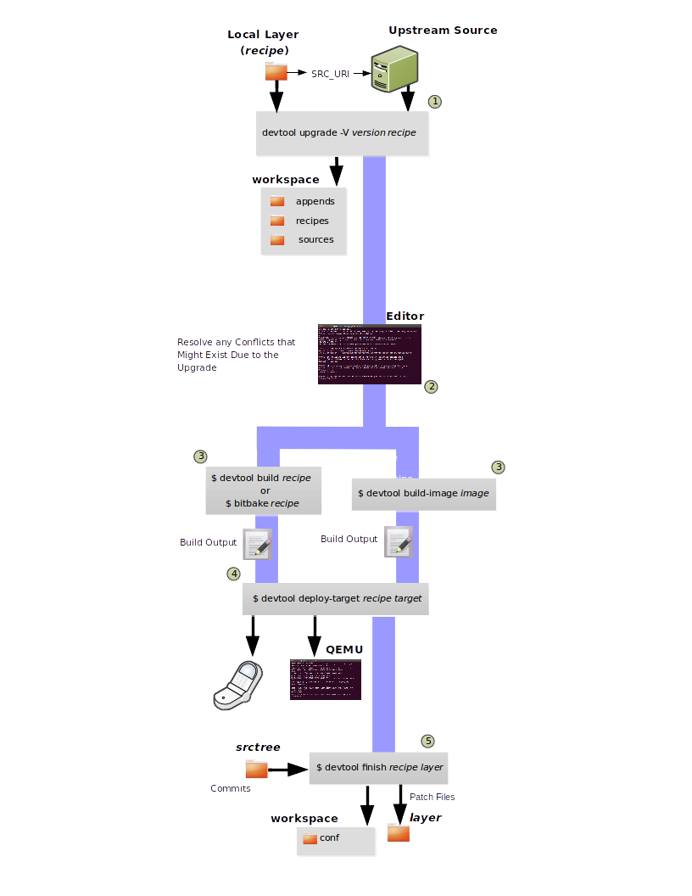

.. SPDX-License-Identifier: CC-BY-SA-2.0-UK

************************
Using the Extensible SDK
************************

This chapter describes the extensible SDK and how to install it.
Information covers the pieces of the SDK, how to install it, and
presents a look at using the ``devtool`` functionality. The extensible
SDK makes it easy to add new applications and libraries to an image,
modify the source for an existing component, test changes on the target
hardware, and ease integration into the rest of the
:term:`OpenEmbedded Build System`.

.. note::

   For a side-by-side comparison of main features supported for an
   extensible SDK as compared to a standard SDK, see the
   :ref:`sdk-manual/intro:introduction` section.

In addition to the functionality available through ``devtool``, you can
alternatively make use of the toolchain directly, for example from
Makefile and Autotools. See the
":ref:`sdk-manual/working-projects:using the sdk toolchain directly`" chapter
for more information.

Why use the Extensible SDK and What is in It?
=============================================

The extensible SDK provides a cross-development toolchain and libraries
tailored to the contents of a specific image. You would use the
Extensible SDK if you want a toolchain experience supplemented with the
powerful set of ``devtool`` commands tailored for the Yocto Project
environment.

The installed extensible SDK consists of several files and directories.
Basically, it contains an SDK environment setup script, some
configuration files, an internal build system, and the ``devtool``
functionality.

Installing the Extensible SDK
=============================

Two ways to install the Extensible SDK
--------------------------------------

Extensible SDK can be installed in two different ways, and both have
their own pros and cons:

#. *Setting up the Extensible SDK environment directly in a Yocto build*. This
   avoids having to produce, test, distribute and maintain separate SDK
   installer archives, which can get very large. There is only one environment
   for the regular Yocto build and the SDK and less code paths where things can
   go not according to plan. It's easier to update the SDK: it simply means
   updating the Yocto layers with git fetch or layer management tooling. The
   SDK extensibility is better than in the second option: just run ``bitbake``
   again to add more things to the sysroot, or add layers if even more things
   are required.

#. *Setting up the Extensible SDK from a standalone installer*. This has the
   benefit of having a single, self-contained archive that includes all the
   needed binary artifacts. So nothing needs to be rebuilt, and there is no
   need to provide a well-functioning binary artefact cache over the network
   for developers with underpowered laptops.

.. _setting_up_ext_sdk_in_build:

Setting up the Extensible SDK environment directly in a Yocto build
-------------------------------------------------------------------

#. Set up all the needed layers and a Yocto :term:`Build Directory`, e.g. a regular Yocto
   build where ``bitbake`` can be executed.

#. Run::

      $ bitbake meta-ide-support
      $ bitbake -c populate_sysroot gtk+3
      # or any other target or native item that the application developer would need
      $ bitbake build-sysroots -c build_native_sysroot && bitbake build-sysroots -c build_target_sysroot

Setting up the Extensible SDK from a standalone installer
---------------------------------------------------------

The first thing you need to do is install the SDK on your :term:`Build
Host` by running the ``*.sh`` installation script.

You can download a tarball installer, which includes the pre-built
toolchain, the ``runqemu`` script, the internal build system,
``devtool``, and support files from the appropriate
:yocto_dl:`toolchain </releases/yocto/yocto-&DISTRO;/toolchain/>` directory within the Index of
Releases. Toolchains are available for several 32-bit and 64-bit
architectures with the ``x86_64`` directories, respectively. The
toolchains the Yocto Project provides are based off the
``core-image-sato`` and ``core-image-minimal`` images and contain
libraries appropriate for developing against that image.

The names of the tarball installer scripts are such that a string
representing the host system appears first in the filename and then is
immediately followed by a string representing the target architecture.
An extensible SDK has the string "-ext" as part of the name. Following
is the general form::

   poky-glibc-host_system-image_type-arch-toolchain-ext-release_version.sh

   Where:
       host_system is a string representing your development system:

                  i686 or x86_64.

       image_type is the image for which the SDK was built:

                  core-image-sato or core-image-minimal

       arch is a string representing the tuned target architecture:

                  aarch64, armv5e, core2-64, i586, mips32r2, mips64, ppc7400, or cortexa8hf-neon

       release_version is a string representing the release number of the Yocto Project:

                  &DISTRO;, &DISTRO;+snapshot

For example, the following SDK installer is for a 64-bit
development host system and a i586-tuned target architecture based off
the SDK for ``core-image-sato`` and using the current &DISTRO; snapshot::

   poky-glibc-x86_64-core-image-sato-i586-toolchain-ext-&DISTRO;.sh

.. note::

   As an alternative to downloading an SDK, you can build the SDK
   installer. For information on building the installer, see the
   :ref:`sdk-manual/appendix-obtain:building an sdk installer`
   section.

The SDK and toolchains are self-contained and by default are installed
into the ``poky_sdk`` folder in your home directory. You can choose to
install the extensible SDK in any location when you run the installer.
However, because files need to be written under that directory during
the normal course of operation, the location you choose for installation
must be writable for whichever users need to use the SDK.

The following command shows how to run the installer given a toolchain
tarball for a 64-bit x86 development host system and a 64-bit x86 target
architecture. The example assumes the SDK installer is located in
``~/Downloads/`` and has execution rights::

   $ ./Downloads/poky-glibc-x86_64-core-image-minimal-core2-64-toolchain-ext-2.5.sh
   Poky (Yocto Project Reference Distro) Extensible SDK installer version 2.5
   ==========================================================================
   Enter target directory for SDK (default: poky_sdk):
   You are about to install the SDK to "/home/scottrif/poky_sdk". Proceed [Y/n]? Y
   Extracting SDK..............done
   Setting it up...
   Extracting buildtools...
   Preparing build system...
   Parsing recipes: 100% |##################################################################| Time: 0:00:52
   Initialising tasks: 100% |###############################################################| Time: 0:00:00
   Checking sstate mirror object availability: 100% |#######################################| Time: 0:00:00
   Loading cache: 100% |####################################################################| Time: 0:00:00
   Initialising tasks: 100% |###############################################################| Time: 0:00:00
   done
   SDK has been successfully set up and is ready to be used.
   Each time you wish to use the SDK in a new shell session, you need to source the environment setup script e.g.
    $ . /home/scottrif/poky_sdk/environment-setup-core2-64-poky-linux

.. note::

   If you do not have write permissions for the directory into which you
   are installing the SDK, the installer notifies you and exits. For
   that case, set up the proper permissions in the directory and run the
   installer again.

.. _running_the_ext_sdk_env:

Running the Extensible SDK Environment Setup Script
===================================================

Once you have the SDK installed, you must run the SDK environment setup
script before you can actually use the SDK.

When using a SDK directly in a Yocto build, you will find the script in
``tmp/deploy/images/qemux86-64/`` in your :term:`Build Directory`.

When using a standalone SDK installer, this setup script resides in
the directory you chose when you installed the SDK, which is either the
default ``poky_sdk`` directory or the directory you chose during
installation.

Before running the script, be sure it is the one that matches the
architecture for which you are developing. Environment setup scripts
begin with the string "``environment-setup``" and include as part of
their name the tuned target architecture. As an example, the following
commands set the working directory to where the SDK was installed and
then source the environment setup script. In this example, the setup
script is for an IA-based target machine using i586 tuning::

   $ cd /home/scottrif/poky_sdk
   $ source environment-setup-core2-64-poky-linux
   SDK environment now set up; additionally you may now run devtool to perform development tasks.
   Run devtool --help for further details.

When using the environment script directly in a Yocto build, it can
be run similarly::

   $ source tmp/deploy/images/qemux86-64/environment-setup-core2-64-poky-linux

Running the setup script defines many environment variables needed in order to
use the SDK (e.g. ``PATH``, :term:`CC`, :term:`LD`, and so forth). If you want
to see all the environment variables the script exports, examine the
installation file itself.

.. _using_devtool:

Using ``devtool`` in Your SDK Workflow
======================================

The cornerstone of the extensible SDK is a command-line tool called
``devtool``. This tool provides a number of features that help you
build, test and package software within the extensible SDK, and
optionally integrate it into an image built by the OpenEmbedded build
system.

.. note::

   The use of ``devtool`` is not limited to the extensible SDK. You can use
   ``devtool`` to help you easily develop any project whose build output must be
   part of an image built using the build system.

The ``devtool`` command line is organized similarly to
:ref:`overview-manual/development-environment:git` in that it has a number of
sub-commands for each function. You can run ``devtool --help`` to see
all the commands.

.. note::

   See the ":doc:`/ref-manual/devtool-reference`"
   section in the Yocto Project Reference Manual.

``devtool`` subcommands provide entry-points into development:

-  *devtool add*: Assists in adding new software to be built.

-  *devtool modify*: Sets up an environment to enable you to modify
   the source of an existing component.

-  *devtool ide-sdk*: Generates a configuration for an IDE.

-  *devtool upgrade*: Updates an existing recipe so that you can
   build it for an updated set of source files.

As with the build system, "recipes" represent software packages within
``devtool``. When you use ``devtool add``, a recipe is automatically
created. When you use ``devtool modify``, the specified existing recipe
is used in order to determine where to get the source code and how to
patch it. In both cases, an environment is set up so that when you build
the recipe a source tree that is under your control is used in order to
allow you to make changes to the source as desired. By default, new
recipes and the source go into a "workspace" directory under the SDK.

The remainder of this section presents the ``devtool add``,
``devtool modify``, and ``devtool upgrade`` workflows.

Use ``devtool add`` to Add an Application
-----------------------------------------

The ``devtool add`` command generates a new recipe based on existing
source code. This command takes advantage of the
:ref:`devtool-the-workspace-layer-structure`
layer that many ``devtool`` commands use. The command is flexible enough
to allow you to extract source code into both the workspace or a
separate local Git repository and to use existing code that does not
need to be extracted.

Depending on your particular scenario, the arguments and options you use
with ``devtool add`` form different combinations. The following diagram
shows common development flows you would use with the ``devtool add``
command:

.. image:: figures/sdk-devtool-add-flow.png
   :width: 100%

#. *Generating the New Recipe*: The top part of the flow shows three
   scenarios by which you could use ``devtool add`` to generate a recipe
   based on existing source code.

   In a shared development environment, it is typical for other
   developers to be responsible for various areas of source code. As a
   developer, you are probably interested in using that source code as
   part of your development within the Yocto Project. All you need is
   access to the code, a recipe, and a controlled area in which to do
   your work.

   Within the diagram, three possible scenarios feed into the
   ``devtool add`` workflow:

   -  *Left*: The left scenario in the figure represents a common
      situation where the source code does not exist locally and needs
      to be extracted. In this situation, the source code is extracted
      to the default workspace --- you do not want the files in some
      specific location outside of the workspace. Thus, everything you
      need will be located in the workspace::

         $ devtool add recipe fetchuri

      With this command, ``devtool`` extracts the upstream
      source files into a local Git repository within the ``sources``
      folder. The command then creates a recipe named recipe and a
      corresponding append file in the workspace. If you do not provide
      recipe, the command makes an attempt to determine the recipe name.

   -  *Middle*: The middle scenario in the figure also represents a
      situation where the source code does not exist locally. In this
      case, the code is again upstream and needs to be extracted to some
      local area --- this time outside of the default workspace.

      .. note::

         If required, ``devtool`` always creates a Git repository locally
         during the extraction.

      Furthermore, the first positional argument ``srctree`` in this case
      identifies where the ``devtool add`` command will locate the
      extracted code outside of the workspace. You need to specify an
      empty directory::

         $ devtool add recipe srctree fetchuri

      In summary, the source code is pulled from fetchuri and extracted into the
      location defined by ``srctree`` as a local Git repository.

      Within workspace, ``devtool`` creates a recipe named recipe along
      with an associated append file.

   -  *Right*: The right scenario in the figure represents a situation
      where the ``srctree`` has been previously prepared outside of the
      ``devtool`` workspace.

      The following command provides a new recipe name and identifies
      the existing source tree location::

         $ devtool add recipe srctree

      The command examines the source code and creates a recipe named
      recipe for the code and places the recipe into the workspace.

      Because the extracted source code already exists, ``devtool`` does
      not try to relocate the source code into the workspace --- only the
      new recipe is placed in the workspace.

      Aside from a recipe folder, the command also creates an associated
      append folder and places an initial ``*.bbappend`` file within.

#. *Edit the Recipe*: You can use ``devtool edit-recipe`` to open up the
   editor as defined by the ``$EDITOR`` environment variable and modify
   the file::

      $ devtool edit-recipe recipe

   From within the editor, you can make modifications to the recipe that
   take effect when you build it later.

#. *Build the Recipe or Rebuild the Image*: The next step you take
   depends on what you are going to do with the new code.

   If you need to eventually move the build output to the target
   hardware, use the following ``devtool`` command::

      $ devtool build recipe

   On the other hand, if you want an image to contain the recipe's
   packages from the workspace for immediate deployment onto a device
   (e.g. for testing purposes), you can use the ``devtool build-image``
   command::

      $ devtool build-image image

#. *Deploy the Build Output*: When you use the ``devtool build`` command
   to build out your recipe, you probably want to see if the resulting
   build output works as expected on the target hardware.

   .. note::

      This step assumes you have a previously built image that is
      already either running in QEMU or is running on actual hardware.
      Also, it is assumed that for deployment of the image to the
      target, SSH is installed in the image and, if the image is running
      on real hardware, you have network access to and from your
      development machine.

   You can deploy your build output to that target hardware by using the
   ``devtool deploy-target`` command::

      $ devtool deploy-target recipe target

   The target is a live target machine running as an SSH server.

   You can, of course, also deploy the image you build to actual
   hardware by using the ``devtool build-image`` command. However,
   ``devtool`` does not provide a specific command that allows you to
   deploy the image to actual hardware.

#. *Finish Your Work With the Recipe*: The ``devtool finish`` command
   creates any patches corresponding to commits in the local Git
   repository, moves the new recipe to a more permanent layer, and then
   resets the recipe so that the recipe is built normally rather than
   from the workspace::

      $ devtool finish recipe layer

   .. note::

      Any changes you want to turn into patches must be committed to the
      Git repository in the source tree.

   As mentioned, the ``devtool finish`` command moves the final recipe
   to its permanent layer.

   As a final process of the ``devtool finish`` command, the state of
   the standard layers and the upstream source is restored so that you
   can build the recipe from those areas rather than the workspace.

   .. note::

      You can use the ``devtool reset`` command to put things back should you
      decide you do not want to proceed with your work. If you do use this
      command, realize that the source tree is preserved.

Use ``devtool modify`` to Modify the Source of an Existing Component
--------------------------------------------------------------------

The ``devtool modify`` command prepares the way to work on existing code
that already has a local recipe in place that is used to build the
software. The command is flexible enough to allow you to extract code
from an upstream source, specify the existing recipe, and keep track of
and gather any patch files from other developers that are associated
with the code.

Depending on your particular scenario, the arguments and options you use
with ``devtool modify`` form different combinations. The following
diagram shows common development flows for the ``devtool modify``
command:

.. image:: figures/sdk-devtool-modify-flow.png
   :width: 100%

#. *Preparing to Modify the Code*: The top part of the flow shows three
   scenarios by which you could use ``devtool modify`` to prepare to
   work on source files. Each scenario assumes the following:

   -  The recipe exists locally in a layer external to the ``devtool``
      workspace.

   -  The source files exist either upstream in an un-extracted state or
      locally in a previously extracted state.

   The typical situation is where another developer has created a layer
   for use with the Yocto Project and their recipe already resides in
   that layer. Furthermore, their source code is readily available
   either upstream or locally.

   -  *Left*: The left scenario in the figure represents a common
      situation where the source code does not exist locally and it
      needs to be extracted from an upstream source. In this situation,
      the source is extracted into the default ``devtool`` workspace
      location. The recipe, in this scenario, is in its own layer
      outside the workspace (i.e. ``meta-``\ layername).

      The following command identifies the recipe and, by default,
      extracts the source files::

         $ devtool modify recipe

      Once ``devtool`` locates the recipe, ``devtool`` uses the recipe's
      :term:`SRC_URI` statements to locate the source code and any local
      patch files from other developers.

      With this scenario, there is no ``srctree`` argument. Consequently, the
      default behavior of the ``devtool modify`` command is to extract
      the source files pointed to by the :term:`SRC_URI` statements into a
      local Git structure. Furthermore, the location for the extracted
      source is the default area within the ``devtool`` workspace. The
      result is that the command sets up both the source code and an
      append file within the workspace while the recipe remains in its
      original location.

      Additionally, if you have any non-patch local files (i.e. files
      referred to with ``file://`` entries in :term:`SRC_URI` statement
      excluding ``*.patch/`` or ``*.diff``), these files are copied to
      an ``oe-local-files`` folder under the newly created source tree.
      Copying the files here gives you a convenient area from which you
      can modify the files. Any changes or additions you make to those
      files are incorporated into the build the next time you build the
      software just as are other changes you might have made to the
      source.

   -  *Middle*: The middle scenario in the figure represents a situation
      where the source code also does not exist locally. In this case,
      the code is again upstream and needs to be extracted to some local
      area as a Git repository. The recipe, in this scenario, is again
      local and in its own layer outside the workspace.

      The following command tells ``devtool`` the recipe with which to
      work and, in this case, identifies a local area for the extracted
      source files that exists outside of the default ``devtool``
      workspace::

         $ devtool modify recipe srctree

      .. note::

         You cannot provide a URL for ``srctree`` using the ``devtool`` command.

      As with all extractions, the command uses the recipe's :term:`SRC_URI`
      statements to locate the source files and any associated patch
      files. Non-patch files are copied to an ``oe-local-files`` folder
      under the newly created source tree.

      Once the files are located, the command by default extracts them
      into ``srctree``.

      Within workspace, ``devtool`` creates an append file for the
      recipe. The recipe remains in its original location but the source
      files are extracted to the location you provide with ``srctree``.

   -  *Right*: The right scenario in the figure represents a situation
      where the source tree (``srctree``) already exists locally as a
      previously extracted Git structure outside of the ``devtool``
      workspace. In this example, the recipe also exists elsewhere
      locally in its own layer.

      The following command tells ``devtool`` the recipe with which to
      work, uses the "-n" option to indicate source does not need to be
      extracted, and uses ``srctree`` to point to the previously extracted
      source files::

         $ devtool modify -n recipe srctree

      If an ``oe-local-files`` subdirectory happens to exist and it
      contains non-patch files, the files are used. However, if the
      subdirectory does not exist and you run the ``devtool finish``
      command, any non-patch files that might exist next to the recipe
      are removed because it appears to ``devtool`` that you have
      deleted those files.

      Once the ``devtool modify`` command finishes, it creates only an
      append file for the recipe in the ``devtool`` workspace. The
      recipe and the source code remain in their original locations.

#. *Edit the Source*: Once you have used the ``devtool modify`` command,
   you are free to make changes to the source files. You can use any
   editor you like to make and save your source code modifications.

#. *Build the Recipe or Rebuild the Image*: The next step you take
   depends on what you are going to do with the new code.

   If you need to eventually move the build output to the target
   hardware, use the following ``devtool`` command::

      $ devtool build recipe

   On the other hand, if you want an image to contain the recipe's
   packages from the workspace for immediate deployment onto a device
   (e.g. for testing purposes), you can use the ``devtool build-image``
   command::

      $ devtool build-image image

#. *Deploy the Build Output*: When you use the ``devtool build`` command
   to build out your recipe, you probably want to see if the resulting
   build output works as expected on target hardware.

   .. note::

      This step assumes you have a previously built image that is
      already either running in QEMU or running on actual hardware.
      Also, it is assumed that for deployment of the image to the
      target, SSH is installed in the image and if the image is running
      on real hardware that you have network access to and from your
      development machine.

   You can deploy your build output to that target hardware by using the
   ``devtool deploy-target`` command::

      $ devtool deploy-target recipe target

   The target is a live target machine running as an SSH server.

   You can, of course, use other methods to deploy the image you built
   using the ``devtool build-image`` command to actual hardware.
   ``devtool`` does not provide a specific command to deploy the image
   to actual hardware.

#. *Finish Your Work With the Recipe*: The ``devtool finish`` command
   creates any patches corresponding to commits in the local Git
   repository, updates the recipe to point to them (or creates a
   ``.bbappend`` file to do so, depending on the specified destination
   layer), and then resets the recipe so that the recipe is built
   normally rather than from the workspace::

      $ devtool finish recipe layer

   .. note::

      Any changes you want to turn into patches must be staged and
      committed within the local Git repository before you use the
      ``devtool finish`` command.

   Because there is no need to move the recipe, ``devtool finish``
   either updates the original recipe in the original layer or the
   command creates a ``.bbappend`` file in a different layer as provided
   by layer. Any work you did in the ``oe-local-files`` directory is
   preserved in the original files next to the recipe during the
   ``devtool finish`` command.

   As a final process of the ``devtool finish`` command, the state of
   the standard layers and the upstream source is restored so that you
   can build the recipe from those areas rather than from the workspace.

   .. note::

      You can use the ``devtool reset`` command to put things back should you
      decide you do not want to proceed with your work. If you do use this
      command, realize that the source tree is preserved.

``devtool ide-sdk`` configures IDEs for the extensible SDK
----------------------------------------------------------

``devtool ide-sdk`` automatically configures IDEs to use the extensible SDK.
To make sure that all parts of the extensible SDK required by the generated
IDE configuration are available, ``devtool ide-sdk`` uses BitBake in the
background to bootstrap the extensible SDK.

The extensible SDK supports two different development modes.
``devtool ide-sdk`` supports both of them:

#. *Modified mode*:

   By default ``devtool ide-sdk`` generates IDE configurations for recipes in
   workspaces created by ``devtool modify`` or ``devtool add`` as described in
   :ref:`using_devtool`.  This mode creates IDE configurations with support for
   advanced features, such as deploying the binaries to the remote target
   device and performing remote debugging sessions. The generated IDE
   configurations use the per recipe sysroots as Bitbake does internally.

   In order to use the tool, a few settings are needed. As a starting example,
   the following lines of code can be added to the ``local.conf`` file::

      # Build the companion debug file system
      IMAGE_GEN_DEBUGFS = "1"
      # Optimize build time: with devtool ide-sdk the dbg tar is not needed
      IMAGE_FSTYPES_DEBUGFS = ""
      # Without copying the binaries into roofs-dbg, GDB does not find all source files.
      IMAGE_CLASSES += "image-combined-dbg"

      # SSH is mandatory, no password simplifies the usage
      EXTRA_IMAGE_FEATURES += "\
         ssh-server-openssh \
         debug-tweaks \
      "

      # Remote debugging needs gdbserver on the target device
      IMAGE_INSTALL:append = " gdbserver"

      # Add the recipes which should be modified to the image
      # Otherwise some dependencies might be missing.
      IMAGE_INSTALL:append = " my-recipe"

   Assuming the BitBake environment is set up correctly and a workspace has
   been created for the recipe using ``devtool modify my-recipe``, the
   following command can create the SDK and the configuration for VSCode in
   the recipe workspace::

      $ devtool ide-sdk my-recipe core-image-minimal --target root@192.168.7.2

   The command requires an image recipe (``core-image-minimal`` for this example)
   that is used to create the SDK. This firmware image should also be installed
   on the target device.  It is possible to pass multiple package recipes.
   ``devtool ide-sdk`` tries to create an IDE configuration for all package
   recipes.

   What this command does exactly depends on the recipe, more precisely on the
   build tool used by the recipe. The basic idea is to configure the IDE so
   that it calls the build tool exactly as ``bitbake`` does.

   For example, a CMake preset is created for a recipe that inherits
   :ref:`ref-classes-cmake`. In the case of VSCode, CMake presets are supported
   by the CMake Tools plugin.  This is an example of how the build
   configuration used by ``bitbake`` is exported to an IDE configuration that
   gives exactly the same build results.

   Support for remote debugging with seamless integration into the IDE is
   important for a cross-SDK. ``devtool ide-sdk`` automatically generates the
   necessary helper scripts for deploying the compiled artifacts to the target
   device as well as the necessary configuration for the debugger and the IDE.

   .. note::

      To ensure that the debug symbols on the build machine match the binaries
      running on the target device, it is essential that the image built by
      ``devtool ide-sdk`` is running on the target device.

   ``devtool ide-sdk`` aims to support multiple programming languages and
   multiple IDEs natively. "Natively" means that the IDE is configured to call
   the build tool (e.g. CMake or Meson) directly. This has several advantages.
   First of all, it is much faster than ``devtool build``, but it also allows
   to use the very good integration of tools like CMake or GDB in VSCode and
   other IDEs. However, supporting many programming languages and multiple
   IDEs is quite an elaborate and constantly evolving thing. Support for IDEs
   is therefore implemented as plugins. Plugins can also be provided by
   optional layers.

   The default IDE is VSCode. Some hints about using VSCode:

   -  To work on the source code of a recipe an instance of VSCode is started in
      the recipe's workspace. Example::

         code build/workspace/sources/my-recipe

   -  To work with CMake press ``Ctrl + Shift + p``, type ``cmake``. This will
      show some possible commands like selecting a CMake preset, compiling or
      running CTest.

      For recipes inheriting :ref:`ref-classes-cmake-qemu` rather than
      :ref:`ref-classes-cmake`, executing cross-compiled unit tests on the host
      can be supported transparently with QEMU user-mode.

   -  To work with Meson press ``Ctrl + Shift + p``, type ``meson``. This will
      show some possible commands like compiling or executing the unit tests.

      A note on running cross-compiled unit tests on the host: Meson enables
      support for QEMU user-mode by default. It is expected that the execution
      of the unit tests from the IDE will work easily without any additional
      steps, provided that the code is suitable for execution on the host
      machine.

   -  For the deployment to the target device, just press ``Ctrl + Shift + p``,
      type ``task``.  Select ``install && deploy-target``.

   -  For remote debugging, switch to the debugging view by pressing the "play"
      button with the ``bug icon`` on the left side. This will provide a green
      play button with a drop-down list where a debug configuration can be
      selected.  After selecting one of the generated configurations, press the
      "play" button.

      Starting a remote debugging session automatically initiates the deployment
      to the target device. If this is not desired, the
      ``"dependsOn": ["install && deploy-target...]`` parameter of the tasks
      with ``"label": "gdbserver start...`` can be removed from the
      ``tasks.json`` file.

      VSCode supports GDB with many different setups and configurations for many
      different use cases.  However, most of these setups have some limitations
      when it comes to cross-development, support only a few target
      architectures or require a high performance target device. Therefore
      ``devtool ide-sdk`` supports the classic, generic setup with GDB on the
      development host and gdbserver on the target device.

      Roughly summarized, this means:

      -  The binaries are copied via SSH to the remote target device by a script
         referred by ``tasks.json``.

      -  gdbserver is started on the remote target device via SSH by a script
         referred by ``tasks.json``.

         Changing the parameters that are passed to the debugging executable
         requires modifying the generated script. The script is located at
         ``oe-scripts/gdbserver_*``. Defining the parameters in the ``args``
         field in the ``launch.json`` file does not work.

      -  VSCode connects to gdbserver as documented in
         `Remote debugging or debugging with a local debugger server
         <https://code.visualstudio.com/docs/cpp/launch-json-reference#_remote-debugging-or-debugging-with-a-local-debugger-server>`__.

   Additionally ``--ide=none`` is supported. With the ``none`` IDE parameter,
   some generic configuration files like ``gdbinit`` files and some helper
   scripts starting gdbserver remotely on the target device as well as the GDB
   client on the host are generated.

   Here is a usage example for the ``cmake-example`` recipe from the
   ``meta-selftest`` layer which inherits :ref:`ref-classes-cmake-qemu`:

   .. code-block:: sh

      # Create the SDK
      devtool modify cmake-example
      devtool ide-sdk cmake-example core-image-minimal -c --debug-build-config --ide=none

      # Install the firmware on a target device or start QEMU
      runqemu

      # From exploring the workspace of cmake-example
      cd build/workspace/sources/cmake-example

      # Find cmake-native and save the path into a variable
      # Note: using just cmake instead of $CMAKE_NATIVE would work in many cases
      CMAKE_NATIVE="$(jq -r '.configurePresets[0] | "\(.cmakeExecutable)"' CMakeUserPresets.json)"

      # List available CMake presets
      "$CMAKE_NATIVE" --list-presets
      Available configure presets:

        "cmake-example-cortexa57" - cmake-example: cortexa57

      # Re-compile the already compiled sources
      "$CMAKE_NATIVE" --build --preset cmake-example-cortexa57
      ninja: no work to do.
      # Do a clean re-build
      "$CMAKE_NATIVE" --build --preset cmake-example-cortexa57 --target clean
      [1/1] Cleaning all built files...
      Cleaning... 8 files.
      "$CMAKE_NATIVE" --build --preset cmake-example-cortexa57 --target all
      [7/7] Linking CXX executable cmake-example

      # Run the cross-compiled unit tests with QEMU user-mode
      "$CMAKE_NATIVE" --build --preset cmake-example-cortexa57 --target test
      [0/1] Running tests...
      Test project .../build/tmp/work/cortexa57-poky-linux/cmake-example/1.0/cmake-example-1.0
          Start 1: test-cmake-example
      1/1 Test #1: test-cmake-example ...............   Passed    0.03 sec

      100% tests passed, 0 tests failed out of 1

      Total Test time (real) =   0.03 sec

      # Using CTest directly is possible as well
      CTEST_NATIVE="$(dirname "$CMAKE_NATIVE")/ctest"

      # List available CMake presets
      "$CTEST_NATIVE" --list-presets
      Available test presets:

        "cmake-example-cortexa57" - cmake-example: cortexa57

      # Run the cross-compiled unit tests with QEMU user-mode
      "$CTEST_NATIVE" --preset "cmake-example-cortexa57"
      Test project ...build/tmp/work/cortexa57-poky-linux/cmake-example/1.0/cmake-example-1.0
          Start 1: test-cmake-example
      1/1 Test #1: test-cmake-example ...............   Passed    0.03 sec

      100% tests passed, 0 tests failed out of 1

      Total Test time (real) =   0.03 sec

      # Deploying the new build to the target device (default is QEUM at 192.168.7.2)
      oe-scripts/install_and_deploy_cmake-example-cortexa57

      # Start a remote debugging session with gdbserver on the target and GDB on the host
      oe-scripts/gdbserver_1234_usr-bin-cmake-example_m
      oe-scripts/gdb_1234_usr-bin-cmake-example
      break main
      run
      step
      stepi
      continue
      quit

      # Stop gdbserver on the target device
      oe-scripts/gdbserver_1234_usr-bin-cmake-example_m stop

#. *Shared sysroots mode*

   For some recipes and use cases a per-recipe sysroot based SDK is not
   suitable.  Optionally ``devtool ide-sdk`` configures the IDE to use the
   toolchain provided by the extensible SDK as described in
   :ref:`running_the_ext_sdk_env`. ``devtool ide-sdk --mode=shared`` is
   basically a wrapper for the setup of the extensible SDK as described in
   :ref:`setting_up_ext_sdk_in_build`. The IDE gets a configuration to use the
   shared sysroots.

   Creating a SDK with shared sysroots that contains all the dependencies needed
   to work with ``my-recipe`` is possible with the following example command::

      $ devtool ide-sdk --mode=shared my-recipe

   For VSCode the cross-toolchain is exposed as a CMake kit. CMake kits are
   defined in ``~/.local/share/CMakeTools/cmake-tools-kits.json``.
   The following example shows how the cross-toolchain can be selected in
   VSCode. First of all we need a folder containing a CMake project.
   For this example, let's create a CMake project and start VSCode::

      mkdir kit-test
      echo "project(foo VERSION 1.0)" > kit-test/CMakeLists.txt
      code kit-test

   If there is a CMake project in the workspace, cross-compilation is supported:

   - Press ``Ctrl + Shift + P``, type ``CMake: Scan for Kits``
   - Press ``Ctrl + Shift + P``, type ``CMake: Select a Kit``

   Finally most of the features provided by CMake and the IDE should be available.

   Other IDEs than VSCode are supported as well. However,
   ``devtool ide-sdk --mode=shared --ide=none my-recipe`` is currently
   just a simple wrapper for the setup of the extensible SDK, as described in
   :ref:`setting_up_ext_sdk_in_build`.

Use ``devtool upgrade`` to Create a Version of the Recipe that Supports a Newer Version of the Software
-------------------------------------------------------------------------------------------------------

The ``devtool upgrade`` command upgrades an existing recipe to that of a
more up-to-date version found upstream. Throughout the life of software,
recipes continually undergo version upgrades by their upstream
publishers. You can use the ``devtool upgrade`` workflow to make sure
your recipes you are using for builds are up-to-date with their upstream
counterparts.

.. note::

   Several methods exist by which you can upgrade recipes ---
   ``devtool upgrade`` happens to be one. You can read about all the methods by
   which you can upgrade recipes in the
   :ref:`dev-manual/upgrading-recipes:upgrading recipes` section of the Yocto
   Project Development Tasks Manual.

The ``devtool upgrade`` command is flexible enough to allow you to specify
source code revision and versioning schemes, extract code into or out of the
``devtool`` :ref:`devtool-the-workspace-layer-structure`, and work with any
source file forms that the
:ref:`bitbake-user-manual/bitbake-user-manual-fetching:fetchers` support.

The following diagram shows the common development flow used with the
``devtool upgrade`` command:

#. *Initiate the Upgrade*: The top part of the flow shows the typical
   scenario by which you use the ``devtool upgrade`` command. The
   following conditions exist:

   -  The recipe exists in a local layer external to the ``devtool``
      workspace.

   -  The source files for the new release exist in the same location
      pointed to by :term:`SRC_URI`
      in the recipe (e.g. a tarball with the new version number in the
      name, or as a different revision in the upstream Git repository).

   A common situation is where third-party software has undergone a
   revision so that it has been upgraded. The recipe you have access to
   is likely in your own layer. Thus, you need to upgrade the recipe to
   use the newer version of the software::

      $ devtool upgrade -V version recipe

   By default, the ``devtool upgrade`` command extracts source
   code into the ``sources`` directory in the
   :ref:`devtool-the-workspace-layer-structure`.
   If you want the code extracted to any other location, you need to
   provide the ``srctree`` positional argument with the command as follows::

      $ devtool upgrade -V version recipe srctree

   .. note::

      In this example, the "-V" option specifies the new version. If you
      don't use "-V", the command upgrades the recipe to the latest
      version.

   If the source files pointed to by the :term:`SRC_URI` statement in the
   recipe are in a Git repository, you must provide the "-S" option and
   specify a revision for the software.

   Once ``devtool`` locates the recipe, it uses the :term:`SRC_URI` variable
   to locate the source code and any local patch files from other
   developers. The result is that the command sets up the source code,
   the new version of the recipe, and an append file all within the
   workspace.

   Additionally, if you have any non-patch local files (i.e. files
   referred to with ``file://`` entries in :term:`SRC_URI` statement
   excluding ``*.patch/`` or ``*.diff``), these files are copied to an
   ``oe-local-files`` folder under the newly created source tree.
   Copying the files here gives you a convenient area from which you can
   modify the files. Any changes or additions you make to those files
   are incorporated into the build the next time you build the software
   just as are other changes you might have made to the source.

#. *Resolve any Conflicts created by the Upgrade*: Conflicts could happen
   after upgrading the software to a new version. Conflicts occur
   if your recipe specifies some patch files in :term:`SRC_URI` that
   conflict with changes made in the new version of the software. For
   such cases, you need to resolve the conflicts by editing the source
   and following the normal ``git rebase`` conflict resolution process.

   Before moving onto the next step, be sure to resolve any such
   conflicts created through use of a newer or different version of the
   software.

#. *Build the Recipe or Rebuild the Image*: The next step you take
   depends on what you are going to do with the new code.

   If you need to eventually move the build output to the target
   hardware, use the following ``devtool`` command::

      $ devtool build recipe

   On the other hand, if you want an image to contain the recipe's
   packages from the workspace for immediate deployment onto a device
   (e.g. for testing purposes), you can use the ``devtool build-image``
   command::

      $ devtool build-image image

#. *Deploy the Build Output*: When you use the ``devtool build`` command
   or ``bitbake`` to build your recipe, you probably want to see if the
   resulting build output works as expected on target hardware.

   .. note::

      This step assumes you have a previously built image that is
      already either running in QEMU or running on actual hardware.
      Also, it is assumed that for deployment of the image to the
      target, SSH is installed in the image and if the image is running
      on real hardware that you have network access to and from your
      development machine.

   You can deploy your build output to that target hardware by using the
   ``devtool deploy-target`` command::

      $ devtool deploy-target recipe target

   The target is a live target machine running as an SSH server.

   You can, of course, also deploy the image you build using the
   ``devtool build-image`` command to actual hardware. However,
   ``devtool`` does not provide a specific command that allows you to do
   this.

#. *Finish Your Work With the Recipe*: The ``devtool finish`` command
   creates any patches corresponding to commits in the local Git
   repository, moves the new recipe to a more permanent layer, and then
   resets the recipe so that the recipe is built normally rather than
   from the workspace.

   Any work you did in the ``oe-local-files`` directory is preserved in
   the original files next to the recipe during the ``devtool finish``
   command.

   If you specify a destination layer that is the same as the original
   source, then the old version of the recipe and associated files are
   removed prior to adding the new version::

      $ devtool finish recipe layer

   .. note::

      Any changes you want to turn into patches must be committed to the
      Git repository in the source tree.

   As a final process of the ``devtool finish`` command, the state of
   the standard layers and the upstream source is restored so that you
   can build the recipe from those areas rather than the workspace.

   .. note::

      You can use the ``devtool reset`` command to put things back should you
      decide you do not want to proceed with your work. If you do use this
      command, realize that the source tree is preserved.

A Closer Look at ``devtool add``
================================

The ``devtool add`` command automatically creates a recipe based on the
source tree you provide with the command. Currently, the command has
support for the following:

-  Autotools (``autoconf`` and ``automake``)

-  CMake

-  Scons

-  ``qmake``

-  Plain ``Makefile``

-  Out-of-tree kernel module

-  Binary package (i.e. "-b" option)

-  Node.js module

-  Python modules that use ``setuptools`` or ``distutils``

Apart from binary packages, the determination of how a source tree
should be treated is automatic based on the files present within that
source tree. For example, if a ``CMakeLists.txt`` file is found, then
the source tree is assumed to be using CMake and is treated accordingly.

.. note::

   In most cases, you need to edit the automatically generated recipe in
   order to make it build properly. Typically, you would go through
   several edit and build cycles until the recipe successfully builds.
   Once the recipe builds, you could use possible further iterations to
   test the recipe on the target device.

The remainder of this section covers specifics regarding how parts of
the recipe are generated.

Name and Version
----------------

If you do not specify a name and version on the command line,
``devtool add`` uses various metadata within the source tree in an
attempt to determine the name and version of the software being built.
Based on what the tool determines, ``devtool`` sets the name of the
created recipe file accordingly.

If ``devtool`` cannot determine the name and version, the command prints
an error. For such cases, you must re-run the command and provide the
name and version, just the name, or just the version as part of the
command line.

Sometimes the name or version determined from the source tree might be
incorrect. For such a case, you must reset the recipe::

   $ devtool reset -n recipename

After running the ``devtool reset`` command, you need to
run ``devtool add`` again and provide the name or the version.

Dependency Detection and Mapping
--------------------------------

The ``devtool add`` command attempts to detect build-time dependencies and map
them to other recipes in the system. During this mapping, the command fills in
the names of those recipes as part of the :term:`DEPENDS` variable within the
recipe. If a dependency cannot be mapped, ``devtool`` places a comment
in the recipe indicating such. The inability to map a dependency can
result from naming not being recognized or because the dependency simply
is not available. For cases where the dependency is not available, you
must use the ``devtool add`` command to add an additional recipe that
satisfies the dependency. Once you add that recipe, you need to update
the :term:`DEPENDS` variable in the original recipe to include the new
recipe.

If you need to add runtime dependencies, you can do so by adding the
following to your recipe::

   RDEPENDS:${PN} += "dependency1 dependency2 ..."

.. note::

   The ``devtool add`` command often cannot distinguish between mandatory and
   optional dependencies. Consequently, some of the detected dependencies might
   in fact be optional. When in doubt, consult the documentation or the
   configure script for the software the recipe is building for further
   details. In some cases, you might find you can substitute the
   dependency with an option that disables the associated functionality
   passed to the configure script.

License Detection
-----------------

The ``devtool add`` command attempts to determine if the software you are
adding is able to be distributed under a common, open-source license. If
so, the command sets the :term:`LICENSE` value accordingly.
You should double-check the value added by the command against the
documentation or source files for the software you are building and, if
necessary, update that :term:`LICENSE` value.

The ``devtool add`` command also sets the :term:`LIC_FILES_CHKSUM`
value to point to all files that appear to be license-related. Realize
that license statements often appear in comments at the top of source
files or within the documentation. In such cases, the command does not
recognize those license statements. Consequently, you might need to
amend the :term:`LIC_FILES_CHKSUM` variable to point to one or more of those
comments if present. Setting :term:`LIC_FILES_CHKSUM` is particularly
important for third-party software. The mechanism attempts to ensure
correct licensing should you upgrade the recipe to a newer upstream
version in future. Any change in licensing is detected and you receive
an error prompting you to check the license text again.

If the ``devtool add`` command cannot determine licensing information,
``devtool`` sets the :term:`LICENSE` value to "CLOSED" and leaves the
:term:`LIC_FILES_CHKSUM` value unset. This behavior allows you to continue
with development even though the settings are unlikely to be correct in
all cases. You should check the documentation or source files for the
software you are building to determine the actual license.

Adding Makefile-Only Software
-----------------------------

The use of Make by itself is very common in both proprietary and
open-source software. Unfortunately, Makefiles are often not written
with cross-compilation in mind. Thus, ``devtool add`` often cannot do
very much to ensure that these Makefiles build correctly. It is very
common, for example, to explicitly call ``gcc`` instead of using the
:term:`CC` variable. Usually, in a
cross-compilation environment, ``gcc`` is the compiler for the build
host and the cross-compiler is named something similar to
``arm-poky-linux-gnueabi-gcc`` and might require arguments (e.g. to
point to the associated sysroot for the target machine).

When writing a recipe for Makefile-only software, keep the following in
mind:

-  You probably need to patch the Makefile to use variables instead of
   hardcoding tools within the toolchain such as ``gcc`` and ``g++``.

-  The environment in which Make runs is set up with various standard
   variables for compilation (e.g. :term:`CC`, :term:`CXX`, and so forth) in a
   similar manner to the environment set up by the SDK's environment
   setup script. One easy way to see these variables is to run the
   ``devtool build`` command on the recipe and then look in
   ``oe-logs/run.do_compile``. Towards the top of this file, there is
   a list of environment variables that are set. You can take
   advantage of these variables within the Makefile.

-  If the Makefile sets a default for a variable using "=", that default
   overrides the value set in the environment, which is usually not
   desirable. For this case, you can either patch the Makefile so it
   sets the default using the "?=" operator, or you can alternatively
   force the value on the ``make`` command line. To force the value on
   the command line, add the variable setting to
   :term:`EXTRA_OEMAKE` or
   :term:`PACKAGECONFIG_CONFARGS`
   within the recipe. Here is an example using :term:`EXTRA_OEMAKE`::

      EXTRA_OEMAKE += "'CC=${CC}' 'CXX=${CXX}'"

   In the above example,
   single quotes are used around the variable settings as the values are
   likely to contain spaces because required default options are passed
   to the compiler.

-  Hardcoding paths inside Makefiles is often problematic in a
   cross-compilation environment. This is particularly true because
   those hardcoded paths often point to locations on the build host and
   thus will either be read-only or will introduce contamination into
   the cross-compilation because they are specific to the build host
   rather than the target. Patching the Makefile to use prefix variables
   or other path variables is usually the way to handle this situation.

-  Sometimes a Makefile runs target-specific commands such as
   ``ldconfig``. For such cases, you might be able to apply patches that
   remove these commands from the Makefile.

Adding Native Tools
-------------------

Often, you need to build additional tools that run on the :term:`Build Host`
as opposed to the target. You should indicate this requirement by using one of
the following methods when you run ``devtool add``:

-  Specify the name of the recipe such that it ends with "-native".
   Specifying the name like this produces a recipe that only builds for
   the build host.

-  Specify the "--also-native" option with the ``devtool add``
   command. Specifying this option creates a recipe file that still
   builds for the target but also creates a variant with a "-native"
   suffix that builds for the build host.

.. note::

   If you need to add a tool that is shipped as part of a source tree
   that builds code for the target, you can typically accomplish this by
   building the native and target parts separately rather than within
   the same compilation process. Realize though that with the
   "--also-native" option, you can add the tool using just one
   recipe file.

Adding Node.js Modules
----------------------

You can use the ``devtool add`` command two different ways to add
Node.js modules: through ``npm`` or from a repository or local source.

Use the following form to add Node.js modules through ``npm``::

   $ devtool add "npm://registry.npmjs.org;name=forever;version=0.15.1"

The name and
version parameters are mandatory. Lockdown and shrinkwrap files are
generated and pointed to by the recipe in order to freeze the version
that is fetched for the dependencies according to the first time. This
also saves checksums that are verified on future fetches. Together,
these behaviors ensure the reproducibility and integrity of the build.

.. note::

   -  You must use quotes around the URL. ``devtool add`` does not
      require the quotes, but the shell considers ";" as a splitter
      between multiple commands. Thus, without the quotes,
      ``devtool add`` does not receive the other parts, which results in
      several "command not found" errors.

   -  In order to support adding Node.js modules, a ``nodejs`` recipe
      must be part of your SDK.

As mentioned earlier, you can also add Node.js modules directly from a
repository or local source tree. To add modules this way, use
``devtool add`` in the following form::

   $ devtool add https://github.com/diversario/node-ssdp

In this example, ``devtool`` fetches the specified Git repository, detects the
code as Node.js code, fetches dependencies using ``npm``, and sets
:term:`SRC_URI` accordingly.

Working With Recipes
====================

When building a recipe using the ``devtool build`` command, the typical
build progresses as follows:

#. Fetch the source

#. Unpack the source

#. Configure the source

#. Compile the source

#. Install the build output

#. Package the installed output

For recipes in the workspace, fetching and unpacking is disabled as the
source tree has already been prepared and is persistent. Each of these
build steps is defined as a function (task), usually with a "do\_" prefix
(e.g. :ref:`ref-tasks-fetch`,
:ref:`ref-tasks-unpack`, and so
forth). These functions are typically shell scripts but can instead be
written in Python.

If you look at the contents of a recipe, you will see that the recipe
does not include complete instructions for building the software.
Instead, common functionality is encapsulated in classes inherited with
the ``inherit`` directive. This technique leaves the recipe to describe
just the things that are specific to the software being built. There is
a :ref:`ref-classes-base` class that is implicitly inherited by all recipes
and provides the functionality that most recipes typically need.

The remainder of this section presents information useful when working
with recipes.

Finding Logs and Work Files
---------------------------

After the first run of the ``devtool build`` command, recipes that were
previously created using the ``devtool add`` command or whose sources
were modified using the ``devtool modify`` command contain symbolic
links created within the source tree:

-  ``oe-logs``: This link points to the directory in which log files and
   run scripts for each build step are created.

-  ``oe-workdir``: This link points to the temporary work area for the
   recipe. The following locations under ``oe-workdir`` are particularly
   useful:

   -  ``image/``: Contains all of the files installed during the
      :ref:`ref-tasks-install` stage.
      Within a recipe, this directory is referred to by the expression
      ``${``\ :term:`D`\ ``}``.

   -  ``sysroot-destdir/``: Contains a subset of files installed within
      :ref:`ref-tasks-install` that have been put into the shared sysroot. For
      more information, see the
      ":ref:`dev-manual/new-recipe:sharing files between recipes`" section.

   -  ``packages-split/``: Contains subdirectories for each package
      produced by the recipe. For more information, see the
      ":ref:`sdk-manual/extensible:packaging`" section.

You can use these links to get more information on what is happening at
each build step.

Setting Configure Arguments
---------------------------

If the software your recipe is building uses GNU autoconf, then a fixed
set of arguments is passed to it to enable cross-compilation plus any
extras specified by :term:`EXTRA_OECONF` or :term:`PACKAGECONFIG_CONFARGS`
set within the recipe. If you wish to pass additional options, add them
to :term:`EXTRA_OECONF` or :term:`PACKAGECONFIG_CONFARGS`. Other supported build
tools have similar variables (e.g.  :term:`EXTRA_OECMAKE` for CMake,
:term:`EXTRA_OESCONS` for Scons, and so forth). If you need to pass anything on
the ``make`` command line, you can use :term:`EXTRA_OEMAKE` or the
:term:`PACKAGECONFIG_CONFARGS` variables to do so.

You can use the ``devtool configure-help`` command to help you set the
arguments listed in the previous paragraph. The command determines the
exact options being passed, and shows them to you along with any custom
arguments specified through :term:`EXTRA_OECONF` or
:term:`PACKAGECONFIG_CONFARGS`. If applicable, the command also shows you
the output of the configure script's "--help" option as a
reference.

Sharing Files Between Recipes
-----------------------------

Recipes often need to use files provided by other recipes on the
:term:`Build Host`. For example,
an application linking to a common library needs access to the library
itself and its associated headers. The way this access is accomplished
within the extensible SDK is through the sysroot. There is one sysroot per
"machine" for which the SDK is being built. In practical terms, this
means there is a sysroot for the target machine, and a sysroot for
the build host.

Recipes should never write files directly into the sysroot. Instead,
files should be installed into standard locations during the
:ref:`ref-tasks-install` task within the ``${``\ :term:`D`\ ``}`` directory. A
subset of these files automatically goes into the sysroot. The reason
for this limitation is that almost all files that go into the sysroot
are cataloged in manifests in order to ensure they can be removed later
when a recipe is modified or removed. Thus, the sysroot is able to
remain free from stale files.

Packaging
---------

Packaging is not always particularly relevant within the extensible SDK.
However, if you examine how build output gets into the final image on
the target device, it is important to understand packaging because the
contents of the image are expressed in terms of packages and not
recipes.

During the :ref:`ref-tasks-package` task, files installed during the
:ref:`ref-tasks-install` task are split into one main package, which is almost
always named the same as the recipe, and into several other packages. This
separation exists because not all of those installed files are useful in every
image. For example, you probably do not need any of the documentation installed
in a production image. Consequently, for each recipe the documentation
files are separated into a ``-doc`` package. Recipes that package
software containing optional modules or plugins might undergo additional
package splitting as well.

After building a recipe, you can see where files have gone by looking in
the ``oe-workdir/packages-split`` directory, which contains a
subdirectory for each package. Apart from some advanced cases, the
:term:`PACKAGES` and :term:`FILES` variables controls
splitting. The :term:`PACKAGES` variable lists all of the packages to be
produced, while the :term:`FILES` variable specifies which files to include
in each package by using an override to specify the package. For
example, ``FILES:${PN}`` specifies the files to go into the main package
(i.e. the main package has the same name as the recipe and
``${``\ :term:`PN`\ ``}`` evaluates to the
recipe name). The order of the :term:`PACKAGES` value is significant. For
each installed file, the first package whose :term:`FILES` value matches the
file is the package into which the file goes. Both the :term:`PACKAGES` and
:term:`FILES` variables have default values. Consequently, you might find
you do not even need to set these variables in your recipe unless the
software the recipe is building installs files into non-standard
locations.

Restoring the Target Device to its Original State
=================================================

If you use the ``devtool deploy-target`` command to write a recipe's
build output to the target, and you are working on an existing component
of the system, then you might find yourself in a situation where you
need to restore the original files that existed prior to running the
``devtool deploy-target`` command. Because the ``devtool deploy-target``
command backs up any files it overwrites, you can use the
``devtool undeploy-target`` command to restore those files and remove
any other files the recipe deployed. Consider the following example::

   $ devtool undeploy-target lighttpd root@192.168.7.2

If you have deployed
multiple applications, you can remove them all using the "-a" option
thus restoring the target device to its original state::

   $ devtool undeploy-target -a root@192.168.7.2

Information about files deployed to
the target as well as any backed up files are stored on the target
itself. This storage, of course, requires some additional space on the
target machine.

.. note::

   The ``devtool deploy-target`` and ``devtool undeploy-target`` commands do
   not currently interact with any package management system on the target
   device (e.g. RPM or OPKG). Consequently, you should not intermingle
   ``devtool deploy-target`` and package manager operations on the target
   device. Doing so could result in a conflicting set of files.

Installing Additional Items Into the Extensible SDK
===================================================

Out of the box the extensible SDK typically only comes with a small
number of tools and libraries. A minimal SDK starts mostly empty and is
populated on-demand. Sometimes you must explicitly install extra items
into the SDK. If you need these extra items, you can first search for
the items using the ``devtool search`` command. For example, suppose you
need to link to libGL but you are not sure which recipe provides libGL.
You can use the following command to find out::

   $ devtool search libGL mesa
   A free implementation of the OpenGL API

Once you know the recipe
(i.e. ``mesa`` in this example), you can install it.

When using the extensible SDK directly in a Yocto build
-------------------------------------------------------

In this scenario, the Yocto build tooling, e.g. ``bitbake``
is directly accessible to build additional items, and it
can simply be executed directly::

   $ bitbake curl-native
   # Add newly built native items to native sysroot
   $ bitbake build-sysroots -c build_native_sysroot
   $ bitbake mesa
   # Add newly built target items to target sysroot
   $ bitbake build-sysroots -c build_target_sysroot

When using a standalone installer for the Extensible SDK
--------------------------------------------------------

::

   $ devtool sdk-install mesa

By default, the ``devtool sdk-install`` command assumes
the item is available in pre-built form from your SDK provider. If the
item is not available and it is acceptable to build the item from
source, you can add the "-s" option as follows::

   $ devtool sdk-install -s mesa

It is important to remember that building the item from source
takes significantly longer than installing the pre-built artifact. Also,
if there is no recipe for the item you want to add to the SDK, you must
instead add the item using the ``devtool add`` command.

Applying Updates to an Installed Extensible SDK
===============================================

If you are working with an installed extensible SDK that gets
occasionally updated (e.g. a third-party SDK), then you will need to
manually "pull down" the updates into the installed SDK.

To update your installed SDK, use ``devtool`` as follows::

   $ devtool sdk-update

The previous command assumes your SDK provider has set the default update URL
for you through the :term:`SDK_UPDATE_URL` variable as described in the
":ref:`sdk-manual/appendix-customizing:Providing Updates to the Extensible SDK After Installation`"
section. If the SDK provider has not set that default URL, you need to
specify it yourself in the command as follows::

   $ devtool sdk-update path_to_update_directory

.. note::

   The URL needs to point specifically to a published SDK and not to an
   SDK installer that you would download and install.

Creating a Derivative SDK With Additional Components
====================================================

You might need to produce an SDK that contains your own custom
libraries. A good example would be if you were a vendor with customers
that use your SDK to build their own platform-specific software and
those customers need an SDK that has custom libraries. In such a case,
you can produce a derivative SDK based on the currently installed SDK
fairly easily by following these steps:

#. If necessary, install an extensible SDK that you want to use as a
   base for your derivative SDK.

#. Source the environment script for the SDK.

#. Add the extra libraries or other components you want by using the
   ``devtool add`` command.

#. Run the ``devtool build-sdk`` command.

The previous steps take the recipes added to the workspace and construct
a new SDK installer that contains those recipes and the resulting binary
artifacts. The recipes go into their own separate layer in the
constructed derivative SDK, which leaves the workspace clean and ready
for users to add their own recipes.
