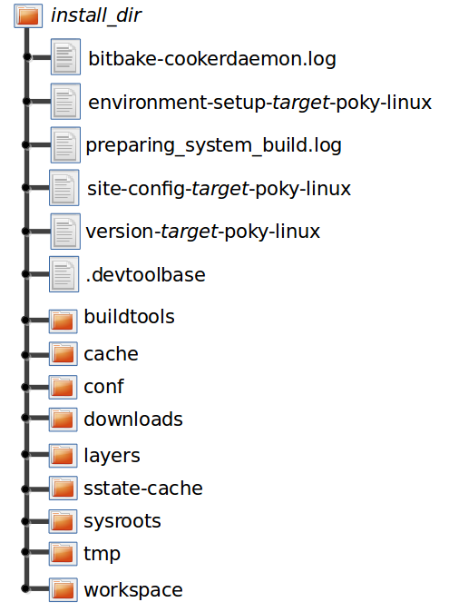

.. SPDX-License-Identifier: CC-BY-SA-2.0-UK

*****************
Obtaining the SDK
*****************

.. _sdk-locating-pre-built-sdk-installers:

Locating Pre-Built SDK Installers
=================================

You can use existing, pre-built toolchains by locating and running an
SDK installer script that ships with the Yocto Project. Using this
method, you select and download an architecture-specific SDK installer
and then run the script to hand-install the toolchain.

Follow these steps to locate and hand-install the toolchain:

1. *Go to the Installers Directory:* Go to
   :yocto_dl:`/releases/yocto/yocto-3.1.2/toolchain/`

2. *Open the Folder for Your Build Host:* Open the folder that matches
   your :term:`Build Host` (i.e.
   ``i686`` for 32-bit machines or ``x86_64`` for 64-bit machines).

3. *Locate and Download the SDK Installer:* You need to find and
   download the installer appropriate for your build host, target
   hardware, and image type.

   The installer files (``*.sh``) follow this naming convention:
   ::

      poky-glibc-host_system-core-image-type-arch-toolchain[-ext]-release.sh

      Where:
          host_system is a string representing your development system:
                 "i686" or "x86_64"

          type is a string representing the image:
                "sato" or "minimal"

          arch is a string representing the target architecture:
                 "aarch64", "armv5e", "core2-64", "coretexa8hf-neon", "i586", "mips32r2",
                 "mips64", or "ppc7400"

          release is the version of Yocto Project.

          NOTE:
             The standard SDK installer does not have the "-ext" string as
             part of the filename.

   The toolchains provided by the Yocto
   Project are based off of the ``core-image-sato`` and
   ``core-image-minimal`` images and contain libraries appropriate for
   developing against those images.

   For example, if your build host is a 64-bit x86 system and you need
   an extended SDK for a 64-bit core2 target, go into the ``x86_64``
   folder and download the following installer:
   ::

      poky-glibc-x86_64-core-image-sato-core2-64-toolchain-ext-DISTRO.sh

4. *Run the Installer:* Be sure you have execution privileges and run
   the installer. Following is an example from the ``Downloads``
   directory:
   ::

      $ ~/Downloads/poky-glibc-x86_64-core-image-sato-core2-64-toolchain-ext-DISTRO.sh

   During execution of the script, you choose the root location for the
   toolchain. See the "`Installed Standard SDK Directory
   Structure <#sdk-installed-standard-sdk-directory-structure>`__"
   section and the "`Installed Extensible SDK Directory
   Structure <#sdk-installed-extensible-sdk-directory-structure>`__"
   section for more information.

Building an SDK Installer
=========================

As an alternative to locating and downloading an SDK installer, you can
build the SDK installer. Follow these steps:

1. *Set Up the Build Environment:* Be sure you are set up to use BitBake
   in a shell. See the ":ref:`dev-manual/dev-manual-start:preparing the build host`" section
   in the Yocto Project Development Tasks Manual for information on how
   to get a build host ready that is either a native Linux machine or a
   machine that uses CROPS.

2. *Clone the ``poky`` Repository:* You need to have a local copy of the
   Yocto Project :term:`Source Directory`
   (i.e. a local
   ``poky`` repository). See the ":ref:`dev-manual/dev-manual-start:cloning the \`\`poky\`\` repository`" and
   possibly the ":ref:`dev-manual/dev-manual-start:checking out by branch in poky`" and
   ":ref:`checkout-out-by-tag-in-poky`" sections
   all in the Yocto Project Development Tasks Manual for information on
   how to clone the ``poky`` repository and check out the appropriate
   branch for your work.

3. *Initialize the Build Environment:* While in the root directory of
   the Source Directory (i.e. ``poky``), run the
   :ref:`structure-core-script` environment
   setup script to define the OpenEmbedded build environment on your
   build host.
   ::

      $ source oe-init-build-env

   Among other things, the script
   creates the :term:`Build Directory`,
   which is
   ``build`` in this case and is located in the Source Directory. After
   the script runs, your current working directory is set to the
   ``build`` directory.

4. *Make Sure You Are Building an Installer for the Correct Machine:*
   Check to be sure that your
   :term:`MACHINE` variable in the
   ``local.conf`` file in your Build Directory matches the architecture
   for which you are building.

5. *Make Sure Your SDK Machine is Correctly Set:* If you are building a
   toolchain designed to run on an architecture that differs from your
   current development host machine (i.e. the build host), be sure that
   the :term:`SDKMACHINE` variable
   in the ``local.conf`` file in your Build Directory is correctly set.

   .. note::

      If you are building an SDK installer for the Extensible SDK, the
      SDKMACHINE
      value must be set for the architecture of the machine you are
      using to build the installer. If
      SDKMACHINE
      is not set appropriately, the build fails and provides an error
      message similar to the following:
      ::

              The extensible SDK can currently only be built for the same architecture as the machine being built on - SDK_ARCH is
              set to i686 (likely via setting SDKMACHINE) which is different from the architecture of the build machine (x86_64).
              Unable to continue.

6. *Build the SDK Installer:* To build the SDK installer for a standard
   SDK and populate the SDK image, use the following command form. Be
   sure to replace image with an image (e.g. "core-image-sato"): $
   bitbake image -c populate_sdk You can do the same for the extensible
   SDK using this command form:
   ::

      $ bitbake image -c populate_sdk_ext

   These commands produce an SDK installer that contains the sysroot
   that matches your target root filesystem.

   When the ``bitbake`` command completes, the SDK installer will be in
   ``tmp/deploy/sdk`` in the Build Directory.

   .. note::

      -  By default, the previous BitBake command does not build static
         binaries. If you want to use the toolchain to build these types
         of libraries, you need to be sure your SDK has the appropriate
         static development libraries. Use the
         :term:`TOOLCHAIN_TARGET_TASK`
         variable inside your ``local.conf`` file before building the
         SDK installer. Doing so ensures that the eventual SDK
         installation process installs the appropriate library packages
         as part of the SDK. Following is an example using ``libc``
         static development libraries: TOOLCHAIN_TARGET_TASK_append = "
         libc-staticdev"

7. *Run the Installer:* You can now run the SDK installer from
   ``tmp/deploy/sdk`` in the Build Directory. Following is an example:
   ::

      $ cd ~/poky/build/tmp/deploy/sdk
      $ ./poky-glibc-x86_64-core-image-sato-core2-64-toolchain-ext-DISTRO.sh

   During execution of the script, you choose the root location for the
   toolchain. See the "`Installed Standard SDK Directory
   Structure <#sdk-installed-standard-sdk-directory-structure>`__"
   section and the "`Installed Extensible SDK Directory
   Structure <#sdk-installed-extensible-sdk-directory-structure>`__"
   section for more information.

Extracting the Root Filesystem
==============================

After installing the toolchain, for some use cases you might need to
separately extract a root filesystem:

-  You want to boot the image using NFS.

-  You want to use the root filesystem as the target sysroot.

-  You want to develop your target application using the root filesystem
   as the target sysroot.

Follow these steps to extract the root filesystem:

1. *Locate and Download the Tarball for the Pre-Built Root Filesystem
   Image File:* You need to find and download the root filesystem image
   file that is appropriate for your target system. These files are kept
   in machine-specific folders in the
   :yocto_dl:`Index of Releases </releases/yocto/yocto-3.1.2/machines/>`
   in the "machines" directory.

   The machine-specific folders of the "machines" directory contain
   tarballs (``*.tar.bz2``) for supported machines. These directories
   also contain flattened root filesystem image files (``*.ext4``),
   which you can use with QEMU directly.

   The pre-built root filesystem image files follow these naming
   conventions:
   ::

      core-image-profile-arch.tar.bz2

      Where:
          profile is the filesystem image's profile:
                    lsb, lsb-dev, lsb-sdk, minimal, minimal-dev, minimal-initramfs,
                    sato, sato-dev, sato-sdk, sato-sdk-ptest. For information on
                    these types of image profiles, see the "Images" chapter in
                    the Yocto Project Reference Manual.

          arch is a string representing the target architecture:
                    beaglebone-yocto, beaglebone-yocto-lsb, edgerouter, edgerouter-lsb,
                    genericx86, genericx86-64, genericx86-64-lsb, genericx86-lsb and qemu*.

   The root filesystems
   provided by the Yocto Project are based off of the
   ``core-image-sato`` and ``core-image-minimal`` images.

   For example, if you plan on using a BeagleBone device as your target
   hardware and your image is a ``core-image-sato-sdk`` image, you can
   download the following file:
   ::

      core-image-sato-sdk-beaglebone-yocto.tar.bz2

2. *Initialize the Cross-Development Environment:* You must ``source``
   the cross-development environment setup script to establish necessary
   environment variables.

   This script is located in the top-level directory in which you
   installed the toolchain (e.g. ``poky_sdk``).

   Following is an example based on the toolchain installed in the
   ":ref:`sdk-locating-pre-built-sdk-installers`" section:
   ::

      $ source ~/poky_sdk/environment-setup-core2-64-poky-linux

3. *Extract the Root Filesystem:* Use the ``runqemu-extract-sdk``
   command and provide the root filesystem image.

   Following is an example command that extracts the root filesystem
   from a previously built root filesystem image that was downloaded
   from the :yocto_dl:`Index of Releases </releases/yocto/yocto-3.1.2/machines/>`.
   This command extracts the root filesystem into the ``core2-64-sato``
   directory:
   ::

      $ runqemu-extract-sdk ~/Downloads/core-image-sato-sdk-beaglebone-yocto.tar.bz2 ~/beaglebone-sato

   You could now point to the target sysroot at ``beablebone-sato``.

Installed Standard SDK Directory Structure
==========================================

The following figure shows the resulting directory structure after you
install the Standard SDK by running the ``*.sh`` SDK installation
script:

.. image:: figures/sdk-installed-standard-sdk-directory.png
   :scale: 80%
   :align: center

The installed SDK consists of an environment setup script for the SDK, a
configuration file for the target, a version file for the target, and
the root filesystem (``sysroots``) needed to develop objects for the
target system.

Within the figure, italicized text is used to indicate replaceable
portions of the file or directory name. For example, install_dir/version
is the directory where the SDK is installed. By default, this directory
is ``/opt/poky/``. And, version represents the specific snapshot of the
SDK (e.g. 3.1.2). Furthermore, target represents the target architecture
(e.g. ``i586``) and host represents the development system's
architecture (e.g. ``x86_64``). Thus, the complete names of the two
directories within the ``sysroots`` could be ``i586-poky-linux`` and
``x86_64-pokysdk-linux`` for the target and host, respectively.

Installed Extensible SDK Directory Structure
============================================

The following figure shows the resulting directory structure after you
install the Extensible SDK by running the ``*.sh`` SDK installation
script:

The installed directory structure for the extensible SDK is quite
different than the installed structure for the standard SDK. The
extensible SDK does not separate host and target parts in the same
manner as does the standard SDK. The extensible SDK uses an embedded
copy of the OpenEmbedded build system, which has its own sysroots.

Of note in the directory structure are an environment setup script for
the SDK, a configuration file for the target, a version file for the
target, and log files for the OpenEmbedded build system preparation
script run by the installer and BitBake.

Within the figure, italicized text is used to indicate replaceable
portions of the file or directory name. For example, install_dir is the
directory where the SDK is installed, which is ``poky_sdk`` by default,
and target represents the target architecture (e.g. ``i586``).
