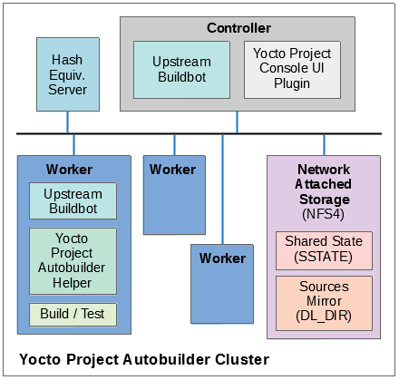

.. SPDX-License-Identifier: CC-BY-SA-2.0-UK

*****************************************
The Yocto Project Test Environment Manual
*****************************************

Welcome
=======

Welcome to the Yocto Project Test Environment Manual! This manual is a
work in progress. The manual contains information about the testing
environment used by the Yocto Project to make sure each major and minor
release works as intended. All the project's testing infrastructure and
processes are publicly visible and available so that the community can
see what testing is being performed, how it's being done and the current
status of the tests and the project at any given time. It is intended
that other organizations can leverage off the process and testing
environment used by the Yocto Project to create their own automated,
production test environment, building upon the foundations from the
project core.

This manual is a work-in-progress and is being initially loaded with
information from the README files and notes from key engineers:

-  *yocto-autobuilder2:* This
   :yocto_git:`README.md </yocto-autobuilder2/tree/README.md>`
   is the main README which details how to set up the Yocto Project
   Autobuilder. The ``yocto-autobuilder2`` repository represents the
   Yocto Project's console UI plugin to Buildbot and the configuration
   necessary to configure Buildbot to perform the testing the project
   requires.

-  *yocto-autobuilder-helper:* This :yocto_git:`README </yocto-autobuilder-helper/tree/README/>`
   and repository contains Yocto Project Autobuilder Helper scripts and
   configuration. The ``yocto-autobuilder-helper`` repository contains
   the "glue" logic that defines which tests to run and how to run them.
   As a result, it can be used by any Continuous Improvement (CI) system
   to run builds, support getting the correct code revisions, configure
   builds and layers, run builds, and collect results. The code is
   independent of any CI system, which means the code can work `Buildbot <https://docs.buildbot.net/current/>`__,
   Jenkins, or others. This repository has a branch per release of the
   project defining the tests to run on a per release basis.

Yocto Project Autobuilder Overview
==================================

The Yocto Project Autobuilder collectively refers to the software,
tools, scripts, and procedures used by the Yocto Project to test
released software across supported hardware in an automated and regular
fashion. Basically, during the development of a Yocto Project release,
the Autobuilder tests if things work. The Autobuilder builds all test
targets and runs all the tests.

The Yocto Project uses now uses standard upstream
Buildbot (`version 3.8 <https://docs.buildbot.net/3.8.0/>`__) to
drive its integration and testing. Buildbot has a plug-in interface
that the Yocto Project customizes using code from the
``yocto-autobuilder2`` repository, adding its own console UI plugin. The
resulting UI plug-in allows you to visualize builds in a way suited to
the project's needs.

A ``helper`` layer provides configuration and job management through
scripts found in the ``yocto-autobuilder-helper`` repository. The
``helper`` layer contains the bulk of the build configuration
information and is release-specific, which makes it highly customizable
on a per-project basis. The layer is CI system-agnostic and contains a
number of Helper scripts that can generate build configurations from
simple JSON files.

.. note::

   The project uses Buildbot for historical reasons but also because
   many of the project developers have knowledge of Python. It is
   possible to use the outer layers from another Continuous Integration
   (CI) system such as :wikipedia:`Jenkins <Jenkins_(software)>`
   instead of Buildbot.

The following figure shows the Yocto Project Autobuilder stack with a
topology that includes a controller and a cluster of workers:

Yocto Project Tests --- Types of Testing Overview
=================================================

The Autobuilder tests different elements of the project by using
the following types of tests:

-  *Build Testing:* Tests whether specific configurations build by
   varying :term:`MACHINE`,
   :term:`DISTRO`, other configuration
   options, and the specific target images being built (or ``world``). This is
   used to trigger builds of all the different test configurations on the
   Autobuilder. Builds usually cover many different targets for
   different architectures, machines, and distributions, as well as
   different configurations, such as different init systems. The
   Autobuilder tests literally hundreds of configurations and targets.

   -  *Sanity Checks During the Build Process:* Tests initiated through the
      :ref:`ref-classes-insane` class. These checks ensure the output of the
      builds are correct. For example, does the ELF architecture in the
      generated binaries match the target system? ARM binaries would not work
      in a MIPS system!

-  *Build Performance Testing:* Tests whether or not commonly used steps
   during builds work efficiently and avoid regressions. Tests to time
   commonly used usage scenarios are run through ``oe-build-perf-test``.
   These tests are run on isolated machines so that the time
   measurements of the tests are accurate and no other processes
   interfere with the timing results. The project currently tests
   performance on two different distributions, Fedora and Ubuntu, to
   ensure we have no single point of failure and can ensure the
   different distros work effectively.

-  *eSDK Testing:* Image tests initiated through the following command::

      $ bitbake image -c testsdkext

   The tests use the :ref:`ref-classes-testsdk` class and the
   ``do_testsdkext`` task.

-  *Feature Testing:* Various scenario-based tests are run through the
   :ref:`OpenEmbedded Self test (oe-selftest) <ref-manual/release-process:Testing and Quality Assurance>`. We test oe-selftest on each of the main distributions
   we support.

-  *Image Testing:* Image tests initiated through the following command::

      $ bitbake image -c testimage

   The tests use the :ref:`ref-classes-testimage`
   class and the :ref:`ref-tasks-testimage` task.

-  *Layer Testing:* The Autobuilder has the possibility to test whether
   specific layers work with the test of the system. The layers tested
   may be selected by members of the project. Some key community layers
   are also tested periodically.

-  *Package Testing:* A Package Test (ptest) runs tests against packages
   built by the OpenEmbedded build system on the target machine. See the
   :ref:`Testing Packages With
   ptest <dev-manual/packages:Testing Packages With ptest>` section
   in the Yocto Project Development Tasks Manual and the
   ":yocto_wiki:`Ptest </Ptest>`" Wiki page for more
   information on Ptest.

-  *SDK Testing:* Image tests initiated through the following command::

      $ bitbake image -c testsdk

   The tests use the :ref:`ref-classes-testsdk` class and
   the ``do_testsdk`` task.

-  *Unit Testing:* Unit tests on various components of the system run
   through :ref:`bitbake-selftest <ref-manual/release-process:Testing and Quality Assurance>` and
   :ref:`oe-selftest <ref-manual/release-process:Testing and Quality Assurance>`.

-  *Automatic Upgrade Helper:* This target tests whether new versions of
   software are available and whether we can automatically upgrade to
   those new versions. If so, this target emails the maintainers with a
   patch to let them know this is possible.

How Tests Map to Areas of Code
==============================

Tests map into the codebase as follows:

-  *bitbake-selftest:*

   These tests are self-contained and test BitBake as well as its APIs,
   which include the fetchers. The tests are located in
   ``bitbake/lib/*/tests``.

   Some of these tests run the ``bitbake`` command, so ``bitbake/bin``
   must be added to the ``PATH`` before running ``bitbake-selftest``.
   From within the BitBake repository, run the following::

      $ export PATH=$PWD/bin:$PATH

   After that, you can run the selftest script::

      $ bitbake-selftest

   The default output is quiet and just prints a summary of what was
   run. To see more information, there is a verbose option::

      $ bitbake-selftest -v

   To skip tests that access the Internet, use the ``BB_SKIP_NETTESTS``
   variable when running ``bitbake-selftest`` as follows::

      $ BB_SKIP_NETTESTS=yes bitbake-selftest

   Use this option when you wish to skip tests that access the network,
   which are mostly necessary to test the fetcher modules. To specify
   individual test modules to run, append the test module name to the
   ``bitbake-selftest`` command. For example, to specify the tests for
   ``bb.tests.data.DataExpansions``, run::

      $ bitbake-selftest bb.tests.data.DataExpansions

   You can also specify individual tests by defining the full name and module
   plus the class path of the test, for example::

      $ bitbake-selftest bb.tests.data.DataExpansions.test_one_var

   The tests are based on
   `Python unittest <https://docs.python.org/3/library/unittest.html>`__.

-  *oe-selftest:*

   -  These tests use OE to test the workflows, which include testing
      specific features, behaviors of tasks, and API unit tests.

   -  The tests can take advantage of parallelism through the ``-j``
      option, which can specify a number of threads to spread the tests
      across. Note that all tests from a given class of tests will run
      in the same thread. To parallelize large numbers of tests you can
      split the class into multiple units.

   -  The tests are based on
      `Python unittest <https://docs.python.org/3/library/unittest.html>`__.

   -  The code for the tests resides in
      ``meta/lib/oeqa/selftest/cases/``.

   -  To run all the tests, enter the following command::

         $ oe-selftest -a

   -  To run a specific test, use the following command form where
      ``testname`` is the name of the specific test::

         $ oe-selftest -r <testname>

      For example, the following command would run the ``tinfoil``
      ``getVar`` API test::

         $ oe-selftest -r tinfoil.TinfoilTests.test_getvar

      It is also possible to run a set
      of tests. For example the following command will run all of the
      ``tinfoil`` tests::

         $ oe-selftest -r tinfoil

-  *testimage:*

   -  These tests build an image, boot it, and run tests against the
      image's content.

   -  The code for these tests resides in ``meta/lib/oeqa/runtime/cases/``.

   -  You need to set the :term:`IMAGE_CLASSES` variable as follows::

         IMAGE_CLASSES += "testimage"

   -  Run the tests using the following command form::

         $ bitbake image -c testimage

-  *testsdk:*

   -  These tests build an SDK, install it, and then run tests against
      that SDK.

   -  The code for these tests resides in ``meta/lib/oeqa/sdk/cases/``.

   -  Run the test using the following command form::

         $ bitbake image -c testsdk

-  *testsdk_ext:*

   -  These tests build an extended SDK (eSDK), install that eSDK, and
      run tests against the eSDK.

   -  The code for these tests resides in ``meta/lib/oeqa/sdkext/cases/``.

   -  To run the tests, use the following command form::

         $ bitbake image -c testsdkext

-  *oe-build-perf-test:*

   -  These tests run through commonly used usage scenarios and measure
      the performance times.

   -  The code for these tests resides in ``meta/lib/oeqa/buildperf``.

   -  To run the tests, use the following command form::

         $ oe-build-perf-test <options>

      The command takes a number of options,
      such as where to place the test results. The Autobuilder Helper
      Scripts include the ``build-perf-test-wrapper`` script with
      examples of how to use the oe-build-perf-test from the command
      line.

      Use the ``oe-git-archive`` command to store test results into a
      Git repository.

      Use the ``oe-build-perf-report`` command to generate text reports
      and HTML reports with graphs of the performance data. See
      :yocto_dl:`html </releases/yocto/yocto-4.3/testresults/buildperf-debian11/perf-debian11_nanbield_20231019191258_15b576c410.html>`
      and
      :yocto_dl:`txt </releases/yocto/yocto-4.3/testresults/buildperf-debian11/perf-debian11_nanbield_20231019191258_15b576c410.txt>`
      examples.

   -  The tests are contained in ``meta/lib/oeqa/buildperf/test_basic.py``.

Test Examples
=============

This section provides example tests for each of the tests listed in the
:ref:`test-manual/intro:How Tests Map to Areas of Code` section.

-  ``oe-selftest`` testcases reside in the ``meta/lib/oeqa/selftest/cases`` directory.

-  ``bitbake-selftest`` testcases reside in the ``bitbake/lib/bb/tests/`` directory.

``bitbake-selftest``
--------------------

A simple test example from ``bitbake/lib/bb/tests/data.py`` is::

   class DataExpansions(unittest.TestCase):
      def setUp(self):
            self.d = bb.data.init()
            self.d["foo"] = "value_of_foo"
            self.d["bar"] = "value_of_bar"
            self.d["value_of_foo"] = "value_of_'value_of_foo'"

      def test_one_var(self):
            val = self.d.expand("${foo}")
            self.assertEqual(str(val), "value_of_foo")

In this example, a ``DataExpansions`` class of tests is created, derived from
standard `Python unittest <https://docs.python.org/3/library/unittest.html>`__.
The class has a common ``setUp`` function which is shared by all the tests in
the class. A simple test is then added to test that when a variable is
expanded, the correct value is found.

BitBake selftests are straightforward
`Python unittest <https://docs.python.org/3/library/unittest.html>`__.
Refer to the `Python unittest documentation
<https://docs.python.org/3/library/unittest.html>`__ for additional information
on writing such tests.

``oe-selftest``
---------------

These tests are more complex due to the setup required behind the scenes
for full builds. Rather than directly using `Python unittest
<https://docs.python.org/3/library/unittest.html>`__, the code
wraps most of the standard objects. The tests can be simple, such as
testing a command from within the OE build environment using the
following example::

   class BitbakeLayers(OESelftestTestCase):
      def test_bitbakelayers_showcrossdepends(self):
            result = runCmd('bitbake-layers show-cross-depends')
            self.assertTrue('aspell' in result.output, msg = "No dependencies were shown. bitbake-layers show-cross-depends output: %s"% result.output)

This example, taken from ``meta/lib/oeqa/selftest/cases/bblayers.py``,
creates a testcase from the ``OESelftestTestCase`` class, derived
from ``unittest.TestCase``, which runs the ``bitbake-layers`` command
and checks the output to ensure it contains something we know should be
here.

The ``oeqa.utils.commands`` module contains Helpers which can assist
with common tasks, including:

-  *Obtaining the value of a bitbake variable:* Use
   ``oeqa.utils.commands.get_bb_var()`` or use
   ``oeqa.utils.commands.get_bb_vars()`` for more than one variable

-  *Running a bitbake invocation for a build:* Use
   ``oeqa.utils.commands.bitbake()``

-  *Running a command:* Use ``oeqa.utils.commandsrunCmd()``

There is also a ``oeqa.utils.commands.runqemu()`` function for launching
the ``runqemu`` command for testing things within a running, virtualized
image.

You can run these tests in parallel. Parallelism works per test class,
so tests within a given test class should always run in the same build,
while tests in different classes or modules may be split into different
builds. There is no data store available for these tests since the tests
launch the ``bitbake`` command and exist outside of its context. As a
result, common BitBake library functions (``bb.\*``) are also unavailable.

``testimage``
-------------

These tests are run once an image is up and running, either on target
hardware or under QEMU. As a result, they are assumed to be running in a
target image environment, as opposed to in a host build environment. A
simple example from ``meta/lib/oeqa/runtime/cases/python.py`` contains
the following::

   class PythonTest(OERuntimeTestCase):
      @OETestDepends(['ssh.SSHTest.test_ssh'])
      @OEHasPackage(['python3-core'])
      def test_python3(self):
         cmd = "python3 -c \\"import codecs; print(codecs.encode('Uryyb, jbeyq', 'rot13'))\""
         status, output = self.target.run(cmd)
         msg = 'Exit status was not 0. Output: %s' % output
         self.assertEqual(status, 0, msg=msg)

In this example, the ``OERuntimeTestCase`` class wraps
``unittest.TestCase``. Within the test, ``self.target`` represents the
target system, where commands can be run using the ``run()``
method.

To ensure certain tests or package dependencies are met, you can use the
``OETestDepends`` and ``OEHasPackage`` decorators. For example, the test
in this example would only make sense if ``python3-core`` is installed in
the image.

``testsdk_ext``
---------------

These tests are run against built extensible SDKs (eSDKs). The tests can
assume that the eSDK environment has already been set up. An example from
``meta/lib/oeqa/sdk/cases/devtool.py`` contains the following::

   class DevtoolTest(OESDKExtTestCase):
      @classmethod def setUpClass(cls):
         myapp_src = os.path.join(cls.tc.esdk_files_dir, "myapp")
         cls.myapp_dst = os.path.join(cls.tc.sdk_dir, "myapp")
         shutil.copytree(myapp_src, cls.myapp_dst)
         subprocess.check_output(['git', 'init', '.'], cwd=cls.myapp_dst)
         subprocess.check_output(['git', 'add', '.'], cwd=cls.myapp_dst)
         subprocess.check_output(['git', 'commit', '-m', "'test commit'"], cwd=cls.myapp_dst)

      @classmethod
      def tearDownClass(cls):
         shutil.rmtree(cls.myapp_dst)
      def _test_devtool_build(self, directory):
         self._run('devtool add myapp %s' % directory)
         try:
         self._run('devtool build myapp')
         finally:
         self._run('devtool reset myapp')
      def test_devtool_build_make(self):
         self._test_devtool_build(self.myapp_dst)

In this example, the ``devtool``
command is tested to see whether a sample application can be built with
the ``devtool build`` command within the eSDK.

``testsdk``
-----------

These tests are run against built SDKs. The tests can assume that an SDK
has already been extracted and its environment file has been sourced. A
simple example from ``meta/lib/oeqa/sdk/cases/python2.py`` contains the
following::

   class Python3Test(OESDKTestCase):
      def setUp(self):
            if not (self.tc.hasHostPackage("nativesdk-python3-core") or
                  self.tc.hasHostPackage("python3-core-native")):
               raise unittest.SkipTest("No python3 package in the SDK")

      def test_python3(self):
            cmd = "python3 -c \\"import codecs; print(codecs.encode('Uryyb, jbeyq', 'rot13'))\""
            output = self._run(cmd)
            self.assertEqual(output, "Hello, world\n")

In this example, if ``nativesdk-python3-core`` has been installed into the SDK,
the code runs the ``python3`` interpreter with a basic command to check it is
working correctly. The test would only run if Python3 is installed in the SDK.

``oe-build-perf-test``
----------------------

The performance tests usually measure how long operations take and the
resource utilization as that happens. An example from
``meta/lib/oeqa/buildperf/test_basic.py`` contains the following::

   class Test3(BuildPerfTestCase):
      def test3(self):
            """Bitbake parsing (bitbake -p)"""
            # Drop all caches and parse
            self.rm_cache()
            oe.path.remove(os.path.join(self.bb_vars['TMPDIR'], 'cache'), True)
            self.measure_cmd_resources(['bitbake', '-p'], 'parse_1',
                     'bitbake -p (no caches)')
            # Drop tmp/cache
            oe.path.remove(os.path.join(self.bb_vars['TMPDIR'], 'cache'), True)
            self.measure_cmd_resources(['bitbake', '-p'], 'parse_2',
                     'bitbake -p (no tmp/cache)')
            # Parse with fully cached data
            self.measure_cmd_resources(['bitbake', '-p'], 'parse_3',
                     'bitbake -p (cached)')

This example shows how three specific parsing timings are
measured, with and without various caches, to show how BitBake's parsing
performance trends over time.

Considerations When Writing Tests
=================================

When writing good tests, there are several things to keep in mind. Since
things running on the Autobuilder are accessed concurrently by multiple
workers, consider the following:

**Running "cleanall" is not permitted.**

This can delete files from :term:`DL_DIR` which would potentially break other
builds running in parallel. If this is required, :term:`DL_DIR` must be set to
an isolated directory.

**Running "cleansstate" is not permitted.**

This can delete files from :term:`SSTATE_DIR` which would potentially break
other builds running in parallel. If this is required, :term:`SSTATE_DIR` must
be set to an isolated directory. Alternatively, you can use the ``-f``
option with the ``bitbake`` command to "taint" tasks by changing the
sstate checksums to ensure sstate cache items will not be reused.

**Tests should not change the metadata.**

This is particularly true for oe-selftests since these can run in
parallel and changing metadata leads to changing checksums, which
confuses BitBake while running in parallel. If this is necessary, copy
layers to a temporary location and modify them. Some tests need to
change metadata, such as the devtool tests. To protect the metadata from
changes, set up temporary copies of that data first.
