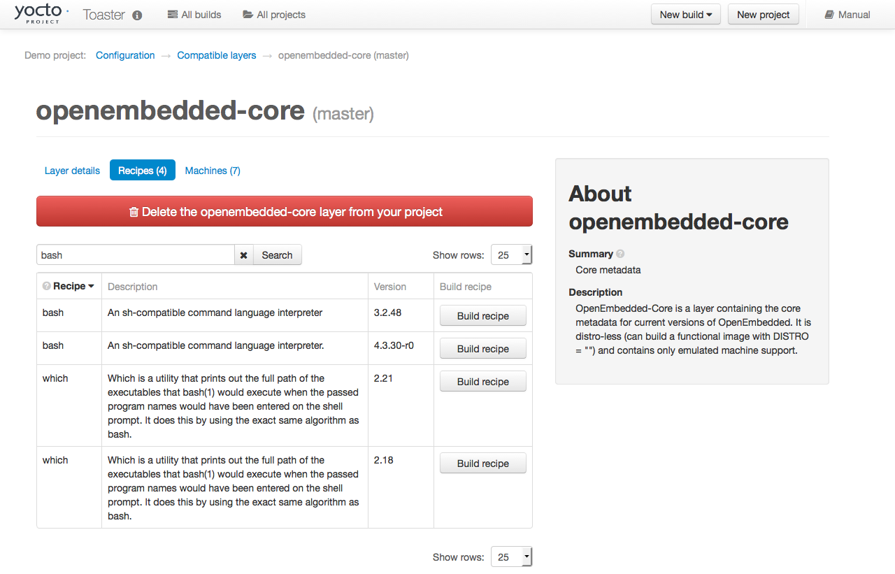

.. SPDX-License-Identifier: CC-BY-SA-2.0-UK
.. Set default pygment highlighting to 'shell' for this document
.. highlight:: shell

****************************
Setting Up and Using Toaster
****************************

Starting Toaster for Local Development
======================================

Once you have set up the Yocto Project and installed the Toaster system
dependencies as described in the ":ref:`toaster-manual/start:Preparing to Use
Toaster`" chapter, you are ready to start
Toaster.

Navigate to the root of your
:term:`Source Directory` (e.g. ``poky``)::

   $ cd poky

Once in that directory, source the build environment script::

   $ source oe-init-build-env

Next, from the build directory (e.g.
``poky/build``), start Toaster using this command::

   $ source toaster start

You can now run your builds from the command line, or with Toaster
as explained in section
":ref:`toaster-manual/setup-and-use:using the toaster web interface`".

To access the Toaster web interface, open your favorite browser and
enter the following::

   http://127.0.0.1:8000

Setting a Different Port
========================

By default, Toaster starts on port 8000. You can use the ``WEBPORT``
parameter to set a different port. For example, the following command
sets the port to "8400"::

   $ source toaster start webport=8400

Setting Up Toaster Without a Web Server
=======================================

You can start a Toaster environment without starting its web server.
This is useful for the following:

-  Capturing a command-line build's statistics into the Toaster database
   for examination later.

-  Capturing a command-line build's statistics when the Toaster server
   is already running.

-  Having one instance of the Toaster web server track and capture
   multiple command-line builds, where each build is started in its own
   "noweb" Toaster environment.

The following commands show how to start a Toaster environment without
starting its web server, perform BitBake operations, and then shut down
the Toaster environment. Once the build is complete, you can close the
Toaster environment. Before closing the environment, however, you should
allow a few minutes to ensure the complete transfer of its BitBake build
statistics to the Toaster database. If you have a separate Toaster web
server instance running, you can watch this command-line build's
progress and examine the results as soon as they are posted::

   $ source toaster start noweb
   $ bitbake target
   $ source toaster stop

Setting Up Toaster Without a Build Server
=========================================

You can start a Toaster environment with the "New Projects" feature
disabled. Doing so is useful for the following:

-  Sharing your build results over the web server while blocking others
   from starting builds on your host.

-  Allowing only local command-line builds to be captured into the
   Toaster database.

Use the following command to set up Toaster without a build server::

   $ source toaster start nobuild webport=port

Setting up External Access
==========================

By default, Toaster binds to the loop back address (i.e. ``localhost``),
which does not allow access from external hosts. To allow external
access, use the ``WEBPORT`` parameter to open an address that connects
to the network, specifically the IP address that your NIC uses to
connect to the network. You can also bind to all IP addresses the
computer supports by using the shortcut "0.0.0.0:port".

The following example binds to all IP addresses on the host::

   $ source toaster start webport=0.0.0.0:8400

This example binds to a specific IP address on the host's NIC::

   $ source toaster start webport=192.168.1.1:8400

The Directory for Cloning Layers
================================

Toaster creates a ``_toaster_clones`` directory inside your Source
Directory (i.e. ``poky``) to clone any layers needed for your builds.

Alternatively, if you would like all of your Toaster related files and
directories to be in a particular location other than the default, you
can set the ``TOASTER_DIR`` environment variable, which takes precedence
over your current working directory. Setting this environment variable
causes Toaster to create and use ``$TOASTER_DIR./_toaster_clones``.

The Build Directory
===================

Toaster creates a build directory within your Source Directory (e.g.
``poky``) to execute the builds.

Alternatively, if you would like all of your Toaster related files and
directories to be in a particular location, you can set the
``TOASTER_DIR`` environment variable, which takes precedence over your
current working directory. Setting this environment variable causes
Toaster to use ``$TOASTER_DIR/build`` as the build directory.

Creating a Django Superuser
===========================

Toaster is built on the `Django
framework <https://www.djangoproject.com/>`__. Django provides an
administration interface you can use to edit Toaster configuration
parameters.

To access the Django administration interface, you must create a
superuser by following these steps:

#. If you used ``pip3``, which is recommended, to set up the Toaster
   system dependencies, you need be sure the local user path is in your
   ``PATH`` list. To append the pip3 local user path, use the following
   command::

      $ export PATH=$PATH:$HOME/.local/bin

#. From the directory containing the Toaster database, which by default
   is the :term:`Build Directory`,
   invoke the ``createsuperuser`` command from ``manage.py``::

      $ cd ~/poky/build
      $ ../bitbake/lib/toaster/manage.py createsuperuser

#. Django prompts you for the username, which you need to provide.

#. Django prompts you for an email address, which is optional.

#. Django prompts you for a password, which you must provide.

#. Django prompts you to re-enter your password for verification.

After completing these steps, the following confirmation message
appears::

   Superuser created successfully.

Creating a superuser allows you to access the Django administration
interface through a browser. The URL for this interface is the same as
the URL used for the Toaster instance with "/admin" on the end. For
example, if you are running Toaster locally, use the following URL::

   http://127.0.0.1:8000/admin

You can use the Django administration interface to set Toaster configuration
parameters such as the build directory, layer sources, default variable
values, and BitBake versions.

Setting Up a Production Instance of Toaster
===========================================

You can use a production instance of Toaster to share the Toaster
instance with remote users, multiple users, or both. The production
instance is also the setup that can handle heavier loads on the web
service. Use the instructions in the following sections to set up
Toaster to run builds through the Toaster web interface.

Requirements
------------

Be sure you meet the following requirements:

.. note::

   You must comply with all Apache, ``mod-wsgi``, and Mysql requirements.

-  Have all the build requirements as described in the ":ref:`toaster-manual/start:Preparing to
   Use Toaster`" chapter.

-  Have an Apache webserver.

-  Have ``mod-wsgi`` for the Apache webserver.

-  Use the Mysql database server.

-  If you are using Ubuntu, run the following::

      $ sudo apt-get install apache2 libapache2-mod-wsgi-py3 mysql-server python3-pip libmysqlclient-dev

-  If you are using Fedora or a RedHat distribution, run the
   following::

      $ sudo dnf install httpd python3-mod_wsgi python3-pip mariadb-server mariadb-devel python3-devel

-  If you are using openSUSE, run the following::

      $ sudo zypper install apache2 apache2-mod_wsgi-python3 python3-pip mariadb mariadb-client python3-devel

Installation
------------

Perform the following steps to install Toaster:

#.  Create toaster user and set its home directory to
    ``/var/www/toaster``::

      $ sudo /usr/sbin/useradd toaster -md /var/www/toaster -s /bin/false
      $ sudo su - toaster -s /bin/bash

#.  Checkout a copy of ``poky`` into the web server directory. You will
    be using ``/var/www/toaster``::

      $ git clone git://git.yoctoproject.org/poky
      $ git checkout &DISTRO_NAME_NO_CAP;

#.  Install Toaster dependencies using the --user flag which keeps the
    Python packages isolated from your system-provided packages::

      $ cd /var/www/toaster/
      $ pip3 install --user -r ./poky/bitbake/toaster-requirements.txt
      $ pip3 install --user mysqlclient

    .. note::

       Isolating these packages is not required but is recommended.
       Alternatively, you can use your operating system's package
       manager to install the packages.

#.  Configure Toaster by editing
    ``/var/www/toaster/poky/bitbake/lib/toaster/toastermain/settings.py``
    as follows:

    -  Edit the
       `DATABASES <https://docs.djangoproject.com/en/2.2/ref/settings/#databases>`__
       settings:

       .. code-block:: python

         DATABASES = {
            'default': {
               'ENGINE': 'django.db.backends.mysql',
               'NAME': 'toaster_data',
               'USER': 'toaster',
               'PASSWORD': 'yourpasswordhere',
               'HOST': 'localhost',
               'PORT': '3306',
            }
         }

    -  Edit the
       `SECRET_KEY <https://docs.djangoproject.com/en/2.2/ref/settings/#std:setting-SECRET_KEY>`__:

       .. code-block:: python

         SECRET_KEY = 'your_secret_key'

    -  Edit the
       `STATIC_ROOT <https://docs.djangoproject.com/en/2.2/ref/settings/#std:setting-STATIC_ROOT>`__:

      .. code-block:: python

         STATIC_ROOT = '/var/www/toaster/static_files/'

#.  Add the database and user to the ``mysql`` server defined earlier::

      $ mysql -u root -p
      mysql> CREATE DATABASE toaster_data;
      mysql> CREATE USER 'toaster'@'localhost' identified by 'yourpasswordhere';
      mysql> GRANT all on toaster_data.\* to 'toaster'@'localhost';
      mysql> quit

#.  Get Toaster to create the database schema, default data, and gather
    the statically-served files::

      $ cd /var/www/toaster/poky/
      $ ./bitbake/lib/toaster/manage.py migrate
      $ TOASTER_DIR=`pwd\` TEMPLATECONF='poky' \
         ./bitbake/lib/toaster/manage.py checksettings
      $ ./bitbake/lib/toaster/manage.py collectstatic

    In the previous
    example, from the ``poky`` directory, the ``migrate`` command
    ensures the database schema changes have propagated correctly (i.e.
    migrations). The next line sets the Toaster root directory
    ``TOASTER_DIR`` and the location of the Toaster configuration file
    ``TOASTER_CONF``, which is relative to ``TOASTER_DIR``. The
    ``TEMPLATECONF`` value reflects the contents of
    ``poky/.templateconf``, and by default, should include the string
    "poky". For more information on the Toaster configuration file, see
    the ":ref:`toaster-manual/reference:Configuring Toaster`" section.

    This line also runs the ``checksettings`` command, which configures
    the location of the Toaster :term:`Build Directory`.
    The Toaster
    root directory ``TOASTER_DIR`` determines where the Toaster build
    directory is created on the file system. In the example above,
    ``TOASTER_DIR`` is set as follows::

       /var/www/toaster/poky

    This setting causes the Toaster build directory to be::

       /var/www/toaster/poky/build

    Finally, the ``collectstatic`` command is a Django framework command
    that collects all the statically served files into a designated
    directory to be served up by the Apache web server as defined by
    ``STATIC_ROOT``.

#.  Test and/or use the Mysql integration with Toaster's Django web
    server. At this point, you can start up the normal Toaster Django
    web server with the Toaster database in Mysql. You can use this web
    server to confirm that the database migration and data population
    from the Layer Index is complete.

    To start the default Toaster Django web server with the Toaster
    database now in Mysql, use the standard start commands::

      $ source oe-init-build-env
      $ source toaster start

    Additionally, if Django is sufficient for your requirements, you can use
    it for your release system and migrate later to Apache as your
    requirements change.

#.  Add an Apache configuration file for Toaster to your Apache web
    server's configuration directory. If you are using Ubuntu or Debian,
    put the file here::

      /etc/apache2/conf-available/toaster.conf

    If you are using Fedora or RedHat, put it here::

      /etc/httpd/conf.d/toaster.conf

    If you are using OpenSUSE, put it here::

      /etc/apache2/conf.d/toaster.conf

    Following is a sample Apache configuration for Toaster you can follow:

    .. code-block:: apache

      Alias /static /var/www/toaster/static_files
      <Directory /var/www/toaster/static_files>
         <IfModule mod_access_compat.c>
            Order allow,deny
            Allow from all
         </IfModule>
         <IfModule !mod_access_compat.c>
            Require all granted
         </IfModule>
      </Directory>
    
      <Directory /var/www/toaster/poky/bitbake/lib/toaster/toastermain>
         <Files "wsgi.py">
            Require all granted
         </Files>
      </Directory>
    
      WSGIDaemonProcess toaster_wsgi python-path=/var/www/toaster/poky/bitbake/lib/toaster:/var/www/toaster/.local/lib/python3.4/site-packages
      WSGIScriptAlias / "/var/www/toaster/poky/bitbake/lib/toaster/toastermain/wsgi.py"
      <Location />
         WSGIProcessGroup toaster_wsgi
      </Location>

    If you are using Ubuntu or Debian, you will need to enable the config and
    module for Apache::

      $ sudo a2enmod wsgi
      $ sudo a2enconf toaster
      $ chmod +x bitbake/lib/toaster/toastermain/wsgi.py

    Finally, restart Apache to make sure all new configuration is loaded. For Ubuntu,
    Debian, and OpenSUSE use::

      $ sudo service apache2 restart

    For Fedora and RedHat use::

      $ sudo service httpd restart

#.  Prepare the systemd service to run Toaster builds. Here is a sample
    configuration file for the service:

    .. code-block:: ini

      [Unit]
      Description=Toaster runbuilds
      
      [Service]
      Type=forking User=toaster
      ExecStart=/usr/bin/screen -d -m -S runbuilds /var/www/toaster/poky/bitbake/lib/toaster/runbuilds-service.sh start
      ExecStop=/usr/bin/screen -S runbuilds -X quit
      WorkingDirectory=/var/www/toaster/poky
      
      [Install]
      WantedBy=multi-user.target

    Prepare the ``runbuilds-service.sh`` script that you need to place in the
    ``/var/www/toaster/poky/bitbake/lib/toaster/`` directory by setting
    up executable permissions::

      #!/bin/bash
      
      #export http_proxy=http://proxy.host.com:8080
      #export https_proxy=http://proxy.host.com:8080
      #export GIT_PROXY_COMMAND=$HOME/bin/gitproxy
      cd ~/poky/
      source ./oe-init-build-env build
      source ../bitbake/bin/toaster $1 noweb
      [ "$1" == 'start' ] && /bin/bash

#.  Run the service::

       $ sudo service runbuilds start

    Since the service is running in a detached screen session, you can
    attach to it using this command::

       $ sudo su - toaster
       $ screen -rS runbuilds

    You can detach from the service again using "Ctrl-a" followed by "d" key
    combination.

You can now open up a browser and start using Toaster.

Using the Toaster Web Interface
===============================

The Toaster web interface allows you to do the following:

-  Browse published layers in the :oe_layerindex:`OpenEmbedded Layer Index <>`
   that are available for your selected version of the build system.

-  Import your own layers for building.

-  Add and remove layers from your configuration.

-  Set configuration variables.

-  Select a target or multiple targets to build.

-  Start your builds.

-  See what was built (recipes and packages) and what packages were
   installed into your final image.

-  Browse the directory structure of your image.

-  See the value of all variables in your build configuration, and which
   files set each value.

-  Examine error, warning and trace messages to aid in debugging.

-  See information about the BitBake tasks executed and reused during
   your build, including those that used shared state.

-  See dependency relationships between recipes, packages and tasks.

-  See performance information such as build time, task time, CPU usage,
   and disk I/O.

Toaster Web Interface Videos
----------------------------

Following are several videos that show how to use the Toaster GUI:

-  *Build Configuration:* This
   `video <https://www.youtube.com/watch?v=qYgDZ8YzV6w>`__ overviews and
   demonstrates build configuration for Toaster.

-  *Build Custom Layers:* This
   `video <https://www.youtube.com/watch?v=QJzaE_XjX5c>`__ shows you how
   to build custom layers that are used with Toaster.

-  *Toaster Homepage and Table Controls:* This
   `video <https://www.youtube.com/watch?v=QEARDnrR1Xw>`__ goes over the
   Toaster entry page, and provides an overview of the data manipulation
   capabilities of Toaster, which include search, sorting and filtering
   by different criteria.

-  *Build Dashboard:* This
   `video <https://www.youtube.com/watch?v=KKqHYcnp2gE>`__ shows you the
   build dashboard, a page providing an overview of the information
   available for a selected build.

-  *Image Information:* This
   `video <https://www.youtube.com/watch?v=XqYGFsmA0Rw>`__ walks through
   the information Toaster provides about images: packages installed and
   root file system.

-  *Configuration:* This
   `video <https://www.youtube.com/watch?v=UW-j-T2TzIg>`__ provides
   Toaster build configuration information.

-  *Tasks:* This `video <https://www.youtube.com/watch?v=D4-9vGSxQtw>`__
   shows the information Toaster provides about the tasks run by the
   build system.

-  *Recipes and Packages Built:* This
   `video <https://www.youtube.com/watch?v=x-6dx4huNnw>`__ shows the
   information Toaster provides about recipes and packages built.

-  *Performance Data:* This
   `video <https://www.youtube.com/watch?v=qWGMrJoqusQ>`__ shows the
   build performance data provided by Toaster.

Additional Information About the Local Yocto Project Release
------------------------------------------------------------

This section only applies if you have set up Toaster for local
development, as explained in the
":ref:`toaster-manual/setup-and-use:starting toaster for local development`"
section.

When you create a project in Toaster, you will be asked to provide a
name and to select a Yocto Project release. One of the release options
you will find is called "Local Yocto Project".

.. image:: figures/new-project.png
   :align: center
   :scale: 75%

When you select the "Local Yocto Project" release, Toaster will run your
builds using the local Yocto Project clone you have in your computer:
the same clone you are using to run Toaster. Unless you manually update
this clone, your builds will always use the same Git revision.

If you select any of the other release options, Toaster will fetch the
tip of your selected release from the upstream :yocto_git:`Yocto Project
repository <>` every time you run a build.
Fetching this tip effectively means that if your selected release is
updated upstream, the Git revision you are using for your builds will
change. If you are doing development locally, you might not want this
change to happen. In that case, the "Local Yocto Project" release might
be the right choice.

However, the "Local Yocto Project" release will not provide you with any
compatible layers, other than the three core layers that come with the
Yocto Project:

-  :oe_layer:`openembedded-core </openembedded-core>`

-  :oe_layer:`meta-poky </meta-poky>`

-  :oe_layer:`meta-yocto-bsp </meta-yocto-bsp>`

.. image:: figures/compatible-layers.png
   :align: center
   :scale: 75%

If you want to build any other layers, you will need to manually import
them into your Toaster project, using the "Import layer" page.

.. image:: figures/import-layer.png
   :align: center
   :scale: 75%

Building a Specific Recipe Given Multiple Versions
--------------------------------------------------

Occasionally, a layer might provide more than one version of the same
recipe. For example, the ``openembedded-core`` layer provides two
versions of the ``bash`` recipe (i.e. 3.2.48 and 4.3.30-r0) and two
versions of the ``which`` recipe (i.e. 2.21 and 2.18). The following
figure shows this exact scenario:

By default, the OpenEmbedded build system builds one of the two recipes.
For the ``bash`` case, version 4.3.30-r0 is built by default.
Unfortunately, Toaster as it exists, is not able to override the default
recipe version. If you would like to build bash 3.2.48, you need to set
the
:term:`PREFERRED_VERSION`
variable. You can do so from Toaster, using the "Add variable" form,
which is available in the "BitBake variables" page of the project
configuration section as shown in the following screen:

.. image:: figures/add-variable.png
   :align: center
   :scale: 75%

To specify ``bash`` 3.2.48 as the version to build, enter
"PREFERRED_VERSION_bash" in the "Variable" field, and "3.2.48" in the
"Value" field. Next, click the "Add variable" button:

.. image:: figures/set-variable.png
   :align: center
   :scale: 75%

After clicking the "Add variable" button, the settings for
``PREFERRED_VERSION`` are added to the bottom of the BitBake variables
list. With these settings, the OpenEmbedded build system builds the
desired version of the recipe rather than the default version:

.. image:: figures/variable-added.png
   :align: center
   :scale: 75%
