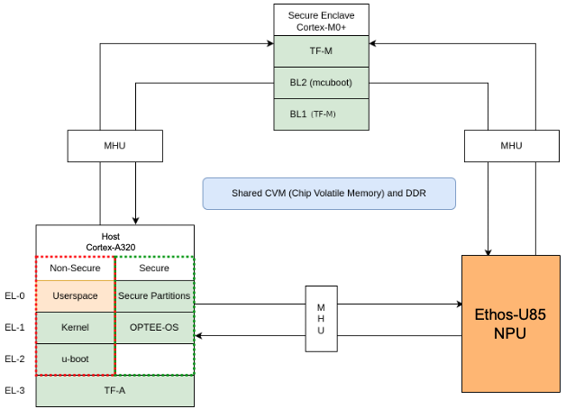
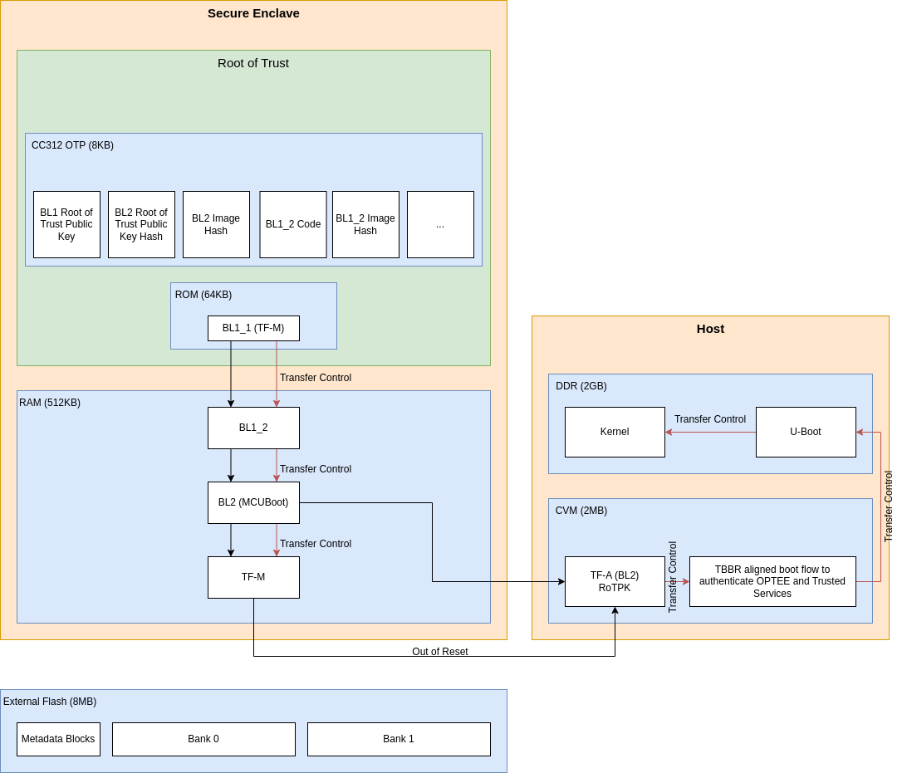
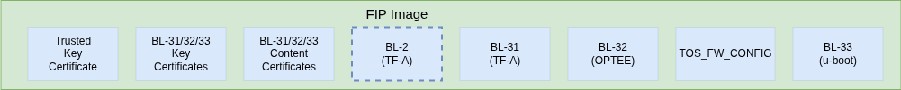
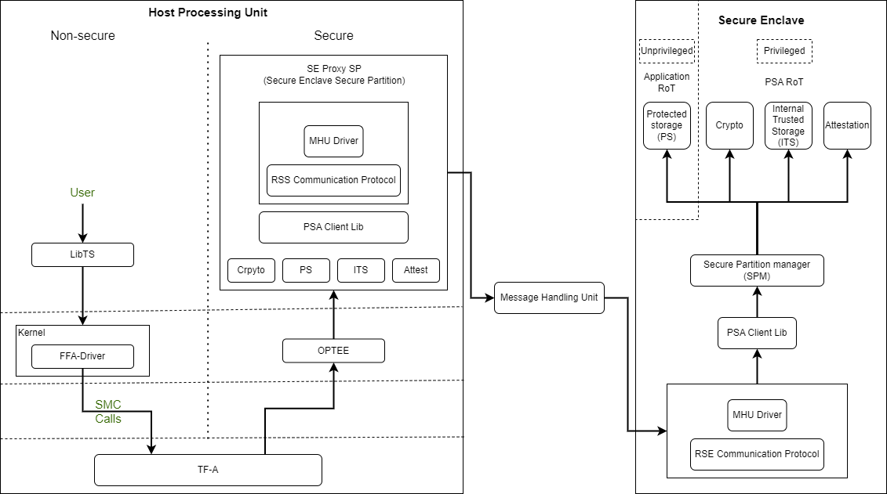
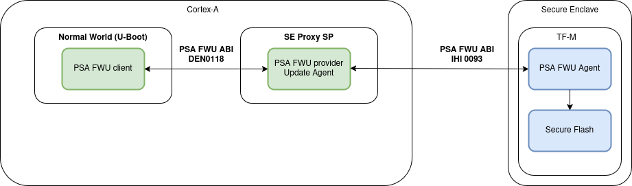
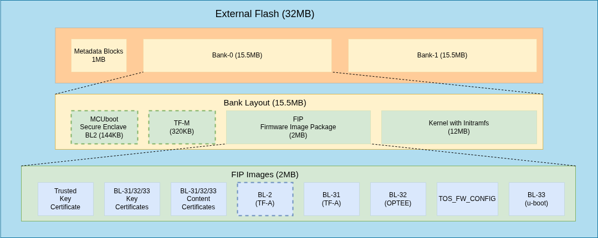
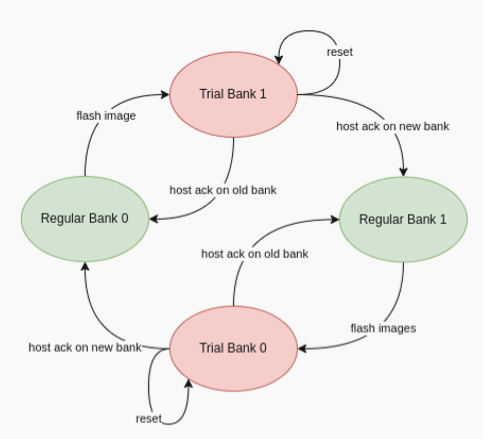
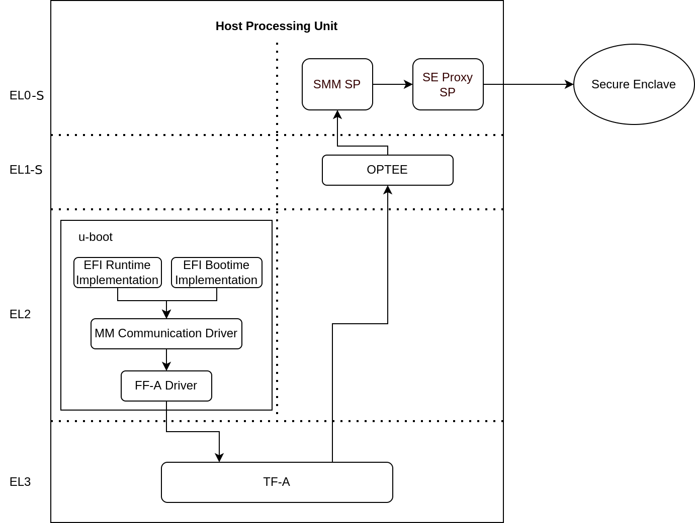

# Software architecture {.chapter permissions=non-confidential}

The combination of Corstone-1000 software and hardware reference solution is [PSA Level-2 ready certified]($psa_l2_ready) as well as [Arm SystemReady Devicetree certified]($systemready_ir_certification). Please rely on the Corstone-1000 platform for certification needs.

More information on the Corstone-1000 subsystems product(s), variants and design can be
found on [Arm Developer]($arm_developer_cs1000_website).

This document explicitly focuses on the software part of the solution and
provides internal details on the software components. The reference
software package of the platform can be retrieved following instructions
present in the user guide document.

## Design overview {.reference}

This variant of the Corstone-1000 platform replaces the Host System's Cortex-A35
processor with a Cortex-A320. In this configuration, the optional External System
(previously a Cortex-M3) is replaced by an Arm Ethos-U85 Neural Processing Unit (NPU).
The Ethos-U85 runs in the direct drive configuration, where the Host System is
responsible for managing the NPU directly.

## Secure boot chain {.reference}

For the security of a device, it is essential that only authorized
software should run on the device.

The Corstone-1000 boot uses a [Secure boot]($arm_developer_secureboot_website) chain process
where an already authenticated image verifies and loads the following software in the chain.

For the boot chain process to work, the start of the chain should be trusted, forming the
Root of Trust (RoT) of the device. The RoT of the device is immutable in
nature and encoded into the device by the device manufacturer before it
is deployed into the field.
In Corstone-1000, the content of the ROM and CC312 One Time Programmable (OTP) memory forms the RoT.

Verification of an image can happen either by comparing the computed and stored hashes, or by
checking the signature of the image if the image is signed.

It is a lengthy chain to boot the software on Corstone-1000.

### TF-M BL1\_1 {.reference}

On power-up, the Secure Enclave begins execution from TF-M BL1\_1, which resides in ROM and serves as
the Root of Trust (RoT) for the device.

TF-M BL1\_1 is the immutable bootloader and is responsible for:

- Provisioning the device during the first boot
- Performing hardware initialization
- Verifying the integrity and authenticity of the next stage in the boot chain

At boot time, TF-M BL1\_1:

- Copies the TF-M BL1\_2 image from OTP to RAM.
- Verifies the integrity of BL1\_2 by comparing its computed hash with the hash stored in OTP.

### TF-M BL1\_2 {.reference}

During provisioning, the TF-M BL1\_2 binary, along with its hashes and cryptographic keys, is stored
in One-Time Programmable (OTP) memory.

Once verified, TF-M BL1\_2:

- Takes control and verifies the next stage in the boot chain, which is TF-M BL2.
- Computes the hash of the BL2 image and compares it with the BL2 hash stored in OTP to ensure
  integrity before transferring execution to BL2.

The TF-M BL1 design details can be found in the [TF-M design documents]($trusted_firmware_m_bl1_website).

:::note
Corstone-1000 has some differences compared to this design due to memory (OTP/ROM) limitations:

- BL1\_1 code size is larger than needed because it handles most of the hardware initialization instead of the BL1\_2.
- BL1\_2 cannot be updated during provisioning time because the provisioning bundle that contains its code is located in the ROM.
- BL1\_2 does not use the post-quantum LMS verification.
- BL2 cannot be updated because it is verified by comparing the computed hash to the hash stored in the OTP.

:::

### TF-M BL2 {.reference}

In this system, TF-M BL2 refers to MCUBoot.

On the first boot, MCUBoot can provision additional cryptographic keys. It is responsible for authenticating both:

- TF-M (Trusted Firmware-M), and
- The initial bootloader of the Host system, [Trusted Firmware-A (TF-A) BL2]($trusted_firmware_a_bl2_website)

This authentication is done by verifying the digital signatures of the respective images.

MCUBoot performs image verification in the following steps:

1. Load the image from non-volatile memory into RAM.
2. Validate the image's signature using the corresponding public key.

:::note
The public key present in the image header is validated by comparing with the hash. Depending on the image, the hash of the public key is either stored in the OTP or part of the software which is being already verified in the previous stages.
:::

The execution control is passed to TF-M after the verification.
As the runtime executable of the Secure Enclave, TF-M initializes itself before
bringing the Host system out of reset.

### Host system authentication {.reference}

The Host system follows the boot standard defined in [Trusted Board Boot Requirements Client]($trusted_board_boot_requirements_client_pdf)
to authenticate the Secure and Non-secure software.

The [Firmware Image Package (FIP)]($trusted_firmware_a_fip_guide) packs bootloader images and
other payloads into a single archive.

The FIP for Corstone-1000 contains:

- Trusted firmware-A BL2
- AP EL3 Runtime firmware, BL31 image
- AP Secure Payload, BL32 image
- AP Normal world firmware -U-boot, BL33 image
- Trusted OS Firmware configuration file used by Trusted OS (BL32), TOS_FW_CONFIG
- Key certificates
- Content certificates

To load and validate TF-A BL2, TF-M BL2 first parses the GUID Partition Table (GPT)
to locate the FIP. It then determines the offset of TF-A BL2 within the FIP.

:::note
TF-M does not check the FIP signature, it only checks the TF-A BL2's signature in the FIP.
:::

The implicitly trusted components are:

- A SHA-256 hash of the Root of Trust Public Key (ROTPK.) For development purposes, a development ROTPK is used and its hash embedded into the TF-A BL2 image. This public key is provided by the TF-A source code.
- TF-A BL2 image - it can be trusted because it has been verified by TF-M BL2 before starting TF-A.

The remaining components in the Chain of Trust (CoT) are either certificates or bootloader images.

#### Bootloader authentication {.reference}

The FIP contains two types of certificates:

- Content Certificates used to store the hash of a bootloader image.
- Key Certificates used to verify public keys used to sign Content Certificates.

The Host system bootloader images are authenticated by computing their hash and comparing it to the corresponding hash found in the Content Certificate.

#### Certificates verification {.reference}

The public keys defined in the Trusted Key Certificate are used to verify the later certificates in
the CoT process. The Trusted Key Certificate is verified with the Root of Trust Public Key.

#### UEFI authenticated variables {.reference}

For UEFI Secure Boot, authenticated variables can be accessed from the secure flash.
The feature has been integrated in U-Boot, which authenticates the images as per the UEFI
specification before executing them.

## Secure services {.reference}

Corstone-1000 is unique in offering a secure environment for running trusted workloads.
While the Host system includes TrustZone technology, the platform also features a hardware-isolated
Secure Enclave, specifically designed to execute these secure workloads.

In Corstone-1000, essential Secure Services—such as Cryptography, Protected Storage,
Internal Trusted Storage, and Attestation—are provided through PSA Functional APIs implemented in TF-M.

From the user's perspective, there is no difference when communicating with these services,
whether they run in the Secure Enclave or in the Secure world of the Host system.
The diagram below illustrates the data flow for such calls.

The Secure Enclave Proxy Secure Partition (SE Proxy SP) is a proxy managed by OP-TEE that forwards
Secure Service calls to the Secure Enclave. This communication uses the
[RSE communication protocol](https://tf-m-user-guide.trustedfirmware.org/platform/arm/rse/rse_comms.html).
While the protocol supports shared memory and MHU interrupts as a doorbell mechanism between cores,
in Corstone-1000, the entire message is currently transmitted through the MHU channels.
Corstone-1000 implements Isolation Level 2 using the Cortex-M0+ Memory Protection Unit (MPU).

Users can define their own secure services to run either in the Host system's Secure World or in
the Secure Enclave. This choice involves a trade-off between latency and security.
Services running in the Secure Enclave benefit from strong, hardware-enforced isolation,
offering higher security but at the cost of increased latency. In contrast, services running in the
Host Secure World experience lower latency, but rely on TrustZone technology for virtualized isolation,
which offers comparatively less robust security.

## PSA secure firmware update {.reference}

The Corstone-1000 platform necessitates a robust, secure, and flexible firmware update mechanism
including partial capsule update to ensure fielded devices can receive critical patches, feature enhancements,
and security fixes without compromising system integrity. To meet these requirements, we have implemented the
Platform Security Architecture (PSA) Firmware Update (FWU) framework on Corstone-1000, leveraging Trusted Firmware-M (TF-M)
for the Secure Enclave, U-Boot as the host-side client on Cortex-A, and the UEFI capsule update mechanism for payload
encapsulation. This design supports the Fixed Virtual Platform (FVP) target, providing consistent behavior across
simulation-based deployments. The Corstone-1000 supports FWU
which complies with the
[Platform Security Firmware Update for the A-profile Arm Architecture]($platform_security_fwu_for_a_profile_pdf)
and [PSA Firmware Update IHI 0093]($psa_firmware_update_ihi_0093_api_reference_website)
specifications.

To standardize and streamline capsule creation with multiple FMP payloads, the
[EDK2 capsule generation tool]($edk2_capsule_generation_tool_repository)
tool has been integrated into the meta-arm Yocto layer for Corstone-1000. This integration involves defining
build rules for generating UEFI capsules as part of the firmware image build process. Configuration parameters
exposed in the recipe allow developers to specify the number of FMP payloads, target image GUIDs, version numbers etc.
This capsule ensures that all update payloads conform to the UEFI FMP specification and are ready for
validation and delivery by U‑Boot.

The FWU solution for Corstone-1000 is composed of three primary domains:

- Host System
- Trusted Services intermediary
- Secure Enclave

Each domain has distinct responsibilities and communicates through standardized interfaces.

On the host side, U-Boot functions as the FWU client and orchestrates the update process from capsule retrieval to
payload delivery based on [PSA FWU DEN0018 specification]($psa_fwu_den0018_specification_website)
via Arm FF-A framework. The Trusted-Services SE Proxy secure partition serves as a gateway between the non-secure host
environment and the Secure Enclave. The [PSA FWU service]($ts_psa_fwu_service_website) running in the Trusted Services
implementation forwards the data to the Secure Enclave via MHU-based PSA calls. Within the Secure Enclave, the PSA FWU
Agent, conforming to [PSA Firmware Update IHI 0093]($psa_firmware_update_ihi_0093_api_reference_website) specification,
orchestrates the actual flash programming, metadata management, and rollback protection mechanisms. The agent relies on a
bespoke [shim layer]($tfm_shim_layer_website) to abstract hardware‑specific flash operations and bootloader interactions.

As defined in the specification, the external flash is divided into two banks: one bank holds the
currently running images, while the other is used to stage new images.

There are four updatable components: **BL2**, **TF-M**, **the FIP** and **the Kernel Image** (the initramfs bundle).
New images are delivered and accepted in the form of UEFI capsules.

When a FWU is initiated on Corstone-1000, the following sequence of operations takes place:

1. Capsule Retrieval and Preparation

   U-Boot on the host system retrieves the firmware capsule.
   It validates the capsule header and parses the FMP (Firmware Management Protocol) descriptor list to identify the payloads to be updated.

   For each FMP descriptor, U-Boot:

   Splits the firmware payload into 4 KiB chunks.
   Invokes the PSA_FWU_Update API for each chunk, transmitting the buffer address via the FF-A (Firmware Framework for Arm) shared memory interface.

2. Secure Transmission and Forwarding

   The PSA Firmware Update (FWU) service, running as part of Trusted Services, receives the chunks through Secure Partition Client (SPC) calls.
   It forwards these chunks to the Secure Enclave using MHU-based PSA calls.

3. Flashing Within the Secure Enclave

   Inside the Secure Enclave, the PSA FWU Agent dispatches each chunk to the shim layer.

   The shim layer:

   Erases the corresponding sectors in the non-active flash bank.
   Writes the received firmware chunks at the correct offsets.
   During partial updates, it also copies static partitions from the active bank to the non-active one to maintain consistency.

4. Finalization and Boot Preparation

   After all chunks are successfully written:

   The shim updates the firmware manifest and the EFI System Resource Table (ESRT) entries to reflect the new image version.
   This step enables the bootloader to recognize the new firmware for a trial boot.
   The platform then performs an automatic reset, booting into the non-active bank in trial mode.

5. Trial Boot and Confirmation

   In trial mode, U-Boot evaluates the new firmware and issues either an accept or reject command using the PSA FWU ABI.
   These commands are sent to the Secure Enclave, instructing the shim to update the firmware metadata accordingly.

6. Recovery and Fallback Mechanism

   If the trial boot is successful, the host sends an acknowledgment, transitioning the firmware state from 'trial' to 'regular'.

   If the system fails or becomes unresponsive:

   A watchdog timer triggers a system reset.
   The BL1 firmware in the Secure Enclave detects repeated failures and reverts to the previously known-good flash bank.
   This rollback mechanism ensures the device remains operational and recoverable, even after a failed update.

## UEFI runtime support in U-Boot {.reference}

The implementation of UEFI boot-time and runtime APIs requires persistent variable storage. In
Corstone-1000, UEFI variables are stored using the Protected Storage (PS) service.

The diagram below illustrates the data flow for storing UEFI variables. U-Boot's UEFI subsystem
communicates with the Secure World using the U-Boot FF-A driver, which interfaces with the
[UEFI System Management Mode (SMM) service]($trusted_services_uefi_smm_website).

The SMM service provides support for the UEFI System Management Mode. This support is implemented by the SMM Gateway secure partition.
The SMM service then uses the Proxy Protected Storage (PS) provided by the SE Proxy SP.
These PS calls are forwarded to the Secure Enclave, following the communication path described earlier.

## References {.reference}

For more information, see:

- [Arm Developer]($arm_developer_cs1000_search)
- [Arm Security Architectures]($arm_architecture_security_features_platform_security)
